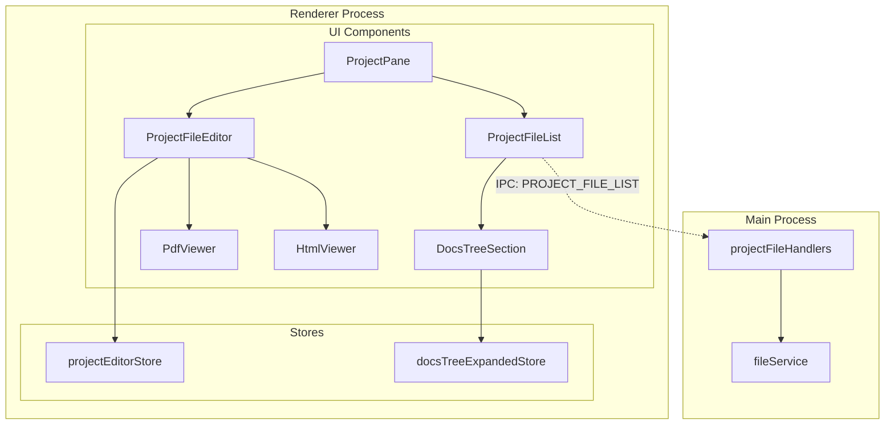
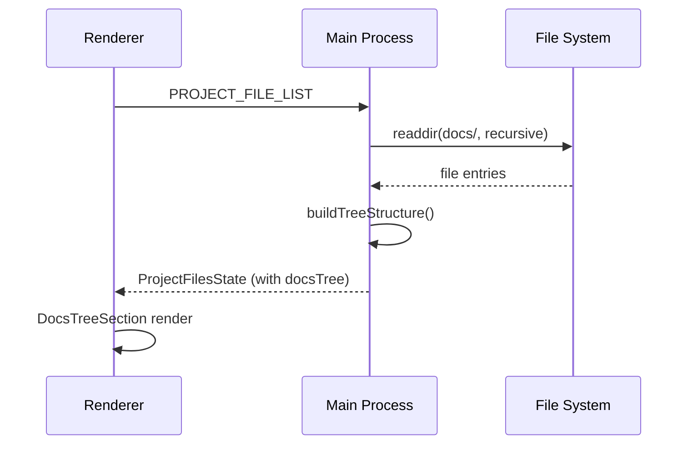
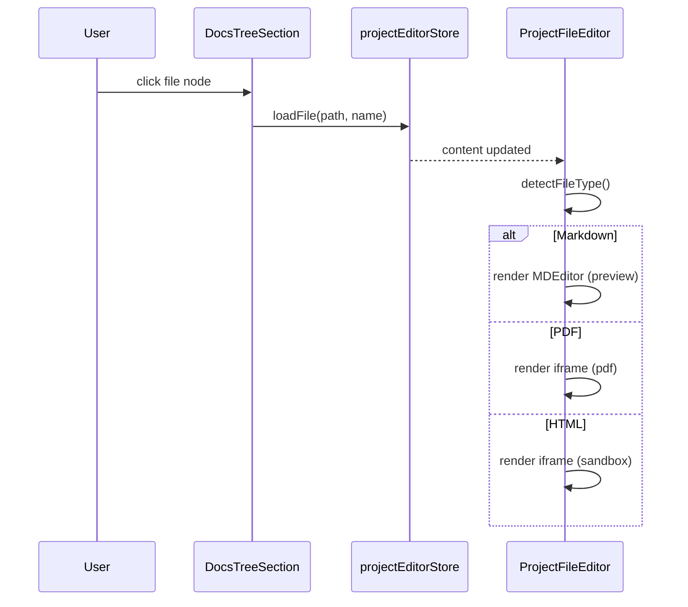
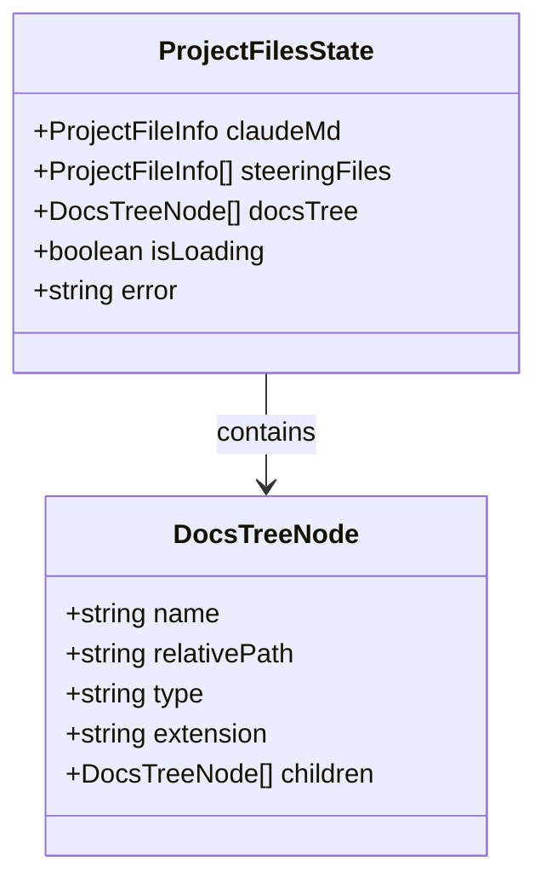

# Design: Project Docs Viewer

## Overview

**Purpose**: この機能はProjectsタブのファイル閲覧機能に `docs/` フォルダを追加し、プロジェクトドキュメントへの素早いアクセスを提供する。

**Users**: SDD Orchestratorを使用する開発者がプロジェクトドキュメント（`.md`, `.pdf`, `.html`）を閲覧する。

**Impact**: 既存の `ProjectFileList` コンポーネントに新規 "Docs" セクションを追加し、ツリー構造でサブフォルダを表示可能にする。

### Goals

- `docs/` フォルダ内のファイルを再帰的に取得しツリー構造で表示
- フォルダの展開/折りたたみ機能の提供
- `.md`, `.pdf`, `.html` ファイルの適切な表示
- タブ切り替え時の選択状態とツリー展開状態の保持

### Non-Goals

- ファイルの新規作成・削除・編集機能
- `docs/` フォルダ外のファイル閲覧
- ツリー展開状態の永続化（localStorage/electron-store）
- Remote UI 対応（Electron版のみ先行実装）
- 検索機能

## Architecture

### Existing Architecture Analysis

既存の `ProjectFileList` コンポーネントは以下の構造を持つ:
- CLAUDE.md セクション（単一ファイル）
- Steering Files セクション（フラットリスト）

本機能は Docs セクションを追加し、ツリー構造で表示する。ツリーUI実装は既存の `GitFileTree` コンポーネントのパターンを参考にする。

### Architecture Pattern & Boundary Map



**Key Decisions**:
- 既存の `projectEditorStore` を選択ファイル保持に活用（要件4.4）
- 新規 `docsTreeExpandedStore` でツリー展開状態をオンメモリ管理
- `DocsTreeSection` コンポーネントを新規作成（GitFileTree パターンを踏襲）
- PDF/HTML 表示は iframe ベースの軽量実装

### Technology Stack

| Layer | Choice / Version | Role in Feature | Notes |
|-------|------------------|-----------------|-------|
| Frontend | React 19 | ツリーUI, Viewer | 既存スタック |
| State | Zustand | 展開状態管理 | shared/stores/ に配置 |
| Icons | Lucide React | ファイル/フォルダアイコン | 既存ライブラリ |
| PDF | iframe (native) | PDF プレビュー | 追加依存なし |
| HTML | iframe (sandbox) | HTML プレビュー | セキュリティ対策 |

## System Flows

### ファイル一覧取得フロー



**Key Decisions**:
- 既存 `PROJECT_FILE_LIST` ハンドラを拡張（新規 IPC チャンネル不要）
- ツリー構造は Main Process 側で構築し、Renderer は表示のみ担当
- 隠しファイル除外とソートは Main Process で実行

### ファイル選択・表示フロー



**Key Decisions**:
- ファイル選択は既存 `projectEditorStore.loadFile` を再利用
- ファイル種別判定はファイル拡張子で実施（要件6.1-6.3）
- PDF/HTML は iframe で表示し、セキュリティ対策として sandbox 属性を適用

## Requirements Traceability

| Criterion ID | Summary | Components | Implementation Approach |
|--------------|---------|------------|------------------------|
| 1.1 | docs/内のファイルを再帰取得、階層構造保持 | `projectFileHandlers`, `listDocsFilesCore` | 新規: `listDocsFilesCore` 関数追加 |
| 1.2 | docs/未存在時は空配列 | `listDocsFilesCore` | 新規: エラーハンドリング追加 |
| 1.3 | ファイル名アルファベット順ソート | `listDocsFilesCore` | 新規: ソートロジック追加 |
| 1.4 | 隠しファイル除外 | `listDocsFilesCore` | 新規: フィルタリング追加 |
| 2.1 | ツリー構造表示 | `DocsTreeSection` | 新規コンポーネント作成 |
| 2.2 | フォルダ展開/折りたたみ | `DocsTreeSection`, `docsTreeExpandedStore` | 新規: 展開状態管理ストア |
| 2.3 | ファイルクリックでエディタ表示 | `DocsTreeSection`, `projectEditorStore` | 既存: `loadFile` 再利用 |
| 2.4 | フォルダ/ファイルアイコン表示 | `DocsTreeSection` | 新規: Lucide アイコン使用 |
| 2.5 | インデントによるネスト表示 | `DocsTreeSection` | 新規: depth ベースの paddingLeft |
| 3.1 | 展開状態オンメモリ保持 | `docsTreeExpandedStore` | 新規ストア作成 |
| 3.2 | タブ切替時の展開状態復元 | `docsTreeExpandedStore` | 新規: ストア永続（オンメモリ） |
| 3.3 | アプリ再起動時リセット | `docsTreeExpandedStore` | 設計: Zustand デフォルト動作 |
| 3.4 | 初期状態は全折りたたみ | `docsTreeExpandedStore` | 新規: initialState = empty Map |
| 4.1 | 選択ファイルパス保持 | `projectEditorStore` | 既存: `currentFilePath` 再利用 |
| 4.2 | タブ移動後の選択復元 | `projectEditorStore` | 既存: ストア永続（オンメモリ） |
| 4.3 | 存在しないファイル選択クリア | `projectEditorStore` | 新規: ファイル存在チェック追加 |
| 4.4 | projectEditorStore活用 | `projectEditorStore` | 既存: 再利用 |
| 5.1 | セクション順序（CLAUDE.md, Steering, Docs） | `ProjectFileList` | 変更: Docs セクション追加 |
| 5.2 | セクションヘッダー表示 | `ProjectFileList` | 変更: SectionHeader 再利用 |
| 5.3 | 空/未存在時の表示 | `DocsTreeSection` | 新規: 空状態表示 |
| 6.1 | .md ファイル表示 | `ProjectFileEditor` | 既存: MDEditor 再利用 |
| 6.2 | .pdf ファイル表示 | `PdfViewer` | 新規コンポーネント作成 |
| 6.3 | .html ファイル表示 | `HtmlViewer` | 新規コンポーネント作成 |
| 6.4 | ファイル形式別アイコン | `DocsTreeSection` | 新規: 拡張子ベースアイコン |

### Coverage Validation Checklist

- [x] Every criterion ID from requirements.md appears in the table above
- [x] Each criterion has specific component names (not generic references)
- [x] Implementation approach distinguishes "reuse existing" vs "new implementation"
- [x] User-facing criteria specify concrete UI components

## Components and Interfaces

| Component | Domain/Layer | Intent | Req Coverage | Key Dependencies | Contracts |
|-----------|--------------|--------|--------------|------------------|-----------|
| DocsTreeSection | UI | docs/フォルダのツリー表示 | 2.1-2.5, 5.3, 6.4 | docsTreeExpandedStore (P0), projectEditorStore (P0) | State |
| docsTreeExpandedStore | Store | ツリー展開状態管理 | 3.1-3.4 | - | State |
| PdfViewer | UI | PDF ファイル表示 | 6.2 | - | - |
| HtmlViewer | UI | HTML ファイル表示 | 6.3 | - | - |
| listDocsFilesCore | Service | docs/ファイル取得 | 1.1-1.4 | fs (P0) | Service |
| DocsTreeNode | Type | ツリーノード型定義 | - | - | - |

### Store Layer

#### docsTreeExpandedStore

| Field | Detail |
|-------|--------|
| Intent | docs/ ツリーの展開/折りたたみ状態をオンメモリ管理 |
| Requirements | 3.1, 3.2, 3.3, 3.4 |

**Responsibilities & Constraints**
- フォルダパスをキーとした展開状態（boolean）の管理
- セッション中のみ有効（永続化不要）
- 初期状態は全フォルダ折りたたみ（空 Map）

**Dependencies**
- なし（独立したストア）

**Contracts**: State [x]

##### State Management

```typescript
interface DocsTreeExpandedState {
  /** フォルダパス -> 展開状態 */
  expandedDirs: Map<string, boolean>;
}

interface DocsTreeExpandedActions {
  /** フォルダ展開/折りたたみ切替 */
  toggleDir: (dirPath: string) => void;
  /** 全リセット（アプリ再起動相当） */
  reset: () => void;
}
```

- Preconditions: なし
- Postconditions: `toggleDir` 後、`expandedDirs.get(dirPath)` は反転した値を返す
- Invariants: `expandedDirs` は常に Map インスタンス

**Implementation Notes**
- Integration: `shared/stores/` に配置（Remote UI 対応準備）
- Risks: なし（シンプルな状態管理）

### UI Layer

#### DocsTreeSection

| Field | Detail |
|-------|--------|
| Intent | docs/ フォルダのツリー構造をUI表示 |
| Requirements | 2.1, 2.2, 2.3, 2.4, 2.5, 5.3, 6.4 |

**Responsibilities & Constraints**
- ツリーノードの再帰的レンダリング
- フォルダ展開/折りたたみ UI
- ファイル選択時の `projectEditorStore.loadFile` 呼び出し
- 拡張子ベースのアイコン表示

**Dependencies**
- Inbound: ProjectFileList - ツリーデータ受け渡し (P0)
- Outbound: docsTreeExpandedStore - 展開状態管理 (P0)
- Outbound: projectEditorStore - ファイル選択 (P0)

**Contracts**: State [x]

##### Service Interface

```typescript
interface DocsTreeSectionProps {
  /** ツリー構造データ */
  docsTree: DocsTreeNode[];
  /** プロジェクトルートパス */
  projectPath: string;
  /** 選択中ファイルパス */
  selectedFilePath: string | null;
  /** ファイル選択コールバック */
  onSelectFile: (filePath: string, fileName: string) => void;
}
```

- Preconditions: `docsTree` は有効なツリー構造
- Postconditions: ファイルクリック時 `onSelectFile` が呼ばれる
- Invariants: UI 状態は `docsTreeExpandedStore` と同期

**Implementation Notes**
- Integration: GitFileTree パターンを参考に実装
- Validation: 空ツリー時は「ファイルなし」表示
- Risks: 深いネスト時のパフォーマンス（100+ ファイル時は仮想化検討）

#### PdfViewer (Summary)

| Field | Detail |
|-------|--------|
| Intent | PDF ファイルの iframe 表示 |
| Requirements | 6.2 |
| Implementation | `<iframe src={pdfUrl} />` で表示 |

#### HtmlViewer (Summary)

| Field | Detail |
|-------|--------|
| Intent | HTML ファイルのサンドボックス表示 |
| Requirements | 6.3 |
| Implementation | `<iframe sandbox="allow-same-origin" srcdoc={content} />` |

### Service Layer

#### listDocsFilesCore

| Field | Detail |
|-------|--------|
| Intent | docs/ フォルダのファイルを再帰取得しツリー構造で返す |
| Requirements | 1.1, 1.2, 1.3, 1.4 |

**Responsibilities & Constraints**
- `{projectPath}/docs/` を再帰的に走査
- `.md`, `.pdf`, `.html` ファイルのみ取得
- 隠しファイル/フォルダ除外
- アルファベット順ソート（フォルダ内）

**Dependencies**
- External: Node.js fs/promises - ファイルシステムアクセス (P0)

**Contracts**: Service [x]

##### Service Interface

```typescript
interface DocsTreeNode {
  /** ノード名（ファイル名またはフォルダ名） */
  name: string;
  /** 相対パス（docs/ からの相対） */
  relativePath: string;
  /** ノード種別 */
  type: 'file' | 'directory';
  /** ファイル拡張子（file の場合のみ） */
  extension?: 'md' | 'pdf' | 'html';
  /** 子ノード（directory の場合のみ） */
  children?: DocsTreeNode[];
}

function listDocsFilesCore(projectPath: string): Promise<DocsTreeNode[]>;
```

- Preconditions: `projectPath` は有効なディレクトリパス
- Postconditions: docs/ 未存在時は空配列を返す
- Invariants: 戻り値は常に配列（エラーでも空配列）

**Implementation Notes**
- Integration: `projectFileHandlers.ts` に追加
- Validation: ファイル拡張子チェック、隠しファイルフィルタ
- Risks: 大量ファイル時のパフォーマンス（初回読込のみ）

## Data Models

### Domain Model



**Business Rules & Invariants**:
- `DocsTreeNode.type === 'file'` の場合、`extension` は必須
- `DocsTreeNode.type === 'directory'` の場合、`children` は配列（空でも可）

### Logical Data Model

**ProjectFilesState 拡張**:

```typescript
interface ProjectFilesState {
  claudeMd: ProjectFileInfo | null;
  steeringFiles: ProjectFileInfo[];
  /** 新規: docs/ ツリー構造 */
  docsTree: DocsTreeNode[];
  isLoading: boolean;
  error: string | null;
}
```

## Error Handling

### Error Strategy

| Error Type | Response | Recovery |
|------------|----------|----------|
| docs/ 未存在 | 空配列を返す | 自動（正常系として扱う） |
| ファイル読込失敗 | エラーメッセージ表示 | 再選択でリトライ |
| PDF 表示失敗 | iframe エラー表示 | ブラウザ標準動作 |
| HTML 表示失敗 | サンドボックスエラー | ブラウザ標準動作 |

### Monitoring

- 既存の `projectLogger` を使用
- ファイル取得エラーは DEBUG レベルでログ出力

## Testing Strategy

### Unit Tests

- `docsTreeExpandedStore`: `toggleDir`, `reset` 動作検証
- `listDocsFilesCore`: ツリー構築、ソート、フィルタリング検証
- `DocsTreeSection`: レンダリング、イベントハンドリング検証

### Integration Tests

- `PROJECT_FILE_LIST` IPC: docs/ 含む結果の検証
- `ProjectPane` + `DocsTreeSection`: ファイル選択フロー

### E2E/UI Tests

- docs/ ツリー展開/折りたたみ操作
- PDF/HTML ファイル表示

## Verification Contract

### User Journey Definition

| Journey ID | Operation Flow | Expected Result | E2E Required |
|------------|---------------|-----------------|--------------|
| UJ-001 | Project選択 -> Projectタブ -> Docsセクション確認 | docs/ツリーが表示される | Yes |
| UJ-002 | Docsセクション -> フォルダクリック | フォルダが展開/折りたたみ | Yes |
| UJ-003 | Docsセクション -> .mdファイル選択 | エディタにMarkdown表示 | Yes |
| UJ-004 | Docsセクション -> .pdfファイル選択 | iframe にPDF表示 | Yes |
| UJ-005 | タブ切替(Spec->Project) | 以前の選択・展開状態が復元 | Yes |

### Impact Analysis Contract

| Target File | Action | Reason |
|-------------|--------|--------|
| `src/shared/api/types.ts` | UPDATE | `ProjectFilesState` に `docsTree` フィールド追加 |
| `src/main/ipc/projectFileHandlers.ts` | UPDATE | `listProjectFilesCore` に docs/ 取得ロジック追加 |
| `src/renderer/components/ProjectFileList.tsx` | UPDATE | Docs セクション追加 |
| `src/renderer/components/ProjectFileEditor.tsx` | UPDATE | PDF/HTML ファイル検出・Viewer 切替 |
| `src/shared/stores/docsTreeExpandedStore.ts` | CREATE | ツリー展開状態管理ストア |
| `src/shared/components/project/DocsTreeSection.tsx` | CREATE | ツリー表示コンポーネント |
| `src/shared/components/project/PdfViewer.tsx` | CREATE | PDF 表示コンポーネント |
| `src/shared/components/project/HtmlViewer.tsx` | CREATE | HTML 表示コンポーネント |
| `src/shared/stores/index.ts` | UPDATE | `docsTreeExpandedStore` エクスポート追加 |
| `src/shared/components/project/index.ts` | UPDATE | 新規コンポーネントエクスポート追加 |

## Security Considerations

### HTML Viewer サンドボックス設定

HTML ファイル表示時のセキュリティ対策:

```html
<iframe
  sandbox="allow-same-origin"
  srcdoc={sanitizedContent}
/>
```

- `allow-scripts` 禁止: JavaScript 実行を防止
- `allow-forms` 禁止: フォーム送信を防止
- `allow-popups` 禁止: ポップアップウィンドウを防止

### PDF Viewer

- ブラウザ内蔵 PDF ビューアを使用（追加プラグイン不要）
- ファイルパスは `file://` プロトコルで Electron 内部から提供

## Design Decisions

### DD-001: projectEditorStore の再利用

| Field | Detail |
|-------|--------|
| Status | Accepted |
| Context | docs/ ファイル選択状態をどのストアで管理するか |
| Decision | 既存の `projectEditorStore` を再利用する |
| Rationale | 要件4.4で明示的に指定されており、既存の `currentFilePath`, `loadFile` がそのまま使用可能 |
| Alternatives Considered | 新規 `docsEditorStore` 作成 - 重複コードが増える |
| Consequences | ストア設計の一貫性維持、Steering/CLAUDE.md と同じ選択体験 |

### DD-002: ツリー展開状態の新規ストア

| Field | Detail |
|-------|--------|
| Status | Accepted |
| Context | ツリー展開状態をどこで管理するか |
| Decision | 新規 `docsTreeExpandedStore` を `shared/stores/` に作成 |
| Rationale | 既存ストアに適切な場所がなく、Remote UI 対応を見据えて shared に配置 |
| Alternatives Considered | `projectEditorStore` に統合 - 関心の分離が崩れる |
| Consequences | 将来の Remote UI 対応が容易、単一責任原則の維持 |

### DD-003: GitFileTree パターンの踏襲

| Field | Detail |
|-------|--------|
| Status | Accepted |
| Context | ツリー UI の実装パターン |
| Decision | 既存 `GitFileTree` コンポーネントの設計パターンを踏襲 |
| Rationale | 実績のある実装パターン、プロジェクト内の一貫性 |
| Alternatives Considered | 外部ツリーライブラリ導入 - 依存追加、学習コスト |
| Consequences | コードベースの一貫性、メンテナンス性向上 |

### DD-004: iframe ベースの PDF/HTML 表示

| Field | Detail |
|-------|--------|
| Status | Accepted |
| Context | PDF/HTML ファイルの表示方法 |
| Decision | ブラウザ内蔵機能（iframe）を使用 |
| Rationale | 追加依存なし、Electron 環境で動作確認済み、セキュリティ対策が容易 |
| Alternatives Considered | pdf.js 導入 - バンドルサイズ増加、カスタマイズ不要 |
| Consequences | 軽量実装、ブラウザ互換性に依存 |

### DD-005: Main Process でのツリー構築

| Field | Detail |
|-------|--------|
| Status | Accepted |
| Context | ツリー構造をどこで構築するか |
| Decision | Main Process（`listDocsFilesCore`）でツリー構造を構築 |
| Rationale | ファイルシステムアクセスは Main Process の責務、IPC 往復を1回に削減 |
| Alternatives Considered | Renderer でフラットリストからツリー構築 - 追加の変換処理が必要 |
| Consequences | IPC ペイロードはネスト構造だがファイル数に比例、パフォーマンス影響は軽微 |
