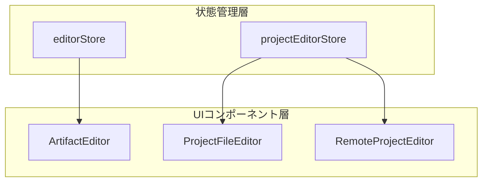
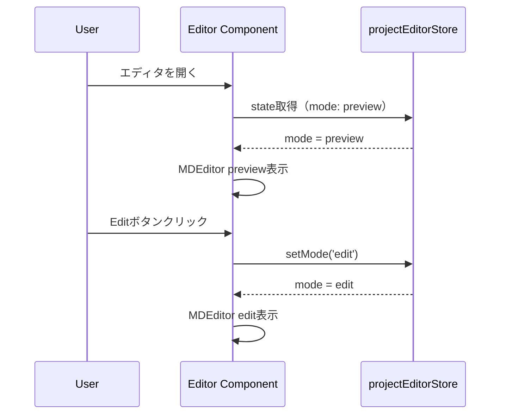

# Design Document: Project Editor Dark Mode & UI統一

## Overview

**Purpose**: この機能は、ProjectファイルエディタのUI/UXをArtifactEditor（Spec/Bug用）と統一し、一貫したダークモード体験とデフォルト表示モードを提供する。

**Users**: SDD Orchestratorを使用する開発者が、どのエディタでも同一のビジュアル体験と操作感を得られるようになる。

**Impact**: 既存の`ProjectFileEditor`（Electron）と`RemoteProjectEditor`（Remote UI）のカラーモード、デフォルト表示モード、編集/プレビュー切り替えUIを変更する。

### Goals

- ProjectFileEditorとRemoteProjectEditorのカラーモードをダークモード固定にする
- 全エディタのデフォルト表示モードを`preview`に変更する
- 編集/プレビュー切り替えUIをArtifactEditorと同じボタングループスタイルに統一する

### Non-Goals

- システム設定に連動したカラーモード切り替え機能（将来検討）
- 検索機能のProjectFileEditor/RemoteProjectEditorへの追加
- ツールバー表示/非表示の統一

## Architecture

### Existing Architecture Analysis

現在のエディタ構成:

| エディタ | 用途 | カラーモード | デフォルトモード | 切り替えUI |
|----------|------|--------------|------------------|------------|
| ArtifactEditor | Spec/Bugアーティファクト | `dark` | `edit` | ボタングループ |
| ProjectFileEditor | Projectファイル（Electron） | `light` | `edit` | シングルボタン |
| RemoteProjectEditor | Projectファイル（Remote UI） | `auto` | `edit`（固定） | なし |

**既存パターン**:
- `editorStore.ts`: ArtifactEditor用の状態管理（`mode: 'edit' | 'preview'`）
- `projectEditorStore.ts`: ProjectFileEditor/RemoteProjectEditor用の状態管理（同上）
- 両ストアでモード管理の型定義は同一

### Architecture Pattern & Boundary Map



**Key Decisions**:
- ストア層の変更: `projectEditorStore.ts`のデフォルトモードを`preview`に変更
- コンポーネント層の変更: 両ProjectEditorのUIを統一パターンに合わせる
- ArtifactEditor側の変更: `editorStore.ts`のデフォルトモードを`preview`に変更

### Technology Stack

| Layer | Choice / Version | Role in Feature | Notes |
|-------|------------------|-----------------|-------|
| Frontend | React 19, @uiw/react-md-editor | MDEditorコンポーネント | `data-color-mode`属性でカラーモード制御 |
| State | Zustand | エディタモード管理 | `mode`プロパティの初期値変更 |
| UI | Lucide React (Edit, Eye icons) | 切り替えボタンアイコン | 既存使用パターンを踏襲 |

## System Flows

単純なUI属性変更のため、複雑なフローは発生しない。ユーザー操作フロー:



**Key Decisions**:
- ファイル読み込み時のモードリセットは行わない（ストアのデフォルト値を使用）
- モード切り替えはストアを通じて永続化されない（UIの一時状態）

## Requirements Traceability

| Criterion ID | Summary | Components | Implementation Approach |
|--------------|---------|------------|------------------------|
| 1.1 | ProjectFileEditorの`data-color-mode`が`dark` | ProjectFileEditor | UPDATE: `data-color-mode="dark"`に変更 |
| 1.2 | RemoteProjectEditorの`data-color-mode`が`dark` | RemoteProjectEditor | UPDATE: `data-color-mode="dark"`に変更 |
| 1.3 | MDEditorがダークモードで表示 | ProjectFileEditor, RemoteProjectEditor | 1.1, 1.2により自動達成 |
| 2.1 | editorStoreの初期modeがpreview | editorStore | UPDATE: initialStateのmode値変更 |
| 2.2 | projectEditorStoreの初期modeがpreview | projectEditorStore | UPDATE: initialStateのmode値変更 |
| 2.3 | 全エディタでファイル読込時にプレビュー表示 | ArtifactEditor, ProjectFileEditor, RemoteProjectEditor | 2.1, 2.2により自動達成 |
| 3.1 | ProjectFileEditorの切り替えUIがボタングループスタイル | ProjectFileEditor | UPDATE: ArtifactEditorのUIパターンを適用 |
| 3.2 | RemoteProjectEditorに切り替えUI追加 | RemoteProjectEditor | UPDATE: ボタングループUIを新規追加 |
| 3.3 | 切り替えUIのスタイルがArtifactEditorと一致 | ProjectFileEditor, RemoteProjectEditor | 既存パターン（clsx, Tailwind）を踏襲 |

### Coverage Validation Checklist

- [x] Every criterion ID from requirements.md appears in the table above
- [x] Each criterion has specific component names (not generic references)
- [x] Implementation approach distinguishes "reuse existing" vs "new implementation"
- [x] User-facing criteria specify concrete UI components

## Components and Interfaces

| Component | Domain/Layer | Intent | Req Coverage | Key Dependencies | Contracts |
|-----------|--------------|--------|--------------|------------------|-----------|
| editorStore | State | Spec/Bug用エディタ状態管理 | 2.1 | - | State |
| projectEditorStore | State | Project用エディタ状態管理 | 2.2 | - | State |
| ProjectFileEditor | UI/Electron | Projectファイル編集UI | 1.1, 3.1, 3.3 | projectEditorStore (P0) | - |
| RemoteProjectEditor | UI/Remote | Remote用Projectファイル編集UI | 1.2, 3.2, 3.3 | projectEditorStore (P0) | - |

### State Layer

#### editorStore

| Field | Detail |
|-------|--------|
| Intent | Spec/Bugアーティファクト用エディタ状態を管理 |
| Requirements | 2.1 |

**Responsibilities & Constraints**
- `mode`プロパティの初期値を`'preview'`に変更
- 既存の型定義・APIは変更なし

**Contracts**: State [x]

##### State Management

```typescript
// Initial state change only
const initialState: EditorState = {
  // ... existing properties
  mode: 'preview', // Changed from 'edit'
  // ...
};
```

- State model: 変更なし
- Persistence & consistency: メモリ内のみ（永続化なし）
- Concurrency strategy: 単一コンポーネントからのアクセス

#### projectEditorStore

| Field | Detail |
|-------|--------|
| Intent | Projectファイル用エディタ状態を管理 |
| Requirements | 2.2 |

**Responsibilities & Constraints**
- `mode`プロパティの初期値を`'preview'`に変更
- 既存の型定義・APIは変更なし

**Contracts**: State [x]

##### State Management

```typescript
// Initial state change only
const initialState: ProjectEditorState = {
  // ... existing properties
  mode: 'preview', // Changed from 'edit'
  // ...
};
```

### UI Layer

#### ProjectFileEditor

| Field | Detail |
|-------|--------|
| Intent | Electron版Projectファイル編集UIを提供 |
| Requirements | 1.1, 3.1, 3.3 |

**Responsibilities & Constraints**
- `data-color-mode`を`"dark"`に固定
- 編集/プレビュー切り替えUIをボタングループスタイルに変更
- 既存のファイル読み込み・保存ロジックは変更なし

**Dependencies**
- Inbound: ProjectPane - ファイル選択時にレンダリング (P0)
- Outbound: projectEditorStore - 状態管理 (P0)

**Implementation Notes**
- Integration: 既存のモード切り替えボタンをArtifactEditorと同じ2ボタン構成に置換
- Validation: 既存テストのUIセレクタ更新が必要

#### RemoteProjectEditor

| Field | Detail |
|-------|--------|
| Intent | Remote UI版Projectファイル編集UIを提供 |
| Requirements | 1.2, 3.2, 3.3 |

**Responsibilities & Constraints**
- `data-color-mode`を`"dark"`に固定
- 編集/プレビュー切り替えUIを新規追加（ボタングループスタイル）
- 現在は`preview="edit"`固定だが、ストアの`mode`を使用するように変更

**Dependencies**
- Inbound: ProjectDetailPage - ファイル選択時にレンダリング (P0)
- Outbound: projectEditorStore - 状態管理 (P0)

**Implementation Notes**
- Integration: ヘッダー部分に切り替えUIを追加
- Risks: Remote UIでの動作確認が必要

## Error Handling

この機能はUI表示の変更のみであり、新たなエラーシナリオは発生しない。

## Testing Strategy

### Unit Tests

- `projectEditorStore.test.ts`: 初期`mode`が`'preview'`であることを検証
- `editorStore.test.ts`: 初期`mode`が`'preview'`であることを検証

### Integration Tests

- `ProjectFileEditor.test.tsx`: ボタングループUIの存在とモード切り替え動作を検証
- `RemoteProjectEditor.test.tsx`: 新規追加された切り替えUIの動作を検証

### E2E/UI Tests

- ProjectFileEditorでダークモード表示されることを視覚的に確認
- RemoteProjectEditorでダークモード表示されることを視覚的に確認
- ファイルを開いた際にプレビューモードで表示されることを確認

## Verification Contract

### User Journey Definition

| Journey ID | Operation Flow | Expected Result | E2E Required |
|------------|---------------|-----------------|--------------|
| UJ-001 | ProjectPaneでファイルを選択 | プレビューモードでダークテーマ表示 | Yes |
| UJ-002 | ProjectFileEditorでEditボタンクリック | 編集モードに切り替わる | Yes |
| UJ-003 | Remote UIでProjectファイルを選択 | プレビューモードでダークテーマ表示 | No |
| UJ-004 | RemoteProjectEditorでEditボタンクリック | 編集モードに切り替わる | No |

### Impact Analysis Contract

| Target File | Action | Reason |
|-------------|--------|--------|
| `src/renderer/stores/editorStore.ts` | UPDATE | 初期modeを'preview'に変更 |
| `src/shared/stores/projectEditorStore.ts` | UPDATE | 初期modeを'preview'に変更 |
| `src/renderer/components/ProjectFileEditor.tsx` | UPDATE | data-color-mode変更、切り替えUI変更 |
| `src/remote-ui/components/RemoteProjectEditor.tsx` | UPDATE | data-color-mode変更、切り替えUI追加 |
| `src/renderer/stores/editorStore.test.ts` | UPDATE | 初期mode検証の期待値変更 |
| `src/shared/stores/projectEditorStore.test.ts` | UPDATE | 初期mode検証の期待値変更 |
| `src/renderer/components/ProjectFileEditor.test.tsx` | UPDATE | UI変更に伴うテスト更新 |
| `src/remote-ui/components/RemoteProjectEditor.test.tsx` | UPDATE | 切り替えUI追加に伴うテスト追加 |

## Integration Test Strategy

この機能は単純なUI属性変更とストア初期値変更のため、クロスバウンダリ通信は発生しない。既存の単体テストとE2Eテストで十分にカバーされる。

## Design Decisions

### DD-001: カラーモードをdark固定

| Field | Detail |
|-------|--------|
| Status | Accepted |
| Context | ProjectFileEditorは`light`、RemoteProjectEditorは`auto`を使用しており、ArtifactEditor（`dark`）と不統一 |
| Decision | 両エディタの`data-color-mode`を`"dark"`に固定する |
| Rationale | ArtifactEditorとの完全な統一がユーザー要求。将来的なシステム準拠対応は別Specで実施 |
| Alternatives Considered | `auto`に統一 - システム設定連動は魅力的だが、ArtifactEditorとの不統一が残る |
| Consequences | ライトモードユーザーには強制ダークモードとなるが、Decision Logに記載の通りユーザー合意済み |

### DD-002: デフォルト表示モードをpreviewに変更

| Field | Detail |
|-------|--------|
| Status | Accepted |
| Context | 全エディタのデフォルトモードが`edit`だが、ユーザーはドキュメント閲覧が主用途 |
| Decision | `editorStore`と`projectEditorStore`の初期`mode`を`'preview'`に変更 |
| Rationale | ユーザーリクエスト。ドキュメント閲覧が主用途のため、プレビュー表示がデフォルトとして自然 |
| Alternatives Considered | エディタごとに個別設定 - コードの複雑化と設定管理コストが増加 |
| Consequences | 編集目的のユーザーは1クリック追加で編集モードに切り替える必要がある |

### DD-003: ボタングループスタイルの採用

| Field | Detail |
|-------|--------|
| Status | Accepted |
| Context | ProjectFileEditorはシングルボタン、RemoteProjectEditorは切り替えUIなし |
| Decision | 両エディタにArtifactEditorと同じボタングループ（Edit/Preview横並び）を採用 |
| Rationale | UI一貫性の確保。ユーザーがどのエディタでも同じ操作感を得られる |
| Alternatives Considered | トグルスイッチ - モダンだがArtifactEditorとの不統一が残る |
| Consequences | 既存テストのUIセレクタ更新が必要 |
