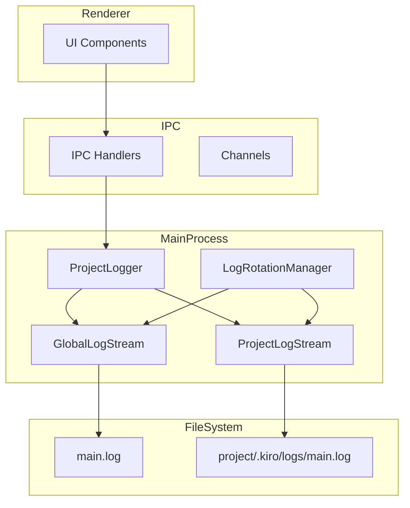
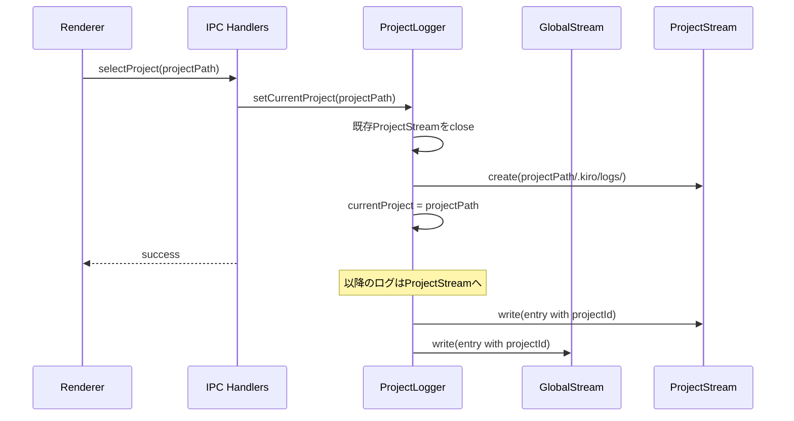
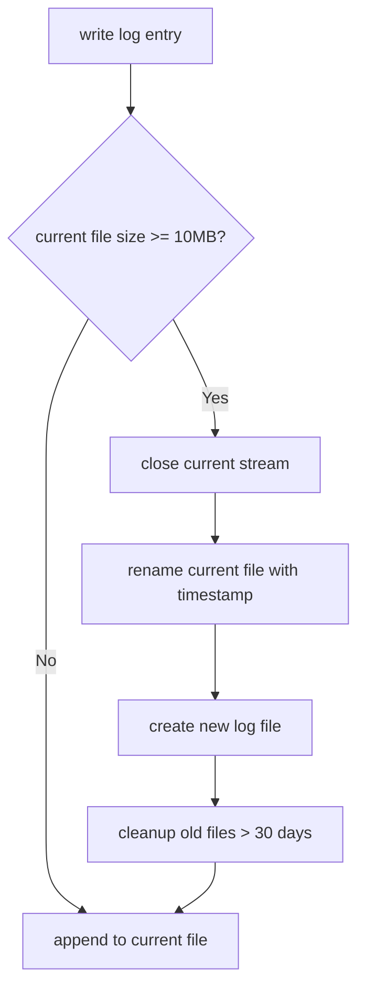

# Technical Design Document

## Overview

**Purpose**: 本機能は、SDD Orchestratorのメインプロセスログをプロジェクト単位で分割し、デバッグ効率を向上させる。

**Users**: 開発者がプロジェクト固有の問題を調査する際に、関連するログエントリを素早く特定できるようになる。

**Impact**: 現在の単一 `main.log` ファイルへの集約ログ記録を、プロジェクト別ログファイル + グローバルログのハイブリッド構成に変更する。既存の `logger` シングルトンインターフェースは維持しつつ、内部でプロジェクトコンテキストを追跡する。

### Goals

- プロジェクト毎に独立したログファイルを `{projectPath}/.kiro/logs/` に作成する
- グローバルイベント（アプリ起動・終了）は従来の `main.log` に記録し続ける
- 各ログエントリにプロジェクト識別子を含める
- ログファイルのローテーション（日付単位、10MB上限）と古いログの自動削除（30日）を実装する
- UIからプロジェクトログパスへのアクセスを提供する

### Non-Goals

- ログ内容の暗号化やセキュリティ強化
- リモートログ収集（外部サービスへの送信）
- ログのリアルタイムストリーミングUI
- 既存の `loggingService.ts`（構造化インストールログ用）の変更

## Architecture

### Existing Architecture Analysis

現在のログ実装は以下の構成:

- **`logger.ts`**: メインプロセス用シングルトンロガー。単一の `main.log` ファイルに書き込む
- **`loggingService.ts`**: コマンドセットインストール用の構造化ログサービス（別用途）
- **プロジェクト管理**: `handlers.ts` の `currentProjectPath` でプロジェクトパスを追跡
- **IPC**: `channels.ts` でIPCチャンネル定義、`handlers.ts` でハンドラ実装

### Architecture Pattern & Boundary Map



**Architecture Integration**:

- Selected pattern: Strategy Pattern（出力先切り替え）+ Singleton（ロガーインスタンス）
- Domain/feature boundaries: ロガーはメインプロセスのインフラストラクチャ層に属し、プロジェクト管理とは疎結合
- Existing patterns preserved: 既存の `logger.info/debug/warn/error` APIを維持
- New components rationale:
  - `ProjectLogStream`: プロジェクト固有ログの書き込みを担当
  - `LogRotationManager`: ファイルローテーションと古いファイル削除を担当
- Steering compliance: DRY原則（既存ロガーAPIを拡張）、関心の分離（ストリーム管理を分離）

**State Management Responsibility**:

- **`handlers.ts` の `currentProjectPath`**: アプリケーション全体のプロジェクト状態管理（マスター）
- **`ProjectLogger` の `currentProjectPath`**: ログ出力先の管理に限定（スレーブ）
- **連携方式**: `handlers.ts` の `setProjectPath()` 内で `ProjectLogger.setCurrentProject()` を呼び出す形で一方向に通知。`handlers.ts` が唯一の真実のソースであり、`ProjectLogger` は通知を受けて内部状態を更新するのみ
- **責務の違い**: `handlers.ts` はプロジェクトパスをIPC応答やその他機能に使用し、`ProjectLogger` はログファイルのパス決定とストリーム管理にのみ使用

### Technology Stack

| Layer | Choice / Version | Role in Feature | Notes |
|-------|------------------|-----------------|-------|
| Backend / Services | Node.js 20+ / fs module | ログファイル書き込み・ローテーション | 既存依存 |
| Infrastructure / Runtime | Electron 35 | ファイルシステムアクセス、IPC | 既存依存 |

## System Flows

### プロジェクト切り替え時のログストリーム切り替え



### ログローテーションフロー



## Requirements Traceability

| Requirement | Summary | Components | Interfaces | Flows |
|-------------|---------|------------|------------|-------|
| 1.1 | プロジェクト専用ログファイル作成 | ProjectLogger, ProjectLogStream | setCurrentProject | プロジェクト切り替え |
| 1.2 | プロジェクト切り替え時の出力先変更 | ProjectLogger | setCurrentProject | プロジェクト切り替え |
| 1.3 | 一意のログファイル名生成 | ProjectLogStream | - | - |
| 1.4 | プロジェクト関連ログの記録 | ProjectLogger | info, debug, warn, error | - |
| 2.1 | ログファイル格納場所 | ProjectLogStream | - | - |
| 2.2 | ログディレクトリ自動作成 | ProjectLogStream | ensureLogDirectory | - |
| 2.3 | 本番/開発環境の同一パス規則 | ProjectLogStream | getLogPath | - |
| 3.1 | グローバルログ維持 | GlobalLogStream | - | - |
| 3.2 | プロジェクト未選択時のグローバルログ | ProjectLogger | - | - |
| 3.3 | 起動ログ | ProjectLogger | - | - |
| 3.4 | 終了ログ | ProjectLogger | - | - |
| 4.1 | プロジェクト識別子の付与 | ProjectLogger | formatMessage | - |
| 4.2 | projectIdフィールド追加 | LogEntry | - | - |
| 4.3 | グローバルログでのglobal識別子 | ProjectLogger | formatMessage | - |
| 5.1 | 日付単位ローテーション | LogRotationManager | checkRotation | ログローテーション |
| 5.2 | 10MBサイズ制限 | LogRotationManager | checkRotation | ログローテーション |
| 5.3 | 30日経過ファイル削除 | LogRotationManager | cleanupOldFiles | ログローテーション |
| 5.4 | エラー時フォールバック | ProjectLogger | handleStreamError | - |
| 6.1 | ログパス表示 | IPC Handler, Preload | getProjectLogPath | - |
| 6.2 | ファイルブラウザで開く | IPC Handler | openLogInBrowser | - |
| 6.3 | IPCでのパス公開 | Channels, Handlers | getProjectLogPath | - |

## Components and Interfaces

| Component | Domain/Layer | Intent | Req Coverage | Key Dependencies (P0/P1) | Contracts |
|-----------|--------------|--------|--------------|--------------------------|-----------|
| ProjectLogger | Infrastructure | プロジェクト対応ロガー | 1.1-1.4, 3.1-3.4, 4.1-4.3 | fs (P0) | Service, State |
| LogRotationManager | Infrastructure | ファイルローテーション管理 | 5.1-5.4 | fs (P0), ProjectLogger (P1) | Service |
| IPC Log Handlers | IPC | ログパスアクセス提供 | 6.1-6.3 | ProjectLogger (P0) | API |

### Infrastructure Layer

#### ProjectLogger

| Field | Detail |
|-------|--------|
| Intent | プロジェクトコンテキストを追跡し、適切なログストリームに書き込む |
| Requirements | 1.1, 1.2, 1.3, 1.4, 3.1, 3.2, 3.3, 3.4, 4.1, 4.2, 4.3, 5.4 |

**Responsibilities & Constraints**

- プロジェクトパスの追跡とストリーム切り替え
- グローバルログとプロジェクトログへの二重書き込み
- ログエントリへのプロジェクト識別子付与
- ストリームエラー時のフォールバック処理

**Dependencies**

- Outbound: fs.WriteStream — ログファイル書き込み (P0)
- Outbound: LogRotationManager — ローテーション処理 (P1)

**Contracts**: Service [x] / API [ ] / Event [ ] / Batch [ ] / State [x]

##### Service Interface

```typescript
interface ProjectLoggerService {
  /**
   * 現在のプロジェクトを設定し、プロジェクトログストリームを初期化
   * @param projectPath プロジェクトのルートパス
   */
  setCurrentProject(projectPath: string | null): void;

  /**
   * 現在のプロジェクトパスを取得
   */
  getCurrentProject(): string | null;

  /**
   * 現在のプロジェクトログファイルパスを取得
   */
  getProjectLogPath(): string | null;

  /**
   * INFOレベルログ
   */
  info(message: string, data?: unknown): void;

  /**
   * DEBUGレベルログ
   */
  debug(message: string, data?: unknown): void;

  /**
   * WARNレベルログ
   */
  warn(message: string, data?: unknown): void;

  /**
   * ERRORレベルログ
   */
  error(message: string, data?: unknown): void;

  /**
   * グローバルログパスを取得
   */
  getGlobalLogPath(): string;
}
```

- Preconditions: Electronアプリが起動済み
- Postconditions: ログがファイルに書き込まれる
- Invariants: グローバルログは常に利用可能

##### State Management

```typescript
interface ProjectLoggerState {
  /** 現在のプロジェクトパス（null = グローバルモード） */
  currentProjectPath: string | null;
  /** グローバルログストリーム */
  globalStream: fs.WriteStream;
  /** プロジェクトログストリーム（プロジェクト選択時のみ） */
  projectStream: fs.WriteStream | null;
  /** グローバルログファイルパス */
  globalLogPath: string;
  /** プロジェクトログファイルパス */
  projectLogPath: string | null;
}
```

**Implementation Notes**

- Integration: 既存の `logger` シングルトンエクスポートを `ProjectLogger` クラスのインスタンスに置き換える
- Validation: プロジェクトパスが有効なディレクトリであることを確認してからストリーム作成
- Risks: ストリームエラー時はグローバルログへフォールバックし、コンソールに警告出力

---

#### LogRotationManager

| Field | Detail |
|-------|--------|
| Intent | ログファイルのサイズ・日付ベースローテーションと古いファイルのクリーンアップ |
| Requirements | 5.1, 5.2, 5.3 |

**Responsibilities & Constraints**

- ログファイルサイズ監視（10MB上限）
- 日付変更検出
- ローテーション実行（ファイル名変更）
- 古いファイル削除（30日経過）

**Dependencies**

- Outbound: fs — ファイル操作 (P0)

**Contracts**: Service [x] / API [ ] / Event [ ] / Batch [ ] / State [ ]

##### Service Interface

```typescript
interface LogRotationManagerService {
  /**
   * ローテーションが必要かチェックし、必要なら実行
   * @param logPath 対象ログファイルパス
   * @param currentSize 現在のファイルサイズ
   * @returns 新しいストリームが必要な場合true
   */
  checkAndRotate(logPath: string, currentSize: number): Promise<boolean>;

  /**
   * 古いログファイルを削除
   * @param logDir ログディレクトリパス
   * @param retentionDays 保持日数
   */
  cleanupOldFiles(logDir: string, retentionDays: number): Promise<void>;
}
```

- Preconditions: ログディレクトリが存在する
- Postconditions: 必要に応じてログファイルがローテーションされる

**Implementation Notes**

- Integration: `ProjectLogger` の `write` メソッド内で呼び出される
- Validation: ファイルサイズはストリームのbytesWrittenで追跡
- Risks: ファイル操作エラーはログに記録し、ローテーションをスキップ

---

### IPC Layer

#### Log Path Access Handlers

| Field | Detail |
|-------|--------|
| Intent | レンダラープロセスからログパスにアクセスするためのIPC |
| Requirements | 6.1, 6.2, 6.3 |

**Responsibilities & Constraints**

- プロジェクトログパスの取得
- ログファイルをシステムファイルブラウザで開く

**Dependencies**

- Inbound: Renderer — IPC呼び出し (P0)
- Outbound: ProjectLogger — ログパス取得 (P0)
- Outbound: Electron shell — ファイルブラウザ起動 (P1)

**Contracts**: Service [ ] / API [x] / Event [ ] / Batch [ ] / State [ ]

##### API Contract

| Channel | Direction | Payload | Response | Errors |
|---------|-----------|---------|----------|--------|
| GET_PROJECT_LOG_PATH | invoke | - | string \| null | - |
| OPEN_LOG_IN_BROWSER | invoke | - | void | SHELL_ERROR |

**Implementation Notes**

- Integration: `channels.ts` に新チャンネル追加、`handlers.ts` にハンドラ実装
- Validation: プロジェクト未選択時は null を返す
- Risks: shell.openPath がエラーを返す可能性（ファイルが存在しない等）

## Data Models

### Domain Model

#### LogEntry（拡張）

```typescript
interface LogEntry {
  /** ISO 8601形式タイムスタンプ */
  timestamp: string;
  /** ログレベル */
  level: 'DEBUG' | 'INFO' | 'WARN' | 'ERROR';
  /** プロジェクト識別子（パスまたは 'global'） */
  projectId: string;
  /** ログメッセージ */
  message: string;
  /** 追加データ（オプション） */
  data?: unknown;
}
```

**Business Rules & Invariants**:

- `projectId` はプロジェクト選択時はプロジェクトパス、未選択時は `'global'`
- ログフォーマット: `[timestamp] [level] [projectId] message data`

### Logical Data Model

**Structure Definition**:

- グローバルログファイル: 単一ファイル `main.log`
- プロジェクトログファイル: `{projectPath}/.kiro/logs/main.log`
- ローテーション後ファイル: `main.YYYY-MM-DD.N.log`（N は連番）

**Consistency & Integrity**:

- 各ログエントリは原子的に書き込まれる（改行区切り）
- ファイルは追記モードで開かれる

## Error Handling

### Error Strategy

| Error Type | Handling | Recovery |
|------------|----------|----------|
| プロジェクトログディレクトリ作成失敗 | コンソール警告、グローバルログ継続 | グローバルログへフォールバック |
| プロジェクトログストリーム書き込みエラー | ストリームクローズ、グローバルログ継続 | グローバルログへフォールバック |
| ローテーション失敗 | エラーログ記録、現行ファイル継続 | ローテーションをスキップ |
| 古いファイル削除失敗 | 警告ログ記録 | 次回実行時に再試行 |

### Monitoring

- ログストリームエラーはコンソールに出力
- フォールバック発生時はグローバルログに記録

## Testing Strategy

### Unit Tests

- `ProjectLogger.setCurrentProject`: ストリーム切り替えの正常動作
- `ProjectLogger.formatMessage`: projectId付きフォーマット
- `LogRotationManager.checkAndRotate`: サイズ閾値判定
- `LogRotationManager.cleanupOldFiles`: 日付計算と削除対象判定

### Integration Tests

- プロジェクト選択 → ログ書き込み → ファイル確認
- プロジェクト切り替え → 両ファイルへの書き込み確認
- ローテーション発生時のファイル生成確認

### E2E Tests

- IPC経由でのログパス取得
- ログファイルをファイルブラウザで開く動作確認（手動テスト推奨）

## Security Considerations

- ログファイルはプロジェクトディレクトリ内に保存されるため、プロジェクトへのアクセス権限に依存
- 機密情報をログに含めないよう、呼び出し側で注意が必要（既存の運用と同様）
