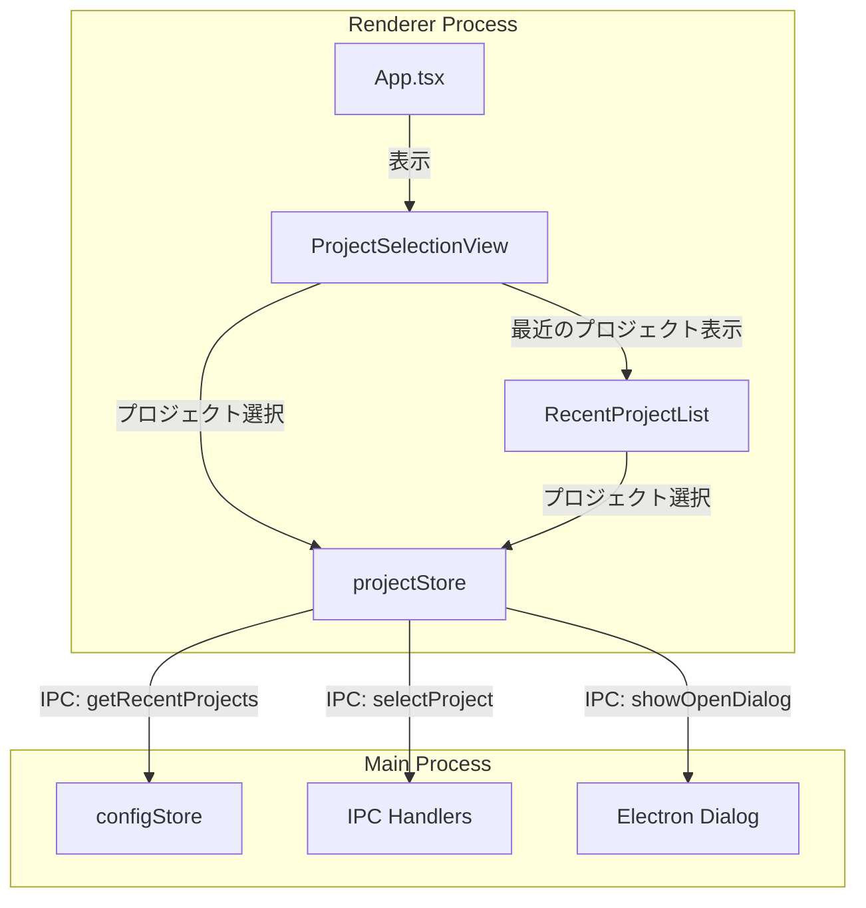
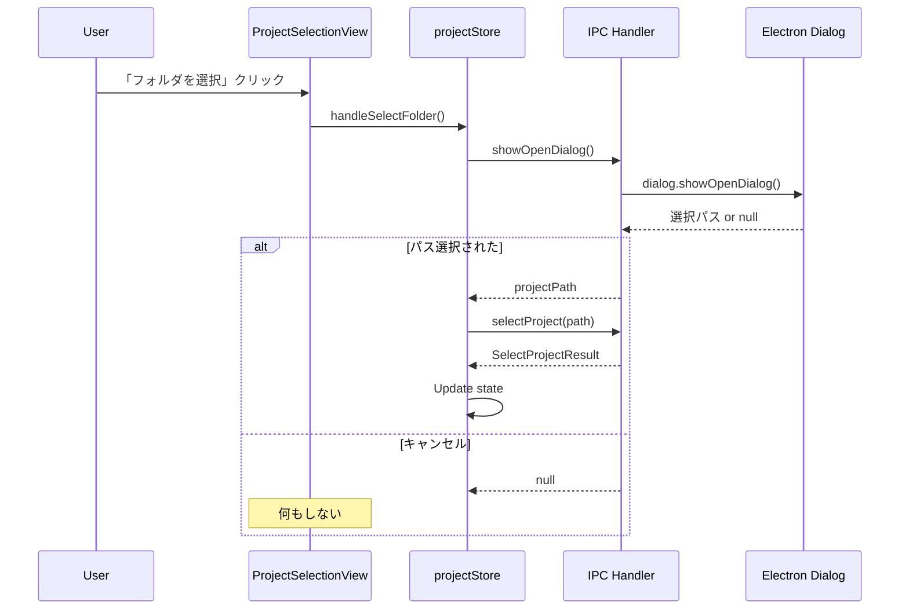
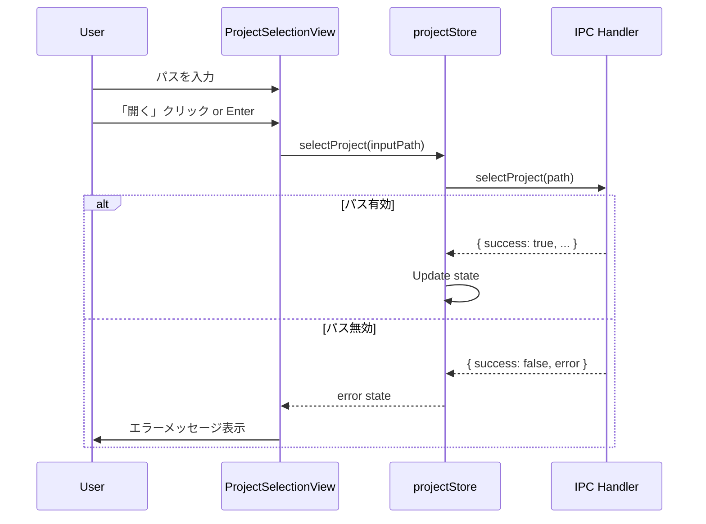

# Design: Project Selection View

## Overview

**Purpose**: プロジェクト未選択時に表示されるプロジェクト選択インターフェースを提供し、ユーザーがOS標準フォルダ選択ダイアログ、パス直接入力、最近開いたプロジェクトへのクイックアクセスの3つの方法でプロジェクトを開けるようにする。

**Users**: SDD Orchestratorを使用する開発者が、アプリケーション起動時やプロジェクト切り替え時に使用する。

**Impact**: 現在の単純なプレースホルダーテキスト（「プロジェクトを選択してください」）を、機能的なプロジェクト選択UIに置き換える。また、未使用のRecentProjectsコンポーネントを削除して技術的負債を解消する。

### Goals

- OS標準のフォルダ選択ダイアログによる直感的なプロジェクト選択
- パスコピー&ペーストによる素早いプロジェクトアクセス
- 最近開いたプロジェクトへのワンクリックアクセス
- 既存コードベースとの整合性を保った実装
- 未使用コンポーネントの削除による技術的負債の解消

### Non-Goals

- ドラッグ&ドロップによるフォルダ選択
- プロジェクトのお気に入り/ピン留め機能
- プロジェクトの検索/フィルタリング機能
- 複数プロジェクトの同時選択
- プロジェクトのプレビュー表示
- Remote UI対応（Desktop UI専用機能）

## Architecture

### Existing Architecture Analysis

**現在の状態**:
- `App.tsx`のメイン領域にプレースホルダーテキスト（「プロジェクトを選択してください」）を表示
- `RecentProjects.tsx`は存在するが、`App.tsx`で未使用（死んだコード）
- プロジェクト選択は`projectStore.selectProject()`で処理
- フォルダ選択ダイアログは`electronAPI.showOpenDialog()`で呼び出し可能
- 最近開いたプロジェクトは`configStore.getRecentProjects()`で取得可能

**既存パターンの活用**:
- IPC: `showOpenDialog`, `selectProject`（既存）
- Store: `projectStore`（既存）、`configStore`（Main Process側、既存）
- UI: Tailwind CSS + Lucide Reactアイコン（既存スタイル）

### Architecture Pattern & Boundary Map



**Architecture Integration**:
- **Selected pattern**: Feature extension - 既存のApp.tsxのプレースホルダー部分を新コンポーネントに置換
- **Domain/feature boundaries**: UIコンポーネント層（`renderer/components/`）に新コンポーネントを追加、ドメインロジックは既存のstoreを活用
- **Existing patterns preserved**: Zustand store経由のIPC呼び出し、Tailwind CSS + Lucide Reactのスタイリング
- **New components rationale**:
  - `ProjectSelectionView`: プロジェクト未選択時のメイン領域を担当
  - `RecentProjectList`: 最近開いたプロジェクトのリスト表示（Welcome画面専用のシンプルな実装）
- **Steering compliance**: KISS原則に従いシンプルな実装、既存パターンの再利用でDRY原則を遵守

### Technology Stack

| Layer | Choice / Version | Role in Feature | Notes |
|-------|------------------|-----------------|-------|
| Frontend | React 19 + TypeScript 5.8+ | UI Component | 既存スタック |
| State Management | Zustand | projectStoreの活用 | 既存store使用 |
| Styling | Tailwind CSS 4 | コンポーネントスタイリング | 既存スタック |
| Icons | Lucide React | FolderOpen, Folder アイコン | 既存ライブラリ |
| IPC | Electron IPC | フォルダ選択ダイアログ呼び出し | 既存channels使用 |

## System Flows

### フォルダ選択ダイアログフロー



### パス直接入力フロー



## Requirements Traceability

| Criterion ID | Summary | Components | Implementation Approach |
|--------------|---------|------------|------------------------|
| 1.1 | フォルダを選択ボタンでダイアログ表示 | ProjectSelectionView | 既存electronAPI.showOpenDialog()を使用 |
| 1.2 | フォルダ選択でプロジェクトが開かれる | ProjectSelectionView, projectStore | 既存selectProject()を使用 |
| 1.3 | キャンセル時は何もしない | ProjectSelectionView | showOpenDialogのnull戻り値をハンドリング |
| 1.4 | 有効なパスでプロジェクト読み込み | projectStore | 既存selectProject()のvalidation使用 |
| 2.1 | テキストフィールドでパス入力 | ProjectSelectionView | React useState + input要素 |
| 2.2 | 開くボタンでプロジェクトが開かれる | ProjectSelectionView, projectStore | 既存selectProject()を使用 |
| 2.3 | 存在しないパスでエラー表示 | ProjectSelectionView | projectStore.error状態を表示 |
| 2.4 | Enterキーで開くボタンと同等動作 | ProjectSelectionView | onKeyDown handler |
| 2.5 | 空入力時は開くボタン無効化 | ProjectSelectionView | disabled={!inputPath.trim()} |
| 3.1 | 最近開いたプロジェクトを縦並びリストで最大6件表示 | RecentProjectList | configStore.recentProjects使用、slice(0, 6) |
| 3.2 | フォルダ名とフルパス表示 | RecentProjectList | path.split('/').pop() + title属性 |
| 3.3 | クリックでプロジェクトが開かれる | RecentProjectList, projectStore | 既存selectProject()を使用 |
| 3.4 | 最近のプロジェクトなしの場合は非表示 | RecentProjectList | 条件付きレンダリング |
| 3.5 | 最近開いた順で表示 | RecentProjectList | configStoreは既にソート済み |
| 3.6 | 存在しないパスはエラー表示 | RecentProjectList, projectStore | selectProjectのエラーハンドリング |
| 4.1 | プロジェクト未選択時のみメイン領域に表示 | App.tsx, ProjectSelectionView | currentProject === null で条件分岐 |
| 4.2 | UI要素の縦配置順序 | ProjectSelectionView | Flexbox column layout |
| 4.3 | プロジェクト選択後は通常画面表示 | App.tsx | 既存の条件分岐を維持 |
| 4.4 | ダークモード対応スタイリング | ProjectSelectionView, RecentProjectList | dark:プレフィックス使用 |
| 5.1 | configStore.recentProjects機能を活用 | RecentProjectList | 新規実装なし、既存機能使用 |
| 5.2 | projectStore.selectProject()を使用 | ProjectSelectionView, RecentProjectList | 新規実装なし、既存機能使用 |
| 5.3 | electronAPI.showOpenDialogを使用 | ProjectSelectionView | 新規実装なし、既存IPC使用 |
| 6.1 | RecentProjects.tsxを削除 | - | ファイル削除 |
| 6.2 | RecentProjects.test.tsxを削除 | - | ファイル削除 |
| 6.3 | components/index.tsからexport削除 | components/index.ts | export文削除 |
| 6.4 | 削除後もビルド・テスト正常 | - | 検証タスク |

### Coverage Validation Checklist

- [x] Every criterion ID from requirements.md appears in the table above
- [x] Each criterion has specific component names (not generic references)
- [x] Implementation approach distinguishes "reuse existing" vs "new implementation"
- [x] User-facing criteria specify concrete UI components (not just "shared components")

## Components and Interfaces

### Component Summary

| Component | Domain/Layer | Intent | Req Coverage | Key Dependencies | Contracts |
|-----------|--------------|--------|--------------|------------------|-----------|
| ProjectSelectionView | UI/Renderer | プロジェクト未選択時のメインUI | 1.1-1.4, 2.1-2.5, 4.1-4.4 | projectStore (P0), electronAPI (P0) | State |
| RecentProjectList | UI/Renderer | 最近開いたプロジェクトのリスト | 3.1-3.6 | projectStore (P0) | State |
| App.tsx (modification) | UI/Renderer | ProjectSelectionViewの統合 | 4.1, 4.3 | ProjectSelectionView (P0) | - |

### UI Components

#### ProjectSelectionView

| Field | Detail |
|-------|--------|
| Intent | プロジェクト未選択時に表示されるプロジェクト選択UI全体を管理 |
| Requirements | 1.1-1.4, 2.1-2.5, 4.1-4.4 |

**Responsibilities & Constraints**
- タイトル/説明、フォルダ選択ボタン、パス入力フィールド、最近開いたプロジェクトリストの統合表示
- パス入力状態の管理（入力値、エラー表示）
- ダークモード対応のスタイリング

**Dependencies**
- Inbound: App.tsx - プロジェクト未選択時に表示 (P0)
- Outbound: projectStore - selectProject(), recentProjects, error (P0)
- Outbound: electronAPI - showOpenDialog() (P0)
- Outbound: RecentProjectList - 最近のプロジェクト表示委譲 (P1)

**Contracts**: State [x]

##### State Management

```typescript
// Local component state
interface ProjectSelectionViewState {
  inputPath: string;
  isLoading: boolean;
}

// External state from projectStore
interface ProjectStoreState {
  recentProjects: string[];
  error: string | null;
  isLoading: boolean;
}
```

- **State model**: 入力パスはローカルstate、プロジェクト選択状態はprojectStore
- **Persistence & consistency**: projectStoreがMain Processと同期
- **Concurrency strategy**: N/A（シングルユーザー操作）

**Implementation Notes**
- Integration: 既存App.tsxのプレースホルダー部分を置換
- Validation: パス入力はボタンクリック/Enter時にのみバリデーション（Requirement 2.3の仕様通り）
- Risks: なし（既存IPC/storeを再利用）

#### RecentProjectList

| Field | Detail |
|-------|--------|
| Intent | 最近開いたプロジェクトを縦並びリストで表示し、クリックでプロジェクトを開く |
| Requirements | 3.1-3.6 |

**Responsibilities & Constraints**
- 最大6件の最近開いたプロジェクトを表示
- フォルダ名（最後のパスセグメント）とフルパスの表示
- クリック時のプロジェクト選択処理

**Dependencies**
- Inbound: ProjectSelectionView - リスト表示の委譲 (P0)
- Outbound: projectStore - recentProjects, selectProject() (P0)

**Contracts**: State [x]

##### State Management

```typescript
// Props interface
interface RecentProjectListProps {
  // No props needed - uses projectStore directly
}

// Uses projectStore state
// recentProjects: string[] - 最近開いたプロジェクトのパス配列
```

- **State model**: projectStoreのrecentProjectsを参照（読み取り専用）
- **Persistence & consistency**: projectStoreがMain Process configStoreと同期済み
- **Concurrency strategy**: N/A

**Implementation Notes**
- Integration: ProjectSelectionViewの子コンポーネントとして配置
- Validation: selectProjectのエラーハンドリングで存在しないパスを検出
- Risks: なし

### TypeScript Interfaces

```typescript
// ProjectSelectionView.tsx
export interface ProjectSelectionViewProps {
  // No props needed - standalone component
}

// RecentProjectList.tsx
export interface RecentProjectListProps {
  // No props needed - uses projectStore directly
}

// Error message constants
export const ERROR_MESSAGES = {
  PATH_NOT_EXISTS: 'パスが存在しません',
  NOT_A_DIRECTORY: 'ディレクトリではありません',
  PERMISSION_DENIED: 'アクセス権限がありません',
  DEFAULT: 'プロジェクトの選択に失敗しました',
} as const;
```

## Data Models

### Domain Model

この機能は新しいデータモデルを導入しない。既存のドメインモデルを使用する:

- **Project**: ディレクトリパス（string）で識別
- **RecentProjects**: プロジェクトパスの配列（string[]）、configStoreで永続化済み

### Logical Data Model

データの流れ:

```
configStore (Main)
  ↓ IPC: getRecentProjects
projectStore.recentProjects (Renderer)
  ↓ subscription
RecentProjectList component
```

## Error Handling

### Error Strategy

ボタン無効化方式（Requirement 2からの決定）:
- 入力中はバリデーションを行わない
- 「開く」ボタンクリック時またはEnterキー押下時にのみエラーを検出・表示

### Error Categories and Responses

**User Errors (4xx equivalent)**:
- `PATH_NOT_EXISTS`: 入力パスが存在しない → エラーメッセージ「パスが存在しません: {path}」
- `NOT_A_DIRECTORY`: パスがディレクトリでない → エラーメッセージ「ディレクトリではありません: {path}」
- `PERMISSION_DENIED`: アクセス権限なし → エラーメッセージ「アクセス権限がありません: {path}」

**UI Recovery**:
- エラー表示後も入力フィールドは編集可能
- ユーザーはパスを修正して再試行可能
- フォルダ選択ダイアログはOS側でバリデーション済み

### Monitoring

既存のconsole.errorログを使用。追加のモニタリングは不要。

## Testing Strategy

### Unit Tests

| Test Case | Component | Description |
|-----------|-----------|-------------|
| フォルダ選択ボタンクリック | ProjectSelectionView | showOpenDialogが呼び出されることを確認 |
| パス入力とEnterキー | ProjectSelectionView | selectProjectが呼び出されることを確認 |
| 空入力時のボタン無効化 | ProjectSelectionView | 開くボタンがdisabledになることを確認 |
| エラー表示 | ProjectSelectionView | projectStore.errorがUIに反映されることを確認 |
| 最近のプロジェクト表示 | RecentProjectList | 最大6件が表示されることを確認 |
| プロジェクトなし時の非表示 | RecentProjectList | 空配列時にコンポーネントが非表示になることを確認 |
| フォルダ名抽出 | RecentProjectList | パスから最後のセグメントが正しく表示されることを確認 |

### Integration Tests

| Test Case | Description |
|-----------|-------------|
| フォルダ選択→プロジェクトオープン | ダイアログ選択からプロジェクト表示までのフロー |
| パス入力→エラー表示 | 無効なパス入力時のエラーメッセージ表示 |
| 最近のプロジェクト→プロジェクトオープン | リストクリックからプロジェクト表示までのフロー |

### E2E Tests

| Test Case | Description |
|-----------|-------------|
| プロジェクト選択画面の初期表示 | アプリ起動時にProjectSelectionViewが表示される |
| フォルダ選択ダイアログ操作 | ダイアログでフォルダ選択後にプロジェクトが読み込まれる |
| パス直接入力操作 | 有効なパス入力後にプロジェクトが読み込まれる |

## Design Decisions

### DD-001: Welcome画面用に新規コンポーネントを作成

| Field | Detail |
|-------|--------|
| Status | Accepted |
| Context | 既存のRecentProjects.tsxはバージョンチェック、アップデートボタン等の複雑な機能を持ち、App.tsxで未使用状態。Welcome画面にはシンプルなリスト表示が必要。 |
| Decision | 新規にRecentProjectListコンポーネントを作成し、既存RecentProjects.tsxは削除する |
| Rationale | 1) 既存コンポーネントは過剰な機能を持ち修正コストが高い 2) 未使用コードの削除で技術的負債解消 3) シンプルな新規実装でKISS原則遵守 |
| Alternatives Considered | 1) RecentProjects.tsxのprops拡張 - 複雑化する 2) RecentProjects.tsxの並行維持 - 混乱の元 |
| Consequences | 既存テストファイル(RecentProjects.test.tsx)の削除が必要。サイドバー用途は将来必要になれば再設計。 |

### DD-002: ボタン無効化方式でのエラー処理

| Field | Detail |
|-------|--------|
| Status | Accepted |
| Context | パス入力時のバリデーションタイミングについて、リアルタイム検証とボタンクリック後検証の2択があった |
| Decision | ボタン無効化方式を採用（空入力時のみボタン無効化、パス検証はクリック後） |
| Rationale | 1) 入力中の煩わしさを回避 2) requirements.mdのDecision Logで明記された仕様 3) シンプルな実装 |
| Alternatives Considered | リアルタイム検証 - 入力のたびにIPC呼び出しが発生し、UXが悪化する |
| Consequences | ユーザーは無効なパスを入力してボタンを押すまでエラーに気づかない。ただしこれは許容される。 |

### DD-003: メイン領域への配置

| Field | Detail |
|-------|--------|
| Status | Accepted |
| Context | プロジェクト選択UIの配置場所として、フルスクリーン、左サイドバー、メイン領域の3択があった |
| Decision | メイン領域（中央）に配置 |
| Rationale | 1) 現在の「プロジェクトを選択してください」プレースホルダーの自然な置換 2) 画面の主要部分で操作しやすい |
| Alternatives Considered | 1) フルスクリーン - 他のUI要素が隠れる 2) 左サイドバー - 狭いスペースでUXが悪い |
| Consequences | App.tsxの既存条件分岐を維持したまま、プレースホルダー部分を置換するだけで実装可能 |

### DD-004: 縦並びリスト形式での最近のプロジェクト表示

| Field | Detail |
|-------|--------|
| Status | Accepted |
| Context | 最近開いたプロジェクトの表示形式として、グリッド、縦並びリスト、横並びカードの3択があった |
| Decision | 縦並びリスト形式（最大6件） |
| Rationale | 1) パス情報の表示が見やすい 2) シンプルで直感的なUI 3) スクロールなしで一覧可能 |
| Alternatives Considered | 1) グリッド(2x3) - パス表示が見づらい 2) 横並びカード - 横スクロールが必要 |
| Consequences | 7件以上の最近のプロジェクトは表示されないが、6件で十分な利便性を確保 |

### DD-005: 既存IPC/Store活用

| Field | Detail |
|-------|--------|
| Status | Accepted |
| Context | プロジェクト選択機能の実装方法 |
| Decision | 既存のelectronAPI.showOpenDialog、projectStore.selectProject、configStore.recentProjectsを活用 |
| Rationale | 1) DRY原則の遵守 2) 既にテスト済みの安定した機能 3) 新規IPC定義不要で実装コスト低減 |
| Alternatives Considered | 新規IPC定義 - 不要な重複となる |
| Consequences | なし。既存機能の再利用により安定した実装が可能 |
