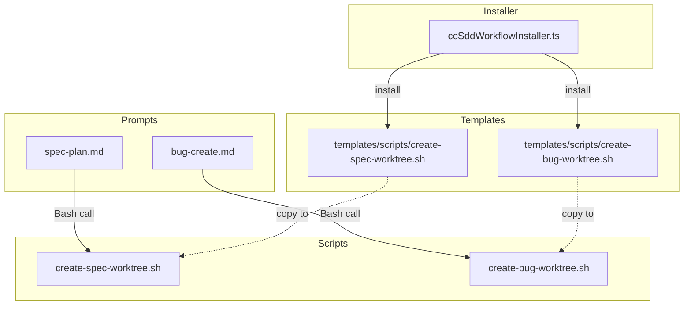
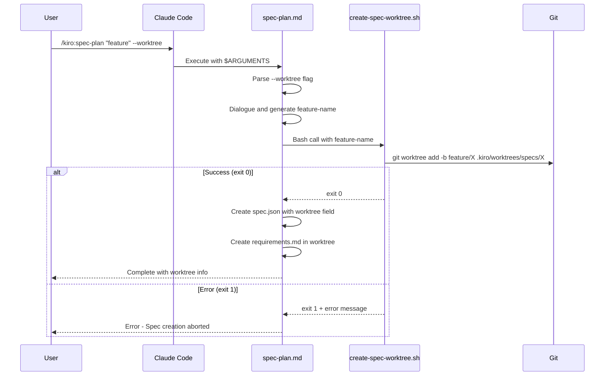
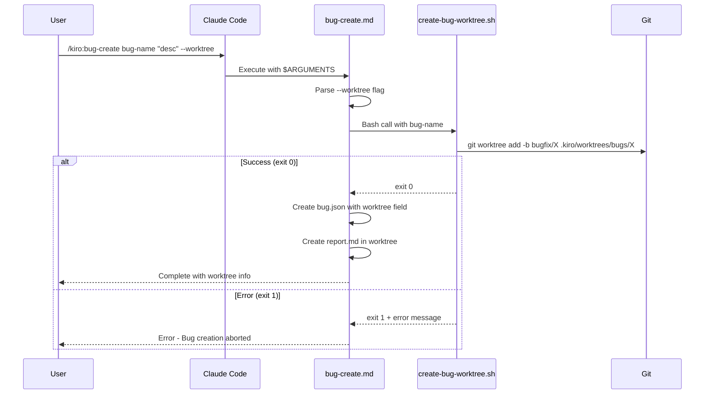

# Design: Prompt Worktree Support

## Overview

**Purpose**: spec-plan.mdおよびbug-create.mdプロンプトに`--worktree`フラグ処理を追加し、Spec/Bug作成時点からworktreeモードで作業できるようにする。

**Users**: SDDワークフローを使用する開発者がworktreeモードでの開発を選択できる。

**Impact**: 既存のspec-planおよびbug-createプロンプトを拡張し、worktree作成スクリプトを新規追加する。

### Goals

- Spec/Bug作成時にworktreeモードを選択可能にする
- worktree作成処理をスクリプト化してDRYを実現
- コマンドセットインストール時にスクリプトを自動配布

### Non-Goals

- mainブランチチェック（handlers.ts側で既に実施済み）
- spec-init.mdのworktree対応（spec-planで代替可能）
- worktree作成失敗時のロールバック処理
- Remote UI対応（Desktop専用機能）

## Architecture

### Existing Architecture Analysis

現在のworktree管理はElectronアプリ（handlers.ts）側で実装されており、`WorktreeService`がgit worktreeコマンドをラップしている。一方、プロンプト（spec-plan.md, bug-create.md）はBashツールを通じてスクリプトを実行できるため、worktree作成処理をスクリプト化することで両者を統合する。

**既存パターン**:
- `.kiro/scripts/update-spec-for-deploy.sh`, `update-bug-for-deploy.sh`がスクリプト配布のパターンを確立
- `ccSddWorkflowInstaller.ts`の`installScripts`メソッドが`templates/scripts/`からスクリプトを配布

### Architecture Pattern & Boundary Map



**Architecture Integration**:
- 選択パターン: スクリプト経由のworktree作成（プロンプトからBash呼び出し）
- ドメイン境界: プロンプトはスクリプトの終了コードのみを確認し、パスは規約から導出
- 既存パターン: `update-spec-for-deploy.sh`と同様のスクリプト構成・配布方式
- 新規コンポーネント: 2つのworktree作成スクリプト
- Steering準拠: DRY（共通ロジックのスクリプト化）、KISS（終了コードのみの単純インタフェース）

### Technology Stack

| Layer | Choice / Version | Role in Feature | Notes |
|-------|------------------|-----------------|-------|
| Script | Bash + Git | worktree作成 | Git 2.x以上必須 |
| Prompt | Markdown | Claude Codeプロンプト | 既存フォーマット維持 |
| Installer | TypeScript | スクリプト配布 | 既存`installScripts`を利用 |

## System Flows

### Spec Worktree Creation Flow



### Bug Worktree Creation Flow



## Requirements Traceability

| Criterion ID | Summary | Components | Implementation Approach |
|--------------|---------|------------|------------------------|
| 1.1 | create-spec-worktree.shが存在しfeature-name引数を受け取る | create-spec-worktree.sh | 新規実装 |
| 1.2 | スクリプト実行でブランチ/worktree作成、終了コード0 | create-spec-worktree.sh | 新規実装 |
| 1.3 | create-bug-worktree.shが存在しbug-name引数を受け取る | create-bug-worktree.sh | 新規実装 |
| 1.4 | スクリプト実行でブランチ/worktree作成、終了コード0 | create-bug-worktree.sh | 新規実装 |
| 1.5 | 既存ブランチ/worktree時にエラーメッセージと終了コード1 | create-spec-worktree.sh, create-bug-worktree.sh | 新規実装 |
| 1.6 | 引数不足時に使用方法と終了コード1 | create-spec-worktree.sh, create-bug-worktree.sh | 新規実装 |
| 2.1 | spec-plan.mdが--worktreeフラグを検出 | spec-plan.md | 既存拡張 |
| 2.2 | --worktree時にスクリプト実行、spec.jsonにworktreeフィールド追加 | spec-plan.md | 既存拡張 |
| 2.3 | --worktreeなしで従来通り動作 | spec-plan.md | 既存維持 |
| 2.4 | スクリプト失敗時にエラー表示、Spec作成中止 | spec-plan.md | 既存拡張 |
| 3.1 | bug-create.mdが--worktreeフラグを検出 | bug-create.md | 既存拡張 |
| 3.2 | --worktree時にスクリプト実行、bug.jsonにworktreeフィールド追加 | bug-create.md | 既存拡張 |
| 3.3 | --worktreeなしで従来通り動作 | bug-create.md | 既存維持 |
| 3.4 | スクリプト失敗時にエラー表示、Bug作成中止 | bug-create.md | 既存拡張 |
| 4.1 | templates/scripts/create-spec-worktree.shが存在 | templates/scripts/create-spec-worktree.sh | 新規実装 |
| 4.2 | templates/scripts/create-bug-worktree.shが存在 | templates/scripts/create-bug-worktree.sh | 新規実装 |
| 4.3 | インストール処理がscripts/ディレクトリを対象に含む | ccSddWorkflowInstaller.ts | 既存機能利用 |

### Coverage Validation Checklist

- [x] すべてのcriterion IDがrequirements.mdからトレース可能
- [x] 各criterionに具体的なコンポーネント名を記載
- [x] 実装アプローチで「新規実装」vs「既存拡張/維持」を区別
- [x] UI関連criterionは該当なし（プロンプト/スクリプトのみ）

## Components and Interfaces

| Component | Domain/Layer | Intent | Req Coverage | Key Dependencies | Contracts |
|-----------|--------------|--------|--------------|------------------|-----------|
| create-spec-worktree.sh | Script | Spec用worktree作成 | 1.1, 1.2, 1.5, 1.6 | Git (P0) | Bash exit code |
| create-bug-worktree.sh | Script | Bug用worktree作成 | 1.3, 1.4, 1.5, 1.6 | Git (P0) | Bash exit code |
| spec-plan.md | Prompt | Spec計画・要件生成 | 2.1, 2.2, 2.3, 2.4 | create-spec-worktree.sh (P0) | - |
| bug-create.md | Prompt | Bug報告作成 | 3.1, 3.2, 3.3, 3.4 | create-bug-worktree.sh (P0) | - |

### Scripts

#### create-spec-worktree.sh

| Field | Detail |
|-------|--------|
| Intent | Spec用のgit worktreeとブランチを作成する |
| Requirements | 1.1, 1.2, 1.5, 1.6 |

**Responsibilities & Constraints**
- `feature/<feature-name>`ブランチを作成
- `.kiro/worktrees/specs/<feature-name>`にworktreeを作成
- 引数チェック、既存ブランチ/worktreeチェック
- 終了コード: 0（成功）、1（エラー）

**Dependencies**
- External: Git CLI - worktree add/branch操作 (P0)

**Contracts**: Service [ ] / API [ ] / Event [ ] / Batch [ ] / State [ ]

**Script Interface**
```bash
# Usage
./create-spec-worktree.sh <feature-name>

# Exit codes
# 0 - Success
# 1 - Error (missing argument, branch exists, worktree exists)

# Output (stdout)
# Success: "Success: Created worktree at .kiro/worktrees/specs/<feature-name>"
# Error: Error message with usage hint
```

**Implementation Notes**
- `git worktree add -b feature/<feature-name> .kiro/worktrees/specs/<feature-name>`を使用
- ブランチ存在チェック: `git rev-parse --verify feature/<feature-name>`
- worktree存在チェック: ディレクトリ存在確認

#### create-bug-worktree.sh

| Field | Detail |
|-------|--------|
| Intent | Bug用のgit worktreeとブランチを作成する |
| Requirements | 1.3, 1.4, 1.5, 1.6 |

**Responsibilities & Constraints**
- `bugfix/<bug-name>`ブランチを作成
- `.kiro/worktrees/bugs/<bug-name>`にworktreeを作成
- 引数チェック、既存ブランチ/worktreeチェック
- 終了コード: 0（成功）、1（エラー）

**Dependencies**
- External: Git CLI - worktree add/branch操作 (P0)

**Contracts**: Service [ ] / API [ ] / Event [ ] / Batch [ ] / State [ ]

**Script Interface**
```bash
# Usage
./create-bug-worktree.sh <bug-name>

# Exit codes
# 0 - Success
# 1 - Error (missing argument, branch exists, worktree exists)

# Output (stdout)
# Success: "Success: Created worktree at .kiro/worktrees/bugs/<bug-name>"
# Error: Error message with usage hint
```

**Implementation Notes**
- `git worktree add -b bugfix/<bug-name> .kiro/worktrees/bugs/<bug-name>`を使用
- create-spec-worktree.shと同様のエラーチェックロジック

### Prompts

#### spec-plan.md

| Field | Detail |
|-------|--------|
| Intent | 対話型のSpec計画・要件生成に--worktreeフラグ対応を追加 |
| Requirements | 2.1, 2.2, 2.3, 2.4 |

**Responsibilities & Constraints**
- `$ARGUMENTS`から`--worktree`フラグを検出
- Phase 4（Spec Directory Creation）でworktree作成スクリプトを条件付き実行
- spec.jsonにworktreeフィールドを追加（enabled: true, path, branch, created_at）
- スクリプト失敗時はSpec作成を中止

**Dependencies**
- Outbound: create-spec-worktree.sh - worktree作成 (P0)

**Contracts**: Service [ ] / API [ ] / Event [ ] / Batch [ ] / State [ ]

**Changes Required**

Phase 1に以下を追加:
```markdown
### Phase 1: Initial Understanding

1. **Acknowledge the input**: `$ARGUMENTS`
2. **Parse flags**:
   - Check for `--worktree` flag in $ARGUMENTS
   - Remove flag from arguments before processing description
```

Phase 4に以下を追加:
```markdown
### Phase 4: Spec Directory Creation

1. **Worktree mode check**:
   - If `--worktree` flag was detected:
     - Execute `.kiro/scripts/create-spec-worktree.sh <feature-name>`
     - If exit code is non-zero, display error and abort
     - Set spec directory to `.kiro/worktrees/specs/{feature-name}/.kiro/specs/{feature-name}/`
   - Otherwise:
     - Set spec directory to `.kiro/specs/{feature-name}/`

2. **Create directory**: `{spec-directory}`

3. **Generate spec.json** (with worktree field if applicable):
```

spec.json with worktree field:
```json
{
  "feature_name": "{feature-name}",
  "created_at": "{timestamp}",
  "updated_at": "{timestamp}",
  "language": "ja",
  "phase": "requirements-generated",
  "approvals": { ... },
  "worktree": {
    "path": ".kiro/worktrees/specs/{feature-name}",
    "branch": "feature/{feature-name}",
    "created_at": "{timestamp}",
    "enabled": true
  }
}
```

#### bug-create.md

| Field | Detail |
|-------|--------|
| Intent | Bug報告作成に--worktreeフラグ対応を追加 |
| Requirements | 3.1, 3.2, 3.3, 3.4 |

**Responsibilities & Constraints**
- `$ARGUMENTS`から`--worktree`フラグを検出
- bug-name確定後にworktree作成スクリプトを条件付き実行
- bug.jsonにworktreeフィールドを追加（enabled: true, path, branch, created_at）
- スクリプト失敗時はBug作成を中止

**Dependencies**
- Outbound: create-bug-worktree.sh - worktree作成 (P0)

**Contracts**: Service [ ] / API [ ] / Event [ ] / Batch [ ] / State [ ]

**Changes Required**

Parse Arguments セクションを更新:
```markdown
## Parse Arguments
- Bug name: First argument (e.g., `issue-name`)
- Description: Second argument in quotes (e.g., "Description of the bug")
- Flags: Check for `--worktree` in remaining arguments
```

Execution Steps セクションを更新:
```markdown
## Execution Steps
1. **Check Uniqueness**: Verify `.kiro/bugs/` for naming conflicts
2. **Worktree mode check** (if --worktree flag):
   - Execute `.kiro/scripts/create-bug-worktree.sh <bug-name>`
   - If exit code is non-zero, display error and abort
   - Set bug directory to `.kiro/worktrees/bugs/{bug-name}/.kiro/bugs/{bug-name}/`
3. **Create Directory**: `{bug-directory}`
4. **Initialize bug.json** (with worktree field if applicable)
5. **Initialize Files Using Templates**
```

bug.json with worktree field:
```json
{
  "bug_name": "{bug-name}",
  "created_at": "{timestamp}",
  "updated_at": "{timestamp}",
  "worktree": {
    "path": ".kiro/worktrees/bugs/{bug-name}",
    "branch": "bugfix/{bug-name}",
    "created_at": "{timestamp}",
    "enabled": true
  }
}
```

## Data Models

### WorktreeConfig (既存)

`src/shared/types/worktree.ts`で定義済みの型を使用:

```typescript
interface WorktreeConfig {
  path?: string;      // ".kiro/worktrees/specs/{feature-name}"
  branch?: string;    // "feature/{feature-name}" or "bugfix/{bug-name}"
  created_at?: string; // ISO-8601
  enabled?: boolean;  // true when worktree mode
}
```

### spec.json / bug.json Schema Changes

```typescript
// spec.json (既存フィールドは省略)
interface SpecJson {
  feature_name: string;
  created_at: string;
  updated_at: string;
  language: string;
  phase: string;
  approvals: { ... };
  worktree?: WorktreeConfig; // Added by --worktree flag
}

// bug.json (既存フィールドは省略)
interface BugJson {
  bug_name: string;
  created_at: string;
  updated_at: string;
  worktree?: WorktreeConfig; // Added by --worktree flag
}
```

## Error Handling

### Error Strategy

スクリプトは終了コードでエラーを通知し、プロンプトがエラーハンドリングを行う。

### Error Categories and Responses

| Error Type | Exit Code | Message | Prompt Action |
|------------|-----------|---------|---------------|
| 引数不足 | 1 | "Error: feature-name is required\nUsage: ..." | エラー表示、Spec/Bug作成中止 |
| ブランチ既存 | 1 | "Error: Branch feature/X already exists" | エラー表示、Spec/Bug作成中止 |
| Worktree既存 | 1 | "Error: Worktree directory already exists at ..." | エラー表示、Spec/Bug作成中止 |
| Git操作エラー | 1 | Git error message | エラー表示、Spec/Bug作成中止 |

## Testing Strategy

### Unit Tests

- create-spec-worktree.sh引数チェックテスト（引数なし/ありケース）
- create-bug-worktree.sh引数チェックテスト（引数なし/ありケース）
- 既存ブランチ検知テスト

### Integration Tests

- スクリプト実行後のworktreeディレクトリ存在確認
- スクリプト実行後のブランチ作成確認
- インストーラーによるスクリプト配布確認

### E2E/UI Tests

- `/kiro:spec-plan "feature" --worktree`実行後のspec.json確認
- `/kiro:bug-create bug-name "desc" --worktree`実行後のbug.json確認

## Design Decisions

### DD-001: スクリプト化 vs プロンプト内記述

| Field | Detail |
|-------|--------|
| Status | Accepted |
| Context | worktree作成処理をプロンプト内に直接記述するか、スクリプトに切り出すか |
| Decision | スクリプト化を採用 |
| Rationale | DRY（spec-plan/bug-createで共有）、既存パターンとの一貫性（`.kiro/scripts/`）、プロンプトの簡潔化 |
| Alternatives Considered | プロンプト内にgitコマンドを直接記述 - 重複が発生、保守性低下 |
| Consequences | 2つのスクリプトファイルを追加管理する必要がある |

### DD-002: スクリプト構成（1つ vs 2つ）

| Field | Detail |
|-------|--------|
| Status | Accepted |
| Context | 1つの汎用スクリプトか、spec用/bug用で分けるか |
| Decision | 2つのスクリプト（`create-spec-worktree.sh`, `create-bug-worktree.sh`） |
| Rationale | 既存パターン（update-spec/bug-for-deploy.sh）との一貫性、各スクリプトがシンプル、パス/ブランチ規約の違いを明確化 |
| Alternatives Considered | 1つの汎用スクリプトで引数でタイプ指定 - 複雑化、既存パターンと不一致 |
| Consequences | 類似コードが2ファイルに存在するが、変更頻度は低い |

### DD-003: スクリプト出力方式

| Field | Detail |
|-------|--------|
| Status | Accepted |
| Context | JSON出力か終了コードのみか |
| Decision | 終了コードのみ、パスは規約から導出 |
| Rationale | 既存スクリプトパターンとの一貫性、シンプルさ |
| Alternatives Considered | JSON出力 - パース処理が必要、既存パターンと不一致 |
| Consequences | プロンプト側でパス規約を知っている必要がある（`.kiro/worktrees/specs/{name}`等） |

### DD-004: mainブランチチェックの省略

| Field | Detail |
|-------|--------|
| Status | Accepted |
| Context | プロンプト側でmainブランチチェックを行うか |
| Decision | 不要 |
| Rationale | 必須ではなくおまけ的な機能、シンプルさ優先、handlers.ts側で既に実施済み |
| Alternatives Considered | スクリプト内でmainブランチチェック - 複雑化、要件外 |
| Consequences | mainブランチ以外からworktree作成可能だが、ユーザーの責任 |

## Integration & Deprecation Strategy

### 変更が必要な既存ファイル（Wiring Points）

| File | Change Type | Description |
|------|-------------|-------------|
| `electron-sdd-manager/resources/templates/commands/cc-sdd/spec-plan.md` | 修正 | --worktreeフラグ対応追加 |
| `electron-sdd-manager/resources/templates/commands/cc-sdd-agent/spec-plan.md` | 修正 | --worktreeフラグ対応追加 |
| `electron-sdd-manager/resources/templates/commands/spec-manager/spec-plan.md` | 修正 | --worktreeフラグ対応追加 |
| `electron-sdd-manager/resources/templates/commands/bug/bug-create.md` | 修正 | --worktreeフラグ対応追加 |
| `electron-sdd-manager/src/main/services/ccSddWorkflowInstaller.ts` | 修正 | HELPER_SCRIPTSに新スクリプト追加 |

### 新規作成ファイル

| File | Description |
|------|-------------|
| `electron-sdd-manager/resources/templates/scripts/create-spec-worktree.sh` | Spec用worktree作成スクリプト |
| `electron-sdd-manager/resources/templates/scripts/create-bug-worktree.sh` | Bug用worktree作成スクリプト |

### 削除ファイル

なし

### インストーラー変更

`ccSddWorkflowInstaller.ts`の`HELPER_SCRIPTS`配列に新スクリプトを追加:

```typescript
export const HELPER_SCRIPTS = [
  'update-spec-for-deploy.sh',
  'update-bug-for-deploy.sh',
  'create-spec-worktree.sh',  // 追加
  'create-bug-worktree.sh',   // 追加
] as const;
```

既存の`installScripts`メソッドは`templates/scripts/`ディレクトリ内の`.sh`ファイルを自動的にインストールするため、スクリプトファイルを配置するだけで配布される。
