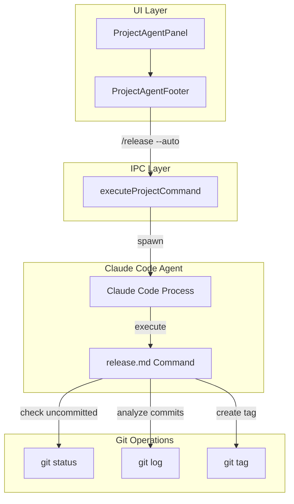
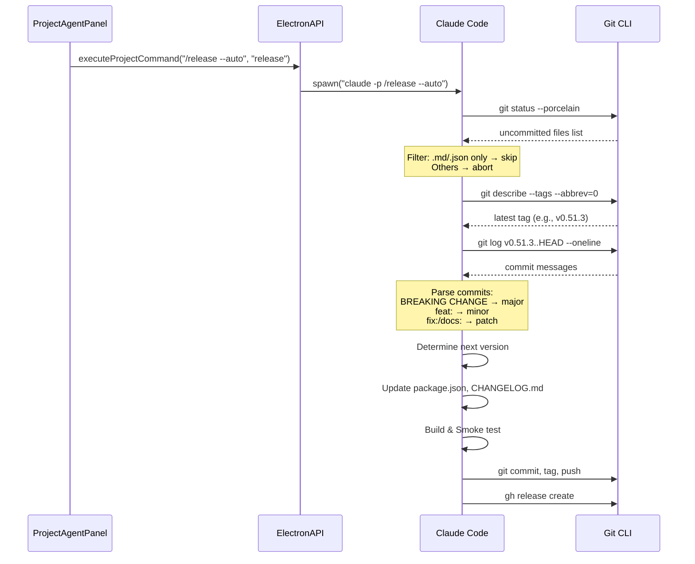
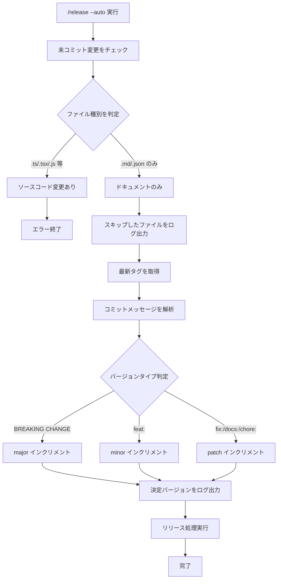

# Design: Release Auto Option

## Overview

**Purpose**: release.md コマンドに `--auto` オプションを追加し、UI のリリースボタンから完全自動でリリースを実行可能にする。未コミットのドキュメント変更を無視し、バージョン番号をコミットログから Semantic Versioning に基づいて自動判定することで、ユーザー対話なしにリリースを完了できる。

**Users**: SDD Orchestrator を使用する開発者が、UI のリリースボタンまたは `/release --auto` コマンドでワンクリック・対話なしリリースを実行できる。

**Impact**: 既存の release.md コマンドに `--auto` オプションを追加し、ProjectAgentPanel のリリースボタンから `--auto` 付きでコマンドを実行するように変更する。

### Goals

- `/release --auto` オプションで対話なしリリースを実現
- 未コミットのドキュメント変更（.md, .json）を自動スキップ
- コミットログから Semantic Versioning に基づいてバージョンを自動判定
- UI リリースボタンから `--auto` オプション付きで実行
- generate-release.md テンプレートに `--auto` オプションの説明を追加

### Non-Goals

- Windows/Linux 向けのビルド・パッケージング対応
- CI/CD パイプラインでの自動リリース
- リリースのロールバック機能
- プレリリース版（alpha, beta）の自動判定
- スモークテスト失敗時の動作変更（既存動作を維持）

## Architecture

### Existing Architecture Analysis

本機能は既存の release コマンドシステムを拡張する。以下の既存コンポーネントに変更を加える:

**コマンドファイル**:
- `.claude/commands/release.md`: `--auto` オプションのセクションを追加

**テンプレートファイル**:
- `resources/templates/settings/templates/commands/release.md`: テンプレートに `--auto` オプションを追加

**UI コンポーネント**:
- `ProjectAgentPanel.tsx`: `handleRelease` で `/release --auto` を実行するように変更

**IPC/通信レイヤー**:
- 変更なし（既存の `executeProjectCommand` API をそのまま使用）

### Architecture Pattern & Boundary Map



**Architecture Integration**:
- **Selected pattern**: 既存パターン維持（Slash Command による Claude Code Agent 制御）
- **Domain/feature boundaries**: release.md コマンド内でのロジック追加のみ
- **Existing patterns preserved**: executeProjectCommand → Agent 起動 → Slash Command 実行
- **New components rationale**: 新規コンポーネントなし（既存コマンドの拡張）
- **Steering compliance**: KISS 原則に従い、シンプルなオプション追加で実現

### Technology Stack

| Layer | Choice / Version | Role in Feature | Notes |
|-------|------------------|-----------------|-------|
| Frontend | React 19 + TypeScript | UI ボタンからのコマンド実行 | 文字列変更のみ |
| Backend | Electron 35 + Node.js | IPC 経由でのコマンド実行 | 既存 API 使用 |
| Agent | Claude Code | release.md コマンドの実行 | コマンド内容の拡張 |

### Command Prompt Architecture

**Execution Model**:
- [x] CLI invocation: Claude Code が git コマンドを直接実行

**Rationale**: release.md は Claude Code Agent に対する指示書（Slash Command）であり、Agent がコマンド内の手順に従って git/npm/gh コマンドを実行する。

**Data Flow**:


## System Flows

### --auto オプション実行フロー



**Key Decisions**:
- 未コミットのソースコード変更はリリースをブロック（データ整合性確保）
- ドキュメント変更のスキップはログに出力（トレーサビリティ確保）
- バージョン判定は最も高い変更レベルを採用（複数の feat: と fix: がある場合は minor）

## Requirements Traceability

| Criterion ID | Summary | Components | Implementation Approach |
|--------------|---------|------------|------------------------|
| 1.1 | `/release --auto` で確認プロンプトをスキップ | `release.md` | 既存コマンドに条件分岐を追加 |
| 1.2 | `--auto` なしは従来通り確認を求める | `release.md` | 既存動作を維持 |
| 1.3 | release.md に --auto オプションの使用方法を記載 | `release.md` | ドキュメントセクション追加 |
| 2.1 | ドキュメント変更のみの場合は警告スキップ | `release.md` | ファイル拡張子フィルタリング |
| 2.2 | ソースコード変更ありはエラー終了 | `release.md` | ファイル種別チェック |
| 2.3 | スキップしたファイルをログ出力 | `release.md` | echo でファイルリスト出力 |
| 3.1 | 前回タグからのコミットを解析 | `release.md` | git log コマンド使用 |
| 3.2 | BREAKING CHANGE で major インクリメント | `release.md` | コミットメッセージ解析 |
| 3.3 | feat: で minor インクリメント | `release.md` | コミットメッセージ解析 |
| 3.4 | fix:/docs:/chore: で patch インクリメント | `release.md` | コミットメッセージ解析 |
| 3.5 | 決定バージョンをログ出力 | `release.md` | echo でバージョン出力 |
| 4.1 | UI リリースボタンで `/release --auto` 実行 | `ProjectAgentPanel.tsx` | コマンド文字列変更 |
| 4.2 | 従来と同じ成功/エラー通知を表示 | `ProjectAgentPanel.tsx` | 既存通知ロジック維持 |
| 5.1 | generate-release で --auto セクションを含める | `generate-release.md`, template | テンプレート更新 |
| 5.2 | --auto の動作仕様を記載 | template | ドキュメント追加 |
| 5.3 | コマンドセットテンプレートも更新 | template | テンプレート更新 |

### Coverage Validation Checklist

- [x] Every criterion ID from requirements.md appears in the table above
- [x] Each criterion has specific component names (not generic references)
- [x] Implementation approach distinguishes "reuse existing" vs "new implementation"
- [x] User-facing criteria specify concrete UI components

## Components and Interfaces

### Component Summary

| Component | Domain/Layer | Intent | Req Coverage | Key Dependencies | Contracts |
|-----------|--------------|--------|--------------|------------------|-----------|
| release.md | Command | リリース手順定義 | 1.1-1.3, 2.1-2.3, 3.1-3.5 | Claude Code (P0) | - |
| ProjectAgentPanel.tsx | UI | リリースボタン処理 | 4.1, 4.2 | electronAPI (P0) | - |
| release.md template | Template | 新規プロジェクト用テンプレート | 5.1-5.3 | generate-release (P1) | - |

### Command Layer

#### release.md

| Field | Detail |
|-------|--------|
| Intent | Claude Code Agent に対するリリース手順の指示書 |
| Requirements | 1.1, 1.2, 1.3, 2.1, 2.2, 2.3, 3.1, 3.2, 3.3, 3.4, 3.5 |

**Responsibilities & Constraints**
- `--auto` オプションの有無で動作を分岐
- 未コミット変更のファイル種別判定
- コミットメッセージからのバージョン自動判定
- 既存のリリース手順を維持しつつ対話部分をスキップ

**Dependencies**
- Outbound: Git CLI — バージョン管理、タグ操作 (P0)
- Outbound: GitHub CLI — リリース作成 (P0)
- Outbound: npm — パッケージビルド (P0)

**Contracts**: Service [x]

##### Service Interface (Pseudo-code)

```markdown
## --auto オプション

`/release --auto` で実行すると、以下の動作が変更されます:

### 1. 未コミット変更の自動スキップ

```bash
# 未コミット変更をチェック
UNCOMMITTED=$(git status --porcelain)

if [ -n "$UNCOMMITTED" ]; then
  # ファイル種別をフィルタ
  SOURCE_CHANGES=$(echo "$UNCOMMITTED" | grep -E '\.(ts|tsx|js|jsx|mjs|cjs)$')

  if [ -n "$SOURCE_CHANGES" ]; then
    echo "❌ ソースコードに未コミット変更があります:"
    echo "$SOURCE_CHANGES"
    exit 1
  fi

  # ドキュメント変更のみの場合はスキップ
  DOC_CHANGES=$(echo "$UNCOMMITTED" | grep -E '\.(md|json)$')
  if [ -n "$DOC_CHANGES" ]; then
    echo "⚠️ 以下のドキュメント変更をスキップします:"
    echo "$DOC_CHANGES"
  fi
fi
```

### 2. バージョン番号の自動判定

```bash
# 前回タグを取得
LATEST_TAG=$(git describe --tags --abbrev=0 2>/dev/null || echo "v0.0.0")

# コミットメッセージを解析
COMMITS=$(git log ${LATEST_TAG}..HEAD --oneline)

# バージョンタイプを判定
if echo "$COMMITS" | grep -q "BREAKING CHANGE:"; then
  VERSION_TYPE="major"
elif echo "$COMMITS" | grep -q "^[a-f0-9]* feat:"; then
  VERSION_TYPE="minor"
else
  VERSION_TYPE="patch"
fi

echo "📦 バージョンタイプ: $VERSION_TYPE"
```
```

**Implementation Notes**
- Integration: 既存の release.md に `## --auto オプション` セクションを追加
- Validation: ソースコード変更の検出は厳格に行い、誤リリースを防止
- Risks: コミットメッセージの形式が不統一な場合、patch にフォールバック

### UI Layer

#### ProjectAgentPanel.tsx - handleRelease

| Field | Detail |
|-------|--------|
| Intent | リリースボタンクリック時のコマンド実行 |
| Requirements | 4.1, 4.2 |

**Responsibilities & Constraints**
- `/release --auto` でコマンドを実行
- 既存の成功/エラー通知ロジックを維持

**Dependencies**
- Outbound: electronAPI.executeProjectCommand — Agent 起動 (P0)

**Contracts**: Service [x]

##### Service Interface

```typescript
// ProjectAgentPanel.tsx 内の既存関数（変更箇所のみ）
const handleRelease = async () => {
  if (!currentProject) return;

  try {
    // Requirement 4.1: /release --auto を実行
    const agentInfo = await window.electronAPI.executeProjectCommand(
      currentProject,
      '/release --auto',  // Before: '/release'
      'release'
    );
    addAgent('', agentInfo);
    selectForProjectAgents();
    selectAgent(agentInfo.agentId);
    notify.success('releaseを開始しました');
  } catch (error) {
    // Requirement 4.2: 既存の通知ロジック維持
    notify.error(error instanceof Error ? error.message : 'releaseの実行に失敗しました');
  }
};
```

**Implementation Notes**
- Integration: コマンド文字列の変更のみ（1行修正）
- Validation: 既存テストの更新が必要
- Risks: なし（純粋な文字列変更）

### Template Layer

#### release.md template

| Field | Detail |
|-------|--------|
| Intent | 新規プロジェクト用リリースワークフローテンプレート |
| Requirements | 5.1, 5.2, 5.3 |

**Responsibilities & Constraints**
- `--auto` オプションのセクションを含める
- generate-release コマンドで生成される release.md に反映

**Implementation Notes**
- リネーム/追加: `resources/templates/settings/templates/commands/release.md` に `--auto` セクション追加

## Data Models

本機能はデータモデルの変更を含まない（コマンド定義とUI文字列の変更のみ）。

## Error Handling

### Error Strategy

`--auto` オプション固有のエラーハンドリングを追加。

### Error Categories and Responses

**User Errors (4xx equivalent)**:
- ソースコード未コミット変更: エラーメッセージ + ファイルリスト表示 + 処理中止

**System Errors (5xx equivalent)**:
- Git コマンド失敗: 既存のエラーハンドリングで対応
- ビルド失敗: 既存のエラーハンドリングで対応

**Business Logic Errors**:
- タグが存在しない場合: v0.0.0 からの patch としてフォールバック

## Testing Strategy

### Unit Tests

1. **コミットメッセージ解析テスト**: `BREAKING CHANGE:` → major, `feat:` → minor, その他 → patch の判定
2. **ファイル種別フィルタテスト**: .ts/.tsx → ブロック、.md/.json → スキップ
3. **ProjectAgentPanel.test.tsx**: `handleRelease` が `/release --auto` を呼び出すことを確認

### Integration Tests

1. **release.md --auto**: 未コミット変更がドキュメントのみの場合に正常続行
2. **release.md --auto**: ソースコード変更がある場合にエラー終了

### E2E/UI Tests

1. **リリースボタン**: クリックで `/release --auto` が実行されること
2. **通知**: 成功/エラー時に適切な通知が表示されること

## Design Decisions

### DD-001: UI リリースボタンは常に --auto を使用

| Field | Detail |
|-------|--------|
| Status | Accepted |
| Context | UI からのリリース実行時に `--auto` を付けるか、ユーザーに選択させるか |
| Decision | UI リリースボタンは常に `/release --auto` を実行する |
| Rationale | UI でボタンをクリックする行為自体が「今すぐリリースしたい」という意図を表している。対話を望むユーザーは CLI で `/release` を直接実行できる |
| Alternatives Considered | 1. チェックボックスで --auto の有無を選択（却下: UI が複雑化、ワンクリックの価値が薄れる）<br>2. 設定で切り替え（却下: YAGNI、大半のユーザーは自動を望む） |
| Consequences | CLI 経由で対話的リリースを行いたいユーザーは `/release` を使用する必要がある。UIの簡潔さは維持される |

### DD-002: コミット解析によるバージョン自動判定

| Field | Detail |
|-------|--------|
| Status | Accepted |
| Context | バージョン番号をどのように決定するか |
| Decision | コミットメッセージから Semantic Versioning に基づいて自動判定 |
| Rationale | Conventional Commits の規約に従ったコミットメッセージから、適切なバージョン変更が自動で導出できる。手動入力の手間を削減し、バージョニングの一貫性を確保 |
| Alternatives Considered | 1. patch 固定（却下: feat: のある変更が patch になる問題）<br>2. プレリリース形式（却下: 複雑化、Out of Scope） |
| Consequences | コミットメッセージの規約が守られていない場合は patch にフォールバック。開発者は Conventional Commits を意識する必要がある |

### DD-003: ドキュメント変更のみスキップ

| Field | Detail |
|-------|--------|
| Status | Accepted |
| Context | 未コミット変更がある場合の挙動 |
| Decision | ドキュメント（.md, .json）のみの場合は警告してスキップ、ソースコードは中止 |
| Rationale | リリース作業中に spec.json や CHANGELOG.md を編集していることは一般的。これらをブロッカーにしないことで自動リリースの実用性を確保。一方、ソースコードの未コミットはリリース対象と齟齬が生じるため厳格にブロック |
| Alternatives Considered | 1. 全ての未コミット変更を警告のみでスキップ（却下: ソースコード漏れのリスク）<br>2. 自動コミット（却下: 意図しないコミットが作成される） |
| Consequences | ソースコード編集中に UI からリリースしようとするとエラーになる。明示的なエラーメッセージでユーザーをガイド |

### DD-004: Open Question - スモークテスト失敗時の動作

| Field | Detail |
|-------|--------|
| Status | Proposed |
| Context | `--auto` 実行中にスモークテストが失敗した場合の動作 |
| Decision | 既存動作を維持（スモークテスト失敗時は処理を中止） |
| Rationale | 自動リリースであっても、品質ゲートとしてのスモークテストは重要。失敗した場合は中止し、手動での確認を促す |
| Alternatives Considered | 1. スモークテストをスキップ（却下: 品質リスク）<br>2. リトライ機構（却下: 複雑化、本質的な問題は解決しない） |
| Consequences | スモークテスト失敗時は自動リリースが中断される。要件の Open Question に対する回答として文書化 |

## Integration & Deprecation Strategy

### 既存ファイルの修正（Wiring Points）

| File Path | Modification Type | Description |
|-----------|-------------------|-------------|
| `.claude/commands/release.md` | Content Update | `--auto` オプションセクションの追加 |
| `electron-sdd-manager/src/renderer/components/ProjectAgentPanel.tsx` | Code Update | `handleRelease` で `/release --auto` を実行 |
| `electron-sdd-manager/resources/templates/settings/templates/commands/release.md` | Content Update | テンプレートに `--auto` セクションを追加 |
| `electron-sdd-manager/resources/templates/commands/cc-sdd/generate-release.md` | Content Update | 生成される release.md に `--auto` 説明を含める |
| `electron-sdd-manager/resources/templates/commands/cc-sdd-agent/generate-release.md` | Content Update | 同上 |
| `electron-sdd-manager/resources/templates/agents/kiro/generate-release.md` | Content Update | 同上 |

### 既存ファイルの削除（Cleanup）

削除対象ファイルなし。

### インターフェース変更なし

本機能は既存の `executeProjectCommand` API をそのまま使用し、引数として渡すコマンド文字列のみが変更される。API シグネチャの変更は不要。

## Interface Changes & Impact Analysis

### 変更されるインターフェース

なし。本機能は以下の点でインターフェース変更を伴わない:

1. **executeProjectCommand API**: 既存シグネチャをそのまま使用（引数の値のみ変更）
2. **release.md**: Slash Command の内容更新であり、呼び出しインターフェースは不変
3. **UI Props**: `ProjectAgentFooter` の props 変更なし

### Callers への影響

| Caller | Impact | Action Required |
|--------|--------|-----------------|
| ProjectAgentPanel.tsx | コマンド文字列変更 | `/release` → `/release --auto` に変更 |
| Remote UI (if applicable) | なし | 同一の WebSocket API を使用 |

既存のテストファイル `ProjectAgentPanel.test.tsx` でコマンド文字列の検証を行っている場合は更新が必要。

## Integration Test Strategy

本機能は Claude Code Agent によるコマンド実行が主であり、Electron 内部でのクロスバウンダリ通信は既存パターンを踏襲する。新規のインテグレーションテストインフラは不要。

### Components

- ProjectAgentPanel (UI)
- electronAPI.executeProjectCommand (IPC)
- Claude Code Process (External)

### Data Flow

UI → IPC → Claude Code spawn → コマンド実行

### Mock Boundaries

- Claude Code Process: E2E テストでのみ実行（Unit テストでは IPC 層をモック）
- Git CLI: release.md 内で直接実行（E2E テストでのみ実行）

### Verification Points

1. `executeProjectCommand` が `/release --auto` で呼び出されること
2. Agent 起動後に通知が表示されること

### Robustness Strategy

- 既存の E2E テストパターンを踏襲
- Agent 起動は非同期であり、結果は通知で確認

### Prerequisites

追加のテストインフラ不要。既存の `ProjectAgentPanel.test.tsx` を更新。
