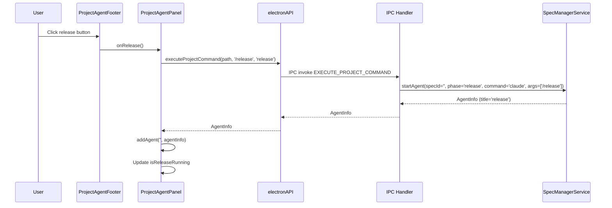
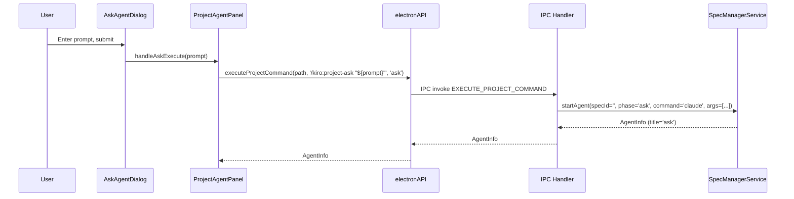

# Design: Release Button API Fix

## Overview

**Purpose**: この機能は、`executeAskProject` APIを汎用的な`executeProjectCommand` APIに置き換え、releaseボタンが`/release`コマンドを正しく実行し、Agent一覧に「release」と表示されるようにする。

**Users**: 開発者とエンドユーザー。開発者は汎用APIを使って任意のプロジェクトコマンドを実行でき、エンドユーザーはreleaseボタンを押すと意図した通りのコマンドが実行される。

**Impact**: 既存の`executeAskProject` APIを廃止し、`executeProjectCommand`に統合することで、IPC/WebSocket APIの一貫性を向上させる。

### Goals

- `executeProjectCommand` APIの新設により任意のプロジェクトコマンドを統一的に実行可能にする
- releaseボタンが`/release`コマンドを直接実行し、タイトル「release」で表示される
- `executeAskProject` APIの完全廃止
- `isReleaseRunning`判定を`title`ベースに移行

### Non-Goals

- `executeAskSpec`の移行（別スコープ）
- Remote UI側のWebSocket API対応（別タスク）
- 他のプロジェクトコマンドの追加（将来の拡張）

## Architecture

### Existing Architecture Analysis

現在の実装:
- `executeAskProject(projectPath, prompt, commandPrefix)` がIPC経由で呼び出される
- ハンドラ内で`/kiro:project-ask "${prompt}"`形式にラップしてAgentを起動
- releaseボタンは`executeAskProject(path, '/release')`を呼び出しているが、これは`/kiro:project-ask "/release"`として実行される
- Agent一覧のタイトルは`phase`フィールド（'ask'）が使用され、正しく表示されない
- `isReleaseRunning`は`args?.includes('/release')`で判定

### Architecture Pattern & Boundary Map

```mermaid
graph TB
    subgraph Renderer
        UI[ProjectAgentPanel]
        Footer[ProjectAgentFooter]
        Store[agentStore]
    end

    subgraph Preload
        Preload[electronAPI]
    end

    subgraph Main
        Handler[IPC Handlers]
        Service[SpecManagerService]
        Agent[AgentProcess]
    end

    UI --> Footer
    UI --> Store
    Footer -->|onRelease| UI
    UI -->|executeProjectCommand| Preload
    Preload -->|IPC invoke| Handler
    Handler -->|startAgent| Service
    Service -->|spawn| Agent
    Agent -->|AgentInfo| Service
    Service -->|AgentInfo| Handler
    Handler -->|return| Preload
    Store -->|isReleaseRunning| Footer
```

**Architecture Integration**:
- Selected pattern: 既存IPCパターンの拡張（汎用化）
- Domain boundaries: IPC層でコマンド文字列を透過的に渡し、ラップしない
- Existing patterns preserved: startAgent、AgentInfo型、IPC_CHANNELS定義
- New components rationale: 新規コンポーネントなし、既存APIの置き換え
- Steering compliance: DRY（重複API削除）、KISS（シンプルな汎用API）

### Technology Stack

| Layer | Choice / Version | Role in Feature | Notes |
|-------|------------------|-----------------|-------|
| Frontend | React 19, TypeScript 5.8+ | UI更新、AgentInfo表示 | 既存パターン継続 |
| IPC | Electron IPC | API通信 | 新規チャンネル追加 |
| Backend | Node.js 20+, Electron 35 | コマンド実行 | SpecManagerService使用 |

## System Flows

### Release Button Execution Flow



### Ask Button Execution Flow (Migrated)



## Requirements Traceability

| Criterion ID | Summary | Components | Implementation Approach |
|--------------|---------|------------|------------------------|
| 1.1 | `executeProjectCommand`シグネチャ | IPC_CHANNELS, preload/index.ts, handlers.ts | 新規実装 |
| 1.2 | commandパラメータをそのまま実行 | handlers.ts | startAgentにargs直接渡し |
| 1.3 | titleパラメータがAgent表示名 | handlers.ts, AgentInfo型 | phase代わりにtitleを設定 |
| 1.4 | AgentInfo返却 | handlers.ts | 既存パターン継続 |
| 1.5 | エラー時メッセージ返却 | handlers.ts | 既存パターン継続 |
| 2.1 | releaseボタンでexecuteProjectCommand呼び出し | ProjectAgentPanel.tsx | 既存handleRelease修正 |
| 2.2 | Agent一覧に「release」表示 | agentStore.ts | title参照に変更 |
| 2.3 | 重複起動防止ロジック | ProjectAgentPanel.tsx | isReleaseRunning判定修正 |
| 3.1 | AskボタンでexecuteProjectCommand呼び出し | ProjectAgentPanel.tsx | 既存handleAskExecute修正 |
| 3.2 | 既存Ask機能と同等動作 | handlers.ts | コマンド形式維持 |
| 3.3 | Agent一覧に「ask」表示 | agentStore.ts | title参照 |
| 4.1 | EXECUTE_ASK_PROJECT削除 | channels.ts | 削除 |
| 4.2 | executeAskProject型定義削除 | electron.d.ts | 削除 |
| 4.3 | preloadからexecuteAskProject削除 | preload/index.ts | 削除 |
| 4.4 | ハンドラ実装削除 | handlers.ts | 削除 |
| 5.1 | title==='release'かつstatus==='running'判定 | ProjectAgentPanel.tsx | 判定ロジック修正 |
| 5.2 | args判定からtitle判定へ移行 | ProjectAgentPanel.tsx | args?.includes削除 |

### Coverage Validation Checklist

- [x] Every criterion ID from requirements.md appears in the table above
- [x] Each criterion has specific component names (not generic references)
- [x] Implementation approach distinguishes "reuse existing" vs "new implementation"
- [x] User-facing criteria specify concrete UI components

## Components and Interfaces

| Component | Domain/Layer | Intent | Req Coverage | Key Dependencies | Contracts |
|-----------|--------------|--------|--------------|------------------|-----------|
| IPC_CHANNELS | IPC | チャンネル定義 | 1.1, 4.1 | - | - |
| preload/index.ts | IPC | API公開 | 1.1, 4.3 | channels.ts | API |
| handlers.ts | Main | IPC処理 | 1.1-1.5, 4.4 | SpecManagerService | Service |
| electron.d.ts | Types | 型定義 | 1.1, 4.2 | - | - |
| ProjectAgentPanel.tsx | UI | パネルロジック | 2.1, 2.3, 3.1, 5.1, 5.2 | agentStore | - |
| AgentInfo | Types | Agent情報 | 1.3, 2.2, 3.3 | - | State |

### IPC Layer

#### IPC_CHANNELS (channels.ts)

| Field | Detail |
|-------|--------|
| Intent | IPCチャンネル定数定義 |
| Requirements | 1.1, 4.1 |

**Responsibilities & Constraints**
- `EXECUTE_PROJECT_COMMAND`チャンネルを追加
- `EXECUTE_ASK_PROJECT`チャンネルを削除

**Contracts**: API [x]

##### API Contract

```typescript
// 新規追加
EXECUTE_PROJECT_COMMAND: 'ipc:execute-project-command',

// 削除
// EXECUTE_ASK_PROJECT: 'ipc:execute-ask-project', // 削除
```

#### preload/index.ts

| Field | Detail |
|-------|--------|
| Intent | Renderer向けAPI公開 |
| Requirements | 1.1, 4.3 |

**Responsibilities & Constraints**
- `executeProjectCommand`メソッドを公開
- `executeAskProject`メソッドを削除

**Dependencies**
- Outbound: IPC_CHANNELS (P0)

**Contracts**: API [x]

##### API Contract

```typescript
/**
 * Execute project-level command
 * @param projectPath Project root path
 * @param command Command string to execute (e.g., '/release', '/kiro:project-ask "prompt"')
 * @param title Display title for Agent list
 * @returns AgentInfo on success
 */
executeProjectCommand: (
  projectPath: string,
  command: string,
  title: string
) => Promise<AgentInfo>
```

#### handlers.ts (IPC Handler)

| Field | Detail |
|-------|--------|
| Intent | EXECUTE_PROJECT_COMMANDリクエスト処理 |
| Requirements | 1.1, 1.2, 1.3, 1.4, 1.5, 4.4 |

**Responsibilities & Constraints**
- `command`パラメータをラップせず直接`args`として渡す
- `title`パラメータを`phase`として使用（Agent表示名として機能）
- エラー時は適切なエラーメッセージをthrow

**Dependencies**
- Inbound: preload経由のIPC invoke (P0)
- Outbound: SpecManagerService.startAgent (P0)

**Contracts**: Service [x]

##### Service Interface

```typescript
// Handler implementation
ipcMain.handle(
  IPC_CHANNELS.EXECUTE_PROJECT_COMMAND,
  async (event, projectPath: string, command: string, title: string) => {
    // Validation
    if (!projectPath || !command || !title) {
      throw new Error('Invalid parameters');
    }

    // NOTE: projectPath is used for logging only.
    // The working directory (cwd) for agent execution is managed by
    // SpecManagerService, which receives projectPath at construction time.
    // startAgent does not need projectPath as a parameter.
    logger.info('[handlers] EXECUTE_PROJECT_COMMAND called', { projectPath, command, title });

    const service = getSpecManagerService();
    const window = BrowserWindow.fromWebContents(event.sender);

    if (window && !eventCallbacksRegistered) {
      registerEventCallbacks(service, window);
    }

    // Start agent with command directly (no wrapping)
    const result = await service.startAgent({
      specId: '',
      phase: title,  // title is used as phase for display
      command: 'claude',
      args: [command],
      group: 'doc',
    });

    if (!result.ok) {
      throw new Error(getErrorMessage(result.error));
    }

    return result.value;
  }
);
```

- Preconditions: projectPath, command, title が非空文字列（projectPathはログ用途、cwdはSpecManagerServiceで管理）
- Postconditions: AgentInfoを返却、またはErrorをthrow
- Invariants: commandはラップされずそのまま実行される

### Types Layer

#### AgentInfo

| Field | Detail |
|-------|--------|
| Intent | Agent情報の型定義 |
| Requirements | 1.3, 2.2, 3.3 |

**Responsibilities & Constraints**
- 既存の`phase`フィールドを`title`として使用（表示名）
- `args`フィールドは継続使用

**Contracts**: State [x]

##### State Management

**注**: 既存の`phase`フィールドがAgent一覧の表示名として使用される。新APIでは`title`パラメータを`phase`に設定することで、意図した表示名が使われる。型定義の変更は不要。

```typescript
// 既存のAgentInfo型（変更なし）
export interface AgentInfo {
  readonly agentId: string;
  readonly specId: string;
  readonly phase: string;  // 'release', 'ask' などのtitleがここに入る
  readonly status: AgentStatus;
  readonly startedAt: string;
  readonly lastActivityAt: string;
  readonly command: string;
  readonly args?: string;
  // ...
}
```

### UI Layer

#### ProjectAgentPanel.tsx

| Field | Detail |
|-------|--------|
| Intent | プロジェクトエージェントパネルのロジック |
| Requirements | 2.1, 2.3, 3.1, 5.1, 5.2 |

**Responsibilities & Constraints**
- `handleRelease`で`executeProjectCommand`を呼び出す
- `handleAskExecute`で`executeProjectCommand`を呼び出す
- `isReleaseRunning`判定を`phase === 'release'`に変更

**Dependencies**
- Outbound: window.electronAPI.executeProjectCommand (P0)
- Outbound: useAgentStore (P0)

**Implementation Notes**
- Integration: electronAPI呼び出しを新APIに置き換え
- Validation: 既存のcurrentProjectチェックを継続
- Risks: なし（同期的な置き換え）

## Data Models

### Domain Model

変更なし。既存の`AgentInfo`モデルを継続使用。`phase`フィールドがタイトル表示に使用される点のみ意味が変わる。

### Logical Data Model

**AgentInfo内のphaseフィールドの意味変更**:
- Before: SDD phase名（'requirements', 'design', 'ask'など）
- After: 表示用タイトル（'release', 'ask'など、任意の文字列可）

## Error Handling

### Error Strategy

既存のエラーハンドリングパターンを継続:
- IPC Handler: `throw new Error(message)`
- UI: try-catchでnotify.error表示

### Error Categories and Responses

**User Errors (4xx相当)**:
- パラメータ不正 → "Invalid parameters"
- プロジェクト未選択 → UI側でボタン無効化

**System Errors (5xx相当)**:
- Agent起動失敗 → `getErrorMessage(result.error)`でメッセージ取得

## Testing Strategy

### Unit Tests

1. `handlers.ts`: EXECUTE_PROJECT_COMMANDハンドラのパラメータ検証
2. `handlers.ts`: startAgentへのargs透過性確認
3. `ProjectAgentPanel.tsx`: handleReleaseがexecuteProjectCommandを呼び出すこと
4. `ProjectAgentPanel.tsx`: isReleaseRunningがphase === 'release'で判定すること

### Integration Tests

1. Release button -> IPC -> Agent start の一連のフロー
2. Ask button -> IPC -> Agent start の一連のフロー
3. executeAskProject削除後の互換性確認（呼び出しがエラーになること）

### E2E Tests

1. Releaseボタンクリック → Agent一覧に「release」表示
2. Askボタン使用 → Agent一覧に「ask」表示
3. Release実行中のボタン無効化

## Design Decisions

### DD-001: 汎用API `executeProjectCommand` の採用

| Field | Detail |
|-------|--------|
| Status | Accepted |
| Context | releaseボタンが`executeAskProject`を流用しているため、`/release`が`/kiro:project-ask "/release"`としてラップされて実行される問題。また、Agent一覧のタイトルが「ask」と表示される。 |
| Decision | 専用API (`executeRelease`) ではなく、汎用API `executeProjectCommand(projectPath, command, title)` を新設する。 |
| Rationale | 今後プロジェクトレベルのコマンドが増える見込みがあり、各コマンドごとに専用APIを作るよりも汎用APIで対応する方が拡張性が高い。DRY原則にも合致。 |
| Alternatives Considered | 1. `executeRelease`専用API → 将来のコマンド追加時にAPI増殖 2. `executeAskProject`のパラメータ拡張 → 既存の意味と矛盾 |
| Consequences | executeAskProjectの完全廃止が必要。Ask機能も新APIに移行。 |

### DD-002: `title`パラメータによる表示名制御

| Field | Detail |
|-------|--------|
| Status | Accepted |
| Context | Agent一覧の表示名をどのように制御するか。 |
| Decision | `phase`パラメータではなく`title`パラメータとして設計し、UI表示用タイトルを呼び出し側から指定する。 |
| Rationale | SDDの`phase`（requirements, design等）とは概念が異なり、単なる表示タイトルである。`title`という名前の方が意図が明確。内部的には既存の`phase`フィールドを使用。 |
| Alternatives Considered | 1. 新規`title`フィールド追加 → AgentInfo型の破壊的変更 2. `phase`名称のまま → 概念の混乱 |
| Consequences | 型定義の変更なし。呼び出し側で意図が明確。 |

### DD-003: `isReleaseRunning`判定の`phase`ベース移行

| Field | Detail |
|-------|--------|
| Status | Accepted |
| Context | 現在の`args?.includes('/release')`判定は、コマンド文字列に依存しており脆弱。 |
| Decision | `phase === 'release' && status === 'running'`の判定に移行する。 |
| Rationale | `phase`（=title）フィールドが明示的にreleaseかどうかを示すため、より信頼性が高い。文字列パース不要。 |
| Alternatives Considered | 1. 専用フラグ追加 → 過剰な設計 2. args判定継続 → 脆弱性継続 |
| Consequences | 新API使用時のみ動作。旧APIとの混在期間は存在しない（同時移行）。 |

### DD-004: 全呼び出し箇所の同時移行

| Field | Detail |
|-------|--------|
| Status | Accepted |
| Context | `executeAskProject`の既存呼び出し箇所の移行タイミング。 |
| Decision | ReleaseボタンとAskボタンの両方を同時に移行し、`executeAskProject`を即座に廃止する。 |
| Rationale | 中途半端な状態を避け、コードベースの一貫性を保つ。段階的移行はテストの複雑化を招く。 |
| Alternatives Considered | 1. 段階的移行（deprecation期間を設ける） → 複雑化、中途半端な状態 |
| Consequences | 一度のPRで完全移行。テストも同時更新。 |

## Integration & Deprecation Strategy

### 既存ファイルの修正（Wiring Points）

以下のファイルに修正が必要:

| File | Change Type | Description |
|------|-------------|-------------|
| `src/main/ipc/channels.ts` | 修正 | EXECUTE_PROJECT_COMMAND追加、EXECUTE_ASK_PROJECT削除 |
| `src/preload/index.ts` | 修正 | executeProjectCommand追加、executeAskProject削除 |
| `src/main/ipc/handlers.ts` | 修正 | EXECUTE_PROJECT_COMMANDハンドラ追加、EXECUTE_ASK_PROJECTハンドラ削除 |
| `src/renderer/types/electron.d.ts` | 修正 | executeProjectCommand型追加、executeAskProject型削除 |
| `src/renderer/components/ProjectAgentPanel.tsx` | 修正 | handleRelease、handleAskExecute、isReleaseRunning判定変更 |
| `src/renderer/components/ProjectAgentPanel.test.tsx` | 修正 | テストケースの更新 |
| `src/shared/api/types.ts` | 修正 | ApiClient.executeProjectCommand追加、executeAskProject削除 |
| `src/shared/api/IpcApiClient.ts` | 修正 | executeProjectCommand実装追加、executeAskProject削除 |
| `src/shared/api/WebSocketApiClient.ts` | 修正 | executeProjectCommand実装追加（Remote UI用、将来対応のスタブ） |

### 削除対象ファイル

削除対象のファイルはなし。上記ファイル内の該当箇所を削除。

### Remote UI影響

Remote UI側の`WebSocketApiClient`も`executeProjectCommand`対応が必要だが、本Specのスコープ外（Out of Scope）。Remote UI側は別タスクで対応。現時点では`executeAskProject`を維持するか、エラーを返すスタブとする。

**推奨**: `WebSocketApiClient.executeProjectCommand`はスタブ実装として、未対応エラーを返す。

```typescript
async executeProjectCommand(_command: string, _title: string): Promise<Result<AgentInfo, ApiError>> {
  return {
    ok: false,
    error: { code: 'NOT_IMPLEMENTED', message: 'executeProjectCommand is not yet supported via WebSocket' },
  };
}
```
