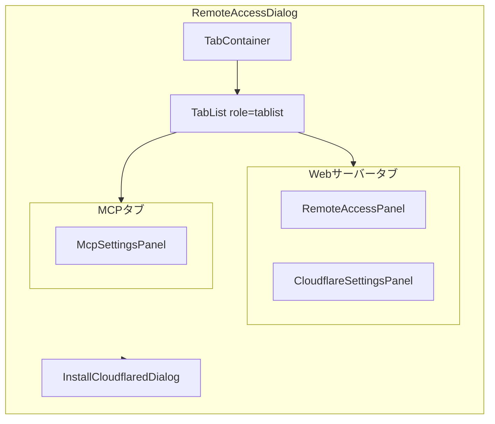
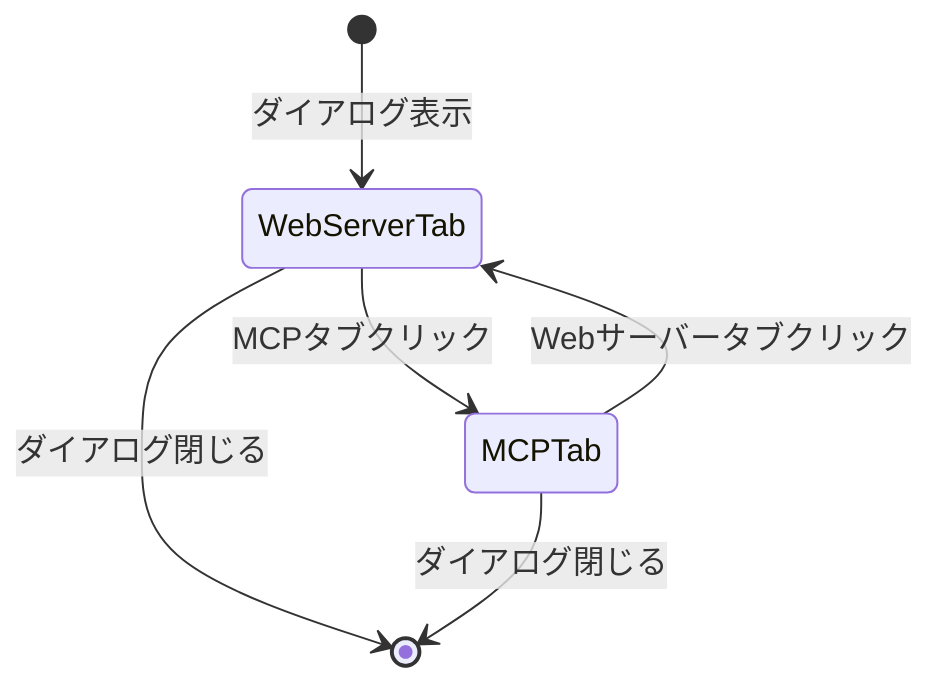

# Design: Remote Dialog Tab Layout

## Overview

**Purpose**: RemoteAccessDialogにタブUIを導入し、Webサーバー関連設定とMCPサーバー設定を論理的にグループ化することで、ダイアログの整理と操作性向上を実現する。

**Users**: SDD Orchestratorを使用してRemote AccessおよびMCPサーバーを設定するユーザー。

**Impact**: 既存のRemoteAccessDialogの内部構造をタブ形式にリファクタリング。外部インターフェース（props、IPC）は変更なし。

### Goals

- RemoteAccessDialogにアクセシブルなタブUIを導入
- Webサーバー関連設定（RemoteAccessPanel、CloudflareSettingsPanel）を1タブにグループ化
- MCPサーバー設定（McpSettingsPanel）を独立したタブに分離
- 既存コンポーネントの機能・外観を維持

### Non-Goals

- IPCハンドラやバックエンドロジックの変更
- タブ選択状態の永続化
- 新しいタブや機能の追加
- 他のダイアログやパネルへの変更

## Architecture

### Existing Architecture Analysis

現在のRemoteAccessDialogは以下の構造を持つ:

```
RemoteAccessDialog
├── Backdrop
├── Dialog Content
│   ├── RemoteAccessPanel
│   ├── Divider
│   ├── CloudflareSettingsPanel
│   ├── Divider
│   └── McpSettingsPanel
└── InstallCloudflaredDialog (conditional)
```

**課題**: 3つのパネルが縦に並び、ダイアログが長くなっている。WebサーバーとMCPは異なる機能カテゴリだが、同一のスクロール領域に混在している。

### Architecture Pattern & Boundary Map



**Architecture Integration**:
- Selected pattern: Compound Component Pattern（タブコンテナ＋タブリスト＋タブパネル）
- Existing patterns preserved: 既存パネルコンポーネントはそのまま再利用
- New components rationale: タブ状態管理はRemoteAccessDialog内でuseStateで完結（新コンポーネント不要）
- Steering compliance: KISS（最小限の変更）、DRY（既存パネル再利用）

### Technology Stack

| Layer | Choice / Version | Role in Feature | Notes |
|-------|------------------|-----------------|-------|
| Frontend | React 19 | タブ状態管理、ARIA属性 | useStateによるローカル状態管理 |
| Styling | Tailwind CSS 4 | タブボタン・パネルのスタイリング | 既存のスタイルパターンに準拠 |

## System Flows

本機能は単純なUI状態管理のため、複雑なフローは存在しない。



**Key Decision**: タブ状態はダイアログを閉じるとリセット（Requirement 4.2）。永続化なし。

## Requirements Traceability

| Criterion ID | Summary | Components | Implementation Approach |
|--------------|---------|------------|------------------------|
| 1.1 | 2つのタブを表示 | RemoteAccessDialog | 新規実装: タブリスト追加 |
| 1.2 | タブはダイアログ上部に水平配置 | RemoteAccessDialog | 新規実装: flexレイアウト |
| 1.3 | アクティブタブの視覚的区別 | RemoteAccessDialog | 新規実装: clsxによる条件付きスタイル |
| 1.4 | タブクリックでコンテンツ切り替え | RemoteAccessDialog | 新規実装: useState + 条件付きレンダリング |
| 2.1 | WebサーバータブにRemoteAccessPanel含む | RemoteAccessDialog | 既存再利用: RemoteAccessPanel |
| 2.2 | WebサーバータブにCloudflareSettingsPanel含む | RemoteAccessDialog | 既存再利用: CloudflareSettingsPanel |
| 2.3 | 各パネルの機能・外観維持 | RemoteAccessPanel, CloudflareSettingsPanel | 変更なし |
| 2.4 | パネル間のDivider表示 | RemoteAccessDialog | 既存パターン再利用 |
| 3.1 | MCPタブにMcpSettingsPanel含む | RemoteAccessDialog | 既存再利用: McpSettingsPanel |
| 3.2 | McpSettingsPanelの機能・外観維持 | McpSettingsPanel | 変更なし |
| 4.1 | Webサーバータブがデフォルト選択 | RemoteAccessDialog | 新規実装: useState初期値 |
| 4.2 | ダイアログ閉じるとタブ状態リセット | RemoteAccessDialog | 設計による: コンポーネントアンマウント時に自動リセット |
| 5.1 | ARIA属性（tablist, tab, tabpanel） | RemoteAccessDialog | 新規実装: role属性追加 |
| 5.2 | キーボードナビゲーション（左右矢印） | RemoteAccessDialog | 新規実装: onKeyDownハンドラ |
| 5.3 | Enter/スペースでタブ選択 | RemoteAccessDialog | 新規実装: button要素のデフォルト動作 |

### Coverage Validation Checklist

- [x] Every criterion ID from requirements.md appears in the table above
- [x] Each criterion has specific component names (not generic references)
- [x] Implementation approach distinguishes "reuse existing" vs "new implementation"
- [x] User-facing criteria specify concrete UI components

## Components and Interfaces

| Component | Domain/Layer | Intent | Req Coverage | Key Dependencies | Contracts |
|-----------|--------------|--------|--------------|------------------|-----------|
| RemoteAccessDialog | UI/Dialog | タブUIを提供するダイアログ | 1.1-1.4, 2.1-2.4, 3.1-3.2, 4.1-4.2, 5.1-5.3 | RemoteAccessPanel, CloudflareSettingsPanel, McpSettingsPanel | State |

### UI Layer

#### RemoteAccessDialog

| Field | Detail |
|-------|--------|
| Intent | Remote設定をタブ形式で表示するモーダルダイアログ |
| Requirements | 1.1, 1.2, 1.3, 1.4, 2.1, 2.2, 2.3, 2.4, 3.1, 3.2, 4.1, 4.2, 5.1, 5.2, 5.3 |

**Responsibilities & Constraints**
- タブ状態の管理（Webサーバー/MCP）
- アクセシビリティ要件（ARIA属性、キーボードナビゲーション）の実装
- 既存パネルコンポーネントの配置変更のみ（パネル内部は変更なし）

**Dependencies**
- Inbound: None
- Outbound: RemoteAccessPanel, CloudflareSettingsPanel, McpSettingsPanel, InstallCloudflaredDialog - 子コンポーネントとして使用 (P0)
- External: None

**Contracts**: State [x]

##### State Management

```typescript
// タブ識別子の型定義
type RemoteDialogTab = 'web-server' | 'mcp';

// ローカル状態（React useState）
const [activeTab, setActiveTab] = useState<RemoteDialogTab>('web-server');
```

- State model: コンポーネントローカル状態（useState）
- Persistence: なし（ダイアログ閉じるとリセット）
- Concurrency strategy: 単一ユーザー操作、競合なし

**Implementation Notes**

- Integration: 既存のRemoteAccessDialog.tsxを修正。新ファイル作成不要
- Validation: タブIDはTypeScript型で制約
- Risks: 既存テストの修正が必要（タブUI追加に伴うDOM構造変更）

### Shared Types

```typescript
/**
 * タブ設定の型定義
 */
interface TabConfig {
  /** タブの識別子 */
  id: RemoteDialogTab;
  /** 表示ラベル */
  label: string;
}

/**
 * タブ設定の定義
 */
const TAB_CONFIGS: TabConfig[] = [
  { id: 'web-server', label: 'Webサーバー' },
  { id: 'mcp', label: 'MCP' },
];
```

## Data Models

本機能はUIのみの変更のため、永続化されるデータモデルは存在しない。

## Error Handling

本機能はUI状態管理のみのため、特別なエラーハンドリングは不要。既存パネルコンポーネントのエラー処理はそのまま維持。

## Testing Strategy

### Unit Tests

1. **タブ表示テスト**: 2つのタブ（Webサーバー、MCP）がダイアログに表示される
2. **タブ切り替えテスト**: タブクリックでactiveTab状態が変更される
3. **デフォルトタブテスト**: ダイアログ表示時にWebサーバータブがデフォルト選択
4. **コンテンツ切り替えテスト**: アクティブタブに応じて正しいパネルが表示される
5. **アクセシビリティテスト**: ARIA属性（role, aria-selected, aria-controls）が正しく設定される

### Integration Tests

1. **キーボードナビゲーションテスト**: 左右矢印キーでタブ間を移動できる
2. **既存パネル機能テスト**: タブ切り替え後も各パネルの機能が正常に動作する

### E2E Tests

1. **タブ操作フローテスト**: タブを切り替えながら設定を変更し、正しく反映されることを確認

## Design Decisions

### DD-001: タブ状態管理方式

| Field | Detail |
|-------|--------|
| Status | Accepted |
| Context | タブの選択状態をどこで管理するか（グローバルストア vs ローカル状態） |
| Decision | コンポーネントローカル状態（useState）で管理 |
| Rationale | タブ状態はダイアログ内でのみ必要であり、永続化不要（Requirement 4.2）。ローカル状態で十分 |
| Alternatives Considered | Zustand store: 過剰な設計。他コンポーネントとの状態共有が不要 |
| Consequences | シンプルな実装。ダイアログを閉じると自動的に状態がリセットされる |

### DD-002: タブコンポーネントの実装方式

| Field | Detail |
|-------|--------|
| Status | Accepted |
| Context | 独立したタブコンポーネントを作成するか、RemoteAccessDialog内に直接実装するか |
| Decision | RemoteAccessDialog内に直接実装（既存のDocsTabsパターンを参考） |
| Rationale | このダイアログ専用のタブであり、再利用の必要がない。YAGNI原則に従う |
| Alternatives Considered | 共通Tabsコンポーネント作成: 他に再利用箇所がないため過剰 |
| Consequences | 実装がシンプル。将来的にタブUIを他で使う場合は共通化を検討 |

### DD-003: アクセシビリティ実装方式

| Field | Detail |
|-------|--------|
| Status | Accepted |
| Context | キーボードナビゲーションの実装方式 |
| Decision | onKeyDownハンドラでArrowLeft/ArrowRightを処理 |
| Rationale | W3C WAI-ARIA Authoring Practices 1.2のTab Pattern準拠 |
| Alternatives Considered | tabindex + focus管理: 複雑化するが効果は同等 |
| Consequences | 標準的なアクセシビリティパターンに準拠。スクリーンリーダー対応 |

## Integration & Deprecation Strategy

### 既存ファイルの修正が必要なファイル（Wiring Points）

| File | Modification |
|------|--------------|
| `electron-sdd-manager/src/renderer/components/RemoteAccessDialog.tsx` | タブUI追加、レイアウト構造変更 |
| `electron-sdd-manager/src/renderer/components/RemoteAccessDialog.test.tsx` | タブUI関連のテスト追加・修正 |

### 削除が必要なファイル（Cleanup）

なし（既存ファイルの修正のみ）

### 新規作成ファイル

なし（RemoteAccessDialog.tsx内に実装）

### 影響を受けない既存ファイル

- `RemoteAccessPanel.tsx` - 変更なし
- `CloudflareSettingsPanel.tsx` - 変更なし
- `McpSettingsPanel.tsx` - 変更なし
- `InstallCloudflaredDialog.tsx` - 変更なし
- IPC handlers - 変更なし
