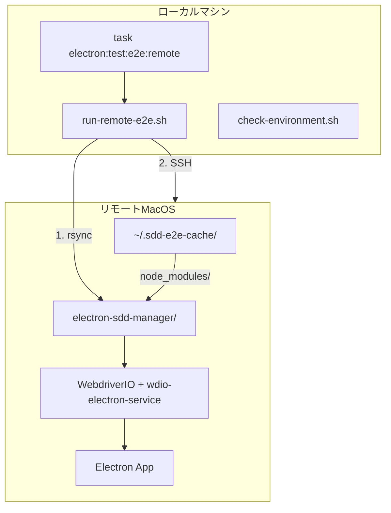
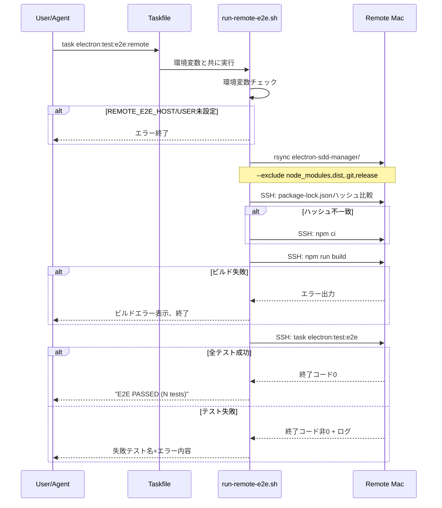

# Design: Remote E2E Execution

## Overview

**Purpose**: リモートMacOSマシンでE2Eテストを実行する機能を提供し、AIエージェントがE2Eテスト記述から動作確認までのサイクルを高速に回せるようにする。

**Users**: AIエージェント（Claude Code等）および開発者が、ローカルの変更をGitHubにpushせずにリモートマシンでE2Eテストを検証するために使用する。

**Impact**: 新規シェルスクリプト群とTaskfile統合を追加。既存のE2Eテストインフラ（WebdriverIO + Mock Claude CLI）はそのまま活用し、実行場所のみをリモートに移す。

### Goals

- rsyncによる差分転送で高速なファイル同期を実現
- `package-lock.json`ハッシュ比較による依存関係キャッシュで通常実行を高速化
- 失敗時のみ詳細情報を出力し、トークン消費を抑制
- `task electron:test:e2e:remote`による既存ワークフローとの統一

### Non-Goals

- SSH鍵の設定・管理（環境依存、ユーザーが事前設定）
- リモートマシンのNode.js/task等のインストール
- 複数リモートマシンの切り替え
- 並列E2E実行（技術的に困難）
- スクリーンショット/動画キャプチャの取得

## Architecture

### Architecture Pattern & Boundary Map



**Key Decisions**:
- シェルスクリプトベースで実装（既存の`electron-app.sh`パターンに準拠）
- rsyncの`--delete`オプションで確実な同期（ローカル削除ファイルもリモートで削除）
- リモートワークスペースは固定パス（`~/.sdd-e2e-cache/electron-sdd-manager/`）

**Architecture Integration**:
- Selected pattern: シェルスクリプト + Taskfile統合（既存パターン）
- Domain boundaries: スクリプトは`scripts/`配下、E2Eテスト実行はWebdriverIO既存インフラを使用
- Existing patterns preserved: `electron-app.sh`のカラー出力、エラーハンドリングパターン
- Steering compliance: KISS原則に従いシンプルな構成

### Technology Stack

| Layer | Choice / Version | Role in Feature | Notes |
|-------|------------------|-----------------|-------|
| Infrastructure | rsync, SSH | ファイル転送、リモートコマンド実行 | macOS標準搭載 |
| Automation | Taskfile.yml | コマンドインタフェース | 既存パターン準拠 |
| Testing | WebdriverIO 9.20.1 | E2Eテスト実行 | リモートで既存設定を使用 |
| Runtime | Node.js 20+, task | リモート実行環境 | 事前インストール前提 |

## System Flows

### メイン実行フロー



**Key Decisions**:
- rsyncは毎回実行（差分転送で高速）
- npm ciはハッシュ変更時のみ実行（通常実行の高速化）
- ビルドはリモートで実行（転送量削減）
- タイムアウトは15分（既存E2Eテストの5分タイムアウト×3の余裕）

## Requirements Traceability

| Criterion ID | Summary | Components | Implementation Approach |
|--------------|---------|------------|------------------------|
| 1.1 | 環境チェックスクリプト実行 | `check-environment.sh` | 新規作成 |
| 1.2 | Node.js 20以上確認 | `check-environment.sh` | `node -v`出力パース |
| 1.3 | npm確認 | `check-environment.sh` | `which npm` |
| 1.4 | task確認 | `check-environment.sh` | `which task` |
| 1.5 | ディスプレイ確認 | `check-environment.sh` | WindowServerプロセス確認 |
| 1.6 | 失敗時ヒント表示 | `check-environment.sh` | 各チェック失敗時メッセージ |
| 1.7 | 成功メッセージ | `check-environment.sh` | 全チェック成功時 |
| 2.1 | electron-sdd-manager転送 | `run-remote-e2e.sh` | rsync |
| 2.2 | rsync差分転送 | `run-remote-e2e.sh` | `-avz --delete` |
| 2.3 | 除外ディレクトリ | `run-remote-e2e.sh` | `--exclude` |
| 2.4 | SSH接続失敗処理 | `run-remote-e2e.sh` | ssh終了コードチェック |
| 2.5 | rsync失敗処理 | `run-remote-e2e.sh` | rsync終了コードチェック |
| 3.1 | キャッシュディレクトリ | `run-remote-e2e.sh` | `~/.sdd-e2e-cache/` |
| 3.2 | ハッシュ保存 | `run-remote-e2e.sh` | `.package-lock-hash`ファイル |
| 3.3 | ハッシュ比較 | `run-remote-e2e.sh` | md5/sha256比較 |
| 3.4 | npm ci実行条件 | `run-remote-e2e.sh` | ハッシュ不一致時 |
| 3.5 | npm ciスキップ | `run-remote-e2e.sh` | ハッシュ一致時 |
| 4.1 | npm run build実行 | `run-remote-e2e.sh` | SSHコマンド |
| 4.2 | ビルド失敗処理 | `run-remote-e2e.sh` | 終了コード+出力表示 |
| 5.1 | E2Eテスト実行 | `run-remote-e2e.sh` | `task electron:test:e2e` |
| 5.2 | Mock Claude使用 | - | 既存wdio.conf.ts設定を使用 |
| 5.3 | タイムアウト処理 | `run-remote-e2e.sh` | `timeout 15m` |
| 6.1 | 成功時出力 | `run-remote-e2e.sh`, `parse-e2e-result.sh` | テスト数カウント |
| 6.2 | 失敗時出力 | `run-remote-e2e.sh`, `parse-e2e-result.sh` | 失敗テスト抽出 |
| 6.3 | 終了コード | `run-remote-e2e.sh` | exit 0/1 |
| 7.1 | Taskfile統合 | `Taskfile.yml` | 新規タスク追加 |
| 7.2 | 環境変数指定 | `Taskfile.yml`, `run-remote-e2e.sh` | REMOTE_E2E_HOST/USER |
| 7.3 | 環境変数未設定エラー | `run-remote-e2e.sh` | 起動時チェック |
| 8.1 | SSH接続エラー表示 | `run-remote-e2e.sh` | 接続先情報付きメッセージ |
| 8.2 | コマンド失敗表示 | `run-remote-e2e.sh` | コマンド名+出力 |
| 8.3 | タイムアウト表示 | `run-remote-e2e.sh` | タイムアウト時間付きメッセージ |
| 8.4 | 終了コード非0 | `run-remote-e2e.sh` | 全エラーで適用 |

## Components and Interfaces

| Component | Domain/Layer | Intent | Req Coverage | Key Dependencies | Contracts |
|-----------|--------------|--------|--------------|-----------------|-----------|
| `run-remote-e2e.sh` | Scripts | メイン実行スクリプト | 2.x, 3.x, 4.x, 5.x, 6.x, 8.x | rsync, ssh, parse-e2e-result.sh | Service |
| `check-environment.sh` | Scripts | リモート環境確認 | 1.x | ssh | Service |
| `parse-e2e-result.sh` | Scripts | E2E結果パース | 6.x | - | Service |
| `Taskfile.yml` | Config | タスク定義 | 7.x | run-remote-e2e.sh | - |

### Scripts Layer

#### run-remote-e2e.sh

| Field | Detail |
|-------|--------|
| Intent | rsync転送、依存関係管理、ビルド、E2E実行を一貫して行うメインスクリプト |
| Requirements | 2.1-2.5, 3.1-3.5, 4.1-4.2, 5.1, 5.3, 6.1-6.3, 7.2-7.3, 8.1-8.4 |

**Responsibilities & Constraints**
- 環境変数（REMOTE_E2E_HOST, REMOTE_E2E_USER）の検証
- rsyncによるelectron-sdd-manager/の転送
- package-lock.jsonハッシュ比較と条件付きnpm ci
- npm run buildとtask electron:test:e2eの実行
- 結果のパースと構造化出力

**Dependencies**
- External: rsync, ssh, md5/sha256sum (macOS: md5, Linux: sha256sum)
- Outbound: parse-e2e-result.sh (結果パース)

**Contracts**: Service [x]

##### Service Interface

```bash
# Usage
./scripts/run-remote-e2e.sh

# Required Environment Variables
REMOTE_E2E_HOST  # リモートホスト名またはIP
REMOTE_E2E_USER  # SSHユーザー名

# Exit Codes
# 0: 全テスト成功
# 1: テスト失敗
# 2: 環境変数未設定
# 3: SSH接続失敗
# 4: rsync失敗
# 5: npm ci失敗
# 6: ビルド失敗
# 124: タイムアウト（timeoutコマンドの終了コード）
```

- Preconditions: REMOTE_E2E_HOST, REMOTE_E2E_USERが設定済み、SSH鍵認証が可能
- Postconditions: E2E結果が標準出力に出力される、終了コードが成功/失敗を示す
- Invariants: リモートキャッシュディレクトリ（~/.sdd-e2e-cache/）は維持される

**Implementation Notes**
- Integration: Taskfile.ymlから呼び出し
- Validation: 起動時に環境変数チェック
- Risks: SSH接続失敗、ネットワーク不安定

---

#### check-environment.sh

| Field | Detail |
|-------|--------|
| Intent | リモートマシンのE2E実行環境を検証し、問題があれば解決ヒントを表示 |
| Requirements | 1.1-1.7 |

**Responsibilities & Constraints**
- Node.jsバージョン（20以上）の確認
- npm、taskコマンドの存在確認
- macOSディスプレイ（WindowServer）の確認
- 失敗項目ごとの解決ヒント表示

**Dependencies**
- External: ssh

**Contracts**: Service [x]

##### Service Interface

```bash
# Usage
./scripts/check-environment.sh

# Required Environment Variables
REMOTE_E2E_HOST  # リモートホスト名またはIP
REMOTE_E2E_USER  # SSHユーザー名

# Exit Codes
# 0: 全チェック成功
# 1: いずれかのチェック失敗
```

- Preconditions: REMOTE_E2E_HOST, REMOTE_E2E_USERが設定済み
- Postconditions: 全チェック結果が標準出力に表示
- Invariants: リモート環境は変更されない（読み取り専用）

---

#### parse-e2e-result.sh (Summary Only)

| Field | Detail |
|-------|--------|
| Intent | WebdriverIO出力から成功/失敗情報を抽出し、構造化出力を生成 |
| Requirements | 6.1-6.2 |

標準入力からWebdriverIOのテスト出力を受け取り、成功時は`E2E PASSED (N tests)`、失敗時は失敗テスト名とエラー内容を抽出して出力する。

## Data Models

### Configuration

リモート接続設定は環境変数で管理:

```bash
REMOTE_E2E_HOST=mac-mini.local  # または IPアドレス
REMOTE_E2E_USER=developer
```

### Cache Structure

```
~/.sdd-e2e-cache/                      # リモートキャッシュルート
├── electron-sdd-manager/              # ワークスペース（rsync先）
│   ├── node_modules/                  # キャッシュされた依存関係
│   ├── dist/                          # ビルド成果物
│   └── ...                            # 転送されたソース
└── .package-lock-hash                 # package-lock.jsonのハッシュ
```

## Error Handling

### Error Strategy

全エラーは即座に処理を中断し、明確なエラーメッセージを表示して非0終了コードで終了する。

### Error Categories and Responses

| Error Type | Exit Code | Message Format | Recovery Action |
|------------|-----------|----------------|-----------------|
| 環境変数未設定 | 2 | `ERROR: REMOTE_E2E_HOST is not set` | 環境変数を設定 |
| SSH接続失敗 | 3 | `SSH connection error: user@host` | SSH設定確認、ネットワーク確認 |
| rsync失敗 | 4 | `rsync failed: [error output]` | ネットワーク確認、パス確認 |
| npm ci失敗 | 5 | `npm ci failed: [error output]` | package-lock.json確認 |
| ビルド失敗 | 6 | `Build failed: [error output]` | ソースコード確認 |
| タイムアウト | 124 | `Timeout: E2E test exceeded 15 minutes` | テスト見直し、リソース確認 |

## Testing Strategy

### Unit Tests

本機能はシェルスクリプトで構成されるため、ユニットテストは作成しない。

### Integration Tests

手動検証項目:
1. 環境チェックスクリプトの各項目が正しく検証されること
2. rsync転送が差分のみ行われること
3. ハッシュ一致時にnpm ciがスキップされること
4. E2E成功/失敗時の出力フォーマットが正しいこと

### E2E Tests

リモートE2E自体がE2Eテストを実行する機能のため、本機能のE2Eテストは作成しない。

## Verification Contract

### User Journey Definition

| Journey ID | Operation Flow | Expected Result | E2E Required |
|------------|---------------|-----------------|--------------|
| UJ-001 | 開発者がリモート環境をチェック | 成功/失敗と解決ヒント表示 | No |
| UJ-002 | 開発者がリモートE2Eを初回実行 | npm ci + ビルド + テスト実行 | No |
| UJ-003 | 開発者がリモートE2Eを再実行（依存関係変更なし） | npm ciスキップ + ビルド + テスト実行 | No |
| UJ-004 | 開発者がリモートE2Eを再実行（依存関係変更あり） | npm ci + ビルド + テスト実行 | No |
| UJ-005 | テスト成功時の出力確認 | `E2E PASSED (N tests)` 形式 | No |
| UJ-006 | テスト失敗時の出力確認 | 失敗テスト名+エラー内容 | No |

**Note**: 本機能はリモートマシンへのSSH接続を前提とするため、自動E2Eテストではなく手動検証を行う。

### Impact Analysis Contract

| Target File | Action | Reason |
|-------------|--------|--------|
| `scripts/run-remote-e2e.sh` | CREATE | メイン実行スクリプト |
| `scripts/check-environment.sh` | CREATE | リモート環境チェックスクリプト |
| `scripts/parse-e2e-result.sh` | CREATE | E2E結果パーススクリプト |
| `Taskfile.yml` | UPDATE | `electron:test:e2e:remote`タスク追加 |

## Design Decisions

### DD-001: シェルスクリプトベース実装

| Field | Detail |
|-------|--------|
| Status | Accepted |
| Context | リモートE2E実行機能をどの技術で実装するか |
| Decision | Bashシェルスクリプトで実装する |
| Rationale | 既存の`electron-app.sh`パターンに準拠し、rsync/sshコマンドを直接使用できる。Node.jsラッパーは不要なオーバーヘッド。 |
| Alternatives Considered | Node.jsスクリプト（ssh2ライブラリ使用）- 複雑化、依存関係追加 |
| Consequences | シェルスクリプトのポータビリティ（macOS/Linux）を考慮した実装が必要 |

### DD-002: リモートでビルド実行

| Field | Detail |
|-------|--------|
| Status | Accepted |
| Context | Electronアプリのビルドをローカルとリモートのどちらで行うか |
| Decision | リモートマシンでビルドを実行する |
| Rationale | dist/は生成物であり転送より再ビルドの方が確実。また転送量削減にも寄与。 |
| Alternatives Considered | ローカルでビルドして転送 - dist/の転送量増加、環境差異による問題リスク |
| Consequences | リモートマシンにビルド環境（Node.js、npm）が必要 |

### DD-003: package-lock.jsonハッシュ比較方式

| Field | Detail |
|-------|--------|
| Status | Accepted |
| Context | リモートのnode_modulesキャッシュの有効性をどう判断するか |
| Decision | package-lock.jsonのハッシュ値を比較し、変更時のみnpm ciを実行 |
| Rationale | package-lock.jsonが変わらなければ依存関係も同一。通常の開発サイクルではほとんどnpm ciが不要になる。 |
| Alternatives Considered | 毎回npm ci実行 - 不要な待ち時間、node_modulesを転送 - 転送量が大きすぎる |
| Consequences | 初回実行時とpackage-lock.json変更時のみ長時間待機 |

### DD-004: 失敗情報集中出力

| Field | Detail |
|-------|--------|
| Status | Accepted |
| Context | E2E結果をどの程度詳細に出力するか |
| Decision | 成功時は簡潔なサマリー、失敗時は失敗テスト名とエラー内容のみ |
| Rationale | AIエージェントは何を投げたか知っているため、失敗情報に集中。トークン消費抑制。 |
| Alternatives Considered | 全ログ出力 - トークン過多、終了コードのみ - デバッグ情報不足 |
| Consequences | WebdriverIOの出力パースが必要（parse-e2e-result.sh） |

### DD-005: 固定キャッシュディレクトリ

| Field | Detail |
|-------|--------|
| Status | Accepted |
| Context | リモートのキャッシュディレクトリを設定可能にするか |
| Decision | `~/.sdd-e2e-cache/`を固定パスとして使用 |
| Rationale | 設定項目を最小化しシンプルさを維持。複数プロジェクトの並列実行は非対応（要件外）。 |
| Alternatives Considered | 環境変数で設定可能 - 設定項目増加、管理コスト |
| Consequences | 並列実行や複数プロジェクト対応が必要になった場合は再設計 |
