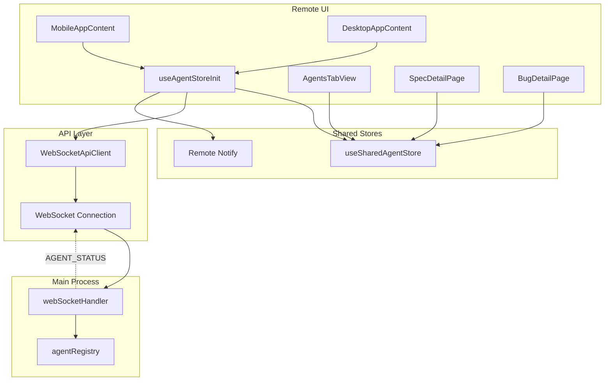
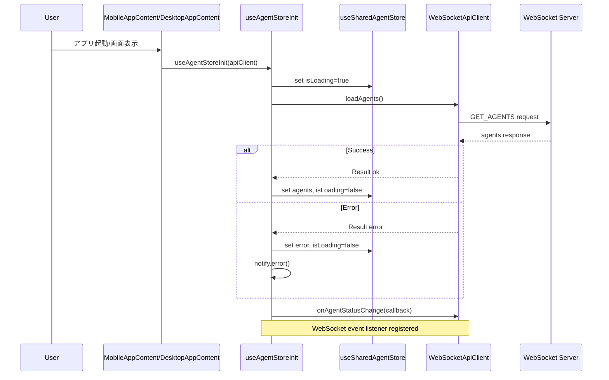
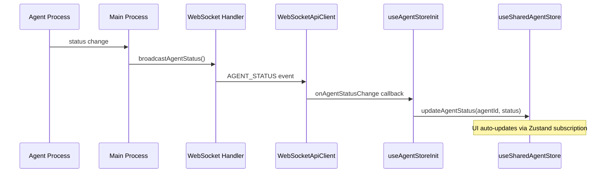
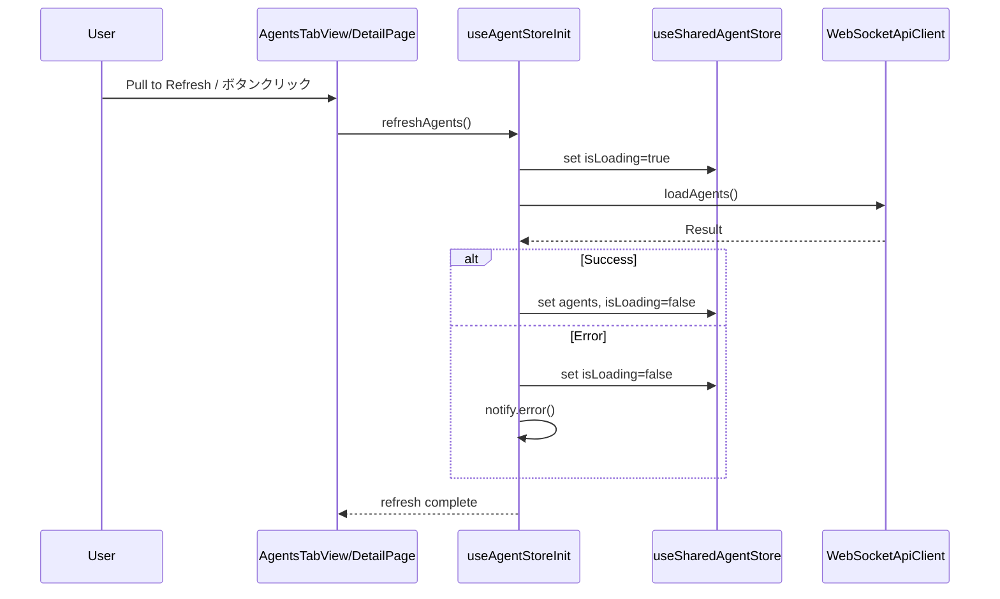

# Design: Remote UI Agent Store Initialization

## Overview

**Purpose**: Remote UI（Mobile/Desktop）のAgentsタブおよび関連画面でプロジェクトエージェント一覧が表示されない問題を修正する。

**Users**: Remote UIを使用するモバイル/デスクトップブラウザユーザー

**Impact**: 既存のMobileAppContentとDesktopAppContentに初期化処理を追加し、WebSocketイベントリスナーを設定することで、AgentStore（`useSharedAgentStore`）が適切に初期化・同期される。

### Goals

- MobileAppContent/DesktopAppContentマウント時にAgentStoreを初期化
- ローディング状態の適切な表示
- WebSocket経由のリアルタイム更新（既存AGENT_STATUSイベント活用）
- エラー発生時のnotify.error()表示とPull to Refresh/リフレッシュボタンによるリトライ

### Non-Goals

- Electron版（renderer）のAgent表示機能の変更
- Agent詳細画面の新規作成
- Agentのフィルタリング・検索機能
- WebSocketイベントの新規追加

## Architecture

### Existing Architecture Analysis

現在のRemote UIは以下の問題を抱えている:
- `useSharedAgentStore`がMobileAppContent/DesktopAppContentでは初期化されていない
- AgentsTabView, SpecDetailPage, BugDetailPageは`useSharedAgentStore`を参照するが、データが空のまま
- WebSocketの`AGENT_STATUS`イベントは存在するが、Storeへの反映が不完全

**既存パターンの確認**:
- `initBugAutoExecutionWebSocketListeners(apiClient)` パターンが既存（App.tsx line 607, 732）
- `apiClient.onAgentStatusChange()` が各所で個別にローカルステートを更新している
- `notify.error()` パターンはrenderer/stores/notificationStore.tsに存在

### Architecture Pattern & Boundary Map



**Architecture Integration**:
- **Selected pattern**: Custom Hook pattern（useAgentStoreInit）による初期化の集約
- **Domain boundaries**: 初期化ロジックをHookに分離し、UIコンポーネントは表示のみに専念
- **Existing patterns preserved**: 既存の`initBugAutoExecutionWebSocketListeners`パターンに準拠
- **New components rationale**: useAgentStoreInit Hookを新規追加（重複初期化コードの回避）
- **Steering compliance**: DRY原則、関心の分離を維持

### Technology Stack

| Layer | Choice / Version | Role in Feature | Notes |
|-------|------------------|-----------------|-------|
| Frontend | React 19 + TypeScript | UI Components, Hooks | 既存スタック |
| State Management | Zustand | useSharedAgentStore | 既存共有Store |
| Communication | WebSocket | Real-time updates | 既存AGENT_STATUSイベント |
| Notification | Remote Notify Store | Error display | Remote UI用に新規作成 |

## System Flows

### 初期化フロー



### リアルタイム更新フロー



### Pull to Refresh / リフレッシュボタンフロー



## Requirements Traceability

| Criterion ID | Summary | Components | Implementation Approach |
|--------------|---------|------------|------------------------|
| 1.1 | MobileAppContentマウント時にloadAgents呼び出し | MobileAppContent, useAgentStoreInit | 新規Hook追加、既存パターン踏襲 |
| 1.2 | DesktopAppContentマウント時にloadAgents呼び出し | DesktopAppContent, useAgentStoreInit | 新規Hook追加、既存パターン踏襲 |
| 1.3 | Agent一覧ロード完了時にagentStoreへ格納 | useSharedAgentStore | 既存loadAgentsメソッド使用 |
| 2.1 | ロード中にスピナー表示 | AgentsTabView, SpecDetailPage, BugDetailPage, Spinner | 既存Spinnerコンポーネント使用 |
| 2.2 | ロード完了時にAgent一覧表示 | AgentsTabView, SpecDetailPage, BugDetailPage | 既存AgentListコンポーネント使用 |
| 2.3 | Agent一覧が空の場合にメッセージ表示 | AgentList | 既存emptyMessage prop使用 |
| 3.1 | AGENT_STATUSイベント受信時にagentStore更新 | useAgentStoreInit, useSharedAgentStore | 新規WebSocketリスナー登録 |
| 3.2 | agentStore更新時にUI自動更新 | AgentsTabView, SpecDetailPage, BugDetailPage | Zustand subscription（既存動作） |
| 3.3 | 新しいAgent開始時にAgent一覧に追加 | useSharedAgentStore.addAgent | 既存メソッド使用 |
| 3.4 | Agent終了時にAgent一覧から削除/状態更新 | useSharedAgentStore.updateAgentStatus | 既存メソッド使用 |
| 4.1 | 取得失敗時にnotify.error()でトースト表示 | useAgentStoreInit, remoteNotify | Remote UI用Notify新規作成 |
| 4.2 | Mobile版でPull to Refresh時にAgent一覧再取得 | MobilePullToRefresh, useAgentStoreInit | 新規コンポーネント |
| 4.3 | Desktop版でリフレッシュボタンクリック時に再取得 | RefreshButton, useAgentStoreInit | 新規ボタン追加 |
| 5.1 | AgentsTabViewでPull to Refresh操作 | AgentsTabView, MobilePullToRefresh | 新規ラッパーコンポーネント |
| 5.2 | SpecDetailPageでPull to Refresh操作 | SpecDetailPage, MobilePullToRefresh | 既存コンポーネント拡張 |
| 5.3 | BugDetailPageでPull to Refresh操作 | BugDetailPage, MobilePullToRefresh | 既存コンポーネント拡張 |
| 5.4 | Pull to Refresh中にリフレッシュインジケーター表示 | MobilePullToRefresh | 新規コンポーネント内蔵 |
| 6.1 | AgentsTabViewにリフレッシュボタン表示（Desktop） | AgentsTabView, RefreshButton | 条件付きボタン表示 |
| 6.2 | SpecDetailPageにリフレッシュボタン表示（Desktop） | SpecDetailPage, RefreshButton | 条件付きボタン表示 |
| 6.3 | BugDetailPageにリフレッシュボタン表示（Desktop） | BugDetailPage, RefreshButton | 条件付きボタン表示 |
| 6.4 | リフレッシュボタンクリック時に再取得 | RefreshButton, useAgentStoreInit | refreshAgents関数呼び出し |
| 6.5 | リフレッシュ中にボタンをローディング状態表示 | RefreshButton | ボタン内蔵ローディング状態 |

### Coverage Validation Checklist

- [x] Every criterion ID from requirements.md appears in the table above
- [x] Each criterion has specific component names (not generic references)
- [x] Implementation approach distinguishes "reuse existing" vs "new implementation"
- [x] User-facing criteria specify concrete UI components

## Components and Interfaces

| Component | Domain/Layer | Intent | Req Coverage | Key Dependencies (P0/P1) | Contracts |
|-----------|--------------|--------|--------------|--------------------------|-----------|
| useAgentStoreInit | Hook | AgentStore初期化とWebSocket同期 | 1.1, 1.2, 1.3, 3.1, 3.2, 3.3, 3.4, 4.1 | ApiClient (P0), useSharedAgentStore (P0) | State |
| MobilePullToRefresh | UI | Pull to Refresh wrapper | 4.2, 5.1, 5.2, 5.3, 5.4 | useAgentStoreInit (P0) | - |
| RefreshButton | UI | Desktop refresh button | 4.3, 6.1, 6.2, 6.3, 6.4, 6.5 | useAgentStoreInit (P0) | - |
| remoteNotify | Utility | Remote UI用通知 | 4.1 | - | Service |

### Hooks

#### useAgentStoreInit

| Field | Detail |
|-------|--------|
| Intent | MobileAppContent/DesktopAppContentでAgentStoreを初期化し、WebSocketイベントを購読 |
| Requirements | 1.1, 1.2, 1.3, 3.1, 3.2, 3.3, 3.4, 4.1 |

**Responsibilities & Constraints**
- アプリマウント時に`useSharedAgentStore.loadAgents(apiClient)`を呼び出す
- WebSocket`AGENT_STATUS`イベントを購読し、Store更新を行う
- エラー発生時に`remoteNotify.error()`を呼び出す
- クリーンアップ時にイベント購読を解除する

**Dependencies**
- Inbound: MobileAppContent, DesktopAppContent (P0)
- Outbound: useSharedAgentStore (P0), ApiClient (P0), remoteNotify (P1)

**Contracts**: State [x]

##### Service Interface
```typescript
interface UseAgentStoreInitReturn {
  /** Agent一覧を再取得する */
  refreshAgents: () => Promise<void>;
  /** ロード中フラグ */
  isLoading: boolean;
  /** エラーメッセージ */
  error: string | null;
}

/**
 * AgentStoreを初期化し、WebSocketイベントを購読するHook
 * @param apiClient - WebSocketApiClient instance
 * @returns UseAgentStoreInitReturn
 */
function useAgentStoreInit(apiClient: ApiClient): UseAgentStoreInitReturn;
```

**Implementation Notes**
- Integration: 既存の`initBugAutoExecutionWebSocketListeners`パターンに準拠
- Validation: apiClientがnullの場合は早期リターン
- Risks: WebSocket切断時の再接続は既存のReconnectOverlayに委譲

### UI Components

#### MobilePullToRefresh

| Field | Detail |
|-------|--------|
| Intent | Pull to Refresh操作を提供するラッパーコンポーネント |
| Requirements | 4.2, 5.1, 5.2, 5.3, 5.4 |

**Responsibilities & Constraints**
- childrenをラップし、Pull to Refresh操作を検出
- リフレッシュ中はインジケーターを表示
- `onRefresh`コールバックを呼び出す

**Dependencies**
- Inbound: AgentsTabView, SpecDetailPage, BugDetailPage (P0)
- Outbound: None

**Contracts**: -

##### Props Interface
```typescript
interface MobilePullToRefreshProps {
  /** Refresh callback */
  onRefresh: () => Promise<void>;
  /** Whether refresh is in progress */
  isRefreshing: boolean;
  /** Children to wrap */
  children: React.ReactNode;
  /** Test ID */
  testId?: string;
}
```

**Implementation Notes**
- Integration: CSS touch-action と scroll event による実装
- Validation: モバイルデバイスのみで有効化（useDeviceTypeで判定）
- Risks: iOS/Android間のスクロール挙動差異（閾値調整で対応）

#### RefreshButton

| Field | Detail |
|-------|--------|
| Intent | Desktop版でAgent一覧をリフレッシュするボタン |
| Requirements | 4.3, 6.1, 6.2, 6.3, 6.4, 6.5 |

**Responsibilities & Constraints**
- クリック時に`onRefresh`を呼び出す
- ローディング中はスピナーを表示し、ボタンを無効化

**Dependencies**
- Inbound: AgentsTabView, SpecDetailPage, BugDetailPage (P0)
- Outbound: None

**Contracts**: -

##### Props Interface
```typescript
interface RefreshButtonProps {
  /** Refresh callback */
  onRefresh: () => Promise<void>;
  /** Whether refresh is in progress */
  isLoading: boolean;
  /** Optional label (default: none, icon only) */
  label?: string;
  /** Test ID */
  testId?: string;
}
```

**Implementation Notes**
- Integration: 既存のLucide Reactアイコン（RefreshCw）を使用
- Validation: なし
- Risks: なし

### Utility

#### remoteNotify

| Field | Detail |
|-------|--------|
| Intent | Remote UI用のトースト通知を提供 |
| Requirements | 4.1 |

**Responsibilities & Constraints**
- `error()`, `success()`, `info()`, `warning()` メソッドを提供
- トースト表示の管理（自動消去、最大表示数制限）

**Dependencies**
- Inbound: useAgentStoreInit (P1)
- Outbound: RemoteNotificationStore (P0)

**Contracts**: Service [x]

##### Service Interface
```typescript
interface RemoteNotify {
  success: (message: string) => void;
  error: (message: string) => void;
  warning: (message: string) => void;
  info: (message: string) => void;
}

export const remoteNotify: RemoteNotify;
```

**Implementation Notes**
- Integration: Electron版notifyパターンに準拠した設計
- Logging: `console.info`/`console.error`/`console.warn`を使用してブラウザコンソールにログ出力（Remote UIではrendererLoggerが使用不可のため）
- Validation: なし
- Risks: なし

## Data Models

### Domain Model

本機能では新規データモデルの追加はない。既存の`AgentInfo`型を使用する。

### State Management

**useSharedAgentStore** (既存):
```typescript
interface SharedAgentState {
  agents: Map<string, AgentInfo[]>;  // specId -> agents
  selectedAgentId: string | null;
  selectedAgentIdBySpec: Map<string, string | null>;
  logs: Map<string, LogEntry[]>;
  isLoading: boolean;
  error: string | null;
}
```

**RemoteNotificationStore** (新規):
```typescript
interface RemoteNotification {
  id: string;
  type: 'success' | 'error' | 'warning' | 'info';
  message: string;
  duration: number;
}

interface RemoteNotificationState {
  notifications: RemoteNotification[];
}
```

## Error Handling

### Error Strategy

| Error Type | Detection | Response | Recovery |
|------------|-----------|----------|----------|
| API Error (loadAgents失敗) | Result.ok === false | notify.error()でトースト表示 | Pull to Refresh / リフレッシュボタン |
| WebSocket切断 | onDisconnect event | ReconnectOverlay表示（既存） | 自動再接続（既存） |
| Timeout | DEFAULT_TIMEOUT超過 | notify.error()でトースト表示 | Pull to Refresh / リフレッシュボタン |

### Error Messages

```typescript
const ERROR_MESSAGES = {
  LOAD_FAILED: 'Agent一覧の取得に失敗しました',
  REFRESH_FAILED: 'Agent一覧の更新に失敗しました',
};
```

## Testing Strategy

### Unit Tests

- `useAgentStoreInit`: 初期化成功/失敗、WebSocketイベント購読/解除
- `MobilePullToRefresh`: Pull to Refresh操作検出、インジケーター表示
- `RefreshButton`: クリックイベント、ローディング状態表示
- `remoteNotify`: 各種通知メソッド、自動消去

### Integration Tests

- MobileAppContent: マウント時のAgentStore初期化確認
- DesktopAppContent: マウント時のAgentStore初期化確認
- WebSocket: AGENT_STATUSイベント受信時のStore更新確認
- Error: API失敗時のnotify.error()呼び出し確認

### E2E Tests

- Mobile: Agentsタブ表示 → Agent一覧表示確認
- Mobile: Pull to Refresh → 一覧更新確認
- Desktop: Agentsタブ表示 → Agent一覧表示確認
- Desktop: リフレッシュボタン → 一覧更新確認

## Integration Test Strategy

### Components

- MobileAppContent / DesktopAppContent
- useAgentStoreInit Hook
- useSharedAgentStore
- WebSocketApiClient
- remoteNotify

### Data Flow

```
MobileAppContent.mount
  -> useAgentStoreInit(apiClient)
  -> apiClient.getAgents()
  -> useSharedAgentStore.loadAgents()
  -> AgentsTabView reads from store
```

### Mock Boundaries

| Boundary | Mock / Real | Rationale |
|----------|-------------|-----------|
| WebSocketApiClient | Mock | ネットワーク依存を排除 |
| useSharedAgentStore | Real | Store統合をテスト |
| remoteNotify | Mock | 通知呼び出しを検証 |

### Verification Points

1. **初期化成功**: Store.isLoading: true -> false、Store.agents: populated
2. **初期化失敗**: Store.isLoading: true -> false、Store.error: set、notify.error called
3. **WebSocketイベント**: Store.agents updated on AGENT_STATUS event
4. **リフレッシュ**: refreshAgents() -> Store.isLoading toggle -> Store.agents updated

### Robustness Strategy

- `waitFor` パターンでStore状態遷移を監視（固定sleepは使用しない）
- Mock apiClientの応答遅延をPromise.resolveで即座に解決
- WebSocketイベントはeventListenersへの直接invoke

### Prerequisites

- 既存の`@testing-library/react`ヘルパー使用
- Mock apiClient factory関数の作成が必要

## Design Decisions

### DD-001: 初期化ロジックの集約方法

| Field | Detail |
|-------|--------|
| Status | Accepted |
| Context | MobileAppContentとDesktopAppContentの両方でAgentStore初期化が必要だが、重複コードを避けたい |
| Decision | `useAgentStoreInit` Hookを新規作成し、初期化ロジックを集約する |
| Rationale | DRY原則に従い、既存の`initBugAutoExecutionWebSocketListeners`パターンと一貫性を保つ |
| Alternatives Considered | (1) 各コンポーネントで直接初期化 - 重複コード発生、(2) Higher-Order Component - 複雑すぎる |
| Consequences | Hook追加によりテスト容易性向上、将来の拡張も容易 |

### DD-002: WebSocketイベント購読の方式

| Field | Detail |
|-------|--------|
| Status | Accepted |
| Context | AGENT_STATUSイベントをどのようにStore更新に反映するか |
| Decision | `useAgentStoreInit` Hook内で`apiClient.onAgentStatusChange()`を購読し、`useSharedAgentStore.updateAgentStatus()`を呼び出す |
| Rationale | 既存App.tsxの各所でローカルステート更新していたパターンを、Store一元管理に統合する |
| Alternatives Considered | (1) 各コンポーネントで個別購読 - 既存パターンだが非効率、(2) ApiClient内で直接Store更新 - 責務境界違反 |
| Consequences | Store更新の一元化により、全UIコンポーネントが自動更新される |

### DD-003: Remote UI用通知システム

| Field | Detail |
|-------|--------|
| Status | Accepted |
| Context | Remote UIにはElectron版のnotificationStoreが存在しない |
| Decision | `remote-ui/stores/remoteNotificationStore.ts`を新規作成し、`remoteNotify`ヘルパーを提供 |
| Rationale | Electron版のnotifyパターンに準拠し、一貫したAPIを提供 |
| Alternatives Considered | (1) shared/storesに共通化 - Electron依存コード（rendererLogger）の分離が必要で複雑、(2) 通知なし - UX低下 |
| Consequences | Remote UI専用の軽量通知システム、将来的にsharedへの統合も可能 |

**将来的な統合方針**:
現時点ではElectron版の`notificationStore`が`rendererLogger`に依存しているため、直接の共通化は見送り。将来的に以下のアプローチで統合を検討可能:
1. 共通インタフェース`INotificationService`を`shared/`に定義
2. Electron版・Remote UI版それぞれが同インタフェースを実装
3. `rendererLogger`依存部分を注入可能なLogger抽象化で分離

### DD-004: Pull to Refresh実装方式

| Field | Detail |
|-------|--------|
| Status | Accepted |
| Context | モバイル版でPull to Refresh操作をどう実装するか |
| Decision | カスタムコンポーネント`MobilePullToRefresh`を作成し、CSSとtouch eventで実装 |
| Rationale | 外部ライブラリ依存を避け、軽量な実装を維持 |
| Alternatives Considered | (1) react-pull-to-refresh等のライブラリ使用 - 依存追加、(2) ブラウザネイティブ - 制御困難 |
| Consequences | バンドルサイズ増加なし、カスタマイズ容易 |

### DD-005: Desktop版リフレッシュUIの配置

| Field | Detail |
|-------|--------|
| Status | Accepted |
| Context | Desktop版でリフレッシュボタンをどこに配置するか |
| Decision | Agent一覧セクションのヘッダー右端にアイコンボタンを配置 |
| Rationale | Electron版のProjectAgentPanelと同様の配置で一貫性を保つ |
| Alternatives Considered | (1) ページヘッダー - 目立ちすぎる、(2) コンテキストメニュー - 発見しにくい |
| Consequences | 直感的な操作性、Electron版との一貫性 |

## Integration & Deprecation Strategy

### 修正が必要な既存ファイル（Wiring Points）

| File | Modification | Rationale |
|------|--------------|-----------|
| `remote-ui/App.tsx` | MobileAppContent, DesktopAppContentに`useAgentStoreInit` Hook追加 | 初期化処理の統合 |
| `remote-ui/components/AgentsTabView.tsx` | ローディング状態表示追加、Desktop版リフレッシュボタン追加 | Req 2.1, 6.1 |
| `remote-ui/components/SpecDetailPage.tsx` | ローディング状態表示追加、Desktop版リフレッシュボタン追加 | Req 2.1, 6.2 |
| `remote-ui/components/BugDetailPage.tsx` | ローディング状態表示追加、Desktop版リフレッシュボタン追加 | Req 2.1, 6.3 |

### 新規作成ファイル

| File | Purpose |
|------|---------|
| `remote-ui/hooks/useAgentStoreInit.ts` | AgentStore初期化Hook |
| `remote-ui/components/MobilePullToRefresh.tsx` | Pull to Refreshラッパー |
| `remote-ui/components/RefreshButton.tsx` | Desktop版リフレッシュボタン |
| `remote-ui/stores/remoteNotificationStore.ts` | Remote UI用通知Store |
| `remote-ui/components/ToastContainer.tsx` | トースト表示コンテナ |

### 削除が必要なファイル

なし

### 並行作成の明記

- `remote-ui/hooks/useAgentStoreInit.ts`は新規作成（既存ファイルとの並行はない）
- `remote-ui/stores/remoteNotificationStore.ts`は新規作成（renderer/stores/notificationStore.tsとは別、Remote UI専用）
