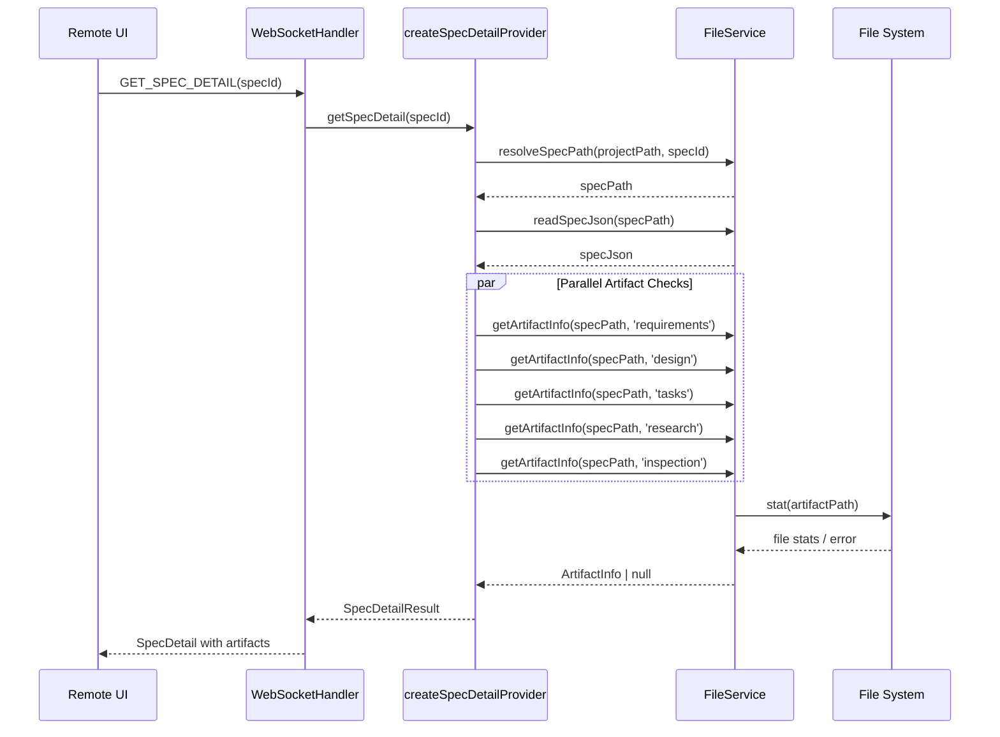

# Design: Remote UI Artifact Exists Check

## Overview

**Purpose**: Remote UIユーザーがSpec詳細画面でartifactタブ（requirements, design, tasks, research, inspection）を正しく表示できるようにする。

**Users**: Remote UIを使用するユーザー（モバイル/ブラウザ経由でのアクセス）

**Impact**: `createSpecDetailProvider`関数を修正し、ハードコードされた`exists: false`を実際のファイル存在チェックに置き換える。

### Goals

- Remote UIでSpec詳細取得時に各アーティファクトの存在を正確にチェックする
- Electron版と同等のartifactタブ表示を実現する
- 既存のdocument-review/inspection/markdownFilesタブ表示に影響を与えない

### Non-Goals

- Bug詳細のartifacts処理変更（既に正しく実装済み）
- アーティファクトの`updatedAt`フィールドの設定（ファイル存在チェックのみ）
- アーティファクトの`content`フィールドの設定（別APIで取得）
- Electron版（IPC）のartifacts処理の変更

## Architecture

### Existing Architecture Analysis

**現状の問題**:
- `createSpecDetailProvider`（remoteAccessHandlers.ts:549-616）が`artifacts`フィールドを全て`exists: false`でハードコード
- Remote UIの`RemoteArtifactEditor`は`specDetail.artifacts`を参照してタブをフィルタリングするため、全てのartifactタブが非表示になる

**参照すべき既存実装**:
- `FileService.getArtifactInfo()`（fileService.ts:384-395）: アーティファクトの存在チェックとupdatedAt取得
- `BugService.getBugArtifacts()`（bugService.ts:293-318）: Bug側のartifact存在チェック（正しく実装済み）
- `ElectronSpecWorkflowApi.getSpecDetail()`（ElectronSpecWorkflowApi.ts:245-295）: Electron版のartifact読み込み

### Architecture Pattern & Boundary Map



**Key Decisions**:
- `FileService.getArtifactInfo()`を再利用し、DRY原則を維持
- `Promise.all()`で5つのartifact存在チェックを並列実行してパフォーマンスを確保
- `ArtifactInfo | null`の結果を`{ exists: true/false }`形式に変換

### Technology Stack

| Layer | Choice / Version | Role in Feature | Notes |
|-------|------------------|-----------------|-------|
| Backend / Services | FileService | アーティファクトファイル存在チェック | 既存メソッド`getArtifactInfo`を使用 |

## System Flows

本機能は既存フローの修正のため、新規フローの追加はなし。上記シーケンス図で修正箇所を示す。

## Requirements Traceability

| Criterion ID | Summary | Components | Implementation Approach |
|--------------|---------|------------|------------------------|
| 1.1 | GET_SPEC_DETAIL時にartifacts存在チェック | `createSpecDetailProvider` | 既存FileService.getArtifactInfoを使用 |
| 1.2 | 存在するartifactのexistsをtrueに設定 | `createSpecDetailProvider` | getArtifactInfoの結果をマッピング |
| 1.3 | 存在しないartifactのexistsをfalseに設定 | `createSpecDetailProvider` | null結果を`{ exists: false }`に変換 |
| 1.4 | FileServiceの既存メソッドを使用 | `createSpecDetailProvider` | `FileService.getArtifactInfo()`を呼び出し |
| 1.5 | 並列実行でパフォーマンス確保 | `createSpecDetailProvider` | `Promise.all()`で5つのチェックを並列化 |
| 2.1 | document-reviewタブ表示に影響なし | - | 既存ロジック維持（変更なし） |
| 2.2 | inspectionタブ表示に影響なし | - | 既存ロジック維持（変更なし） |
| 2.3 | markdownFilesタブ表示に影響なし | - | 既存ロジック維持（変更なし） |
| 3.1 | inspection.md存在時にexists: true | `createSpecDetailProvider` | getArtifactInfo('inspection')の結果をマッピング |
| 3.2 | inspection.md非存在時にexists: false | `createSpecDetailProvider` | null結果を`{ exists: false }`に変換 |

### Coverage Validation Checklist

- [x] Every criterion ID from requirements.md appears in the table above
- [x] Each criterion has specific component names (not generic references)
- [x] Implementation approach distinguishes "reuse existing" vs "new implementation"
- [x] User-facing criteria specify concrete UI components (not just "shared components")

## Components and Interfaces

### Summary

| Component | Domain/Layer | Intent | Req Coverage | Key Dependencies | Contracts |
|-----------|--------------|--------|--------------|------------------|-----------|
| `createSpecDetailProvider` | IPC/RemoteAccess | Spec詳細をRemote UIに提供 | 1.1-1.5, 3.1-3.2 | FileService (P0) | Service |

### IPC / Remote Access Layer

#### createSpecDetailProvider (修正)

| Field | Detail |
|-------|--------|
| Intent | Remote UI向けにSpec詳細（artifacts含む）を提供する |
| Requirements | 1.1, 1.2, 1.3, 1.4, 1.5, 3.1, 3.2 |

**Responsibilities & Constraints**
- specPathの解決とspecJsonの読み込み
- 5種類のアーティファクト（requirements, design, tasks, research, inspection）の存在チェック
- 既存の`markdownFiles`取得ロジックは変更しない

**Dependencies**
- Inbound: `WebSocketHandler` — GET_SPEC_DETAIL リクエスト処理 (P0)
- Outbound: `FileService.resolveSpecPath()` — specPath解決 (P0)
- Outbound: `FileService.readSpecJson()` — spec.json読み込み (P0)
- Outbound: `FileService.getArtifactInfo()` — artifact存在チェック (P0)
- Outbound: `FileService.listMarkdownFilesInSpec()` — 追加markdownファイル一覧 (P1)

**Contracts**: Service [x]

##### Service Interface

```typescript
// createSpecDetailProvider内部で使用するartifact存在チェックヘルパー
async function checkArtifactExists(
  fileService: FileService,
  specPath: string,
  artifactName: string
): Promise<{ exists: boolean }>;

// 戻り値の型（変更なし、既存のSpecDetailResult）
interface SpecDetailResult {
  name: string;
  path: string;
  phase: string;
  specJson: Record<string, unknown>;
  metadata: {
    name: string;
    path: string;
    phase: string;
    updatedAt?: string;
    approvals?: Record<string, unknown>;
  };
  artifacts: {
    requirements: { exists: boolean };
    design: { exists: boolean };
    tasks: { exists: boolean };
    research: { exists: boolean };
    inspection: { exists: boolean };
  };
  taskProgress: null;
  markdownFiles: string[];
}
```

- Preconditions: `specId`が有効なSpec名であること
- Postconditions: `artifacts`の各フィールドが実際のファイル存在状態を反映
- Invariants: 既存の`markdownFiles`、`specJson`、`metadata`フィールドは変更されない

**Implementation Notes**
- Integration: 既存の`FileService.getArtifactInfo()`を使用
- Validation: specPath解決失敗時は`NOT_FOUND`エラーを返す
- Risks: ファイルシステムアクセスのレイテンシ（`Promise.all()`で軽減）

## Data Models

本機能では新規データモデルの追加なし。既存の`SpecDetailResult`インターフェースの`artifacts`フィールドを正しく設定するのみ。

## Error Handling

### Error Strategy

既存のエラーハンドリングを維持。`getArtifactInfo()`が`null`を返す場合（ファイル不在）は正常系として`{ exists: false }`を設定。

### Error Categories and Responses

| Error Type | Condition | Response |
|------------|-----------|----------|
| NOT_FOUND | specPath解決失敗 | `{ ok: false, error: { type: 'NOT_FOUND' } }` |
| NOT_FOUND | spec.json読み込み失敗 | `{ ok: false, error: { type: 'NOT_FOUND' } }` |
| Artifact Not Found | artifact.md不在 | 正常系: `{ exists: false }` |

## Testing Strategy

### Unit Tests

1. `createSpecDetailProvider`が全artifactが存在する場合に正しい`exists: true`を返すこと
2. `createSpecDetailProvider`が一部artifactのみ存在する場合に正しい`exists`値を返すこと
3. `createSpecDetailProvider`が全artifactが存在しない場合に全て`exists: false`を返すこと
4. `FileService.getArtifactInfo`が`null`を返す場合のマッピング確認
5. `Promise.all`で5つのチェックが並列実行されること

### Integration Tests

1. WebSocket経由でGET_SPEC_DETAILを呼び出し、正しい`artifacts`が返ること
2. Electron版と同等のartifact存在情報が返ること

## Verification Contract

### User Journey Definition

| Journey ID | Operation Flow | Expected Result | E2E Required |
|------------|---------------|-----------------|--------------|
| UJ-001 | Remote UIでSpec詳細を開き、Artifactタブを確認 | 存在するartifact（requirements, design等）のタブが表示される | Yes |
| UJ-002 | 新規Spec（artifactなし）の詳細を開く | artifactタブが非表示（または「未生成」状態） | Yes |

### Impact Analysis Contract

| Target File | Action | Reason |
|-------------|--------|--------|
| `electron-sdd-manager/src/main/ipc/remoteAccessHandlers.ts` | UPDATE | `createSpecDetailProvider`でartifact存在チェックを追加 |

## Design Decisions

### DD-001: FileService.getArtifactInfoの再利用

| Field | Detail |
|-------|--------|
| Status | Accepted |
| Context | Remote UIでartifact存在チェックを実装する方法を決定する必要がある |
| Decision | 既存の`FileService.getArtifactInfo()`メソッドを再利用する |
| Rationale | DRY原則の遵守、Electron版と同じロジックの共有、テスト済みコードの再利用 |
| Alternatives Considered | 1. 新規メソッド作成（冗長）、2. `fs.access`直接使用（低レベル操作が露出） |
| Consequences | FileServiceへの依存が増えるが、一貫性が向上する |

### DD-002: Promise.allによる並列実行

| Field | Detail |
|-------|--------|
| Status | Accepted |
| Context | 5つのartifact存在チェックをどのように実行するか（要件1.5） |
| Decision | `Promise.all()`で全チェックを並列実行する |
| Rationale | 順次実行だと5回のファイルシステムアクセスで遅延が累積する。並列実行で最大5倍の高速化が期待できる |
| Alternatives Considered | 1. 順次実行（シンプルだが遅い）、2. `Promise.allSettled()`（エラー時の挙動が複雑） |
| Consequences | 5つのI/Oが同時に発生するが、ローカルファイルシステムでは問題にならない |

### DD-003: ArtifactInfo | null から { exists: boolean } への変換

| Field | Detail |
|-------|--------|
| Status | Accepted |
| Context | `FileService.getArtifactInfo()`は`ArtifactInfo | null`を返すが、WebSocket APIは`{ exists: boolean }`を期待する |
| Decision | `getArtifactInfo()`の結果を`{ exists: result !== null }`に変換する |
| Rationale | 既存APIの戻り値型を変更せず、呼び出し側で変換することで後方互換性を維持 |
| Alternatives Considered | 1. FileServiceのAPIを変更（影響範囲大）、2. 新規メソッド追加（冗長） |
| Consequences | 変換ロジックがcreateSpecDetailProviderに局所化される |

## Integration Test Strategy

### Components

- `WebSocketHandler` (GET_SPEC_DETAIL handler)
- `createSpecDetailProvider`
- `FileService`

### Data Flow

1. Remote UIからWebSocket経由でGET_SPEC_DETAILリクエスト送信
2. WebSocketHandlerが`specDetailProvider.getSpecDetail(specId)`を呼び出し
3. createSpecDetailProviderがFileServiceを使用してartifact存在チェック
4. 結果がRemote UIに返却され、`RemoteArtifactEditor`がタブを表示

### Mock Boundaries

- **Real Implementation**: `FileService`（実ファイルシステムアクセス）
- **Mock**: WebSocket transport（テスト用スタブ）、またはE2Eで実WebSocket使用

### Verification Points

1. `artifacts.requirements.exists`が実ファイルの存在状態と一致
2. `artifacts.design.exists`が実ファイルの存在状態と一致
3. `artifacts.tasks.exists`が実ファイルの存在状態と一致
4. `artifacts.research.exists`が実ファイルの存在状態と一致
5. `artifacts.inspection.exists`が実ファイルの存在状態と一致

### Robustness Strategy

- `waitFor`パターンでWebSocketレスポンスを待機（固定スリープを避ける）
- テスト用Specディレクトリをセットアップ/クリーンアップ
- 複数のartifact存在パターン（全存在、部分存在、全不在）をカバー

### Prerequisites

- 既存のWebSocket E2Eテストインフラ（`webSocketHandler.test.ts`）を再利用可能
- テスト用Specディレクトリのセットアップヘルパー
