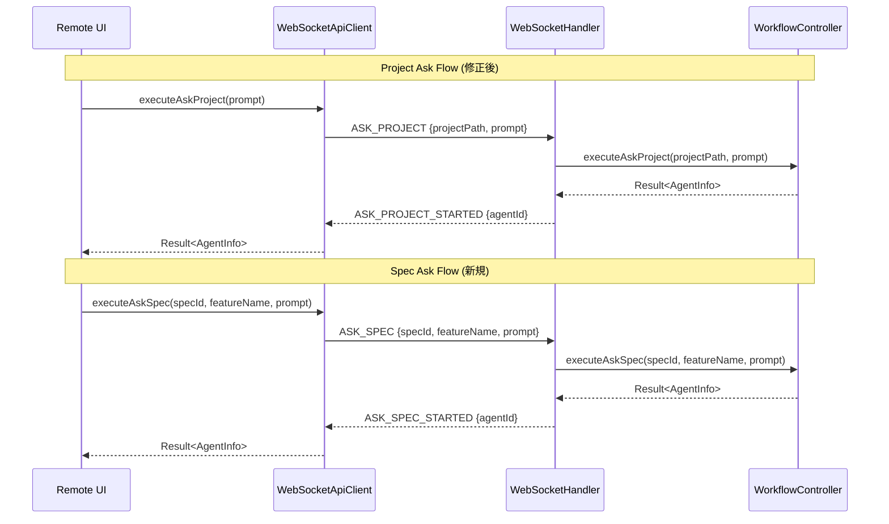

# Design Document: Remote UI Ask Agent Fix

## Overview

**Purpose**: この機能は、Remote UIから Ask Agent 機能（project-ask / spec-ask）を正常に実行可能にする。現在、Remote UIの project-ask はダイアログは表示されるが Agent が起動しないバグがあり、spec-ask は Remote UI に UI 自体が存在しない。

**Users**: Remote UIユーザーがプロジェクトレベル/Specレベルの質問をAIエージェントに送信し、回答を得るワークフロー。

**Impact**: WebSocketApiClient のメッセージタイプ修正と、SpecDetailPage への Spec Ask UI 追加により、Remote UI でも Desktop 版と同等の Ask Agent 機能が利用可能になる。

### Goals

- WebSocketApiClient.executeAskProject のメッセージタイプを `ASK_PROJECT` に修正し、project-ask が正常動作するようにする
- WebSocketApiClient に executeAskSpec メソッドを追加し、spec-ask の WebSocket API を提供する
- SpecDetailPage に Spec Ask ボタンと AskAgentDialog を追加し、Remote UI から spec-ask を実行可能にする

### Non-Goals

- AgentListPanel 全体の shared 化（大規模リファクタリング）
- Desktop Electron 版の修正（既に正常動作）
- Bug 詳細画面への Ask 機能追加（Bug には Ask は不要）
- E2E テストの追加
- IpcApiClient への executeAskSpec 実装（Electron 版は window.electronAPI.executeAskSpec を直接呼び出す設計であり、ApiClient 抽象層は経由しない）

## Architecture

### Existing Architecture Analysis

現在の Remote UI Ask Agent アーキテクチャ:

- **WebSocketApiClient**: Remote UI と Main プロセス間の WebSocket 通信を担当
- **WebSocketHandler**: Main プロセスで WebSocket メッセージを処理し、対応するハンドラを実行
- **AskAgentDialog**: 共有コンポーネントとして `shared/components/project/` に配置済み
- **AgentsTabView**: project-ask 機能を持つが、メッセージタイプ不一致によりバグあり

### Architecture Pattern & Boundary Map



**Key Decisions**:
- 既存の WebSocketHandler.handleAskProject / handleAskSpec ハンドラは正しく実装されており、変更不要
- クライアント側（WebSocketApiClient）のメッセージタイプを修正する方針
- AskAgentDialog は既存の shared コンポーネントを再利用

**Architecture Integration**:
- Selected pattern: 既存の WebSocket request/response パターンを継続
- Domain/feature boundaries: ApiClient 層でのメッセージ変換
- Existing patterns preserved: wrapRequest パターン、Result 型、AgentStore 統合
- Steering compliance: 共有コンポーネント活用、SSOT 原則

### Technology Stack

| Layer | Choice / Version | Role in Feature |
|-------|------------------|-----------------|
| Frontend | React 19, TypeScript 5.8+ | UI コンポーネント、状態管理 |
| Communication | WebSocket (ws) | Remote UI - Main プロセス間通信 |
| State | Zustand (agentStore) | Agent 状態管理 |

## Requirements Traceability

| Criterion ID | Summary | Components | Implementation Approach |
|--------------|---------|------------|------------------------|
| 1.1 | executeAskProject は ASK_PROJECT を送信 | WebSocketApiClient | 既存メソッド修正 |
| 1.2 | payload に projectPath と prompt を含む | WebSocketApiClient | 既存メソッド修正 |
| 1.3 | projectPath は getProjectPath() から取得 | WebSocketApiClient | 既存メソッド修正 |
| 1.4 | ASK_PROJECT_STARTED で AgentInfo を返す | WebSocketApiClient | 既存メソッド修正 |
| 2.1 | executeAskSpec メソッドを追加 | WebSocketApiClient, ApiClient | 新規メソッド追加 |
| 2.2 | ASK_SPEC を送信 | WebSocketApiClient | 新規メソッド追加 |
| 2.3 | payload に specId, featureName, prompt を含む | WebSocketApiClient | 新規メソッド追加 |
| 2.4 | ASK_SPEC_STARTED で AgentInfo を返す | WebSocketApiClient | 新規メソッド追加 |
| 3.1 | SpecDetailPage に Spec Ask ボタン表示 | SpecDetailPage | 既存コンポーネント修正 |
| 3.2 | MessageSquare アイコン、紫色スタイル | SpecDetailPage | 既存コンポーネント修正 |
| 3.3 | AskAgentDialog を agentType="spec" で表示 | SpecDetailPage | 既存コンポーネント修正 |
| 3.4 | specName prop を渡す | SpecDetailPage | 既存コンポーネント修正 |
| 3.5 | executeAskSpec を呼び出し | SpecDetailPage | 既存コンポーネント修正 |
| 3.6 | Agent Store に追加、自動選択 | SpecDetailPage | 既存コンポーネント修正 |
| 3.7 | 成功時ダイアログを閉じる | SpecDetailPage | 既存コンポーネント修正 |
| 3.8 | エラー時適切な通知 | SpecDetailPage | 既存コンポーネント修正 |
| 4.1 | ApiClient に executeAskSpec シグネチャ追加 | ApiClient (types.ts) | インターフェース更新 |
| 4.2 | Result<AgentInfo, ApiError> を返す | ApiClient (types.ts) | インターフェース更新 |
| 5.1 | executeAskProject の Unit テスト | WebSocketApiClient.test.ts | 既存テスト修正 |
| 5.2 | executeAskSpec の Unit テスト | WebSocketApiClient.test.ts | 新規テスト追加 |
| 5.3 | SpecDetailPage Spec Ask ボタンのテスト | SpecDetailPage.test.tsx | 新規テスト追加 |

### Coverage Validation Checklist

- [x] Every criterion ID from requirements.md appears in the table above
- [x] Each criterion has specific component names (not generic references)
- [x] Implementation approach distinguishes "reuse existing" vs "new implementation"
- [x] User-facing criteria specify concrete UI components

## Components and Interfaces

| Component | Domain/Layer | Intent | Req Coverage | Key Dependencies | Contracts |
|-----------|--------------|--------|--------------|------------------|-----------|
| WebSocketApiClient | shared/api | WebSocket 通信実装 | 1.1-1.4, 2.1-2.4 | WebSocket (P0) | Service |
| ApiClient | shared/api | API インターフェース定義 | 4.1, 4.2 | - | Service |
| SpecDetailPage | remote-ui/components | Spec 詳細表示 | 3.1-3.8 | ApiClient (P0), AgentStore (P0), AskAgentDialog (P1) | - |

### shared/api

#### WebSocketApiClient

| Field | Detail |
|-------|--------|
| Intent | Remote UI 用 WebSocket API クライアント実装 |
| Requirements | 1.1, 1.2, 1.3, 1.4, 2.1, 2.2, 2.3, 2.4 |

**Responsibilities & Constraints**
- WebSocket 経由で Main プロセスと通信
- 正しいメッセージタイプを使用してサーバーと同期
- Result 型で成功/失敗を返す

**Dependencies**
- Inbound: SpecDetailPage, AgentsTabView — API 呼び出し (P0)
- External: WebSocket — 通信プロトコル (P0)

**Contracts**: Service [x]

##### Service Interface

```typescript
interface WebSocketApiClient {
  /**
   * Execute project-level ask command
   * @param prompt - Question/prompt to ask
   * @returns AgentInfo on success, ApiError on failure
   */
  executeAskProject(prompt: string): Promise<Result<AgentInfo, ApiError>>;

  /**
   * Execute spec-level ask command
   * @param specId - Spec identifier (feature name)
   * @param featureName - Feature name for context
   * @param prompt - Question/prompt to ask
   * @returns AgentInfo on success, ApiError on failure
   */
  executeAskSpec(
    specId: string,
    featureName: string,
    prompt: string
  ): Promise<Result<AgentInfo, ApiError>>;
}
```

- Preconditions: WebSocket 接続が確立されていること
- Postconditions: 成功時は AgentInfo を返し、Agent が起動していること
- Invariants: メッセージタイプはサーバー側 handler と一致すること

**Implementation Notes**
- Integration: executeAskProject は `ASK_PROJECT` メッセージを送信し、projectPath を getProjectPath() から取得
- Integration: executeAskSpec は `ASK_SPEC` メッセージを送信
- Validation: prompt が空でないこと（UI 側で検証済み）

#### ApiClient Interface

| Field | Detail |
|-------|--------|
| Intent | API クライアントの共通インターフェース定義 |
| Requirements | 4.1, 4.2 |

**Summary-only format** - インターフェース定義のみ、実装は WebSocketApiClient と IpcApiClient で提供。

##### Service Interface

```typescript
interface ApiClient {
  // ... existing methods ...

  /**
   * Execute spec-level ask command
   * Requirements: 4.1, 4.2
   * @param specId - Spec identifier (feature name)
   * @param featureName - Feature name for context
   * @param prompt - Question/prompt to ask
   */
  executeAskSpec?(
    specId: string,
    featureName: string,
    prompt: string
  ): Promise<Result<AgentInfo, ApiError>>;
}
```

### remote-ui/components

#### SpecDetailPage (修正)

| Field | Detail |
|-------|--------|
| Intent | Spec 詳細表示と Spec Ask 機能の提供 |
| Requirements | 3.1, 3.2, 3.3, 3.4, 3.5, 3.6, 3.7, 3.8 |

**Summary-only format** - 既存コンポーネントへの追加。AgentsTabView の project-ask 実装パターンに準拠。

**Implementation Notes**
- Integration: Agent 一覧ヘッダーに Spec Ask ボタンを追加
- Integration: AskAgentDialog を agentType="spec" で使用
- Integration: 成功時は AgentStore に Agent を追加し、自動選択

## Data Models

本機能はデータモデルの変更を伴わない。既存の AgentInfo 型をそのまま使用。

## Error Handling

### Error Strategy

- WebSocket 通信エラー: Result 型で ApiError を返す
- サーバーエラー: handlePushMessage でエラーレスポンスを処理
- UI エラー表示: SpecDetailPage でエラー時に通知（既存パターンに準拠）

### Error Categories and Responses

**User Errors (4xx)**: prompt が空の場合 → ダイアログの「実行」ボタンが無効化
**System Errors (5xx)**: WebSocket 接続エラー → ApiError として返却
**Business Logic Errors**: Agent 起動失敗 → ApiError として返却

## Testing Strategy

### Unit Tests

- WebSocketApiClient.executeAskProject: メッセージタイプが `ASK_PROJECT` であること
- WebSocketApiClient.executeAskProject: payload に projectPath と prompt が含まれること
- WebSocketApiClient.executeAskSpec: メッセージタイプが `ASK_SPEC` であること
- WebSocketApiClient.executeAskSpec: payload に specId, featureName, prompt が含まれること
- SpecDetailPage: Spec Ask ボタンが表示されること
- SpecDetailPage: ボタンクリックで AskAgentDialog が開くこと

### Integration Tests

本機能は WebSocket 通信の修正が主体であり、既存の WebSocketHandler との統合は変更しない。Unit テストで十分にカバー可能。

## Verification Contract

### User Journey Definition

| Journey ID | Operation Flow | Expected Result | E2E Required |
|------------|---------------|-----------------|--------------|
| UJ-001 | Remote UI で Project Ask ボタンをクリック → プロンプト入力 → 実行 | Agent が起動し、Agent Store に追加される | No |
| UJ-002 | Remote UI で Spec 詳細画面の Spec Ask ボタンをクリック → プロンプト入力 → 実行 | Agent が起動し、Agent Store に追加される | No |

**Note**: E2E Required = No の理由: 既存の project-ask E2E テストがあり、メッセージタイプ修正後は既存テストで動作確認可能。新規 E2E テストは Out of Scope。

### Impact Analysis Contract

| Target File | Action | Reason |
|-------------|--------|--------|
| electron-sdd-manager/src/shared/api/WebSocketApiClient.ts | UPDATE | executeAskProject のメッセージタイプ修正、executeAskSpec 追加 |
| electron-sdd-manager/src/shared/api/types.ts | UPDATE | ApiClient に executeAskSpec シグネチャ追加 |
| electron-sdd-manager/src/remote-ui/components/SpecDetailPage.tsx | UPDATE | Spec Ask ボタンと AskAgentDialog 追加 |
| electron-sdd-manager/src/shared/api/WebSocketApiClient.test.ts | UPDATE | executeAskProject テスト修正、executeAskSpec テスト追加 |
| electron-sdd-manager/src/remote-ui/components/SpecDetailPage.test.tsx | UPDATE | Spec Ask ボタンのテスト追加 |

## Design Decisions

### DD-001: クライアント側メッセージタイプ修正

| Field | Detail |
|-------|--------|
| Status | Accepted |
| Context | WebSocketApiClient.executeAskProject が `EXECUTE_ASK_PROJECT` を送信しているが、WebSocketHandler は `ASK_PROJECT` を期待している |
| Decision | クライアント側（WebSocketApiClient）のメッセージタイプを `ASK_PROJECT` に修正する |
| Rationale | サーバー側の handleAskProject ハンドラは正しく実装されており、design.md にも `ASK_PROJECT` と記載されている。クライアント側の実装ミスと判断。 |
| Alternatives Considered | サーバー側を修正して `EXECUTE_ASK_PROJECT` を受け付ける → 既存設計との不整合、他のメッセージタイプとの命名一貫性が損なわれる |
| Consequences | 最小限の変更で修正可能。既存テストの修正が必要。 |

### DD-002: SpecDetailPage への Ask ボタン追加場所

| Field | Detail |
|-------|--------|
| Status | Accepted |
| Context | Remote UI に Spec-Ask ボタンを追加する場所について、Desktop 版との共通化可能性を検討 |
| Decision | SpecDetailPage の Agent 一覧ヘッダに Ask ボタンを追加する |
| Rationale | AgentListPanel 全体を shared 化すると大規模なリファクタリングが必要。既存構造を維持しつつ必要な機能のみ追加する方針が現実的。AgentsTabView の project-ask 実装パターンに準拠。 |
| Alternatives Considered | AgentListPanel 全体の shared 化 → Out of Scope、大規模リファクタリング |
| Consequences | SpecDetailPage に Ask 関連の state と handler を追加する必要がある |

### DD-003: AskAgentDialog の再利用

| Field | Detail |
|-------|--------|
| Status | Accepted |
| Context | Spec Ask 用のダイアログを新規作成するか、既存を再利用するか |
| Decision | `shared/components/project/AskAgentDialog` を再利用する |
| Rationale | 既に `agentType: 'project' | 'spec'` で切り替え可能な設計。Electron Renderer と Remote UI で共有済み。 |
| Alternatives Considered | 新規ダイアログ作成 → DRY 原則違反、メンテナンスコスト増加 |
| Consequences | 追加実装不要、既存コンポーネントをそのまま使用可能 |
