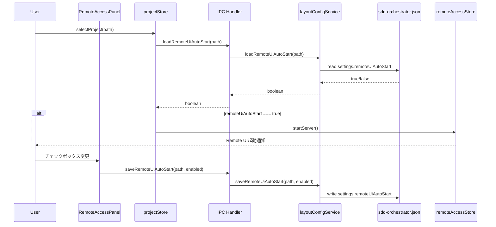
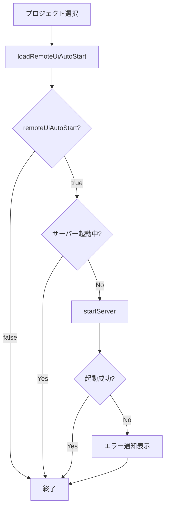

# Design: Remote UI Auto Start

## Overview

**Purpose**: プロジェクト選択時にRemote UIサーバーの自動起動オプションを提供し、プロジェクト毎の設定管理を実現する。

**Users**: SDD Orchestratorユーザーが、頻繁にRemote UIを使用するプロジェクトで毎回手動起動する手間を省くために利用する。

**Impact**: 既存の`remoteAccessStore.ts`のLocalStorage保存の`autoStartEnabled`を廃止し、プロジェクト毎の`.kiro/sdd-orchestrator.json`に`settings.remoteUiAutoStart`として保存する方式に一本化する。

### Goals

- プロジェクト毎にRemote UI自動起動設定を保存・復元する
- プロジェクト選択時に設定に基づいてRemote UIサーバーを自動起動する
- 使用されていない既存の`autoStartEnabled`コードをクリーンアップする

### Non-Goals

- Cloudflare Tunnel設定の自動起動連動（既存の`publishToCloudflare`はLocalStorageのまま維持）
- アプリ起動時の自動起動（プロジェクト選択前には起動しない）
- 複数プロジェクト間での設定同期

## Architecture

### Existing Architecture Analysis

既存システムは以下のパターンに従う:

- **プロジェクト固有設定**: `.kiro/sdd-orchestrator.json`に`settings`オブジェクトとして保存（`skipPermissions`, `jjInstallIgnored`の先例あり）
- **Main Process SSOT**: 設定の読み書きは`layoutConfigService.ts`が担当し、IPCハンドラ経由でRendererに公開
- **Renderer側キャッシュ**: Zustand storeはMain Processの状態をキャッシュし、変更はIPC経由でMainに依頼

### Architecture Pattern & Boundary Map



**Key Decisions**:

- 既存の`skipPermissions`/`jjInstallIgnored`と同じパターンを踏襲し、一貫性を維持
- プロジェクト選択フロー（`projectStore.selectProject`）内で設定を読み込み、条件に基づき自動起動
- UI変更は即座にファイルに反映（既存パターンと同様）

**Architecture Integration**:

- Selected pattern: プロジェクト固有設定パターン（既存の`settings`オブジェクト拡張）
- Domain boundaries: Main Process（設定管理）とRenderer Process（UI表示・ユーザー操作）の明確な分離
- Existing patterns preserved: `layoutConfigService`による設定管理、IPC経由の状態同期
- New components rationale: 既存コンポーネントの拡張のみで対応可能
- Steering compliance: DRY（既存パターン再利用）、SSOT（Main Process管理）、KISS（最小限の変更）

### Technology Stack

| Layer | Choice / Version | Role in Feature | Notes |
|-------|------------------|-----------------|-------|
| Frontend | React 19 + Zustand | UI状態管理 | 既存パターン踏襲 |
| Backend | Electron 35 Main Process | 設定永続化 | layoutConfigService拡張 |
| Data / Storage | `.kiro/sdd-orchestrator.json` | プロジェクト毎設定 | v3スキーマ拡張 |

## System Flows

### プロジェクト選択時の自動起動フロー



**Key Decisions**:

- 二重起動防止: サーバーが既に起動中の場合は何もしない
- 非ブロッキング: 自動起動失敗時もUIをブロックせず、通知のみ表示
- 既存フロー活用: `remoteAccessStore.startServer()`を再利用

## Requirements Traceability

| Criterion ID | Summary | Components | Implementation Approach |
|--------------|---------|------------|------------------------|
| 1.1 | settings.remoteUiAutoStartフィールド追加 | ProjectSettingsSchema, layoutConfigService | スキーマ拡張（既存パターン） |
| 1.2 | フィールド不在時のデフォルト値false | loadRemoteUiAutoStart | 既存パターン（?? false） |
| 1.3 | 設定変更時の即座更新 | saveRemoteUiAutoStart, RemoteAccessPanel | IPC経由で即座保存 |
| 2.1 | 設定trueでサーバー自動起動 | projectStore.selectProject | フロー内で条件分岐追加 |
| 2.2 | 二重起動防止 | projectStore.selectProject | isRunning状態チェック |
| 2.3 | 起動失敗時のエラー通知 | projectStore.selectProject | notify.error()呼び出し |
| 3.1 | 自動起動チェックボックス表示 | RemoteAccessPanel | 新規チェックボックス追加 |
| 3.2 | チェックボックス変更の即座反映 | RemoteAccessPanel | saveRemoteUiAutoStart呼び出し |
| 3.3 | 現在の設定状態表示 | RemoteAccessPanel | プロジェクト選択時にロード |
| 4.1 | autoStartEnabled削除 | remoteAccessStore | state/action削除 |
| 4.2 | LocalStorage永続化対象から除外 | remoteAccessStore | partialize更新 |
| 4.3 | 関連テストコード更新 | remoteAccessStore.test.ts | 削除されたコードのテスト削除 |

### Coverage Validation Checklist

- [x] Every criterion ID from requirements.md appears in the table above
- [x] Each criterion has specific component names (not generic references)
- [x] Implementation approach distinguishes "reuse existing" vs "new implementation"
- [x] User-facing criteria specify concrete UI components

## Components and Interfaces

| Component | Domain/Layer | Intent | Req Coverage | Key Dependencies | Contracts |
|-----------|--------------|--------|--------------|------------------|-----------|
| ProjectSettingsSchema | Data | 設定スキーマ定義 | 1.1 | zod | - |
| layoutConfigService | Main/Service | 設定読み書き | 1.1, 1.2, 1.3 | fs/promises | Service |
| configHandlers | Main/IPC | IPC公開 | 1.3 | ipcMain | API |
| projectStore | Renderer/Store | プロジェクト選択・自動起動 | 2.1, 2.2, 2.3 | remoteAccessStore | State |
| RemoteAccessPanel | Renderer/UI | チェックボックス表示 | 3.1, 3.2, 3.3 | projectStore | - |
| remoteAccessStore | Renderer/Store | 既存コード削除 | 4.1, 4.2 | - | State |

### Data Layer

#### ProjectSettingsSchema拡張

| Field | Detail |
|-------|--------|
| Intent | remoteUiAutoStartフィールドをProjectSettingsSchemaに追加 |
| Requirements | 1.1 |

**Responsibilities & Constraints**

- `remoteUiAutoStart: z.boolean().optional()`として追加
- 既存の`skipPermissions`, `jjInstallIgnored`と同レベルに配置

##### Service Interface

```typescript
// layoutConfigService.ts に追加
export const ProjectSettingsSchema = z.object({
  skipPermissions: z.boolean().optional(),
  jjInstallIgnored: z.boolean().optional(),
  remoteUiAutoStart: z.boolean().optional(), // 新規追加
});
```

- Preconditions: なし
- Postconditions: スキーマ検証が新フィールドを認識
- Invariants: 既存フィールドとの互換性維持

### Main/Service Layer

#### layoutConfigService.loadRemoteUiAutoStart / saveRemoteUiAutoStart

| Field | Detail |
|-------|--------|
| Intent | remoteUiAutoStart設定の読み書き |
| Requirements | 1.1, 1.2, 1.3 |

**Responsibilities & Constraints**

- 既存の`loadSkipPermissions`/`saveSkipPermissions`と同じパターン
- フィールド不在時は`false`を返す

**Dependencies**

- Inbound: configHandlers (IPC) (P0)
- Internal: loadProjectConfigV3, saveProjectConfigV3 (P0)

**Contracts**: Service [x]

##### Service Interface

```typescript
interface LayoutConfigService {
  loadRemoteUiAutoStart(projectPath: string): Promise<boolean>;
  saveRemoteUiAutoStart(projectPath: string, enabled: boolean): Promise<void>;
}
```

- Preconditions: projectPathが有効なパス
- Postconditions: load時はboolean返却、save時はファイル更新
- Invariants: 他のsettingsフィールドは保持

### Main/IPC Layer

#### configHandlers拡張

| Field | Detail |
|-------|--------|
| Intent | remoteUiAutoStart設定のIPC公開 |
| Requirements | 1.3 |

**Summary**: 既存の`LOAD_SKIP_PERMISSIONS`/`SAVE_SKIP_PERMISSIONS`と同じパターンで`LOAD_REMOTE_UI_AUTO_START`/`SAVE_REMOTE_UI_AUTO_START`を追加。

### Renderer/Store Layer

#### projectStore.selectProject拡張

| Field | Detail |
|-------|--------|
| Intent | プロジェクト選択時の自動起動トリガー |
| Requirements | 2.1, 2.2, 2.3 |

**Responsibilities & Constraints**

- 既存の`selectProject`フロー末尾に自動起動ロジックを追加
- サーバー起動中チェックは`remoteAccessStore.getState().isRunning`を使用
- 失敗時は`notify.error()`で通知（UIをブロックしない）

**Dependencies**

- Inbound: UI components, RecentProjectList (P0)
- Outbound: remoteAccessStore.startServer (P0), electronAPI.loadRemoteUiAutoStart (P0)

**Contracts**: State [x]

##### State Management

```typescript
interface ProjectStoreExtension {
  // 新規state不要（設定はMain Process管理）
  // selectProject内で一時的に読み込むのみ
}
```

**Implementation Notes**

- Integration: `selectProject`フロー末尾、jjCheck処理後に追加
- Validation: サーバー起動中チェック
- Risks: 自動起動失敗時のユーザー体験（通知で対応）

### Renderer/UI Layer

#### RemoteAccessPanel拡張

| Field | Detail |
|-------|--------|
| Intent | 自動起動チェックボックス追加 |
| Requirements | 3.1, 3.2, 3.3 |

**Summary**: 既存の「Enable remote access」チェックボックスの下に「プロジェクト起動時に自動起動」チェックボックスを追加。変更時は`electronAPI.saveRemoteUiAutoStart`を呼び出し。

**Implementation Notes**

- プロジェクト未選択時はチェックボックスを無効化
- 現在の設定値は`electronAPI.loadRemoteUiAutoStart`で取得
- コンポーネントマウント時にロード（useEffect）

### Cleanup Layer

#### remoteAccessStore既存コード削除

| Field | Detail |
|-------|--------|
| Intent | 使用されていないautoStartEnabled関連コード削除 |
| Requirements | 4.1, 4.2, 4.3 |

**Summary**: `RemoteAccessState.autoStartEnabled`, `setAutoStartEnabled`, LocalStorage `partialize`から`autoStartEnabled`を削除。`reset`メソッドの`autoStartEnabled`保持ロジックも削除。

## Data Models

### Domain Model

#### ProjectSettings拡張

```typescript
interface ProjectSettings {
  skipPermissions?: boolean;
  jjInstallIgnored?: boolean;
  remoteUiAutoStart?: boolean; // 新規追加
}
```

**Business Rules**:

- `remoteUiAutoStart`が`true`の場合のみ自動起動
- 未定義または`false`の場合は自動起動しない

### Logical Data Model

**sdd-orchestrator.json構造**:

```json
{
  "version": 3,
  "profile": { ... },
  "layout": { ... },
  "commandsets": { ... },
  "settings": {
    "skipPermissions": false,
    "jjInstallIgnored": false,
    "remoteUiAutoStart": true  // 新規追加
  },
  "defaults": { ... }
}
```

## Error Handling

### Error Strategy

| Error Type | Handling | User Feedback |
|------------|----------|---------------|
| 設定ファイル読み込み失敗 | デフォルト値(false)使用 | ログ出力のみ |
| 設定ファイル書き込み失敗 | エラーログ | コンソール警告 |
| Remote UIサーバー起動失敗 | 通知表示 | notify.error()でトースト表示 |

**Process Flow**: 自動起動失敗は非ブロッキング。ユーザーは手動でサーバーを起動可能。

## Testing Strategy

### Unit Tests

- `layoutConfigService.loadRemoteUiAutoStart`: 設定読み込み（存在/不在/不正形式）
- `layoutConfigService.saveRemoteUiAutoStart`: 設定保存（新規作成/更新）
- `remoteAccessStore`: `autoStartEnabled`削除後の状態管理

### Integration Tests

- プロジェクト選択→自動起動フロー: 設定true時のサーバー起動確認
- 設定変更→ファイル反映: UI操作からファイル書き込みまでの一貫性
- 二重起動防止: サーバー起動中のプロジェクト選択時の挙動

### E2E/UI Tests

- RemoteAccessPanel: チェックボックス表示・操作・状態反映
- プロジェクト選択シナリオ: 設定on/offでの起動挙動差異

## Integration Test Strategy

**Components**: projectStore, remoteAccessStore, layoutConfigService, IPC handlers

**Data Flow**: UI操作 → IPC → layoutConfigService → File → IPC → Store → 自動起動

**Mock Boundaries**:
- Mock: ファイルシステム（fs/promises）
- Real: IPC通信、Store状態管理

**Verification Points**:
- 設定保存後のファイル内容確認
- プロジェクト選択後のサーバー起動状態確認
- エラー時の通知表示確認

**Robustness Strategy**:
- `waitFor`パターンでサーバー起動完了を待機
- ファイル書き込み完了を`await`で保証

**Prerequisites**: 既存のテストインフラで対応可能

## Design Decisions

### DD-001: 設定保存先の選択

| Field | Detail |
|-------|--------|
| Status | Accepted |
| Context | Remote UI自動起動設定の保存先を決定する必要がある |
| Decision | `.kiro/sdd-orchestrator.json`の`settings.remoteUiAutoStart`に保存 |
| Rationale | プロジェクト毎に異なる設定を持たせたい。LocalStorageはアプリ全体で共有されるため不適切 |
| Alternatives Considered | (1) LocalStorage: アプリ全体で共有、プロジェクト毎の設定不可 (2) 別ファイル: 管理が複雑化 |
| Consequences | 既存の`autoStartEnabled`（LocalStorage）を廃止する必要あり。既存パターンとの一貫性は向上 |

### DD-002: 既存autoStartEnabledの扱い

| Field | Detail |
|-------|--------|
| Status | Accepted |
| Context | 既存のLocalStorage保存の`autoStartEnabled`との共存・移行を検討 |
| Decision | 既存は削除し、新しいプロジェクト毎設定に一本化 |
| Rationale | グローバル設定は不要。プロジェクト毎の設定のみで十分。移行パスは不要（既存機能は実質未使用） |
| Alternatives Considered | (1) 共存: 2つの設定が混在し混乱を招く (2) 移行: 実装コスト増加、既存設定の実使用率が低い |
| Consequences | remoteAccessStore.tsからautoStartEnabled関連コードを削除。関連テストも更新 |

### DD-003: 自動起動のトリガーポイント

| Field | Detail |
|-------|--------|
| Status | Accepted |
| Context | 自動起動をどのタイミングで実行するか |
| Decision | `projectStore.selectProject`フローの末尾で実行 |
| Rationale | プロジェクト選択が完了し、他の初期化処理が終わった後に実行することで、状態の整合性を保つ |
| Alternatives Considered | (1) App.tsx初期化時: プロジェクト未選択時には実行できない (2) 別のuseEffect: 状態管理が複雑化 |
| Consequences | projectStore.tsへの変更が必要。既存フローへの影響は最小限 |

## 結合・廃止戦略

### 既存ファイルの変更（Wiring Points）

| File | Change Type | Description |
|------|-------------|-------------|
| `src/main/services/layoutConfigService.ts` | 拡張 | ProjectSettingsSchema拡張、load/saveメソッド追加 |
| `src/main/ipc/configHandlers.ts` | 拡張 | LOAD/SAVE_REMOTE_UI_AUTO_START ハンドラ追加 |
| `src/main/ipc/channels.ts` | 拡張 | 新規IPCチャンネル定義追加 |
| `src/preload/index.ts` | 拡張 | electronAPI公開メソッド追加 |
| `src/renderer/types/electron.d.ts` | 拡張 | 型定義追加 |
| `src/renderer/stores/projectStore.ts` | 拡張 | selectProject内に自動起動ロジック追加 |
| `src/renderer/components/RemoteAccessPanel.tsx` | 拡張 | 自動起動チェックボックス追加 |
| `src/renderer/stores/remoteAccessStore.ts` | 削除 | autoStartEnabled関連コード削除 |
| `src/renderer/stores/remoteAccessStore.test.ts` | 更新 | autoStartEnabled関連テスト削除 |

### 削除対象ファイル

なし（ファイル単位での削除はなし）

## インターフェース変更と影響分析

### 新規IPCチャンネル

| Channel | Direction | Parameters | Return |
|---------|-----------|------------|--------|
| `LOAD_REMOTE_UI_AUTO_START` | Renderer → Main | `projectPath: string` | `boolean` |
| `SAVE_REMOTE_UI_AUTO_START` | Renderer → Main | `projectPath: string, enabled: boolean` | `void` |

### 削除されるインターフェース

| Interface | Location | Callers |
|-----------|----------|---------|
| `autoStartEnabled` state | remoteAccessStore.ts | なし（未使用） |
| `setAutoStartEnabled` action | remoteAccessStore.ts | なし（未使用） |

**Caller Update Tasks**: なし（削除対象は未使用）
