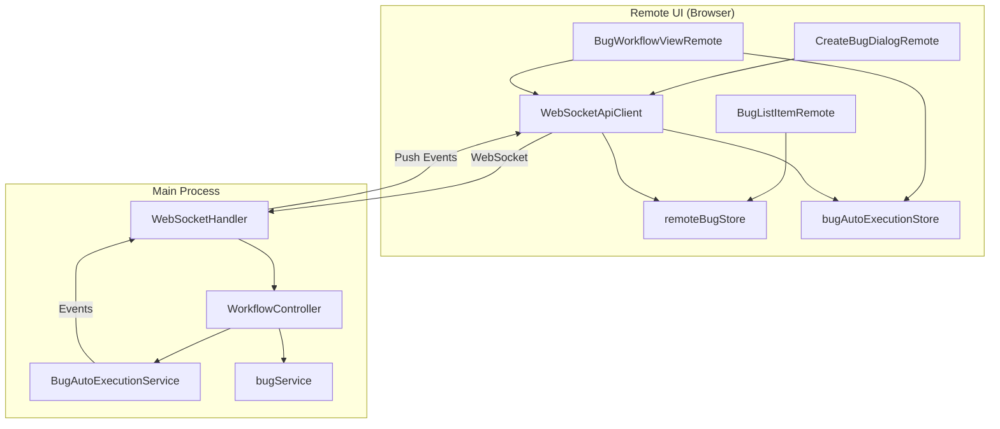
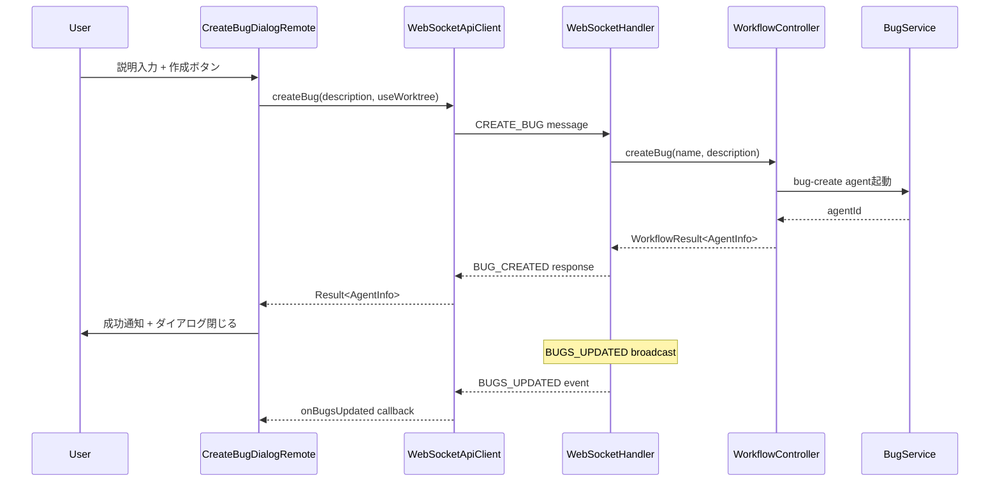
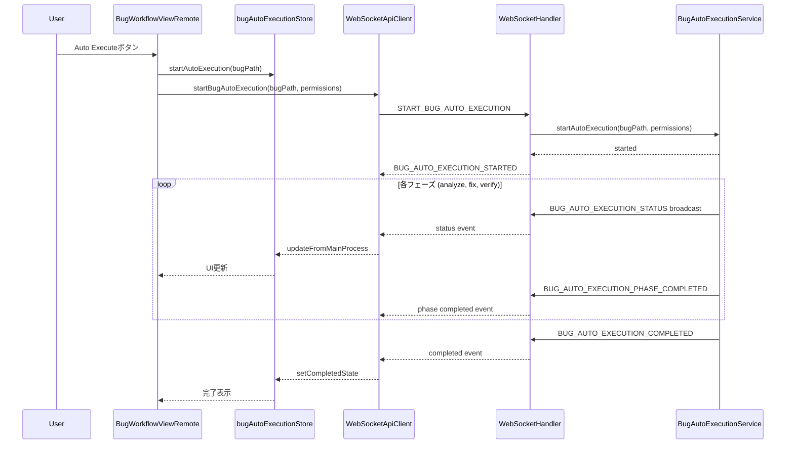
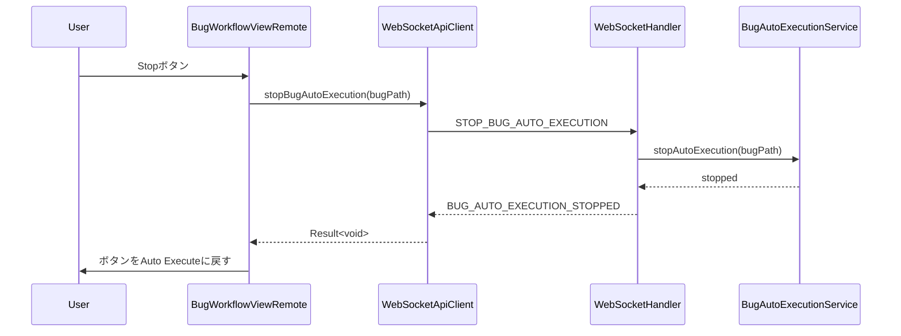
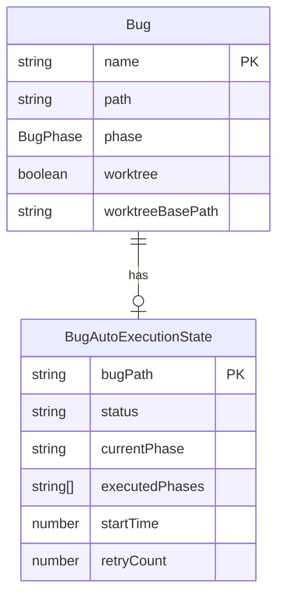

# Design: Remote UI Bug Advanced Features

## Overview

**Purpose**: Remote UI（ブラウザ/スマートフォン版）において、Electron版で実装済みのBug管理高度機能（Bug作成、Bug自動実行、Worktree対応）を追加し、リモートからでもBug修正ワークフローの全機能を利用可能にする。

**Users**: モバイルデバイスやリモート環境からSDD Orchestratorを利用するユーザーが、Bug作成からverifyまでの一連のワークフローを実行できる。

**Impact**: 既存のWebSocket通信層、shared stores、Remote UIコンポーネントを拡張し、Electron版と同等のBugワークフロー機能を提供する。

### Goals

- Remote UIからBug作成ダイアログ経由で新規Bugを作成可能にする
- Bug自動実行（analyze→fix→verify）をRemote UIから開始・停止・監視可能にする
- Worktree設定をBug作成時およびフェーズ実行時に指定可能にする
- Desktop版（ブラウザ）とSmartphone版で一貫したUXを提供する

### Non-Goals

- Spec自動実行機能の拡張（既存実装で対応済み）
- ドキュメントレビュー機能（別Specで対応）
- ArtifactEditor機能（別Specで対応）
- SSHリモートプロジェクト対応（Remote UIの範囲外）

## Architecture

### Existing Architecture Analysis

既存のRemote UIアーキテクチャは以下の構造を持つ：

- **WebSocketApiClient**: Remote UI向けAPI抽象化層
- **WebSocketHandler**: バックエンドのWebSocketメッセージルーター
- **WorkflowController**: ワークフロー操作の実装インターフェース
- **shared/stores**: Electron/Remote UI共有の状態管理ストア
- **shared/components**: 共有UIコンポーネント

本機能は既存パターンを踏襲し、以下を拡張する：
- WebSocketHandler: Bug自動実行メッセージハンドラ追加
- WorkflowController: Bug自動実行メソッド追加
- WebSocketApiClient: Bug作成・自動実行メソッド追加
- shared/stores: remoteBugStore拡張
- shared/components/bug: Remote UI向けBug UIコンポーネント追加

### Architecture Pattern & Boundary Map



**Architecture Integration**:
- Selected pattern: 既存のWebSocket + Provider Pattern + Dependency Injectionを維持
- Domain/feature boundaries: Bug管理はbugService/bugStore、自動実行はbugAutoExecutionStore/Serviceで分離
- Existing patterns preserved: WebSocketMessage/Response形式、Result型によるエラーハンドリング
- New components rationale: Remote UI専用のCreateBugDialogRemoteは画面サイズ対応のため新規作成
- Steering compliance: DRY（shared components活用）、SSOT（storeの一元管理）

### Technology Stack

| Layer | Choice / Version | Role in Feature | Notes |
|-------|------------------|-----------------|-------|
| Frontend | React 19 + TypeScript 5.8+ | Remote UI Bug管理コンポーネント | 既存shared/componentsを活用 |
| State Management | Zustand | remoteBugStore, bugAutoExecutionStore拡張 | shared/storesに配置 |
| Communication | WebSocket (ws) | Bug作成・自動実行のリアルタイム通信 | 既存WebSocketHandler拡張 |
| Backend | Node.js + Electron Main | WebSocketHandler, WorkflowController | 既存パターン踏襲 |

## System Flows

### Bug作成フロー



### Bug自動実行フロー



### 自動実行停止フロー



## Requirements Traceability

| Criterion ID | Summary | Components | Implementation Approach |
|--------------|---------|------------|------------------------|
| 1.1 | Bugsタブに新規バグボタン表示 | BugsTab, BugListHeader, CreateBugButtonRemote | Desktop: 既存位置、SP: FAB新規実装 |
| 1.2 | Bug作成ダイアログ表示 | CreateBugDialogRemote | SP: フルスクリーンモーダル新規実装 |
| 1.3 | WebSocket経由でBug作成 | WebSocketApiClient.createBug | 既存handleCreateBugと連携 |
| 1.4 | 作成完了後UI更新 | remoteBugStore, CreateBugDialogRemote | onBugsUpdatedイベント購読 |
| 2.1 | Bug詳細にAuto Executeボタン | BugWorkflowViewRemote, BugWorkflowFooterRemote | 既存パターン踏襲、位置調整 |
| 2.2 | フェーズパーミッショントグル | BugAutoExecutionPermissionsRemote | 共有コンポーネント流用 |
| 2.3 | 自動実行開始 | WebSocketApiClient.startBugAutoExecution | 新規実装 |
| 2.4 | 自動実行状態リアルタイム表示 | bugAutoExecutionStore, BugWorkflowViewRemote | WebSocketイベント購読で更新 |
| 2.5 | 自動実行停止 | WebSocketApiClient.stopBugAutoExecution | 新規実装 |
| 2.6 | 完了/エラー通知 | BugWorkflowViewRemote, notify | 既存通知システム活用 |
| 3.1 | Bug作成ダイアログにWorktreeチェック | CreateBugDialogRemote | Desktop版と同じUI |
| 3.2 | Bug詳細にWorktreeチェック | BugWorkflowViewRemote | Desktop: 既存位置、SP: フェーズリスト上部 |
| 3.3 | Worktreeバッジ表示 | BugListItemRemote | 既存BugListItem拡張（shared） |
| 3.4 | Worktree設定をフェーズ実行に反映 | WebSocketApiClient.executeBugPhase | useWorktreeフラグ追加 |
| 4.1 | START_BUG_AUTO_EXECUTION handler | WebSocketHandler | 新規handleStartBugAutoExecution |
| 4.2 | STOP_BUG_AUTO_EXECUTION handler | WebSocketHandler | 新規handleStopBugAutoExecution |
| 4.3 | WorkflowController拡張 | WorkflowController interface | startBugAutoExecution, stopBugAutoExecution追加 |
| 5.1 | WebSocketApiClient.createBug | WebSocketApiClient | 新規メソッド追加 |
| 5.2 | WebSocketApiClient Bug自動実行 | WebSocketApiClient | startBugAutoExecution, stopBugAutoExecution |
| 5.3 | remoteBugStore.createBug | remoteBugStore | 新規アクション追加 |
| 5.4 | remoteBugAutoExecutionStore | bugAutoExecutionStore | 既存ストア活用（WebSocket対応済み） |

### Coverage Validation Checklist

- [x] Every criterion ID from requirements.md appears in the table above
- [x] Each criterion has specific component names (not generic references)
- [x] Implementation approach distinguishes "reuse existing" vs "new implementation"
- [x] User-facing criteria specify concrete UI components

## Components and Interfaces

| Component | Domain/Layer | Intent | Req Coverage | Key Dependencies | Contracts |
|-----------|--------------|--------|--------------|-----------------|-----------|
| WebSocketHandler | Backend/IPC | Bug自動実行メッセージルーティング | 4.1, 4.2 | WorkflowController (P0) | Service |
| WorkflowController | Backend/Service | Bug自動実行操作インターフェース | 4.3 | BugAutoExecutionService (P0) | Service |
| WebSocketApiClient | Shared/API | Remote UI向けAPI抽象化 | 5.1, 5.2 | WebSocket (P0) | Service, Event |
| remoteBugStore | Shared/Store | Remote UI向けBug状態管理 | 5.3 | WebSocketApiClient (P0) | State |
| bugAutoExecutionStore | Shared/Store | Bug自動実行状態管理 | 5.4, 2.4 | ApiClient (P0) | State |
| CreateBugDialogRemote | Remote-UI/Component | Bug作成ダイアログ | 1.1, 1.2, 1.3, 1.4, 3.1 | WebSocketApiClient (P0) | - |
| BugWorkflowViewRemote | Remote-UI/Component | Bugワークフロー表示 | 2.1, 2.2, 2.3, 2.4, 2.5, 2.6, 3.2 | bugAutoExecutionStore (P0) | - |
| BugListItemRemote | Shared/Component | Bug一覧アイテム | 3.3 | remoteBugStore (P1) | - |
| CreateBugButtonRemote | Remote-UI/Component | 新規バグ作成ボタン（FAB対応） | 1.1 | CreateBugDialogRemote (P0) | - |

### Backend/IPC

#### WebSocketHandler Extensions

| Field | Detail |
|-------|--------|
| Intent | Bug自動実行のWebSocketメッセージハンドリング |
| Requirements | 4.1, 4.2 |

**Responsibilities & Constraints**
- START_BUG_AUTO_EXECUTION, STOP_BUG_AUTO_EXECUTIONメッセージの処理
- Bug自動実行イベントのブロードキャスト
- 既存メッセージハンドラパターンに準拠

**Dependencies**
- Inbound: WebSocket clients — Bug自動実行リクエスト (P0)
- Outbound: WorkflowController — 実際の実行委譲 (P0)

**Contracts**: Service [x]

##### Service Interface (追加メソッド)

```typescript
// 既存のWebSocketHandler classに追加
private async handleStartBugAutoExecution(
  client: ClientInfo,
  message: WebSocketMessage
): Promise<void>;

private async handleStopBugAutoExecution(
  client: ClientInfo,
  message: WebSocketMessage
): Promise<void>;
```

**Message Types**:

```typescript
// START_BUG_AUTO_EXECUTION Request
interface StartBugAutoExecutionRequest {
  type: 'START_BUG_AUTO_EXECUTION';
  payload: {
    bugPath: string;
    permissions: {
      analyze: boolean;
      fix: boolean;
      verify: boolean;
    };
  };
  requestId?: string;
  timestamp: number;
}

// START_BUG_AUTO_EXECUTION Response
interface BugAutoExecutionStartedResponse {
  type: 'BUG_AUTO_EXECUTION_STARTED';
  payload: {
    bugPath: string;
    state: BugAutoExecutionStateWS;
  };
  requestId?: string;
  timestamp: number;
}

// STOP_BUG_AUTO_EXECUTION Request
interface StopBugAutoExecutionRequest {
  type: 'STOP_BUG_AUTO_EXECUTION';
  payload: {
    bugPath: string;
  };
  requestId?: string;
  timestamp: number;
}

// STOP_BUG_AUTO_EXECUTION Response
interface BugAutoExecutionStoppedResponse {
  type: 'BUG_AUTO_EXECUTION_STOPPED';
  payload: {
    bugPath: string;
  };
  requestId?: string;
  timestamp: number;
}
```

**Implementation Notes**
- Integration: 既存のcase文にメッセージタイプを追加
- Validation: bugPath必須、permissions各フィールドboolean検証
- Risks: WorkflowControllerにメソッドがない場合のNOT_SUPPORTEDエラー対応

#### WorkflowController Interface Extensions

| Field | Detail |
|-------|--------|
| Intent | Bug自動実行操作の抽象化インターフェース |
| Requirements | 4.3 |

**Contracts**: Service [x]

##### Service Interface (追加メソッド)

```typescript
// WorkflowController interfaceに追加
export interface WorkflowController {
  // ... existing methods ...

  /** Start bug auto execution */
  startBugAutoExecution?(
    bugPath: string,
    permissions: BugAutoPermissions
  ): Promise<WorkflowResult<BugAutoExecutionStateWS>>;

  /** Stop bug auto execution */
  stopBugAutoExecution?(
    bugPath: string
  ): Promise<WorkflowResult<void>>;
}

/** Bug auto execution permissions */
export interface BugAutoPermissions {
  readonly analyze: boolean;
  readonly fix: boolean;
  readonly verify: boolean;
}
```

### Shared/API

#### WebSocketApiClient Extensions

| Field | Detail |
|-------|--------|
| Intent | Remote UI向けBug作成・自動実行API |
| Requirements | 5.1, 5.2 |

**Dependencies**
- Outbound: WebSocket connection — メッセージ送受信 (P0)

**Contracts**: Service [x] / Event [x]

##### Service Interface (追加メソッド)

```typescript
// WebSocketApiClient classに追加
export class WebSocketApiClient implements ApiClient {
  // ... existing methods ...

  /**
   * Create a new bug
   * Requirements: 5.1
   */
  async createBug(
    description: string,
    useWorktree: boolean
  ): Promise<Result<AgentInfo, ApiError>>;

  /**
   * Start bug auto execution
   * Requirements: 5.2
   */
  async startBugAutoExecution(
    bugPath: string,
    permissions: BugAutoPermissions
  ): Promise<Result<BugAutoExecutionState, ApiError>>;

  /**
   * Stop bug auto execution
   * Requirements: 5.2
   */
  async stopBugAutoExecution(
    bugPath: string
  ): Promise<Result<void, ApiError>>;
}
```

##### Event Contract

- Published events: None (クライアント側)
- Subscribed events:
  - `BUG_AUTO_EXECUTION_STARTED`: 自動実行開始通知
  - `BUG_AUTO_EXECUTION_STATUS`: 状態変更通知
  - `BUG_AUTO_EXECUTION_PHASE_COMPLETED`: フェーズ完了通知
  - `BUG_AUTO_EXECUTION_COMPLETED`: 全フェーズ完了通知
  - `BUG_AUTO_EXECUTION_ERROR`: エラー通知
  - `BUG_AUTO_EXECUTION_STOPPED`: 停止完了通知

```typescript
// handlePushMessage内に追加
private handlePushMessage(message: WebSocketResponse): void {
  switch (message.type) {
    // ... existing cases ...
    case 'BUG_AUTO_EXECUTION_STARTED':
      this.emit('bugAutoExecutionStarted', message.payload);
      break;
    case 'BUG_AUTO_EXECUTION_STOPPED':
      this.emit('bugAutoExecutionStopped', message.payload);
      break;
  }
}
```

**Implementation Notes**
- Integration: 既存wrapRequestパターンを使用
- Validation: 型安全性確保のためResult型で返却

### Shared/Store

#### remoteBugStore Extensions

| Field | Detail |
|-------|--------|
| Intent | Remote UI向けBug状態管理の拡張 |
| Requirements | 5.3 |

**Contracts**: State [x]

##### State Management

```typescript
// remoteBugStoreに追加するアクション
export interface SharedBugActions {
  // ... existing actions ...

  /**
   * Create a new bug via ApiClient
   * Requirements: 5.3
   */
  createBug: (
    apiClient: ApiClient,
    description: string,
    useWorktree: boolean
  ) => Promise<Result<AgentInfo, ApiError>>;

  /**
   * Worktree使用フラグ (Bug作成時用)
   */
  useWorktree: boolean;

  /**
   * Worktreeフラグ設定
   */
  setUseWorktree: (useWorktree: boolean) => void;
}
```

**Implementation Notes**
- createBugはApiClient経由でCREATE_BUGメッセージを送信
- useWorktreeはBug作成ダイアログのデフォルト値として使用
- 既存のupdateBugsはBUGS_UPDATEDイベントで自動更新

#### bugAutoExecutionStore (既存活用)

| Field | Detail |
|-------|--------|
| Intent | Bug自動実行状態管理（Electron/Remote UI共有） |
| Requirements | 5.4, 2.4 |

既存のbugAutoExecutionStoreはWebSocket対応済み（fetchBugAutoExecutionStateWithClient）。
追加でWebSocketイベントリスナー登録が必要。

```typescript
// Remote UI初期化時にWebSocketイベントリスナーを登録
export function initBugAutoExecutionWebSocketListeners(
  apiClient: WebSocketApiClient
): () => void {
  const unsubscribers: (() => void)[] = [];

  // BUG_AUTO_EXECUTION_STATUS
  unsubscribers.push(
    apiClient.on('bugAutoExecutionStatus', (data) => {
      const { bugPath, state } = data as BugAutoExecutionStatusEvent;
      useBugAutoExecutionStore.getState().updateFromMainProcess(bugPath, state);
    })
  );

  // BUG_AUTO_EXECUTION_COMPLETED
  unsubscribers.push(
    apiClient.on('bugAutoExecutionCompleted', (data) => {
      const { bugPath } = data as { bugPath: string };
      useBugAutoExecutionStore.getState().setCompletedState(bugPath);
    })
  );

  // BUG_AUTO_EXECUTION_ERROR
  unsubscribers.push(
    apiClient.on('bugAutoExecutionError', (data) => {
      const { bugPath, error } = data as BugAutoExecutionErrorEvent;
      useBugAutoExecutionStore.getState().setErrorState(
        bugPath,
        error.phase ?? null,
        0
      );
    })
  );

  return () => unsubscribers.forEach((unsub) => unsub());
}
```

### Remote-UI/Component

#### CreateBugDialogRemote

| Field | Detail |
|-------|--------|
| Intent | Remote UI向けBug作成ダイアログ（レスポンシブ対応） |
| Requirements | 1.1, 1.2, 1.3, 1.4, 3.1 |

**Dependencies**
- Inbound: CreateBugButtonRemote — ダイアログ表示トリガー (P0)
- Outbound: WebSocketApiClient — Bug作成リクエスト (P0)
- Outbound: remoteBugStore — Worktree設定取得 (P1)

**Contracts**: -

##### Props Interface

```typescript
interface CreateBugDialogRemoteProps {
  /** ダイアログ表示状態 */
  isOpen: boolean;
  /** ダイアログ閉じるコールバック */
  onClose: () => void;
  /** ApiClientインスタンス */
  apiClient: ApiClient;
}
```

**Implementation Notes**
- Desktop版: 既存CreateBugDialogと同様のモーダルUI
- Smartphone版: フルスクリーンモーダル（MobileLayout対応）
- Worktreeチェックボックス: remoteBugStore.useWorktreeと同期
- 作成中ローディング状態表示
- エラー時はダイアログ内にエラーメッセージ表示

#### BugWorkflowViewRemote

| Field | Detail |
|-------|--------|
| Intent | Remote UI向けBugワークフロー表示（自動実行対応） |
| Requirements | 2.1, 2.2, 2.3, 2.4, 2.5, 2.6, 3.2 |

**Dependencies**
- Inbound: BugPane — 選択されたBugの詳細表示 (P0)
- Outbound: bugAutoExecutionStore — 自動実行状態取得・更新 (P0)
- Outbound: WebSocketApiClient — 自動実行開始・停止 (P0)

**Contracts**: -

##### Props Interface

```typescript
interface BugWorkflowViewRemoteProps {
  /** 選択中のBug */
  selectedBug: BugMetadata | null;
  /** Bug詳細 */
  bugDetail: BugDetail | null;
  /** ApiClientインスタンス */
  apiClient: ApiClient;
}
```

**Implementation Notes**
- Desktop版: 既存BugWorkflowViewと同様のレイアウト
- Smartphone版: フェーズリスト上部にWorktreeチェック配置
- Auto Executeボタン: Desktop版はヘッダー、SP版は固定ヘッダー
- 自動実行中はハイライト表示（currentAutoPhase）
- 停止ボタン表示切替: isAutoExecuting状態で制御

#### CreateBugButtonRemote

| Field | Detail |
|-------|--------|
| Intent | 新規バグ作成ボタン（Desktop/SP対応） |
| Requirements | 1.1 |

**Contracts**: -

##### Props Interface

```typescript
interface CreateBugButtonRemoteProps {
  /** ボタンクリックコールバック（ダイアログ表示） */
  onClick: () => void;
  /** デバイスタイプ */
  deviceType: 'desktop' | 'mobile';
}
```

**Implementation Notes**
- Desktop版: タブヘッダー右側に配置（既存Electron版と同じ）
- Smartphone版: フローティングアクションボタン（FAB）として画面右下に固定
- Lucide Reactのアイコン使用（Plus）

#### BugListItemRemote (shared/components/bug/BugListItem拡張)

| Field | Detail |
|-------|--------|
| Intent | Bug一覧アイテム表示（Worktreeバッジ対応） |
| Requirements | 3.3 |

既存のshared/components/bug/BugListItemはWorktreeバッジ対応済み（worktree || worktreeBasePathで表示）。
追加実装不要、既存コンポーネントを活用。

## Data Models

### Domain Model



### WebSocket Message Types

```typescript
// Bug自動実行パーミッション
interface BugAutoPermissions {
  readonly analyze: boolean;
  readonly fix: boolean;
  readonly verify: boolean;
}

// Bug自動実行状態（WebSocket用）
interface BugAutoExecutionStateWS {
  readonly bugPath: string;
  readonly bugName: string;
  readonly status: 'idle' | 'running' | 'paused' | 'completed' | 'error';
  readonly currentPhase: string | null;
  readonly executedPhases: string[];
  readonly errors: string[];
  readonly startTime: number;
  readonly lastActivityTime: number;
  readonly retryCount: number;
  readonly lastFailedPhase: string | null;
}

// Bug自動実行エラー（WebSocket用）
interface BugAutoExecutionErrorWS {
  readonly type: string;
  readonly message?: string;
  readonly phase?: string;
}
```

## Error Handling

### Error Strategy

Bug作成・自動実行のエラーは以下のカテゴリで処理：

| カテゴリ | エラータイプ | 対応 |
|---------|-------------|------|
| Validation | INVALID_PAYLOAD | ダイアログ内にフィールドエラー表示 |
| Not Supported | NOT_SUPPORTED | メソッド未実装エラー通知 |
| Execution | AGENT_START_FAILED | エラー通知 + リトライ案内 |
| Connection | CONNECTION_ERROR | 再接続処理 + 一時停止 |
| Already Running | ALREADY_EXECUTING | 警告通知（既に実行中） |

### Error Categories and Responses

**User Errors (4xx equivalent)**:
- 説明未入力 → フィールドバリデーションエラー
- 不正なbugPath → NOT_FOUNDエラー

**System Errors (5xx equivalent)**:
- WebSocket切断 → 自動再接続 + 状態同期
- Agent起動失敗 → エラー通知 + 状態リセット

**Business Logic Errors (422 equivalent)**:
- 既に自動実行中 → ALREADY_EXECUTING警告

### Monitoring

- エラー発生時はconsole.errorでログ出力
- notifyシステムでユーザーへのトースト通知
- bugAutoExecutionStoreにエラー状態保持（lastFailedPhase, retryCount）

## Testing Strategy

### Unit Tests

- WebSocketHandler.handleStartBugAutoExecution: リクエスト検証、WorkflowController呼び出し
- WebSocketHandler.handleStopBugAutoExecution: 停止処理、レスポンス検証
- WebSocketApiClient.createBug: メッセージ送信、レスポンス処理
- WebSocketApiClient.startBugAutoExecution: メッセージ送信、状態マッピング
- remoteBugStore.createBug: ApiClient経由の呼び出し検証

### Integration Tests

- Bug作成フロー: ダイアログ入力→WebSocket送信→レスポンス受信→UI更新
- Bug自動実行開始: ボタンクリック→状態更新→イベント受信→UI反映
- Bug自動実行停止: 停止ボタン→状態リセット→UI更新
- Worktree設定: チェック状態→フェーズ実行リクエストへの反映

### E2E Tests

- Remote UI Bug作成: ブラウザからBug作成→一覧に反映
- Remote UI Bug自動実行: 自動実行開始→フェーズ進行→完了表示
- Smartphone版レイアウト: FABボタン表示→フルスクリーンダイアログ

## Design Decisions

### DD-001: 既存bugAutoExecutionStoreの活用

| Field | Detail |
|-------|--------|
| Status | Accepted |
| Context | Remote UIでBug自動実行状態を管理する必要がある |
| Decision | 既存のshared/stores/bugAutoExecutionStoreをそのまま活用し、WebSocketイベントリスナーを追加 |
| Rationale | DRY原則に従い、Electron版とRemote UIで同一ストアを使用することでコード重複を防ぐ。既にfetchBugAutoExecutionStateWithClientがApiClient対応済み |
| Alternatives Considered | 1. Remote UI専用ストア新規作成 - コード重複、保守性低下 |
| Consequences | WebSocketイベントリスナー登録の初期化処理追加が必要 |

### DD-002: Smartphone版FABボタンの採用

| Field | Detail |
|-------|--------|
| Status | Accepted |
| Context | Smartphone版でBug作成ボタンをどこに配置するか |
| Decision | フローティングアクションボタン（FAB）として画面右下に固定配置 |
| Rationale | タブヘッダー内はスペース制約があり、FABはモバイルUIの標準パターンでユーザーに馴染みやすい |
| Alternatives Considered | 1. タブヘッダー内に小さいボタン - タップしづらい 2. メニュー内に配置 - 発見性が低い |
| Consequences | FABコンポーネントの新規実装、z-index管理が必要 |

### DD-003: Bug作成時のBug名自動生成維持

| Field | Detail |
|-------|--------|
| Status | Accepted |
| Context | Bug名をユーザー入力にするか、Claude自動生成にするか（要件Decision Logより） |
| Decision | Electron版と同様、説明のみ入力しBug名はClaude（bug-createエージェント）が自動生成 |
| Rationale | 既存Electron版との一貫性維持、ユーザー入力の手間削減 |
| Alternatives Considered | 1. Bug名手入力 - 命名規則の不統一リスク |
| Consequences | バックエンドのcreateBugメソッドは既存実装をそのまま利用可能 |

### DD-004: Worktree設定のSSoT維持

| Field | Detail |
|-------|--------|
| Status | Accepted |
| Context | Worktreeモードをどのコンポーネントで管理するか |
| Decision | bug.json.worktreeフィールドをSSoTとし、UIはこれを参照・更新 |
| Rationale | bugs-workflow-footer仕様に準拠、状態の一元管理によるバグ防止 |
| Alternatives Considered | 1. ストアで独自管理 - SSoT違反、同期問題 |
| Consequences | Worktree変更時はbug.jsonの更新が必要（既存フローと同じ） |

### DD-005: WebSocketメッセージタイプの命名規則

| Field | Detail |
|-------|--------|
| Status | Accepted |
| Context | Bug自動実行のWebSocketメッセージタイプ命名 |
| Decision | Spec自動実行と同様のパターン：START_BUG_AUTO_EXECUTION, STOP_BUG_AUTO_EXECUTION等 |
| Rationale | 既存AUTO_EXECUTE_START/STOPパターンとの一貫性、BUGプレフィックスで区別 |
| Alternatives Considered | 1. BUG_AUTO_START - 既存パターンとの不一致 |
| Consequences | 既存パターンに準拠するため追加学習コストなし |
