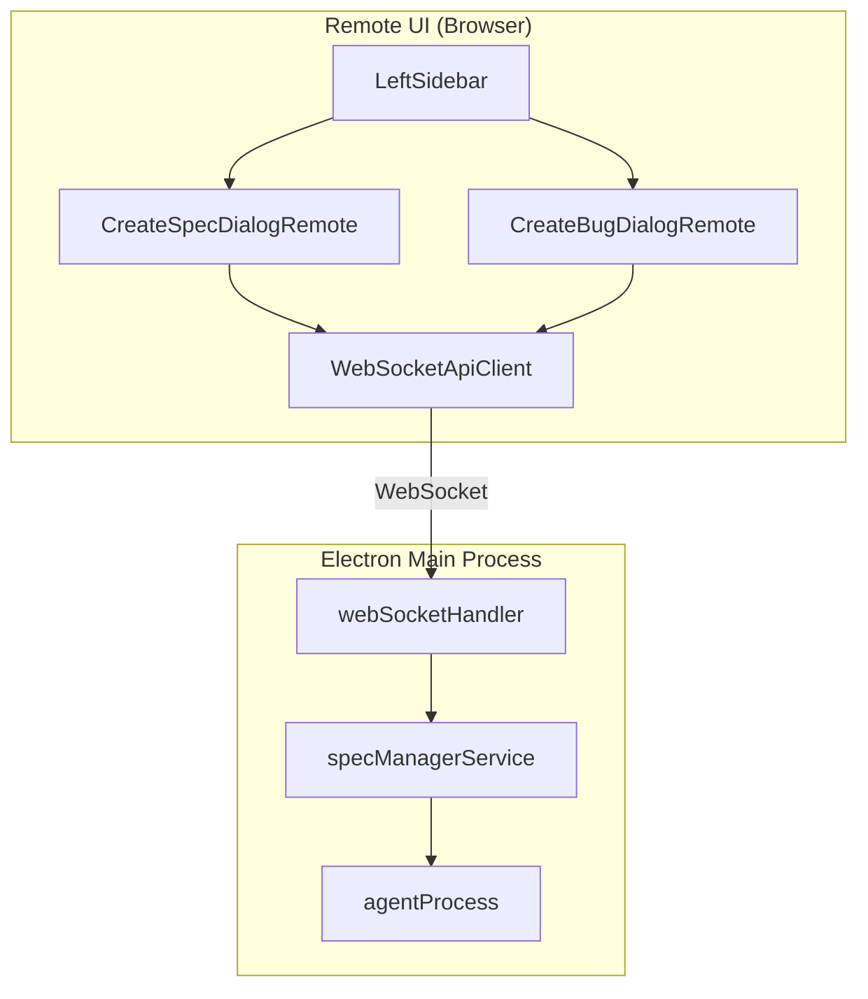
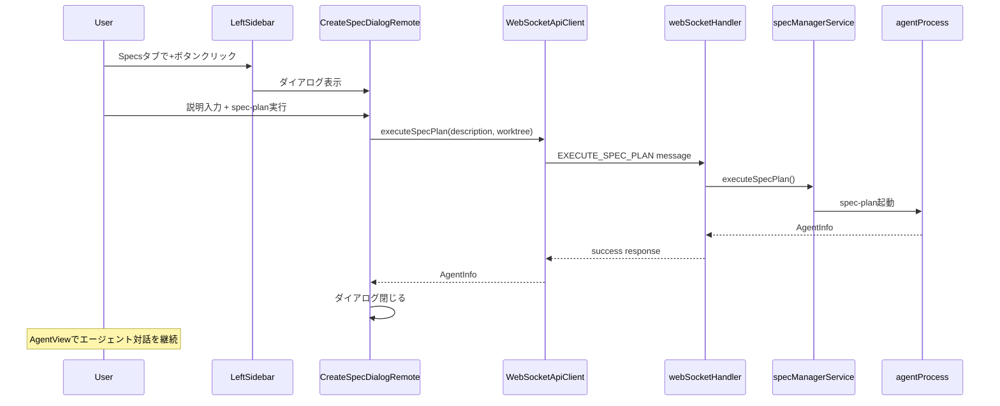

# Design: Remote UI Create Buttons

## Overview

**Purpose**: この機能は、Remote UI（ブラウザからアクセスするWebインターフェース）にSpec/Bug新規作成ボタンを追加し、デスクトップアプリを開かなくてもSpec/Bugを作成できるようにする。

**Users**: Remote UIを利用する開発者が、ブラウザ経由でSpec/Bugを直接作成できる。

**Impact**: 現在のRemote UIにはSpec/Bug作成機能がなく、すべての作成操作がデスクトップアプリ経由に限定されている。本機能により、Remote UIからも同等の作成フローが可能になる。

### Goals

- LeftSidebarのタブヘッダーにアクティブタブに応じた新規作成ボタンを追加
- Spec作成ダイアログ（CreateSpecDialogRemote）の実装
- WebSocket API経由でのspec-plan実行
- 既存Bug作成ボタンのBugsViewからLeftSidebarへの移動
- スマートフォンFAB対応の維持

### Non-Goals

- Electron版との共通コンポーネント化（将来検討）
- spec-planの対話機能（既存AgentViewで対応）
- Spec/Bug削除機能
- IpcApiClientへの`executeSpecPlan`追加（Electron版は既存の`window.electronAPI.executeSpecPlan`を使用）

## Architecture

### Existing Architecture Analysis

本機能はRemote UIの既存アーキテクチャを拡張する形で実装する。

**既存パターン**:
- `ApiClient`インターフェースによるIPC/WebSocket通信の抽象化
- `WebSocketApiClient`によるRemote UI向け実装
- `CreateBugDialogRemote`/`CreateBugButtonRemote`による既存Bug作成パターン
- `LeftSidebar`コンポーネント（App.tsx内のインライン定義）
- Electron版`DocsTabs`のタブヘッダー + 作成ボタン構造

**Integration Points**:
- `App.tsx` - LeftSidebarコンポーネント
- `shared/api/types.ts` - ApiClientインターフェース
- `shared/api/WebSocketApiClient.ts` - WebSocket API実装
- `main/services/webSocketHandler.ts` - WebSocketメッセージハンドラ

### Architecture Pattern & Boundary Map



**Architecture Integration**:
- **Selected pattern**: 既存のApiClient抽象化パターンを踏襲
- **Domain boundaries**: Remote UIコンポーネントはApiClient経由でのみMain Processと通信
- **Existing patterns preserved**: CreateBugDialogRemoteのパターンをSpec作成に適用
- **New components rationale**: CreateSpecDialogRemoteはElectron版CreateSpecDialogのRemote UI版
- **Steering compliance**: DRY（既存パターン再利用）、関心の分離（UI/通信/ロジックの分離）

### Technology Stack

| Layer | Choice / Version | Role in Feature | Notes |
|-------|------------------|-----------------|-------|
| Frontend | React 19 + TypeScript 5.8 | CreateSpecDialogRemote, LeftSidebar拡張 | 既存スタック |
| State | Zustand | ダイアログ状態管理 | useSharedSpecStore使用 |
| Communication | WebSocket (ws) | executeSpecPlan API | 既存パターン |
| Styling | Tailwind CSS 4 | ダイアログUI | 既存パターン |

## System Flows

### Spec作成フロー



**Key Decisions**:
- spec-plan実行後は即座にダイアログを閉じ、AgentViewでの対話に移行
- Worktreeモードスイッチはオプショナル（Electron版と同様）

## Requirements Traceability

| Criterion ID | Summary | Components | Implementation Approach |
|--------------|---------|------------|------------------------|
| 1.1 | SpecsタブアクティブでSpec新規作成ボタン表示 | LeftSidebar, CreateButtonRemote | 新規実装 |
| 1.2 | BugsタブアクティブでBug新規作成ボタン表示 | LeftSidebar, CreateBugButtonRemote | 既存再配置 |
| 1.3 | ボタンクリックで対応ダイアログ表示 | LeftSidebar | 新規実装 |
| 2.1 | 説明入力テキストエリア | CreateSpecDialogRemote | 新規実装 |
| 2.2 | Worktreeモードスイッチ | CreateSpecDialogRemote | 新規実装 |
| 2.3 | spec-planで作成ボタン | CreateSpecDialogRemote | 新規実装 |
| 2.4 | 実行成功時ダイアログ閉じ | CreateSpecDialogRemote | 新規実装 |
| 2.5 | エラーメッセージ表示 | CreateSpecDialogRemote | 新規実装 |
| 2.6 | 空説明時ボタン無効化 | CreateSpecDialogRemote | 新規実装 |
| 3.1 | ApiClientにexecuteSpecPlanメソッド追加 | shared/api/types.ts | 新規追加 |
| 3.2 | WebSocketApiClientにexecuteSpecPlan実装 | WebSocketApiClient | 新規実装 |
| 3.3 | EXECUTE_SPEC_PLANハンドラ追加 | webSocketHandler | 新規実装 |
| 3.4 | AgentInfo返却 | webSocketHandler | 既存パターン再利用 |
| 4.1 | タブヘッダーにボタン横並び配置 | LeftSidebar | 新規実装 |
| 4.2 | タブ切り替えでボタン動作切り替え | LeftSidebar | 新規実装 |
| 4.3 | Bug作成機能との整合性 | LeftSidebar, CreateBugDialogRemote | 既存維持 |
| 5.1 | BugsViewから既存ボタン削除 | BugsView | 修正 |
| 5.2 | LeftSidebarでBugタブ時ダイアログ表示 | LeftSidebar | 新規実装 |
| 5.3 | FABのスマートフォン対応維持 | LeftSidebar | 新規実装 |

### Coverage Validation Checklist

- [x] Every criterion ID from requirements.md appears in the table above
- [x] Each criterion has specific component names (not generic references)
- [x] Implementation approach distinguishes "reuse existing" vs "new implementation"
- [x] User-facing criteria specify concrete UI components

## Components and Interfaces

### Component Summary

| Component | Domain/Layer | Intent | Req Coverage | Key Dependencies | Contracts |
|-----------|--------------|--------|--------------|-----------------|-----------|
| LeftSidebar | Remote UI / Layout | タブヘッダー + 作成ボタン統合 | 1.1-1.3, 4.1-4.3, 5.2-5.3 | useApi (P0) | State |
| CreateSpecDialogRemote | Remote UI / Dialog | Spec作成ダイアログ | 2.1-2.6 | ApiClient (P0) | Service |
| CreateButtonRemote | Remote UI / UI | 汎用作成ボタン | 1.1, 1.2 | - | - |
| ApiClient.executeSpecPlan | Shared API / Interface | spec-plan実行API | 3.1, 3.4 | WebSocket (P0) | Service |
| WebSocketApiClient | Shared API / Client | WebSocket API実装 | 3.2 | ws (P0) | Service |
| webSocketHandler | Main / Service | EXECUTE_SPEC_PLANハンドラ | 3.3, 3.4 | specManagerService (P0) | Service |

### Remote UI Layer

#### LeftSidebar (Refactored)

| Field | Detail |
|-------|--------|
| Intent | タブヘッダーとSpec/Bug作成ボタンを統合管理 |
| Requirements | 1.1, 1.2, 1.3, 4.1, 4.2, 4.3, 5.2, 5.3 |

**Responsibilities & Constraints**
- Specs/Bugsタブ切り替えUI
- アクティブタブに応じた新規作成ボタン表示
- 作成ダイアログの開閉制御
- スマートフォン時はFABとして表示

**Dependencies**
- Inbound: App.tsx - レイアウト配置 (P0)
- Outbound: CreateSpecDialogRemote, CreateBugDialogRemote - ダイアログ表示 (P0)
- External: useApi - ApiClient取得 (P0)

**Contracts**: State [x]

##### State Management

```typescript
interface LeftSidebarState {
  /** 作成ダイアログタイプ（null = 非表示） */
  createDialogType: 'spec' | 'bug' | null;
}
```

**Implementation Notes**
- 現在App.tsx内にインライン定義されているLeftSidebarを拡張
- Electron版DocsTabs.tsxのタブヘッダー構造を参考に実装
- deviceTypeに応じてFAB/通常ボタンを切り替え

#### CreateSpecDialogRemote

| Field | Detail |
|-------|--------|
| Intent | Spec作成ダイアログのRemote UI実装 |
| Requirements | 2.1, 2.2, 2.3, 2.4, 2.5, 2.6 |

**Responsibilities & Constraints**
- 説明入力フォーム
- Worktreeモードスイッチ
- spec-plan実行リクエスト
- エラーハンドリング

**Dependencies**
- Inbound: LeftSidebar - ダイアログ表示制御 (P0)
- Outbound: ApiClient.executeSpecPlan - spec-plan実行 (P0)
- External: useSharedSpecStore - worktree設定 (P1)

**Contracts**: Service [x]

##### Service Interface

```typescript
interface CreateSpecDialogRemoteProps {
  /** ダイアログ表示状態 */
  isOpen: boolean;
  /** ダイアログを閉じるコールバック */
  onClose: () => void;
  /** APIクライアント */
  apiClient: ApiClient;
  /** デバイスタイプ */
  deviceType: 'desktop' | 'smartphone';
  /** Spec作成成功時コールバック（AgentView遷移用） */
  onSuccess?: (agentInfo: AgentInfo) => void;
}
```

- Preconditions: isOpen === true
- Postconditions: spec-plan実行成功時にonClose()が呼ばれる
- Invariants: descriptionが空の場合は送信ボタン無効

**Implementation Notes**
- CreateBugDialogRemoteと同じUI構造を踏襲
- Desktop版: 中央モーダル、Smartphone版: フルスクリーンモーダル
- Electron版CreateSpecDialogのUIを参考にWorktreeスイッチを実装

#### CreateButtonRemote

| Field | Detail |
|-------|--------|
| Intent | タブヘッダー用の汎用新規作成ボタン |
| Requirements | 1.1, 1.2 |

**Responsibilities & Constraints**
- アクティブタブに応じたラベル表示（Spec/Bug）
- Desktop: 通常ボタン、Smartphone: FAB

**Dependencies**
- Inbound: LeftSidebar - ボタン配置 (P0)

**Contracts**: (presentational component - summary only)

**Implementation Notes**
- CreateBugButtonRemoteをベースに汎用化
- `type: 'spec' | 'bug'`プロパティでラベル切り替え

### Shared API Layer

#### ApiClient.executeSpecPlan

| Field | Detail |
|-------|--------|
| Intent | spec-plan実行APIのインターフェース定義 |
| Requirements | 3.1, 3.4 |

**Contracts**: Service [x]

##### Service Interface

```typescript
interface ApiClient {
  // ... existing methods ...

  /**
   * Execute spec-plan to create a new spec
   * Requirements: 3.1 (remote-ui-create-buttons)
   * @param description - Spec description for planning
   * @param worktreeMode - Whether to create in worktree mode
   * @returns AgentInfo on success
   */
  executeSpecPlan?(
    description: string,
    worktreeMode: boolean
  ): Promise<Result<AgentInfo, ApiError>>;
}
```

- Preconditions: description is non-empty
- Postconditions: Returns AgentInfo with agentId
- Invariants: -

**Implementation Notes**
- Optional method (`?`) - IpcApiClientでは未実装（Electron版は既存IPC使用）
- WebSocketApiClientのみ実装

#### WebSocketApiClient.executeSpecPlan

| Field | Detail |
|-------|--------|
| Intent | executeSpecPlanのWebSocket実装 |
| Requirements | 3.2 |

**Responsibilities & Constraints**
- WebSocketメッセージ送信
- レスポンス待機とResult型への変換

**Dependencies**
- Outbound: WebSocket connection - メッセージ送信 (P0)

**Contracts**: Service [x]

##### Service Interface

```typescript
// WebSocketApiClient内の実装
async executeSpecPlan(
  description: string,
  worktreeMode: boolean
): Promise<Result<AgentInfo, ApiError>> {
  return this.sendRequest<AgentInfo>('EXECUTE_SPEC_PLAN', {
    description,
    worktreeMode,
  });
}
```

**Implementation Notes**
- 既存の`sendRequest`パターンを使用
- メッセージタイプ: `EXECUTE_SPEC_PLAN`

### Main Process Layer

#### webSocketHandler - EXECUTE_SPEC_PLAN Handler

| Field | Detail |
|-------|--------|
| Intent | EXECUTE_SPEC_PLANメッセージの処理 |
| Requirements | 3.3, 3.4 |

**Responsibilities & Constraints**
- メッセージペイロードの検証
- WorkflowController経由でのspec-plan実行
- AgentInfoのレスポンス返却

**Dependencies**
- Inbound: WebSocket connection - メッセージ受信 (P0)
- Outbound: WorkflowController.executeSpecPlan - spec-plan実行 (P0)

**Contracts**: Service [x]

##### Service Interface

```typescript
// WorkflowControllerインターフェース拡張
interface WorkflowController {
  // ... existing methods ...

  /**
   * Execute spec-plan with description
   * Requirements: 3.3 (remote-ui-create-buttons)
   */
  executeSpecPlan?(
    description: string,
    worktreeMode: boolean
  ): Promise<WorkflowResult<AgentInfo>>;
}
```

##### Message Contract

```typescript
// Request message
interface ExecuteSpecPlanRequest {
  type: 'EXECUTE_SPEC_PLAN';
  payload: {
    description: string;
    worktreeMode: boolean;
  };
  requestId: string;
  timestamp: number;
}

// Response message
interface ExecuteSpecPlanResponse {
  type: 'EXECUTE_SPEC_PLAN_RESPONSE';
  payload: {
    success: boolean;
    agentInfo?: AgentInfo;
    error?: { type: string; message: string };
  };
  requestId: string;
  timestamp: number;
}
```

**Implementation Notes**
- 既存の`CREATE_SPEC`/`CREATE_BUG`ハンドラパターンを参考に実装
- WorkflowController.executeSpecPlanは既存の`createSpec`を拡張または新規追加

## Data Models

### Domain Model

本機能は既存のデータモデルを変更しない。

**使用するエンティティ**:
- `AgentInfo`: spec-plan実行結果として返却
- `SpecMetadata`: 作成されたSpec情報（既存）

### Logical Data Model

**API Request/Response**:

```typescript
// ExecuteSpecPlan Request
{
  description: string;  // 必須、非空
  worktreeMode: boolean;  // オプション、デフォルトfalse
}

// ExecuteSpecPlan Response
{
  agentId: string;
  specId: string;  // '' for project-level agent
  phase: string;  // 'spec-plan'
  status: 'running';
  startedAt: number;
  command: string;
}
```

## Error Handling

### Error Strategy

- **Validation Errors**: クライアントサイドで即時フィードバック
- **API Errors**: ダイアログ内にエラーメッセージ表示
- **Network Errors**: WebSocket再接続オーバーレイ（既存）

### Error Categories and Responses

| Category | Condition | UI Response |
|----------|-----------|-------------|
| User Error | description empty | Submit button disabled |
| User Error | invalid input | Field-level error message |
| API Error | spec-plan execution failed | Dialog error message |
| Network Error | WebSocket disconnected | ReconnectOverlay (existing) |

## Testing Strategy

### Unit Tests

- `CreateSpecDialogRemote`: フォーム入力、バリデーション、送信処理
- `CreateButtonRemote`: deviceTypeによる表示切り替え
- `LeftSidebar`: タブ切り替え、ダイアログ開閉状態管理
- `WebSocketApiClient.executeSpecPlan`: リクエスト/レスポンス処理

### Integration Tests

- タブ切り替えと作成ボタン連動
- Spec作成フロー全体（ダイアログ表示 -> 入力 -> 実行 -> 閉じる）
- エラーハンドリング（APIエラー時のUI表示）

### E2E Tests

- Remote UIでのSpec作成フロー
- スマートフォンレイアウトでのFAB操作
- Worktreeモードでの作成

## Design Decisions

### DD-001: Remote UIのみ対応（共通化なし）

| Field | Detail |
|-------|--------|
| Status | Accepted |
| Context | タブヘッダーUIをElectron版と共通化するか検討が必要 |
| Decision | Remote UIのみ対応し、Electron版との共通化は行わない |
| Rationale | Electron版（DocsTabs）とRemote UI版（LeftSidebar）でコンポーネント構造が根本的に異なる。ダイアログ実装もIPC vs WebSocketで異なる。既存のBug作成パターン（CreateBugDialogRemote）が安定動作している。 |
| Alternatives Considered | 1. 共通コンポーネント化 - 構造の違いにより複雑化のリスク高い |
| Consequences | 将来の共通化は別specで検討。重複コードは許容（DRYより安定性優先） |

### DD-002: ApiClient.executeSpecPlanをオプショナルメソッドとして追加

| Field | Detail |
|-------|--------|
| Status | Accepted |
| Context | Electron版は既存の`window.electronAPI.executeSpecPlan`を使用しており、IpcApiClientへの追加は不要 |
| Decision | ApiClientインターフェースにオプショナルメソッド（`executeSpecPlan?`）として追加 |
| Rationale | IpcApiClientでは未実装でも型エラーにならない。WebSocketApiClientのみ実装し、Remote UI専用機能として提供。 |
| Alternatives Considered | 1. 必須メソッドとして追加 - IpcApiClientでの空実装が必要になる 2. 別インターフェースで定義 - 既存パターンから逸脱 |
| Consequences | Remote UIでは`apiClient.executeSpecPlan?.()`として呼び出し、存在チェックが必要 |

### DD-003: 既存Bug作成ボタンのLeftSidebar移動

| Field | Detail |
|-------|--------|
| Status | Accepted |
| Context | 現在BugsView内にCreateBugButtonRemote/CreateBugDialogRemoteが配置されている |
| Decision | LeftSidebarに移動し、Spec/Bug作成を同じ場所で行えるようにする |
| Rationale | Electron版DocsTabs.tsxと同じUXを提供。タブヘッダーに作成ボタンを配置することで一貫性を確保。 |
| Alternatives Considered | 1. 両方に配置 - 重複UIで混乱の原因になる 2. BugsViewのまま - Electron版との一貫性がない |
| Consequences | BugsView内の既存ボタン/ダイアログを削除。LeftSidebarの責務が増える。 |

### DD-004: スマートフォンFABはアクティブタブに応じて1つ表示

| Field | Detail |
|-------|--------|
| Status | Accepted |
| Context | スマートフォン表示時のFAB配置をどうするか |
| Decision | アクティブタブに応じて1つのFABを表示（Spec/Bug切り替え） |
| Rationale | Electron版DocsTabs.tsxの挙動に合わせる。複数FABは画面を圧迫する。 |
| Alternatives Considered | 1. Spec/Bug両方のFABを表示 - 画面が煩雑になる 2. FABなし - 作成操作が困難になる |
| Consequences | タブ切り替え時にFABのラベル/動作が切り替わる |

## Integration & Deprecation Strategy

### 修正が必要な既存ファイル (Wiring Points)

| File | Modification |
|------|--------------|
| `src/remote-ui/App.tsx` | LeftSidebar拡張（タブヘッダー + 作成ボタン統合） |
| `src/remote-ui/views/BugsView.tsx` | CreateBugButtonRemote/CreateBugDialogRemote削除 |
| `src/shared/api/types.ts` | ApiClientインターフェースにexecuteSpecPlan追加 |
| `src/shared/api/WebSocketApiClient.ts` | executeSpecPlan実装追加 |
| `src/main/services/webSocketHandler.ts` | EXECUTE_SPEC_PLANハンドラ追加 |

### 新規作成ファイル

| File | Purpose |
|------|---------|
| `src/remote-ui/components/CreateSpecDialogRemote.tsx` | Spec作成ダイアログ |
| `src/remote-ui/components/CreateButtonRemote.tsx` | 汎用作成ボタン（オプション） |

### 削除対象ファイル

なし（コンポーネントの移動のみ）

### 移動・リファクタリング

- `CreateBugButtonRemote`, `CreateBugDialogRemote`: BugsViewからの参照を削除し、LeftSidebarから参照
