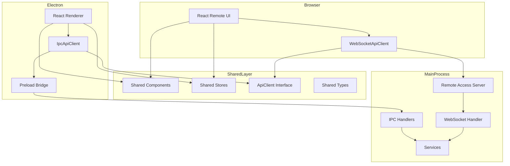
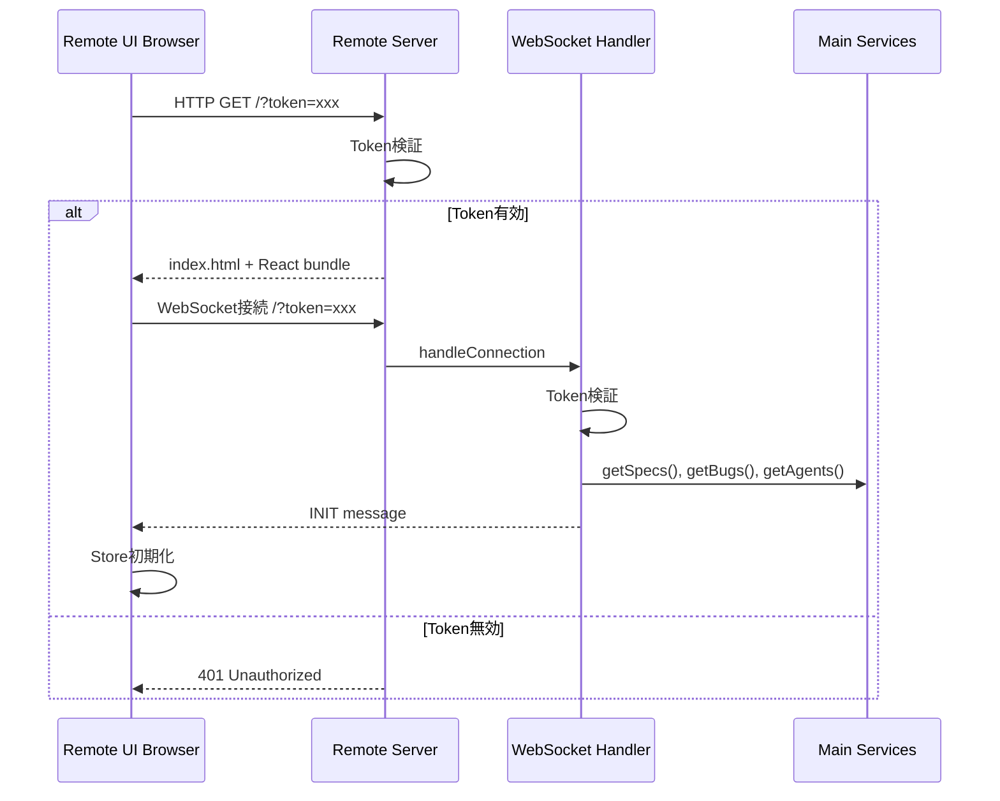
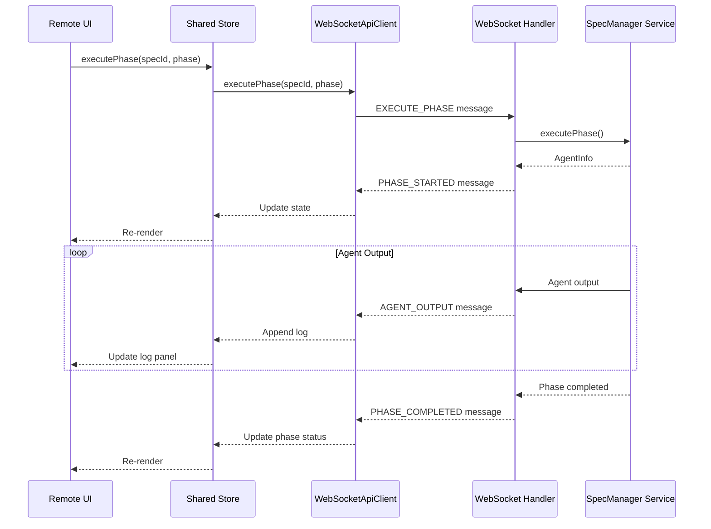
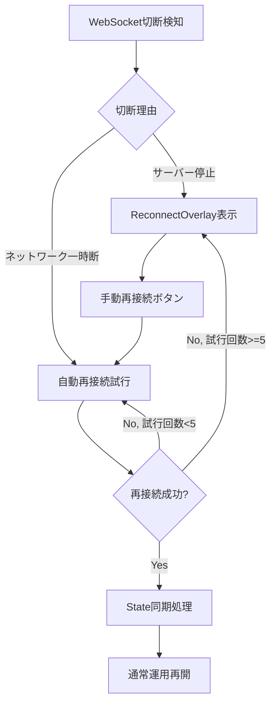

# Design: Remote UI React Migration

## Overview

**Purpose**: Remote UI（現在Vanilla JavaScript実装）をReact + TypeScriptに完全移行し、Electron版とコンポーネントを共有可能にする。これによりコードの重複を排除し、保守性を向上させる。

**Users**:
- 開発者本人がスマートフォンからSDDワークフローを確認・操作
- チームメンバーがリモートからプロジェクト状況を把握
- E2Eテストの自動化によるCI/CD環境での品質保証

**Impact**: 現在の`src/main/remote-ui/`（Vanilla JS約4,534行）を完全に削除し、`src/remote-ui/`（React版）と`src/shared/`（共有コンポーネント）を新設。Electron版（`src/renderer/`）のコンポーネント共有率85%以上を達成。

### Goals

- React + TypeScript統一によるコード品質向上と型安全性の確保
- Electron版とRemote UI版で85%以上のコンポーネント共有率を達成
- API抽象化層によるIPC/WebSocket通信の透過的な切り替え
- レスポンシブUI（モバイル/デスクトップ）の実現
- E2Eテスト自動化のためのCLI起動オプション対応

### Non-Goals

- 既存Vanilla JS版との互換性維持（完全置き換え）
- モバイルネイティブアプリ（ブラウザベースのみ）
- マルチプロジェクト同時アクセス（1サーバー1プロジェクト）
- リアルタイムコラボレーション編集（閲覧・実行は可能）
- オフライン対応（サーバー接続必須）

---

## Architecture

### Existing Architecture Analysis

**現在のアーキテクチャ**:
- Electron版: React + TypeScript、`window.electronAPI`経由でIPC通信
- Remote UI版: Vanilla JavaScript、WebSocket経由で通信
- 重複実装: SpecList、BugList、WorkflowView、LogViewer等が別々に実装

**既存ドメイン境界**:
- `src/main/`: Electronメインプロセス（IPC handlers、services）
- `src/renderer/`: ElectronレンダラープロセスReactアプリ
- `src/main/remote-ui/`: Vanilla JS Remote UI（削除対象）
- `src/main/services/remoteAccessServer.ts`: HTTP/WebSocket server
- `src/main/services/webSocketHandler.ts`: WebSocket通信ハンドラ

**維持すべきパターン**:
- Zustand stores（状態管理）
- Tailwind CSS（スタイリング）
- preload + contextBridge（セキュリティ）
- `webSocketHandler.ts`のメッセージタイプ構造

### Architecture Pattern & Boundary Map



**Architecture Integration**:
- Selected pattern: Provider Pattern + Dependency Injection（通信方式の抽象化）
- Domain boundaries: `src/shared/`（共通）、`src/renderer/electron-specific/`（Electron専用）、`src/remote-ui/web-specific/`（Web専用）
- Existing patterns preserved: Zustand stores、Tailwind CSS、IPC channels
- New components rationale: API抽象化層により通信方式を透過化し、コンポーネント共有を実現
- Steering compliance: DRY、SSOT原則に準拠

### Technology Stack

| Layer | Choice / Version | Role in Feature | Notes |
|-------|------------------|-----------------|-------|
| Frontend | React 19 + TypeScript 5.8+ | 共有UIコンポーネント | Electron版と同一バージョン |
| Build | Vite 5+ | Remote UI専用ビルド | `vite.config.remote.ts`で独立管理 |
| State | Zustand | 共有状態管理 | API抽象化層経由でデータ取得 |
| Styling | Tailwind CSS 4 | レスポンシブUI | ブレークポイント活用 |
| Transport | WebSocket (ws) | Remote UI通信 | 既存`webSocketHandler.ts`と連携 |
| Auth | Token-based | アクセス制御 | 既存`accessTokenService.ts`活用 |

---

## System Flows

### Remote UI接続フロー



### フェーズ実行フロー（Remote UI）



---

## Requirements Traceability

| Requirement | Summary | Components | Interfaces | Flows |
|-------------|---------|------------|------------|-------|
| 1 | React移行とビルド基盤 | ViteConfig, RemoteUIApp | - | - |
| 2 | API抽象化層 | ApiClient, IpcApiClient, WebSocketApiClient | ApiClient | 全フロー |
| 3 | コンポーネント共有化 | SharedComponents, PlatformProvider | usePlatform | - |
| 4 | レスポンシブUI | MobileLayout, DesktopLayout | useDeviceType | 接続フロー |
| 5 | トークンベース認証 | TokenValidator, AuthPage | - | 接続フロー |
| 6 | QRコード・URL共有 | RemoteAccessPanel（既存） | - | - |
| 7 | 全機能実装 | 全SharedComponents | - | 全フロー |
| 8 | ネットワーク対応 | RemoteAccessServer（既存） | - | 接続フロー |
| 9 | プロジェクト切り替え時の動作 | ReconnectOverlay | - | 切断フロー |
| 10 | 既存機能との互換性 | WebSocketHandler（既存拡張） | - | - |
| 11 | CLI起動オプション | CLIArgsParser, HeadlessRunner | - | E2Eフロー |

---

## Components and Interfaces

### Component Summary

| Component | Domain/Layer | Intent | Req Coverage | Key Dependencies | Contracts |
|-----------|--------------|--------|--------------|------------------|-----------|
| ApiClient | Shared/Transport | 通信抽象化インタフェース | 2 | - | Service |
| IpcApiClient | Electron/Transport | Electron IPC実装 | 2.3 | window.electronAPI (P0) | Service |
| WebSocketApiClient | Remote/Transport | WebSocket実装 | 2.2 | wsManager (P0) | Service |
| ApiClientProvider | Shared/Context | DI用Reactコンテキスト | 2.4 | ApiClient (P0) | - |
| PlatformProvider | Shared/Context | プラットフォーム機能DI | 3.2 | - | - |
| SharedComponents | Shared/UI | 共有UIコンポーネント群 | 3.1, 7 | ApiClient (P0) | - |
| MobileLayout | Remote/UI | モバイル向けレイアウト | 4.2 | SharedComponents (P1) | - |
| DesktopLayout | Remote/UI | デスクトップ向けレイアウト | 4.3 | SharedComponents (P1) | - |
| TokenValidator | Main/Auth | トークン検証 | 5.2, 5.3 | accessTokenService (P0) | - |
| CLIArgsParser | Main/CLI | 起動引数解析 | 11 | electron.app (P0) | - |

---

### Shared / Transport Layer

#### ApiClient Interface

| Field | Detail |
|-------|--------|
| Intent | IPC/WebSocket通信を抽象化する共通インタフェース |
| Requirements | 2.1 |

**Responsibilities & Constraints**
- 通信方式を隠蔽し、コンポーネントが通信方法を意識しない設計
- 全APIメソッドは`Result<T, Error>`型で統一的にエラーを返却
- 非同期操作は全てPromiseベース

**Dependencies**
- Outbound: SpecManagerService (P0) - フェーズ実行、Spec操作
- Outbound: AgentRegistry (P0) - Agent制御
- Outbound: BugService (P0) - Bug操作

**Contracts**: Service [x]

##### Service Interface

```typescript
interface ApiClient {
  // Spec Operations
  getSpecs(): Promise<Result<SpecInfo[], ApiError>>;
  getSpecDetail(specId: string): Promise<Result<SpecDetail, ApiError>>;
  executePhase(specId: string, phase: WorkflowPhase): Promise<Result<AgentInfo, ApiError>>;
  updateApproval(specPath: string, phase: Phase, approved: boolean): Promise<Result<void, ApiError>>;

  // Bug Operations
  getBugs(): Promise<Result<BugInfo[], ApiError>>;
  getBugDetail(bugPath: string): Promise<Result<BugDetail, ApiError>>;
  executeBugPhase(bugName: string, phase: BugAction): Promise<Result<AgentInfo, ApiError>>;

  // Agent Operations
  getAgents(): Promise<Result<AgentInfo[], ApiError>>;
  stopAgent(agentId: string): Promise<Result<void, ApiError>>;
  resumeAgent(agentId: string): Promise<Result<AgentInfo, ApiError>>;
  sendAgentInput(agentId: string, text: string): Promise<Result<void, ApiError>>;
  getAgentLogs(specId: string, agentId: string): Promise<Result<LogEntry[], ApiError>>;

  // Validation & Review
  executeValidation(specId: string, type: ValidationType): Promise<Result<AgentInfo, ApiError>>;
  executeDocumentReview(specId: string): Promise<Result<AgentInfo, ApiError>>;
  executeInspection(specId: string): Promise<Result<AgentInfo, ApiError>>;

  // Auto Execution
  startAutoExecution(specPath: string, specId: string, options: AutoExecutionOptions): Promise<Result<AutoExecutionState, ApiError>>;
  stopAutoExecution(specPath: string): Promise<Result<void, ApiError>>;
  getAutoExecutionStatus(specPath: string): Promise<Result<AutoExecutionState | null, ApiError>>;

  // File Operations (Remote UI経由での保存)
  saveFile(filePath: string, content: string): Promise<Result<void, ApiError>>;

  // Event Subscriptions
  onSpecsUpdated(callback: (specs: SpecInfo[]) => void): () => void;
  onBugsUpdated(callback: (bugs: BugInfo[]) => void): () => void;
  onAgentOutput(callback: (agentId: string, stream: string, data: string) => void): () => void;
  onAgentStatusChange(callback: (agentId: string, status: AgentStatus) => void): () => void;
  onAutoExecutionStatusChanged(callback: (data: AutoExecutionStatusEvent) => void): () => void;
}

interface ApiError {
  type: string;
  message: string;
  code?: string;
}

type Result<T, E> = { ok: true; value: T } | { ok: false; error: E };
```

- Preconditions: 接続済み状態（WebSocket）またはpreload初期化済み（IPC）
- Postconditions: 結果はResult型で返却
- Invariants: エラー時もResult.errorで統一的に処理

**Implementation Notes**
- Integration: IpcApiClientはwindow.electronAPIをラップ、WebSocketApiClientはwsManagerをラップ
- Validation: 入力パラメータはZodスキーマで検証
- Risks: WebSocket切断時の再接続ロジックが必要

---

#### IpcApiClient

| Field | Detail |
|-------|--------|
| Intent | Electron IPC経由でApiClientを実装 |
| Requirements | 2.3 |

**Responsibilities & Constraints**
- `window.electronAPI`の全メソッドをApiClientインタフェースにマッピング
- エラーハンドリングを統一的なResult型に変換

**Dependencies**
- Outbound: window.electronAPI (P0) - 全IPC呼び出し

**Contracts**: Service [x]

```typescript
class IpcApiClient implements ApiClient {
  async getSpecs(): Promise<Result<SpecInfo[], ApiError>> {
    try {
      const projectPath = useProjectStore.getState().currentProject?.path;
      if (!projectPath) return { ok: false, error: { type: 'NO_PROJECT', message: 'No project selected' } };
      const specs = await window.electronAPI.readSpecs(projectPath);
      return { ok: true, value: specs };
    } catch (error) {
      return { ok: false, error: { type: 'IPC_ERROR', message: String(error) } };
    }
  }
  // ... 他のメソッド実装
}
```

**Implementation Notes**
- Integration: 既存の`window.electronAPI`をそのまま活用
- Validation: 呼び出し前にprojectPath存在チェック
- Risks: 型の不整合に注意（既存preload定義を参照）

---

#### WebSocketApiClient

| Field | Detail |
|-------|--------|
| Intent | WebSocket経由でApiClientを実装 |
| Requirements | 2.2 |

**Responsibilities & Constraints**
- WebSocketメッセージをApiClientインタフェースにマッピング
- Request/Response相関のためrequestIdを管理
- 再接続ロジックを内包

**Dependencies**
- Outbound: WebSocketManager (P0) - WebSocket接続管理

**Contracts**: Service [x]

```typescript
class WebSocketApiClient implements ApiClient {
  private wsManager: WebSocketManager;
  private pendingRequests: Map<string, {
    resolve: (value: unknown) => void;
    reject: (error: Error) => void;
  }>;

  async executePhase(specId: string, phase: WorkflowPhase): Promise<Result<AgentInfo, ApiError>> {
    const requestId = this.generateRequestId();
    return new Promise((resolve) => {
      this.pendingRequests.set(requestId, {
        resolve: (payload) => {
          if (payload.agentId) {
            resolve({ ok: true, value: payload as AgentInfo });
          } else {
            resolve({ ok: false, error: payload as ApiError });
          }
        },
        reject: (error) => resolve({ ok: false, error: { type: 'WS_ERROR', message: error.message } })
      });

      this.wsManager.send({
        type: 'EXECUTE_PHASE',
        payload: { specId, phase },
        requestId,
        timestamp: Date.now()
      });
    });
  }
  // ... 他のメソッド実装
}
```

**Implementation Notes**
- Integration: 既存`wsManager`（`remote-ui/websocket.js`相当）をTypeScriptで再実装
- Validation: メッセージ構造はWebSocketMessage型に準拠
- Risks: 接続切断時のpendingRequests処理（タイムアウト実装が必要）

---

### Shared / Context Layer

#### ApiClientProvider

| Field | Detail |
|-------|--------|
| Intent | ApiClient実装をReact Contextで注入 |
| Requirements | 2.4 |

**Responsibilities & Constraints**
- プラットフォームに応じたApiClient実装を自動選択
- 子コンポーネントから`useApi()`フックでアクセス可能

**Dependencies**
- Inbound: App (P0) - ルートでProvider設定

**Contracts**: State [x]

```typescript
const ApiClientContext = createContext<ApiClient | null>(null);

interface ApiClientProviderProps {
  children: React.ReactNode;
  client?: ApiClient; // テスト用にモック注入可能
}

function ApiClientProvider({ children, client }: ApiClientProviderProps) {
  const [apiClient] = useState(() => {
    if (client) return client;
    // 環境に応じて自動選択
    if (typeof window.electronAPI !== 'undefined') {
      return new IpcApiClient();
    }
    return new WebSocketApiClient();
  });

  return (
    <ApiClientContext.Provider value={apiClient}>
      {children}
    </ApiClientContext.Provider>
  );
}

function useApi(): ApiClient {
  const client = useContext(ApiClientContext);
  if (!client) throw new Error('useApi must be used within ApiClientProvider');
  return client;
}
```

**Implementation Notes**
- Integration: App.tsxのルートでラップ
- Validation: Context未設定時はエラー
- Risks: SSR非対応（Electron/ブラウザ環境のみ）

---

#### PlatformProvider

| Field | Detail |
|-------|--------|
| Intent | プラットフォーム固有機能の有無を提供 |
| Requirements | 3.2 |

**Responsibilities & Constraints**
- Electron専用機能（ファイルダイアログ、SSH設定）の可否を管理
- コンポーネントが条件分岐でレンダリング

**Dependencies**
- Inbound: App (P0) - ルートでProvider設定

**Contracts**: State [x]

```typescript
interface PlatformCapabilities {
  canOpenFileDialog: boolean;
  canConfigureSSH: boolean;
  canSelectProject: boolean;
  canSaveFileLocally: boolean;
  platform: 'electron' | 'web';
}

const PlatformContext = createContext<PlatformCapabilities | null>(null);

function PlatformProvider({ children }: { children: React.ReactNode }) {
  const capabilities = useMemo<PlatformCapabilities>(() => {
    if (typeof window.electronAPI !== 'undefined') {
      return {
        canOpenFileDialog: true,
        canConfigureSSH: true,
        canSelectProject: true,
        canSaveFileLocally: true,
        platform: 'electron'
      };
    }
    return {
      canOpenFileDialog: false,
      canConfigureSSH: false, // 閲覧のみ
      canSelectProject: false, // 現在のプロジェクトのみ
      canSaveFileLocally: false, // サーバー経由
      platform: 'web'
    };
  }, []);

  return (
    <PlatformContext.Provider value={capabilities}>
      {children}
    </PlatformContext.Provider>
  );
}

function usePlatform(): PlatformCapabilities {
  const capabilities = useContext(PlatformContext);
  if (!capabilities) throw new Error('usePlatform must be used within PlatformProvider');
  return capabilities;
}
```

**Implementation Notes**
- Integration: ApiClientProviderと併用
- Validation: 環境検出ロジックは初期化時のみ実行
- Risks: 機能追加時にcapabilities更新が必要

---

### Shared / UI Components

#### SharedComponents（コンポーネント共有方針）

| Field | Detail |
|-------|--------|
| Intent | Electron版とRemote UI版で共有するUIコンポーネント群 |
| Requirements | 3.1, 7 |

**共有対象コンポーネント（`src/shared/components/`に配置）**:

| カテゴリ | コンポーネント | 現在の場所 | 共有率見込み |
|---------|---------------|-----------|-------------|
| Spec関連 | SpecList, SpecListItem, SpecDetail | renderer/components | 95% |
| Bug関連 | BugList, BugListItem, BugDetail, BugPhaseItem | renderer/components | 95% |
| Workflow | WorkflowView, PhaseItem, ApprovalPanel | renderer/components | 90% |
| Agent | AgentListPanel, AgentLogPanel, AgentInputPanel | renderer/components | 95% |
| Document | DocumentReviewPanel, ReviewHistoryView, InspectionPanel | renderer/components | 90% |
| Auto Execution | AutoExecutionStatusDisplay, BugAutoExecutionStatusDisplay | renderer/components | 95% |
| Project | ProjectAgentPanel, AskAgentDialog | renderer/components | 90% |
| UI基本 | Button, Card, Modal, Toast, Spinner, SearchBar | - | 100% |
| タブ | DocsTabs, ArtifactPreview, TaskProgressView | renderer/components | 90% |

**Electron専用コンポーネント（`src/renderer/electron-specific/`に配置）**:
- SSHConnectDialog, SSHAuthDialog, SSHStatusIndicator
- CloudflareSettingsPanel, RemoteAccessPanel, RemoteAccessDialog
- CliInstallDialog, ClaudeMdInstallDialog, CommandsetInstallDialog
- ProjectSelector, RecentProjects, RecentRemoteProjects

**Web専用コンポーネント（`src/remote-ui/web-specific/`に配置）**:
- AuthPage（トークン認証エラー表示）
- ReconnectOverlay（WebSocket切断時オーバーレイ）
- MobileLayout, DesktopLayout

**Implementation Notes**
- Integration: 既存コンポーネントを段階的に移動・リファクタリング
- Validation: `usePlatform()`で機能の有無を確認し条件レンダリング
- Risks: 移動時の依存関係解決が複雑

---

### Remote / UI Layer

#### MobileLayout

| Field | Detail |
|-------|--------|
| Intent | モバイルデバイス向けコンパクトレイアウト |
| Requirements | 4.2 |

**Responsibilities & Constraints**
- タブ切り替えメインのナビゲーション
- タッチ操作に最適化されたボタンサイズ（min 44x44px）
- 縦スクロール中心のレイアウト

**Dependencies**
- Inbound: RemoteUIApp (P0) - レイアウト選択
- Outbound: SharedComponents (P1) - UI表示

**Contracts**: -

```typescript
interface MobileLayoutProps {
  children: React.ReactNode;
}

function MobileLayout({ children }: MobileLayoutProps) {
  return (
    <div className="flex flex-col h-screen">
      <MobileHeader />
      <main className="flex-1 overflow-y-auto p-4">
        {children}
      </main>
      <MobileTabBar />
    </div>
  );
}
```

**Implementation Notes**
- Integration: Tailwind CSSのモバイルファーストブレークポイント使用
- Validation: タップターゲットサイズを最小44pxに維持
- Risks: 複雑なUIのモバイル対応が困難な場合がある

---

#### DesktopLayout

| Field | Detail |
|-------|--------|
| Intent | デスクトップブラウザ向けフルレイアウト |
| Requirements | 4.3 |

**Responsibilities & Constraints**
- Electron版と同等の複雑なUI（サイドバー、複数ペイン）
- マウス操作に最適化
- 横幅を活用したレイアウト

**Dependencies**
- Inbound: RemoteUIApp (P0) - レイアウト選択
- Outbound: SharedComponents (P1) - UI表示

**Contracts**: -

```typescript
interface DesktopLayoutProps {
  children: React.ReactNode;
}

function DesktopLayout({ children }: DesktopLayoutProps) {
  return (
    <div className="flex h-screen">
      <Sidebar className="w-64 flex-shrink-0" />
      <main className="flex-1 flex flex-col overflow-hidden">
        <Header />
        <div className="flex-1 overflow-hidden">
          {children}
        </div>
      </main>
    </div>
  );
}
```

**Implementation Notes**
- Integration: Electron版のレイアウト構造を踏襲
- Validation: 最小幅1024pxを想定
- Risks: ResizeHandleの共有化が複雑

---

### Main / Auth Layer

#### TokenValidator

| Field | Detail |
|-------|--------|
| Intent | アクセストークンの検証 |
| Requirements | 5.2, 5.3 |

**Responsibilities & Constraints**
- URLクエリパラメータからトークンを抽出
- 有効期限と署名を検証
- 無効時はエラーレスポンスを返却

**Dependencies**
- Inbound: StaticFileServer (P0) - HTTPリクエスト処理
- Inbound: WebSocketHandler (P0) - WebSocket接続処理
- Outbound: accessTokenService (P0) - トークン検証

**Contracts**: -

既存の`accessTokenService.ts`を活用し、HTTP/WebSocketの両方で同一ロジックを使用。

**Implementation Notes**
- Integration: 既存実装を活用、変更なし
- Validation: トークン形式・有効期限・署名の3段階検証
- Risks: トークン期限切れ時のUXに注意

---

### Main / CLI Layer

#### CLIArgsParser

| Field | Detail |
|-------|--------|
| Intent | コマンドライン引数の解析 |
| Requirements | 11 |

**Responsibilities & Constraints**
- Electron起動時の引数を解析
- E2Eテスト用オプションを提供
- ヘルプ表示対応

**Dependencies**
- Inbound: main.ts (P0) - Electron起動時
- Outbound: electron.app (P0) - 引数取得

**Contracts**: -

```typescript
interface CLIOptions {
  projectPath: string | null;
  remoteUIAuto: boolean;
  remotePort: number;
  headless: boolean;
  remoteToken: string | null;
  noAuth: boolean;
  e2eTest: boolean;
  help: boolean;
}

function parseCLIArgs(args: string[]): CLIOptions {
  const options: CLIOptions = {
    projectPath: null,
    remoteUIAuto: false,
    remotePort: 3000,
    headless: false,
    remoteToken: null,
    noAuth: false,
    e2eTest: false,
    help: false
  };

  for (let i = 0; i < args.length; i++) {
    const arg = args[i];
    if (arg.startsWith('--project=')) {
      options.projectPath = arg.split('=')[1];
    } else if (arg === '--remote-ui=auto') {
      options.remoteUIAuto = true;
    } else if (arg.startsWith('--remote-port=')) {
      options.remotePort = parseInt(arg.split('=')[1], 10);
    } else if (arg === '--headless') {
      options.headless = true;
    } else if (arg.startsWith('--remote-token=')) {
      options.remoteToken = arg.split('=')[1];
    } else if (arg === '--no-auth') {
      options.noAuth = true;
    } else if (arg === '--e2e-test') {
      options.e2eTest = true;
    } else if (arg === '--help') {
      options.help = true;
    }
  }

  return options;
}
```

**Implementation Notes**
- Integration: main.tsのapp.whenReady()で呼び出し
- Validation: ポート番号の範囲チェック
- Risks: 既存の--e2e-testフラグとの整合性

---

## Data Models

### Domain Model

**Aggregates**:
- Spec: Specワークフローの集約ルート
- Bug: Bugワークフローの集約ルート
- Agent: 実行中/完了Agentの集約

**既存データモデルを維持**:
- `SpecInfo`, `SpecDetail`, `SpecJson`
- `BugInfo`, `BugDetail`, `BugMetadata`
- `AgentInfo`, `AgentStatus`, `AgentRecord`

**追加データモデル**:

```typescript
// API抽象化層用
interface ApiError {
  type: string;
  message: string;
  code?: string;
}

// プラットフォーム機能
interface PlatformCapabilities {
  canOpenFileDialog: boolean;
  canConfigureSSH: boolean;
  canSelectProject: boolean;
  canSaveFileLocally: boolean;
  platform: 'electron' | 'web';
}

// デバイスタイプ判定
type DeviceType = 'mobile' | 'tablet' | 'desktop';
```

### Logical Data Model

**共有Store構造**:

既存のZustand storesを共有化のためにリファクタリング：

```typescript
// src/shared/stores/specStore.ts
interface SharedSpecState {
  specs: SpecInfo[];
  selectedSpecId: string | null;
  specDetail: SpecDetail | null;
  isLoading: boolean;
  error: string | null;
}

interface SharedSpecActions {
  loadSpecs: () => Promise<void>;
  selectSpec: (specId: string) => Promise<void>;
  executePhase: (phase: WorkflowPhase) => Promise<void>;
  // ... ApiClient経由で実装
}
```

**通信への依存解除**:
- 既存stores内の`window.electronAPI`直接呼び出しを`useApi()`経由に変更
- イベント購読もApiClient経由で統一

---

## Error Handling

### Error Strategy

**階層的エラーハンドリング**:
1. Transport層: 接続エラー、タイムアウト
2. API層: 認証エラー、バリデーションエラー
3. UI層: ユーザーへのフィードバック

### Error Categories and Responses

**User Errors (4xx)**:
- トークン無効/期限切れ → AuthPageへリダイレクト、再認証ガイド
- 不正なパラメータ → Toast通知、入力検証エラー表示

**System Errors (5xx)**:
- WebSocket切断 → ReconnectOverlay表示、自動再接続試行
- サーバーエラー → Toast通知、リトライボタン表示

**Business Logic Errors (422)**:
- Agent実行中の重複実行 → 警告Toast、現在のAgent情報表示
- 未承認フェーズへのジャンプ → エラーToast、正しいワークフロー案内

### WebSocket再接続フロー



### 再接続後のState同期フロー

WebSocket再接続成功後、クライアントは以下の手順でサーバーと状態を同期する：

1. **全データ再取得**: 再接続直後に`getSpecs()`、`getBugs()`、`getAgents()`を呼び出し、最新のサーバー状態を取得
2. **Store更新**: 取得したデータでローカルStoreを完全に上書き（差分更新ではなく全置換）
3. **実行中Agent確認**: 切断中にAgent実行が完了/失敗していた場合、最新ステータスを反映
4. **UI再描画**: Store更新により自動的にUIが最新状態を反映

**切断中の変更の取り扱い**:
- サーバー側で発生した変更は、再取得により自動的に反映される
- クライアント側で発生した未送信の操作（ボタンクリック等）は破棄し、ユーザーに再操作を促す
- Agent実行中に切断した場合、Agentはサーバー側で継続実行され、再接続後に結果を取得可能

```typescript
// WebSocketApiClient内の再接続後処理
async function handleReconnection(): Promise<void> {
  // 全データを再取得してStoreを同期
  const [specs, bugs, agents] = await Promise.all([
    this.getSpecs(),
    this.getBugs(),
    this.getAgents()
  ]);

  // Storeを最新状態で上書き
  if (specs.ok) specStore.setState({ specs: specs.value });
  if (bugs.ok) bugStore.setState({ bugs: bugs.value });
  if (agents.ok) agentStore.setState({ agents: agents.value });

  // 再接続完了をUIに通知
  this.emit('reconnected');
}
```

### Monitoring

- エラーログはコンソール出力（開発環境）
- 本番環境でのエラー追跡はブラウザ開発者ツールで確認

---

## Testing Strategy

### Unit Tests

- **ApiClient実装テスト**: IpcApiClient、WebSocketApiClientの各メソッド
- **Hookテスト**: useApi、usePlatform、useDeviceType
- **ユーティリティテスト**: CLIArgsParser、TokenValidator

### Integration Tests

- **Store統合テスト**: ApiClient経由でのStore更新フロー
- **Provider統合テスト**: ApiClientProvider + PlatformProviderの組み合わせ
- **WebSocketハンドラテスト**: 新規メッセージタイプの処理

### E2E Tests

- **接続フロー**: トークン認証、初期データ取得
- **フェーズ実行フロー**: Remote UIからのSpec実行
- **レスポンシブUI**: モバイル/デスクトップレイアウト切り替え
- **CLI起動オプション**: `--remote-ui=auto`でのE2Eテスト

### Performance

- **初回ロード**: Remote UIバンドルサイズ < 500KB (gzip)
- **WebSocket遅延**: メッセージ往復 < 100ms (LAN環境)
- **仮想スクロール**: 大量Spec/Bug一覧表示時のFPS維持

---

## Security Considerations

### Authentication

- **トークンベース認証**: ランダム32バイト、有効期限24時間
- **URLパラメータでトークン渡し**: QRコードスキャンで自動認証
- **プライベートIP例外**: LAN内からの接続はトークン検証をスキップ可能（設定による）

### Data Protection

- **セッションストレージ**: トークンはsessionStorage保存（永続化しない）
- **HTTPS推奨**: Cloudflare Tunnel経由の場合は自動HTTPS
- **CSP設定**: 必要最小限のスクリプト実行

---

## Design Decisions

### DD-001: React移行によるコンポーネント共有戦略

| Field | Detail |
|-------|--------|
| Status | Accepted |
| Context | 現在Vanilla JSで実装されているRemote UI（約4,534行）とElectron版（約25,654行）で機能が重複。バグ修正が2倍のコストになる。 |
| Decision | Remote UIをReactに移行し、`src/shared/`に共有コンポーネントを配置。85%以上のコード共有を目指す。 |
| Rationale | コンポーネント共有により開発効率50%向上、年間保守コスト43%削減（70日→40日）。型安全性とテストコードも共有可能。 |
| Alternatives Considered | 案A: Vanilla JSで全機能追加実装（工数約26日、重複維持）→ 技術的負債が増大するため却下 |
| Consequences | 初期移行コスト発生（約20日）。ただし長期的にはROI正。ビルド設定が2つになる（Electron版、Remote UI版）。 |

### DD-002: API抽象化層（Provider Pattern）の採用

| Field | Detail |
|-------|--------|
| Status | Accepted |
| Context | Electron版はIPC、Remote版はWebSocketと通信方法が異なる。コンポーネントが通信方法を直接参照すると共有が困難。 |
| Decision | ApiClientインタフェースを定義し、IpcApiClient/WebSocketApiClientで実装。React ContextのProvider Patternで注入。 |
| Rationale | コンポーネントが通信方法を意識しない設計が可能。テスタビリティ向上（モック注入可能）。将来的な通信方式追加が容易。 |
| Alternatives Considered | 案A: 既存のWebSocketHandlerパターンを維持（条件分岐でIPC/WS切り替え）→ 各コンポーネントに分岐ロジックが散在するため却下 |
| Consequences | 抽象化層の実装コスト発生。ただしコンポーネント側は単純化。エラーハンドリングの統一が必要。 |

### DD-003: 独立Viteビルド構成

| Field | Detail |
|-------|--------|
| Status | Accepted |
| Context | Electron版とRemote UIのビルド設定をどう管理するか。 |
| Decision | 案A（独立ビルド）を採用。`vite.config.remote.ts`で別設定。出力先は`dist/remote-ui/`。 |
| Rationale | Remote UIは静的ファイル配信のみ（Electronとデプロイ方法が異なる）。最適化戦略が異なる（Electron: Node.js前提、Web: ブラウザ互換性）。tech.mdの既存パターン踏襲。 |
| Alternatives Considered | 案B: 統合ビルド（マルチエントリーポイント）→ ビルド時間増加、最適化が複雑になるため却下 |
| Consequences | ビルド設定が2つになる。依存関係のバージョン管理は統一維持。 |

### DD-004: クライアント側レスポンシブ対応

| Field | Detail |
|-------|--------|
| Status | Accepted |
| Context | モバイル（スマートフォン）とデスクトップで異なるUIを提供する必要がある。 |
| Decision | クライアント側（React）でUser Agentと画面サイズを判定し、MobileLayout/DesktopLayoutを切り替え。Tailwind CSSブレークポイント活用。 |
| Rationale | User Agentだけでなく画面サイズも考慮可能。タブレットの扱いが柔軟。SPAとしての一貫性維持。 |
| Alternatives Considered | 案A: サーバー側でUser Agent判定しHTML切り替え → SPAの利点が失われるため却下 |
| Consequences | 初期ロード時のバンドルサイズ増加（両レイアウト含む）。ただし遅延読み込みで軽減可能。 |

### DD-005: 既存Specとの完全置き換え

| Field | Detail |
|-------|--------|
| Status | Accepted |
| Context | `mobile-remote-access`（実装完了）と`remote-ui-workflow`（タスク生成済み）をどう扱うか。 |
| Decision | 完全置き換え。既存互換性は考慮しない。 |
| Rationale | React化により根本的にアーキテクチャが変わる。段階的マイグレーションは複雑性が増す。一度に切り替える方が保守性が高い。 |
| Alternatives Considered | 段階的マイグレーション → 両方のUIを維持する期間が発生し、バグ修正コストが増大するため却下 |
| Consequences | 移行期間中はRemote UI機能が一時的に利用不可になる可能性。十分なテスト後に切り替え。 |

### DD-006: CLI起動オプションによるE2Eテスト対応

| Field | Detail |
|-------|--------|
| Status | Accepted |
| Context | E2Eテストを自動化するためにプロジェクト指定とRemote UI自動起動が必要。 |
| Decision | `--project=<path>`, `--remote-ui=auto`, `--remote-port=<port>`, `--headless`, `--remote-token=<token>`, `--no-auth`オプションを提供。 |
| Rationale | PlaywrightやWebdriverIOでのE2Eテストが可能になる。CI/CD環境での自動テストが実現できる。ヘッドレスモードによりCI環境での動作が安定。 |
| Alternatives Considered | 手動起動のみ → テストで複雑な手順が必要、自動化困難なため却下 |
| Consequences | main.tsの起動フローに引数解析を追加。既存の`--e2e-test`フラグとの整合性を維持。 |

---

## Supporting References

### WebSocketメッセージタイプ拡張

既存の`webSocketHandler.ts`で定義されているメッセージタイプに加え、以下の拡張が必要：

| メッセージタイプ | 方向 | Payload | 用途 |
|----------------|------|---------|------|
| SAVE_FILE | Client→Server | `{ filePath, content }` | ファイル保存リクエスト |
| FILE_SAVED | Server→Client | `{ filePath, success }` | 保存完了通知 |
| GET_SPEC_DETAIL | Client→Server | `{ specId }` | Spec詳細取得 |
| SPEC_DETAIL | Server→Client | `{ specId, detail }` | Spec詳細レスポンス |

### ディレクトリ構造（変更後）

```
electron-sdd-manager/src/
├── main/                    # Electronメインプロセス（変更なし）
│   ├── services/
│   │   ├── remoteAccessServer.ts  # Remote UI配信元を変更
│   │   └── webSocketHandler.ts    # メッセージタイプ拡張
│   └── remote-ui/           # 削除（Vanilla JS版）
├── preload/                 # preloadスクリプト（変更なし）
├── renderer/                # Electronレンダラープロセス
│   ├── components/          # Electron専用コンポーネント
│   ├── electron-specific/   # 新設：SSH, Cloudflare等
│   ├── stores/              # 共有storeをインポート
│   └── App.tsx              # ApiClientProvider設定
├── remote-ui/               # 新設：React Remote UIアプリ
│   ├── main.tsx
│   ├── App.tsx
│   ├── web-specific/        # 新設：AuthPage, ReconnectOverlay等
│   └── layouts/             # 新設：Mobile, Desktop
├── shared/                  # 新設：共有コンポーネント・ストア
│   ├── components/          # 共有UIコンポーネント
│   ├── stores/              # 共有Zustand stores
│   ├── hooks/               # 共有フック
│   ├── api/                 # ApiClient定義
│   └── types/               # 共有型定義
└── e2e/                     # E2Eテスト（変更なし）
```
