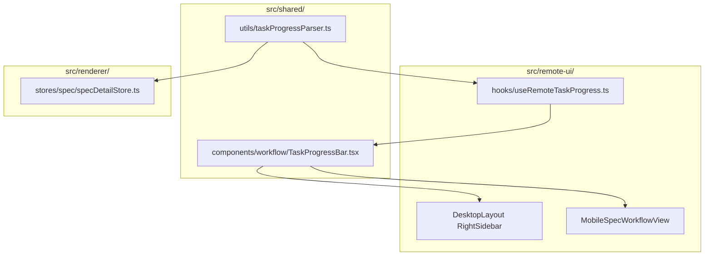
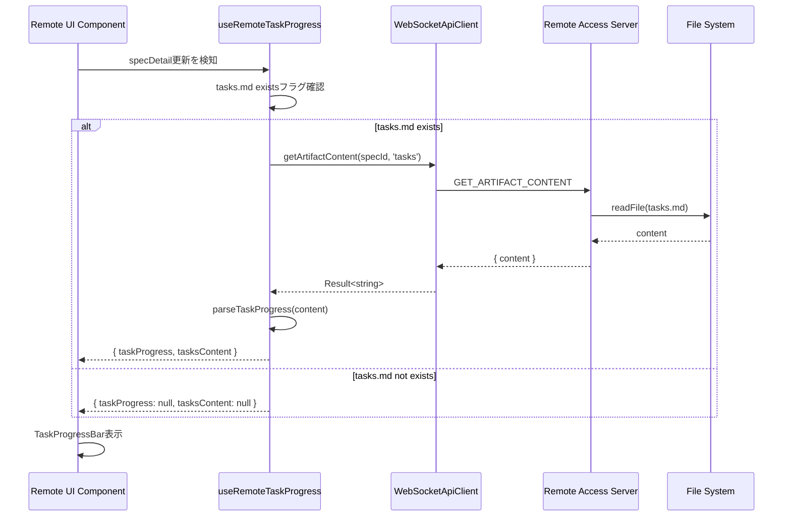

# Design Document: Remote UI Task Display

## Overview

**Purpose**: Remote UIユーザーがSpec実装のタスク進捗を確認できるようにする。Electron版と同等のタスク進捗バーおよびtasks.md内容表示機能をRemote UI（Web版）に実装する。

**Users**: Remote UIを使用するデスクトップブラウザおよびモバイルブラウザユーザー。リモートからSpec実装の進捗を確認するワークフローで使用する。

**Impact**: 既存のRemote UIコンポーネント（DesktopLayout、MobileLayout、useRemoteWorkflowState）を拡張し、Electron版で既に実装されているタスク進捗表示機能を追加する。

### Goals

- Remote UIでtasks.mdの内容からタスク進捗を計算・表示する
- Electron版と視覚的に一貫した進捗バー表示を提供する
- 既存のDRY原則に従い、タスク解析ロジックを共有モジュールに配置する

### Non-Goals

- tasks.mdの編集機能（Remote UIは閲覧専用）
- タスクの個別チェック/アンチェック操作
- タスク完了時の通知機能
- 並列タスク実行（parallelTaskInfo）の表示は本スコープ外（既存機能として別途存在）

## Architecture

### Existing Architecture Analysis

**現在のアーキテクチャパターン**:
- **ApiClient抽象化層**: `IpcApiClient`（Electron）と`WebSocketApiClient`（Remote UI）で通信を透過化
- **共有コンポーネント**: `src/shared/`でElectron版とRemote UI版で85%以上のコード共有
- **遅延読み込みパターン**: Remote UIでは`getArtifactContent` APIによる遅延読み込みが確立済み

**既存の統合ポイント**:
- `specDetailStore.ts`: Electron版でtasks.mdからtaskProgressを計算するロジックが存在
- `WorkflowViewCore.tsx`: `renderTaskProgress` propでタスク進捗表示を受け入れる設計済み
- `WebSocketApiClient.ts`: `getArtifactContent`メソッドが実装済み

**技術的制約**:
- Remote UIではspecDetailが頻繁に同期されるため、常にtasks.md全文を含めるとネットワーク負荷が増加する（要件決定事項）
- タスク解析ロジックの重複を避けるため、shared/に共通化が必要

### Architecture Pattern & Boundary Map



**Key Decisions**:
- 共有タスク解析ロジックを`src/shared/utils/taskProgressParser.ts`に配置（DRY原則）
- 進捗バーUIコンポーネントを`src/shared/components/workflow/TaskProgressBar.tsx`に配置
- Electron版specDetailStoreの解析ロジックを共通化後に参照するよう修正
- Remote UI用フック`useRemoteTaskProgress`で遅延読み込み＋解析を統合

**Steering Compliance**:
- DRY: タスク解析ロジックの重複を排除
- SSOT: specDetailStoreが既にSSOTとして機能、Remote UIは同パターンを踏襲
- 関心の分離: 解析ロジック、UI、状態管理を明確に分離

### Technology Stack

| Layer | Choice / Version | Role in Feature | Notes |
|-------|------------------|-----------------|-------|
| Frontend | React 19, TypeScript 5.8+ | コンポーネント実装 | 既存スタック |
| State Management | Zustand | Remote UI状態管理 | useRemoteTaskProgress hook |
| API | WebSocketApiClient | tasks.mdコンテンツ取得 | getArtifactContent使用 |

## System Flows

### タスク進捗取得・表示フロー



**Key Decisions**:
- specDetail更新時に自動でtasks.mdを再取得（リアルタイム同期）
- existsフラグがfalseからtrueに変わった場合も自動取得トリガー
- 取得エラー時は「タスクなし」状態として処理

## Requirements Traceability

| Criterion ID | Summary | Components | Implementation Approach |
|--------------|---------|------------|------------------------|
| 1.1 | tasks.mdパース（チェックボックス集計） | taskProgressParser.ts | 新規作成（shared/utils/） |
| 1.2 | taskProgress形式（total, completed, percentage） | taskProgressParser.ts | 新規作成、型定義は既存TaskProgress再利用 |
| 1.3 | 共有モジュール配置 | src/shared/utils/ | 新規作成 |
| 1.4 | 空/存在しない場合の処理 | taskProgressParser.ts | 新規作成（zero値返却） |
| 2.1 | specDetail更新時のexists確認 | useRemoteTaskProgress.ts | 新規作成（hooks/） |
| 2.2 | getArtifactContent API呼び出し | useRemoteTaskProgress.ts | 既存API使用 |
| 2.3 | 共有解析ロジック使用 | useRemoteTaskProgress.ts | taskProgressParser呼び出し |
| 2.4 | エラー時のフォールバック | useRemoteTaskProgress.ts | null状態として処理 |
| 3.1 | Desktop進捗バー表示 | TaskProgressBar.tsx, DesktopLayout統合 | 新規作成＋統合 |
| 3.2 | Desktop tasks.md展開表示 | TaskProgressBar.tsx | 新規作成（展開可能セクション） |
| 3.3 | Desktop「タスクなし」表示 | TaskProgressBar.tsx | 新規作成 |
| 3.4 | Electron版との視覚的一貫性 | TaskProgressBar.tsx | SpecDetail.tsxのスタイル踏襲 |
| 4.1 | Mobile進捗バー表示 | TaskProgressBar.tsx, MobileSpecWorkflowView統合 | 新規作成＋統合 |
| 4.2 | Mobile tasks.md展開表示 | TaskProgressBar.tsx | コンポーネント共有 |
| 4.3 | Mobile「タスクなし」表示 | TaskProgressBar.tsx | コンポーネント共有 |
| 4.4 | Mobileレイアウト対応 | TaskProgressBar.tsx | レスポンシブ対応（既存パターン踏襲） |
| 5.1 | WebSocket経由specDetail更新検知 | useRemoteTaskProgress.ts | initialSpecDetail prop監視 |
| 5.2 | exists false→true時の自動取得 | useRemoteTaskProgress.ts | useEffect依存配列で検知 |
| 5.3 | 既存コンテンツの再取得 | useRemoteTaskProgress.ts | specDetail更新時に再取得 |

### Coverage Validation Checklist

- [x] Every criterion ID from requirements.md appears in the table above
- [x] Each criterion has specific component names (not generic references)
- [x] Implementation approach distinguishes "reuse existing" vs "new implementation"
- [x] User-facing criteria specify concrete UI components (not just "shared components")

## Components and Interfaces

| Component | Domain/Layer | Intent | Req Coverage | Key Dependencies | Contracts |
|-----------|--------------|--------|--------------|-----------------|-----------|
| taskProgressParser | Shared/Utils | tasks.mdからTaskProgress計算 | 1.1, 1.2, 1.3, 1.4 | - | Service |
| useRemoteTaskProgress | RemoteUI/Hooks | 遅延読み込み＋解析統合 | 2.1, 2.2, 2.3, 2.4, 5.1, 5.2, 5.3 | WebSocketApiClient (P0) | State |
| TaskProgressBar | Shared/UI | 進捗バー＋展開表示 | 3.1-3.4, 4.1-4.4 | - | - |

### Shared / Utils

#### taskProgressParser

| Field | Detail |
|-------|--------|
| Intent | tasks.mdコンテンツからTaskProgressを計算する純粋関数 |
| Requirements | 1.1, 1.2, 1.3, 1.4 |

**Responsibilities & Constraints**
- Markdownチェックボックス（`- [x]`、`- [ ]`）のパース
- TaskProgress形式でtotal, completed, percentageを返却
- 空/null入力時は`{ total: 0, completed: 0, percentage: 0 }`を返却
- 副作用なし（純粋関数）

**Dependencies**
- なし（スタンドアロン関数）

**Contracts**: Service [x]

##### Service Interface

```typescript
/**
 * tasks.mdコンテンツからタスク進捗を計算
 * @param content - tasks.mdのMarkdownコンテンツ（null/undefinedの場合はzero値返却）
 * @returns TaskProgress形式の計算結果
 */
export function parseTaskProgress(content: string | null | undefined): TaskProgress;

export interface TaskProgress {
  /** 総タスク数 */
  total: number;
  /** 完了タスク数 */
  completed: number;
  /** 完了率（0-100） */
  percentage: number;
}
```

- Preconditions: なし（任意の入力を受け付ける）
- Postconditions: percentage = total > 0 ? Math.round((completed / total) * 100) : 0
- Invariants: total >= completed, 0 <= percentage <= 100

**Implementation Notes**
- 既存specDetailStore.tsの計算ロジックを抽出・共通化
- 正規表現パターン: `/^- \[x\]/gim`（完了）, `/^- \[ \]/gm`（未完了）

### Remote UI / Hooks

#### useRemoteTaskProgress

| Field | Detail |
|-------|--------|
| Intent | specDetail更新時にtasks.mdを遅延取得し、タスク進捗を計算するカスタムフック |
| Requirements | 2.1, 2.2, 2.3, 2.4, 5.1, 5.2, 5.3 |

**Responsibilities & Constraints**
- specDetailのtasks artifactのexistsフラグ監視
- 存在する場合はgetArtifactContentで遅延取得
- parseTaskProgressで進捗計算
- エラー時はnull状態として処理
- specDetail更新時に自動再取得

**Dependencies**
- Inbound: useRemoteWorkflowState — specDetail提供 (P0)
- Outbound: ApiClient.getArtifactContent — コンテンツ取得 (P0)
- Internal: taskProgressParser — 進捗計算 (P0)

**Contracts**: State [x]

##### State Management

```typescript
export interface UseRemoteTaskProgressConfig {
  /** API client instance */
  apiClient: ApiClient;
  /** Spec identifier */
  specId: string | null;
  /** Spec detail with artifacts info */
  specDetail: SpecDetail | null;
}

export interface TaskProgressState {
  /** 計算されたタスク進捗（null = タスクなし） */
  taskProgress: TaskProgress | null;
  /** tasks.mdのコンテンツ（展開表示用） */
  tasksContent: string | null;
  /** 読み込み中フラグ */
  isLoading: boolean;
  /** エラー状態 */
  error: string | null;
}

export function useRemoteTaskProgress(config: UseRemoteTaskProgressConfig): TaskProgressState;
```

- State model: React useState/useEffect によるローカル状態管理
- Persistence: なし（メモリ内のみ）
- Concurrency: specDetail更新時の前回リクエストキャンセル（AbortController）

**Implementation Notes**
- Integration: useRemoteWorkflowStateから呼び出し、またはコンポーネントで直接使用
- Validation: specDetail.artifacts.tasks.existsをboolean判定

### Shared / UI

#### TaskProgressBar

| Field | Detail |
|-------|--------|
| Intent | タスク進捗バーと展開可能なtasks.md表示を提供するUIコンポーネント |
| Requirements | 3.1, 3.2, 3.3, 3.4, 4.1, 4.2, 4.3, 4.4 |

**Responsibilities & Constraints**
- 進捗バー（完了数/総数、パーセンテージ）表示
- tasks.mdコンテンツの展開可能セクション
- 「タスクなし」状態のメッセージ表示
- Electron版SpecDetail.tsxと視覚的一貫性
- モバイル/デスクトップ両対応（レスポンシブ）

**Dependencies**
- Inbound: TaskProgressState — 表示データ (P0)
- External: @uiw/react-md-editor — Markdownレンダリング (P1)
- External: lucide-react — アイコン (P2)

**Contracts**: なし（純粋UIコンポーネント）

##### Service Interface

```typescript
export interface TaskProgressBarProps {
  /** タスク進捗データ（null時は「タスクなし」表示） */
  taskProgress: TaskProgress | null;
  /** tasks.mdコンテンツ（展開表示用、null時は展開不可） */
  tasksContent: string | null;
  /** 読み込み中表示 */
  isLoading?: boolean;
  /** テストID */
  testId?: string;
}

export function TaskProgressBar(props: TaskProgressBarProps): React.ReactElement;
```

- Preconditions: なし
- Postconditions: taskProgress === null時は「タスクなし」メッセージ表示
- Invariants: なし

**Implementation Notes**
- Styling: Electron版SpecDetail.tsxのタスク進捗セクションのスタイルを踏襲
- 展開状態: useState管理（デフォルト: 折りたたみ）
- Markdownレンダリング: MDEditor.Markdown使用（既存パターン）

## Data Models

### Domain Model

**既存型の再利用**:
- `TaskProgress`: `src/renderer/types/index.ts`で定義済み、shared/へ移動不要（既存インポートパスで参照可能）

```typescript
// 既存定義（renderer/types/index.ts）
export interface TaskProgress {
  total: number;
  completed: number;
  percentage: number;
}
```

**新規型**:
- なし（既存型で充足）

## Error Handling

### Error Strategy

| Error Type | Handling | User Feedback |
|------------|----------|---------------|
| tasks.md不存在 | taskProgress=null | 「タスクなし」メッセージ |
| API取得失敗 | taskProgress=null, error設定 | 「タスクなし」メッセージ |
| パース失敗 | zero値返却 | 進捗バー0%表示 |
| ネットワークエラー | リトライなし、error設定 | 「タスクなし」メッセージ |

### Monitoring

- console.error: API取得失敗時にログ出力
- isLoading状態: ユーザーへの読み込み中フィードバック

## Testing Strategy

### Unit Tests

1. **taskProgressParser**: 各種入力パターン（正常、空、null、不正形式）
2. **useRemoteTaskProgress**: 状態遷移（初期→読み込み→完了/エラー）
3. **TaskProgressBar**: 表示状態（進捗あり、なし、読み込み中）

### Integration Tests

1. **useRemoteTaskProgress + ApiClient**: モックAPIでの取得フロー
2. **specDetail更新時の自動再取得**: 状態変化の検証

### E2E/UI Tests

1. **Desktop進捗表示**: specDetail表示時の進捗バー確認
2. **Mobile進捗表示**: MobileSpecWorkflowViewでの進捗バー確認
3. **展開/折りたたみ**: tasks.mdコンテンツの展開動作

## Verification Contract

### User Journey Definition

| Journey ID | Operation Flow | Expected Result | E2E Required |
|------------|---------------|-----------------|--------------|
| UJ-001 | Remote UIでSpec選択 → tasks.md存在 → 進捗バー表示確認 | 進捗バーに完了数/総数、パーセンテージが表示される | Yes |
| UJ-002 | Remote UIでSpec選択 → tasks.md展開 → 内容確認 | tasks.mdのMarkdownコンテンツが展開表示される | Yes |
| UJ-003 | Remote UIでSpec選択 → tasks.md不存在 → 「タスクなし」表示確認 | 「タスクなし」メッセージが表示される | Yes |
| UJ-004 | tasks.md更新（Agent実行） → 進捗自動更新確認 | specDetail更新後に進捗バーが最新値に更新される | Yes |

### Impact Analysis Contract

| Target File | Action | Reason |
|-------------|--------|--------|
| src/shared/utils/taskProgressParser.ts | CREATE | タスク解析ロジック共通化 |
| src/shared/utils/index.ts | UPDATE | taskProgressParser export追加 |
| src/remote-ui/hooks/useRemoteTaskProgress.ts | CREATE | 遅延読み込み＋解析フック |
| src/remote-ui/hooks/index.ts | UPDATE | useRemoteTaskProgress export追加 |
| src/shared/components/workflow/TaskProgressBar.tsx | CREATE | 進捗バーUIコンポーネント |
| src/shared/components/workflow/index.ts | UPDATE | TaskProgressBar export追加 |
| src/renderer/stores/spec/specDetailStore.ts | UPDATE | parseTaskProgress共通関数呼び出しに変更 |
| src/remote-ui/views/MobileSpecWorkflowView.tsx | UPDATE | TaskProgressBar統合 |
| src/remote-ui/App.tsx | UPDATE | DesktopLayout RightSidebarにTaskProgressBar統合（WorkflowViewCore経由） |

## Integration Test Strategy

### Components
- useRemoteTaskProgress hook
- WebSocketApiClient.getArtifactContent
- taskProgressParser

### Data Flow
1. specDetail更新イベント受信
2. tasks.md existsフラグ判定
3. getArtifactContent API呼び出し
4. parseTaskProgress実行
5. 状態更新 → UI再レンダリング

### Mock Boundaries
- **Mock**: WebSocketApiClient（getArtifactContentをモック）
- **Real**: taskProgressParser、useRemoteTaskProgress hook

### Verification Points
- specDetail更新後にgetArtifactContentが呼び出されること
- parseTaskProgressの戻り値がstateに反映されること
- API エラー時にnull状態になること

### Robustness Strategy
- **waitFor patterns**: specDetail更新後の非同期取得完了を`waitFor`で待機
- **State transitions**: isLoading→完了/エラーの状態遷移を監視
- AbortController: 前回リクエストのキャンセルでrace conditionを防止

### Prerequisites
- 既存のRemote UI統合テストパターンを踏襲
- モックWebSocketApiClientの既存ヘルパーを使用

## Design Decisions

### DD-001: タスク解析ロジックの配置場所

| Field | Detail |
|-------|--------|
| Status | Accepted |
| Context | Electron版specDetailStoreにタスク解析ロジックが存在するが、Remote UIでも同じロジックが必要 |
| Decision | 共有モジュール`src/shared/utils/taskProgressParser.ts`に抽出 |
| Rationale | DRY原則に従い、同一ロジックの重複を避ける。両版で同じ計算結果を保証。 |
| Alternatives Considered | (1) Remote UI側で新規実装 → 重複、メンテコスト増 (2) specDetailStoreをsharedに移動 → 影響範囲大 |
| Consequences | Electron版specDetailStore.tsの修正が必要。しかし単純なimport変更のみ。 |

### DD-002: コンテンツ取得方式

| Field | Detail |
|-------|--------|
| Status | Accepted |
| Context | tasks.mdのコンテンツをどのタイミングで取得するか |
| Decision | getArtifactContentによる遅延読み込み |
| Rationale | 要件決定事項。specDetailは頻繁に同期されるため、常に全文を含めるとネットワーク負荷が増加。既存artifacts（requirements, design等）と同じパターン。 |
| Alternatives Considered | specDetail取得時に一括読み込み → ネットワーク負荷、同期頻度との相性が悪い |
| Consequences | 表示時に追加APIコール発生。ただしユーザー体験への影響は軽微（ローディング表示で対応）。 |

### DD-003: 進捗バーコンポーネントの配置

| Field | Detail |
|-------|--------|
| Status | Accepted |
| Context | Electron版SpecDetail.tsxの進捗バーセクションをRemote UIでも使用したい |
| Decision | 新規共有コンポーネント`TaskProgressBar.tsx`を`src/shared/components/workflow/`に作成 |
| Rationale | Electron版のインラインコードを抽出・共通化することで両版の視覚的一貫性を保証。将来的にElectron版も共通コンポーネントに移行可能。 |
| Alternatives Considered | (1) Remote UI専用コンポーネント → 視覚的不一致のリスク (2) Electron版のコードをコピー → DRY違反 |
| Consequences | 本機能実装後、Electron版SpecDetail.tsxのタスク進捗セクションもTaskProgressBarに置き換え可能（将来タスク）。 |

### DD-004: WorkflowViewCore統合方式

| Field | Detail |
|-------|--------|
| Status | Accepted |
| Context | WorkflowViewCoreにはrenderTaskProgress propが既に存在する |
| Decision | 既存のrenderTaskProgress prop経由でTaskProgressBarを描画 |
| Rationale | WorkflowViewCoreの設計思想（props駆動の共通UI）に沿った統合方式。新規propの追加不要。 |
| Alternatives Considered | WorkflowViewCore内部にTaskProgressBarを直接組み込み → 柔軟性低下 |
| Consequences | 呼び出し側（useRemoteWorkflowStateなど）でrenderTaskProgress関数を実装する必要がある。 |
