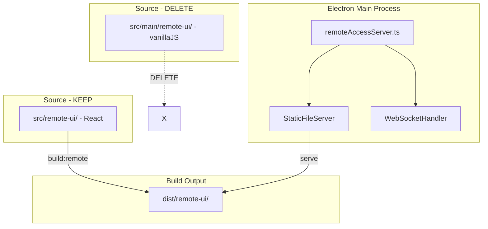
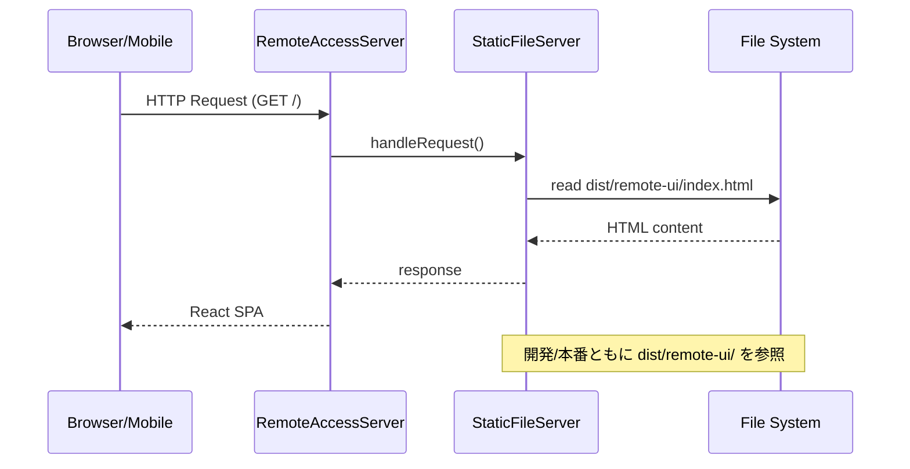

# Design: Remote UI Vanilla版削除

## Overview

**Purpose**: `remote-ui-react-migration` specで実装済みのReact版Remote UIへの完全移行を完了し、vanillaJS版の残存コードを削除することで、コードベースの一貫性と保守性を向上させる。

**Users**: Electronアプリ開発者、Remote UI利用者（モバイルデバイスからのアクセス）

**Impact**: `src/main/remote-ui/`ディレクトリの削除、`remoteAccessServer.ts`の配信元パス変更、ビルドパイプラインの整理。

### Goals
- React版Remote UIを本番配信元として確立
- vanillaJS版コードの完全削除による技術的負債の解消
- E2Eテストの互換性維持

### Non-Goals
- React版UIへの新機能追加
- レスポンシブデザインの改善
- 新しいWebSocketメッセージタイプの追加
- 新規E2Eテストの追加

## Architecture

### Existing Architecture Analysis

**現行の配信フロー**:
```
remoteAccessServer.ts
├── 開発モード: src/main/remote-ui/ (vanillaJS版)
└── 本番モード: dist/main/remote-ui/ (vite.config.tsでコピー)
```

**React版の配信フロー（移行後）**:
```
remoteAccessServer.ts
├── 開発モード: dist/remote-ui/ (build:remoteの出力)
└── 本番モード: dist/remote-ui/ (build:remoteの出力)
```

**現行のビルドパイプライン**:
1. `npm run build` → Electron本体ビルド + vanillaJS版を`dist/main/remote-ui/`にコピー
2. `npm run build:remote` → React版を`dist/remote-ui/`に生成（現在は使用されていない）

**移行後のビルドパイプライン**:
1. `npm run build` → Electron本体ビルド（vanillaJS版コピーなし）
2. `npm run build:remote` → React版を`dist/remote-ui/`に生成（本番配信用）

### Architecture Pattern & Boundary Map



**Architecture Integration**:
- Selected pattern: 静的ファイル配信サーバー（Express/StaticFileServer）
- Domain boundaries: Remote UI配信はremoteAccessServer.tsが責務を持つ
- Existing patterns preserved: WebSocket通信、アクセストークン認証
- New components rationale: なし（既存コンポーネントの修正のみ）
- Steering compliance: DRY（重複コード削除）、保守性向上

### Technology Stack

| Layer | Choice / Version | Role in Feature | Notes |
|-------|------------------|-----------------|-------|
| Frontend | React 19 + Vite 5 | Remote UI SPA | `src/remote-ui/`、`vite.config.remote.ts` |
| Backend | Node.js + Express | 静的ファイル配信 | `StaticFileServer.ts` |
| Build | Vite 5 | Remote UIビルド | `npm run build:remote` |
| Testing | Playwright + WebdriverIO | E2Eテスト | `e2e-wdio/remote-webserver.e2e.spec.ts` |

## System Flows

### 配信パス変更フロー



## Requirements Traceability

| Criterion ID | Summary | Components | Implementation Approach |
|--------------|---------|------------|------------------------|
| 1.1 | Remote UIサーバーがdist/remote-ui/から配信 | remoteAccessServer.ts, StaticFileServer | パス定数の修正 |
| 1.2 | 開発モードでReact版ビルド出力を参照 | remoteAccessServer.ts | 開発/本番パス統一 |
| 1.3 | ビルド出力が存在しない場合のエラー | StaticFileServer | 既存エラーハンドリング活用 |
| 2.1 | src/main/remote-ui/ディレクトリ削除 | - | ファイルシステム操作 |
| 2.2 | vanillaJS版への参照削除 | vite.config.ts | copyRemoteUIプラグイン削除 |
| 3.1 | npm run buildでdist/remote-ui/生成 | package.json | buildスクリプト修正 |
| 3.2 | パッケージングにReact版含める | electron-builder設定 | files/extraResources設定確認 |
| 4.1 | E2Eテスト全PASS | React版コンポーネント | data-testid属性追加 |
| 4.2 | React版にdata-testid不足時は追加 | SpecsView, BugsView, App.tsx等 | remote-プレフィックス付きdata-testid |
| 4.3 | テスト期待値の修正 | remote-webserver.e2e.spec.ts | 必要に応じて修正 |
| 4.4 | 判断困難時はエスカレーション | - | 手動判断 |

### Coverage Validation Checklist

- [x] Every criterion ID from requirements.md appears in the table above
- [x] Each criterion has specific component names (not generic references)
- [x] Implementation approach distinguishes "reuse existing" vs "new implementation"
- [x] User-facing criteria specify concrete UI components

## Components and Interfaces

| Component | Domain/Layer | Intent | Req Coverage | Key Dependencies | Contracts |
|-----------|--------------|--------|--------------|-----------------|-----------|
| RemoteAccessServer | Main/Server | Remote UI配信サーバー管理 | 1.1, 1.2, 1.3 | StaticFileServer (P0) | Service |
| vite.config.ts | Build | Electronビルド設定 | 2.2 | - | - |
| package.json | Build | ビルドスクリプト | 3.1, 3.2 | - | - |
| React Components | Remote UI | E2Eテスト互換性 | 4.1, 4.2 | - | - |

### Main Process

#### RemoteAccessServer

| Field | Detail |
|-------|--------|
| Intent | Remote UI静的ファイル配信とWebSocket接続管理 |
| Requirements | 1.1, 1.2, 1.3 |

**Responsibilities & Constraints**
- StaticFileServerへのUIディレクトリパス指定
- 開発/本番モードでの一貫したパス解決
- React版ビルド出力（`dist/remote-ui/`）の配信

**Dependencies**
- Inbound: IPC handlers - サーバー起動/停止 (P0)
- Outbound: StaticFileServer - 静的ファイル配信 (P0)
- External: express - HTTPサーバー (P0)

**Contracts**: Service [x]

##### Service Interface
```typescript
// 変更点: コンストラクタでのUIディレクトリパス決定ロジック
constructor(accessTokenService?: AccessTokenService, tunnelManager?: CloudflareTunnelManager) {
  // 変更前:
  // const isDev = process.env.NODE_ENV === 'development' || import.meta.env?.DEV;
  // const uiDir = isDev
  //   ? join(__dirname, '../../src/main/remote-ui')  // dev: vanillaJS
  //   : join(__dirname, 'remote-ui');                 // prod: dist/main/remote-ui

  // 変更後:
  // 開発/本番ともにReact版ビルド出力を使用
  const uiDir = join(__dirname, '../../dist/remote-ui');  // dist/remote-ui/

  this.staticFileServer = new StaticFileServer(uiDir);
}
```

**Implementation Notes**
- Integration: `__dirname`はdist/main/配下を指すため、相対パスで`../../dist/remote-ui`を指定
- Validation: ビルド出力の存在確認は既存のStaticFileServerエラーハンドリングで対応
- Risks: 開発時にbuild:remoteを事前実行する必要がある（HMRなし）

### Build Configuration

#### vite.config.ts

| Field | Detail |
|-------|--------|
| Intent | Electronアプリのビルド設定 |
| Requirements | 2.2 |

**Responsibilities & Constraints**
- vanillaJS版コピープラグイン（copyRemoteUI）の削除
- electron-builderへの影響確認

**Changes**
```typescript
// 削除: copyRemoteUI関数全体（line 11-42）
// 削除: plugins配列からcopyRemoteUI()呼び出し（line 62）
```

#### package.json

| Field | Detail |
|-------|--------|
| Intent | ビルドスクリプト定義 |
| Requirements | 3.1, 3.2 |

**Changes**
```json
{
  "scripts": {
    // 変更: buildスクリプトにbuild:remoteを追加
    "build": "tsc && vite build && npm run build:remote",
    // 既存: build:remote は変更なし
    "build:remote": "vite build --config vite.config.remote.ts"
  }
}
```

**Implementation Notes**
- Integration: `npm run build`実行時に自動的にReact版Remote UIがビルドされる
- Validation: electron-builderの`files`設定で`dist/**/*`が含まれることを確認済み

### Remote UI Components

#### E2Eテスト互換性のためのdata-testid追加

| Field | Detail |
|-------|--------|
| Intent | E2Eテストとの互換性確保 |
| Requirements | 4.1, 4.2 |

**E2Eテストで使用されるdata-testid一覧**:

| E2E testid | 現在のReact版 | 対応コンポーネント | 対応方法 |
|------------|---------------|-------------------|----------|
| remote-status-dot | なし | App.tsx/Header | 新規追加 |
| remote-status-text | なし | App.tsx/Header | 新規追加 |
| remote-project-path | なし | App.tsx/Header | 新規追加 |
| remote-app-version | なし | App.tsx/Header | 新規追加 |
| remote-spec-list | specs-list | SpecsView.tsx | リネーム |
| remote-spec-item-{name} | なし | SpecsView.tsx | 新規追加 |
| remote-spec-detail | spec-detail-view | SpecDetailView.tsx | リネーム |
| remote-spec-phase-tag | なし | SpecDetailView.tsx | 新規追加 |
| remote-spec-next-action | なし | SpecDetailView.tsx | 新規追加 |
| remote-tab-specs | なし | MobileLayout.tsx | 新規追加 |
| remote-tab-bugs | なし | MobileLayout.tsx | 新規追加 |
| remote-bug-list | bugs-list | BugsView.tsx | リネーム |
| remote-bug-item-{name} | なし | BugsView.tsx | 新規追加 |
| remote-bug-detail | bug-detail-view | BugDetailView.tsx | リネーム |
| remote-bug-phase-tag | bug-phase-{action} | BugDetailView.tsx | リネーム |
| remote-bug-action | bug-phase-{action}-button | BugDetailView.tsx | リネーム |
| remote-log-viewer | agent-log-panel | AgentView.tsx | リネーム |
| remote-reconnect-overlay | reconnect-overlay | ReconnectOverlay.tsx | リネーム |

**Implementation Notes**
- Integration: 既存のdata-testidと新しいremote-プレフィックス付きを併存させることも可能
- Risks: data-testidの変更は他のテストに影響しないよう慎重に行う

## Data Models

該当なし（データモデルの変更なし）

## Error Handling

### Error Strategy

既存のStaticFileServerのエラーハンドリングを活用:
- ファイル不在: 404 Not Found
- サーバーエラー: 500 Internal Server Error

### Monitoring

既存のlogger出力を継続使用:
```typescript
logger.debug(`[remoteAccessServer] Using UI directory: ${uiDir}`);
```

## Testing Strategy

### Unit Tests
- `remoteAccessServer.test.ts`: UIディレクトリパス解決のテスト更新
- `vite.config.remote.test.ts`: React版ビルド設定テスト（既存）

### Integration Tests
- `remoteAccessIntegration.test.ts`: サーバー起動・静的ファイル配信テスト

### E2E Tests
- `remote-webserver.e2e.spec.ts`: 全テストケースがPASSすることを確認
  - サーバー基本動作（起動/停止）
  - モバイルUI接続（WebSocket確立）
  - Bugsワークフロー（タブ切り替え）
  - Specsワークフロー（一覧表示、詳細表示）
  - WebSocket再接続

## Design Decisions

### DD-001: 配信パスの統一化

| Field | Detail |
|-------|--------|
| Status | Accepted |
| Context | 現行はvanillaJS版を開発モードではsrc/main/remote-ui/から、本番モードではdist/main/remote-ui/から配信している。React版移行後は配信元をどうするか。 |
| Decision | 開発/本番ともに`dist/remote-ui/`（React版ビルド出力）を配信元とする。 |
| Rationale | 1) 開発/本番で同一コードが動作することで再現性が向上、2) HMRは諦めるがReact版の安定性を優先、3) Viteの高速ビルドにより開発体験への影響は限定的 |
| Alternatives Considered | A) 開発時はVite devサーバーをプロキシ: 複雑性増加、B) 開発時のみvanillaJS版維持: 技術的負債継続 |
| Consequences | 開発時にbuild:remoteを事前実行する必要がある。`npm run dev:remote`での開発フローは維持。 |

### DD-002: data-testidの命名規則

| Field | Detail |
|-------|--------|
| Status | Accepted |
| Context | E2Eテストはvanillajs版のdata-testid（`remote-`プレフィックス付き）を使用している。React版は異なる命名を使用している。 |
| Decision | React版コンポーネントにE2Eテストと互換性のある`remote-`プレフィックス付きdata-testidを追加する。 |
| Rationale | 1) E2Eテストの大幅な修正を避ける、2) Remote UI固有のテストIDとして意味が明確、3) 既存のdata-testidとの併存も可能 |
| Alternatives Considered | A) E2Eテスト側をReact版のdata-testidに合わせて修正: テスト変更量が大きい、B) data-testidを使用しないセレクタに変更: 脆弱性増加 |
| Consequences | React版コンポーネントに複数のdata-testidが存在する可能性があるが、テストの安定性を優先。 |

### DD-003: ビルドパイプラインの統合

| Field | Detail |
|-------|--------|
| Status | Accepted |
| Context | 現行は`npm run build`と`npm run build:remote`が独立している。本番ビルドでReact版が確実に含まれる必要がある。 |
| Decision | `npm run build`スクリプトに`npm run build:remote`を追加し、単一コマンドで完全なビルドが行えるようにする。 |
| Rationale | 1) CI/CDパイプラインの簡素化、2) ビルド漏れ防止、3) 開発者の認知負荷軽減 |
| Alternatives Considered | A) electron-builderのbeforeBuildフックを使用: 設定の複雑化、B) 別々のビルドを維持: ビルド漏れリスク |
| Consequences | ビルド時間が若干増加するが、確実性を優先。 |

### DD-004: vanillaJS版ファイルの完全削除

| Field | Detail |
|-------|--------|
| Status | Accepted |
| Context | `src/main/remote-ui/`に残存するvanillaJS版コード（7ファイル）の扱い。 |
| Decision | ディレクトリごと完全削除する。 |
| Rationale | 1) 混乱の原因を排除、2) 保守コスト削減、3) コードベースの一貫性、4) Gitヒストリーで復元可能 |
| Alternatives Considered | A) 参考用に残す: 混乱の原因継続、B) 別リポジトリにアーカイブ: 過剰な対応 |
| Consequences | なし（React版で全機能カバー済み）。 |

## Supporting References

### 削除対象ファイル一覧

```
src/main/remote-ui/
├── index.html          # エントリーポイント
├── styles.css          # スタイルシート
├── app.js              # メインアプリケーション
├── components.js       # UIコンポーネント
├── websocket.js        # WebSocket通信
├── logFormatter.js     # ログフォーマット
└── remote-ui.test.ts   # テストファイル
```

### E2Eテストファイル

- `e2e-wdio/remote-webserver.e2e.spec.ts`: Remote UIの包括的E2Eテスト
