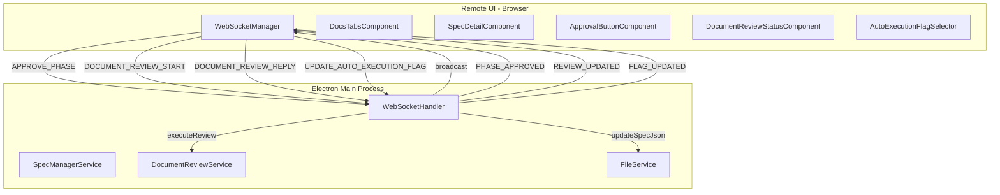
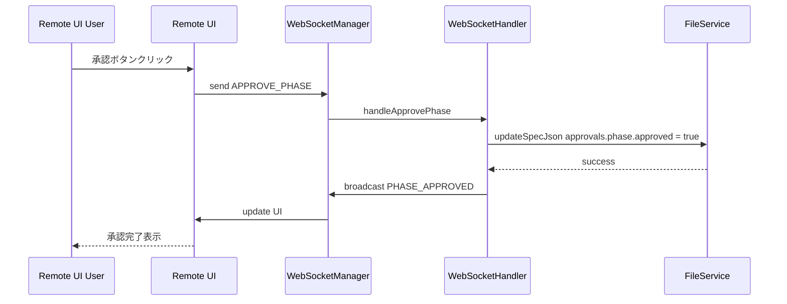
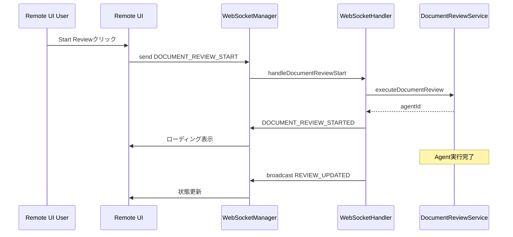

# Technical Design Document

## Overview

**Purpose**: Remote UIにおけるワークフロー機能を強化し、リモートからでもDesktop UIと同等のSDDワークフロー操作を可能にする。

**Users**: リモートユーザー（ブラウザ経由でRemote UIにアクセスする開発者）が、デスクトップアプリを開かずにワークフローを進行できる。

**Impact**: 既存のRemote UIアーキテクチャ（WebSocketHandler、remote-ui/components.js）を拡張し、フェーズ承認機能とDocument Review操作機能を追加する。

### Goals

- Remote UIからrequirements/design/tasksの生成済みドキュメントを承認可能にする
- 前フェーズ未承認時の次フェーズ実行をブロックし、ワークフローの整合性を保つ
- Document Reviewの状態表示と操作（開始、Reply、Fix）をRemote UIから実行可能にする
- autoExecutionFlagの制御（skip/run/pause）をRemote UIから変更可能にする
- Desktop UIでの操作結果をRemote UIにリアルタイムで反映する

### Non-Goals

- Desktop UIの変更（本仕様はRemote UI専用）
- 新しいワークフローフェーズの追加
- SSH接続機能の変更

## Architecture

### Existing Architecture Analysis

Remote UIは以下の構成で動作している：

- **remoteAccessServer.ts**: Express静的サーバー + WebSocketサーバー
- **webSocketHandler.ts**: WebSocket経由のIPC-like通信、メッセージルーティング
- **remote-ui/**: 独立したJavaScriptアプリ（components.js, websocket.js, app.js）

現在の制約：
- フェーズ承認機能が欠落（EXECUTE_PHASEのみ実装）
- Document Review操作が限定的（EXECUTE_DOCUMENT_REVIEWのみ、Reply/Fixなし）
- autoExecutionFlag変更のWebSocketハンドラが未実装

### Architecture Pattern & Boundary Map



**Architecture Integration**:
- Selected pattern: 既存のWebSocketメッセージングパターンを拡張
- Domain/feature boundaries: WebSocketHandler（通信層）、各Service（ビジネスロジック層）、Remote UI（プレゼンテーション層）
- Existing patterns preserved: メッセージタイプベースのルーティング、ブロードキャスト通知
- New components rationale: 新しいUIコンポーネント（ApprovalButton, DocumentReviewStatus, FlagSelector）はDesktop UI相当機能のRemote UI移植
- Steering compliance: TypeScript strict mode、Zod検証パターンに準拠

### Technology Stack

| Layer | Choice / Version | Role in Feature | Notes |
|-------|------------------|-----------------|-------|
| Frontend | JavaScript (Vanilla) | Remote UIコンポーネント | 既存のcomponents.jsに追加 |
| Backend | TypeScript / Node.js | WebSocketハンドラ、サービス | webSocketHandler.ts拡張 |
| Data | JSON (spec.json) | Spec状態永続化 | FileService経由 |
| Messaging | WebSocket (ws) | リアルタイム双方向通信 | 既存パターン |

## System Flows

### フェーズ承認フロー



### Document Review操作フロー



## Requirements Traceability

| Requirement | Summary | Components | Interfaces | Flows |
|-------------|---------|------------|------------|-------|
| 1.1 | 承認ボタン表示 | ApprovalButtonComponent | - | - |
| 1.2 | WebSocket approvePhase送信 | WebSocketManager | send() | - |
| 1.3 | approvePhaseハンドラ | WebSocketHandler | handleApprovePhase() | フェーズ承認フロー |
| 1.4 | 未生成時ボタン非活性 | ApprovalButtonComponent | - | - |
| 1.5 | ローディング表示 | ApprovalButtonComponent | - | - |
| 1.6 | 承認完了後UI更新 | SpecDetailComponent | - | - |
| 2.1 | 次フェーズボタン非活性 | SpecDetailComponent | updateNextActionButton() | - |
| 2.2 | getNextPhase nullリターン | SpecDetailComponent | getNextPhase() | - |
| 2.3 | ツールチップ表示 | SpecDetailComponent | - | - |
| 2.4 | 自動実行一時停止表示 | SpecDetailComponent | - | - |
| 3.1 | DocumentReviewStatus表示 | DocumentReviewStatusComponent | - | - |
| 3.2 | ラウンド番号表示 | DocumentReviewStatusComponent | - | - |
| 3.3 | レビュー中バッジ | DocumentReviewStatusComponent | - | - |
| 3.4 | 回答待ちステータス強調 | DocumentReviewStatusComponent | - | - |
| 3.5 | 完了ステータス表示 | DocumentReviewStatusComponent | - | - |
| 4.1 | Start Reviewボタン | DocumentReviewStatusComponent | - | - |
| 4.2 | document-reviewリクエスト送信 | WebSocketManager | executeDocumentReview() | Document Review操作フロー |
| 4.3 | document-reviewハンドラ | WebSocketHandler | handleDocumentReviewStart() | - |
| 4.4 | ローディング表示 | DocumentReviewStatusComponent | - | - |
| 4.5 | ボタン非活性条件 | DocumentReviewStatusComponent | - | - |
| 5.1 | Reply/Fixボタン表示 | DocumentReviewStatusComponent | - | - |
| 5.2 | document-review-reply送信 | WebSocketManager | executeDocumentReviewReply() | - |
| 5.3 | document-review-reply --autofix送信 | WebSocketManager | executeDocumentReviewFix() | - |
| 5.4 | replyハンドラ | WebSocketHandler | handleDocumentReviewReply() | - |
| 5.5 | ローディング表示 | DocumentReviewStatusComponent | - | - |
| 5.6 | Reply/Fix完了後UI更新 | DocumentReviewStatusComponent | - | - |
| 6.1 | autoExecutionFlagセレクタ | AutoExecutionFlagSelector | - | - |
| 6.2 | 3オプション提供 | AutoExecutionFlagSelector | - | - |
| 6.3 | updateAutoExecutionFlag送信 | WebSocketManager | updateAutoExecutionFlag() | - |
| 6.4 | updateAutoExecutionFlagハンドラ | WebSocketHandler | handleUpdateAutoExecutionFlag() | - |
| 6.5 | skipラベル表示 | AutoExecutionFlagSelector | - | - |
| 6.6 | runラベル表示 | AutoExecutionFlagSelector | - | - |
| 6.7 | pauseラベル表示 | AutoExecutionFlagSelector | - | - |
| 7.1 | approvePhasaメッセージ処理 | WebSocketHandler | handleApprovePhase() | - |
| 7.2 | documentReviewStartメッセージ処理 | WebSocketHandler | handleDocumentReviewStart() | - |
| 7.3 | documentReviewReplyメッセージ処理 | WebSocketHandler | handleDocumentReviewReply() | - |
| 7.4 | updateAutoExecutionFlagメッセージ処理 | WebSocketHandler | handleUpdateAutoExecutionFlag() | - |
| 7.5 | 成功/失敗レスポンス | WebSocketHandler | send() | - |
| 7.6 | エラー詳細送信 | WebSocketHandler | send() | - |
| 8.1 | phaseApprovedブロードキャスト | WebSocketHandler | broadcastPhaseApproved() | - |
| 8.2 | reviewUpdatedブロードキャスト | WebSocketHandler | broadcastReviewUpdated() | - |
| 8.3 | flagUpdatedブロードキャスト | WebSocketHandler | broadcastFlagUpdated() | - |
| 8.4 | ブロードキャスト受信時UI更新 | Remote UI全般 | on() event handlers | - |
| 8.5 | 接続切断状態表示 | ReconnectOverlay | - | - |

## Components and Interfaces

### Summary Table

| Component | Domain/Layer | Intent | Req Coverage | Key Dependencies | Contracts |
|-----------|--------------|--------|--------------|------------------|-----------|
| WebSocketHandler | Backend/Communication | WebSocketメッセージルーティング | 7.1-7.6 | FileService (P0), WorkflowController (P0) | Service |
| ApprovalButtonComponent | Frontend/UI | フェーズ承認ボタン表示 | 1.1, 1.4, 1.5, 1.6 | WebSocketManager (P0) | - |
| DocumentReviewStatusComponent | Frontend/UI | Document Review状態表示と操作 | 3.1-3.5, 4.1, 4.4, 4.5, 5.1, 5.5, 5.6 | WebSocketManager (P0) | - |
| AutoExecutionFlagSelector | Frontend/UI | autoExecutionFlag選択UI | 6.1-6.7 | WebSocketManager (P0) | - |
| SpecDetailComponent (拡張) | Frontend/UI | Spec詳細表示と操作 | 2.1-2.4 | ApprovalButtonComponent (P1) | - |
| WebSocketManager (拡張) | Frontend/Communication | WebSocket通信管理 | 1.2, 4.2, 5.2, 5.3, 6.3 | - | Service |

### Backend / Communication Layer

#### WebSocketHandler (拡張)

| Field | Detail |
|-------|--------|
| Intent | Remote UIからの新しいリクエスト（承認、Document Review関連）を処理 |
| Requirements | 7.1, 7.2, 7.3, 7.4, 7.5, 7.6, 7.7, 8.1, 8.2, 8.3 |

**Responsibilities & Constraints**
- 新しい5つのメッセージタイプをルーティング
- spec.jsonの更新をFileService経由で実行
- 状態変更をブロードキャストで全クライアントに通知
- エラー時は詳細メッセージをクライアントに返却

**Dependencies**
- Inbound: Remote UI WebSocket接続 (P0)
- Outbound: FileService — spec.json更新 (P0)
- Outbound: WorkflowController — ドキュメントレビュー実行 (P0)

**Contracts**: Service [x]

##### Service Interface

```typescript
// 新しいメッセージタイプ
type ApprovePhaseMessage = {
  type: 'APPROVE_PHASE';
  payload: {
    specId: string;
    phase: 'requirements' | 'design' | 'tasks';
  };
  requestId?: string;
  timestamp: number;
};

type DocumentReviewStartMessage = {
  type: 'DOCUMENT_REVIEW_START';
  payload: {
    specId: string;
  };
  requestId?: string;
  timestamp: number;
};

type DocumentReviewReplyMessage = {
  type: 'DOCUMENT_REVIEW_REPLY';
  payload: {
    specId: string;
    roundNumber: number;
    autofix?: boolean;
  };
  requestId?: string;
  timestamp: number;
};

type UpdateAutoExecutionFlagMessage = {
  type: 'UPDATE_AUTO_EXECUTION_FLAG';
  payload: {
    specId: string;
    flag: 'skip' | 'run' | 'pause';
  };
  requestId?: string;
  timestamp: number;
};

// 新しいハンドラメソッド
interface WebSocketHandlerExtension {
  handleApprovePhase(client: ClientInfo, message: ApprovePhaseMessage): Promise<void>;
  handleDocumentReviewStart(client: ClientInfo, message: DocumentReviewStartMessage): Promise<void>;
  handleDocumentReviewReply(client: ClientInfo, message: DocumentReviewReplyMessage): Promise<void>;
  handleUpdateAutoExecutionFlag(client: ClientInfo, message: UpdateAutoExecutionFlagMessage): Promise<void>;

  // ブロードキャストメソッド
  broadcastPhaseApproved(specId: string, phase: string): void;
  broadcastReviewUpdated(specId: string, reviewState: DocumentReviewState): void;
  broadcastFlagUpdated(specId: string, flag: DocumentReviewFlag): void;
}
```

- Preconditions: WebSocket接続が確立されていること
- Postconditions: spec.jsonが更新され、ブロードキャストが送信される
- Invariants: メッセージは必ず応答（成功/失敗）を返す

**Implementation Notes**
- Integration: routeMessage()に新しいcaseを追加
- Validation: specIdとphaseの存在チェック、フェーズ状態の検証
- Risks: 同時更新時の競合（FileServiceのアトミック書き込みに依存）

### Frontend / UI Layer

#### ApprovalButtonComponent

| Field | Detail |
|-------|--------|
| Intent | 生成済みフェーズの承認ボタンを表示し、承認操作を実行 |
| Requirements | 1.1, 1.4, 1.5, 1.6 |

**Responsibilities & Constraints**
- generatedステータスのフェーズに対して承認ボタンを表示
- 未生成フェーズではボタンを非活性化
- 承認処理中はローディングインジケータを表示
- 承認完了後、親コンポーネントに通知

**Dependencies**
- Outbound: WebSocketManager — APPROVE_PHASE送信 (P0)
- Inbound: SpecDetailComponent — spec状態 (P0)

**Contracts**: State [x]

##### State Management

```javascript
/**
 * ApprovalButton状態
 */
const approvalButtonState = {
  phase: 'requirements' | 'design' | 'tasks',
  isApproving: boolean,
  isGenerated: boolean,
  isApproved: boolean
};
```

**Implementation Notes**
- Integration: SpecDetailComponentのshow()メソッド内で呼び出し
- Validation: spec.approvals[phase].generatedがtrueの場合のみボタン活性化

#### DocumentReviewStatusComponent

| Field | Detail |
|-------|--------|
| Intent | Document Reviewの現在状態を表示し、操作ボタンを提供 |
| Requirements | 3.1-3.5, 4.1, 4.4, 4.5, 5.1, 5.5, 5.6 |

**Responsibilities & Constraints**
- 現在のレビューラウンド数と状態を表示
- ステータスバッジ（レビュー中、回答待ち、完了）を表示
- Start Review、Reply、Fixボタンを適切な条件で表示
- 操作中はローディング表示とボタン非活性化

**Dependencies**
- Outbound: WebSocketManager — DOCUMENT_REVIEW_*, 送信 (P0)
- Inbound: SpecDetailComponent — reviewState (P0)

**Contracts**: State [x]

##### State Management

```javascript
/**
 * DocumentReviewStatus状態
 */
const reviewStatusState = {
  rounds: number,
  status: 'pending' | 'in_progress' | 'approved' | 'skipped',
  currentRound: number | null,
  roundDetails: Array<{
    roundNumber: number,
    status: 'review_complete' | 'reply_complete' | 'incomplete'
  }>,
  isExecuting: boolean
};
```

**Implementation Notes**
- Integration: SpecDetailComponentのワークフローセクション内に配置
- Validation: tasks.mdが存在する場合のみStart Reviewを有効化

#### AutoExecutionFlagSelector

| Field | Detail |
|-------|--------|
| Intent | Document Reviewの自動実行フラグを選択するUI |
| Requirements | 6.1-6.7 |

**Responsibilities & Constraints**
- skip/run/pauseの3つのオプションを提供
- 現在の選択状態を視覚的に表示
- 選択変更時にWebSocket経由でサーバーに通知

**Dependencies**
- Outbound: WebSocketManager — UPDATE_AUTO_EXECUTION_FLAG送信 (P0)
- Inbound: SpecDetailComponent — autoExecutionFlag (P0)

**Contracts**: State [x]

##### State Management

```javascript
/**
 * AutoExecutionFlagSelector状態
 */
const flagSelectorState = {
  currentFlag: 'skip' | 'run' | 'pause',
  isUpdating: boolean
};

const flagLabels = {
  skip: 'スキップ',
  run: '自動実行',
  pause: '一時停止'
};
```

**Implementation Notes**
- Integration: DocumentReviewStatusComponentのヘッダー部分に配置（Desktop UI同様）
- Validation: 値変更時は即座にWebSocket送信

#### SpecDetailComponent (拡張)

| Field | Detail |
|-------|--------|
| Intent | Spec詳細表示に承認ボタンと次フェーズブロック機能を追加 |
| Requirements | 2.1-2.4 |

**Responsibilities & Constraints**
- getNextPhase()を拡張して未承認フェーズをnull返却
- 次フェーズボタンを前フェーズ未承認時にdisabled
- ツールチップで「前フェーズの承認が必要です」を表示
- 自動実行モードでの承認待ち状態を表示

**Dependencies**
- Inbound: spec — Spec状態 (P0)
- Outbound: ApprovalButtonComponent — 承認UI表示 (P1)

**Contracts**: State [x]

##### State Management

```javascript
/**
 * 拡張されたgetNextPhase
 * 前フェーズが未承認の場合はnullを返す
 */
getNextPhase(spec) {
  const phaseStatus = this.getPhaseStatusFromSpec(spec);

  // 現在のフェーズがgeneratedだが未承認の場合、次フェーズに進めない
  if (phaseStatus.requirements === 'generated') {
    return null; // 承認が必要
  }

  // 既存のロジック...
}
```

**Implementation Notes**
- Integration: 既存のgetNextPhase()メソッドを修正
- Validation: approvals.{phase}.approvedのチェックを追加

#### WebSocketManager (拡張)

| Field | Detail |
|-------|--------|
| Intent | 新しいメッセージタイプの送信メソッドを追加 |
| Requirements | 1.2, 4.2, 5.2, 5.3, 6.3 |

**Responsibilities & Constraints**
- 新しい送信メソッドを追加（approvePhase, executeDocumentReviewReply, updateAutoExecutionFlag）
- 既存のsend()メソッドを利用
- イベントハンドラで新しいブロードキャストを処理

**Dependencies**
- Outbound: WebSocket接続 (P0)

**Contracts**: Service [x]

##### Service Interface

```javascript
class WebSocketManager {
  // 既存メソッド
  send(message);
  executeDocumentReview(specId);

  // 新規メソッド
  approvePhase(specId, phase) {
    return this.send({
      type: 'APPROVE_PHASE',
      payload: { specId, phase }
    });
  }

  executeDocumentReviewReply(specId, roundNumber, autofix = false) {
    return this.send({
      type: 'DOCUMENT_REVIEW_REPLY',
      payload: { specId, roundNumber, autofix }
    });
  }

  updateAutoExecutionFlag(specId, flag) {
    return this.send({
      type: 'UPDATE_AUTO_EXECUTION_FLAG',
      payload: { specId, flag }
    });
  }
}
```

**Implementation Notes**
- Integration: websocket.jsに新しいメソッドを追加
- Validation: specIdとphase/flag値の存在チェック

## Data Models

### Domain Model

#### DocumentReviewState

既存の型定義を継承（`renderer/types/documentReview.ts`）:

```typescript
interface DocumentReviewState {
  rounds: number;
  status: 'pending' | 'in_progress' | 'approved' | 'skipped';
  currentRound?: number;
  roundDetails?: RoundDetail[];
}

interface RoundDetail {
  roundNumber: number;
  reviewCompletedAt?: string;
  replyCompletedAt?: string;
  status: 'review_complete' | 'reply_complete' | 'incomplete';
  fixApplied?: boolean;
}
```

#### AutoExecutionState (拡張)

既存の型定義を参照（`renderer/types/index.ts`）:

```typescript
interface SpecAutoExecutionState {
  enabled: boolean;
  permissions: AutoExecutionPermissions;
  documentReviewFlag: 'skip' | 'run' | 'pause';
  validationOptions: ValidationOptions;
}
```

### Logical Data Model

**spec.json構造（関連フィールド）**:

```json
{
  "feature_name": "string",
  "phase": "SpecPhase",
  "approvals": {
    "requirements": { "generated": "boolean", "approved": "boolean" },
    "design": { "generated": "boolean", "approved": "boolean" },
    "tasks": { "generated": "boolean", "approved": "boolean" }
  },
  "documentReview": {
    "rounds": "number",
    "status": "ReviewStatus",
    "currentRound": "number | undefined",
    "roundDetails": "RoundDetail[] | undefined"
  },
  "autoExecution": {
    "enabled": "boolean",
    "permissions": { ... },
    "documentReviewFlag": "'skip' | 'run' | 'pause'",
    "validationOptions": { ... }
  }
}
```

## Error Handling

### Error Strategy

WebSocketハンドラは全てのエラーをクライアントに通知する。ERROR応答には以下の情報を含む：

- `code`: エラー種別識別子
- `message`: 人間可読なエラーメッセージ
- `requestId`: リクエスト相関ID（存在する場合）

### Error Categories and Responses

**User Errors (クライアント起因)**:
- `INVALID_PAYLOAD`: specId/phase等の必須フィールド欠落
- `PRECONDITION_FAILED`: フェーズ未生成での承認試行、前フェーズ未承認での次フェーズ実行

**System Errors (サーバー起因)**:
- `NO_CONTROLLER`: WorkflowControllerが未設定
- `FILE_ERROR`: spec.jsonの読み書きエラー
- `AGENT_ERROR`: Document Reviewエージェント実行エラー

**Business Logic Errors**:
- `NOT_SUPPORTED`: 要求された機能がWorkflowControllerでサポートされていない
- `ALREADY_APPROVED`: 既に承認済みのフェーズを再承認

### Monitoring

- 全てのエラーはloggerを通じてプロジェクトログに記録
- Remote UI側ではToastコンポーネントでエラーを表示

## Testing Strategy

### Unit Tests

- WebSocketHandler新規メソッドのモックテスト（handleApprovePhase, handleDocumentReviewStart等）
- getNextPhase()の承認チェックロジックテスト
- Remote UIコンポーネントの状態管理テスト

### Integration Tests

- WebSocket経由でのフェーズ承認フロー（送信→処理→ブロードキャスト→UI更新）
- Document Review操作フロー（Start→Reply→Fix）
- autoExecutionFlag変更とUI反映

### E2E/UI Tests

- Remote UIからのフェーズ承認操作
- 前フェーズ未承認時の次フェーズボタン非活性確認
- Document Reviewパネルの状態遷移確認
- Desktop UI操作後のRemote UI自動更新確認

### Performance

- WebSocketブロードキャストの遅延測定（目標: 100ms以内）
- 多数クライアント接続時のブロードキャスト負荷テスト
