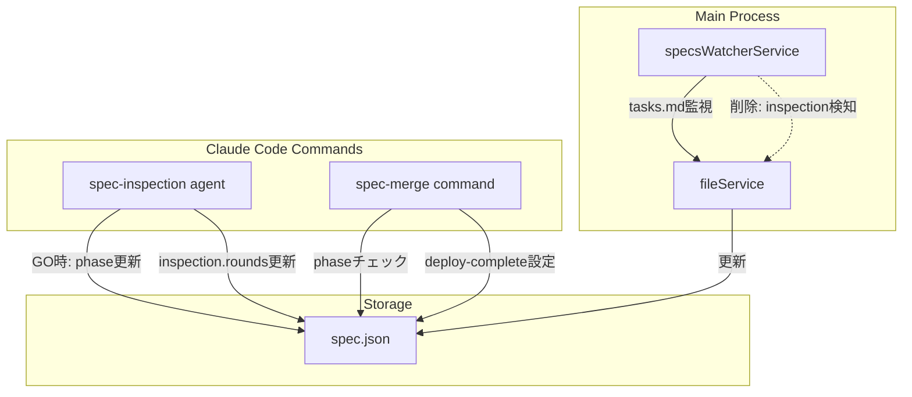
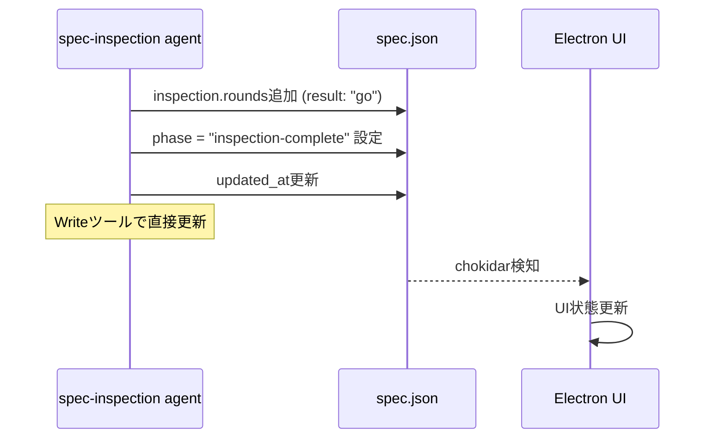
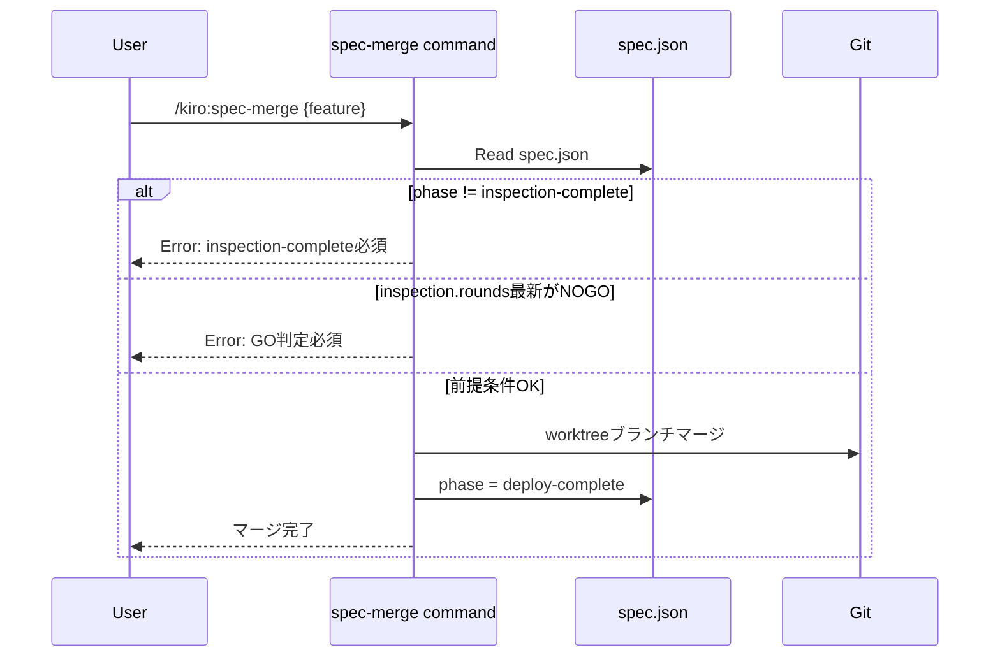

# Design: Remove Inspection Phase Auto-Update

## Overview

**Purpose**: specsWatcherServiceによるinspection-complete phase自動更新を削除し、spec-inspectionコマンドが明示的にphaseを更新するように責務を移行する。これにより、spec-mergeとの競合状態（race condition）を解消し、phase更新の予測可能性を向上させる。

**Users**: SDD Orchestratorを使用する開発者。inspection後のspec-merge実行時にphaseが意図せず上書きされる問題を解消する。

**Impact**: specsWatcherServiceから`checkInspectionCompletion`メソッドを削除し、spec-inspectionエージェントにphase更新責務を追加する。spec-mergeにはinspection-complete前提条件チェックを追加する。

### Goals

- inspection-complete phaseへの自動更新を削除し、競合状態を解消する
- spec-inspectionがGO判定時に明示的にphaseを更新するように変更する
- spec-mergeがinspection-complete状態を前提条件としてチェックするように変更する
- implementation-complete自動更新は維持し、変更範囲を最小化する

### Non-Goals

- implementation-complete自動更新の削除（別specで対応予定）
- deploy-complete自動更新の実装（元々未実装）
- spec-phase-auto-update specの完全なロールバック
- Remote UIのphase表示ロジックの変更

## Architecture

### Existing Architecture Analysis

現在のアーキテクチャでは、specsWatcherServiceがspec.jsonの変更を監視し、inspection結果に基づいてphaseを自動更新している。これによりspec-mergeがdeploy-completeを設定した直後にinspection-completeで上書きされる競合が発生している。

**現在の問題のあるフロー**:
```
spec-inspection → inspection.rounds更新 → specsWatcherService検知 → inspection-complete設定
                                          ↓
spec-merge → deploy-complete設定 → specsWatcherServiceが上書き
```

**修正後のフロー**:
```
spec-inspection → inspection.rounds更新 + phase更新(GO時) → inspection-complete
                                                              ↓
spec-merge → inspection-completeチェック → deploy-complete設定
```

### Architecture Pattern & Boundary Map



**Architecture Integration**:
- **Selected pattern**: Command Responsibility - 各コマンドが自身の責務範囲でphaseを更新
- **Domain boundaries**: specsWatcherServiceはファイル監視とtask完了検出に特化、phase更新はコマンド側に移行
- **Existing patterns preserved**: chokidar監視、IPC通信、Agent実行フロー
- **New components rationale**: 新規コンポーネントなし、既存コンポーネントの責務調整のみ
- **Steering compliance**: DRY（重複するphase更新ロジック削除）、SSOT（phase更新元を単一化）

### Technology Stack

| Layer | Choice / Version | Role in Feature | Notes |
|-------|------------------|-----------------|-------|
| Backend / Services | TypeScript 5.8+ | specsWatcherService修正 | 既存スタック維持 |
| Agent | Claude Code Agent | spec-inspection, spec-merge | Markdownベースのエージェント定義 |
| Testing | Vitest | ユニットテスト | 既存テストフレームワーク |

## System Flows

### GO判定時のPhase更新フロー



### spec-merge実行フロー



## Requirements Traceability

| Criterion ID | Summary | Components | Implementation Approach |
|--------------|---------|------------|------------------------|
| 1.1 | inspection更新時にphase自動更新しない | specsWatcherService | 既存checkInspectionCompletion呼び出し削除 |
| 1.2 | updateSpecJsonFromPhase呼び出し削除 | specsWatcherService | handleEvent内の条件分岐削除 |
| 1.3 | checkInspectionCompletion削除 | specsWatcherService | privateメソッド完全削除 |
| 1.4 | 手動更新のファイル監視維持 | specsWatcherService | chokidar監視は維持（既存動作） |
| 2.1 | GO判定時にphase更新 | spec-inspection agent | Step 6後にphase更新ステップ追加 |
| 2.2 | NOGO時はphase更新しない | spec-inspection agent | 条件分岐で制御 |
| 2.3 | Agent実行完了前にphase更新 | spec-inspection agent | Step 6でphase更新実行 |
| 2.4 | updated_at同時更新 | spec-inspection agent | Writeツールで両フィールド更新 |
| 2.5 | 既存inspection/deploy-complete維持 | spec-inspection agent | 条件チェックで既存phase維持 |
| 3.1 | spec.json.phase読み取り | spec-merge command | Step 1にphaseチェック追加 |
| 3.2 | inspection-complete以外でエラー | spec-merge command | エラーメッセージと中断処理 |
| 3.3 | 最新roundがNOGO時エラー | spec-merge command | inspection.rounds検証追加 |
| 3.4 | 検証通過後deploy-complete | spec-merge command | 既存動作維持 |
| 4.1 | task完了でimpl-complete更新 | specsWatcherService | checkTaskCompletion維持（変更なし） |
| 4.2 | checkTaskCompletion維持 | specsWatcherService | 削除対象外 |
| 4.3 | impl-complete動作同一 | specsWatcherService | テストで検証 |
| 5.1 | .kiro/specs/監視継続 | specsWatcherService | 既存動作維持 |
| 5.2 | 300ms以内の変更検知 | specsWatcherService | debounce設定維持 |
| 5.3 | phase変更時のイベント発行 | specsWatcherService | callback呼び出し維持 |
| 5.4 | chokidar設定維持 | specsWatcherService | 設定変更なし |
| 6.1 | checkInspectionCompletionテスト削除 | specsWatcherService.test.ts | 該当テストケース削除 |
| 6.2 | inspection-complete自動更新テスト削除 | specsWatcherService.test.ts | 該当テストケース削除 |
| 6.3 | impl-completeテスト維持 | specsWatcherService.test.ts | 変更なし |
| 6.4 | inspection-complete自動更新テスト追加禁止 | - | コードレビューで確認 |
| 7.1 | GO判定でphase更新テスト | spec-inspection tests | 新規テスト追加 |
| 7.2 | NOGO判定でphase維持テスト | spec-inspection tests | 新規テスト追加 |
| 7.3 | updated_at更新テスト | spec-inspection tests | 新規テスト追加 |
| 7.4 | 既存phase維持テスト | spec-inspection tests | 新規テスト追加 |

### Coverage Validation Checklist

- [x] Every criterion ID from requirements.md appears in the table above
- [x] Each criterion has specific component names (not generic references)
- [x] Implementation approach distinguishes "reuse existing" vs "new implementation"
- [x] User-facing criteria specify concrete UI components (not just "shared components")

## Components and Interfaces

| Component | Domain/Layer | Intent | Req Coverage | Key Dependencies | Contracts |
|-----------|--------------|--------|--------------|------------------|-----------|
| SpecsWatcherService | Main/Services | ファイル監視とtask完了検出 | 1.1-1.4, 4.1-4.3, 5.1-5.4 | chokidar, fileService | Service |
| spec-inspection agent | Commands | 実装検査とGO/NOGO判定 | 2.1-2.5, 7.1-7.4 | Write, Read tools | Agent |
| spec-merge command | Commands | worktreeブランチマージ | 3.1-3.4 | Bash, Read, Write tools | Command |

### Main Process / Services

#### SpecsWatcherService

| Field | Detail |
|-------|--------|
| Intent | .kiro/specs/ディレクトリの監視とtask完了検出（inspection検出は削除） |
| Requirements | 1.1-1.4, 4.1-4.3, 5.1-5.4 |

**Responsibilities & Constraints**
- spec.json, tasks.md等のファイル変更監視
- task完了時のimplementation-complete phase自動更新（維持）
- **inspection完了時のphase自動更新は削除**
- chokidarによるファイル監視とdebounce処理

**Dependencies**
- Inbound: handlers.ts - watcher開始/停止 (P0)
- Outbound: fileService - spec.json更新 (P0)
- External: chokidar - ファイル監視 (P0)

**Contracts**: Service [x]

##### Service Interface

```typescript
// 削除するメソッド
// private checkInspectionCompletion(specJsonPath: string, specId: string): Promise<void>

// 削除するhandleEvent内のコード
// if ((type === 'change' || type === 'add') && fileName === 'spec.json' && specId) {
//   this.checkInspectionCompletion(filePath, specId)...  ← この行を削除
// }
```

- Preconditions: fileServiceが注入されていること
- Postconditions: inspection関連のphase自動更新が実行されないこと
- Invariants: task完了検出（checkTaskCompletion）は維持

**Implementation Notes**
- Integration: handleEventメソッドからcheckInspectionCompletion呼び出しを削除
- Validation: 削除後もcheckDeployCompletion（worktreeフィールド削除）は維持
- Risks: 既存のimplementation-complete検出に影響がないことを確認

### Commands / Agents

#### spec-inspection agent

| Field | Detail |
|-------|--------|
| Intent | 実装検査を実行し、GO判定時にspec.json.phaseを更新 |
| Requirements | 2.1-2.5, 7.1-7.4 |

**Responsibilities & Constraints**
- 既存の検査カテゴリ実行（RequirementsChecker, DesignChecker等）
- GO/NOGO判定とレポート生成
- **新規**: GO判定時のspec.json.phase更新

**Dependencies**
- Inbound: ユーザー実行, auto-execution - inspection実行要求 (P0)
- Outbound: spec.json - Write tool経由で更新 (P0)

**Contracts**: Agent [x]

##### Agent Execution Contract

**Step 6拡張（既存Step 6の後に追加）**:

```markdown
### 6.5. Update Phase to inspection-complete (GO判定時のみ)

**条件**: GO判定 AND 現在のphaseがinspection-complete/deploy-complete以外

**実行手順**:
1. spec.jsonを読み込み
2. 以下のフィールドを更新:
   - `phase`: `"inspection-complete"`
   - `updated_at`: 現在のUTCタイムスタンプ（ISO 8601形式）
3. Writeツールでspec.jsonを保存

**スキップ条件**:
- NOGO判定の場合
- phaseが既にinspection-complete以降の場合

**エラーハンドリング**:
- Write失敗時はログに記録し、ユーザーに手動更新を案内
```

**Implementation Notes**
- Integration: 既存Step 6（spec.json更新）の後に条件付きphase更新を追加
- Validation: GO判定時のみphase更新、NOGO時はスキップ
- Risks: Writeツール失敗時のフォールバックが必要

#### spec-merge command

| Field | Detail |
|-------|--------|
| Intent | worktreeブランチのマージ前にinspection-complete状態を検証 |
| Requirements | 3.1-3.4 |

**Responsibilities & Constraints**
- worktreeブランチのsquashマージ実行
- worktreeディレクトリのクリーンアップ
- **新規**: inspection-complete前提条件チェック

**Dependencies**
- Inbound: ユーザー実行 - merge要求 (P0)
- Outbound: spec.json - Read/Write (P0), Git - Bash経由 (P0)

**Contracts**: Command [x]

##### Command Execution Contract

**Step 1.5追加（Step 1とStep 2の間）**:

```markdown
### Step 1.5: Validate Inspection Completion

1. Read `spec.json` from worktree: `${WORKTREE_ABSOLUTE_PATH}/.kiro/specs/$1/spec.json`
2. Check `phase` field:
   - If phase is NOT `inspection-complete`, abort with error:
     ```
     Error: spec-mergeはinspection-complete状態のspecのみマージ可能です。
     現在のphase: {phase}

     Next Steps:
     - Run `/kiro:spec-inspection {feature}` to inspect the implementation
     - Ensure inspection result is GO
     ```
3. Check `inspection.rounds`:
   - Get the latest round (last element in array)
   - If `result` is NOT `"go"`, abort with error:
     ```
     Error: Inspection GO判定が必要です。
     最新のInspection結果: {result}

     Next Steps:
     - Run `/kiro:spec-inspection {feature}` to re-inspect
     - Or run `/kiro:spec-inspection {feature} --fix` to fix issues
     ```
4. If both checks pass, proceed to Step 2.
```

**Implementation Notes**
- Integration: Step 1（Prerequisites）の後、Step 2（Prepare Worktree）の前に挿入
- Validation: phase検証とinspection.rounds検証の両方が必要
- Risks: worktreeのspec.jsonを読む必要がある（mainではない）

## Data Models

### Domain Model

**spec.json phase遷移（変更なし）**:
```
initialized → requirements-generated → design-generated → tasks-generated
    → implementation-complete → inspection-complete → deploy-complete
```

**責務の変更**:
| Phase | Before | After |
|-------|--------|-------|
| implementation-complete | specsWatcherService（自動） | specsWatcherService（自動） - 変更なし |
| inspection-complete | specsWatcherService（自動） | spec-inspection agent（明示的） |
| deploy-complete | spec-merge command | spec-merge command - 変更なし |

### Data Contracts & Integration

**spec.json inspection構造（変更なし）**:
```typescript
interface InspectionState {
  rounds: InspectionRound[];
}

interface InspectionRound {
  number: number;
  result: 'go' | 'nogo';
  inspectedAt: string;  // ISO 8601
  fixedAt?: string;     // ISO 8601, optional
}
```

## Error Handling

### Error Strategy

各コンポーネントでのエラー処理方針。

### Error Categories and Responses

**spec-inspection agent**:
| Error | Severity | Response |
|-------|----------|----------|
| spec.json読み取り失敗 | Critical | 検査中断、ユーザーに報告 |
| phase更新失敗（Write失敗） | Major | ログ記録、手動更新案内 |
| 既にdeploy-complete | Info | phase更新スキップ、正常終了 |

**spec-merge command**:
| Error | Severity | Response |
|-------|----------|----------|
| phase != inspection-complete | Critical | マージ中断、エラーメッセージ表示 |
| inspection result != go | Critical | マージ中断、エラーメッセージ表示 |
| spec.json読み取り失敗 | Critical | マージ中断、ファイルパス確認案内 |

## Testing Strategy

### Unit Tests

**specsWatcherService.test.ts**:
- 削除: `checkInspectionCompletion`の動作検証テスト
- 削除: inspection-complete自動更新のテスト
- 維持: `checkTaskCompletion`のテスト
- 維持: debounce動作のテスト
- 追加: inspection関連コード削除後の回帰テスト

### Integration Tests

**spec-inspection統合テスト**:
- GO判定時にspec.json.phaseがinspection-completeに更新される
- NOGO判定時にspec.json.phaseが変更されない
- 既存のinspection-completeまたはdeploy-completeの場合、phaseが変更されない
- phase更新時にupdated_atも更新される

**spec-merge統合テスト**:
- inspection-complete以外のphaseでエラーが発生する
- inspection.rounds最新がnogoの場合エラーが発生する
- 前提条件を満たす場合、マージが正常に実行される

### E2E Tests

E2Eテストは既存のワークフローテストで間接的にカバー。新規E2Eテストは不要。

## Design Decisions

### DD-001: inspection-complete自動更新の削除範囲

| Field | Detail |
|-------|--------|
| Status | Accepted |
| Context | specsWatcherServiceには3種類の自動更新がある: (1) implementation-complete, (2) inspection-complete, (3) deploy-complete worktreeフィールド削除。今回の問題はspec-mergeとの競合状態で、inspection-completeのみが原因。 |
| Decision | inspection-complete自動更新のみを削除し、他は維持する |
| Rationale | 変更範囲を最小化し、段階的な責務移行を可能にする。implementation-completeは問題を起こしていないため維持。 |
| Alternatives Considered | (A) 全自動更新削除 - 変更範囲が大きすぎる、(C) 条件付き削除 - 複雑性が増す |
| Consequences | implementation-complete自動更新は別specで対応が必要。短期的には混在状態となる。 |

### DD-002: Phase更新の責務配置

| Field | Detail |
|-------|--------|
| Status | Accepted |
| Context | inspection-complete phaseの更新責務をどこに配置するか。選択肢: (A) specsWatcherService維持, (B) spec-inspection agent, (C) UIコンポーネント |
| Decision | spec-inspection agentがGO判定時にspec.jsonを直接更新する |
| Rationale | (1) Git履歴に残る, (2) 競合状態を回避, (3) 予測可能性向上, (4) 既存のspec.json更新パターン（Step 6）との一貫性 |
| Alternatives Considered | (A) specsWatcherService維持 - 競合状態が解消されない, (C) UIコンポーネント - ElectronプロセスとAgentプロセスの分離に反する |
| Consequences | spec-inspection agentの責務が増加。Writeツールによる直接更新が必要。 |

### DD-003: spec-mergeの前提条件チェック

| Field | Detail |
|-------|--------|
| Status | Accepted |
| Context | spec-mergeがdeploy-completeに更新する前に、正しいphase順序を保証する必要がある。 |
| Decision | spec-mergeはworktreeのspec.jsonからphaseとinspection.roundsを検証し、inspection-complete AND 最新roundがGOの場合のみマージを許可する |
| Rationale | (1) Phase遷移のInvariant維持, (2) inspection未完了でのマージを防止, (3) 明示的なエラーメッセージでユーザーガイダンス |
| Alternatives Considered | (A) phaseチェックのみ - inspection結果の検証が不十分, (B) チェックなし - Invariant違反のリスク |
| Consequences | spec-merge実行前にspec-inspectionが必須となる。ワークフローの明確化。 |

### DD-004: spec-inspectionでのspec.json更新方法

| Field | Detail |
|-------|--------|
| Status | Accepted |
| Context | spec-inspection agentからspec.jsonを更新する方法。選択肢: (A) Writeツール直接, (B) IPC経由, (C) MCPツール |
| Decision | Writeツールで直接spec.jsonを更新する |
| Rationale | (1) 既存のStep 6でWriteツールを使用済み, (2) 追加のインフラ不要, (3) Agentの自己完結性維持, (4) Git履歴に明示的に残る |
| Alternatives Considered | (B) IPC経由 - Agentプロセスからの通信が複雑, (C) MCPツール - オーバーエンジニアリング |
| Consequences | phase更新とinspection.rounds更新が同一Writeで実行可能。既存パターンとの一貫性維持。 |

### DD-005: エラーハンドリング戦略

| Field | Detail |
|-------|--------|
| Status | Accepted |
| Context | phase更新失敗時の対処方針。 |
| Decision | ログに記録し、ユーザーに手動更新を案内する。検査結果（inspection-*.md）は保存されているため、phase更新のみが失敗した状態からの復旧が可能。 |
| Rationale | (1) 検査作業の損失を防ぐ, (2) 手動復旧が容易, (3) 過度なリトライによる複雑性回避 |
| Alternatives Considered | (A) 自動リトライ - 無限ループのリスク, (B) 検査全体の失敗 - 作業損失が大きい |
| Consequences | ユーザーが稀に手動でspec.jsonを編集する必要がある可能性。 |
