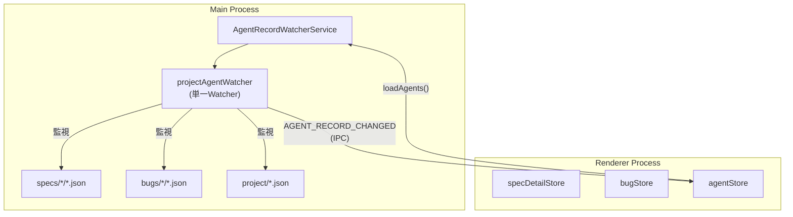
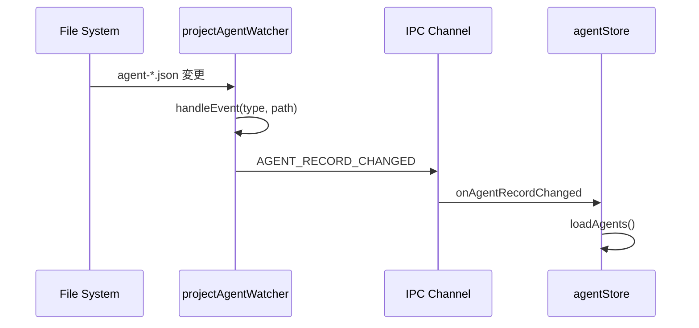

# Design Document: 冗長な Agent Watcher の削除

## Overview

**Purpose**: `AgentRecordWatcherService` から冗長な `specWatcher` と `bugWatcher` を削除し、関連する IPC チャネル `switchAgentWatchScope` を完全に除去することで、コードベースをシンプル化する。

**Users**: メンテナー（開発者）がこの変更により、理解・保守しやすいコードベースを得る。

**Impact**: `projectAgentWatcher` が全カテゴリ（specs/\*/\*.json, bugs/\*/\*.json, project/\*.json）を `ignoreInitial: false` で監視しているため、specWatcher/bugWatcher の責務は完全にカバーされている。削除によりアーキテクチャがシンプルになり、将来の変更が容易になる。

### Goals

- specWatcher と bugWatcher の完全削除
- SWITCH_AGENT_WATCH_SCOPE IPC チャネルの完全削除
- 関連する API メソッド（switchAgentWatchScope）の削除
- 呼び出し箇所（specDetailStore、bugStore）からの削除
- テストコードの更新・削除
- 既存機能（SpecList Agent 数バッジ）への影響なし

### Non-Goals

- `projectAgentWatcher` の名前変更
- `SpecsWatcherService` / `BugsWatcherService`（Artifact 監視）への変更
- Agent メタデータのマイグレーション機能の追加
- `determineCategory()` のリファクタリング

## Architecture

### Existing Architecture Analysis

現在のアーキテクチャは3つの Watcher を持つ：

```
AgentRecordWatcherService
├── _projectAgentWatcher (全カテゴリ監視: specs/*/*.json, bugs/*/*.json, project/*.json)
├── _specWatcher (冗長: switchWatchScope で動的に設定)
└── _bugWatcher (冗長: switchWatchScopeWithCategory で動的に設定)
```

`projectAgentWatcher` が `ignoreInitial: false` で全カテゴリを監視しているため、specWatcher と bugWatcher は実質的に使用されていない。

### Architecture Pattern & Boundary Map

変更後のアーキテクチャ：



**Key Decisions**:
- 単一 Watcher（projectAgentWatcher）で全カテゴリを監視
- switchWatchScope の完全削除によりコード複雑性を低減
- 既存の AGENT_RECORD_CHANGED イベントフローは維持

## System Flows

### Agent Record 変更検知フロー（変更後）



**Key Decisions**:
- switchWatchScope 呼び出しが不要になり、Spec/Bug 選択時の IPC 往復が削減される
- projectAgentWatcher が全カテゴリを監視するため、Spec 選択前後で監視範囲が変わらない

## Requirements Traceability

| Criterion ID | Summary | Components | Implementation Approach |
|--------------|---------|------------|------------------------|
| 1.1 | _specWatcher インスタンス作成なし | AgentRecordWatcherService | プロパティ削除 |
| 1.2 | _bugWatcher インスタンス作成なし | AgentRecordWatcherService | プロパティ削除 |
| 1.3 | _projectAgentWatcher のみ依存 | AgentRecordWatcherService | 既存維持 |
| 1.4 | _specWatcher プロパティ削除 | AgentRecordWatcherService | プロパティ削除 |
| 1.5 | _bugWatcher プロパティ削除 | AgentRecordWatcherService | プロパティ削除 |
| 1.6 | _currentSpecId プロパティ削除 | AgentRecordWatcherService | プロパティ削除 |
| 1.7 | _currentCategory プロパティ削除 | AgentRecordWatcherService | プロパティ削除 |
| 1.8 | _currentEntityId プロパティ削除 | AgentRecordWatcherService | プロパティ削除 |
| 1.9 | switchWatchScope() メソッド削除 | AgentRecordWatcherService | メソッド削除 |
| 1.10 | switchWatchScopeWithCategory() メソッド削除 | AgentRecordWatcherService | メソッド削除 |
| 1.11 | getWatchScope() メソッド削除 | AgentRecordWatcherService | メソッド削除 |
| 1.12 | specWatcher getter 削除 | AgentRecordWatcherService | getter 削除 |
| 1.13 | bugWatcher getter 削除 | AgentRecordWatcherService | getter 削除 |
| 1.14 | currentSpecId getter 削除 | AgentRecordWatcherService | getter 削除 |
| 2.1 | SWITCH_AGENT_WATCH_SCOPE ハンドラ削除 | agentHandlers.ts | ハンドラ削除 |
| 2.2 | IPC_CHANNELS.SWITCH_AGENT_WATCH_SCOPE 削除 | channels.ts | 定数削除 |
| 2.3 | window.electronAPI.switchAgentWatchScope 削除 | electron.d.ts | 型削除 |
| 3.1 | ApiClient.switchAgentWatchScope 削除 | types.ts | インターフェース削除 |
| 3.2 | IpcApiClient.switchAgentWatchScope 削除 | IpcApiClient.ts | メソッド削除 |
| 3.3 | WebSocketApiClient.switchAgentWatchScope 削除 | WebSocketApiClient.ts | メソッド削除 |
| 4.1 | specDetailStore.selectSpec() 呼び出し削除 | specDetailStore.ts | 呼び出し削除 |
| 4.2 | specDetailStore.clearSelectedSpec() 呼び出し削除 | specDetailStore.ts | 呼び出し削除 |
| 4.3 | bugStore.selectBug() 呼び出し削除 | bugStore.ts | 呼び出し削除 |
| 5.1 | preload switchAgentWatchScope 削除 | preload/index.ts | 関数削除 |
| 6.1 | switchWatchScope テスト削除 | agentRecordWatcherService.test.ts | テスト削除 |
| 6.2 | switchWatchScopeWithCategory テスト削除 | agentRecordWatcherService.test.ts | テスト削除 |
| 6.3 | switchAgentWatchScope mock 削除 | 各テストファイル | mock 削除 |
| 6.4 | E2E テスト通過 | E2E テスト | 検証 |
| 7.1 | specWatcher 残骸なし | 全ファイル | grep 検証 |
| 7.2 | bugWatcher 残骸なし | 全ファイル | grep 検証 |
| 7.3 | switchWatchScope 残骸なし | 全ファイル | grep 検証 |
| 7.4 | SWITCH_AGENT_WATCH_SCOPE 残骸なし | 全ファイル | grep 検証 |
| 7.5 | _projectAgentWatcher のみ残存 | AgentRecordWatcherService | 検証 |
| 8.1 | Agent 開始時バッジ更新 | SpecList | E2E 検証 |
| 8.2 | Agent 停止時バッジ更新 | SpecList | E2E 検証 |
| 8.3 | runningAgentCounts 正常動作 | agentStore | E2E 検証 |
| 8.4 | Agent 操作 E2E テスト通過 | E2E テスト | 検証 |

### Coverage Validation Checklist

- [x] Every criterion ID from requirements.md appears in the table above
- [x] Each criterion has specific component names (not generic references)
- [x] Implementation approach distinguishes "reuse existing" vs "new implementation"
- [x] User-facing criteria specify concrete UI components

## Components and Interfaces

| Component | Domain/Layer | Intent | Req Coverage | Key Dependencies | Contracts |
|-----------|--------------|--------|--------------|------------------|-----------|
| AgentRecordWatcherService | Main/Services | Agent ファイル監視 | 1.1-1.14 | chokidar (P0) | Service |
| agentHandlers.ts | Main/IPC | IPC ハンドラ | 2.1 | ipcMain (P0) | - |
| channels.ts | Main/IPC | IPC チャネル定義 | 2.2 | - | - |
| electron.d.ts | Renderer/Types | Electron API 型定義 | 2.3 | - | - |
| types.ts | Shared/API | ApiClient 型定義 | 3.1 | - | - |
| IpcApiClient.ts | Shared/API | IPC API クライアント | 3.2 | preload (P0) | Service |
| WebSocketApiClient.ts | Shared/API | WebSocket API クライアント | 3.3 | WebSocket (P0) | Service |
| specDetailStore.ts | Renderer/Stores | Spec 詳細ストア | 4.1, 4.2 | ApiClient (P0) | State |
| bugStore.ts | Shared/Stores | Bug ストア | 4.3 | ApiClient (P0) | State |
| preload/index.ts | Preload | IPC ブリッジ | 5.1 | ipcRenderer (P0) | - |

### Main/Services

#### AgentRecordWatcherService (Deletion)

| Field | Detail |
|-------|--------|
| Intent | 冗長なプロパティ・メソッドの削除 |
| Requirements | 1.1-1.14 |

**Responsibilities & Constraints**
- 削除対象プロパティ: `_specWatcher`, `_bugWatcher`, `_currentSpecId`, `_currentCategory`, `_currentEntityId`
- 削除対象メソッド: `switchWatchScope()`, `switchWatchScopeWithCategory()`, `getWatchScope()`, `getWatchScopeWithCategory()`
- 削除対象 getter: `specWatcher`, `bugWatcher`, `currentSpecId`
- 維持するもの: `_projectAgentWatcher`, `projectAgentWatcher` getter, `start()`, `stop()`, `onChange()`, `handleEvent()`, `extractIds()`

**Contracts**: Service [x]

##### Service Interface

```typescript
interface AgentRecordWatcherService {
  // 維持
  readonly projectAgentWatcher: chokidar.FSWatcher | null;

  start(): void;
  stop(): Promise<void>;
  onChange(callback: AgentRecordChangeCallback): void;
  clearCallbacks(): void;
  isRunning(): boolean;

  // 削除: specWatcher, bugWatcher, currentSpecId
  // 削除: switchWatchScope(), switchWatchScopeWithCategory(), getWatchScope(), getWatchScopeWithCategory()
}
```

- Preconditions: start() 前は projectAgentWatcher が null
- Postconditions: stop() 後は projectAgentWatcher が null、コールバックがクリア
- Invariants: projectAgentWatcher が唯一の Watcher インスタンス

### Shared/API

#### ApiClient Interface (Deletion)

| Field | Detail |
|-------|--------|
| Intent | switchAgentWatchScope メソッドの削除 |
| Requirements | 3.1 |

**Implementation Notes**
- `switchAgentWatchScope(specId: string): Promise<Result<void, ApiError>>` を削除
- IpcApiClient と WebSocketApiClient の両方から削除

### Renderer/Stores

#### specDetailStore.ts (Modification)

| Field | Detail |
|-------|--------|
| Intent | switchAgentWatchScope 呼び出しの削除 |
| Requirements | 4.1, 4.2 |

**Implementation Notes**
- `selectSpec()` 内の `window.electronAPI.switchAgentWatchScope(spec.name)` 削除
- `clearSelectedSpec()` 内の `window.electronAPI.switchAgentWatchScope(null)` 削除
- 関連する timing 計測コード削除

#### bugStore.ts (Modification)

| Field | Detail |
|-------|--------|
| Intent | switchAgentWatchScope 呼び出しの削除 |
| Requirements | 4.3 |

**Implementation Notes**
- `selectBug()` 内の `await apiClient.switchAgentWatchScope(\`bug:${bugId}\`)` 削除

## Testing Strategy

### Unit Tests

削除対象テスト（agentRecordWatcherService.test.ts）:
- `Task 1.2: switchWatchScope method` describe ブロック全体
- `switchWatchScopeWithCategory (Task 4.2)` describe ブロック全体
- `getWatchScopeWithCategory` describe ブロック全体
- specWatcher/bugWatcher 関連のアサーション

### Integration Tests

Mock 更新対象テストファイル:
- `bugStore.test.ts`: `switchAgentWatchScope` mock 削除
- `gitViewStore.test.ts`: `switchAgentWatchScope` mock 削除
- `GitView.test.tsx`: `switchAgentWatchScope` mock 削除
- `GitView.integration.test.tsx`: `switchAgentWatchScope` mock 削除
- `GitFileTree.test.tsx`: `switchAgentWatchScope` mock 削除
- `IpcApiClient.test.ts`: `switchAgentWatchScope` テスト削除
- `WebSocketApiClient.test.ts`: `switchAgentWatchScope` テスト削除
- `types.test.ts`: `switchAgentWatchScope` テスト削除

### E2E Tests

既存 E2E テストが引き続き通過することを確認:
- Agent 操作関連テスト
- SpecList Agent 数バッジ表示テスト

## Design Decisions

### DD-001: specWatcher/bugWatcher の完全削除

| Field | Detail |
|-------|--------|
| Status | Accepted |
| Context | `projectAgentWatcher` が全カテゴリ（specs/\*, bugs/\*, project/）を監視しているため、specWatcher と bugWatcher は冗長。 |
| Decision | specWatcher と bugWatcher を完全に削除し、projectAgentWatcher のみを使用する。 |
| Rationale | コードの簡素化、保守性向上、混乱防止。YAGNI 原則に従う。 |
| Alternatives Considered | 1) 維持して将来の拡張に備える → 使用されていないコードは負債になる |
| Consequences | IPC チャネル、API メソッド、呼び出し箇所、テストの連鎖的な削除が必要。 |

### DD-002: SWITCH_AGENT_WATCH_SCOPE IPC チャネルの完全削除

| Field | Detail |
|-------|--------|
| Status | Accepted |
| Context | switchWatchScope が不要になるため、対応する IPC チャネルも不要。 |
| Decision | IPC チャネル、ハンドラ、preload ブリッジ、API クライアントメソッドを全て削除。 |
| Rationale | 維持する技術的理由がない。削除することでコードがシンプルになり、混乱を防止。 |
| Alternatives Considered | 1) ノーオペレーションとして残す → 使われない API は混乱の原因 |
| Consequences | Remote UI（WebSocketApiClient）も同様に削除が必要。Electron UI と統一されたアーキテクチャになる。 |

### DD-003: 呼び出し箇所からの単純削除

| Field | Detail |
|-------|--------|
| Status | Accepted |
| Context | specDetailStore と bugStore で switchAgentWatchScope を呼び出している。 |
| Decision | 呼び出し行を単純に削除する。代替処理は不要。 |
| Rationale | projectAgentWatcher が既に全カテゴリを監視しているため、Spec/Bug 選択時に追加の監視設定は不要。 |
| Alternatives Considered | 1) 別のイベントを発火 → 不要。projectAgentWatcher が既に対応。 |
| Consequences | Spec/Bug 選択時の IPC 往復が 1 回削減され、パフォーマンスがわずかに向上。 |

## Integration & Deprecation Strategy (結合・廃止戦略)

### 変更が必要な既存ファイル (Wiring Points)

| ファイル | 変更内容 |
|----------|----------|
| `src/main/services/agentRecordWatcherService.ts` | プロパティ・メソッド・getter 削除 |
| `src/main/ipc/agentHandlers.ts` | SWITCH_AGENT_WATCH_SCOPE ハンドラ削除 |
| `src/main/ipc/channels.ts` | SWITCH_AGENT_WATCH_SCOPE 定数削除 |
| `src/preload/index.ts` | switchAgentWatchScope 関数削除 |
| `src/renderer/types/electron.d.ts` | switchAgentWatchScope 型削除 |
| `src/shared/api/types.ts` | switchAgentWatchScope メソッド削除 |
| `src/shared/api/IpcApiClient.ts` | switchAgentWatchScope 実装削除 |
| `src/shared/api/WebSocketApiClient.ts` | switchAgentWatchScope 実装削除 |
| `src/renderer/stores/spec/specDetailStore.ts` | switchAgentWatchScope 呼び出し削除 |
| `src/shared/stores/bugStore.ts` | switchAgentWatchScope 呼び出し削除 |

### 削除が必要な既存ファイル (Cleanup)

削除対象ファイルなし。

### テストファイルの更新

| ファイル | 変更内容 |
|----------|----------|
| `src/main/services/agentRecordWatcherService.test.ts` | switchWatchScope 関連テスト削除 |
| `src/main/ipc/handlers.test.ts` | SWITCH_AGENT_WATCH_SCOPE テスト削除 |
| `src/shared/api/IpcApiClient.test.ts` | switchAgentWatchScope テスト削除 |
| `src/shared/api/WebSocketApiClient.test.ts` | switchAgentWatchScope テスト削除 |
| `src/shared/api/types.test.ts` | switchAgentWatchScope テスト削除 |
| `src/shared/stores/bugStore.test.ts` | switchAgentWatchScope mock 削除 |
| `src/shared/stores/gitViewStore.test.ts` | switchAgentWatchScope mock 削除 |
| `src/shared/components/git/GitView.test.tsx` | switchAgentWatchScope mock 削除 |
| `src/shared/components/git/GitView.integration.test.tsx` | switchAgentWatchScope mock 削除 |
| `src/renderer/stores/gitViewStore.test.ts` | switchAgentWatchScope mock 削除 |
| `src/renderer/components/GitView.test.tsx` | switchAgentWatchScope mock 削除 |
| `src/renderer/components/GitFileTree.test.tsx` | switchAgentWatchScope mock 削除 |

## Interface Changes & Impact Analysis (インターフェース変更と影響分析)

### 削除されるインターフェース

#### 1. AgentRecordWatcherService

**削除メソッド**:
- `switchWatchScope(specId: string | null): Promise<void>`
- `switchWatchScopeWithCategory(category: WatchCategory, entityId: string | null): Promise<void>`
- `getWatchScope(): string | null`
- `getWatchScopeWithCategory(): { category: WatchCategory | null; entityId: string | null }`

**削除 getter**:
- `specWatcher: chokidar.FSWatcher | null`
- `bugWatcher: chokidar.FSWatcher | null`
- `currentSpecId: string | null`

**Callers**:
- `agentHandlers.ts` (IPC ハンドラ) - 削除対象

#### 2. window.electronAPI

**削除メソッド**:
- `switchAgentWatchScope(scopeId: string | null): Promise<void>`

**Callers**:
- `specDetailStore.ts` (selectSpec, clearSelectedSpec) - 呼び出し削除
- 直接呼び出しはこの 2 箇所のみ

#### 3. ApiClient Interface

**削除メソッド**:
- `switchAgentWatchScope(specId: string): Promise<Result<void, ApiError>>`

**Callers**:
- `bugStore.ts` (selectBug) - 呼び出し削除

### 呼び出し箇所の更新タスク

| Caller | Callee | 対応 |
|--------|--------|------|
| specDetailStore.selectSpec() | window.electronAPI.switchAgentWatchScope | 呼び出し行削除 |
| specDetailStore.clearSelectedSpec() | window.electronAPI.switchAgentWatchScope | 呼び出し行削除 |
| bugStore.selectBug() | apiClient.switchAgentWatchScope | 呼び出し行削除 |
| agentHandlers.ts | agentRecordWatcherService.switchWatchScope | ハンドラ全体削除 |

## Integration Test Strategy

本変更は削除のみであり、新しいクロスバウンダリ通信は発生しない。既存の E2E テストで機能が維持されていることを確認する。

### 検証ポイント

- Agent 開始時に SpecList の Agent 数バッジが更新される
- Agent 停止時に SpecList の Agent 数バッジが更新される
- Spec 選択時に Agent 一覧が正しく表示される
- Bug 選択時に Agent 一覧が正しく表示される

### 既存テストで検証

E2E テスト `task electron:test:e2e` で上記機能が動作することを確認。追加の Integration Test は不要。
