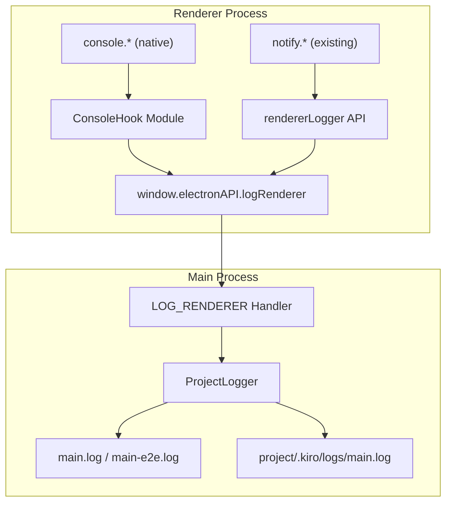
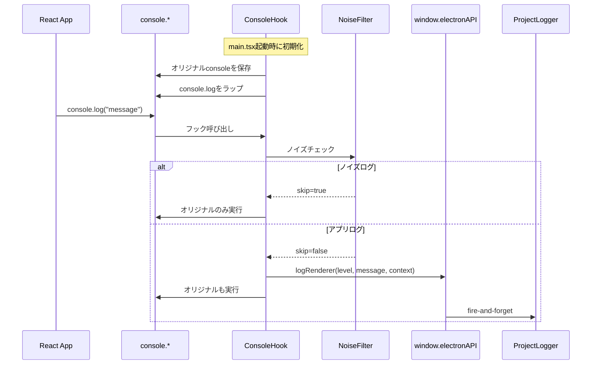

# Design: Renderer Unified Logging

## Overview

**Purpose**: Rendererプロセス（UIフロントエンド）のログをMainプロセスに統合し、AIアシスタントが解析可能な形式でファイル出力する機能を提供する。

**Users**: 開発者およびAIアシスタントが、E2Eテストや開発時のデバッグを効率的に行う。

**Impact**: 既存の`notify.*()` 経由のログに加え、`console.*`のグローバルフックと専用ロガーAPI（`rendererLogger`）を提供し、既存コード変更なしでログ統合を実現する。

### Goals

- 既存の`console.*`呼び出しを変更せずにRendererログをMainプロセスに送信
- HMR/React DevTools等のノイズログを自動フィルタリング
- console互換の専用ロガーAPI提供による段階的移行サポート
- 現在のアプリケーション状態（specId、bugName）の自動コンテキスト付与

### Non-Goals

- 本番環境でのRendererログ収集
- ログのリアルタイムUI表示（既存のAgent Log表示とは別）
- Rendererログの独立したログファイル（main.logに統合）
- ログレベルの動的変更UI
- リモートへのログ送信

## Architecture

### Existing Architecture Analysis

現在のRendererログ基盤:
- **notify.* → logToMain → IPC → projectLogger.logFromRenderer**: 既存の経路でRendererログをMainに送信
- **IPC_CHANNELS.LOG_RENDERER**: 既に定義済み（`ipc:log-renderer`）
- **ProjectLogger**: Main側でRenderer/Main両方のログを統合出力

拡張ポイント:
- `main.tsx`: Rendererエントリーポイント。ここでconsole.*フックを初期化
- `notificationStore.ts`: 既存のlogToMain関数とnotify.*関数群
- `preload/index.ts`: `logRenderer` API既に公開済み

### Architecture Pattern & Boundary Map



**Architecture Integration**:
- Selected pattern: グローバルフック + 専用API併用パターン
- Domain/feature boundaries: Renderer側のログ収集（ConsoleHook, rendererLogger） vs Main側のログ出力（既存のprojectLogger）
- Existing patterns preserved: IPC fire-and-forget、ProjectLogger、ログフォーマット
- New components rationale:
  - `ConsoleHook`: 既存console.*を透過的にフック
  - `rendererLogger`: 構造化ログAPIを提供
- Steering compliance: DRY（既存IPC/Logger再利用）、KISS（シンプルなフック機構）

### Technology Stack

| Layer | Choice / Version | Role in Feature | Notes |
|-------|------------------|-----------------|-------|
| Frontend | React 19 / TypeScript 5.8+ | consoleフック、rendererLogger提供 | main.tsxで初期化 |
| IPC | Electron IPC (fire-and-forget) | Renderer→Main ログ転送 | 既存LOG_RENDERERチャンネル使用 |
| Logging | ProjectLogger | ログファイル出力 | 既存実装を再利用 |

## System Flows

### Console Hook Flow



## Requirements Traceability

| Criterion ID | Summary | Components | Implementation Approach |
|--------------|---------|------------|------------------------|
| 1.1 | console.log/warn/error/debugがフックされMainにログ送信 | ConsoleHook | 新規実装 |
| 1.2 | console.errorにスタックトレース自動付与 | ConsoleHook | 新規実装 |
| 1.3 | 開発/E2E環境でフック有効 | ConsoleHook | 環境判定ロジック新規 |
| 1.4 | 本番環境でフック無効 | ConsoleHook | 環境判定ロジック新規 |
| 1.5 | ファイル名自動付与 | ConsoleHook | スタックトレース解析 |
| 2.1 | [HMR]/[vite]ログをフィルタ | NoiseFilter | 新規実装 |
| 2.2 | React DevToolsログをフィルタ | NoiseFilter | 新規実装 |
| 2.3 | "Download the React DevTools"フィルタ | NoiseFilter | 新規実装 |
| 2.4 | フィルタ時もオリジナルconsoleは動作 | ConsoleHook | 新規実装 |
| 3.1 | rendererLogger.log/info/warn/error/debugがconsole互換 | rendererLogger | 新規実装 |
| 3.2 | rendererLogger使用時にファイル名自動付与 | rendererLogger | スタックトレース解析 |
| 3.3 | 追加コンテキストがJSON形式でログ出力 | rendererLogger | 新規実装 |
| 3.4 | `import { rendererLogger as console }`で既存コード動作 | rendererLogger | API設計 |
| 4.1 | 現在選択中specIdをコンテキストに自動含める | ContextProvider | 既存getAutoContext再利用 |
| 4.2 | 現在選択中bugNameをコンテキストに自動含める | ContextProvider | 既存getAutoContext再利用 |
| 4.3 | Spec/Bug未選択時は空オブジェクト | ContextProvider | 既存実装 |
| 5.1 | notify.error/warning/info/successが内部でrendererLogger使用 | notify refactor | 既存コード変更 |
| 5.2 | notify.showCompletionSummaryが内部でrendererLogger使用 | notify refactor | 既存コード変更 |
| 5.3 | 既存logToMainをrendererLoggerに置換 | notify refactor | 既存コード変更 |
| 6.1 | ログフォーマット: `[timestamp] [LEVEL] [projectId] [renderer] message data` | ProjectLogger | 既存実装維持 |
| 6.2 | E2Eテスト時はmain-e2e.logに出力 | ProjectLogger | 既存実装維持 |
| 6.3 | 開発環境時はmain.logに出力 | ProjectLogger | 既存実装維持 |
| 6.4 | ファイル名は`[renderer:ファイル名]`形式でsourceに含める | ProjectLogger | 既存formatMessage拡張 |
| 7.1 | 既存LOG_RENDERER IPCチャンネルを使用 | IPC | 既存実装維持 |
| 7.2 | fire-and-forget方式で送信 | IPC | 既存実装維持 |
| 7.3 | IPC利用不可時はエラーなくスキップ | rendererLogger, ConsoleHook | ガード条件 |

### Coverage Validation Checklist

- [x] Every criterion ID from requirements.md appears in the table above
- [x] Each criterion has specific component names (not generic references)
- [x] Implementation approach distinguishes "reuse existing" vs "new implementation"
- [x] User-facing criteria specify concrete UI components (not just "shared components")

## Components and Interfaces

| Component | Domain/Layer | Intent | Req Coverage | Key Dependencies | Contracts |
|-----------|--------------|--------|--------------|------------------|-----------|
| ConsoleHook | Renderer/Utils | console.*のグローバルフック | 1.1-1.5, 2.1-2.4 | window.electronAPI (P0) | Service |
| NoiseFilter | Renderer/Utils | ノイズログのフィルタリング | 2.1-2.3 | None | Service |
| rendererLogger | Renderer/Utils | 専用ロガーAPI | 3.1-3.4, 7.3 | window.electronAPI (P0), ContextProvider (P1) | Service |
| ContextProvider | Renderer/Utils | 自動コンテキスト取得 | 4.1-4.3 | specDetailStore (P1), bugStore (P1) | Service |
| notify (refactored) | Renderer/Stores | 通知 + ログ統合 | 5.1-5.3 | rendererLogger (P0) | Service |

### Renderer/Utils

#### ConsoleHook

| Field | Detail |
|-------|--------|
| Intent | Rendererプロセスのconsole.*をフックし、Mainプロセスにログを転送 |
| Requirements | 1.1, 1.2, 1.3, 1.4, 1.5, 2.4 |

**Responsibilities & Constraints**
- console.log/warn/error/debugをオーバーライドし、オリジナル関数を保持
- 開発環境またはE2Eテスト環境でのみ有効化
- 本番環境では初期化をスキップ
- スタックトレースからファイル名を抽出

**Dependencies**
- Outbound: window.electronAPI.logRenderer - ログ送信 (P0)
- Outbound: NoiseFilter - フィルタリング判定 (P0)
- Outbound: ContextProvider - 自動コンテキスト取得 (P1)

**Contracts**: Service [x]

##### Service Interface

```typescript
interface ConsoleHookModule {
  /**
   * Initialize console hook
   * Should be called once at application startup (main.tsx)
   * No-op in production environment
   */
  initializeConsoleHook(): void;

  /**
   * Check if console hook is active
   */
  isHookActive(): boolean;
}
```

- Preconditions: `window.electronAPI` が利用可能
- Postconditions: console.log/warn/error/debug がフック済み
- Invariants: オリジナルconsole関数は常に実行される

**Implementation Notes**
- Integration: main.tsxでアプリ起動時に`initializeConsoleHook()`を呼び出し
- Validation: `app.isPackaged`または環境変数で本番判定
- Risks: console.*のオーバーライドは他ライブラリに影響する可能性（NoiseFilterで軽減）

#### NoiseFilter

| Field | Detail |
|-------|--------|
| Intent | HMR、Vite、React DevTools等のノイズログをフィルタリング |
| Requirements | 2.1, 2.2, 2.3 |

**Responsibilities & Constraints**
- パターンマッチングでログメッセージをチェック
- フィルタパターンはハードコード（設定の外部化は将来検討）
- フィルタ対象でもオリジナルconsoleは実行される

**Dependencies**
- None

**Contracts**: Service [x]

##### Service Interface

```typescript
interface NoiseFilterModule {
  /**
   * Check if the message should be filtered (not sent to Main)
   * @param message Log message (first argument of console.*)
   * @returns true if message should be skipped
   */
  shouldFilter(message: unknown): boolean;
}

/** Default filter patterns */
const DEFAULT_FILTER_PATTERNS: readonly string[] = [
  '[HMR]',
  '[vite]',
  'Download the React DevTools',
  'React DevTools',
];
```

- Preconditions: なし
- Postconditions: boolean値を返す
- Invariants: フィルタパターンは不変

**Implementation Notes**
- Integration: ConsoleHookから呼び出し
- Validation: 文字列パターンマッチング
- Risks: 過剰なフィルタリングでアプリログが失われる可能性（パターンは慎重に選定）

#### rendererLogger

| Field | Detail |
|-------|--------|
| Intent | console互換の専用ロガーAPIを提供 |
| Requirements | 3.1, 3.2, 3.3, 3.4, 7.3 |

**Responsibilities & Constraints**
- console.log/info/warn/error/debugと同じシグネチャ
- 自動ファイル名付与
- 追加コンテキストのサポート
- IPC利用不可時のフォールバック

**Dependencies**
- Outbound: window.electronAPI.logRenderer - ログ送信 (P0)
- Outbound: ContextProvider - 自動コンテキスト取得 (P1)

**Contracts**: Service [x]

##### Service Interface

```typescript
interface RendererLoggerModule {
  /**
   * Log at INFO level (alias for log)
   */
  log(...args: unknown[]): void;

  /**
   * Log at INFO level
   */
  info(...args: unknown[]): void;

  /**
   * Log at WARN level
   */
  warn(...args: unknown[]): void;

  /**
   * Log at ERROR level
   */
  error(...args: unknown[]): void;

  /**
   * Log at DEBUG level
   */
  debug(...args: unknown[]): void;

  /**
   * Log with explicit context
   */
  logWithContext(
    level: 'log' | 'info' | 'warn' | 'error' | 'debug',
    message: string,
    context?: Record<string, unknown>
  ): void;
}

/** Export as default for easy aliasing */
export const rendererLogger: RendererLoggerModule;
```

- Preconditions: なし（IPC利用不可時はサイレントフォールバック）
- Postconditions: ログがMainプロセスに送信される（可能な場合）
- Invariants: console.*と同じシグネチャを維持

**Implementation Notes**
- Integration: `import { rendererLogger as console } from '@/utils/rendererLogger'` で既存コード互換
- Validation: 引数をJSON.stringifyで文字列化
- Risks: 循環参照オブジェクトはJSON化に失敗する可能性

#### ContextProvider

| Field | Detail |
|-------|--------|
| Intent | 現在のアプリケーション状態（specId、bugName）を取得 |
| Requirements | 4.1, 4.2, 4.3 |

**Responsibilities & Constraints**
- specDetailStoreとbugStoreから現在の状態を取得
- 選択中でない場合は空オブジェクトを返す

**Dependencies**
- Inbound: ConsoleHook, rendererLogger - コンテキスト取得 (P1)
- Outbound: specDetailStore - specId取得 (P1)
- Outbound: bugStore - bugName取得 (P1)

**Contracts**: Service [x]

##### Service Interface

```typescript
interface ContextProviderModule {
  /**
   * Get current application context for logging
   * @returns Object with specId and/or bugName if selected
   */
  getAutoContext(): Record<string, unknown>;
}
```

- Preconditions: なし
- Postconditions: { specId?, bugName? } を返す
- Invariants: 常に有効なオブジェクトを返す（nullやundefinedを返さない）

**Implementation Notes**
- Integration: 既存のnotificationStore.getAutoContext()を再利用/移動
- Validation: null/undefinedチェック
- Risks: Store未初期化時の動作確認が必要

### Renderer/Stores (Refactored)

#### notify (refactored)

| Field | Detail |
|-------|--------|
| Intent | 既存notify.*関数の内部実装をrendererLoggerに統合 |
| Requirements | 5.1, 5.2, 5.3 |

**Responsibilities & Constraints**
- notify.error/warning/info/successは内部でrendererLoggerを使用
- 既存の外部APIは変更なし
- logToMain関数を削除し、rendererLogger.logWithContextに置換

**Dependencies**
- Outbound: rendererLogger - ログ送信 (P0)
- Outbound: useNotificationStore - トースト表示 (P0)

**Contracts**: Service [x]

##### Service Interface

```typescript
/** 外部API（変更なし） */
export const notify: {
  success(message: string, action?: NotificationAction): void;
  error(message: string, action?: NotificationAction): void;
  warning(message: string, action?: NotificationAction): void;
  info(message: string, action?: NotificationAction): void;
  showCompletionSummary(summary: ExecutionSummary): void;
};
```

**Implementation Notes**
- Integration: 既存notificationStore.tsを変更
- Validation: 既存テストが通ること
- Risks: 既存コードの動作変更なし（内部リファクタのみ）

## Data Models

### Log Entry Format

既存のログフォーマットを維持:

```
[2026-01-16T10:15:32.456Z] [ERROR] [/Users/yamamoto/git/myproject] [renderer:ComponentName.tsx] message {"specId":"feature-auth"}
```

| Field | Format | Example |
|-------|--------|---------|
| timestamp | ISO 8601 | `2026-01-16T10:15:32.456Z` |
| level | DEBUG/INFO/WARN/ERROR | `ERROR` |
| projectId | プロジェクトパス or "global" | `/Users/yamamoto/git/myproject` |
| source | `renderer` または `renderer:ファイル名` | `renderer:WorkflowView.tsx` |
| message | 文字列 | `フェーズの実行に失敗しました` |
| data | JSON（オプショナル） | `{"specId":"feature-auth"}` |

### Context Object

```typescript
interface LogContext {
  /** 現在選択中のSpec ID（存在する場合） */
  specId?: string;
  /** 現在選択中のBug名（存在する場合） */
  bugName?: string;
  /** その他のコンテキスト情報 */
  [key: string]: unknown;
}
```

## Error Handling

### Error Strategy

- **IPC利用不可**: サイレントフォールバック（エラーログなし、ブラウザコンソールのみ）
- **JSON化失敗**: 引数を`[Object]`等のプレースホルダに置換
- **Store未初期化**: 空のコンテキストオブジェクトを返す

### Error Categories and Responses

**System Errors**:
- IPC通信失敗 → オリジナルconsoleのみ実行、Main側ログなし
- Store未初期化 → 空コンテキストで続行

## Testing Strategy

### Unit Tests

1. **ConsoleHook**: フック初期化、環境判定、ファイル名抽出
2. **NoiseFilter**: 各フィルタパターンのマッチング
3. **rendererLogger**: 各ログレベル、コンテキスト付与、IPC不可時フォールバック
4. **ContextProvider**: specId/bugName取得、未選択時の動作
5. **notify refactored**: 既存テストの維持、rendererLogger統合

### Integration Tests

1. **Console Hook → IPC → ProjectLogger**: E2E環境でのログフロー
2. **rendererLogger → IPC → ProjectLogger**: 構造化ログのフロー
3. **notify → rendererLogger → IPC**: 既存notify経由のログフロー

### E2E Tests

1. **開発環境でのconsole.log出力**: main.logへの出力確認
2. **E2Eテスト環境でのログ出力**: main-e2e.logへの出力確認
3. **ノイズフィルタリング**: HMR/Viteログがmain.logに含まれないこと

## Design Decisions

### DD-001: console.*グローバルフック方式の採用

| Field | Detail |
|-------|--------|
| Status | Accepted |
| Context | 既存のconsole.*呼び出しを変更せずにログ統合を実現する必要がある |
| Decision | main.tsxでconsole.log/warn/error/debugをグローバルにオーバーライドする |
| Rationale | 既存コード変更不要、シンプルな実装、段階的移行可能 |
| Alternatives Considered | (1) Babel/TypeScriptトランスフォーム: ビルド設定が複雑化 (2) 全てのconsole呼び出しを手動置換: 工数大、漏れのリスク |
| Consequences | 他ライブラリのconsole出力も捕捉される（NoiseFilterで軽減）。本番環境では無効化が必要 |

### DD-002: ノイズフィルタのハードコード

| Field | Detail |
|-------|--------|
| Status | Accepted |
| Context | HMR、Vite、React DevTools等の開発ツールログをフィルタリングする必要がある |
| Decision | フィルタパターンをソースコード内にハードコードする |
| Rationale | 設定ファイル不要でシンプル、フィルタ対象は安定している、YAGNI原則 |
| Alternatives Considered | (1) 設定ファイル外部化: 過剰な柔軟性、メンテナンス増 (2) 環境変数: 設定が煩雑 |
| Consequences | 新しいノイズパターン追加時はコード変更が必要 |

### DD-003: rendererLoggerのconsole互換API設計

| Field | Detail |
|-------|--------|
| Status | Accepted |
| Context | 開発者が既存のconsole.*呼び出しを段階的にrendererLoggerに移行できるようにする |
| Decision | `import { rendererLogger as console }`でエイリアス可能なAPIを提供 |
| Rationale | 既存コードのimport文変更のみで移行可能、学習コスト低減 |
| Alternatives Considered | (1) 独自のメソッド名: 移行コストが高い (2) デコレータパターン: TypeScript設定変更が必要 |
| Consequences | console.*と完全に同じシグネチャを維持する必要がある |

### DD-004: notify.*のrendererLogger統合

| Field | Detail |
|-------|--------|
| Status | Accepted |
| Context | 既存のnotify.*とrendererLoggerのログ出力経路を一本化する必要がある |
| Decision | notify.*の内部実装でlogToMainを削除し、rendererLoggerを使用する |
| Rationale | コード重複回避、ログ出力経路の一本化、保守性向上 |
| Alternatives Considered | (1) 並行運用: 重複コード、不整合リスク (2) notify.*廃止: 既存コードへの影響大 |
| Consequences | notify.*の外部APIは変更なし（内部リファクタのみ） |

### DD-005: 本番環境でのフック無効化

| Field | Detail |
|-------|--------|
| Status | Accepted |
| Context | 本番環境でのパフォーマンス影響を回避する必要がある（Requirement 1.4） |
| Decision | `app.isPackaged && !isE2ETest`の条件でフックを無効化 |
| Rationale | 本番ビルドでは余分なIPC通信を避ける、E2Eテストではログ収集が必要 |
| Alternatives Considered | (1) 環境変数で制御: 設定漏れのリスク (2) 常時有効: パフォーマンス懸念 |
| Consequences | 本番環境ではRendererログがファイル出力されない（設計通り） |

### DD-006: ファイル名のスタックトレース抽出

| Field | Detail |
|-------|--------|
| Status | Accepted |
| Context | ログ呼び出し元のファイル名を自動取得する必要がある（Requirement 1.5, 3.2） |
| Decision | `new Error().stack`を解析してファイル名を抽出 |
| Rationale | 追加の引数不要、Sourceマップ対応可能、console互換性維持 |
| Alternatives Considered | (1) 明示的なファイル名引数: API変更が必要 (2) Babelプラグイン: ビルド設定が複雑化 |
| Consequences | スタックトレース解析のオーバーヘッドあり（許容範囲内）。minified環境では読みにくい可能性 |
| Platform Dependency | **Chromium依存**: 本実装はElectron（Chromium）のスタックトレースフォーマットを前提としている。将来Remote UI（純粋なブラウザ環境）でログ収集を検討する場合は、ブラウザ互換性の追加対応が必要 |
