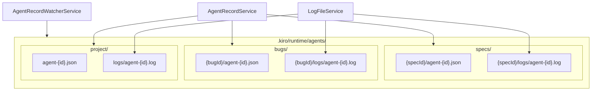
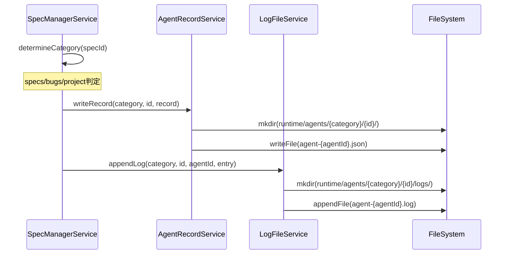
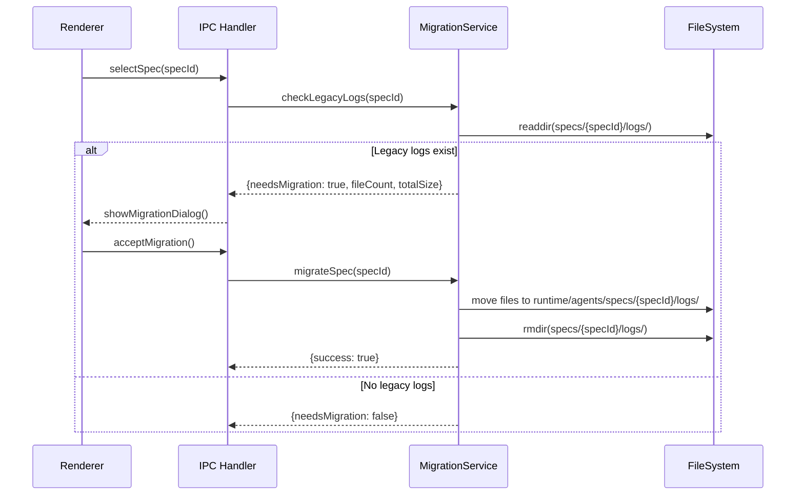
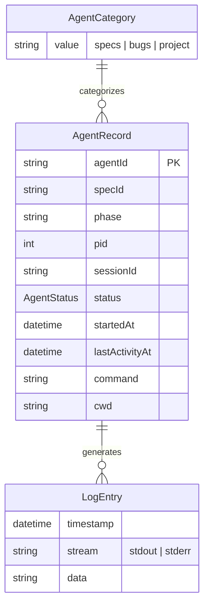

# Design Document: Runtime Agents Restructure

## Overview

**Purpose**: この機能は、Agentのログとメタデータの保存先を `.kiro/runtime/agents/` に統一し、specs/bugs/projectの3カテゴリに分離することで、SSOT原則を実現しworktree削除時のログ消失問題を解決する。

**Users**: SDD Orchestratorを使用する開発者が、Agentの履歴管理とログ参照のために利用する。

**Impact**: 現在の2箇所に分散したログ保存構造（`.kiro/runtime/agents/` にメタデータ、`.kiro/specs/{specId}/logs/` にログ）を、単一の統合構造に変更する。

### Goals

- Agentログとメタデータを `.kiro/runtime/agents/` に統一（SSOT）
- specs/bugs/projectの3カテゴリによる明確な分類
- worktree削除時のログ消失防止
- 既存ログの段階的移行（Lazy Migration）
- 旧パスからの後方互換性読み取り

### Non-Goals

- 一括マイグレーションツールの提供
- ログの圧縮・アーカイブ機能
- リモートストレージへのバックアップ
- 古いログの自動削除機能
- Remote UIからのMigration操作（Desktop UIのみ）

## Architecture

### Existing Architecture Analysis

現在のAgent管理アーキテクチャ:

| コンポーネント | 現在のパス | 役割 |
|--------------|----------|------|
| AgentRecordService | `.kiro/runtime/agents/{specId}/` | メタデータJSON管理 |
| LogFileService | `.kiro/specs/{specId}/logs/` | ログファイル管理 |
| AgentRecordWatcherService | `.kiro/runtime/agents/` | ファイル監視 |

**問題点**:
- ログが `.kiro/specs/` 配下にあるため、worktree削除時に消失
- specId形式が一貫していない（bugs用は `bug:{bugId}` プレフィックス）
- ProjectAgentの明確な配置場所がない

### Architecture Pattern & Boundary Map



**Architecture Integration**:
- Selected pattern: Category-based directory structure with unified base path
- Domain boundaries: specs/bugs/projectの3カテゴリで責務を分離
- Existing patterns preserved: AgentRecordService/LogFileServiceの分離、chokidar-based watcher
- New components rationale: MigrationService追加（既存ログの移行処理を担当）
- Steering compliance: SSOT、DRY、関心の分離

### Technology Stack

| Layer | Choice / Version | Role in Feature | Notes |
|-------|------------------|-----------------|-------|
| Backend / Services | Node.js 20+ | ファイルシステム操作 | fs/promises使用 |
| Data / Storage | File System | JSONメタデータ、NDJSONログ | 既存形式を維持 |
| Infrastructure / Runtime | Electron 35 | メインプロセスでのサービス実行 | IPC経由でRenderer通知 |

## System Flows

### Agent作成フロー



### Lazy Migrationフロー



## Requirements Traceability

| Criterion ID | Summary | Components | Implementation Approach |
|--------------|---------|------------|------------------------|
| 1.1 | spec-bound agentメタデータ保存先 | AgentRecordService | 既存修正: getFilePath()でcategory追加 |
| 1.2 | spec-bound agentログ保存先 | LogFileService | 既存修正: getFilePath()でcategory追加 |
| 1.3 | bug-bound agentメタデータ保存先 | AgentRecordService | 既存修正: 1.1と同一ロジック |
| 1.4 | bug-bound agentログ保存先 | LogFileService | 既存修正: 1.2と同一ロジック |
| 1.5 | project-level agentメタデータ保存先 | AgentRecordService | 既存修正: category='project'固定 |
| 1.6 | project-level agentログ保存先 | LogFileService | 既存修正: category='project'固定 |
| 1.7 | logs/サブディレクトリ自動作成 | LogFileService | 既存機能: mkdir recursive維持 |
| 2.1 | LogFileService新パス書き込み | LogFileService | 既存修正: basePath統一 |
| 2.2 | LogFileServiceフォールバック読み取り | LogFileService | 新規実装: readLogWithFallback() |
| 2.3 | LogFileService category引数追加 | LogFileService | 既存修正: メソッドシグネチャ変更 |
| 3.1 | AgentRecordService新パス書き込み | AgentRecordService | 既存修正: getFilePath()変更 |
| 3.2 | AgentRecordService spec読み取り | AgentRecordService | 既存修正: readRecordsForSpec()パス変更 |
| 3.3 | AgentRecordService bug読み取り | AgentRecordService | 新規実装: readRecordsForBug() |
| 3.4 | AgentRecordService project読み取り | AgentRecordService | 既存修正: readProjectAgents()パス変更 |
| 4.1 | 3 watcher categories | AgentRecordWatcherService | 既存修正: bugWatcher追加 |
| 4.2 | spec watcher監視パス | AgentRecordWatcherService | 既存修正: specs/サブディレクトリ |
| 4.3 | bug watcher監視パス | AgentRecordWatcherService | 新規実装: bugs/サブディレクトリ |
| 4.4 | project watcher深度 | AgentRecordWatcherService | 既存機能: depth: 0維持 |
| 4.5 | switchWatchScope bugId対応 | AgentRecordWatcherService | 既存修正: category引数追加 |
| 5.1 | legacy logs検出時ダイアログ表示 | MigrationService, MigrationDialog | 新規実装 |
| 5.2 | bug legacy logs検出 | MigrationService | 新規実装: bug:プレフィックス対応 |
| 5.3 | migrationダイアログ情報表示 | MigrationDialog | 新規実装: UI component |
| 5.4 | migration実行 | MigrationService | 新規実装: migrateSpec() |
| 5.5 | migration辞退時セッション記憶 | MigrationService | 新規実装: declinedSpecs Set |
| 5.6 | migration後legacy削除 | MigrationService | 新規実装: cleanup処理 |
| 6.1 | 両パス確認 | LogFileService | 新規実装: readLogWithFallback() |
| 6.2 | legacyパスからの読み取り | LogFileService | 新規実装: fallback読み取り |
| 6.3 | legacy表示ヒント | AgentLogPanel | 新規実装: isLegacy flag表示 |
| 7.1 | 新規ログ作成禁止 | LogFileService | 既存修正: 新パスのみ使用 |
| 7.2 | .gitignore更新 | 設定ファイル | 設定変更: runtime/agents/以下除外 |
| 7.3 | ドキュメント更新 | steering/structure.md | ドキュメント更新 |

### Coverage Validation Checklist

- [x] Every criterion ID from requirements.md appears in the table above
- [x] Each criterion has specific component names (not generic references)
- [x] Implementation approach distinguishes "reuse existing" vs "new implementation"
- [x] User-facing criteria specify concrete UI components (not just "shared components")

## Components and Interfaces

| Component | Domain/Layer | Intent | Req Coverage | Key Dependencies | Contracts |
|-----------|--------------|--------|--------------|------------------|-----------|
| AgentRecordService | Main/Services | Agentメタデータ永続化 | 1.1, 1.3, 1.5, 3.1-3.4 | fs/promises (P0) | Service |
| LogFileService | Main/Services | Agentログ永続化 | 1.2, 1.4, 1.6, 1.7, 2.1-2.3, 6.1-6.2, 7.1 | fs/promises (P0) | Service |
| AgentRecordWatcherService | Main/Services | ファイル変更監視 | 4.1-4.5 | chokidar (P0) | Service, Event |
| MigrationService | Main/Services | Legacy log migration | 5.1-5.6 | fs/promises (P0), LogFileService (P1) | Service |
| MigrationDialog | Shared/Components | Migration確認UI | 5.3 | ApiClient (P0) | State |

### Main/Services

#### AgentRecordService

| Field | Detail |
|-------|--------|
| Intent | Agentメタデータ（JSON）の読み書きを管理 |
| Requirements | 1.1, 1.3, 1.5, 3.1, 3.2, 3.3, 3.4 |

**Responsibilities & Constraints**
- AgentメタデータファイルのCRUD操作
- カテゴリ（specs/bugs/project）に基づくパス解決
- ファイルロック（mutex）によるrace condition防止

**Dependencies**
- Outbound: fs/promises - ファイルシステム操作 (P0)

**Contracts**: Service [x]

##### Service Interface

```typescript
type AgentCategory = 'specs' | 'bugs' | 'project';

interface AgentRecordService {
  /**
   * カテゴリとIDからファイルパスを解決
   * @param category - 'specs' | 'bugs' | 'project'
   * @param entityId - specId または bugId（projectの場合は空文字列）
   */
  private getFilePath(category: AgentCategory, entityId: string, agentId: string): string;

  /**
   * Agentレコードを書き込む
   * Requirements: 1.1, 1.3, 1.5, 3.1
   */
  writeRecord(category: AgentCategory, entityId: string, record: AgentRecord): Promise<void>;

  /**
   * Agentレコードを読み取る
   */
  readRecord(category: AgentCategory, entityId: string, agentId: string): Promise<AgentRecord | null>;

  /**
   * 指定カテゴリ・エンティティのAgentレコード一覧を取得
   * Requirements: 3.2, 3.3, 3.4
   */
  readRecordsFor(category: AgentCategory, entityId: string): Promise<AgentRecord[]>;

  /**
   * @deprecated Use readRecordsFor('specs', specId) instead
   */
  readRecordsForSpec(specId: string): Promise<AgentRecord[]>;

  /**
   * Project Agentレコード一覧を取得
   * Requirements: 3.4
   */
  readProjectAgents(): Promise<AgentRecord[]>;
}
```

- Preconditions: basePath が存在すること
- Postconditions: ファイルが指定パスに書き込まれること
- Invariants: JSONフォーマットの整合性

**Implementation Notes**
- Integration: `specId.startsWith('bug:')` で bugs カテゴリを判定（後方互換）
- Validation: AgentRecord のスキーマはZodで検証
- Risks: パス変更に伴う既存コードの更新漏れ

#### LogFileService

| Field | Detail |
|-------|--------|
| Intent | Agentログ（NDJSON）の読み書きを管理 |
| Requirements | 1.2, 1.4, 1.6, 1.7, 2.1, 2.2, 2.3, 6.1, 6.2, 7.1 |

**Responsibilities & Constraints**
- ログファイルのappend操作
- カテゴリに基づくパス解決
- Legacy pathからのfallback読み取り

**Dependencies**
- Outbound: fs/promises - ファイルシステム操作 (P0)

**Contracts**: Service [x]

##### Service Interface

```typescript
interface LogFileService {
  /**
   * ログエントリを追記
   * Requirements: 2.1, 7.1
   * @param category - 'specs' | 'bugs' | 'project'
   * @param entityId - specId または bugId（projectの場合は空文字列）
   */
  appendLog(category: AgentCategory, entityId: string, agentId: string, entry: LogEntry): Promise<void>;

  /**
   * ログを読み取り（新パス優先、legacyフォールバック）
   * Requirements: 2.2, 6.1, 6.2
   * @returns ログエントリ配列とisLegacyフラグ
   */
  readLogWithFallback(category: AgentCategory, entityId: string, agentId: string): Promise<{
    entries: LogEntry[];
    isLegacy: boolean;
  }>;

  /**
   * @deprecated Use readLogWithFallback instead
   */
  readLog(specId: string, agentId: string): Promise<LogEntry[]>;

  /**
   * Legacyパスにログが存在するか確認
   * Requirements: 5.1, 5.2
   */
  hasLegacyLogs(specId: string): Promise<boolean>;

  /**
   * Legacyログ情報を取得（ファイル数、合計サイズ）
   * Requirements: 5.3
   */
  getLegacyLogInfo(specId: string): Promise<{ fileCount: number; totalSize: number } | null>;
}
```

- Preconditions: basePath が存在すること
- Postconditions: NDJSONフォーマットでログが追記されること
- Invariants: 各行が有効なJSONであること

**Implementation Notes**
- Integration: 初期化時にbasePath を `.kiro/runtime/agents` に統一
- Validation: LogEntry構造のランタイム検証
- Risks: Legacy読み取りのパフォーマンス（2箇所チェック）

#### AgentRecordWatcherService

| Field | Detail |
|-------|--------|
| Intent | ファイルシステム変更を監視しUIに通知 |
| Requirements | 4.1, 4.2, 4.3, 4.4, 4.5 |

**Responsibilities & Constraints**
- 3つのwatcher（project/spec/bug）の管理
- スコープ切り替え時のwatcher再作成
- デバウンス処理

**Dependencies**
- Outbound: chokidar - ファイル監視 (P0)

**Contracts**: Service [x] / Event [x]

##### Service Interface

```typescript
type WatchCategory = 'specs' | 'bugs';

interface AgentRecordWatcherService {
  /**
   * 監視を開始（projectWatcherのみ起動）
   * Requirements: 4.4
   */
  start(): void;

  /**
   * 監視スコープを切り替え
   * Requirements: 4.2, 4.3, 4.5
   * @param category - 'specs' | 'bugs'
   * @param entityId - specId または bugId
   */
  switchWatchScope(category: WatchCategory, entityId: string | null): Promise<void>;

  /**
   * 現在の監視スコープを取得
   */
  getWatchScope(): { category: WatchCategory | null; entityId: string | null };

  /**
   * 監視を停止
   */
  stop(): Promise<void>;
}
```

##### Event Contract

- Published events: `AgentRecordChangeEvent { type, path, category, entityId, agentId }`
- Subscribed events: なし
- Ordering / delivery guarantees: debounce 100ms、順序保証なし

**Implementation Notes**
- Integration: switchWatchScope呼び出し元（handlers.ts）でcategory判定追加
- Validation: JSONファイルのみイベント発火
- Risks: watcher再作成時の一時的なイベント漏れ

#### MigrationService

| Field | Detail |
|-------|--------|
| Intent | Legacy log の新構造への移行を管理 |
| Requirements | 5.1, 5.2, 5.4, 5.5, 5.6 |

**Responsibilities & Constraints**
- Legacy logの存在確認
- ファイル移動処理
- セッション内での辞退記憶

**Dependencies**
- Outbound: fs/promises - ファイル操作 (P0)
- Outbound: LogFileService - パス解決 (P1)

**Contracts**: Service [x]

##### Service Interface

```typescript
interface MigrationInfo {
  specId: string;
  fileCount: number;
  totalSize: number;
}

interface MigrationResult {
  success: boolean;
  migratedFiles: number;
  error?: string;
}

interface MigrationService {
  /**
   * Legacy logが存在し、移行が必要か確認
   * Requirements: 5.1, 5.2, 5.5
   */
  checkMigrationNeeded(specId: string): Promise<MigrationInfo | null>;

  /**
   * 指定specのログを移行
   * Requirements: 5.4, 5.6
   */
  migrateSpec(specId: string): Promise<MigrationResult>;

  /**
   * 移行を辞退（セッション内で記憶）
   * Requirements: 5.5
   */
  declineMigration(specId: string): void;

  /**
   * 辞退済みかどうか確認
   */
  isDeclined(specId: string): boolean;
}
```

- Preconditions: specId が有効であること
- Postconditions: 移行成功時、legacy ディレクトリが削除されること
- Invariants: 移行中の中断でもデータ損失しないこと（コピー後に削除）

**Implementation Notes**
- Integration: IPC handler の selectSpec/selectBug で checkMigrationNeeded を呼び出し
- Validation: ファイル移動前に宛先の空き確認
- Risks: 大量ファイル移行時のUIブロッキング → 非同期進捗表示を検討

### Shared/Components

#### MigrationDialog

| Field | Detail |
|-------|--------|
| Intent | Migration確認ダイアログの表示 |
| Requirements | 5.3 |

**Responsibilities & Constraints**
- 移行情報（ファイル数、サイズ）の表示
- Accept/Declineボタン
- 進行中の状態表示

**Dependencies**
- Inbound: ApiClient - IPC通信 (P0)

**Contracts**: State [x]

##### State Management

```typescript
interface MigrationDialogState {
  isOpen: boolean;
  specId: string | null;
  info: MigrationInfo | null;
  isProcessing: boolean;
  error: string | null;
}

interface MigrationDialogActions {
  showDialog(specId: string, info: MigrationInfo): void;
  acceptMigration(): Promise<void>;
  declineMigration(): void;
  closeDialog(): void;
}
```

**Implementation Notes**
- Integration: specStore または bugStore の選択変更時にトリガー
- Validation: isProcessing 中はボタン無効化
- Risks: ダイアログ表示タイミングの UX（選択直後は煩わしい可能性）

## Data Models

### Domain Model



**Aggregates**:
- AgentRecord: 単一エージェントの実行状態を表す集約ルート
- LogEntry: AgentRecordに従属するイベントログ

**Business Rules**:
- specId が `bug:` で始まる場合、category は `bugs`
- specId が空文字列の場合、category は `project`
- それ以外は category は `specs`

### Logical Data Model

**ディレクトリ構造（新）**:

```
.kiro/runtime/agents/
├── specs/
│   └── {specId}/
│       ├── agent-{id}.json      # メタデータ
│       └── logs/
│           └── agent-{id}.log   # ログ（NDJSON）
├── bugs/
│   └── {bugId}/
│       ├── agent-{id}.json
│       └── logs/
│           └── agent-{id}.log
└── project/
    ├── agent-{id}.json
    └── logs/
        └── agent-{id}.log
```

**ディレクトリ構造（旧 - Legacy）**:

```
.kiro/specs/{specId}/logs/agent-{id}.log
.kiro/specs/bug:{bugId}/logs/agent-{id}.log
.kiro/runtime/agents/{specId}/agent-{id}.json
```

**Consistency & Integrity**:
- メタデータとログは1:1対応
- logs/ サブディレクトリは初回ログ書き込み時に自動作成
- 移行は全ファイル完了後にlegacyディレクトリを削除（アトミック性確保）

## Error Handling

### Error Strategy

| エラー種別 | 対処 | ユーザー通知 |
|----------|------|------------|
| Legacy path not found | フォールバック終了、新パスのみ使用 | なし |
| Migration file move failed | ロールバック（コピー済みファイル削除） | エラーダイアログ表示 |
| Watcher creation failed | 警告ログ、UIは手動更新で対応 | コンソール警告 |
| Concurrent write conflict | mutex で排他制御済み | なし |
| Concurrent migration request | mutex で排他制御、後発リクエストは待機 | 「移行処理中」メッセージ表示 |

### Monitoring

- Migration処理: 成功/失敗をlogger.info/errorで記録
  - 進捗ログ: 10ファイルごと、または処理開始時・完了時にlogger.infoで出力
  - 出力例: `Migration progress: 10/50 files migrated for spec {specId}`
  - 完了時: `Migration completed: 50 files migrated for spec {specId}`
- Watcher状態: start/stop/switchをlogger.infoで記録
- Legacy読み取り: フォールバック発生時にlogger.debugで記録

## Testing Strategy

### Unit Tests

1. **AgentRecordService.getFilePath**: カテゴリ別パス生成の正確性
2. **LogFileService.readLogWithFallback**: 新パス優先、legacyフォールバック動作
3. **MigrationService.checkMigrationNeeded**: legacy検出ロジック
4. **MigrationService.migrateSpec**: ファイル移動とcleanup
5. **AgentRecordWatcherService.switchWatchScope**: category対応のwatcher切り替え

### Integration Tests

1. **Agent作成→ログ書き込み→読み取り**: E2Eパス確認
2. **Spec選択→Migration検出→ダイアログ表示→移行実行**: UIフロー
3. **Watcher切り替え→ファイル変更→イベント通知**: リアルタイム更新
4. **Legacy読み取り→新パス書き込み→Legacy削除**: 移行後の整合性

### E2E Tests

1. **Spec選択時のMigrationダイアログ**: E2Eシナリオ
2. **Bug選択時のMigrationダイアログ**: E2Eシナリオ
3. **Agent実行→ログ表示**: 新パスでの動作確認

## Migration Strategy

### Phase 1: 新構造への書き込み対応

1. LogFileService のbasePath を `.kiro/runtime/agents` に変更
2. AgentRecordService のパス生成ロジックにcategory追加
3. 新規Agentは新パスに書き込み

### Phase 2: 読み取りフォールバック

1. readLogWithFallback 実装（新パス優先、legacyフォールバック）
2. UI側で isLegacy フラグに基づく表示（オプション）

### Phase 3: Lazy Migration

1. MigrationService 実装
2. IPC handler で selectSpec/selectBug 時に migration check
3. MigrationDialog 実装

### Rollback Triggers

- Migration中のファイル破損検出時: 即時中断、手動復旧指示
- 新パス書き込み失敗時: 旧パスへの書き込みは行わない（明示的エラー）

## Design Decisions

### DD-001: ログ保存先の統一

| Field | Detail |
|-------|--------|
| Status | Accepted |
| Context | 現在Agentログが2箇所に分散（runtime/agents/にメタデータ、specs/*/logs/にログ）。worktree削除時にspecs/*/logs/のログが消失する問題がある。 |
| Decision | runtime/agents/ に統一し、メタデータとログを同一ディレクトリ階層に配置する |
| Rationale | SSOT原則の実現、worktree削除時のログ消失防止、シンボリックリンク共有が既にruntime/で実現されている |
| Alternatives Considered | 1. specs/*/logs/に統一 → worktree削除問題が解決しない 2. 別のトップレベルディレクトリ → runtime/との一貫性がない |
| Consequences | 既存ログの移行が必要、サービス初期化パスの変更が必要 |

### DD-002: 3カテゴリによる分離

| Field | Detail |
|-------|--------|
| Status | Accepted |
| Context | 現在はspecIdにbug:プレフィックスを付けてフラットに管理。検索・フィルタリングが非効率。 |
| Decision | specs/, bugs/, project/ の3つのサブディレクトリに分離する |
| Rationale | 関心の分離、検索効率化、将来の拡張性（新カテゴリ追加が容易） |
| Alternatives Considered | 1. フラット維持+メタデータでフィルタ → glob時に全ファイルスキャン必要 2. 2カテゴリ（specs/bugs）→ ProjectAgentの居場所がない |
| Consequences | パス解決ロジックの複雑化、Watcher数の増加（2→3） |

### DD-003: logs/サブディレクトリによる分離

| Field | Detail |
|-------|--------|
| Status | Accepted |
| Context | メタデータ（.json）とログ（.log）を同一ディレクトリに置くか分離するか |
| Decision | logs/ サブディレクトリでログを隔離する |
| Rationale | メタデータ検索の高速化（glob時にログファイルを除外不要）、ディレクトリ構造の明確化 |
| Alternatives Considered | 1. 同一ディレクトリ → glob時に.jsonフィルタ必要、ディレクトリが肥大化 |
| Consequences | ディレクトリ作成処理の追加（初回ログ書き込み時） |

### DD-004: Lazy Migration方式

| Field | Detail |
|-------|--------|
| Status | Accepted |
| Context | 既存ログ（約10GB）の移行方法。一括移行は時間がかかる。 |
| Decision | Spec/Bug選択時にダイアログ表示して個別移行（Lazy Migration） |
| Rationale | 1 Specあたり数MB〜12MB程度で現実的、ユーザー判断で移行可否を選択可能、即座に全プロジェクトへの影響なし |
| Alternatives Considered | 1. 一括移行 → 10GB処理に時間がかかる、途中失敗のリスク 2. 完全自動移行 → ユーザーの意図しないディスク操作 |
| Consequences | セッション内での辞退記憶が必要、UI実装が必要 |

### DD-005: 後方互換読み取り

| Field | Detail |
|-------|--------|
| Status | Accepted |
| Context | 移行していないログも参照できる必要がある |
| Decision | readLogWithFallback で新パス優先、なければlegacyパスを確認 |
| Rationale | ユーザーが移行を辞退しても履歴参照可能、段階的移行をサポート |
| Alternatives Considered | 1. 移行必須 → ユーザー体験が悪い 2. 常に両方読み込み → パフォーマンス低下 |
| Consequences | 読み取り時の2パスチェックによる軽微なオーバーヘッド |
