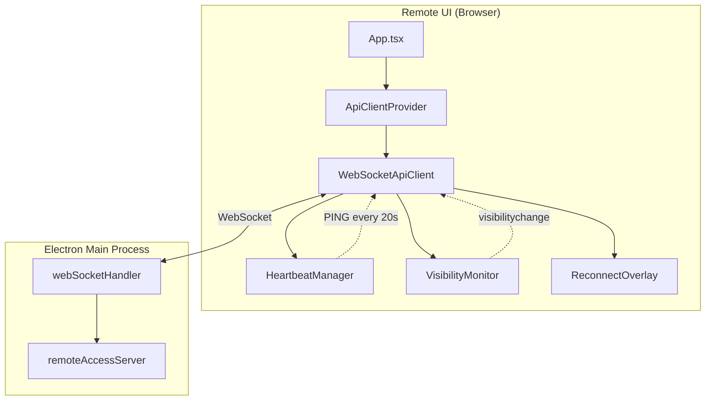
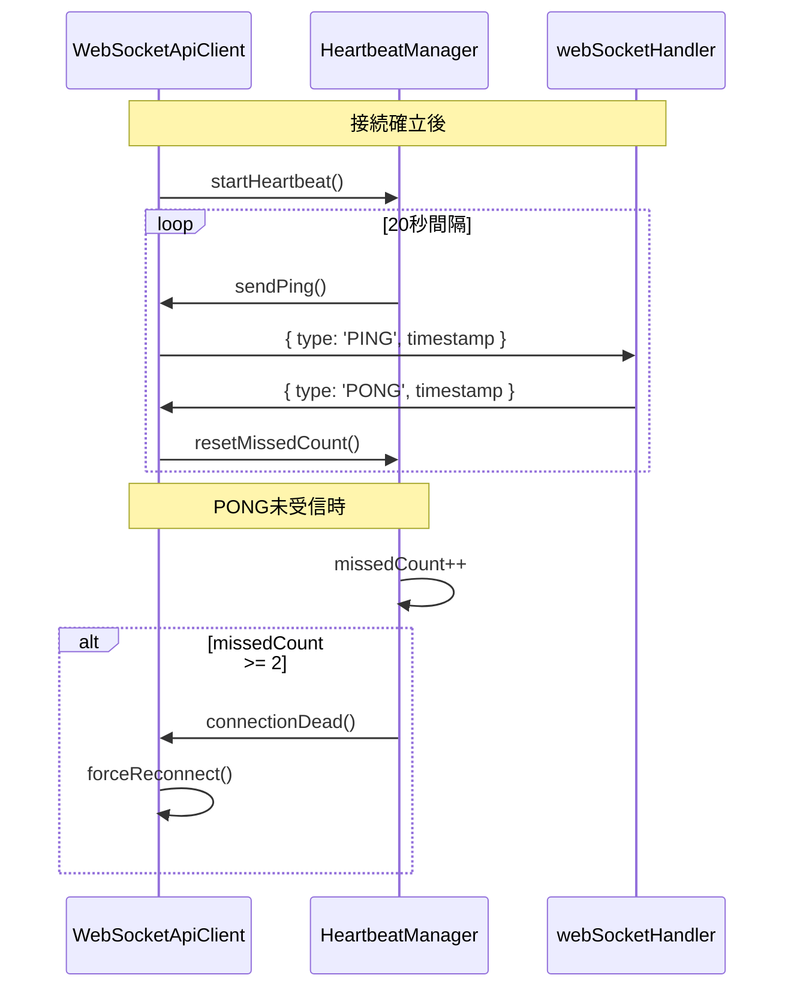
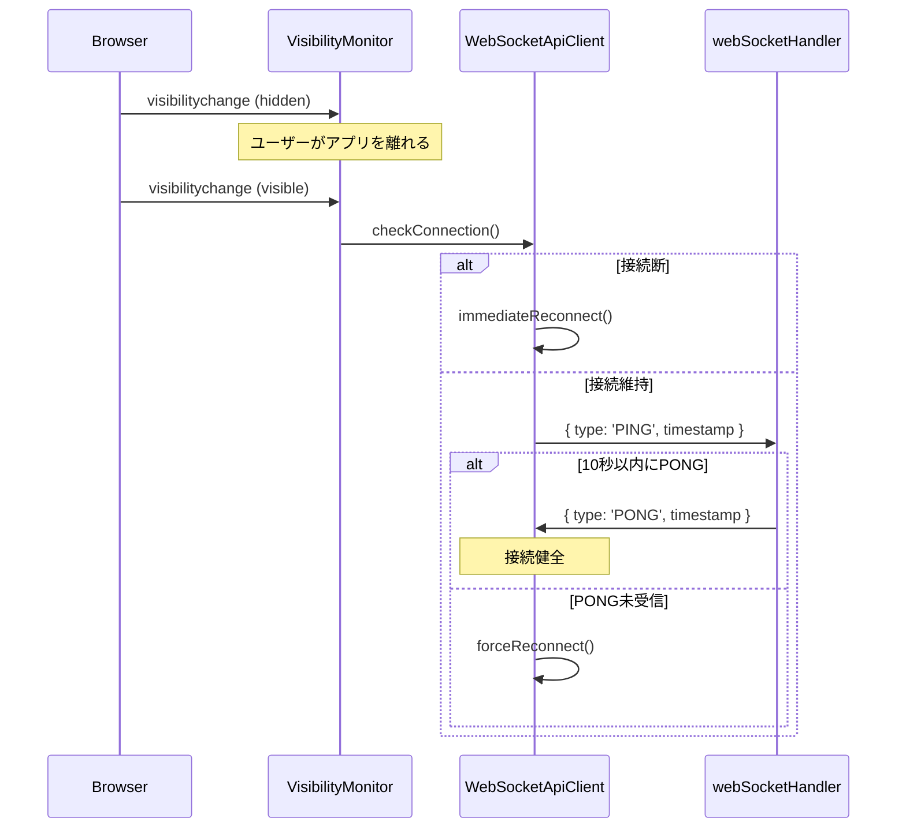
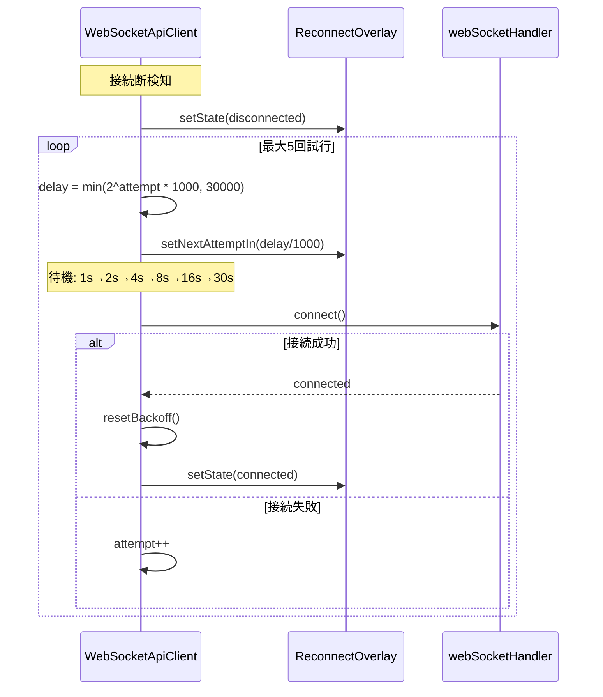

# Design: Safari WebSocket Stability

## Overview

**Purpose**: Remote UIユーザー（特にSafari/iOS）に対して、WebSocket接続の安定性を向上させる機能を提供する。

**Users**: Safari（iOS/iPadOS/macOS）からRemote UIを使用するユーザーが、バックグラウンド遷移やアイドル状態での接続断を自動検知・回復できるようになる。

**Impact**: 既存の`WebSocketApiClient`にHeartbeatメカニズムを追加し、`webSocketHandler`にPING/PONG応答機能を追加する。既存の`ReconnectOverlay`コンポーネントを活用してUI表示を行う。

### Goals

- SafariのWebSocket切断問題を軽減し、接続安定性を向上させる
- 20秒間隔のHeartbeat（PING/PONG）による接続生存監視
- visibilitychange対応による画面復帰時の即座な接続確認・回復
- 指数バックオフによるサーバー負荷軽減と再接続の最適化

### Non-Goals

- E2Eテスト（Safari環境のシミュレーションが困難）
- NoSleep.js等のバックグラウンド維持ライブラリの導入
- Heartbeat間隔の設定UI
- サーバー側からのPING送信（クライアント主導のみ）
- `ReconnectOverlay`コンポーネントのUI変更

## Architecture

### Existing Architecture Analysis

**現行アーキテクチャ**:
- `WebSocketApiClient`: Remote UI向けWebSocket通信クライアント（`src/shared/api/`）
- `webSocketHandler`: サーバー側WebSocketメッセージルーティング（`src/main/services/`）
- `ReconnectOverlay`: 接続切断時オーバーレイ（`src/remote-ui/web-specific/`）
- 現行の再接続: 線形バックオフ（1s, 2s, 3s, 4s, 5s）、最大5回

**既存パターンの尊重**:
- WebSocketApiClientのイベントエミッター構造を維持
- webSocketHandlerのメッセージルーティングパターン（switch文）に従う
- ReconnectOverlayのProps構造を変更しない

### Architecture Pattern & Boundary Map



**Architecture Integration**:
- **Selected pattern**: Heartbeat内蔵型WebSocketクライアント（WebSocketApiClient内に統合）
- **Domain/feature boundaries**: Heartbeat/Visibility監視ロジックはWebSocketApiClient内にカプセル化
- **Existing patterns preserved**: メッセージ送受信パターン、イベントエミッター、再接続メカニズム
- **New components rationale**: 既存クラスへの機能追加のみ、新規コンポーネント作成なし
- **Steering compliance**: DRY（既存ReconnectOverlay活用）、KISS（シンプルなPING/PONG）

### Technology Stack

| Layer | Choice / Version | Role in Feature | Notes |
|-------|------------------|-----------------|-------|
| Frontend | React 19, TypeScript 5.8+ | Heartbeat管理、visibilitychange監視 | WebSocketApiClient内に統合 |
| Backend | Node.js 20+, ws library | PING/PONG応答 | webSocketHandler拡張 |
| Messaging | WebSocket (JSON) | PING/PONGメッセージ交換 | アプリケーションレベルHeartbeat |

## System Flows

### Heartbeat Flow



### Visibility Change Flow



### Exponential Backoff Reconnect Flow



## Requirements Traceability

| Criterion ID | Summary | Components | Implementation Approach |
|--------------|---------|------------|------------------------|
| 1.1 | 20秒間隔でPINGメッセージ送信 | WebSocketApiClient | 新規: HeartbeatManager内部クラス追加 |
| 1.2 | PINGメッセージフォーマット | WebSocketApiClient | 新規: `{ type: 'PING', timestamp }` |
| 1.3 | サーバーがPONGを返す | webSocketHandler | 新規: routeMessage()にPINGケース追加 |
| 1.4 | PONGメッセージフォーマット | webSocketHandler | 新規: `{ type: 'PONG', timestamp }` |
| 1.5 | 連続2回PONG未受信で再接続 | WebSocketApiClient | 新規: missedPongCount管理 |
| 1.6 | 切断時Heartbeat停止 | WebSocketApiClient | 新規: stopHeartbeat()呼び出し |
| 1.7 | 再接続時Heartbeat再開 | WebSocketApiClient | 新規: connect成功後にstartHeartbeat() |
| 2.1 | visibilitychangeイベント監視 | WebSocketApiClient | 新規: VisibilityMonitor内部クラス追加 |
| 2.2 | visible時に接続確認 | WebSocketApiClient | 新規: handleVisibilityVisible() |
| 2.3 | 切断時即座に再接続 | WebSocketApiClient | 新規: isConnected()チェック後reconnect() |
| 2.4 | 接続維持時即座にPING送信 | WebSocketApiClient | 新規: sendImmediatePing() |
| 2.5 | 10秒以内PONG未受信で再接続 | WebSocketApiClient | 新規: visibilityPingTimeout |
| 3.1 | 指数バックオフ計算 | WebSocketApiClient | 変更: handleDisconnect()のdelay計算 |
| 3.2 | 最大30秒間隔 | WebSocketApiClient | 変更: Math.min(delay, 30000) |
| 3.3 | 成功時バックオフリセット | WebSocketApiClient | 既存活用: reconnectAttempts = 0 |
| 3.4 | 次の試行までの秒数表示 | ReconnectOverlay | 既存活用: nextAttemptIn prop |
| 3.5 | 最大5回試行制限維持 | WebSocketApiClient | 既存活用: MAX_RECONNECT_ATTEMPTS |
| 4.1 | WebSocketHandlerがPINGを認識 | webSocketHandler | 新規: routeMessage()にcase追加 |
| 4.2 | PINGにPONGで応答 | webSocketHandler | 新規: handlePing()メソッド |
| 4.3 | timestampをエコーバック | webSocketHandler | 新規: payload.timestamp転送 |
| 4.4 | PING/PONGをログに記録しない | webSocketHandler | 新規: ログスキップ条件追加 |
| 5.1 | Heartbeat開始・停止テスト | WebSocketApiClient.test.ts | 新規: テストケース追加 |
| 5.2 | PONG未受信時切断テスト | WebSocketApiClient.test.ts | 新規: テストケース追加 |
| 5.3 | visibilitychange動作テスト | WebSocketApiClient.test.ts | 新規: テストケース追加 |
| 5.4 | 指数バックオフ計算テスト | WebSocketApiClient.test.ts | 新規: テストケース追加 |
| 5.5 | WebSocketHandler PING/PONGテスト | webSocketHandler.test.ts | 新規: テストケース追加 |

### Coverage Validation Checklist

- [x] Every criterion ID from requirements.md appears in the table above
- [x] Each criterion has specific component names (not generic references)
- [x] Implementation approach distinguishes "reuse existing" vs "new implementation"
- [x] User-facing criteria specify concrete UI components (not just "shared components")

## Components and Interfaces

| Component | Domain/Layer | Intent | Req Coverage | Key Dependencies | Contracts |
|-----------|--------------|--------|--------------|------------------|-----------|
| WebSocketApiClient | shared/api | WebSocket通信とHeartbeat管理 | 1.1-1.7, 2.1-2.5, 3.1-3.5 | WebSocket API (P0), document.visibilityState (P0) | Service, Event, State |
| webSocketHandler | main/services | WebSocketメッセージルーティング | 4.1-4.4 | ws library (P0) | Service |
| ReconnectOverlay | remote-ui/web-specific | 接続状態UI | 3.4 | React (P0) | - (既存活用) |

### Shared API Layer

#### WebSocketApiClient (拡張)

| Field | Detail |
|-------|--------|
| Intent | WebSocket通信クライアントにHeartbeat機能とvisibilitychange対応を追加 |
| Requirements | 1.1-1.7, 2.1-2.5, 3.1-3.5 |

**Responsibilities & Constraints**
- 20秒間隔のHeartbeat送信と応答監視
- visibilitychangeイベントの監視と接続確認
- 指数バックオフによる再接続制御
- 接続状態のイベント通知

**Dependencies**
- Outbound: WebSocket API - WebSocket通信 (P0)
- Outbound: document.visibilityState - 画面可視状態 (P0)

**Contracts**: Service [x] / API [ ] / Event [x] / Batch [ ] / State [x]

##### Service Interface (拡張)

```typescript
// 既存インターフェースに追加するメソッド

// HeartbeatManager (内部クラス)
interface HeartbeatManager {
  /** Heartbeatタイマーを開始 */
  start(): void;
  /** Heartbeatタイマーを停止 */
  stop(): void;
  /** PONG受信時にカウンターをリセット */
  handlePong(timestamp: number): void;
  /** 即座にPINGを送信（visibility復帰時用） */
  sendImmediate(timeoutMs: number): Promise<boolean>;
}

// VisibilityMonitor (内部クラス)
interface VisibilityMonitor {
  /** visibilitychange監視を開始 */
  start(): void;
  /** visibilitychange監視を停止 */
  stop(): void;
}
```

- Preconditions: WebSocket接続が確立済みであること（Heartbeat開始時）
- Postconditions: Heartbeat停止時にタイマーがクリアされていること
- Invariants: missedPongCountは0以上の整数

##### Event Contract

- **Published events**:
  - `connectionDead`: 接続がデッドと判定された時（Heartbeatタイムアウト）
- **Subscribed events**:
  - `visibilitychange` (document): 画面可視状態の変化

##### State Management

```typescript
// WebSocketApiClient内部状態（拡張）
interface HeartbeatState {
  /** Heartbeatタイマー */
  heartbeatTimer: ReturnType<typeof setInterval> | null;
  /** 連続PONG未受信カウント */
  missedPongCount: number;
  /** 最後にPINGを送信した時刻 */
  lastPingTime: number | null;
  /** visibility復帰時のPINGタイムアウト */
  visibilityPingTimeout: ReturnType<typeof setTimeout> | null;
}

// 再接続状態（拡張）
interface ReconnectState {
  /** 再接続試行回数（既存） */
  reconnectAttempts: number;
  /** 指数バックオフの現在の遅延（新規） */
  currentBackoffDelay: number;
}
```

- State model: メモリ内のみ（永続化不要）
- Persistence & consistency: 接続断時にHeartbeat状態をリセット
- Concurrency strategy: シングルスレッド（ブラウザJS）

**Implementation Notes**
- Integration: 既存のconnect/disconnect/reconnectメソッドにHeartbeat開始・停止を組み込む
- Validation: PINGタイムスタンプはDate.now()で生成、PONGで同一値を期待
- Risks: ブラウザがバックグラウンドでタイマーをスロットルする可能性があるが、visibilitychange対応で補完

### Main Services Layer

#### webSocketHandler (拡張)

| Field | Detail |
|-------|--------|
| Intent | WebSocketメッセージルーティングにPING/PONG応答を追加 |
| Requirements | 4.1-4.4 |

**Responsibilities & Constraints**
- PINGメッセージの受信と即座のPONG応答
- PING/PONGメッセージのログ除外

**Dependencies**
- Inbound: WebSocket client - PING送信 (P0)
- Outbound: WebSocket client - PONG応答 (P0)

**Contracts**: Service [x] / API [ ] / Event [ ] / Batch [ ] / State [ ]

##### Service Interface (拡張)

```typescript
// routeMessage()内に追加するケース
// case 'PING':
//   await this.handlePing(client, message);
//   break;

/**
 * PINGメッセージを処理してPONGを返す
 * @param client - クライアント情報
 * @param message - PINGメッセージ
 */
private handlePing(client: ClientInfo, message: WebSocketMessage): void;
```

- Preconditions: message.typeが'PING'であること
- Postconditions: 同一timestampを持つPONGが送信されること
- Invariants: PING受信からPONG送信まで同期処理

**Implementation Notes**
- Integration: routeMessage()のswitch文に新しいケースを追加
- Validation: payload.timestampの存在確認
- Risks: なし（シンプルなエコー処理）

## Data Models

### Domain Model

**メッセージ型定義（既存WebSocketMessage拡張）**

```typescript
// PING/PONGメッセージのペイロード
interface HeartbeatPayload {
  /** 送信時のUnixタイムスタンプ（ミリ秒） */
  timestamp: number;
}

// メッセージ例
// PING: { type: 'PING', payload: { timestamp: 1706123456789 }, timestamp: 1706123456789 }
// PONG: { type: 'PONG', payload: { timestamp: 1706123456789 }, timestamp: 1706123456800 }
```

### Logical Data Model

**Heartbeat設定定数**

```typescript
const HEARTBEAT_INTERVAL = 20000;      // 20秒
const PONG_TIMEOUT = 20000;            // 20秒（次のPING送信まで）
const MAX_MISSED_PONGS = 2;            // 連続2回でデッド判定
const VISIBILITY_PING_TIMEOUT = 10000; // 10秒（visibility復帰時）
```

**指数バックオフ設定定数**

```typescript
const INITIAL_BACKOFF = 1000;          // 1秒
const MAX_BACKOFF = 30000;             // 30秒
const BACKOFF_MULTIPLIER = 2;          // 2倍
// 遅延列: 1s → 2s → 4s → 8s → 16s → 30s (cap)
```

## Error Handling

### Error Strategy

**Heartbeat関連エラー**
- PONG未受信: missedPongCountをインクリメント、閾値到達で強制再接続
- 送信エラー: WebSocket接続断として処理、再接続フローへ

**Visibility関連エラー**
- visibilitychange未対応ブラウザ: 機能を無効化（フォールバックなし、既存動作維持）
- PING送信後タイムアウト: 強制再接続

### Error Categories and Responses

| エラーカテゴリ | 条件 | 対応 |
|---------------|------|------|
| Heartbeat死活 | 連続2回PONG未受信 | forceReconnect()呼び出し |
| Visibility確認失敗 | 10秒以内PONG未受信 | forceReconnect()呼び出し |
| 最大試行到達 | reconnectAttempts >= 5 | 自動再接続停止、手動再接続待ち |

### Monitoring

- デバッグログ: `WS_API_DEBUG`環境変数でPING/PONG送受信をログ出力
- サーバー側: PING/PONGはログ出力しない（トラフィックノイズ防止）

## Testing Strategy

### Unit Tests

**WebSocketApiClient.test.ts（拡張）**

| テスト項目 | 説明 | 要件ID |
|-----------|------|--------|
| startHeartbeat/stopHeartbeat | タイマー開始・停止の検証 | 5.1 |
| PONG受信でmissedPongCountリセット | カウンターリセットの検証 | 5.2 |
| 連続2回PONG未受信で再接続 | forceReconnect呼び出しの検証 | 5.2 |
| visibilitychange時の動作 | visible時のPING送信/再接続の検証 | 5.3 |
| 指数バックオフ計算 | 1s→2s→4s→8s→16s→30sの検証 | 5.4 |
| 再接続成功時バックオフリセット | カウンターリセットの検証 | 5.4 |

**webSocketHandler.test.ts（拡張）**

| テスト項目 | 説明 | 要件ID |
|-----------|------|--------|
| PING受信でPONG返却 | メッセージルーティングの検証 | 5.5 |
| timestampエコーバック | ペイロード転送の検証 | 5.5 |
| PING/PONGログ除外 | ログ出力されないことの検証 | 5.5 |

### Integration Tests

本機能のIntegration Testは実施しない（要件により除外）。
Safari環境のシミュレーションが困難であり、Unit Testで十分な品質を担保する。

## Design Decisions

### DD-001: アプリケーションレベルHeartbeat採用

| Field | Detail |
|-------|--------|
| Status | Accepted |
| Context | ブラウザのWebSocket APIはネイティブのping/pongフレームを公開していない。サーバー側wsライブラリはネイティブpingを送信できるが、クライアント側で検知できない。 |
| Decision | アプリケーションレベルのJSONメッセージによるPING/PONGを採用 |
| Rationale | ブラウザ側でネイティブpingの送信・検知ができないため、JSONメッセージベースが唯一実装可能な選択肢 |
| Alternatives Considered | 1. ネイティブping/pong（不可：ブラウザAPIで未対応）、2. サーバー側pingのみ（不可：クライアント検知不能） |
| Consequences | メッセージオーバーヘッド（約50バイト/20秒）が発生するが、接続安定性向上のメリットが上回る |

### DD-002: 20秒固定Heartbeat間隔

| Field | Detail |
|-------|--------|
| Status | Accepted |
| Context | Safariがアイドル接続を切断する閾値は約30-60秒。業界標準は20-30秒間隔。設定可能にするか固定値にするか。 |
| Decision | 20秒固定間隔 |
| Rationale | Safari切断閾値（30秒〜）に対して十分なマージン（10秒）があり、業界標準に準拠。設定可能にする複雑さに見合うメリットがない |
| Alternatives Considered | 1. 30秒間隔（リスク高）、2. 設定可能（YAGNI違反）、3. 10秒間隔（過剰） |
| Consequences | バッテリー消費への影響は最小限（20秒ごとに約50バイト） |

### DD-003: 指数バックオフ採用

| Field | Detail |
|-------|--------|
| Status | Accepted |
| Context | 現行は線形バックオフ（1s, 2s, 3s...最大5s）。ネットワーク不安定時にサーバーへの負荷が懸念される。 |
| Decision | 指数バックオフ（1s→2s→4s→8s→16s→30s max） |
| Rationale | ネットワーク不安定時にサーバーへの負荷を軽減しつつ、最大30秒で妥当な再接続頻度を維持。業界標準パターン |
| Alternatives Considered | 1. 線形バックオフ維持（サーバー負荷高）、2. 固定間隔（効率悪い）、3. ジッター追加（複雑化） |
| Consequences | 最大試行回数5回を維持。5回目で30秒待ちとなるが、ユーザーは手動再接続も可能 |

### DD-004: visibilitychange時の動作

| Field | Detail |
|-------|--------|
| Status | Accepted |
| Context | 画面復帰時に3つの選択肢: A. 切断時のみ再接続、B. 接続時PING送信、C. 両方 |
| Decision | オプションC（再接続 + 即座のHeartbeat） |
| Rationale | 最も堅牢。画面復帰時に接続断と接続劣化の両方を検知・回復できる |
| Alternatives Considered | A. 切断検知のみ（劣化検知不可）、B. PING送信のみ（切断検知遅延） |
| Consequences | 画面復帰時に即座に接続状態を確認し、10秒以内にPONGがなければ再接続 |

### DD-005: 既存ReconnectOverlay活用

| Field | Detail |
|-------|--------|
| Status | Accepted |
| Context | 接続状態のUI表示について、新規実装か既存活用か |
| Decision | 既存の`ReconnectOverlay`コンポーネントをそのまま活用 |
| Rationale | 試行回数表示、カウントダウン、手動再接続ボタンなど十分な機能が既に実装済み。DRY原則に従う |
| Alternatives Considered | 新規UI作成（重複・スコープ外） |
| Consequences | UI変更なし。指数バックオフの秒数が正確に表示される |

## Integration & Deprecation Strategy

### 既存ファイル修正（Wiring Points）

| ファイル | 修正内容 | 影響範囲 |
|----------|----------|----------|
| `src/shared/api/WebSocketApiClient.ts` | Heartbeat/Visibility機能追加 | Remote UI全体 |
| `src/main/services/webSocketHandler.ts` | PING/PONG応答追加 | サーバー側WebSocket処理 |
| `src/shared/api/WebSocketApiClient.test.ts` | Heartbeat/Visibility/指数バックオフテスト追加 | テストスイート |
| `src/main/services/webSocketHandler.test.ts` | PING/PONGテスト追加 | テストスイート |

### 削除対象ファイル（Cleanup）

該当なし。既存ファイルの拡張のみ。

### 新規ファイル作成

該当なし。既存ファイルへの機能追加で完結。

## Interface Changes & Impact Analysis

### WebSocketApiClient 内部構造変更

**変更点**:
1. 内部状態に`heartbeatTimer`, `missedPongCount`, `visibilityPingTimeout`を追加
2. `handleDisconnect()`の遅延計算を線形から指数バックオフに変更
3. 内部メソッド追加: `startHeartbeat()`, `stopHeartbeat()`, `handleVisibilityChange()`

**Caller影響**:
- **なし**: パブリックインターフェースに変更なし
- 既存の`connect()`, `disconnect()`, `isConnected()`の動作は維持
- 既存のイベントリスナー（`onSpecsUpdated`等）への影響なし

### webSocketHandler ルーティング変更

**変更点**:
1. `routeMessage()`に`case 'PING'`を追加
2. `handlePing()`プライベートメソッドを追加

**Caller影響**:
- **なし**: 外部インターフェースに変更なし
- 既存のメッセージタイプ処理に影響なし

### 定数値変更

**変更点**: `RECONNECT_DELAY`の使用方法を変更（固定値から指数計算のベースへ）

**Caller影響**:
- **なし**: 内部実装の変更のみ
- `MAX_RECONNECT_ATTEMPTS`（5回）は維持

## Integration Test Strategy

本機能はIntegration Testを実施しない（要件により除外）。

**除外理由**:
- Safari環境のシミュレーションが困難
- visibilitychange/WebSocket切断の再現が非決定的
- Unit Testで十分な品質を担保可能

**代替検証戦略**:
- Unit Testでロジックを網羅的に検証
- 実機での手動テスト（Safari iOS/iPadOS）を推奨

---

_Document generated following `.kiro/settings/templates/specs/design.md` template_
