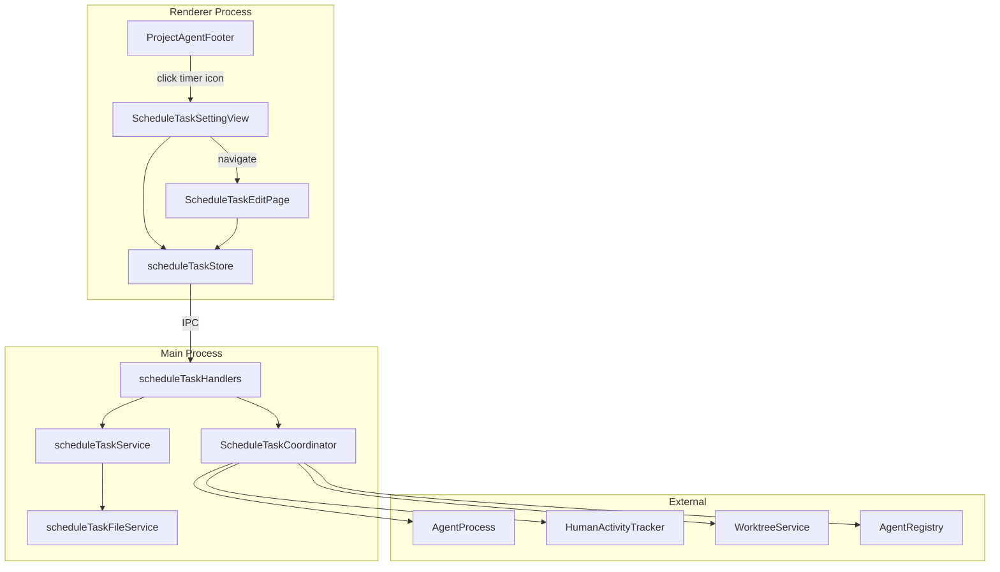
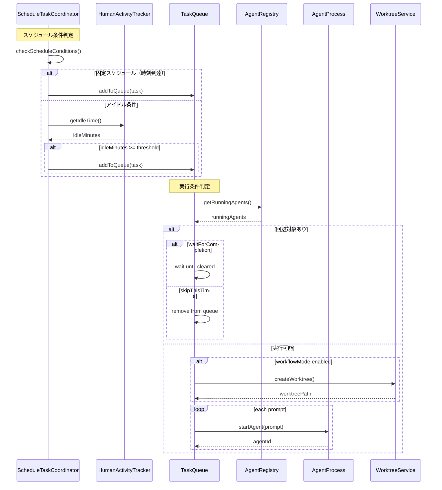
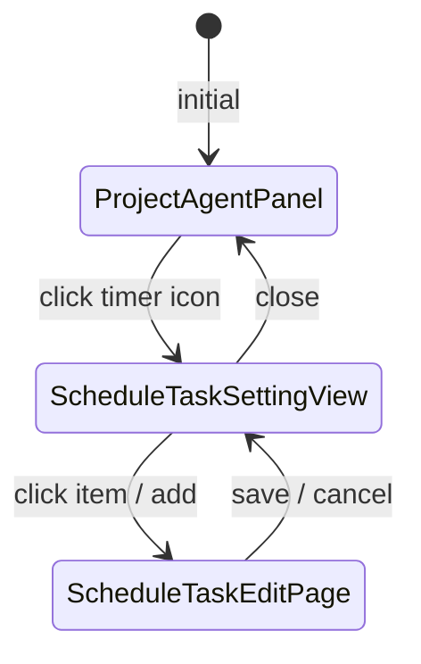
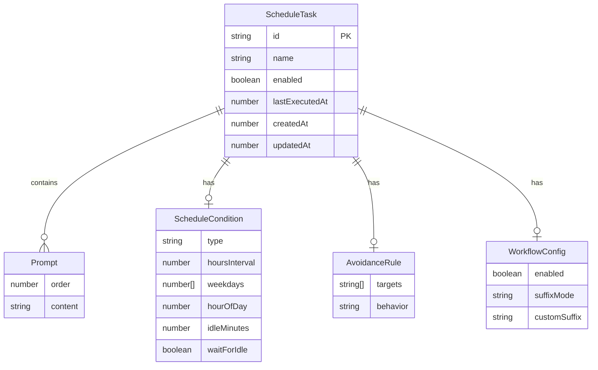

# Design: Schedule Task Execution

## Overview

**Purpose**: スケジュールタスク実行機能は、ユーザーがプロジェクト単位で定期実行タスクを定義し、時間ベースまたは条件ベースでClaude Codeを自動起動してプロンプトを実行する仕組みを提供する。

**Users**: プロジェクト開発者がこの機能を使用し、定期メンテナンス、自動レビュー、リマインダー的なタスクを自動化する。

**Impact**: 既存のProjectAgentパネルにタイマーアイコンを追加し、スケジュールタスク管理UIへのアクセスポイントを提供する。Main Processに新しいScheduleTaskCoordinatorサービスを追加し、humanActivityTrackerとの連携でアイドル検出を実現する。

### Goals

- プロジェクト単位でスケジュールタスクを登録・管理できる
- 固定スケジュール（時間経過/曜日時刻）と条件スケジュール（アイドル時間）の両方をサポート
- 回避ルールにより他Agent動作中の実行制御が可能
- workflowモードでworktreeを自動作成して実行可能

### Non-Goals

- 実行履歴の詳細保存・閲覧（最終実行開始時間のみ記録）
- プロンプト内の変数/プレースホルダー機能
- グローバル（アプリ全体）でのスケジュールタスク管理
- 複数スケジュール条件のAND/OR組み合わせ（1タスク1スケジュール）
- worktree実行後の自動クリーンアップ

## Architecture

### Existing Architecture Analysis

**Electron構造**:
- Main Process: サービス、IPCハンドラ、ファイル監視
- Renderer Process: React + Zustand stores
- IPC通信: contextBridge + preload経由

**関連する既存サービス**:
- `autoExecutionCoordinator.ts`: Spec自動実行のSSoT（パターン参考）
- `humanActivityTracker.ts`: アイドル検出の既存実装（統合対象）
- `agentProcess.ts`: Agent起動・監視（再利用）
- `agentRegistry.ts`: 実行中Agent管理（統合）
- `worktreeService.ts`: Git Worktree操作（再利用）

**既存パターン**:
- IPCチャンネル定義: `channels.ts`
- 状態管理: Main ProcessがSSoT、RendererはIPC経由でアクセス
- ダイアログUI: スライドナビゲーション（CreateSpecDialogと同様のパターン）

### Architecture Pattern & Boundary Map



**Architecture Integration**:
- Selected pattern: Main Process SSoT + Event-driven（AutoExecutionCoordinatorと同様）
- Domain boundaries: スケジュール管理とAgent実行を分離、タスク定義はプロジェクトファイルに永続化
- Existing patterns preserved: IPC通信パターン、Zustand store構成、ダイアログUI設計
- New components rationale: ScheduleTaskCoordinatorはスケジューリングロジックを集約し、既存のAgentProcessを再利用
- Steering compliance: Main Process SSoT原則、DRY（既存サービス再利用）

### Technology Stack

| Layer | Choice / Version | Role in Feature | Notes |
|-------|------------------|-----------------|-------|
| Frontend | React 19 + Zustand | UI状態管理、ダイアログ表示 | 既存パターン踏襲 |
| Backend | Node.js (Electron 35) | スケジュール管理、Agent起動 | Main ProcessがSSoT |
| Data | JSON file + electron-store | タスク定義永続化 | `.kiro/schedule-tasks.json` |
| Messaging | IPC (contextBridge) | Renderer-Main通信 | 既存パターン踏襲 |

## System Flows

### スケジュールタスク実行フロー



**Key Decisions**:
- キューイング条件と実行条件を分離（Requirement 10.1）
- 回避ルールは実行条件判定時にチェック
- 複数プロンプトは各々別Agentで起動

### UI遷移フロー



## Requirements Traceability

| Criterion ID | Summary | Components | Implementation Approach |
|--------------|---------|------------|------------------------|
| 1.1 | タイマーアイコンクリックでダイアログ表示 | ProjectAgentFooter, ScheduleTaskSettingView | 新規: アイコン追加、ダイアログ実装 |
| 1.2 | ScheduleTaskSettingView構成 | ScheduleTaskSettingView, ScheduleTaskHeader, ScheduleTaskList, ScheduleTaskFooter | 新規: コンポーネント一式 |
| 1.3 | ScheduleTaskListItem情報表示 | ScheduleTaskListItem | 新規: タスク情報表示 |
| 1.4 | リストアイテムクリックで編集画面へ遷移 | ScheduleTaskSettingView, ScheduleTaskEditPage | 新規: スライドナビゲーション |
| 1.5 | 削除確認ダイアログ | ScheduleTaskListItem, DeleteConfirmDialog | 既存パターン流用 |
| 1.6 | 有効/無効トグル即時更新 | ScheduleTaskListItem, scheduleTaskStore | 新規: インラインToggle |
| 2.1 | Spec/Bug新規作成と同様のレイアウト | ScheduleTaskEditPage | 新規: 既存レイアウト踏襲 |
| 2.2 | 編集項目一覧 | ScheduleTaskEditPage | 新規: フォーム項目一式 |
| 2.3 | 新規作成時の空フォーム表示 | ScheduleTaskEditPage | 新規: 新規作成モード |
| 2.4 | バリデーションと保存 | ScheduleTaskEditPage, scheduleTaskService | 新規: Zodバリデーション |
| 3.1 | 前回実行からn時間経過パターン | ScheduleTaskEditPage, ScheduleTaskCoordinator | 新規: スケジュール設定UI + 判定ロジック |
| 3.2 | 毎週n曜日のn時パターン | ScheduleTaskEditPage, ScheduleTaskCoordinator | 新規: 曜日・時刻選択UI + 判定ロジック |
| 3.3 | アイドル後に実行オプション | ScheduleTaskEditPage, ScheduleTaskCoordinator | 新規: オプション + 待機ロジック |
| 4.1 | アイドルn分経過パターン | ScheduleTaskEditPage, ScheduleTaskCoordinator | 新規: 分指定UI + humanActivityTracker統合 |
| 4.2 | アイドル時間分単位指定 | ScheduleTaskEditPage | 新規: 分単位入力 |
| 4.3 | アイドル検出時キュー追加 | ScheduleTaskCoordinator, humanActivityTracker | 新規: 統合ロジック |
| 5.1 | 複数プロンプト登録 | ScheduleTaskEditPage, PromptListEditor | 新規: 複数登録UI |
| 5.2 | プロンプト個別編集・削除 | PromptListEditor | 新規: CRUD UI |
| 5.3 | プロンプト順序変更 | PromptListEditor | 新規: 並べ替えUI |
| 5.4 | プロンプトごとにAgent起動 | ScheduleTaskCoordinator, AgentProcess | 新規: 複数起動ロジック |
| 5.5 | 並列実行可能 | ScheduleTaskCoordinator | 新規: 並列フラグ対応 |
| 6.1 | 回避対象指定 | ScheduleTaskEditPage, AvoidanceRuleEditor | 新規: 選択UI |
| 6.2 | 回避時挙動指定 | ScheduleTaskEditPage, AvoidanceRuleEditor | 新規: 選択UI |
| 6.3 | 回避対象動作中の挙動 | ScheduleTaskCoordinator, AgentRegistry | 新規: 判定・待機/スキップロジック |
| 7.1 | 即時実行ボタン | ScheduleTaskListItem, ScheduleTaskEditPage | 新規: 即時実行ボタン |
| 7.2 | 即時実行時回避ルール非適用 | ScheduleTaskCoordinator | 新規: 即時実行フラグ |
| 7.3 | 警告ダイアログ表示 | ImmediateExecutionWarningDialog | 新規: 警告ダイアログ |
| 7.4 | 選択肢提供 | ImmediateExecutionWarningDialog | 新規: 実行/キャンセルボタン |
| 7.5 | 強制実行 | ScheduleTaskCoordinator | 新規: 強制実行フラグ |
| 8.1 | workflowモード切替 | ScheduleTaskEditPage | 新規: Toggle UI |
| 8.2 | worktree自動作成 | ScheduleTaskCoordinator, WorktreeService | 既存: WorktreeService再利用 |
| 8.3 | 命名規則 | ScheduleTaskCoordinator | 新規: 命名ロジック |
| 8.4 | ユーザー指定suffix | ScheduleTaskEditPage, ScheduleTaskCoordinator | 新規: suffix入力 + 日時付加 |
| 8.5 | 複数プロンプト別worktree | ScheduleTaskCoordinator | 新規: 複数worktree作成 |
| 8.6 | 実行後worktree放置 | ScheduleTaskCoordinator | 設計決定: システム非介入 |
| 9.1 | プロジェクト内ファイル保存 | scheduleTaskFileService | 新規: JSONファイル読み書き |
| 9.2 | Electronローカルストレージ同期 | scheduleTaskStore, electron-store | 新規: 同期ロジック |
| 9.3 | プロジェクト開始時整合性確認 | scheduleTaskService | 新規: 整合性チェック |
| 9.4 | 最終実行開始時間記録 | ScheduleTaskCoordinator, scheduleTaskFileService | 新規: 実行時更新 |
| 10.1 | キューイング条件と実行条件分離 | ScheduleTaskCoordinator | 新規: Queue管理 |
| 10.2 | 固定スケジュール時刻でキュー追加 | ScheduleTaskCoordinator | 新規: 時刻監視 |
| 10.3 | アイドル条件でキュー追加 | ScheduleTaskCoordinator, humanActivityTracker | 新規: アイドル監視 |
| 10.4 | 実行条件満たしたら実行 | ScheduleTaskCoordinator | 新規: 実行条件判定 |
| 10.5 | アイドル後に実行オプション待機 | ScheduleTaskCoordinator | 新規: 待機ロジック |

### Coverage Validation Checklist

- [x] Every criterion ID from requirements.md appears in the table above
- [x] Each criterion has specific component names (not generic references)
- [x] Implementation approach distinguishes "reuse existing" vs "new implementation"
- [x] User-facing criteria specify concrete UI components

## Components and Interfaces

| Component | Domain/Layer | Intent | Req Coverage | Key Dependencies | Contracts |
|-----------|--------------|--------|--------------|------------------|-----------|
| ScheduleTaskSettingView | UI/Renderer | スケジュールタスク管理ダイアログのルートビュー | 1.1, 1.2, 1.4 | scheduleTaskStore (P0) | State |
| ScheduleTaskEditPage | UI/Renderer | タスク新規作成・編集フォーム | 2.1-2.4, 3.1-3.3, 4.1-4.2, 5.1-5.3, 6.1-6.2, 7.1, 8.1-8.4 | scheduleTaskStore (P0) | State |
| ScheduleTaskListItem | UI/Renderer | タスク一覧の各アイテム表示 | 1.3, 1.5, 1.6, 7.1 | scheduleTaskStore (P0) | State |
| PromptListEditor | UI/Renderer | 複数プロンプトの編集UI | 5.1-5.3 | - | - |
| AvoidanceRuleEditor | UI/Renderer | 回避ルール設定UI | 6.1-6.2 | - | - |
| ImmediateExecutionWarningDialog | UI/Renderer | 即時実行警告ダイアログ | 7.3, 7.4 | - | - |
| scheduleTaskStore | State/Renderer | Renderer側状態管理（UIキャッシュ） | 全UI | scheduleTaskHandlers (P0) | State |
| ScheduleTaskCoordinator | Service/Main | スケジュール管理のSSoT | 3.1-3.3, 4.1-4.3, 5.4-5.5, 6.3, 7.2, 7.5, 8.2-8.6, 10.1-10.5 | AgentProcess (P0), humanActivityTracker (P0), AgentRegistry (P0), WorktreeService (P1) | Service, Event |
| scheduleTaskService | Service/Main | タスクCRUD操作 | 2.4, 9.3 | scheduleTaskFileService (P0) | Service |
| scheduleTaskFileService | Service/Main | ファイル永続化 | 9.1, 9.4 | FileService (P0) | Service |
| scheduleTaskHandlers | IPC/Main | IPCハンドラ | 全IPC | ScheduleTaskCoordinator (P0), scheduleTaskService (P0) | API |

### Service Layer

#### ScheduleTaskCoordinator

| Field | Detail |
|-------|--------|
| Intent | スケジュールタスク実行の中央制御、キュー管理、実行条件判定 |
| Requirements | 3.1-3.3, 4.1-4.3, 5.4-5.5, 6.3, 7.2, 7.5, 8.2-8.6, 10.1-10.5 |

**Responsibilities & Constraints**
- スケジュール条件の定期チェック（1分間隔）
  - **注意**: 1分間隔のチェックにより、固定スケジュール（曜日・時刻指定）では最大1分の遅延が発生しうる。これは許容範囲として設計されている
- タスクキューの管理（キューイング条件と実行条件の分離）
- 回避ルールの判定と待機/スキップ処理
- Agent起動の委譲（AgentProcess経由）
- humanActivityTrackerとの統合によるアイドル検出
- 最終実行時間の記録

**Dependencies**
- Inbound: scheduleTaskHandlers - IPC経由でのタスク操作 (P0)
- Outbound: AgentProcess - Agent起動 (P0)
- Outbound: humanActivityTracker - アイドル時間取得 (P0)
- Outbound: AgentRegistry - 実行中Agent確認 (P0)
- Outbound: WorktreeService - worktree作成 (P1)
- Outbound: scheduleTaskFileService - 最終実行時間記録 (P0)

**Contracts**: Service [x] / API [ ] / Event [x] / Batch [ ] / State [ ]

##### Service Interface

```typescript
interface ScheduleTaskCoordinatorService {
  // 初期化
  initialize(projectPath: string): Promise<void>;

  // スケジュール管理
  startScheduler(): void;
  stopScheduler(): void;

  // キュー操作
  getQueuedTasks(): ReadonlyArray<QueuedTask>;
  clearQueue(): void;

  // 即時実行
  executeImmediately(taskId: string, force?: boolean): Promise<Result<ExecutionResult, ExecutionError>>;

  // 状態取得
  getRunningTasks(): ReadonlyArray<RunningTaskInfo>;

  // 処分
  dispose(): void;
}

interface QueuedTask {
  taskId: string;
  queuedAt: number;
  reason: 'schedule' | 'idle';
}

interface RunningTaskInfo {
  taskId: string;
  promptIndex: number;
  agentId: string;
  worktreePath?: string;
}

type ExecutionResult = {
  taskId: string;
  startedAt: number;
  agentIds: string[];
};

type ExecutionError =
  | { type: 'TASK_NOT_FOUND'; taskId: string }
  | { type: 'ALREADY_RUNNING'; taskId: string }
  | { type: 'AVOIDANCE_CONFLICT'; conflictType: AvoidanceTarget }
  | { type: 'AGENT_START_FAILED'; message: string };
```

- Preconditions: projectPathが有効なKiroプロジェクトであること
- Postconditions: dispose()後はすべてのタイマーがクリアされる
- Invariants: 1タスクにつき同時に1つの実行のみ

##### Event Contract

- Published events:
  - `task-queued`: タスクがキューに追加された
  - `task-started`: タスク実行開始
  - `task-completed`: タスク実行完了
  - `task-skipped`: タスクがスキップされた
  - `avoidance-waiting`: 回避ルールにより待機中
- Subscribed events: なし
- Ordering: 同一タスクに対するイベントは時系列順を保証

#### scheduleTaskService

| Field | Detail |
|-------|--------|
| Intent | スケジュールタスクのCRUD操作とバリデーション |
| Requirements | 2.4, 9.3 |

**Responsibilities & Constraints**
- タスク定義のバリデーション（Zod）
- タスクの作成・読取・更新・削除
- プロジェクト開始時の整合性チェック

**Dependencies**
- Inbound: scheduleTaskHandlers - IPC経由 (P0)
- Outbound: scheduleTaskFileService - 永続化 (P0)

**Contracts**: Service [x] / API [ ] / Event [ ] / Batch [ ] / State [ ]

##### Service Interface

```typescript
interface ScheduleTaskServiceInterface {
  // CRUD
  createTask(projectPath: string, task: ScheduleTaskInput): Promise<Result<ScheduleTask, ValidationError>>;
  updateTask(projectPath: string, taskId: string, updates: Partial<ScheduleTaskInput>): Promise<Result<ScheduleTask, ValidationError>>;
  deleteTask(projectPath: string, taskId: string): Promise<Result<void, TaskNotFoundError>>;
  getTask(projectPath: string, taskId: string): Promise<ScheduleTask | null>;
  getAllTasks(projectPath: string): Promise<ScheduleTask[]>;

  // 整合性チェック
  validateConsistency(projectPath: string): Promise<ConsistencyResult>;
}

type ValidationError = {
  type: 'VALIDATION_ERROR';
  errors: Array<{ field: string; message: string }>;
};

type TaskNotFoundError = {
  type: 'TASK_NOT_FOUND';
  taskId: string;
};

type ConsistencyResult = {
  isConsistent: boolean;
  issues?: string[];
};
```

#### scheduleTaskFileService

| Field | Detail |
|-------|--------|
| Intent | スケジュールタスク設定のファイル永続化 |
| Requirements | 9.1, 9.4 |

**Responsibilities & Constraints**
- `.kiro/schedule-tasks.json` の読み書き
- 最終実行開始時間の記録
- ファイルの原子的更新

**Dependencies**
- Inbound: scheduleTaskService - 呼び出し (P0)
- Inbound: ScheduleTaskCoordinator - 最終実行時間更新 (P0)
- Outbound: fs - ファイル操作 (P0)

**Contracts**: Service [x] / API [ ] / Event [ ] / Batch [ ] / State [ ]

##### Service Interface

```typescript
interface ScheduleTaskFileServiceInterface {
  // ファイル操作
  readTasks(projectPath: string): Promise<ScheduleTasksFile>;
  writeTasks(projectPath: string, tasks: ScheduleTasksFile): Promise<void>;

  // 最終実行時間
  updateLastExecutedAt(projectPath: string, taskId: string, timestamp: number): Promise<void>;
}

interface ScheduleTasksFile {
  version: 1;
  tasks: ScheduleTask[];
}
```

### UI Layer

#### ScheduleTaskSettingView

| Field | Detail |
|-------|--------|
| Intent | スケジュールタスク管理ダイアログのルートビュー |
| Requirements | 1.1, 1.2, 1.4 |

**Responsibilities & Constraints**
- ダイアログ全体のレイアウト管理
- タスク一覧の表示
- 編集画面へのスライドナビゲーション

**Dependencies**
- Inbound: ProjectAgentFooter - タイマーアイコンクリック (P0)
- Outbound: scheduleTaskStore - 状態取得 (P0)

**Contracts**: Service [ ] / API [ ] / Event [ ] / Batch [ ] / State [x]

##### State Management

- State model: `{ tasks: ScheduleTask[], isEditPageOpen: boolean, editingTask: ScheduleTask | null }`
- Persistence: Zustand store経由でIPC
- Concurrency: 単一ウィンドウ内での操作想定

**Implementation Notes**
- Integration: CreateSpecDialogと同様のスライドナビゲーションパターン
- Validation: なし（編集画面で実施）
- Risks: 大量タスク時のリスト描画パフォーマンス

#### ScheduleTaskEditPage

| Field | Detail |
|-------|--------|
| Intent | タスクの新規作成・編集フォーム |
| Requirements | 2.1-2.4, 3.1-3.3, 4.1-4.2, 5.1-5.3, 6.1-6.2, 7.1, 8.1-8.4 |

**Responsibilities & Constraints**
- フォーム入力の管理
- バリデーションエラーの表示
- 保存・キャンセル操作

**Dependencies**
- Inbound: ScheduleTaskSettingView - 遷移 (P0)
- Outbound: scheduleTaskStore - CRUD (P0)

**Contracts**: Service [ ] / API [ ] / Event [ ] / Batch [ ] / State [x]

**Implementation Notes**
- Integration: Spec/Bug新規作成と同様のレイアウト構成
- Validation: Zodスキーマによるクライアントサイドバリデーション
- Risks: 複雑なフォーム状態管理

### IPC Layer

#### scheduleTaskHandlers

| Field | Detail |
|-------|--------|
| Intent | スケジュールタスク関連のIPCハンドラ |
| Requirements | 全IPC通信 |

**Responsibilities & Constraints**
- IPCチャンネル登録
- リクエストの検証と転送
- レスポンスの整形

**Dependencies**
- Inbound: Renderer - IPC呼び出し (P0)
- Outbound: ScheduleTaskCoordinator - 実行操作 (P0)
- Outbound: scheduleTaskService - CRUD操作 (P0)

**Contracts**: Service [ ] / API [x] / Event [ ] / Batch [ ] / State [ ]

##### API Contract

| Method | Channel | Request | Response | Errors |
|--------|---------|---------|----------|--------|
| invoke | schedule-task:get-all | { projectPath: string } | ScheduleTask[] | - |
| invoke | schedule-task:get | { projectPath: string, taskId: string } | ScheduleTask | null | - |
| invoke | schedule-task:create | { projectPath: string, task: ScheduleTaskInput } | Result<ScheduleTask, ValidationError> | 400 |
| invoke | schedule-task:update | { projectPath: string, taskId: string, updates: Partial<ScheduleTaskInput> } | Result<ScheduleTask, ValidationError> | 400, 404 |
| invoke | schedule-task:delete | { projectPath: string, taskId: string } | Result<void, TaskNotFoundError> | 404 |
| invoke | schedule-task:execute-immediately | { projectPath: string, taskId: string, force?: boolean } | Result<ExecutionResult, ExecutionError> | 400, 409 |
| invoke | schedule-task:get-queue | { projectPath: string } | QueuedTask[] | - |
| invoke | schedule-task:get-running | { projectPath: string } | RunningTaskInfo[] | - |
| on | schedule-task:status-changed | - | ScheduleTaskStatusEvent | - |

## Data Models

### Domain Model



**Aggregates**:
- ScheduleTask: タスク定義の集約ルート
- プロンプト、条件、回避ルール、ワークフロー設定はScheduleTaskに所属

**Business Rules**:
- タスク名は必須かつプロジェクト内で一意
- スケジュール条件は1タスクにつき1つ
- プロンプトは1つ以上必須
- 回避対象は定義された4種類から選択

### Logical Data Model

**Structure Definition**:

```typescript
// スケジュールタスク定義
interface ScheduleTask {
  id: string;                      // UUID
  name: string;                    // タスク名（必須）
  enabled: boolean;                // 有効/無効
  schedule: ScheduleCondition;     // スケジュール条件
  prompts: Prompt[];               // プロンプト一覧（1つ以上）
  avoidance: AvoidanceRule;        // 回避ルール
  workflow: WorkflowConfig;        // workflowモード設定
  behavior: AgentBehavior;         // 他Agent動作中の挙動
  lastExecutedAt: number | null;   // 最終実行開始時刻（Unix ms）
  createdAt: number;               // 作成日時
  updatedAt: number;               // 更新日時
}

// スケジュール条件（Union型）
type ScheduleCondition =
  | { type: 'interval'; hoursInterval: number; waitForIdle: boolean }
  | { type: 'weekly'; weekdays: number[]; hourOfDay: number; waitForIdle: boolean }
  | { type: 'idle'; idleMinutes: number };

// プロンプト
interface Prompt {
  order: number;                   // 実行順序
  content: string;                 // プロンプト内容
}

// 回避ルール
interface AvoidanceRule {
  targets: AvoidanceTarget[];      // 回避対象
  behavior: AvoidanceBehavior;     // 回避時の挙動
}

type AvoidanceTarget = 'spec-merge' | 'commit' | 'bug-merge' | 'schedule-task';
type AvoidanceBehavior = 'wait' | 'skip';

// workflowモード設定
interface WorkflowConfig {
  enabled: boolean;                // workflowモード有効/無効
  suffixMode: 'auto' | 'custom';   // suffix生成モード
  customSuffix?: string;           // カスタムsuffix（suffixMode='custom'時）
}

// 他Agent動作中の挙動
type AgentBehavior = 'wait' | 'skip';

// 入力用（IDと日時フィールドなし）
type ScheduleTaskInput = Omit<ScheduleTask, 'id' | 'lastExecutedAt' | 'createdAt' | 'updatedAt'>;
```

**Consistency & Integrity**:
- ファイル書き込みは一時ファイル経由でアトミック更新
- プロジェクト開始時にファイルとelectron-storeの整合性チェック

### Physical Data Model

**For JSON File** (`.kiro/schedule-tasks.json`):

```json
{
  "version": 1,
  "tasks": [
    {
      "id": "uuid-1234",
      "name": "定期ステアリング更新",
      "enabled": true,
      "schedule": {
        "type": "interval",
        "hoursInterval": 168,
        "waitForIdle": true
      },
      "prompts": [
        { "order": 0, "content": "/kiro:steering" }
      ],
      "avoidance": {
        "targets": ["spec-merge", "bug-merge"],
        "behavior": "wait"
      },
      "workflow": {
        "enabled": false
      },
      "behavior": "wait",
      "lastExecutedAt": 1706140800000,
      "createdAt": 1706054400000,
      "updatedAt": 1706140800000
    }
  ]
}
```

**For electron-store** (同期用キャッシュ):
- キー: `scheduleTasksCache.{projectPath}`
- 値: `ScheduleTasksFile` と同一構造

## Error Handling

### Error Strategy

- ユーザーエラー: フォームバリデーションで即時フィードバック
- システムエラー: トースト通知（`shared/components/ui/Toast.tsx`） + ログ記録
- Agent実行エラー: トースト通知で表示、実行ログに記録、次回スケジュールで再試行

### Error Categories and Responses

**User Errors (4xx)**:
- バリデーションエラー → フィールド別エラーメッセージ表示
- 重複タスク名 → 「既に同名のタスクが存在します」

**System Errors (5xx)**:
- ファイル書き込み失敗 → 通知 + リトライ促進
- Agent起動失敗 → 通知 + ログ記録

**Business Logic Errors (422)**:
- 回避対象競合 → 設定に応じて待機/スキップ、ログ記録
- 既に実行中 → 「タスクは既に実行中です」

### Monitoring

- Main Processログにスケジュール実行結果を記録
- 実行エラー時はlogger.error出力

## Testing Strategy

### Unit Tests

- ScheduleTaskCoordinator: スケジュール条件判定、回避ルール判定、キュー管理
- scheduleTaskService: バリデーション、CRUD操作
- scheduleTaskFileService: ファイル読み書き、アトミック更新

### Integration Tests

- ScheduleTaskCoordinator + humanActivityTracker: アイドル検出連携
- ScheduleTaskCoordinator + AgentProcess: Agent起動フロー
- scheduleTaskService + scheduleTaskFileService: 永続化フロー

### E2E Tests

- タスク作成 → 保存 → 一覧表示 → 編集 → 削除
- 即時実行 → Agent起動確認
- タスク有効/無効トグル

## Design Decisions

### DD-001: スケジュール管理をMain ProcessのSSoTとする

| Field | Detail |
|-------|--------|
| Status | Accepted |
| Context | スケジュールタスクの実行状態をどこで管理するか |
| Decision | Main Process側にScheduleTaskCoordinatorを配置し、SSoT（Single Source of Truth）とする |
| Rationale | AutoExecutionCoordinatorと同様のパターン。Rendererクラッシュ耐性、複数ウィンドウ対応、タイマー処理はNode.jsが適切 |
| Alternatives Considered | Renderer側でsetInterval - クラッシュ時に実行継続不可、バックグラウンド実行困難 |
| Consequences | IPC通信が増加するが、信頼性と一貫性を優先 |

### DD-002: humanActivityTrackerとの統合方式

| Field | Detail |
|-------|--------|
| Status | Accepted |
| Context | アイドル検出の既存実装（Renderer側）をどのように利用するか |
| Decision | humanActivityTrackerの最終アクティビティ時刻をMain Processに定期同期し、Main側でアイドル時間を計算 |
| Rationale | humanActivityTrackerはRenderer側に存在するが、スケジュール判定はMain側で行う必要がある。IPCで状態を同期することで、既存実装を活かしつつMain側での判定を実現 |
| Alternatives Considered | Main側で独自にアイドル検出 - 重複実装、ウィンドウフォーカス検出が困難 |
| Consequences | Renderer-Main間の同期頻度設計が必要。Requirements 4.3 |

### DD-003: 回避ルールの判定タイミング

| Field | Detail |
|-------|--------|
| Status | Accepted |
| Context | 回避対象（spec-merge等）の動作状況をいつ確認するか |
| Decision | 実行条件判定時（キューから取り出す際）にAgentRegistryを確認 |
| Rationale | キューイング時に判定すると、待機中に状況が変わる可能性がある。実行直前に判定することで最新の状態を反映 |
| Alternatives Considered | キューイング時に判定 - 待機中の状態変化に対応不可 |
| Consequences | 待機時の再チェック間隔設計が必要。Requirements 6.3 |

### DD-004: プロジェクトファイル + electron-store の二重永続化

| Field | Detail |
|-------|--------|
| Status | Accepted |
| Context | スケジュールタスク設定の保存場所 |
| Decision | `.kiro/schedule-tasks.json` をマスターとし、electron-storeにキャッシュを保持 |
| Rationale | プロジェクトファイルはバージョン管理可能、チーム共有可能。electron-storeはアプリ起動時の高速読み込みに使用 |
| Alternatives Considered | electron-storeのみ - プロジェクト移動時にデータ消失 |
| Consequences | 同期タイミングと競合解決の設計が必要。Requirements 9.2, 9.3 |

**同期タイミング**:
- **保存時**: ファイル（`.kiro/schedule-tasks.json`）への書き込み成功後、即座にelectron-storeのキャッシュを更新
- **プロジェクト開始時**: ファイルから読み込み、electron-storeのキャッシュに反映

**競合解決ルール**:
- プロジェクト内ファイル（`.kiro/schedule-tasks.json`）を常にマスター（Single Source of Truth）とする
- electron-storeはあくまでキャッシュであり、ファイルが存在する場合は常にファイルの内容を優先
- ファイルが存在しない場合のみelectron-storeのキャッシュを使用（フォールバック）

### DD-005: 複数プロンプトの実行方式

| Field | Detail |
|-------|--------|
| Status | Accepted |
| Context | 1タスクに複数プロンプトがある場合の実行方法 |
| Decision | 各プロンプトごとに別々のAgentを起動。条件と許可フラグ次第で並列実行可能 |
| Rationale | プロンプト間の独立性を保証。1つの失敗が他に影響しない。並列実行により効率化も可能 |
| Alternatives Considered | 単一Agentで順次実行 - 1つの失敗で全体停止、長時間Agent占有 |
| Consequences | 並列実行時のリソース使用量増加。Requirements 5.4, 5.5 |

### DD-006: worktree命名規則

| Field | Detail |
|-------|--------|
| Status | Accepted |
| Context | workflowモード時のworktree命名方法 |
| Decision | `schedule/{task-name}/{suffix}` 形式。suffixは自動生成（日時）またはユーザー指定+日時 |
| Rationale | 複数プロンプトで別worktreeを使用するため、タスク名でグループ化。日時suffixで一意性保証 |
| Alternatives Considered | フラットな命名 - 多数worktree時に管理困難 |
| Consequences | worktree一覧のフィルタリング機能が必要になる可能性。Requirements 8.3, 8.4 |

## Integration & Deprecation Strategy

### 既存ファイル修正（Wiring Points）

| ファイル | 修正内容 | Requirements |
|---------|---------|--------------|
| `src/renderer/components/ProjectAgentFooter.tsx` | タイマーアイコンボタン追加 | 1.1 |
| `src/renderer/components/index.ts` | ScheduleTask関連コンポーネントexport追加 | 全UI |
| `src/renderer/stores/index.ts` | scheduleTaskStore export追加 | 全UI |
| `src/main/ipc/channels.ts` | schedule-task:* チャンネル定義追加 | 全IPC |
| `src/main/ipc/handlers.ts` | scheduleTaskHandlers登録追加 | 全IPC |
| `src/preload/index.ts` | scheduleTask関連API公開 | 全IPC |
| `src/renderer/hooks/useHumanActivity.ts` | Main Processへのアイドル時間同期追加 | 4.3 |

### 新規ファイル作成

| パス | 内容 |
|-----|------|
| `src/renderer/components/schedule/ScheduleTaskSettingView.tsx` | 管理ダイアログビュー |
| `src/renderer/components/schedule/ScheduleTaskEditPage.tsx` | 編集フォーム |
| `src/renderer/components/schedule/ScheduleTaskListItem.tsx` | リストアイテム |
| `src/renderer/components/schedule/ScheduleTaskHeader.tsx` | ヘッダー |
| `src/renderer/components/schedule/ScheduleTaskFooter.tsx` | フッター |
| `src/renderer/components/schedule/PromptListEditor.tsx` | プロンプト編集UI |
| `src/renderer/components/schedule/AvoidanceRuleEditor.tsx` | 回避ルール設定UI |
| `src/renderer/components/schedule/ImmediateExecutionWarningDialog.tsx` | 警告ダイアログ |
| `src/renderer/stores/scheduleTaskStore.ts` | Renderer側状態管理 |
| `src/main/services/scheduleTaskCoordinator.ts` | スケジュール管理SSoT |
| `src/main/services/scheduleTaskService.ts` | タスクCRUDサービス |
| `src/main/services/scheduleTaskFileService.ts` | ファイル永続化サービス |
| `src/main/ipc/scheduleTaskHandlers.ts` | IPCハンドラ |
| `src/shared/types/scheduleTask.ts` | 型定義 |

### 削除対象ファイル

なし（新規機能のため既存ファイルの削除は不要）
