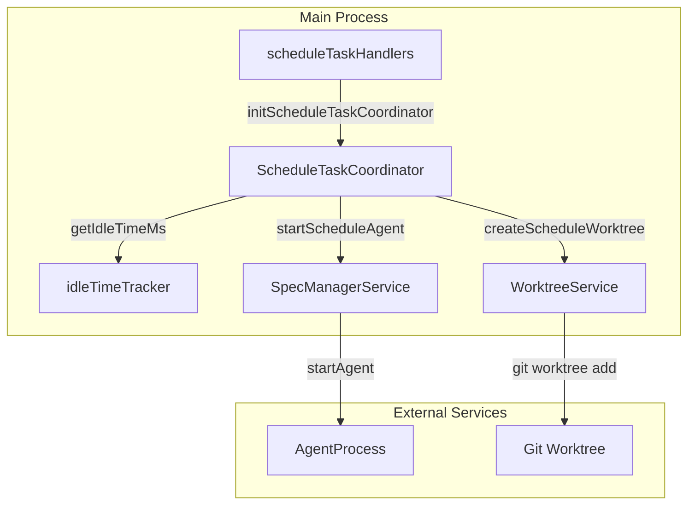
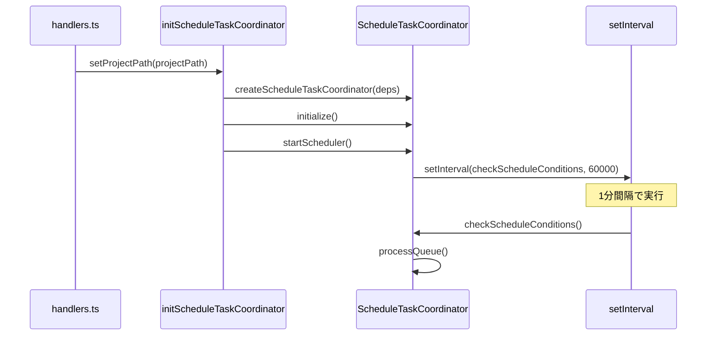
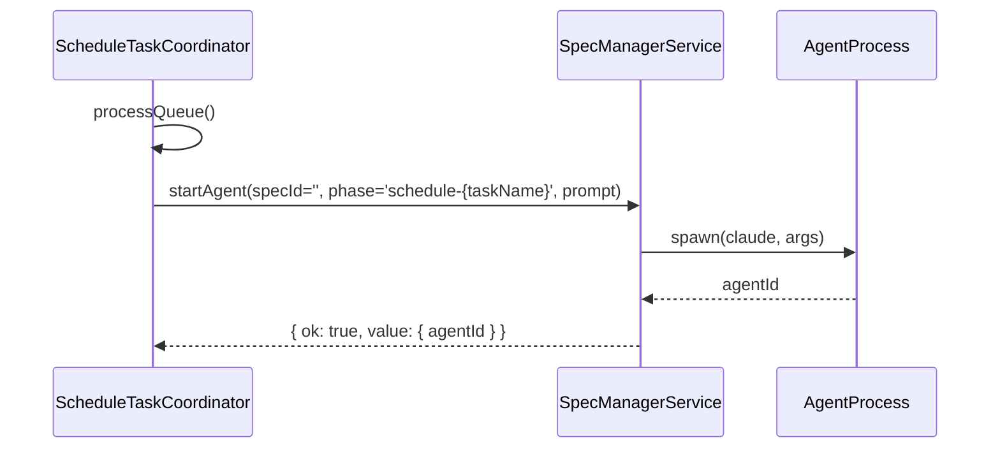

# Design: Schedule Task Scheduler Activation

## Overview

**Purpose**: この機能は、`schedule-task-execution` Specで設計・実装されたスケジュールタスク機能の実装漏れを完成させ、スケジュールタスクが実際に動作するようにする。

**Users**: システム管理者および開発者がスケジュールタスクを設定した場合、ユーザーの追加操作なしで自動実行される。

**Impact**: 既存の`initScheduleTaskCoordinator`関数を修正し、`startScheduler()`呼び出しと必要な依存関係注入を追加する。変更はMain Process側のみで、UI変更は不要。

### Goals

- プロジェクト選択時にスケジューラーを自動開始する
- `idleTimeTracker`との統合によりアイドル時間を正確に取得する
- `SpecManagerService.startAgent()`を使用してAgent起動を実装する
- `WorktreeService`を使用してworktree作成を実装する

### Non-Goals

- UIの変更（既存UIはそのまま使用）
- スケジュールタスクの新規機能追加
- 既存の`schedule-task-execution` Specのドキュメント修正
- E2Eテスト（ユニット/統合テストのみ）

## Architecture

### Existing Architecture Analysis

**現状の問題点**:
1. `initScheduleTaskCoordinator()`で`startScheduler()`が呼ばれていない
2. `getIdleTimeMs`依存関係がスタブ実装（常に0を返す）
3. `startScheduleAgent`と`createScheduleWorktree`依存関係が未注入

**既存コンポーネント**:
- `ScheduleTaskCoordinator`: スケジュール管理のSSoT（実装済み）
- `idleTimeTracker`: アイドル時間追跡（実装済み）
- `SpecManagerService.startAgent()`: Agent起動（実装済み）
- `WorktreeService`: Worktree操作（実装済み）

### Architecture Pattern & Boundary Map



**Key Design Decisions**:
- 既存サービスの再利用によりDRY原則を遵守
- 依存性注入パターンを維持してテスト容易性を確保
- `startScheduler()`は`initialize()`の後に自動呼び出し

### Technology Stack

| Layer | Choice / Version | Role in Feature | Notes |
|-------|------------------|-----------------|-------|
| Backend | Node.js (Electron 35) | スケジューラー実行、Agent起動 | 既存インフラ使用 |
| Service | SpecManagerService | Agent起動の委譲先 | 既存API再利用 |
| Service | WorktreeService | Worktree作成の委譲先 | 既存API再利用 |
| Service | idleTimeTracker | アイドル時間取得 | 既存実装統合 |

## System Flows

### スケジューラー自動開始フロー



**Key Decisions**:
- `startScheduler()`は`initScheduleTaskCoordinator`内で自動呼び出し
- プロジェクト変更時は既存スケジューラーを停止してから新規開始
- 1分間隔のチェックは既存設計を踏襲

### Agent起動フロー



**Key Decisions**:
- `specId=''`でプロジェクトレベルAgentとして起動
- `phase`に`schedule-{taskName}`を設定してUI上で識別可能に
- 既存の`startAgent`インターフェースを完全再利用

## Requirements Traceability

| Criterion ID | Summary | Components | Implementation Approach |
|--------------|---------|------------|------------------------|
| 1.1 | initScheduleTaskCoordinatorでstartScheduler呼び出し | scheduleTaskHandlers.initScheduleTaskCoordinator | 修正: startScheduler()呼び出し追加 |
| 1.2 | 1分間隔でcheckScheduleConditionsとprocessQueue実行 | ScheduleTaskCoordinator.startScheduler | 既存: 実装済み |
| 1.3 | プロジェクト変更時に既存スケジューラー停止 | scheduleTaskHandlers.initScheduleTaskCoordinator | 既存: disposeScheduleTaskCoordinator呼び出し済み |
| 1.4 | アプリ終了時にdisposeでスケジューラー停止 | ScheduleTaskCoordinator.dispose | 既存: 実装済み |
| 2.1 | getIdleTimeMsがidleTimeTracker.getIdleTimeMs()を返す | scheduleTaskHandlers.initScheduleTaskCoordinator | 修正: 依存関係注入を修正 |
| 2.2 | Rendererアクティビティ報告でlastActivityTime更新 | idleTimeTracker.setLastActivityTime, useIdleTimeSync | 既存: 実装済み |
| 2.3 | checkScheduleConditionsで正確なアイドル時間取得 | ScheduleTaskCoordinator.checkScheduleConditions | 既存: getIdleTimeMs依存関係経由 |
| 2.4 | アイドル条件タスクがidleMinutes満たした時点でキュー追加 | ScheduleTaskCoordinator.checkIdleCondition | 既存: 実装済み |
| 3.1 | startScheduleAgentがSpecManagerService.startAgent使用 | scheduleTaskHandlers.initScheduleTaskCoordinator | 修正: 依存関係注入を追加 |
| 3.2 | specId='', phase='schedule-{taskName}'でAgent起動 | startScheduleAgentラッパー関数 | 新規: ラッパー関数実装 |
| 3.3 | プロンプトをAgentに渡す | startScheduleAgentラッパー関数 | 新規: args経由で渡す |
| 3.4 | Agent起動成功時にagentId返却 | startScheduleAgentラッパー関数 | 新規: 結果変換 |
| 3.5 | Agent起動失敗時にエラーログとエラー結果返却 | startScheduleAgentラッパー関数 | 新規: エラーハンドリング |
| 4.1 | createScheduleWorktreeがWorktreeService使用 | scheduleTaskHandlers.initScheduleTaskCoordinator | 修正: 依存関係注入を追加 |
| 4.2 | 命名規則schedule/{task-name}/{suffix}に従う | createScheduleWorktreeラッパー関数 | 新規: 命名ロジック実装 |
| 4.3 | suffixMode='auto'で日時ベースsuffix自動生成 | createScheduleWorktreeラッパー関数 | 新規: 日時suffix生成 |
| 4.4 | suffixMode='custom'でユーザー指定suffix+日時 | createScheduleWorktreeラッパー関数 | 新規: カスタムsuffix対応 |
| 4.5 | 成功時にabsolutePathを返却 | createScheduleWorktreeラッパー関数 | 新規: 結果変換 |
| 4.6 | 失敗時にエラーログとタスク実行中止 | createScheduleWorktreeラッパー関数 | 新規: エラーハンドリング |
| 5.1 | 統合テストでフルフロー検証 | scheduleTaskCoordinator.integration.test.ts | 新規: 統合テスト作成 |
| 5.2 | アイドル条件タスク動作検証 | scheduleTaskCoordinator.integration.test.ts | 新規: アイドルテストケース |
| 5.3 | workflowモードworktree作成検証 | scheduleTaskCoordinator.integration.test.ts | 新規: worktreeテストケース |
| 5.4 | 回避ルール動作検証 | scheduleTaskCoordinator.integration.test.ts | 新規: 回避ルールテストケース |

### Coverage Validation Checklist

- [x] Every criterion ID from requirements.md appears in the table above
- [x] Each criterion has specific component names (not generic references)
- [x] Implementation approach distinguishes "reuse existing" vs "new implementation"
- [x] User-facing criteria specify concrete UI components

## Components and Interfaces

| Component | Domain/Layer | Intent | Req Coverage | Key Dependencies | Contracts |
|-----------|--------------|--------|--------------|------------------|-----------|
| initScheduleTaskCoordinator | IPC/Main | Coordinator初期化とスケジューラー開始 | 1.1, 1.3, 2.1, 3.1, 4.1 | ScheduleTaskCoordinator (P0), idleTimeTracker (P0), SpecManagerService (P0), WorktreeService (P1) | Service |
| startScheduleAgentWrapper | Service/Main | Agent起動の依存関係ラッパー | 3.1-3.5 | SpecManagerService (P0) | Service |
| createScheduleWorktreeWrapper | Service/Main | Worktree作成の依存関係ラッパー | 4.1-4.6 | WorktreeService (P0) | Service |

### Service Layer

#### initScheduleTaskCoordinator (修正)

| Field | Detail |
|-------|--------|
| Intent | ScheduleTaskCoordinatorの初期化と依存関係注入、スケジューラー自動開始 |
| Requirements | 1.1, 1.3, 2.1, 3.1, 4.1 |

**Responsibilities & Constraints**
- 既存スケジューラーの破棄
- 依存関係の注入（getIdleTimeMs, startScheduleAgent, createScheduleWorktree）
- Coordinator初期化とスケジューラー開始

**Dependencies**
- Outbound: ScheduleTaskCoordinator - スケジュール管理 (P0)
- Outbound: idleTimeTracker - アイドル時間取得 (P0)
- Outbound: SpecManagerService - Agent起動 (P0)
- Outbound: WorktreeService - Worktree作成 (P1)

**Contracts**: Service [x] / API [ ] / Event [ ] / Batch [ ] / State [ ]

##### Service Interface

```typescript
/**
 * Initialize ScheduleTaskCoordinator for a project
 * @param projectPath - Project path to initialize coordinator for
 */
async function initScheduleTaskCoordinator(projectPath: string): Promise<void>;
```

- Preconditions: projectPathが有効なKiroプロジェクトであること
- Postconditions: スケジューラーが1分間隔で実行開始される
- Invariants: 同時に1つのCoordinatorのみ存在

#### startScheduleAgentWrapper (新規)

| Field | Detail |
|-------|--------|
| Intent | SpecManagerService.startAgentをScheduleTaskCoordinator用にラップ |
| Requirements | 3.1-3.5 |

**Responsibilities & Constraints**
- specId=''、phase='schedule-{taskName}'でAgent起動
- プロンプトをargsとして渡す
- 結果をScheduleAgentStartResult形式に変換
- エラー時のログ記録

**Dependencies**
- Outbound: SpecManagerService - Agent起動 (P0)

**Contracts**: Service [x] / API [ ] / Event [ ] / Batch [ ] / State [ ]

##### Service Interface

```typescript
type StartScheduleAgentFn = (options: StartScheduleAgentOptions) => Promise<
  | { ok: true; value: ScheduleAgentStartResult }
  | { ok: false; error: { type: string; message: string } }
>;

interface StartScheduleAgentOptions {
  readonly taskId: string;
  readonly taskName: string;
  readonly prompt: string;
  readonly promptIndex: number;
  readonly worktreePath?: string;
}

interface ScheduleAgentStartResult {
  readonly agentId: string;
}
```

- Preconditions: SpecManagerServiceが初期化済みであること
- Postconditions: Agent起動成功時にagentIdが返される
- Invariants: なし

#### createScheduleWorktreeWrapper (新規)

| Field | Detail |
|-------|--------|
| Intent | WorktreeServiceをScheduleTaskCoordinator用にラップ |
| Requirements | 4.1-4.6 |

**Responsibilities & Constraints**
- `schedule/{task-name}/{suffix}`形式でworktree作成
- suffixMode='auto'時は日時ベースsuffix生成
- suffixMode='custom'時はユーザー指定suffix+日時
- エラー時のログ記録

**Dependencies**
- Outbound: WorktreeService - Worktree作成 (P0)

**Contracts**: Service [x] / API [ ] / Event [ ] / Batch [ ] / State [ ]

##### Service Interface

```typescript
type CreateScheduleWorktreeFn = (options: CreateScheduleWorktreeOptions) => Promise<
  | { ok: true; value: ScheduleWorktreeInfo }
  | { ok: false; error: { type: string; message: string } }
>;

interface CreateScheduleWorktreeOptions {
  readonly taskName: string;
  readonly suffixMode: 'auto' | 'custom';
  readonly customSuffix?: string;
  readonly promptIndex: number;
}

interface ScheduleWorktreeInfo {
  readonly path: string;
  readonly absolutePath: string;
  readonly branch: string;
  readonly created_at: string;
}
```

- Preconditions: プロジェクトがmain/master/devブランチ上にあること
- Postconditions: Worktree作成成功時にabsolutePathが返される
- Invariants: 命名規則に従う

## Data Models

既存の`ScheduleTask`、`ScheduleTaskCoordinatorDeps`型を使用。新規の型定義は不要。

**Worktree命名規則**:
```
.kiro/worktrees/schedule/{task-name}/{suffix}
```

- `task-name`: タスク名（スペースはハイフンに変換）
- `suffix`:
  - `auto`モード: `YYYYMMDD-HHmmss` 形式
  - `custom`モード: `{customSuffix}-YYYYMMDD-HHmmss` 形式

## Error Handling

### Error Strategy

- Agent起動失敗: エラーをログに記録し、ExecutionErrorとして返却
- Worktree作成失敗: エラーをログに記録し、タスク実行を中止
- スケジューラー初期化失敗: エラーをログに記録するが、アプリ起動は継続

### Error Categories and Responses

**System Errors**:
- Agent起動失敗 → `{ type: 'AGENT_START_FAILED', message: string }`
- Worktree作成失敗 → `{ type: 'WORKTREE_ERROR', message: string }`

**Business Logic Errors**:
- タスク未発見 → `{ type: 'TASK_NOT_FOUND', taskId: string }`
- 既に実行中 → `{ type: 'ALREADY_RUNNING', taskId: string }`

### Monitoring

- スケジューラー開始/停止時にlogger.info出力
- Agent起動成功/失敗時にlogger.info/error出力
- Worktree作成成功/失敗時にlogger.info/error出力

## Testing Strategy

### Unit Tests

- `initScheduleTaskCoordinator`: 依存関係注入の正確性、startScheduler呼び出し確認
- `startScheduleAgentWrapper`: SpecManagerService.startAgent呼び出しパラメータ、エラーハンドリング
- `createScheduleWorktreeWrapper`: 命名規則、WorktreeService呼び出し、エラーハンドリング

### Integration Tests

**Components**: ScheduleTaskCoordinator + idleTimeTracker + SpecManagerService (Mock) + WorktreeService (Mock)

**Data Flow**:
1. initScheduleTaskCoordinator呼び出し
2. startScheduler実行
3. 時間経過シミュレーション（jest.useFakeTimers）
4. checkScheduleConditions実行
5. processQueue実行
6. Agent起動確認

**Mock Boundaries**:
- `SpecManagerService.startAgent`: Mock（実際のプロセス起動を回避）
- `WorktreeService`: Mock（実際のGit操作を回避）
- `idleTimeTracker`: Real（軽量なため実インスタンス使用）
- `scheduleTaskFileService`: Real（ファイルI/Oはテスト用tmp使用）

**Verification Points**:
- `startScheduler()`がcreate後に呼び出される
- `getIdleTimeMs`が`idleTimeTracker.getIdleTimeMs()`を返す
- アイドル条件タスクがキューに追加される
- `startScheduleAgent`がmock経由で呼び出される
- Worktree作成がmock経由で呼び出される
- 回避ルールで待機/スキップが正しく動作する

**Robustness Strategy**:
- タイマーはjest.useFakeTimersで制御
- 非同期処理はawait + jest.advanceTimersを組み合わせ
- 状態遷移は直接検証（getQueuedTasks, getRunningTasks）

**Prerequisites**:
- 既存の`scheduleTaskCoordinator.test.ts`を拡張
- モック用のSpecManagerService/WorktreeServiceインターフェース

## Design Decisions

### DD-001: startScheduler()の呼び出しタイミング

| Field | Detail |
|-------|--------|
| Status | Accepted |
| Context | `startScheduler()`をいつ呼び出すべきか |
| Decision | `initScheduleTaskCoordinator`内で`initialize()`の後に自動呼び出し |
| Rationale | ユーザーがスケジュールタスクを設定した時点で動作開始を期待する。別途「開始」操作を求めるのはUX的に不自然 |
| Alternatives Considered | ユーザー明示的開始、有効タスク存在時のみ開始 |
| Consequences | プロジェクト選択時に常にスケジューラーが動作するが、`enabled=false`タスクはスキップされるためリソース消費は最小限 |

### DD-002: Agent起動に既存SpecManagerService.startAgent()を再利用

| Field | Detail |
|-------|--------|
| Status | Accepted |
| Context | スケジュールタスクからのAgent起動方法 |
| Decision | 既存の`SpecManagerService.startAgent()`を再利用し、`specId=''`でプロジェクトレベルAgentとして起動 |
| Rationale | DRY原則。既存のAgent監視・ログ記録・AgentRegistry連携がそのまま使える |
| Alternatives Considered | 新規にstartScheduleAgentを実装 |
| Consequences | SpecManagerServiceへの依存が増えるが、一貫したAgent管理が実現 |

### DD-003: Worktree命名規則

| Field | Detail |
|-------|--------|
| Status | Accepted |
| Context | workflowモード時のworktree命名方法 |
| Decision | `.kiro/worktrees/schedule/{task-name}/{suffix}`形式を使用 |
| Rationale | 既存のSpec/Bug worktreeパス（`.kiro/worktrees/specs/`, `.kiro/worktrees/bugs/`）との一貫性を保ちつつ、スケジュールタスク用であることを明示 |
| Alternatives Considered | `.kiro/worktrees/tasks/`、トップレベルに配置 |
| Consequences | スケジュールタスク用worktreeは独自のサブディレクトリに分離され、管理が容易 |

## Integration & Deprecation Strategy

### 既存ファイル修正（Wiring Points）

| ファイル | 修正内容 | Requirements |
|---------|---------|--------------|
| `src/main/ipc/scheduleTaskHandlers.ts` | `initScheduleTaskCoordinator`に依存関係注入追加、`startScheduler()`呼び出し追加 | 1.1, 2.1, 3.1, 4.1 |

### 新規ファイル作成

| パス | 内容 |
|-----|------|
| `src/main/services/scheduleTaskCoordinator.integration.test.ts` | 統合テスト |

### 削除対象ファイル

なし

## Interface Changes & Impact Analysis

### initScheduleTaskCoordinator (修正)

**変更内容**: 依存関係オブジェクトに以下を追加注入:
- `getIdleTimeMs`: `() => idleTimeTracker.getIdleTimeMs()`
- `startScheduleAgent`: `startScheduleAgentWrapper`関数
- `createScheduleWorktree`: `createScheduleWorktreeWrapper`関数

また、`coordinator.initialize()`後に`coordinator.startScheduler()`を呼び出す。

**既存呼び出し元への影響**: なし（関数シグネチャは変更なし）

### ScheduleTaskCoordinatorDeps (既存)

依存関係インターフェースは既に定義済み。今回はスタブ実装を本実装に置き換えるのみ。

## Integration Test Strategy

### Components

- `ScheduleTaskCoordinator`
- `idleTimeTracker`
- `SpecManagerService` (Mock)
- `WorktreeService` (Mock)
- `scheduleTaskFileService`

### Data Flow

```
initScheduleTaskCoordinator(projectPath)
  → coordinator.initialize()
  → coordinator.startScheduler()
  → [1分経過] checkScheduleConditions()
  → [条件満たす] addToQueue(task)
  → processQueue()
  → startScheduleAgent(options)
  → [worktreeモード] createScheduleWorktree(options)
```

### Mock Boundaries

| コンポーネント | Mock/Real | 理由 |
|--------------|-----------|------|
| SpecManagerService.startAgent | Mock | 実際のClaude CLI起動を回避 |
| WorktreeService.createEntityWorktree | Mock | 実際のGit操作を回避 |
| idleTimeTracker | Real | 軽量で副作用なし |
| scheduleTaskFileService | Real + tmp | ファイルI/Oはテスト用tmpディレクトリ |

### Verification Points

1. `startScheduler()`が`initialize()`後に呼び出される
2. `getIdleTimeMs`が正確なアイドル時間を返す
3. アイドル条件タスクが`idleMinutes`経過後にキュー追加される
4. `processQueue()`でAgent起動が呼び出される
5. workflowモード有効時にworktree作成が呼び出される
6. 回避ルール'wait'でキューに残留、'skip'でキューから削除

### Robustness Strategy

- `jest.useFakeTimers()`でタイマーを制御
- `jest.advanceTimersByTime()`で時間経過をシミュレート
- 非同期処理は`await`と`jest.runAllTimersAsync()`を組み合わせ
- 状態検証は`getQueuedTasks()`、`getRunningTasks()`で直接確認

### Prerequisites

- 既存の`scheduleTaskCoordinator.test.ts`のモック構造を再利用
- `SpecManagerService`のモックインターフェース（`startAgent`メソッドのみ）
- `WorktreeService`のモックインターフェース（`createEntityWorktree`メソッドのみ）
