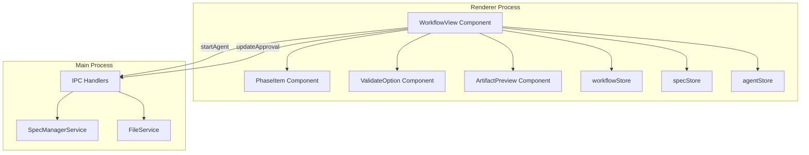
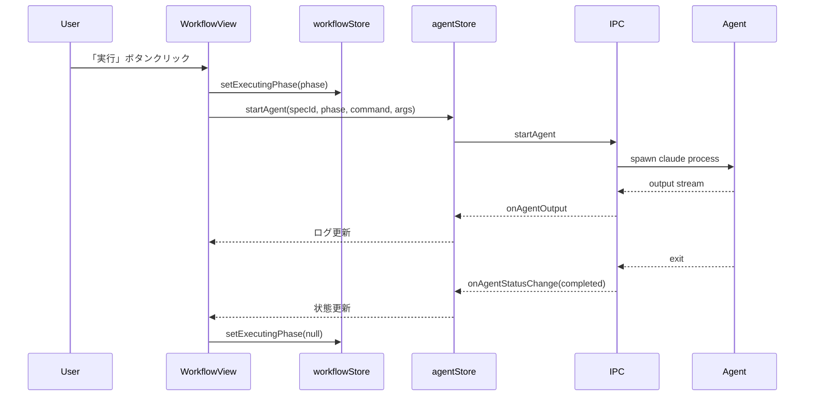
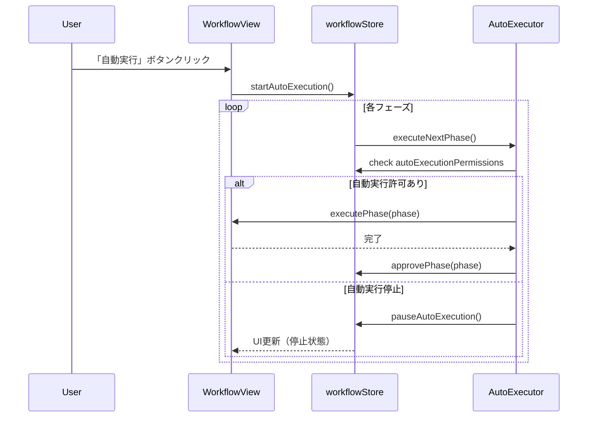
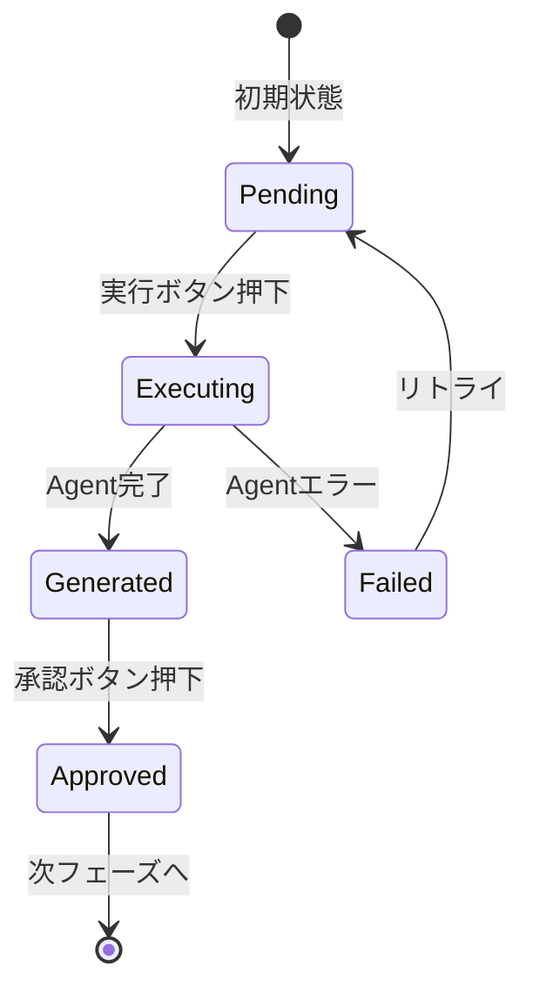

# Technical Design Document

## Overview

**Purpose**: SDD Managerの右ペインを刷新し、SDDワークフローの6フェーズ（要件定義・設計・タスク・実装・検査・デプロイ）を縦に一覧表示するWorkflowViewを提供する。手動実行と自動実行の両モードをサポートし、開発者がワークフロー全体の進捗を把握しながら段階的または自動的にフェーズを進められるUIを実現する。

**Users**: SDD Managerを使用する開発者が、Specのライフサイクル管理とAIエージェントによるフェーズ実行を行う。

**Impact**: 既存のSpecDetail、PhaseExecutionPanelコンポーネントをWorkflowViewに統合・置換し、より包括的なワークフロー管理UIを提供する。

### Goals

- SDDの6フェーズを縦に一覧表示し、各フェーズの状態（pending/generated/approved）を視覚的に示す
- 手動実行・承認操作と自動連続実行の両方をサポートする
- バリデーションコマンド（validate-gap, validate-design, validate-impl）をフェーズ間に配置し、品質検証を統合する
- 成果物（requirements.md, design.md, tasks.md）のプレビュー機能を維持する

### Non-Goals

- spec.jsonのスキーマ大幅変更（オプショナルフィールド追加のみ）
- 複数Specの同時ワークフロー管理（単一Specを選択して操作）
- CI/CDとの直接統合（UIからのコマンド実行に限定）

## Architecture

### Existing Architecture Analysis

既存のElectron版SDD Managerは以下の構造を持つ:

- **Renderer層**: React + Zustandによる状態管理（specStore, executionStore, agentStore, notificationStore）
- **Main層**: SpecManagerServiceによるAgent管理、FileServiceによるファイル操作、CommandServiceによるコマンド実行
- **IPC通信**: contextBridge + preloadスクリプトによる型安全な通信

拡張対象:
- SpecDetailコンポーネントの役割をWorkflowViewに統合
- PhaseExecutionPanelの機能をWorkflowView内に包含
- 新規workflowStoreで自動実行状態を管理

### Architecture Pattern & Boundary Map



**Architecture Integration**:
- 選択パターン: Component Composition（WorkflowViewを親として子コンポーネントを組み合わせ）
- ドメイン境界: UI層（WorkflowView）とデータ層（stores）の分離
- 既存パターン維持: Zustandによる状態管理、IPC経由のAgent操作
- 新規コンポーネント: WorkflowView（メイン）、PhaseItem（フェーズ表示）、ValidateOption（バリデーション）
- Steering準拠: TypeScript strict mode、Zustandストアパターン

### Technology Stack

| Layer | Choice / Version | Role in Feature | Notes |
|-------|------------------|-----------------|-------|
| Frontend | React 19 + TypeScript 5.8 | WorkflowView UIコンポーネント | 既存スタック活用 |
| State Management | Zustand + persist middleware | workflowStore（自動実行許可の永続化） | 新規ストア追加 |
| Styling | Tailwind CSS 4 + clsx | フェーズ状態に応じたスタイリング | 既存パターン |
| Icons | Lucide React | フェーズアイコン、状態インジケータ | 既存使用 |
| IPC | Electron contextBridge | Agent起動・停止、ファイル操作 | 既存基盤活用 |

## System Flows

### 手動フェーズ実行フロー



### 自動実行フロー



### フェーズ状態遷移



## Requirements Traceability

| Requirement | Summary | Components | Interfaces | Flows |
|-------------|---------|------------|------------|-------|
| 1.1 | 6フェーズ縦一覧表示 | WorkflowView, PhaseItem | - | - |
| 1.2 | 矢印で遷移順序表示 | WorkflowView | - | - |
| 1.3 | spec.jsonから状態判定 | WorkflowView, specStore | - | - |
| 1.4 | 自動実行・spec-statusボタン | WorkflowView | - | - |
| 2.1-2.5 | フェーズ状態別UI | PhaseItem | PhaseItemProps | - |
| 3.1-3.5 | 手動フェーズ実行 | WorkflowView | agentStore.startAgent | 手動実行フロー |
| 4.1-4.5 | バリデーション実行 | ValidateOption | ValidateOptionProps | - |
| 5.1-5.4 | 自動実行許可設定 | PhaseItem, workflowStore | AutoExecutionPermissions | - |
| 6.1-6.6 | 自動実行モード | WorkflowView, workflowStore | AutoExecutionState | 自動実行フロー |
| 7.1-7.5 | タスク進捗表示 | TaskProgressView | specStore.taskProgress | - |
| 8.1-8.6 | 検査・デプロイ実行 | WorkflowView | - | - |
| 9.1-9.3 | spec-status実行 | WorkflowView | agentStore.startAgent | - |
| 10.1-10.3 | 成果物一覧表示 | ArtifactPreview | specStore.artifacts | - |
| 11.1-11.4 | IPC通信 | agentStore, specStore | ElectronAPI | - |

## Components and Interfaces

| Component | Domain/Layer | Intent | Req Coverage | Key Dependencies (P0/P1) | Contracts |
|-----------|--------------|--------|--------------|--------------------------|-----------|
| WorkflowView | UI | SDDワークフロー全体の表示・制御 | 1.1-1.4, 3.1-3.5, 6.1-6.6, 9.1-9.3 | specStore (P0), workflowStore (P0), agentStore (P0) | State |
| PhaseItem | UI | 単一フェーズの状態表示・操作 | 2.1-2.5, 5.1-5.4 | WorkflowView (P0) | - |
| ValidateOption | UI | バリデーションオプション表示・実行 | 4.1-4.5 | WorkflowView (P0) | - |
| TaskProgressView | UI | 実装タスクの進捗表示 | 7.1-7.5 | specStore (P0) | - |
| ArtifactPreview | UI | 成果物Markdownプレビュー | 10.1-10.3 | specStore (P0) | - |
| workflowStore | State | ワークフロー状態・自動実行管理 | 5.1-5.4, 6.1-6.6 | localStorage (P1) | State |

### UI Layer

#### WorkflowView

| Field | Detail |
|-------|--------|
| Intent | SDDの6フェーズを縦一覧表示し、手動/自動実行を制御するメインコンポーネント |
| Requirements | 1.1, 1.2, 1.3, 1.4, 3.1, 3.2, 3.3, 3.4, 3.5, 6.1, 6.2, 6.3, 6.4, 6.5, 6.6, 9.1, 9.2, 9.3 |

**Responsibilities & Constraints**
- 6フェーズ（要件定義・設計・タスク・実装・検査・デプロイ）の縦一覧表示
- フェーズ間の矢印接続による遷移順序の可視化
- 自動実行ボタンとspec-statusボタンの常時表示
- spec.jsonのapprovals状態に基づくフェーズ状態の判定

**Dependencies**
- Inbound: App (P0) - 選択されたSpecの表示
- Outbound: specStore (P0) - Spec情報の取得
- Outbound: workflowStore (P0) - 自動実行状態の管理
- Outbound: agentStore (P0) - Agentの起動・停止

**Contracts**: State [x]

##### State Management

```typescript
interface WorkflowViewState {
  /** 現在実行中のフェーズ（null = 実行中でない） */
  executingPhase: WorkflowPhase | null;
  /** 自動実行中フラグ */
  isAutoExecuting: boolean;
  /** エラーメッセージ */
  error: string | null;
}
```

**Implementation Notes**
- 既存のSpecDetailとPhaseExecutionPanelの機能を統合
- useEffect内でspecStore.specDetailの変更を監視し、フェーズ状態を同期
- 自動実行ループはasync/awaitで逐次実行し、停止条件をチェック

#### PhaseItem

| Field | Detail |
|-------|--------|
| Intent | 単一フェーズの状態表示と操作ボタンを提供する |
| Requirements | 2.1, 2.2, 2.3, 2.4, 2.5, 5.1, 5.2, 5.3, 5.4 |

**Responsibilities & Constraints**
- フェーズ状態（pending/generated/approved）に応じたUI表示
- 実行/承認/承認して実行ボタンの条件付き表示
- 自動実行許可アイコンのトグル操作
- 「生成完了」リンクのクリックでAgentログ表示

**Dependencies**
- Inbound: WorkflowView (P0) - フェーズ情報の受け渡し
- Outbound: workflowStore (P0) - 自動実行許可の更新

**Contracts**: -

```typescript
interface PhaseItemProps {
  /** フェーズ種別 */
  phase: WorkflowPhase;
  /** フェーズ表示名 */
  label: string;
  /** フェーズ状態 */
  status: PhaseStatus;
  /** 前フェーズの状態（遷移可能判定用） */
  previousStatus: PhaseStatus | null;
  /** 自動実行許可フラグ */
  autoExecutionPermitted: boolean;
  /** 現在実行中かどうか */
  isExecuting: boolean;
  /** 実行ボタンハンドラ */
  onExecute: () => void;
  /** 承認ボタンハンドラ */
  onApprove: () => void;
  /** 承認して実行ボタンハンドラ */
  onApproveAndExecute: () => void;
  /** 自動実行許可トグルハンドラ */
  onToggleAutoPermission: () => void;
  /** 生成完了リンクハンドラ（Agentログ表示） */
  onShowAgentLog?: () => void;
}
```

**Implementation Notes**
- StatusBadgeコンポーネントを再利用してgenerated/approved状態を表示
- Lucide Reactアイコン: Play（実行）, Check（承認済）, Ban（自動停止）, PlayCircle（自動許可）

#### ValidateOption

| Field | Detail |
|-------|--------|
| Intent | フェーズ間のバリデーションオプションを表示・実行する |
| Requirements | 4.1, 4.2, 4.3, 4.4, 4.5 |

**Responsibilities & Constraints**
- チェックボックスによる自動実行時のバリデーション有効化
- 「実行」ボタンによる即時バリデーション実行
- バリデーション結果のAgentログへの出力

**Dependencies**
- Inbound: WorkflowView (P0) - バリデーション種別の受け渡し

**Contracts**: -

```typescript
interface ValidateOptionProps {
  /** バリデーション種別 */
  type: 'gap' | 'design' | 'impl';
  /** バリデーション表示名 */
  label: string;
  /** チェック状態 */
  enabled: boolean;
  /** 実行中フラグ */
  isExecuting: boolean;
  /** チェック変更ハンドラ */
  onToggle: () => void;
  /** 即時実行ハンドラ */
  onExecute: () => void;
}
```

**Implementation Notes**
- コンパクトなインライン表示（高さ制限）
- validate-gap: 要件定義と設計の間
- validate-design: 設計とタスクの間
- validate-impl: 実装と検査の間

#### TaskProgressView

| Field | Detail |
|-------|--------|
| Intent | 実装フェーズのタスク単位進捗を表示する |
| Requirements | 7.1, 7.2, 7.3, 7.4, 7.5 |

**Responsibilities & Constraints**
- tasks.mdからパースしたタスク一覧の表示
- タスク状態（未着手/実行中/完了）の表示
- プログレスバーによる全体進捗の可視化

**Dependencies**
- Inbound: WorkflowView (P0) - タスク情報の受け渡し
- Outbound: specStore (P0) - タスク進捗データの取得

**Contracts**: -

```typescript
interface TaskProgressViewProps {
  /** タスク一覧 */
  tasks: TaskItem[];
  /** 全体進捗 */
  progress: TaskProgress;
}

interface TaskItem {
  /** タスクID */
  id: string;
  /** タスク名 */
  title: string;
  /** タスク状態 */
  status: 'pending' | 'running' | 'completed';
}
```

**Implementation Notes**
- 既存のSpecDetail内のタスク進捗表示を移植・拡張
- tasks.mdの`- [x]`/`- [ ]`パターンをパースしてタスク状態を判定

#### ArtifactPreview

| Field | Detail |
|-------|--------|
| Intent | 成果物のMarkdownプレビューを提供する |
| Requirements | 10.1, 10.2, 10.3 |

**Responsibilities & Constraints**
- requirements.md, design.md, tasks.mdの展開表示
- 未作成ファイルへの「未作成」ラベル表示
- @uiw/react-md-editorによるMarkdownレンダリング

**Dependencies**
- Inbound: WorkflowView (P0) - 表示する成果物の指定
- External: @uiw/react-md-editor (P1) - Markdownレンダリング

**Contracts**: -

**Implementation Notes**
- 既存のArtifactItemコンポーネントのロジックを再利用
- 折りたたみ可能なアコーディオン形式

### State Layer

#### workflowStore

| Field | Detail |
|-------|--------|
| Intent | ワークフローの自動実行状態と許可設定を管理する |
| Requirements | 5.1, 5.2, 5.3, 5.4, 6.1, 6.2, 6.3, 6.4, 6.5, 6.6 |

**Responsibilities & Constraints**
- 自動実行許可フラグの管理（フェーズごと）
- 自動実行状態の管理（実行中/停止中）
- バリデーションオプションの有効/無効状態
- LocalStorageへの永続化（Zustand persistミドルウェア）

**Dependencies**
- External: localStorage (P1) - 設定の永続化

**Contracts**: State [x]

##### State Management

```typescript
interface WorkflowState {
  /** 自動実行許可設定（フェーズごと） */
  autoExecutionPermissions: AutoExecutionPermissions;
  /** バリデーションオプション設定 */
  validationOptions: ValidationOptions;
  /** 自動実行中フラグ */
  isAutoExecuting: boolean;
  /** 現在の自動実行位置 */
  currentAutoPhase: WorkflowPhase | null;
}

interface AutoExecutionPermissions {
  requirements: boolean;  // デフォルト: true
  design: boolean;        // デフォルト: false
  tasks: boolean;         // デフォルト: false
  impl: boolean;          // デフォルト: false
  inspection: boolean;    // デフォルト: false
  deploy: boolean;        // デフォルト: false
}

interface ValidationOptions {
  gap: boolean;     // validate-gap 有効フラグ
  design: boolean;  // validate-design 有効フラグ
  impl: boolean;    // validate-impl 有効フラグ
}

interface WorkflowActions {
  /** 自動実行許可をトグル */
  toggleAutoPermission: (phase: WorkflowPhase) => void;
  /** バリデーションオプションをトグル */
  toggleValidationOption: (type: ValidationType) => void;
  /** 自動実行を開始 */
  startAutoExecution: () => void;
  /** 自動実行を停止 */
  stopAutoExecution: () => void;
  /** 現在の自動実行フェーズを更新 */
  setCurrentAutoPhase: (phase: WorkflowPhase | null) => void;
  /** 設定をリセット */
  resetSettings: () => void;
}
```

- Persistence: Zustand persist middlewareでlocalStorage保存
- Key: `sdd-manager-workflow-settings`

**Implementation Notes**
- デフォルト設定: requirementsのみautoExecutionPermitted = true
- stopAutoExecution呼び出し時は現在のフェーズ完了後に停止

## Data Models

### Domain Model

#### WorkflowPhase（値オブジェクト）

```typescript
/** SDDワークフローの6フェーズ */
type WorkflowPhase =
  | 'requirements'  // 要件定義
  | 'design'        // 設計
  | 'tasks'         // タスク
  | 'impl'          // 実装
  | 'inspection'    // 検査
  | 'deploy';       // デプロイ

/** フェーズ順序定義 */
const WORKFLOW_PHASES: WorkflowPhase[] = [
  'requirements',
  'design',
  'tasks',
  'impl',
  'inspection',
  'deploy'
];
```

#### PhaseStatus（値オブジェクト）

```typescript
/** フェーズの状態 */
type PhaseStatus = 'pending' | 'generated' | 'approved';

/** フェーズ状態の判定ロジック */
function getPhaseStatus(
  phase: WorkflowPhase,
  specJson: ExtendedSpecJson
): PhaseStatus {
  if (phase === 'inspection') {
    return specJson.inspection_completed ? 'approved' : 'pending';
  }
  if (phase === 'deploy') {
    return specJson.deploy_completed ? 'approved' : 'pending';
  }
  if (phase === 'impl') {
    // 実装フェーズは全タスク完了で approved
    return specJson.ready_for_implementation ? 'pending' : 'generated';
  }

  const approval = specJson.approvals[phase];
  if (approval.approved) return 'approved';
  if (approval.generated) return 'generated';
  return 'pending';
}
```

#### ValidationType（値オブジェクト）

```typescript
/** バリデーション種別 */
type ValidationType = 'gap' | 'design' | 'impl';

/** バリデーションコマンドマッピング */
const VALIDATION_COMMANDS: Record<ValidationType, string> = {
  gap: '/kiro:validate-gap',
  design: '/kiro:validate-design',
  impl: '/kiro:validate-impl'
};
```

### Logical Data Model

#### Extended SpecJson

spec.jsonの拡張フィールド（オプショナル）:

```typescript
interface ExtendedSpecJson extends SpecJson {
  /** 検査完了フラグ（オプショナル、デフォルト: false） */
  inspection_completed?: boolean;
  /** デプロイ完了フラグ（オプショナル、デフォルト: false） */
  deploy_completed?: boolean;
}
```

**Consistency & Integrity**:
- 後方互換性: inspection_completed, deploy_completed が undefined の場合は false 扱い
- 更新タイミング: 検査/デプロイ完了時にfileService経由でspec.jsonを更新

## Error Handling

### Error Strategy

エラー発生時はユーザーに明確なフィードバックを提供し、リカバリー手段を示す。

### Error Categories and Responses

**Agent実行エラー**:
- Agent起動失敗 → エラーメッセージ表示 + リトライボタン
- Agent異常終了 → エラー状態表示 + Agentログへの誘導
- タイムアウト → 「応答なし」表示 + 強制停止オプション

**IPC通信エラー**:
- 通信タイムアウト → エラーメッセージ + リトライオプション（要件11.4）
- チャネルエラー → notificationStoreでエラー通知

**ファイル操作エラー**:
- spec.json読み込み失敗 → 「仕様の読み込みに失敗しました」表示
- 成果物ファイルなし → 「未作成」ラベル表示（エラーではない）

### Monitoring

- 既存のlogger（main/services/logger.ts）を活用してエラーログを記録
- notificationStoreによるユーザー向けエラー通知

## Testing Strategy

### Unit Tests

- workflowStoreのアクションテスト（toggleAutoPermission, startAutoExecution等）
- PhaseStatusの判定ロジックテスト（getPhaseStatus関数）
- ValidationOptionsの永続化・復元テスト

### Integration Tests

- WorkflowView + workflowStore連携テスト
- フェーズ実行→状態更新→UI反映の一連フロー
- 自動実行→停止条件到達→停止の一連フロー

### E2E Tests

- 手動フェーズ実行シナリオ（実行→完了→承認）
- 自動実行シナリオ（開始→複数フェーズ実行→停止）
- バリデーションオプション実行シナリオ

## Optional Sections

### Performance & Scalability

- フェーズ実行中のUI応答性: ローディング状態の即時表示
- Agentログの大量出力: 既存のログ管理（上限・スクロール）を維持
- LocalStorage容量: workflowStore設定は軽量（数KB以下）

### Migration Strategy

既存UIからの移行:
1. WorkflowViewコンポーネントを新規作成
2. SpecDetailの情報表示機能を統合
3. PhaseExecutionPanelの機能を統合
4. 既存コンポーネントを段階的に非推奨化
