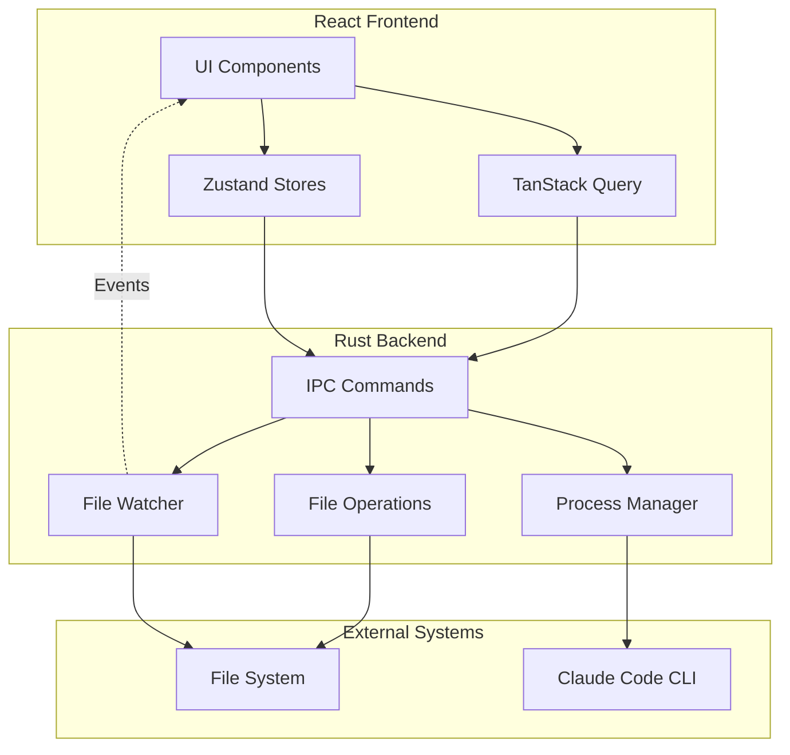
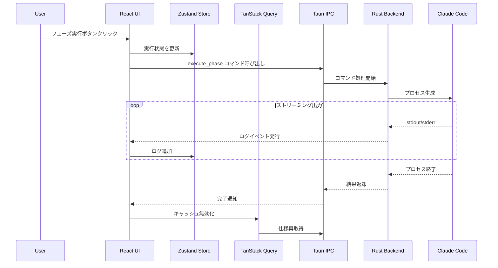
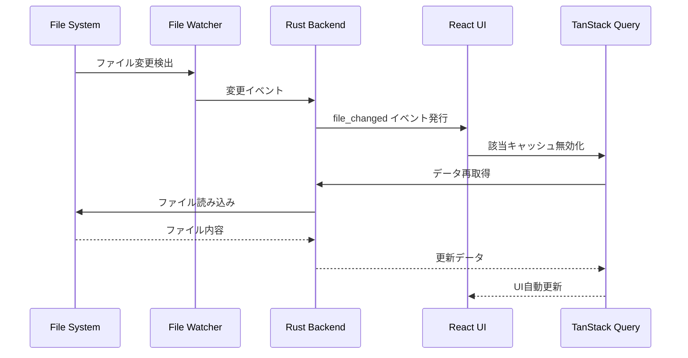
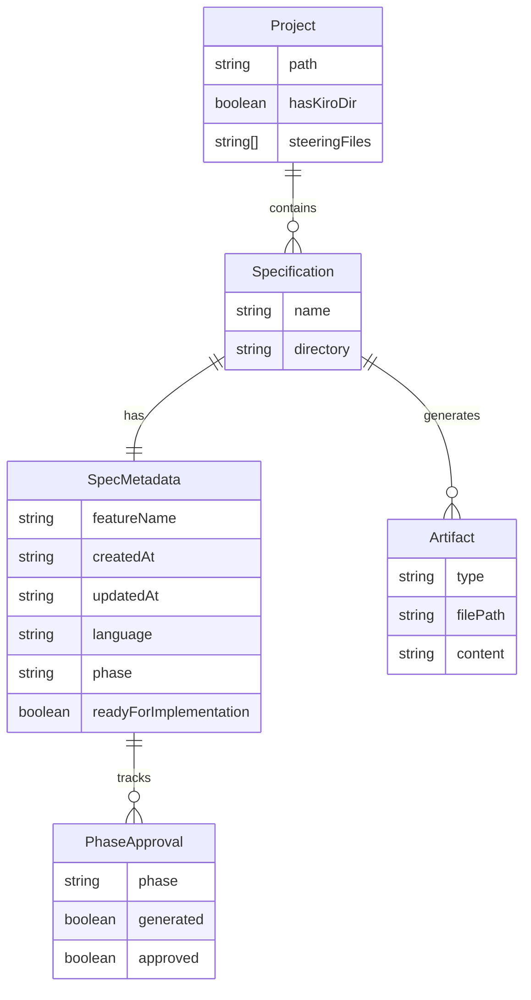

# Design Document

## Overview
**Purpose**: このデスクトップアプリケーションは、SDD（Spec-Driven Development）ワークフローを視覚的に管理する統合環境を提供する。開発者は`.kiro/specs/`内の仕様を一元管理し、要件・設計・タスク・実装の各フェーズを直感的に操作できる。

**Users**: SDDワークフローを採用するソフトウェア開発チームが、仕様の作成・承認・実行・進捗管理に活用する。

**Impact**: コマンドライン操作を必要としない視覚的なSDD管理環境を新規に構築し、開発プロセスの可視化と効率化を実現する。

### Goals
- 仕様の状態・進捗を一目で把握できる視覚的ダッシュボード
- 各SDDフェーズの実行・承認をGUIから制御可能
- リアルタイムのファイル監視と自動更新
- クロスプラットフォーム対応（macOS、Windows、Linux）

### Non-Goals
- AI/LLMエージェント機能の内蔵（外部Claude Code呼び出しに依存）
- バージョン管理（Git）統合
- 複数プロジェクトの同時管理
- リモートコラボレーション機能

## Architecture

### Architecture Pattern & Boundary Map

**Architecture Integration**:
- Selected pattern: **Tauri Multi-Process Architecture** - Rustバックエンドがセキュリティ境界とシステムリソースを管理し、Reactフロントエンドがプレゼンテーションを担当
- Domain/feature boundaries: バックエンド（ファイルシステム・プロセス管理）とフロントエンド（UI状態・ユーザーインタラクション）の明確な分離
- Existing patterns preserved: IPC非同期メッセージパッシング
- New components rationale: 型安全なIPCレイヤー（tauri-specta）、状態管理（Zustand）、サーバー状態（TanStack Query）
- Steering compliance: ファイルシステム操作はRust側に集約、UIブロッキング防止のための非同期設計



### Technology Stack

| Layer | Choice / Version | Role in Feature | Notes |
|-------|------------------|-----------------|-------|
| Frontend | React 18.x + TypeScript 5.x | UIコンポーネント・ユーザーインタラクション | Vite bundler使用 |
| State Management | Zustand 5.x + TanStack Query 5.x | クライアント状態・サーバーデータキャッシュ | 2025年推奨スタック |
| UI Components | shadcn/ui + Radix UI + Tailwind CSS 3.x | アクセシブルでカスタマイズ可能なUI | コンポーネントコピー方式 |
| Markdown | react-markdown + rehype-highlight | Markdownレンダリング・シンタックスハイライト | @uiw/react-md-editorをエディタに使用 |
| Backend | Rust + Tauri 2.x | システムリソースアクセス・IPC | Shell plugin, FS plugin使用 |
| Type Generation | tauri-specta 2.x + specta 2.x | Rust-TypeScript型同期 | ビルド時型生成 |
| File Watching | tauri-plugin-fs-watch + notify | ファイルシステム監視 | debounce設定必須 |

## System Flows

### 仕様フェーズ実行フロー



### ファイル監視・自動更新フロー



## Requirements Traceability

| Requirement | Summary | Components | Interfaces | Flows |
|-------------|---------|------------|------------|-------|
| 1.1-1.6 | 仕様一覧表示 | SpecListPanel, SpecCard | list_specs, SpecStore | - |
| 2.1-2.6 | 仕様詳細表示 | SpecDetailPanel, SpecTabs | get_spec_detail, get_artifact_content | - |
| 3.1-3.6 | 仕様作成 | CreateSpecDialog | create_spec | - |
| 4.1-4.7 | フェーズ実行制御 | PhaseControlPanel | execute_phase | 仕様フェーズ実行 |
| 5.1-5.6 | 承認ワークフロー | ApprovalPanel | approve_phase, reject_phase | - |
| 6.1-6.6 | 実行ログ表示 | LogPanel | LogStore | 仕様フェーズ実行 |
| 7.1-7.6 | プロジェクト設定 | ProjectSettingsPanel | select_project, get_recent_projects | - |
| 8.1-8.6 | ファイルシステム監視 | - | start_watching, file_changed event | ファイル監視・自動更新 |
| 9.1-9.6 | Markdownエディタ | MarkdownEditor | save_artifact | - |
| 10.1-10.6 | クロスプラットフォーム | App | tauri.conf.json | - |
| 11.1-11.6 | エラー処理・通知 | NotificationProvider, ErrorBoundary | AppError | - |
| 12.1-12.6 | Tauri IPC通信 | 全コンポーネント | commands, events | 全フロー |

## Components and Interfaces

| Component | Domain/Layer | Intent | Req Coverage | Key Dependencies | Contracts |
|-----------|--------------|--------|--------------|------------------|-----------|
| App | UI/Shell | アプリケーションルート・プロバイダー設定 | 10.1-10.6 | React, Zustand, TanStack Query (P0) | State |
| SpecListPanel | UI/Specs | 仕様一覧の表示・ソート・フィルタ | 1.1-1.6 | list_specs (P0), SpecStore (P0) | State |
| SpecDetailPanel | UI/Specs | 選択された仕様の詳細表示 | 2.1-2.6 | get_spec_detail (P0), SpecTabs (P1) | State |
| CreateSpecDialog | UI/Specs | 新規仕様作成フォーム | 3.1-3.6 | create_spec (P0) | Service |
| PhaseControlPanel | UI/Workflow | フェーズ実行ボタン・進行状況表示 | 4.1-4.7 | execute_phase (P0), LogStore (P0) | Service, Event |
| ApprovalPanel | UI/Workflow | 承認・却下操作・履歴表示 | 5.1-5.6 | approve_phase, reject_phase (P0) | Service |
| LogPanel | UI/Workflow | リアルタイムログ表示 | 6.1-6.6 | LogStore (P0) | State, Event |
| ProjectSettingsPanel | UI/Settings | プロジェクト選択・設定管理 | 7.1-7.6 | select_project (P0), ConfigStore (P0) | Service, State |
| MarkdownEditor | UI/Editor | Markdown編集・プレビュー | 9.1-9.6 | save_artifact (P0), EditorStore (P1) | Service, State |
| NotificationProvider | UI/Feedback | トースト通知・エラー表示 | 11.1-11.6 | NotificationStore (P0) | State |
| SpecStore | State/Specs | 仕様データ・選択状態管理 | 1, 2, 8 | - | State |
| LogStore | State/Workflow | 実行ログ・ストリーミング状態 | 6 | - | State |
| ConfigStore | State/Settings | アプリケーション設定・履歴 | 7 | - | State |
| EditorStore | State/Editor | 未保存変更・編集状態 | 9 | - | State |
| NotificationStore | State/Feedback | 通知キュー管理 | 11 | - | State |

### UI / Shell

#### App

| Field | Detail |
|-------|--------|
| Intent | アプリケーションルートコンポーネント、プロバイダー設定、ルーティング |
| Requirements | 10.1-10.6 |

**Responsibilities & Constraints**
- 全プロバイダー（QueryClient, Zustand stores, NotificationProvider）の設定
- テーマ設定（OSダークモード対応）
- グローバルエラーバウンダリ

**Dependencies**
- Outbound: SpecListPanel, SpecDetailPanel, ProjectSettingsPanel — メインビュー (P0)
- External: @tanstack/react-query, zustand — 状態管理 (P0)

**Contracts**: State [x]

##### State Management

```typescript
// QueryClient設定
const queryClient = new QueryClient({
  defaultOptions: {
    queries: {
      staleTime: 5000,
      gcTime: 300000,
      refetchOnWindowFocus: true,
    },
  },
});
```

### UI / Specs

#### SpecListPanel

| Field | Detail |
|-------|--------|
| Intent | 仕様一覧の表示、ソート、選択操作 |
| Requirements | 1.1-1.6 |

**Responsibilities & Constraints**
- 仕様リストの取得・表示
- ソート・フィルタロジック
- 仕様選択時のルーティング/状態更新

**Dependencies**
- Inbound: App — メインビュー描画 (P0)
- Outbound: SpecCard — リストアイテム描画 (P1)
- External: list_specs — 仕様一覧取得 (P0)

**Contracts**: State [x]

##### State Management

```typescript
interface SpecListState {
  sortBy: 'name' | 'updated_at' | 'status';
  sortOrder: 'asc' | 'desc';
  filterStatus: SpecStatus | 'all';
}

// TanStack Query hook
function useSpecs() {
  return useQuery({
    queryKey: ['specs'],
    queryFn: () => commands.listSpecs(),
  });
}
```

#### SpecDetailPanel

| Field | Detail |
|-------|--------|
| Intent | 選択された仕様のメタデータと成果物表示 |
| Requirements | 2.1-2.6 |

**Responsibilities & Constraints**
- spec.jsonメタデータの表示
- タブによる成果物（requirements.md, design.md, tasks.md）切り替え
- 各フェーズの承認状態可視化

**Dependencies**
- Inbound: App — 詳細ビュー描画 (P0)
- Outbound: SpecTabs, ApprovalPanel, PhaseControlPanel — サブコンポーネント (P1)
- External: get_spec_detail, get_artifact_content — データ取得 (P0)

**Contracts**: State [x]

##### State Management

```typescript
interface SpecDetailState {
  activeTab: 'requirements' | 'design' | 'tasks';
}

// TanStack Query hook
function useSpecDetail(specName: string) {
  return useQuery({
    queryKey: ['spec', specName],
    queryFn: () => commands.getSpecDetail(specName),
  });
}
```

#### CreateSpecDialog

| Field | Detail |
|-------|--------|
| Intent | 新規仕様作成フォームとバリデーション |
| Requirements | 3.1-3.6 |

**Responsibilities & Constraints**
- フォーム入力（名前、説明）のバリデーション
- 重複チェック
- 作成成功時のリスト更新トリガー

**Dependencies**
- Inbound: SpecListPanel — ダイアログ表示 (P0)
- External: create_spec — 仕様作成 (P0)

**Contracts**: Service [x]

##### Service Interface

```typescript
interface CreateSpecInput {
  featureName: string;
  description: string;
}

interface CreateSpecResult {
  success: boolean;
  specName: string;
  error?: string;
}

// Validation
const createSpecSchema = z.object({
  featureName: z.string()
    .min(1, 'Feature name is required')
    .regex(/^[a-z0-9-]+$/, 'Only lowercase letters, numbers, and hyphens'),
  description: z.string().min(10, 'Description must be at least 10 characters'),
});
```

### UI / Workflow

#### PhaseControlPanel

| Field | Detail |
|-------|--------|
| Intent | SDDフェーズ実行ボタンと進行状況表示 |
| Requirements | 4.1-4.7 |

**Responsibilities & Constraints**
- フェーズ依存関係に基づくボタン有効/無効制御
- 実行中の進行状況インジケーター表示
- LogPanelとの連携

**Dependencies**
- Inbound: SpecDetailPanel — パネル表示 (P0)
- Outbound: LogPanel — ログ表示連携 (P0)
- External: execute_phase — フェーズ実行 (P0)

**Contracts**: Service [x] / Event [x]

##### Service Interface

```typescript
type PhaseType = 'requirements' | 'design' | 'tasks' | 'implementation';

interface ExecutePhaseInput {
  specName: string;
  phase: PhaseType;
  autoApprove: boolean;
}

interface PhaseExecutionResult {
  success: boolean;
  exitCode: number;
  executionTime: number;
  error?: string;
}
```

##### Event Contract

```typescript
// Published events: なし
// Subscribed events:
interface LogStreamEvent {
  specName: string;
  phase: PhaseType;
  stream: 'stdout' | 'stderr';
  content: string;
  timestamp: string;
}

interface PhaseCompleteEvent {
  specName: string;
  phase: PhaseType;
  success: boolean;
  exitCode: number;
}
```

**Implementation Notes**
- Integration: LogStoreへのリアルタイムログ追加、完了時のキャッシュ無効化
- Validation: 前提フェーズの承認状態チェック
- Risks: Claude Code CLIの可用性、長時間実行のタイムアウト

#### ApprovalPanel

| Field | Detail |
|-------|--------|
| Intent | フェーズ成果物の承認・却下操作 |
| Requirements | 5.1-5.6 |

**Responsibilities & Constraints**
- 承認/却下ボタンの表示・制御
- 却下理由の入力ダイアログ
- spec.json更新のトリガー

**Dependencies**
- Inbound: SpecDetailPanel — パネル表示 (P0)
- External: approve_phase, reject_phase — 承認操作 (P0)

**Contracts**: Service [x]

##### Service Interface

```typescript
interface ApprovePhaseInput {
  specName: string;
  phase: PhaseType;
}

interface RejectPhaseInput {
  specName: string;
  phase: PhaseType;
  reason: string;
}

interface ApprovalResult {
  success: boolean;
  updatedSpec: SpecMetadata;
  error?: string;
}
```

#### LogPanel

| Field | Detail |
|-------|--------|
| Intent | コマンド実行ログのリアルタイム表示 |
| Requirements | 6.1-6.6 |

**Responsibilities & Constraints**
- ストリーミングログの表示
- 自動スクロール
- クリップボードコピー機能

**Dependencies**
- Inbound: PhaseControlPanel — ログ表示連携 (P0)
- External: LogStore — ログ状態管理 (P0)

**Contracts**: State [x] / Event [x]

##### State Management

```typescript
interface LogEntry {
  id: string;
  timestamp: string;
  stream: 'stdout' | 'stderr';
  content: string;
}

interface LogState {
  entries: LogEntry[];
  isStreaming: boolean;
  executionTime?: number;
  exitCode?: number;
}

interface LogStore {
  logs: Map<string, LogState>; // key: `${specName}:${phase}`
  addLog: (key: string, entry: LogEntry) => void;
  clearLogs: (key: string) => void;
  setComplete: (key: string, exitCode: number, executionTime: number) => void;
}
```

##### Event Contract

```typescript
// Subscribed events: LogStreamEvent, PhaseCompleteEvent (from PhaseControlPanel)
```

### UI / Settings

#### ProjectSettingsPanel

| Field | Detail |
|-------|--------|
| Intent | プロジェクトルート選択・設定管理 |
| Requirements | 7.1-7.6 |

**Responsibilities & Constraints**
- ディレクトリ選択ダイアログ
- .kiroディレクトリの検証
- 最近のプロジェクト履歴管理

**Dependencies**
- Inbound: App — 設定パネル表示 (P0)
- External: select_project, get_recent_projects — プロジェクト操作 (P0)

**Contracts**: Service [x] / State [x]

##### Service Interface

```typescript
interface ProjectValidation {
  isValid: boolean;
  hasKiroDir: boolean;
  hasSpecs: boolean;
  hasSteering: boolean;
  steeringFiles: string[];
}

interface SelectProjectResult {
  path: string;
  validation: ProjectValidation;
}
```

##### State Management

```typescript
interface ConfigState {
  currentProject: string | null;
  recentProjects: string[];
  theme: 'light' | 'dark' | 'system';
}

interface ConfigStore {
  config: ConfigState;
  setProject: (path: string) => void;
  addRecentProject: (path: string) => void;
  setTheme: (theme: ConfigState['theme']) => void;
}
```

### UI / Editor

#### MarkdownEditor

| Field | Detail |
|-------|--------|
| Intent | Markdown成果物の編集・プレビュー |
| Requirements | 9.1-9.6 |

**Responsibilities & Constraints**
- 編集モード/プレビューモード切り替え
- 未保存変更の追跡
- 保存確認ダイアログ

**Dependencies**
- Inbound: SpecDetailPanel — エディタ表示 (P0)
- External: save_artifact — ファイル保存 (P0), @uiw/react-md-editor — エディタUI (P0)

**Contracts**: Service [x] / State [x]

##### Service Interface

```typescript
interface SaveArtifactInput {
  specName: string;
  artifactType: 'requirements' | 'design' | 'tasks';
  content: string;
}

interface SaveArtifactResult {
  success: boolean;
  savedAt: string;
  error?: string;
}
```

##### State Management

```typescript
interface EditorState {
  isDirty: boolean;
  originalContent: string;
  currentContent: string;
  mode: 'edit' | 'preview';
}

interface EditorStore {
  editors: Map<string, EditorState>; // key: `${specName}:${artifactType}`
  setContent: (key: string, content: string) => void;
  markClean: (key: string) => void;
  setMode: (key: string, mode: 'edit' | 'preview') => void;
  hasUnsavedChanges: () => boolean;
}
```

### UI / Feedback

#### NotificationProvider

| Field | Detail |
|-------|--------|
| Intent | トースト通知・エラーダイアログの表示 |
| Requirements | 11.1-11.6 |

**Responsibilities & Constraints**
- 通知キューの管理
- 自動消去タイマー
- エラー詳細ダイアログ

**Dependencies**
- Inbound: 全UIコンポーネント — 通知表示 (P0)
- External: NotificationStore — 通知状態管理 (P0)

**Contracts**: State [x]

##### State Management

```typescript
type NotificationType = 'success' | 'error' | 'warning' | 'info';

interface Notification {
  id: string;
  type: NotificationType;
  title: string;
  message?: string;
  action?: {
    label: string;
    onClick: () => void;
  };
  duration?: number;
}

interface NotificationStore {
  notifications: Notification[];
  add: (notification: Omit<Notification, 'id'>) => void;
  remove: (id: string) => void;
  clear: () => void;
}
```

### Backend / IPC Commands

#### Commands Module

| Field | Detail |
|-------|--------|
| Intent | Rust側IPCコマンド定義・型安全な通信 |
| Requirements | 12.1-12.6 |

**Responsibilities & Constraints**
- ファイルシステム操作の実行
- プロセス生成・管理
- JSON-RPC準拠のシリアライズ

**Dependencies**
- Inbound: 全UIコンポーネント — IPC呼び出し (P0)
- External: tauri, tauri-specta, serde — IPC基盤 (P0)

**Contracts**: Service [x] / Event [x]

##### Service Interface (Rust Commands)

```rust
// tauri-spectaによりTypeScriptバインディング自動生成

#[tauri::command]
#[specta::specta]
async fn list_specs(project_path: String) -> Result<Vec<SpecSummary>, AppError>;

#[tauri::command]
#[specta::specta]
async fn get_spec_detail(project_path: String, spec_name: String) -> Result<SpecDetail, AppError>;

#[tauri::command]
#[specta::specta]
async fn get_artifact_content(
    project_path: String,
    spec_name: String,
    artifact_type: ArtifactType
) -> Result<String, AppError>;

#[tauri::command]
#[specta::specta]
async fn create_spec(
    project_path: String,
    feature_name: String,
    description: String
) -> Result<CreateSpecResult, AppError>;

#[tauri::command]
#[specta::specta]
async fn execute_phase(
    app: AppHandle,
    project_path: String,
    spec_name: String,
    phase: PhaseType,
    auto_approve: bool
) -> Result<PhaseExecutionResult, AppError>;

#[tauri::command]
#[specta::specta]
async fn approve_phase(
    project_path: String,
    spec_name: String,
    phase: PhaseType
) -> Result<ApprovalResult, AppError>;

#[tauri::command]
#[specta::specta]
async fn reject_phase(
    project_path: String,
    spec_name: String,
    phase: PhaseType,
    reason: String
) -> Result<ApprovalResult, AppError>;

#[tauri::command]
#[specta::specta]
async fn save_artifact(
    project_path: String,
    spec_name: String,
    artifact_type: ArtifactType,
    content: String
) -> Result<SaveArtifactResult, AppError>;

#[tauri::command]
#[specta::specta]
async fn select_project() -> Result<SelectProjectResult, AppError>;

#[tauri::command]
#[specta::specta]
async fn get_recent_projects() -> Result<Vec<String>, AppError>;

#[tauri::command]
#[specta::specta]
async fn start_watching(project_path: String) -> Result<(), AppError>;

#[tauri::command]
#[specta::specta]
async fn stop_watching() -> Result<(), AppError>;
```

##### Event Contract (Rust Events)

```rust
#[derive(Clone, Serialize, Deserialize, specta::Type, tauri_specta::Event)]
pub struct LogStreamEvent {
    pub spec_name: String,
    pub phase: PhaseType,
    pub stream: StreamType,
    pub content: String,
    pub timestamp: String,
}

#[derive(Clone, Serialize, Deserialize, specta::Type, tauri_specta::Event)]
pub struct PhaseCompleteEvent {
    pub spec_name: String,
    pub phase: PhaseType,
    pub success: bool,
    pub exit_code: i32,
}

#[derive(Clone, Serialize, Deserialize, specta::Type, tauri_specta::Event)]
pub struct FileChangedEvent {
    pub path: String,
    pub kind: FileChangeKind,
}
```

**Implementation Notes**
- Integration: tauri-spectaによるTypeScript型自動生成、useEffect内でのイベントリスナー登録・解除
- Validation: プロジェクトパス存在確認、仕様名フォーマット検証
- Risks: IPCタイムアウト、大量ログ時のメモリ使用量

## Data Models

### Domain Model



**Aggregates and Boundaries**:
- **Project**: プロジェクトディレクトリをルートとするアグリゲート、仕様のコレクションを管理
- **Specification**: 単一仕様をルートとするアグリゲート、メタデータと成果物を管理

**Business Rules & Invariants**:
- 仕様名は一意でなければならない（同一プロジェクト内）
- フェーズは順序に従って実行（requirements → design → tasks → implementation）
- 前フェーズが承認されていない場合、次フェーズは実行不可
- すべてのフェーズが承認されるとreadyForImplementationがtrueになる

### Logical Data Model

**Structure Definition**:

```typescript
// Core Types
interface SpecMetadata {
  feature_name: string;
  created_at: string;
  updated_at: string;
  language: string;
  phase: SpecPhase;
  approvals: {
    requirements: PhaseApproval;
    design: PhaseApproval;
    tasks: PhaseApproval;
  };
  ready_for_implementation: boolean;
}

interface PhaseApproval {
  generated: boolean;
  approved: boolean;
}

type SpecPhase =
  | 'initialized'
  | 'requirements-generated'
  | 'requirements-approved'
  | 'design-generated'
  | 'design-approved'
  | 'tasks-generated'
  | 'tasks-approved'
  | 'implementation-ready';

type ArtifactType = 'requirements' | 'design' | 'tasks';

// View Models
interface SpecSummary {
  name: string;
  phase: SpecPhase;
  status: SpecStatus;
  updatedAt: string;
}

type SpecStatus = 'in-progress' | 'completed' | 'error' | 'pending';

interface SpecDetail {
  metadata: SpecMetadata;
  artifacts: {
    requirements: ArtifactInfo;
    design: ArtifactInfo;
    tasks: ArtifactInfo;
  };
}

interface ArtifactInfo {
  exists: boolean;
  lastModified?: string;
}
```

### Data Contracts & Integration

**API Data Transfer**:
- すべてのIPCデータはJSON形式でシリアライズ
- Rust側でserde::Serialize/Deserialize実装
- tauri-spectaによりTypeScript型定義自動生成

**Configuration Persistence**:

```typescript
// ローカルストレージに保存される設定
interface PersistedConfig {
  recentProjects: string[];
  theme: 'light' | 'dark' | 'system';
  lastOpenedProject?: string;
}
```

## Error Handling

### Error Strategy

すべてのエラーはResult型でラップし、フロントエンドで統一的に処理する。

```rust
#[derive(Debug, Clone, Serialize, Deserialize, specta::Type)]
pub enum AppError {
    // ファイルシステムエラー
    FileNotFound { path: String },
    PermissionDenied { path: String },
    InvalidPath { path: String },

    // 仕様エラー
    SpecNotFound { name: String },
    SpecAlreadyExists { name: String },
    InvalidSpecName { name: String, reason: String },

    // フェーズエラー
    PhaseNotReady { phase: String, reason: String },
    ExecutionFailed { phase: String, exit_code: i32, message: String },
    ExecutionTimeout { phase: String, timeout_secs: u64 },

    // IPC/システムエラー
    SerializationError { message: String },
    WatcherError { message: String },

    // 外部サービスエラー
    ClaudeCodeNotFound,
    ClaudeCodeError { message: String },
}
```

### Error Categories and Responses

**User Errors (4xx equivalent)**:
- `SpecAlreadyExists` → 別名での作成を促す通知
- `InvalidSpecName` → フィールドレベルバリデーションエラー表示
- `PhaseNotReady` → 前提条件の説明と対処手順表示

**System Errors (5xx equivalent)**:
- `FileNotFound`, `PermissionDenied` → エラーダイアログ + 推奨手順
- `WatcherError` → 警告通知 + 手動更新オプション
- `ExecutionTimeout` → タイムアウト通知 + リトライオプション

**External Service Errors**:
- `ClaudeCodeNotFound` → インストール手順へのリンク
- `ClaudeCodeError` → エラー詳細表示 + ログパネル強調

### Monitoring

- すべてのエラーをRust側でログ出力（tracing crate使用）
- フロントエンドでエラー発生時にNotificationStoreに追加
- 重大エラーはErrorBoundaryでキャッチしてフォールバックUI表示

## Testing Strategy

### Unit Tests
- **Zustand Stores**: 状態更新ロジック、セレクター
- **Validation Functions**: フォーム入力バリデーション（zod schema）
- **Utility Functions**: パス操作、日付フォーマット
- **Rust Commands**: ファイル操作、JSON解析

### Integration Tests
- **IPC通信**: commands呼び出し→Rust処理→結果返却
- **File Watcher**: ファイル変更→イベント発行→UI更新
- **Phase Execution**: コマンド実行→ログストリーミング→完了処理
- **State Synchronization**: TanStack Query キャッシュ↔Zustand状態

### E2E Tests
- **Spec Lifecycle**: 仕様作成→フェーズ実行→承認→完了
- **Editor Flow**: ファイル開く→編集→保存→プレビュー確認
- **Project Switch**: プロジェクト選択→仕様一覧更新→詳細表示
- **Error Scenarios**: 無効パス選択、権限エラー、タイムアウト

### Performance Tests
- **Large Spec List**: 100+仕様の一覧表示・ソートパフォーマンス
- **Log Streaming**: 大量ログ（10000+行）のリアルタイム表示
- **File Watching**: 複数ファイル同時変更時の更新パフォーマンス

## Security Considerations

### Tauri Security Configuration

```json
{
  "security": {
    "csp": "default-src 'self'; script-src 'self'",
    "dangerousDisableAssetCspModification": false
  },
  "plugins": {
    "shell": {
      "scope": [
        {
          "name": "claude-code",
          "cmd": "claude",
          "args": true
        }
      ]
    },
    "fs": {
      "scope": ["$APPDATA", "$HOME/.kiro"]
    }
  }
}
```

### Security Controls
- **Shell Command Scope**: Claude Code CLIのみ実行許可、任意コマンド実行禁止
- **File System Scope**: プロジェクトディレクトリと設定ディレクトリのみアクセス許可
- **IPC Security**: すべてのコマンドで入力バリデーション実施
- **Content Security Policy**: 外部リソース読み込み禁止

### Data Protection
- **Local Storage**: 機密情報（APIキー等）は保存しない
- **Log Content**: ログにはユーザーデータを含めない（パス、仕様名のみ）
- **Error Messages**: 内部パスやシステム情報の漏洩を防止

## Performance & Scalability

### Target Metrics
- **Initial Load**: < 2秒（仕様100件時）
- **Spec List Render**: < 100ms（仕様100件のソート・フィルタ）
- **IPC Response**: < 500ms（ファイル読み込み、メタデータ取得）
- **Log Streaming Latency**: < 50ms（ログ行表示遅延）

### Optimization Techniques
- **Virtual Scrolling**: 大量仕様・ログ行の仮想スクロール（@tanstack/react-virtual）
- **Debounced Updates**: ファイル監視イベントのデバウンス（300ms）
- **Lazy Loading**: 成果物コンテンツは選択時に遅延読み込み
- **Query Caching**: TanStack Queryによるデータキャッシュ（staleTime: 5秒）

### Memory Management
- **Log Rotation**: ログエントリは最大10000行保持、古いものから削除
- **Query GC**: 未使用クエリは5分後にガベージコレクション
- **Event Cleanup**: useEffect内でイベントリスナー適切に解除
