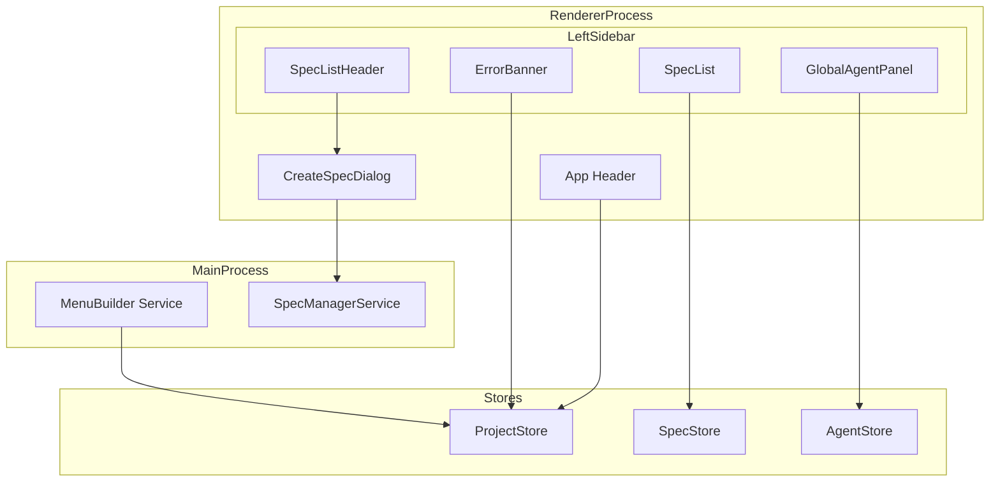
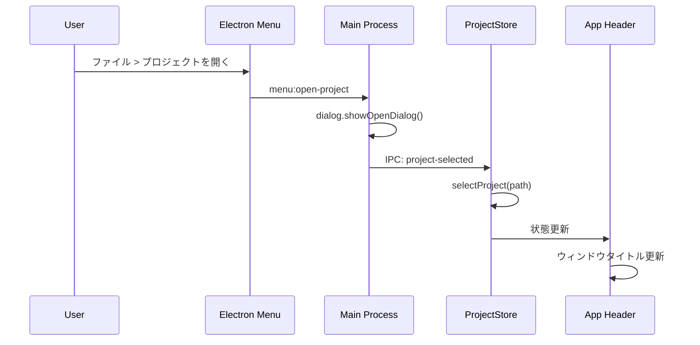
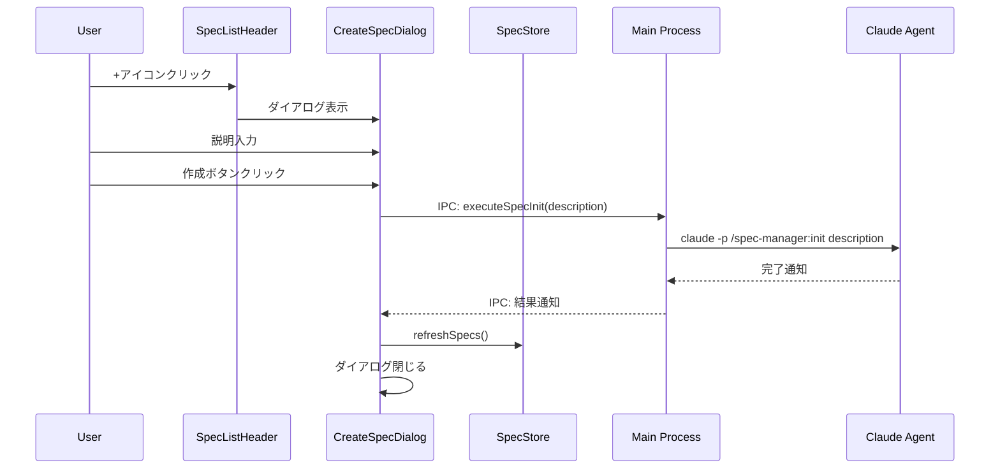

# Design Document

## Overview

**Purpose**: 本フィーチャーは、SDD Manager Electronアプリケーションの左ペイン（サイドバー）UIを刷新し、より効率的な画面スペースの活用と直感的な操作性を実現する。

**Users**: SDD Managerを使用する開発者が、仕様管理とAIエージェント監視を効率的に行うために利用する。

**Impact**: 現在のサイドバー構造を変更し、プロジェクト選択をメニューバーへ移行、ディレクトリチェック表示を最適化、グローバルAgent領域を追加、仕様作成フローをspec-manager連携に変更する。

### Goals

- プロジェクト選択機能をメニューバーに移行し、サイドバーのスペースを有効活用
- ディレクトリチェック表示を正常時非表示・エラー時バナー表示に最適化
- specに紐づかないグローバルエージェントの一覧表示機能を追加
- CreateSpecDialogを簡略化しspec-manager:init連携を実現
- サイドバーレイアウトを再構成し、効率的な情報アクセスを実現

### Non-Goals

- 右サイドバー（WorkflowView、AgentListPanel）の変更
- 中央エディタ領域の変更
- 下部パネル（AgentLogPanel、AgentInputPanel）の変更
- 新規プロジェクト作成機能（.kiro初期化）の拡張
- ダークモード対応の改善（既存機能を維持）

## Architecture

### Existing Architecture Analysis

現在のサイドバー構造：

```
Left Sidebar (App.tsx)
├── ProjectSelector
│   ├── プロジェクト選択ボタン
│   ├── ディレクトリ検証結果表示
│   └── spec-managerファイルインストール
├── 新規仕様ボタン（条件付き表示）
└── SpecList（条件付き表示）
    ├── ヘッダー（フィルタ）
    ├── ソートヘッダー
    └── 仕様一覧
```

主要な変更点：
- `ProjectSelector`コンポーネントをメニューバーと`ErrorBanner`に分割
- 新規仕様ボタンを`SpecListHeader`に+アイコンとして統合
- `GlobalAgentPanel`を仕様一覧下部に追加

### Architecture Pattern & Boundary Map



**Architecture Integration**:
- **Selected pattern**: 既存のZustand + React + Electron IPCパターンを踏襲
- **Domain/feature boundaries**: UI層（コンポーネント）、状態管理層（Store）、メインプロセス層（Service）の3層構造を維持
- **Existing patterns preserved**: Zustand store、IPC通信、コンポーネント分割パターン
- **New components rationale**: ErrorBanner（エラー表示の集約）、GlobalAgentPanel（グローバルAgent表示）、SpecListHeader（ヘッダー機能統合）
- **Steering compliance**: React + TypeScript、Tailwind CSS、Zustandの既存パターンに準拠

### Technology Stack

| Layer | Choice / Version | Role in Feature | Notes |
|-------|------------------|-----------------|-------|
| Frontend | React 19 | UIコンポーネント実装 | 既存 |
| State Management | Zustand | ProjectStore, SpecStore, AgentStore拡張 | 既存 |
| UI Framework | Tailwind CSS 4 | スタイリング | 既存 |
| Icons | Lucide React | アイコン表示 | 既存 |
| IPC | Electron contextBridge | メインプロセス連携 | 既存 |
| Menu | Electron Menu API | アプリケーションメニュー構築 | 新規使用 |

## System Flows

### プロジェクト選択フロー（メニューバー経由）



### 新規仕様作成フロー（spec-manager連携）



## Requirements Traceability

| Requirement | Summary | Components | Interfaces | Flows |
|-------------|---------|------------|------------|-------|
| 1.1 | メニューバーでプロジェクト選択オプション表示 | MenuBuilder | ElectronAPI.showOpenDialog | プロジェクト選択フロー |
| 1.2 | メニューバーから選択時に仕様一覧更新 | ProjectStore, SpecStore | IPC: project-selected | プロジェクト選択フロー |
| 1.3 | 現在のプロジェクト名をヘッダーに表示 | App Header | ProjectStore.currentProject | - |
| 1.4 | サイドバーからProjectSelector削除 | App.tsx | - | - |
| 2.1 | +アイコンボタンを仕様一覧ヘッダーに表示 | SpecListHeader | - | - |
| 2.2 | +アイコンクリックでダイアログ表示 | SpecListHeader, CreateSpecDialog | - | 新規仕様作成フロー |
| 2.3 | ホバー時にツールチップ表示 | SpecListHeader | - | - |
| 2.4 | プロジェクト未選択時は無効化 | SpecListHeader | ProjectStore.currentProject | - |
| 3.1 | ディレクトリ正常時は非表示 | ErrorBanner | ProjectStore.kiroValidation | - |
| 3.2 | ディレクトリ不足時はエラーバナー表示 | ErrorBanner | ProjectStore.kiroValidation | - |
| 3.3 | 不足ディレクトリ名を一覧表示 | ErrorBanner | ProjectStore.kiroValidation | - |
| 3.4 | バナークリックで初期化オプション展開 | ErrorBanner | - | - |
| 3.5 | spec-managerファイル不足時はインストールオプション表示 | ErrorBanner | ProjectStore.specManagerCheck | - |
| 4.1 | グローバルAgent領域を仕様一覧下部に表示 | GlobalAgentPanel | AgentStore | - |
| 4.2 | specId未設定のエージェントを表示 | GlobalAgentPanel | AgentStore.getGlobalAgents | - |
| 4.3 | グローバルエージェント0件時は折りたたみ/非表示 | GlobalAgentPanel | AgentStore | - |
| 4.4 | クリックでログパネル表示 | GlobalAgentPanel | AgentStore.selectAgent | - |
| 4.5 | 実行状態をアイコンで表示 | GlobalAgentPanel | AgentInfo.status | - |
| 4.6 | リアルタイムUI更新 | GlobalAgentPanel | AgentStore | - |
| 5.1 | 説明入力フィールドのみ表示 | CreateSpecDialog | - | - |
| 5.2 | 仕様名フィールドを削除 | CreateSpecDialog | - | - |
| 5.3 | 作成ボタンでspec-manager:init起動 | CreateSpecDialog | IPC: executeSpecInit | 新規仕様作成フロー |
| 5.4 | 実行中はローディング状態表示 | CreateSpecDialog | - | - |
| 5.5 | 完了時に仕様一覧更新しダイアログ閉じる | CreateSpecDialog, SpecStore | - | - |
| 5.6 | エラー時はメッセージ表示 | CreateSpecDialog | - | - |
| 6.1 | サイドバー構成順序（バナー、ヘッダー、一覧、Agent領域） | App.tsx | - | - |
| 6.2 | 仕様一覧がスクロール可能 | SpecList | - | - |
| 6.3 | グローバルAgent領域を下部固定 | App.tsx, GlobalAgentPanel | - | - |
| 6.4 | 仕様一覧のみスクロール、Agent領域は常時表示 | App.tsx | - | - |
| 6.5 | 仕様一覧ヘッダーに件数と+アイコン並列表示 | SpecListHeader | SpecStore | - |

## Components and Interfaces

| Component | Domain/Layer | Intent | Req Coverage | Key Dependencies | Contracts |
|-----------|--------------|--------|--------------|-----------------|-----------|
| MenuBuilder | Main Process | アプリケーションメニュー構築・管理 | 1.1, 1.2 | Electron Menu, dialog | Service |
| ErrorBanner | UI | ディレクトリエラーとインストールオプション表示 | 3.1-3.5 | ProjectStore (P0) | State |
| SpecListHeader | UI | 仕様一覧ヘッダー（件数、+ボタン） | 2.1-2.4, 6.5 | SpecStore (P0), ProjectStore (P1) | State |
| GlobalAgentPanel | UI | グローバルエージェント一覧表示 | 4.1-4.6 | AgentStore (P0) | State |
| CreateSpecDialog | UI | 仕様作成ダイアログ（説明のみ入力） | 5.1-5.6 | SpecStore (P0), ElectronAPI (P0) | Service, State |

### Main Process

#### MenuBuilder

| Field | Detail |
|-------|--------|
| Intent | アプリケーションメニューを構築し、プロジェクト選択・最近のプロジェクト機能を提供 |
| Requirements | 1.1, 1.2 |

**Responsibilities & Constraints**
- アプリケーションメニューの構築と更新
- 最近のプロジェクト一覧のサブメニュー管理
- プロジェクト選択ダイアログの表示
- ウィンドウタイトルの更新

**Dependencies**
- Outbound: Electron Menu API - メニュー構築 (P0)
- Outbound: Electron dialog API - ダイアログ表示 (P0)
- Outbound: BrowserWindow - タイトル更新 (P1)
- Outbound: IPC - レンダラープロセス通知 (P0)

**Contracts**: Service [x] / State [ ]

##### Service Interface

```typescript
interface MenuBuilderService {
  /**
   * アプリケーションメニューを初期化
   */
  initialize(): void;

  /**
   * 最近のプロジェクト一覧を更新
   * @param projects プロジェクトパスの配列
   */
  updateRecentProjects(projects: string[]): void;

  /**
   * 現在のプロジェクト名をウィンドウタイトルに反映
   * @param projectName プロジェクト名（nullでデフォルトタイトル）
   */
  updateWindowTitle(projectName: string | null): void;
}
```

- Preconditions: BrowserWindowが作成済みであること
- Postconditions: メニューが表示され、操作可能になること
- Invariants: メニューは常に最新の最近プロジェクト一覧を反映

**Implementation Notes**
- Integration: 既存のmain/index.tsでアプリケーション起動時にinitialize()を呼び出し
- Validation: プロジェクトパスの存在確認は呼び出し側で実施済みを前提
- Risks: macOSとWindows/Linuxでメニュー構造が異なる点に注意

### UI Layer

#### ErrorBanner

| Field | Detail |
|-------|--------|
| Intent | ディレクトリ検証エラーとspec-managerインストールオプションを条件付きで表示 |
| Requirements | 3.1, 3.2, 3.3, 3.4, 3.5 |

**Responsibilities & Constraints**
- kiroValidationエラー時のみバナー表示
- 不足ディレクトリの一覧表示
- クリックで詳細オプション展開
- spec-managerファイルのインストールボタン提供

**Dependencies**
- Inbound: App.tsx - 親コンポーネント (P0)
- Outbound: ProjectStore - 検証状態取得 (P0)

**Contracts**: State [x]

##### State Management

```typescript
interface ErrorBannerProps {
  /** 展開状態（外部制御用、省略時は内部状態） */
  expanded?: boolean;
  /** 展開状態変更コールバック */
  onExpandedChange?: (expanded: boolean) => void;
}

// ProjectStoreから取得する状態
interface ErrorBannerState {
  kiroValidation: KiroValidation | null;
  specManagerCheck: SpecManagerCheckResult | null;
  installLoading: boolean;
  installError: InstallError | null;
}
```

**Implementation Notes**
- Integration: 既存のProjectSelectorからValidationItemとSpecManagerFilesSectionを移植
- Validation: kiroValidation.exists && hasSpecs && hasSteeringがすべてtrueの場合は非表示
- Risks: 展開アニメーションのパフォーマンス

#### SpecListHeader

| Field | Detail |
|-------|--------|
| Intent | 仕様一覧のヘッダー部分を担当し、件数表示と新規作成ボタンを提供 |
| Requirements | 2.1, 2.2, 2.3, 2.4, 6.5 |

**Responsibilities & Constraints**
- 仕様件数の表示
- +アイコンボタンの表示
- ホバー時のツールチップ表示
- プロジェクト未選択時のボタン無効化

**Dependencies**
- Inbound: SpecList - 親コンポーネント (P0)
- Outbound: SpecStore - 件数取得 (P0)
- Outbound: ProjectStore - プロジェクト選択状態 (P1)

**Contracts**: State [x]

##### State Management

```typescript
interface SpecListHeaderProps {
  /** 仕様件数 */
  specCount: number;
  /** 新規作成ボタンクリックハンドラ */
  onCreateClick: () => void;
  /** ボタン無効化フラグ */
  disabled?: boolean;
}
```

**Implementation Notes**
- Integration: 既存のSpecListコンポーネント内のヘッダー部分を分離して実装
- Validation: disabled時はクリックイベントを無効化、視覚的にもdisabled状態を表示
- Risks: なし

#### GlobalAgentPanel

| Field | Detail |
|-------|--------|
| Intent | specに紐づかないグローバルエージェントの一覧表示と操作 |
| Requirements | 4.1, 4.2, 4.3, 4.4, 4.5, 4.6 |

**Responsibilities & Constraints**
- グローバルエージェント（specIdがnull/undefined/空文字）のフィルタリングと表示
- エージェント0件時の折りたたみ/非表示
- エージェント選択時のログパネル連携
- 実行状態アイコンのリアルタイム更新

**Dependencies**
- Inbound: App.tsx - 親コンポーネント (P0)
- Outbound: AgentStore - エージェント状態管理 (P0)

**Contracts**: State [x]

##### State Management

```typescript
// AgentStoreに追加するヘルパーメソッド
interface AgentStoreExtension {
  /**
   * グローバルエージェント（specIdが空またはundefined）を取得
   */
  getGlobalAgents(): AgentInfo[];
}

interface GlobalAgentPanelProps {
  /** 折りたたみ状態 */
  collapsed?: boolean;
  /** 折りたたみ状態変更コールバック */
  onCollapsedChange?: (collapsed: boolean) => void;
}
```

**Implementation Notes**
- Integration: 既存のAgentListPanelを参考に実装、STATUS_CONFIGを再利用
- Validation: グローバルエージェントの判定はspecIdが空文字、null、undefinedのいずれか
- Risks: 大量のグローバルエージェント表示時のパフォーマンス

#### CreateSpecDialog (Modified)

| Field | Detail |
|-------|--------|
| Intent | 仕様作成ダイアログを簡略化し、説明のみ入力でspec-manager:initを起動 |
| Requirements | 5.1, 5.2, 5.3, 5.4, 5.5, 5.6 |

**Responsibilities & Constraints**
- 説明入力フィールドのみ表示（名前フィールド削除）
- spec-manager:initコマンドの起動
- ローディング状態の表示
- 完了/エラー時の処理

**Dependencies**
- Inbound: SpecListHeader - 呼び出し元 (P0)
- Outbound: SpecStore - 仕様一覧更新 (P0)
- Outbound: ElectronAPI - IPC通信 (P0)

**Contracts**: Service [x] / State [x]

##### Service Interface

```typescript
// ElectronAPIに追加
interface ElectronAPIExtension {
  /**
   * spec-manager:initコマンドを実行
   * @param projectPath プロジェクトパス
   * @param description 仕様の説明
   * @returns 作成された仕様名
   */
  executeSpecInit(projectPath: string, description: string): Promise<string>;
}
```

##### State Management

```typescript
interface CreateSpecDialogState {
  description: string;
  isCreating: boolean;
  error: string | null;
}
```

**Implementation Notes**
- Integration: 既存のCreateSpecDialogを修正、名前フィールドとバリデーションを削除
- Validation: 説明は10文字以上の入力を要求（既存ルール維持）
- Risks: spec-manager:init実行に時間がかかる場合のUX

## Data Models

### Domain Model

本フィーチャーでは新規エンティティの追加はなし。既存のAgentInfo、SpecMetadata、KiroValidationを使用。

**グローバルエージェントの定義**:
- AgentInfoのspecIdが空文字列("")、null、またはundefinedであるエージェント
- 既存のAgentStoreのデータ構造を変更せず、フィルタリングで対応

### Logical Data Model

**AgentStore拡張**:

```
agents: Map<string, AgentInfo[]>
  └── key: specId (空文字列 "" の場合はグローバルエージェント)
  └── value: AgentInfo[]
        ├── agentId: string
        ├── specId: string (空 = グローバル)
        ├── phase: string
        ├── status: AgentStatus
        └── ...
```

## Error Handling

### Error Strategy

本フィーチャーでは既存のエラーハンドリングパターンを踏襲する。

### Error Categories and Responses

**User Errors (4xx相当)**:
- 説明が10文字未満 - フィールド下にバリデーションエラーメッセージ表示
- プロジェクト未選択で操作試行 - ボタン無効化で防止

**System Errors (5xx相当)**:
- spec-manager:init実行失敗 - ダイアログ内にエラーメッセージ表示、リトライ可能
- ディレクトリ作成失敗 - ErrorBannerにエラー表示

**Business Logic Errors**:
- ディレクトリ不足 - ErrorBannerで不足項目を表示、初期化オプション提供

### Monitoring

- 既存のloggerサービスを使用してエラーをログ出力
- spec-manager:init実行結果をコンソールに出力

## Testing Strategy

### Unit Tests

- **SpecListHeader**: 件数表示、+ボタンクリック、disabled状態
- **ErrorBanner**: 条件付き表示、展開/折りたたみ、インストールボタン
- **GlobalAgentPanel**: グローバルエージェントフィルタリング、折りたたみ、状態表示
- **AgentStore.getGlobalAgents**: 空specId、null、undefinedのフィルタリング
- **CreateSpecDialog**: 説明のみ入力、バリデーション、ローディング状態

### Integration Tests

- メニューバーからのプロジェクト選択フロー
- +ボタン -> CreateSpecDialog -> spec-manager:init -> 仕様一覧更新
- ErrorBanner -> インストール -> 状態更新
- GlobalAgentPanel -> エージェント選択 -> ログパネル表示

### E2E Tests

- 完全な新規仕様作成フロー（説明入力からspec-manager:init完了まで）
- プロジェクト切り替え時のUI更新確認
- グローバルエージェントの表示と操作

## Optional Sections

### Security Considerations

本フィーチャーでは新たなセキュリティ上の考慮事項はなし。既存のIPC通信パターンとファイルアクセス権限を踏襲。

### Performance & Scalability

- **グローバルエージェント一覧**: 大量表示時は仮想スクロールを検討（現時点では不要）
- **メニュー更新**: 最近のプロジェクト一覧更新は最大10件に制限（既存仕様）
