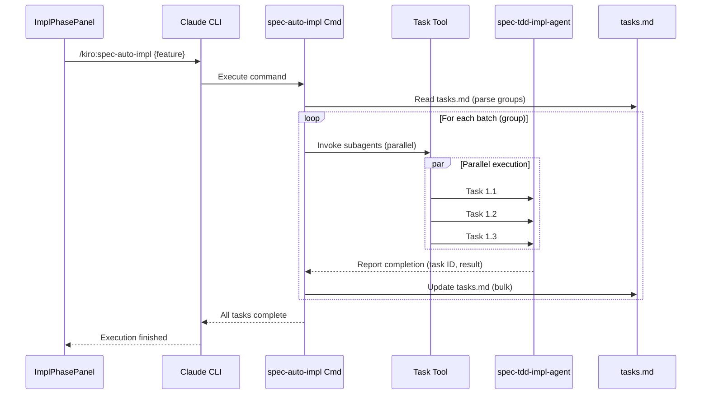
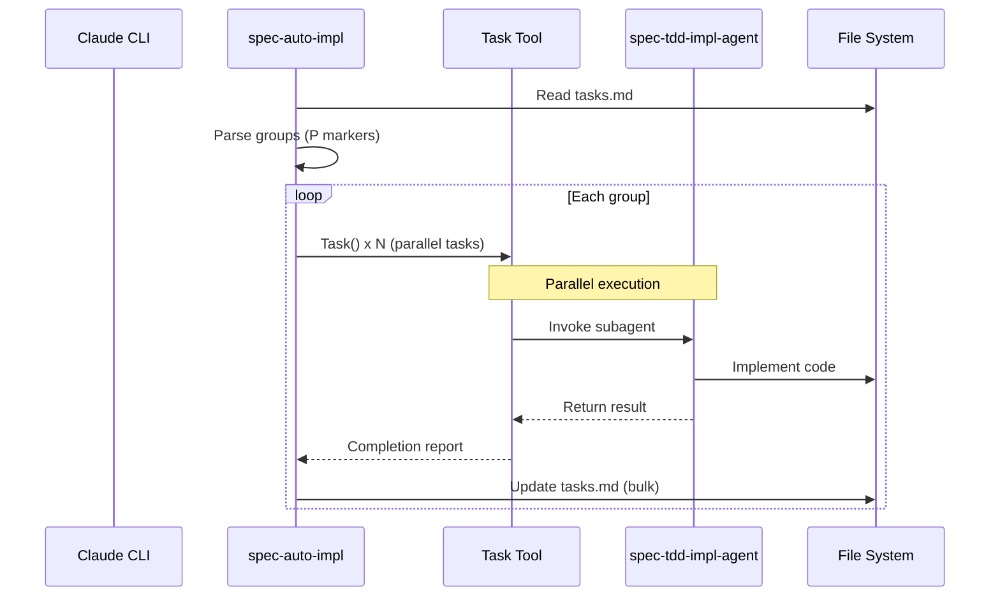
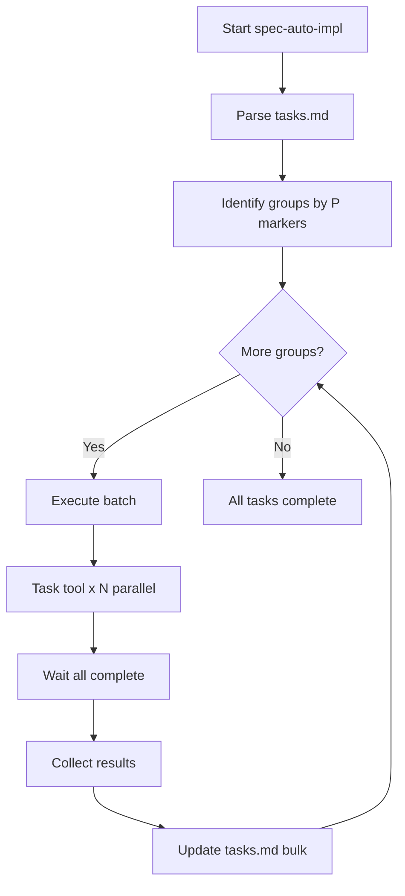
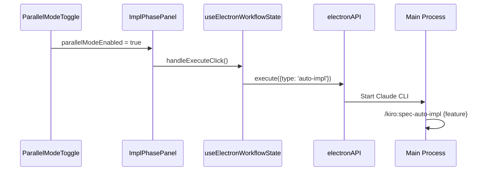

# Design: spec-auto-impl-command

## Overview

**Purpose**: `/kiro:spec-auto-impl` Slash Commandを提供し、Task toolを使用した並列サブエージェント起動とバッチ完了待機により、1回のコマンド実行で全タスク完了まで自律的に並列バッチ実行を継続する機能を実現する。

**Users**: 開発者がSDD Orchestrator UIまたはCLIから並列自動実装を実行する際に使用する。

**Impact**: 既存のparallel-task-implのUI並列起動ロジック（handleParallelExecute + Promise.all）を、Claude CLIプロセス内でのTask toolによる自律並列実行に置き換える。未使用となるparallelImplService関連コードを削除する。

### Goals
- Task toolによるサブエージェント並列起動とバッチ完了待機の実現
- 1回のコマンド実行で全タスク完了まで自動継続
- ファイル衝突防止のため、親エージェントがtasks.md更新を担当
- 自動実行フロー（autoExecutionCoordinator）との統合

### Non-Goals
- UIでの詳細な進捗表示（バッチN完了等）
- 並列実行専用のキャンセルUI
- cc-sdd, spec-managerプロファイルへの対応

## Architecture

### Existing Architecture Analysis

現在の並列タスク実装には以下のコンポーネントが存在する:

1. **ParallelImplService** (`parallelImplService.ts`): 並列実行状態管理（未使用、削除対象）
2. **handleParallelExecute** (`useElectronWorkflowState.ts`): Promise.allによる複数プロセス同時起動
3. **ImplPhasePanel**: 並列トグルUIコンポーネント
4. **autoExecutionCoordinator**: 自動実行フェーズ管理

課題: handleParallelExecuteはグループ内の同時起動のみ対応し、グループ間自動進行が未実装。

### Architecture Pattern & Boundary Map



**Architecture Integration**:
- **Selected pattern**: Command-Subagent Pattern（Task toolによる並列サブエージェント委譲）
- **Domain boundaries**: 親エージェント（バッチ管理・tasks.md更新）、子エージェント（単一タスク実装）
- **Existing patterns preserved**: cc-sdd-agentプロファイルの既存コマンド配置規則に従う
- **New components rationale**: spec-auto-impl.md（新規Slash Command）はグループ間自動進行を実現する唯一のエントリーポイント
- **Steering compliance**: SSOT（tasks.md更新は親エージェントのみ）、DRY（既存spec-tdd-impl-agentを再利用）

### Technology Stack

| Layer | Choice / Version | Role in Feature | Notes |
|-------|------------------|-----------------|-------|
| CLI | Claude CLI | Slash Command実行環境 | Task toolでサブエージェント起動 |
| Command | `.claude/commands/cc-sdd-agent/spec-auto-impl.md` | コマンド定義 | cc-sdd-agentプロファイル |
| Template | `templates/commands/cc-sdd-agent/spec-auto-impl.md` | インストール用テンプレート | profileManagerでコピー |
| Agent | spec-tdd-impl-agent | 既存TDD実装エージェント | 変更なし、再利用 |
| UI | React + TypeScript | ImplPhasePanel | 並列トグル連携 |

### Command Prompt Architecture (Claude Code features only)

**Execution Model**:
- [x] MCP tool direct call: Claude Code calls MCP tools via allowed-tools

**Rationale**: Task toolを使用してサブエージェントを直接起動することで、グループ間自動進行とバッチ完了待機を実現。親エージェントがTask toolの戻り値で完了を検知し、次バッチへ進行。

**Data Flow**:


## System Flows

### Parallel Batch Execution Flow



### UI Integration Flow



## Requirements Traceability

| Criterion ID | Summary | Components | Implementation Approach |
|--------------|---------|------------|------------------------|
| 1.1 | コマンド実行でtasks.md解析・グループ化 | spec-auto-impl.md | 新規実装: tasks.mdパース、(P)マーカー検出 |
| 1.2 | (P)マーク付きタスクを並列グループ化 | spec-auto-impl.md | 新規実装: グループ分割ロジック |
| 1.3 | Task toolで並列サブエージェント起動 | spec-auto-impl.md | 新規実装: Task tool並列呼び出し |
| 1.4 | バッチ完了待機から次バッチへ | spec-auto-impl.md | 新規実装: 待機ループ |
| 1.5 | 全バッチ完了まで自動継続 | spec-auto-impl.md | 新規実装: 外側ループ |
| 1.6 | コマンド配置場所 | templates/commands/cc-sdd-agent/spec-auto-impl.md | 新規作成 |
| 2.1 | サブエージェントはtasks.md編集しない | spec-tdd-impl-agent (既存) | 変更なし: 指示追加でブロック |
| 2.2 | サブエージェントが完了報告 | spec-auto-impl.md | 新規実装: Task戻り値解析 |
| 2.3 | 親エージェントがtasks.md更新 | spec-auto-impl.md | 新規実装: バッチ完了時一括更新 |
| 2.4 | バッチ完了ごとにtasks.md更新 | spec-auto-impl.md | 新規実装: ループ内更新 |
| 3.1 | 並列トグルON時にauto-impl呼び出し | useElectronWorkflowState.ts | 既存修正: handleParallelExecute変更 |
| 3.2 | 並列トグルOFF時にspec-impl呼び出し | useElectronWorkflowState.ts | 既存維持: handleImplExecute |
| 3.3 | 実行中スピナー表示 | ImplPhasePanel | 既存維持: isExecuting prop |
| 3.4 | 完了時表示 | ImplPhasePanel | 既存維持: status prop |
| 3.5 | エラー時ログ表示 | AgentLogPanel | 既存維持: ログ連携 |
| 4.1 | autoExecutionでauto-impl呼び出し | autoExecutionHandlers.ts | 既存修正: impl実行時のコマンド切替 |
| 4.2 | 逐次実行ロジック置換 | autoExecutionHandlers.ts | 既存修正: 条件分岐追加 |
| 5.1 | parallelImplService.ts削除 | parallelImplService.ts | 削除 |
| 5.2 | parallelImplService.test.ts削除 | parallelImplService.test.ts | 削除 |
| 5.3 | handleParallelExecute内Promise.all削除 | useElectronWorkflowState.ts | 既存修正: ロジック置換 |
| 5.4 | 削除後ビルド成功 | - | 検証: npm run build |
| 5.5 | 削除後テスト成功 | - | 検証: npm run test |
| 6.1 | SKILL.md: 親エージェント更新指示 | spec-auto-impl.md | 新規実装: 指示文言 |
| 6.2 | SKILL.md: approvals.tasks.approved参照 | spec-auto-impl.md | 新規実装: spec.json参照 |
| 6.3 | SKILL.md: name維持 | spec-auto-impl.md | 新規実装: frontmatter |
| 6.4 | SKILL.md: TDD必須維持 | spec-auto-impl.md | 新規実装: 指示継承 |
| 7.1 | テンプレート存在 | templates/commands/cc-sdd-agent/spec-auto-impl.md | 新規作成 |
| 7.2 | プロファイルインストール時にコピー | profileManager.ts | 既存確認: kiroプロファイル対応 |
| 7.3 | インストール後使用可能 | - | 検証: インストール後動作確認 |

### Coverage Validation Checklist

- [x] Every criterion ID from requirements.md appears in the table above
- [x] Each criterion has specific component names (not generic references)
- [x] Implementation approach distinguishes "reuse existing" vs "new implementation"
- [x] User-facing criteria specify concrete UI components

## Components and Interfaces

| Component | Domain/Layer | Intent | Req Coverage | Key Dependencies | Contracts |
|-----------|--------------|--------|--------------|------------------|-----------|
| spec-auto-impl.md | Command | 並列バッチ実行の親エージェント | 1.1-1.6, 2.1-2.4, 6.1-6.4 | Task tool, spec-tdd-impl-agent | Service |
| useElectronWorkflowState | Renderer/Hook | UI状態管理・コマンド実行 | 3.1-3.5 | electronAPI | - |
| autoExecutionHandlers | Main/IPC | 自動実行フェーズ制御 | 4.1-4.2 | autoExecutionCoordinator | - |
| ImplPhasePanel | Shared/UI | 実装フェーズUI | 3.1-3.5 | useElectronWorkflowState | - |

### Commands

#### spec-auto-impl.md

| Field | Detail |
|-------|--------|
| Intent | Task toolによる並列サブエージェント起動とバッチ完了待機を管理する親エージェント |
| Requirements | 1.1, 1.2, 1.3, 1.4, 1.5, 1.6, 2.1, 2.2, 2.3, 2.4, 6.1, 6.2, 6.3, 6.4 |

**Responsibilities & Constraints**
- tasks.mdをパースし、(P)マーカーでグループ分割
- 各グループ内タスクをTask toolで並列起動
- 全サブエージェント完了を待機
- バッチ完了時にtasks.mdを一括更新
- 全バッチ完了まで自動継続

**Dependencies**
- Inbound: Claude CLI (P0)
- Outbound: Task tool → spec-tdd-impl-agent (P0)
- External: tasks.md, spec.json (P0)

**Contracts**: Service [x]

##### Service Interface

```typescript
// Slash Commandとして実行されるため、TypeScriptインタフェースではなく
// Markdownプロンプトで定義される

// 入力: $1 = feature name
// 出力: 全タスク完了報告 or エラー報告

// グループ解析結果の型（内部処理用）
interface TaskGroup {
  groupIndex: number;
  tasks: Array<{
    id: string;
    title: string;
    completed: boolean;
  }>;
  isParallel: boolean;
}

// Task tool呼び出し結果
interface SubagentResult {
  taskId: string;
  status: 'completed' | 'failed';
  error?: string;
}
```

**Implementation Notes**
- Task toolのparallel invocationにより同時実行
- 待機はTask tool呼び出し自体がブロッキングなため自然に実現
- サブエージェントはtasks.md更新禁止を明示的に指示

### Renderer Hooks

#### useElectronWorkflowState (修正)

| Field | Detail |
|-------|--------|
| Intent | 並列モード時にspec-auto-implコマンドを呼び出すよう変更 |
| Requirements | 3.1, 3.2, 5.3 |

**Responsibilities & Constraints**
- handleParallelExecuteをspec-auto-impl呼び出しに変更
- Promise.allによる複数プロセス起動ロジックを削除
- 並列トグルOFF時は既存handleImplExecuteを維持

**Dependencies**
- Inbound: ImplPhasePanel (P0)
- Outbound: electronAPI.execute (P0)

**Implementation Notes**
- 既存のhandleParallelExecute関数を修正
- execute type: 'auto-impl' を追加
- parallelImplServiceへの依存を削除

### Main Process

#### autoExecutionHandlers (修正)

| Field | Detail |
|-------|--------|
| Intent | 自動実行のimplフェーズでspec-auto-implを使用 |
| Requirements | 4.1, 4.2 |

**Responsibilities & Constraints**
- implフェーズ実行時にspec-auto-implコマンドを呼び出す
- 既存の逐次実行ロジックを並列実装に置換

**Dependencies**
- Inbound: autoExecutionCoordinator (P0)
- Outbound: agentProcess (P0)

**Implementation Notes**
- executePhase('impl')の実装を変更
- 並列実行設定に関わらずspec-auto-implを使用（D4決定）

## Data Models

### Domain Model

**TaskGroup** (既存taskParallelParser.ts)
- tasks.mdから解析されるタスクグループ
- isParallelフラグで(P)マーカー付きグループを識別
- 変更なし

### Logical Data Model

**spec.json approvals構造** (既存)
```json
{
  "approvals": {
    "tasks": {
      "generated": true,
      "approved": true
    }
  }
}
```
- spec-auto-implはapprovals.tasks.approvedをチェック
- D2決定により6.2要件を満たす

## Error Handling

### Error Strategy

| Error Type | Handling | Severity |
|------------|----------|----------|
| tasks.md不在 | 即座に停止、エラーメッセージ表示 | Critical |
| approvals未承認 | 即座に停止、承認要求メッセージ | Critical |
| サブエージェント失敗 | バッチ内成功タスクをtasks.mdに反映後、停止（詳細は下記） | Major |
| Task tool呼び出しエラー | リトライなし、エラー報告 | Major |

#### Partial Completion Handling (GAP-T1対応)

バッチ内で一部のサブエージェントが失敗した場合の処理:

1. **成功タスクは即座に反映**: 完了報告を受けたタスクは即座にtasks.mdをチェック状態に更新
2. **失敗タスクは未完了のまま**: 失敗したタスクは`- [ ]`状態を維持
3. **次バッチへは進行しない**: エラーメッセージを表示し、ユーザーの介入を待つ
4. **再実行時は未完了タスクから**: 再度コマンドを実行すると、未完了タスクのみが実行対象となる

この方針により、部分的な進捗も保存され、失敗タスクのみを再実行できる。

### Monitoring

- サブエージェントのログは既存AgentLogPanelに表示
- 親エージェントの進捗は標準出力で確認

## Testing Strategy

### Unit Tests

1. **tasks.mdパースロジック**: グループ分割、(P)マーカー検出
2. **tasks.md一括更新ロジック**: チェックボックス更新

### Integration Tests

1. **Slash Command実行**: spec-auto-implコマンド全体フロー
2. **UI連携**: 並列トグルON時のコマンド呼び出し
3. **自動実行連携**: autoExecutionからのimplフェーズ実行

### E2E Tests

1. **並列トグルON → 実装ボタン → 完了**: 全フロー確認
2. **自動実行 → implフェーズ → 完了**: autoExecution連携確認

## Design Decisions

### DD-001: Task toolによる並列実行アプローチ

| Field | Detail |
|-------|--------|
| Status | Accepted |
| Context | 既存handleParallelExecuteはPromise.allで複数Agentを起動するが、グループ間自動進行が未実装 |
| Decision | Claude CLI内でTask toolを使用してサブエージェントを並列起動し、親エージェントがバッチ完了を待機 |
| Rationale | 1つのClaude CLIセッション内で完結し、グループ間自動進行を実現できる。Electron UIからの複数プロセス管理が不要 |
| Alternatives Considered | (1) Promise.allを拡張してグループ間進行を追加 → 複雑化、Electron依存増 (2) MCP serverで管理 → 過剰な複雑化 |
| Consequences | 親エージェントがオーケストレーション責任を持つ。サブエージェントはtasks.md編集禁止 |

### DD-002: 親エージェントによるtasks.md一括更新

| Field | Detail |
|-------|--------|
| Status | Accepted |
| Context | 複数サブエージェントが同時にtasks.mdを更新すると競合リスクがある |
| Decision | サブエージェントはtasks.mdを編集せず、完了報告のみ。親エージェントがバッチ完了時に一括更新 |
| Rationale | ファイル衝突回避、確実な更新、SSOT原則の遵守 |
| Alternatives Considered | (1) ファイルロック機構 → 実装複雑化 (2) 各自更新後にマージ → 衝突リスク残存 |
| Consequences | サブエージェントへの明示的な禁止指示が必要。spec-tdd-impl-agentは変更不要（タスク完了時に更新しない指示を親から与える） |

### DD-003: 既存コードの削除方針

| Field | Detail |
|-------|--------|
| Status | Accepted |
| Context | parallelImplService.ts等のOrphanedコードが存在する |
| Decision | 未使用コードを物理削除し、後方互換性は考慮しない |
| Rationale | 使用されていないコードを残す技術的理由がない。YAGNI原則 |
| Alternatives Considered | (1) 非推奨マーク後に段階的削除 → 不要な複雑化 |
| Consequences | 削除対象: parallelImplService.ts, parallelImplService.test.ts, handleParallelExecute内のPromise.allロジック |

### DD-004: 自動実行時も並列バッチ実行を使用

| Field | Detail |
|-------|--------|
| Status | Accepted |
| Context | autoExecutionのimplフェーズで既存逐次実行と新規並列実行のどちらを使うか |
| Decision | 手動・自動実行の両方でspec-auto-implを使用し、動作を統一 |
| Rationale | 効率的な実装を常に提供。ユーザーが並列/逐次を選択する必要性が低い |
| Alternatives Considered | (1) 設定で切替可能に → 複雑化、ユーザー負担 |
| Consequences | autoExecutionHandlers.tsのimplフェーズ実行ロジックを変更 |

### DD-005: UIトグルの維持

| Field | Detail |
|-------|--------|
| Status | Accepted |
| Context | 既存の並列トグルを削除するか残すか |
| Decision | 残す。トグルON時にspec-auto-impl呼び出し、OFF時は既存の逐次実装（spec-impl） |
| Rationale | ユーザーに選択肢を提供。逐次実行が必要なケース（デバッグ等）に対応 |
| Alternatives Considered | (1) トグル削除、常に並列 → 柔軟性低下 |
| Consequences | handleParallelExecuteとhandleImplExecuteの両方を維持 |

### DD-006: コマンド配置場所

| Field | Detail |
|-------|--------|
| Status | Accepted |
| Context | `common/`（プレフィックスなし）か`kiro/`（kiro:プレフィックス）か |
| Decision | `kiro/`に配置し、`/kiro:spec-auto-impl`として呼び出す |
| Rationale | 既存の命名規則（/kiro:spec-impl等）との一貫性 |
| Alternatives Considered | (1) common/auto-impl → 命名規則との不整合 |
| Consequences | templates/commands/cc-sdd-agent/spec-auto-impl.mdを新規作成 |

## Integration & Deprecation Strategy

### 既存ファイル修正（Wiring Points）

| File | Modification |
|------|--------------|
| `electron-sdd-manager/src/renderer/hooks/useElectronWorkflowState.ts` | handleParallelExecuteをspec-auto-impl呼び出しに変更 |
| `electron-sdd-manager/src/main/ipc/autoExecutionHandlers.ts` | implフェーズ実行時のコマンドをspec-auto-implに変更 |
| `electron-sdd-manager/src/remote-ui/hooks/useRemoteWorkflowState.ts` | handleParallelExecuteをspec-auto-impl呼び出しに変更（Remote UI対応） |

### 既存ファイル削除（Cleanup）

| File | Reason |
|------|--------|
| `electron-sdd-manager/src/main/services/parallelImplService.ts` | Orphaned - 本機能で不要 |
| `electron-sdd-manager/src/main/services/parallelImplService.test.ts` | Orphaned - 本機能で不要 |

### 新規ファイル作成

| File | Purpose |
|------|---------|
| `electron-sdd-manager/resources/templates/commands/cc-sdd-agent/spec-auto-impl.md` | Slash Commandテンプレート |
| `.claude/commands/cc-sdd-agent/spec-auto-impl.md` | 開発環境用インストール済みコマンド |
