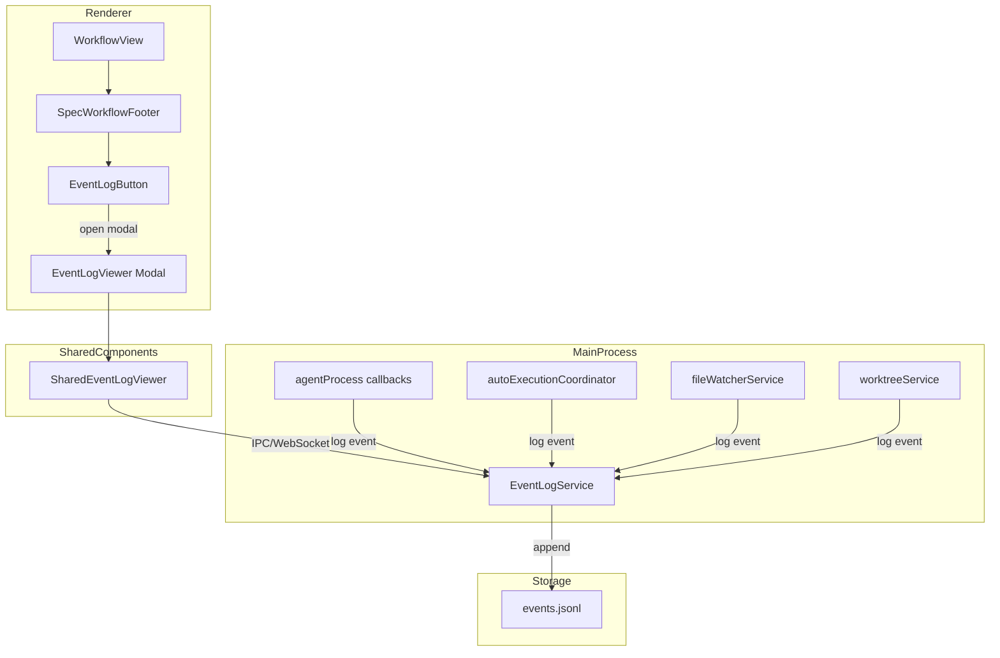
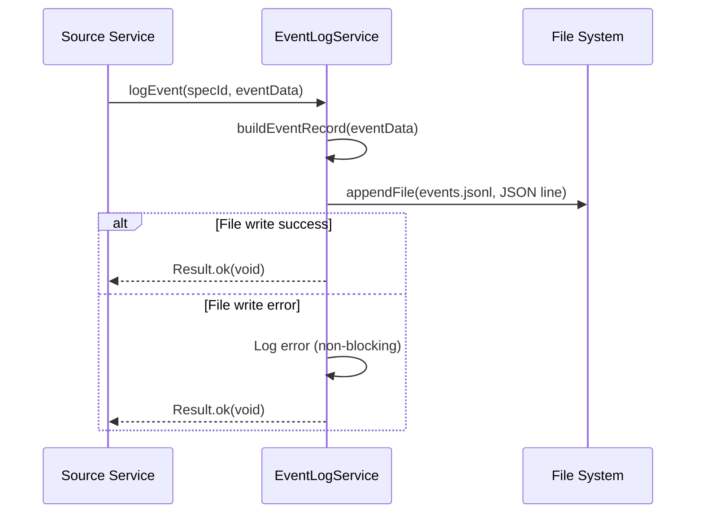
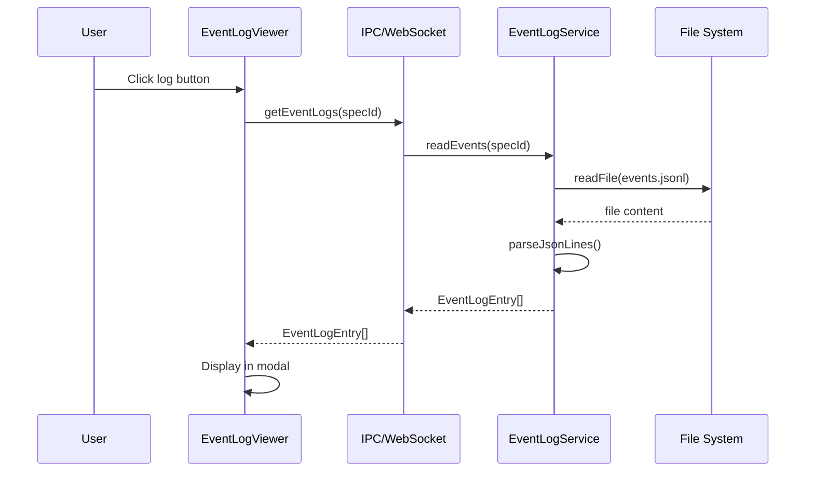

# Design Document: Spec Event Log

## Overview

**Purpose**: この機能は、Spec単位でのイベントログ（アクティビティログ）を記録・閲覧する仕組みを提供する。従来のシステムログ（デバッグ用）とは異なり、ユーザーが「このSpecに対して何が起きたか」を後から追跡できるようにすることで、ワークフローの透明性と問題調査の効率を向上させる。

**Users**: SDD Orchestratorのユーザーが、Specのワークフロー履歴を確認し、問題発生時の調査を行う。

**Impact**: 既存のワークフローUIにイベントログボタンを追加し、Main Processに新しいEventLogServiceを導入する。

### Goals

- Spec単位でのイベントログを自動記録（Agent操作、自動実行、承認、worktree操作等）
- JSON Lines形式での永続化（`.kiro/specs/{spec-name}/events.jsonl`）
- モーダルダイアログによるイベントログビューアの提供
- Electron版とRemote UI版の両方で同一機能を提供

### Non-Goals

- プロジェクト横断でのイベントログ集約表示
- イベントログの検索/フィルタ機能
- イベントログのエクスポート機能
- イベントログの保持期間制限/自動削除
- リアルタイム通知（トースト等）
- Bugワークフローのイベントログ

## Architecture

### Existing Architecture Analysis

本機能は既存のElectronアーキテクチャに沿って拡張を行う。

- **Main Process**: サービス層（`src/main/services/`）にEventLogServiceを追加
- **Renderer Process**: 既存のWorkflowViewにログビューアボタンを追加
- **Shared Components**: `src/shared/components/`にEventLogViewerを配置
- **IPC/WebSocket**: 既存のパターンに従いチャンネルとハンドラを追加

**既存パターンとの整合**:
- ファイル操作: fileServiceと同様のResult型ベースのエラーハンドリング
- UIコンポーネント: DocumentReviewPanel, InspectionPanelと同様のsharedコンポーネント配置
- 状態管理: Main Processがイベントログを管理し、Renderer/RemoteUIはIPCで取得

### Architecture Pattern & Boundary Map



**Architecture Integration**:
- Selected pattern: Event Sourcing (append-only log)
- Domain boundaries: EventLogServiceがイベント永続化を一元管理
- Existing patterns preserved: Main Process SSOT, shared component pattern
- New components rationale: EventLogServiceはイベント記録の集約点として必要
- Steering compliance: KISS, Single Responsibility

### Technology Stack

| Layer | Choice / Version | Role in Feature | Notes |
|-------|------------------|-----------------|-------|
| Frontend | React 19, TypeScript 5.8+ | EventLogViewerコンポーネント | 既存スタック |
| Backend | Node.js 20+, Electron 35 | EventLogService | ファイル操作 |
| Data | JSON Lines | イベント永続化 | Append-only形式 |
| UI | Tailwind CSS 4, Lucide React | ビューアスタイリング | 既存UIライブラリ |

## System Flows

### Event Recording Flow



**Key Decision**: ファイル書き込みエラーは元の処理に影響を与えない（fire-and-forget）。

### Event Viewing Flow



## Requirements Traceability

| Criterion ID | Summary | Components | Implementation Approach |
|--------------|---------|------------|------------------------|
| 1.1 | Agent開始時のイベント記録 | EventLogService, agentProcess | New: EventLogService.logEvent呼び出し追加 |
| 1.2 | Agent正常終了時のイベント記録 | EventLogService, agentProcess | New: onExit callback内でlogEvent |
| 1.3 | Agent失敗時のイベント記録 | EventLogService, agentProcess | New: onError callback内でlogEvent |
| 1.4 | 自動実行開始時のイベント記録 | EventLogService, autoExecutionCoordinator | New: start処理内でlogEvent |
| 1.5 | 自動実行終了時のイベント記録 | EventLogService, autoExecutionCoordinator | New: complete/fail処理内でlogEvent |
| 1.6 | Worktree作成時のイベント記録 | EventLogService, worktreeService | New: create処理内でlogEvent |
| 1.7 | Worktree削除/マージ時のイベント記録 | EventLogService, worktreeService | New: remove/merge処理内でlogEvent |
| 1.8 | ドキュメントレビュー開始/完了記録 | EventLogService, documentReviewService | New: start/complete処理内でlogEvent |
| 1.9 | Inspection開始/完了記録 | EventLogService, specManagerService | New: inspection処理内でlogEvent |
| 1.10 | 承認操作の記録 | EventLogService, handlers | New: updateApproval内でlogEvent |
| 1.11 | Phase遷移の記録 | EventLogService, fileService | New: updateSpecJsonFromPhase内でlogEvent |
| 2.1 | events.jsonlへの保存 | EventLogService | New: appendFile実装 |
| 2.2 | JSON Lines形式 | EventLogService | New: 1行1イベントで出力 |
| 2.3 | UTCタイムスタンプ | EventLogService | New: ISO 8601形式で記録 |
| 2.4 | イベント種別 | EventLogEntry type | New: type discriminated union |
| 2.5 | 詳細情報 | EventLogEntry | New: type別追加フィールド |
| 2.6 | ファイル自動作成 | EventLogService | New: appendFile時に自動作成 |
| 3.1 | フッターボタン配置 | SpecWorkflowFooter, EventLogButton | New: SpecWorkflowFooter内にボタン追加 |
| 3.2 | 常時ボタン表示 | EventLogButton | New: 条件なしで表示 |
| 3.3 | モーダル表示 | EventLogViewerModal | New: sharedコンポーネント |
| 3.4 | 時系列表示（新しい順） | EventLogViewerModal | New: reverse sort |
| 3.5 | タイムスタンプ/種別/詳細表示 | EventLogViewerModal | New: リストアイテム |
| 3.6 | 視覚的区別 | EventLogListItem | New: アイコン/色分け |
| 3.7 | 空状態メッセージ | EventLogViewerModal | New: EmptyState表示 |
| 4.1 | 基本フィールド定義 | EventLogEntry type | New: TypeScript型定義 |
| 4.2 | イベント種別追加フィールド | EventLogEntry union | New: discriminated union |
| 4.3 | イベント種別定義 | EventType | New: 文字列リテラル型 |
| 5.1 | Sharedコンポーネント実装 | EventLogViewerModal | New: src/shared/components/ |
| 5.2 | Electron/RemoteUI共通UI | EventLogViewerModal | Reuse: shared pattern |
| 5.3 | WebSocket API対応 | webSocketHandler | New: getEventLogs handler |
| 5.4 | IPC API対応 | handlers, channels | New: IPC channel追加 |
| 6.1 | Main Process実装 | EventLogService | New: サービス実装 |
| 6.2 | 一元管理 | EventLogService | New: logEvent/readEvents |
| 6.3 | 既存サービスからの呼び出し | agentProcess等 | Extend: callback追加 |
| 6.4 | エラー時の非影響 | EventLogService | New: try-catch with logging |

## Components and Interfaces

### Component Summary

| Component | Domain/Layer | Intent | Req Coverage | Key Dependencies | Contracts |
|-----------|--------------|--------|--------------|------------------|-----------|
| EventLogService | Main/Service | イベントログの記録・読み取り | 1.1-1.11, 2.1-2.6, 6.1-6.4 | fileService (P1) | Service |
| EventLogViewerModal | Shared/UI | イベントログのモーダル表示 | 3.3-3.7 | EventLogService (P0) | - |
| EventLogButton | Shared/UI | ログビューア起動ボタン | 3.1, 3.2 | - | - |
| EventLogListItem | Shared/UI | 個別イベント表示 | 3.5, 3.6 | - | - |

### Main Process / Service Layer

#### EventLogService

| Field | Detail |
|-------|--------|
| Intent | Spec単位のイベントログの記録と読み取りを一元管理 |
| Requirements | 1.1-1.11, 2.1-2.6, 6.1-6.4 |

**Responsibilities & Constraints**
- イベントの永続化（append-only）
- イベントの読み取り（全件取得）
- ファイル書き込みエラーの隔離（元処理に影響させない）
- Spec単位のファイル管理（`events.jsonl`）

**Dependencies**
- Inbound: agentProcess, autoExecutionCoordinator, worktreeService, documentReviewService, handlers — イベント記録 (P0)
- Outbound: File System (fs/promises) — ファイル操作 (P0)

**Contracts**: Service [x]

##### Service Interface

```typescript
interface EventLogService {
  /**
   * イベントをログファイルに記録する
   * @param projectPath プロジェクトパス
   * @param specId Spec識別子
   * @param event 記録するイベントデータ
   * @returns 常に成功（書き込みエラーは内部で吸収）
   */
  logEvent(projectPath: string, specId: string, event: EventLogInput): Promise<void>;

  /**
   * Specのイベントログを読み取る
   * @param projectPath プロジェクトパス
   * @param specId Spec識別子
   * @returns イベントログ配列（新しい順）
   */
  readEvents(projectPath: string, specId: string): Promise<Result<EventLogEntry[], EventLogError>>;
}
```

- Preconditions: projectPath, specIdが有効な文字列
- Postconditions: logEventは常に正常終了、readEventsはファイル存在時にイベント配列を返す
- Invariants: イベントは追記のみ、既存イベントは変更されない

**Implementation Notes**
- Integration: 既存サービス（agentProcess, autoExecutionCoordinator等）からの呼び出し追加
- Validation: specIdの形式チェック（既存のisValidSpecName利用可能）
- Risks: ファイルI/Oの競合（appendFileは原子的操作）

### Shared / UI Layer

#### EventLogViewerModal

| Field | Detail |
|-------|--------|
| Intent | イベントログをモーダルダイアログで表示 |
| Requirements | 3.3-3.7, 5.1, 5.2 |

**Responsibilities & Constraints**
- モーダルのオープン/クローズ制御
- イベントログの取得と表示
- 空状態の表示

**Dependencies**
- Inbound: EventLogButton — モーダル開閉 (P0)
- Outbound: ApiClient — イベントログ取得 (P0)

**Contracts**: State [x]

##### State Management

```typescript
interface EventLogViewerState {
  isOpen: boolean;
  events: EventLogEntry[];
  isLoading: boolean;
  error: string | null;
}
```

**Implementation Notes**
- Integration: ApiClient経由でIPC/WebSocket透過的にデータ取得
- Validation: 取得失敗時のエラー表示
- Risks: 大量イベント時のパフォーマンス（将来のページネーション検討）

#### EventLogButton

| Field | Detail |
|-------|--------|
| Intent | ログビューアモーダルを開くボタン |
| Requirements | 3.1, 3.2 |

**Implementation Notes**
- SpecWorkflowFooter内に配置（自動実行ボタンの横）
- 常時表示（イベント有無に関わらず）
- Lucide Reactのアイコン使用（History等）

#### EventLogListItem

| Field | Detail |
|-------|--------|
| Intent | 個別イベントの表示 |
| Requirements | 3.5, 3.6 |

**Implementation Notes**
- イベント種別ごとのアイコン・色分け
- タイムスタンプのローカル時間表示
- 詳細情報の展開表示（必要に応じて）

### IPC / WebSocket Layer

#### IPC Channels

新規チャンネル追加:

```typescript
// channels.ts に追加
EVENT_LOG_GET: 'ipc:event-log-get',
```

#### WebSocket Handler

新規メッセージタイプ追加:

```typescript
// webSocketHandler.ts に追加
case 'event-log:get':
  // EventLogService.readEvents呼び出し
```

## Data Models

### Domain Model

#### EventLogEntry (Aggregate Root)

```typescript
/**
 * イベントログエントリの基本構造
 */
interface EventLogEntryBase {
  /** ISO 8601形式のUTCタイムスタンプ */
  readonly timestamp: string;
  /** イベント種別 */
  readonly type: EventType;
  /** 人間が読める説明 */
  readonly message: string;
}

/**
 * イベント種別
 */
type EventType =
  | 'agent:start'
  | 'agent:complete'
  | 'agent:fail'
  | 'auto-execution:start'
  | 'auto-execution:complete'
  | 'auto-execution:fail'
  | 'auto-execution:stop'
  | 'approval:update'
  | 'worktree:create'
  | 'worktree:merge'
  | 'worktree:delete'
  | 'phase:transition'
  | 'review:start'
  | 'review:complete'
  | 'inspection:start'
  | 'inspection:complete';

/**
 * Agent関連イベント
 */
interface AgentEventData {
  readonly agentId: string;
  readonly phase: string;
  readonly command?: string;
  readonly exitCode?: number;
  readonly errorMessage?: string;
}

/**
 * 自動実行関連イベント
 */
interface AutoExecutionEventData {
  readonly status: 'started' | 'completed' | 'failed' | 'stopped';
  readonly startPhase?: string;
  readonly endPhase?: string;
  readonly errorMessage?: string;
}

/**
 * 承認関連イベント
 */
interface ApprovalEventData {
  readonly phase: 'requirements' | 'design' | 'tasks';
  readonly approved: boolean;
}

/**
 * Worktree関連イベント
 */
interface WorktreeEventData {
  readonly worktreePath?: string;
  readonly branch?: string;
}

/**
 * Phase遷移イベント
 */
interface PhaseTransitionEventData {
  readonly oldPhase: string;
  readonly newPhase: string;
}

/**
 * レビュー/Inspection関連イベント
 */
interface ReviewEventData {
  readonly roundNumber?: number;
  readonly result?: 'go' | 'stop' | 'pending';
}

/**
 * 完全なEventLogEntry（Discriminated Union）
 */
type EventLogEntry =
  | (EventLogEntryBase & { type: 'agent:start' | 'agent:complete' | 'agent:fail' } & AgentEventData)
  | (EventLogEntryBase & { type: 'auto-execution:start' | 'auto-execution:complete' | 'auto-execution:fail' | 'auto-execution:stop' } & AutoExecutionEventData)
  | (EventLogEntryBase & { type: 'approval:update' } & ApprovalEventData)
  | (EventLogEntryBase & { type: 'worktree:create' | 'worktree:merge' | 'worktree:delete' } & WorktreeEventData)
  | (EventLogEntryBase & { type: 'phase:transition' } & PhaseTransitionEventData)
  | (EventLogEntryBase & { type: 'review:start' | 'review:complete' | 'inspection:start' | 'inspection:complete' } & ReviewEventData);

/**
 * イベント記録用入力型（timestampは自動付与）
 */
type EventLogInput = Omit<EventLogEntry, 'timestamp'>;
```

### Physical Data Model

**JSON Lines ファイル仕様**:
- 場所: `.kiro/specs/{spec-name}/events.jsonl`
- 形式: 1行1JSON（改行区切り）
- エンコーディング: UTF-8
- 追記モード: appendFileによる原子的追記

**例**:
```jsonl
{"timestamp":"2026-01-21T10:00:00Z","type":"agent:start","message":"Agent started: requirements phase","agentId":"agent-123","phase":"requirements","command":"/kiro:spec-requirements feature-x"}
{"timestamp":"2026-01-21T10:05:00Z","type":"agent:complete","message":"Agent completed successfully","agentId":"agent-123","phase":"requirements","exitCode":0}
```

### Data Contracts & Integration

**API Request/Response**:

```typescript
// IPC Request
interface GetEventLogsRequest {
  specId: string;
}

// IPC Response
type GetEventLogsResponse = Result<EventLogEntry[], EventLogError>;

// Error types
type EventLogError =
  | { type: 'NOT_FOUND'; specId: string }
  | { type: 'PARSE_ERROR'; line: number; message: string }
  | { type: 'IO_ERROR'; message: string };
```

## Error Handling

### Error Strategy

- **イベント記録エラー**: 内部でログ出力のみ、呼び出し元に影響させない
- **イベント読み取りエラー**: Result型で明示的にエラーを返す
- **UIエラー**: ユーザーにエラーメッセージを表示

### Error Categories and Responses

**System Errors**:
- ファイル読み取り失敗 → 空配列を返しUIで「イベントなし」表示
- JSON解析エラー → 該当行をスキップして読み取り継続

**User Errors**:
- 該当なし（ユーザー入力なし）

### Monitoring

- EventLogService内でのエラーログ出力（logger.error）
- ファイル書き込み失敗時の警告ログ

## Testing Strategy

### Unit Tests

1. **EventLogService.logEvent**: イベント追記のファイル書き込み
2. **EventLogService.readEvents**: JSON Lines解析と配列返却
3. **EventLogEntry型**: discriminated unionの型チェック
4. **EventLogListItem**: イベント種別ごとの表示

### Integration Tests

1. **IPC経由のイベント取得**: Renderer→Main→ファイル→Main→Renderer
2. **WebSocket経由のイベント取得**: RemoteUI→WebSocket→Main→ファイル
3. **Agent実行時のイベント記録**: agentProcess→EventLogService→ファイル
4. **自動実行時のイベント記録**: autoExecutionCoordinator→EventLogService→ファイル

### E2E Tests

1. **イベントログボタン表示**: WorkflowView表示時にボタンが存在
2. **モーダル開閉**: ボタンクリックでモーダル表示/閉じる
3. **イベント表示**: Agent実行後にイベントがリストに表示

## Design Decisions

### DD-001: イベントログのスコープ（Spec単位）

| Field | Detail |
|-------|--------|
| Status | Accepted |
| Context | イベントログをプロジェクト全体で横断的に見るか、Spec単位で見るか |
| Decision | Spec単位でイベントログを管理する |
| Rationale | 特定のSpecに関して「何が起きたか」を追跡したいというユースケースに最適。プロジェクト全体のイベントはシステムログ（project-log-separation機能）で対応済み |
| Alternatives Considered | 1. プロジェクト単位の集約ログ → 情報過多、特定Spec追跡が困難 |
| Consequences | Spec削除時にログも一緒に削除される（意図的）、Bugワークフローは別途検討 |

### DD-002: UI表示形式（モーダルダイアログ）

| Field | Detail |
|-------|--------|
| Status | Accepted |
| Context | イベントログビューアをモーダル、サイドパネル、タブのいずれで実装するか |
| Decision | モーダルダイアログで表示する |
| Rationale | 既存のワークフロー画面を邪魔せず、必要なときだけ詳細を確認できる。ユーザーの要望に合致 |
| Alternatives Considered | 1. サイドパネル → 常時表示は画面領域を圧迫 2. 別タブ → コンテキスト切り替えが煩雑 |
| Consequences | モーダル表示中は他の操作がブロックされる（一般的なUXパターン） |

### DD-003: 永続化形式（JSON Lines）

| Field | Detail |
|-------|--------|
| Status | Accepted |
| Context | イベントログの永続化形式をどうするか |
| Decision | JSON Lines形式（.jsonl）で保存する |
| Rationale | 1. Append-only操作に最適（追記のみ、既存データ読み込み不要） 2. 行単位で解析可能（1行が壊れても他は読める） 3. 人間が読める形式 4. 既存のシステムログと類似形式 |
| Alternatives Considered | 1. 単一JSONファイル → 追記時に全体読み込み必要 2. SQLite → 依存追加、オーバーエンジニアリング |
| Consequences | 大量イベント時のファイルサイズ肥大化（将来のローテーション検討） |

### DD-004: ボタン配置（SpecWorkflowFooter）

| Field | Detail |
|-------|--------|
| Status | Accepted |
| Context | イベントログボタンをどこに配置するか |
| Decision | SpecWorkflowFooter内（自動実行ボタンの横）に配置する |
| Rationale | ユーザーから「Specフッターがあればそこに」という要望。フッターエリアは既存の自動実行ボタンがあり、操作系UIの集約場所として適切 |
| Alternatives Considered | 1. WorkflowView上部 → 既存の情報表示エリアと競合 2. Specヘッダー → 読み取り専用情報のエリア |
| Consequences | フッターエリアの横幅が増加（レスポンシブ対応必要） |

### DD-005: エラーハンドリング（非ブロッキング）

| Field | Detail |
|-------|--------|
| Status | Accepted |
| Context | イベント記録時のファイル書き込みエラーをどう扱うか |
| Decision | エラーをログ出力のみで吸収し、元の処理に影響させない |
| Rationale | イベントログは補助機能であり、本来の処理（Agent実行、承認等）の失敗原因になるべきでない |
| Alternatives Considered | 1. エラーを呼び出し元に伝播 → 本質的でない理由で処理が失敗する 2. リトライ → 複雑化、遅延の原因 |
| Consequences | イベント欠損の可能性があるが、クリティカルなデータではないため許容 |

### DD-006: Sharedコンポーネント設計

| Field | Detail |
|-------|--------|
| Status | Accepted |
| Context | EventLogViewerをどの層に配置するか |
| Decision | `src/shared/components/`にEventLogViewerModalを配置し、Electron版とRemote UI版で共有する |
| Rationale | 既存のDocumentReviewPanel, InspectionPanelと同様のパターン。コード重複を避け、両環境で同一機能を提供 |
| Alternatives Considered | 1. Renderer専用 → Remote UIで別実装が必要 2. Remote UI専用 → Electron版で別実装が必要 |
| Consequences | ApiClient抽象化経由でのデータ取得が必要（既存パターン） |
