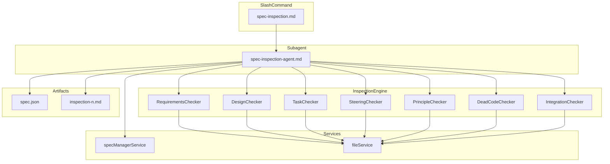
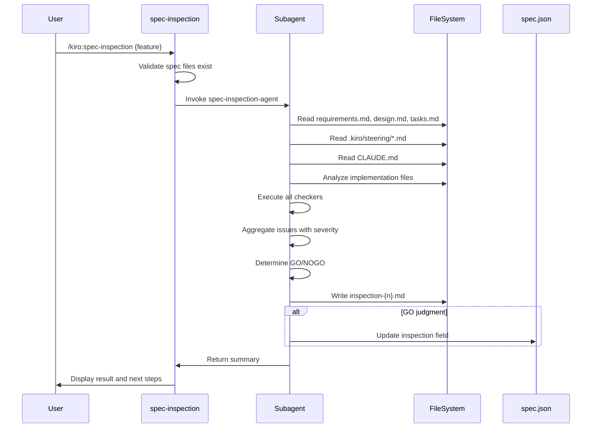

# Technical Design Document: spec-inspection

## Overview

**Purpose**: 本機能は、SDDワークフローの実装完了後に実行する総合検査Skillを提供する。実装がSpec文書（requirements.md, design.md, tasks.md）、steeringドキュメント、およびCLAUDE.mdのDesign Principlesと整合しているかを検査し、GO/NOGO判定と検査報告書（inspection-{n}.md）を生成する。

**Users**: 開発者がSDDワークフロー完了後に品質保証として利用する。

**Impact**: 既存のvalidateコマンド群（validate-gap, validate-design, validate-impl）を補完する総合検査レイヤーを追加し、仕様との整合性を包括的に検証する。

### Goals

- 実装とSpec文書の整合性を自動検査し、GO/NOGO判定を提供する
- 検査結果を構造化された報告書（inspection-{n}.md）として出力する
- steeringおよびDesign Principles遵守を検証する
- Dead Code（孤立コード）を検出する
- --fix/--autofixオプションによる自動修正ワークフローをサポートする

### Non-Goals

- 実装コードの生成（spec-implの責務）
- 詳細なセキュリティ脆弱性診断（専用ツールの責務）
- コードフォーマットやスタイルチェック（linter/formatterの責務）
- 実行時のパフォーマンステスト
- 静的解析ツールレベルの精度保証（W-004対応）: 本機能はLLMベースの意味的検証を行うため、静的解析ツールのような厳密な精度は提供しない。偽陽性・偽陰性が発生する可能性がある

## Architecture

### Existing Architecture Analysis

本機能は既存のSDD Orchestratorアーキテクチャに統合される。

**既存パターンとの整合**:
- `specManagerService.ts`: Agent起動・管理パターンを踏襲
- `documentReviewService.ts`: spec.jsonフィールド管理パターンを参照
- `validate-*.md`: Slash command + Subagentパターンを継承
- `PHASE_COMMANDS_BY_PREFIX`: inspectionフェーズは既に定義済み（`/kiro:validate-impl`）

**技術的負債の回避**:
- 既存のResult<T, E>パターンを使用
- AgentError型の拡張ではなくInspectionError型を新設
- spec.jsonへのinspectionフィールド追加は後方互換性を維持

### Architecture Pattern & Boundary Map



**Architecture Integration**:
- **Selected pattern**: Command/Subagent パターン（既存validate系と同一）
- **Domain boundaries**: 検査ロジックはSubagent内で完結、結果のみMainプロセスに伝達
- **Existing patterns preserved**: Result<T, E>、spec.jsonフィールド管理、Agent起動フロー
- **New components rationale**: 検査カテゴリごとにCheckerを分離し、関心の分離を実現
- **Steering compliance**: DRY（既存パターン再利用）、SSOT（spec.jsonが検査状態の真実の源）

### Technology Stack

| Layer | Choice / Version | Role in Feature | Notes |
|-------|------------------|-----------------|-------|
| Frontend / CLI | Claude Code Slash Command | ユーザーインターフェース | 既存パターン継承 |
| Backend / Services | TypeScript 5.8+ | 検査ロジック実行 | Subagent内で実行 |
| Data / Storage | spec.json, inspection-{n}.md | 検査状態・報告書永続化 | JSON + Markdown |

## System Flows

### Inspection Execution Flow



### Auto-fix Flow (--autofix)

```mermaid
sequenceDiagram
    participant User
    participant CMD as spec-inspection
    participant Agent as Subagent
    participant SpecImpl as spec-impl

    User->>CMD: /kiro:spec-inspection {feature} --autofix

    loop Max 3 cycles
        CMD->>Agent: Execute inspection
        Agent->>Agent: Determine GO/NOGO

        alt NOGO
            Agent->>Agent: Fix spec documents
            Agent->>Agent: Append tasks to tasks.md
            Agent->>SpecImpl: Execute /kiro:spec-impl
            Note over Agent,SpecImpl: Re-inspect after impl
        else GO
            break Exit loop
        end
    end

    alt Still NOGO after 3 cycles
        Agent->>User: Request manual intervention
    end
```

## Requirements Traceability

| Requirement | Summary | Components | Interfaces | Flows |
|-------------|---------|------------|------------|-------|
| 1.1-1.5 | 検査実行と報告書生成 | CMD, Agent, ReportGenerator | executeInspection() | Inspection Execution |
| 2.1-2.5 | 実装とSpec文書の整合性検査 | RequirementsChecker, DesignChecker, TaskChecker | checkRequirements(), checkDesign(), checkTasks() | Inspection Execution |
| 3.1-3.6 | steeringとの整合性検査 | SteeringChecker | checkSteeringCompliance() | Inspection Execution |
| 4.1-4.5 | Design Principles遵守検査 | PrincipleChecker | checkPrinciples() | Inspection Execution |
| 5.1-5.4 | 孤立コード検出 | DeadCodeChecker | detectDeadCode() | Inspection Execution |
| 6.1-6.4 | 既存実装との統合確認 | IntegrationChecker | checkIntegration() | Inspection Execution |
| 7.1-7.4 | GO/NOGO判定基準 | JudgmentEngine | determineJudgment() | Inspection Execution |
| 8.1-8.4 | 修正オプション（--fix） | FixEngine | applyFixes() | Auto-fix Flow |
| 9.1-9.5 | 自動修正オプション（--autofix） | AutofixEngine | executeAutofix() | Auto-fix Flow |
| 10.1-10.3 | spec.jsonへのinspectionステータス管理 | InspectionStateManager | updateInspectionState() | Inspection Execution |
| 11.1-11.3 | プロファイル配布 | Template files | - | - |

## Components and Interfaces

### Component Summary

| Component | Domain/Layer | Intent | Req Coverage | Key Dependencies | Contracts |
|-----------|--------------|--------|--------------|------------------|-----------|
| spec-inspection.md | Slash Command | コマンドエントリーポイント | 1.1 | Task tool | - |
| spec-inspection-agent.md | Subagent | 検査実行オーケストレーション | 1.1-9.5 | Read, Grep, Write | - |
| InspectionOrchestrator | Subagent内 | 検査フロー制御 | 1.1-1.5, 7.1-7.4 | All Checkers | Service |
| RequirementsChecker | Subagent内 | 要件整合性検査 | 2.1-2.5 | Read | Service |
| DesignChecker | Subagent内 | 設計整合性検査 | 2.2, 2.5 | Read | Service |
| TaskChecker | Subagent内 | タスク完了検査 | 2.3-2.5 | Read | Service |
| SteeringChecker | Subagent内 | steering整合性検査 | 3.1-3.6 | Read, Glob | Service |
| PrincipleChecker | Subagent内 | Design Principles検査 | 4.1-4.5 | Read, Grep | Service |
| DeadCodeChecker | Subagent内 | Dead Code検出 | 5.1-5.4 | Read, Grep | Service |
| IntegrationChecker | Subagent内 | 統合検査 | 6.1-6.4 | Read, Grep | Service |
| ReportGenerator | Subagent内 | 報告書生成 | 1.2, 1.3, 7.2-7.4 | Write | Service |
| InspectionStateManager | Subagent内 | spec.json更新 | 10.1-10.3 | Read, Write | State |

### Slash Command Layer

#### spec-inspection.md

| Field | Detail |
|-------|--------|
| Intent | ユーザーからのコマンド入力を受け付け、Subagentに検査を委譲する |
| Requirements | 1.1, 1.4 |

**Responsibilities & Constraints**
- コマンド引数（feature name、オプション）のパース
- Spec文書の存在確認（事前チェック）
- Subagentの呼び出しとTask toolの使用
- 検査結果のサマリ表示と次ステップガイダンス

**Dependencies**
- Outbound: spec-inspection-agent — 検査実行委譲 (P0)

**Contracts**: Service [x] / API [ ] / Event [ ] / Batch [ ] / State [ ]

##### Service Interface

```markdown
---
description: Comprehensive inspection of implementation against specifications
allowed-tools: Read, Task
argument-hint: <feature-name> [--fix | --autofix]
---
```

- Preconditions: `.kiro/specs/{feature}/` ディレクトリが存在すること
- Postconditions: 検査結果がユーザーに表示されること

### Subagent Layer

#### spec-inspection-agent.md

| Field | Detail |
|-------|--------|
| Intent | 総合検査を実行し、報告書を生成してGO/NOGO判定を行う |
| Requirements | 1.1-10.3 |

**Responsibilities & Constraints**
- 全Checkerの順次実行とIssue集約
- 重大度（Critical/Major/Minor/Info）による分類
- GO/NOGO判定ロジックの実行
- 報告書（inspection-{n}.md）の生成
- spec.jsonのinspectionフィールド更新
- --fix/--autofixオプションの処理

**Dependencies**
- Inbound: spec-inspection.md — コマンドから呼び出し (P0)
- External: Read, Write, Grep, Glob, Edit tools (P0)

**Contracts**: Service [x] / API [ ] / Event [ ] / Batch [ ] / State [x]

##### Service Interface

Subagent prompt structure:

```
Feature: {feature-name}
Spec directory: .kiro/specs/{feature}/
Options: {--fix | --autofix | none}

File patterns to read:
- .kiro/specs/{feature}/*.{json,md}
- .kiro/steering/*.md
- CLAUDE.md

Inspection scope:
- Requirements compliance
- Design alignment
- Task completion
- Steering consistency
- Design Principles adherence
- Dead code detection
- Integration verification
```

**検査対象ファイル特定方法** (W-002対応):

1. **tasks.mdからのファイルパス抽出**: 完了タスク（`[x]`）に記載されたファイルパスを抽出
2. **steeringからの推測**: `.kiro/steering/structure.md`で定義された該当feature関連ディレクトリをスキャン
3. **design.mdからの推測**: Components and Interfacesセクションで定義されたコンポーネント名から実装ファイルを特定

優先順位: tasks.md > structure.md > design.md推測

##### State Management

**spec.json inspection フィールド**:

```typescript
interface InspectionState {
  passed: boolean;
  inspected_at: string; // ISO 8601
  report_file: string;  // e.g., "inspection-1.md"
}
```

### Inspection Engine Layer

#### InspectionOrchestrator

| Field | Detail |
|-------|--------|
| Intent | 全Checkerを順次実行し、結果を集約してGO/NOGO判定を行う |
| Requirements | 1.1-1.5, 7.1-7.4 |

**Responsibilities & Constraints**
- Checkerの実行順序管理
- Issue集約と重大度カウント
- GO/NOGO判定ルールの適用

**Contracts**: Service [x] / API [ ] / Event [ ] / Batch [ ] / State [ ]

##### Service Interface

```typescript
interface InspectionOrchestrator {
  execute(context: InspectionContext): InspectionResult;
}

interface InspectionContext {
  specPath: string;
  featureName: string;
  options: InspectionOptions;
}

interface InspectionOptions {
  fix: boolean;
  autofix: boolean;
}

interface InspectionResult {
  judgment: 'GO' | 'NOGO';
  issues: InspectionIssue[];
  summary: IssueSummary;
}

interface InspectionIssue {
  category: InspectionCategory;
  severity: 'Critical' | 'Major' | 'Minor' | 'Info';
  title: string;
  description: string;
  location: string;
  recommendation: string;
}

type InspectionCategory =
  | 'requirements'
  | 'design'
  | 'tasks'
  | 'steering'
  | 'principles'
  | 'dead-code'
  | 'integration';

interface IssueSummary {
  critical: number;
  major: number;
  minor: number;
  info: number;
}
```

- Preconditions: InspectionContextが有効であること
- Postconditions: InspectionResultが生成されること
- Invariants: GO判定はCritical/Majorが0の場合のみ

#### RequirementsChecker

| Field | Detail |
|-------|--------|
| Intent | requirements.mdの各受入基準が実装で満たされているかを検証する |
| Requirements | 2.1, 2.4-2.5 |

**Responsibilities & Constraints**
- 受入基準（Acceptance Criteria）の抽出
- 実装コードとの照合
- 未達成項目の特定

**検証アプローチ** (W-004対応):

本Checkerは**LLMベースの意味的検証**を採用する。静的解析ではなく、Subagent（LLM）が以下のプロセスで判断を行う：

1. requirements.mdから受入基準を抽出
2. 対応する実装ファイルを読み込み
3. LLMが「この受入基準は実装で満たされているか？」を意味的に判断
4. 満たされていない場合、その理由と改善提案をIssueとして出力

この方式は既存のvalidate-impl-agentと同様のアプローチであり、形式的な一致ではなく意図の達成を評価する。

**Contracts**: Service [x] / API [ ] / Event [ ] / Batch [ ] / State [ ]

##### Service Interface

```typescript
// LLMベースの意味的検証を実行
// 静的解析ツールレベルの精度は提供しない（Non-Goals参照）
interface RequirementsChecker {
  check(specPath: string): InspectionIssue[];
}
```

#### DesignChecker

| Field | Detail |
|-------|--------|
| Intent | design.mdのアーキテクチャ設計が実装に反映されているかを検証する |
| Requirements | 2.2, 2.5 |

**Responsibilities & Constraints**
- コンポーネント構成の検証
- インターフェース定義との照合
- 設計と実装の乖離検出

**Contracts**: Service [x] / API [ ] / Event [ ] / Batch [ ] / State [ ]

##### Service Interface

```typescript
interface DesignChecker {
  check(specPath: string): InspectionIssue[];
}
```

#### TaskChecker

| Field | Detail |
|-------|--------|
| Intent | tasks.mdの全タスクが完了しているかを検証する |
| Requirements | 2.3-2.5 |

**Responsibilities & Constraints**
- タスクチェックリスト（`[x]`/`[ ]`）の解析
- 未完了タスクの特定

**Contracts**: Service [x] / API [ ] / Event [ ] / Batch [ ] / State [ ]

##### Service Interface

```typescript
interface TaskChecker {
  check(specPath: string): InspectionIssue[];
}
```

#### SteeringChecker

| Field | Detail |
|-------|--------|
| Intent | 実装がsteeringドキュメントと矛盾していないかを検査する |
| Requirements | 3.1-3.6 |

**Responsibilities & Constraints**
- product.mdとの機能的矛盾検出
- tech.mdとの技術スタック・パターン違反検出
- structure.mdとのディレクトリ構造・命名規則違反検出
- steeringとSpec文書の重複記載検出

**Contracts**: Service [x] / API [ ] / Event [ ] / Batch [ ] / State [ ]

##### Service Interface

```typescript
interface SteeringChecker {
  check(specPath: string, steeringPath: string): InspectionIssue[];
}
```

#### PrincipleChecker

| Field | Detail |
|-------|--------|
| Intent | 実装がDesign Principlesを遵守しているかを検査する |
| Requirements | 4.1-4.5 |

**Responsibilities & Constraints**
- DRY違反検出（重複コード検出）
- SSOT違反検出（複数の真実の源検出）
- 関心の分離違反検出（単一責務原則違反）

**Contracts**: Service [x] / API [ ] / Event [ ] / Batch [ ] / State [ ]

##### Service Interface

```typescript
interface PrincipleChecker {
  check(claudeMdPath: string, implFiles: string[]): InspectionIssue[];
}
```

#### DeadCodeChecker

| Field | Detail |
|-------|--------|
| Intent | 未使用コードや孤立したモジュールを検出する |
| Requirements | 5.1-5.4 |

**Responsibilities & Constraints**
- 未使用のexport（関数、クラス、変数）検出
- 到達不能コードブロック検出
- 参照されていないファイル検出

**Contracts**: Service [x] / API [ ] / Event [ ] / Batch [ ] / State [ ]

##### Service Interface

```typescript
interface DeadCodeChecker {
  check(implFiles: string[]): InspectionIssue[];
}
```

#### IntegrationChecker

| Field | Detail |
|-------|--------|
| Intent | 新規実装が既存のコードベースと適切に統合されているかを確認する |
| Requirements | 6.1-6.4 |

**Responsibilities & Constraints**
- 既存IPC channels、services、storesとの連携検証
- 既存型定義との互換性検証
- 新規追加public APIの一覧化

**Contracts**: Service [x] / API [ ] / Event [ ] / Batch [ ] / State [ ]

##### Service Interface

```typescript
interface IntegrationChecker {
  check(specPath: string, existingCodebase: string): InspectionIssue[];
}
```

#### ReportGenerator

| Field | Detail |
|-------|--------|
| Intent | 検査結果を構造化された報告書として出力する |
| Requirements | 1.2, 1.3, 7.2-7.4 |

**Responsibilities & Constraints**
- inspection-{n}.md ファイル生成
- GO/NOGO判定の明記
- Issue一覧の重大度順ソート
- 改修優先度の記載

**Contracts**: Service [x] / API [ ] / Event [ ] / Batch [ ] / State [ ]

##### Service Interface

```typescript
interface ReportGenerator {
  generate(result: InspectionResult, specPath: string): string; // file path
}
```

**Implementation Notes**
- 報告書ファイル名は連番（inspection-1.md, inspection-2.md, ...）
- 既存ファイルをスキャンして次の番号を決定

#### InspectionStateManager

| Field | Detail |
|-------|--------|
| Intent | spec.jsonにinspectionフィールドを追加・更新する |
| Requirements | 10.1-10.3 |

**Responsibilities & Constraints**
- GO判定時のみspec.json更新
- inspection オブジェクトの追加・更新

**Contracts**: Service [ ] / API [ ] / Event [ ] / Batch [ ] / State [x]

##### State Management

```typescript
interface InspectionStateManager {
  updateState(specPath: string, result: InspectionResult): void;
}

// spec.json structure
interface SpecJsonWithInspection extends SpecJson {
  inspection?: {
    passed: boolean;
    inspected_at: string;
    report_file: string;
  };
}
```

### Fix Engine Layer

#### FixEngine

| Field | Detail |
|-------|--------|
| Intent | --fix オプション指定時に仕様書の軽微な不整合を修正する |
| Requirements | 8.1-8.4 |

**Responsibilities & Constraints**
- 仕様書（requirements.md, design.md, tasks.md）の軽微な修正
- コード修正が必要な場合はtasks.mdに追加タスクとして追記
- 自動修正不可能な項目の明示

**Contracts**: Service [x] / API [ ] / Event [ ] / Batch [ ] / State [ ]

##### Service Interface

```typescript
interface FixEngine {
  applyFixes(issues: InspectionIssue[], specPath: string): FixResult;
}

interface FixResult {
  fixedCount: number;
  addedTasks: string[];
  manualRequired: InspectionIssue[];
}
```

#### AutofixEngine

| Field | Detail |
|-------|--------|
| Intent | --autofix オプション指定時に自動的に修正サイクルを実行する |
| Requirements | 9.1-9.5 |

**Responsibilities & Constraints**
- NOGO判定時の自動修正開始
- 仕様書修正 → tasks.md追記 → spec-impl実行のサイクル
- 最大3回のリトライ制限
- GO判定または3回失敗で終了

**Contracts**: Service [x] / API [ ] / Event [ ] / Batch [ ] / State [ ]

##### Service Interface

```typescript
interface AutofixEngine {
  executeAutofix(context: InspectionContext): AutofixResult;
}

interface AutofixResult {
  finalJudgment: 'GO' | 'NOGO';
  cycles: number;
  requiresManualIntervention: boolean;
}
```

## Data Models

### Domain Model

**Aggregates**:
- **InspectionSession**: 1回の検査実行を表す集約ルート
  - 複数のInspectionIssueを含む
  - GO/NOGO判定を持つ

**Entities**:
- **InspectionIssue**: 検出された個別の問題

**Value Objects**:
- **Severity**: Critical | Major | Minor | Info
- **InspectionCategory**: requirements | design | tasks | steering | principles | dead-code | integration
- **Judgment**: GO | NOGO

**Business Rules**:
- GO判定: Critical = 0 かつ Major = 0
- NOGO判定: Critical > 0 または Major > 0
- 報告書ファイル名は連番

### Logical Data Model

**inspection-{n}.md 構造**:

```markdown
# Inspection Report #{n}

## Summary
- **Judgment**: GO / NOGO
- **Inspected At**: {ISO 8601 timestamp}
- **Feature**: {feature-name}

## Issue Summary
| Severity | Count |
|----------|-------|
| Critical | {n} |
| Major    | {n} |
| Minor    | {n} |
| Info     | {n} |

## Issues

### Critical Issues
#### {Issue Title}
- **Category**: {category}
- **Location**: {file path or component}
- **Description**: {detail}
- **Recommendation**: {suggested fix}

### Major Issues
...

### Minor Issues
...

### Info
...

## Next Steps
{Guidance based on judgment}
```

**spec.json inspection フィールド**:

```json
{
  "inspection": {
    "passed": true,
    "inspected_at": "2025-12-25T12:00:00Z",
    "report_file": "inspection-1.md"
  }
}
```

## Error Handling

### Error Strategy

検査中のエラーは報告書に含め、可能な限り検査を継続する。

### Error Categories and Responses

**User Errors** (Precondition failures):
- Spec文書が存在しない → エラーメッセージを表示し検査を中止（1.4）
- feature引数が指定されていない → 使用方法を表示

**System Errors**:
- ファイル読み取りエラー → 該当カテゴリをスキップしWarningを記録
- 解析エラー → 部分的な結果で続行

**Business Logic Errors**:
- GO/NOGO判定不能 → NOGOとして扱い手動確認を要求

### Monitoring

- 検査開始時にログ出力（1.5）: 使用するSpec文書とsteeringファイルの一覧

## Testing Strategy

### Unit Tests
- RequirementsChecker: 受入基準抽出と照合ロジック
- DesignChecker: 設計要素抽出と照合ロジック
- TaskChecker: チェックリスト解析ロジック
- GO/NOGO判定ロジック

### Integration Tests
- 全Checkerの連携実行
- 報告書生成フロー
- spec.json更新フロー

### E2E Tests
- `/kiro:spec-inspection {feature}` コマンド実行
- --fix オプション付き実行
- --autofix オプション付き実行

## Profile Distribution

### 配布先プロファイル（11.1-11.5）

| Profile | Type | Command | Location |
|---------|------|---------|----------|
| cc-sdd | Slash Command | `/kiro:spec-inspection` | `.claude/commands/kiro/spec-inspection.md` |
| cc-sdd-agent | Agent Command | `/kiro:spec-inspection` | `.claude/commands/kiro/spec-inspection.md` |
| kiro | Slash Command + Agent | `/kiro:spec-inspection` | `.claude/commands/kiro/spec-inspection.md`, `.claude/agents/kiro/spec-inspection.md` |
| spec-manager | Slash Command | `/spec-manager:inspection` | `.claude/commands/spec-manager/inspection.md` |

**Note**: cc-sdd、cc-sdd-agent、kiro プロファイルは、インストール時に `.claude/commands/kiro/` ディレクトリに配置される。spec-manager プロファイルは `.claude/commands/spec-manager/` ディレクトリに配置される。

### Template Files

配布用テンプレートは以下に配置:
- `electron-sdd-manager/resources/templates/commands/cc-sdd/spec-inspection.md`
- `electron-sdd-manager/resources/templates/commands/cc-sdd-agent/spec-inspection.md`
- `electron-sdd-manager/resources/templates/commands/kiro/spec-inspection.md`
- `electron-sdd-manager/resources/templates/commands/spec-manager/inspection.md`
- `electron-sdd-manager/resources/templates/agents/kiro/spec-inspection.md`

### インストーラー登録

`ccSddWorkflowInstaller.ts` の以下のリストに登録が必要:
- `CC_SDD_COMMANDS`: `'spec-inspection'` を追加
- `CC_SDD_AGENTS`: `'spec-inspection'` を追加

**Note**: spec-managerプロファイルは`installSpecManagerCommands()`メソッドで個別にインストールされる（既存パターンに従う）。

## Supporting References

### GO/NOGO判定基準詳細（7.1）

| 条件 | 判定 |
|------|------|
| 全受入基準達成 かつ Critical=0 かつ Major=0 | GO |
| いずれかの受入基準未達 | NOGO |
| Critical > 0 | NOGO |
| Major > 0 | NOGO |

### 重大度定義（7.2）

| Severity | 定義 | 例 |
|----------|------|-----|
| Critical | 機能不全を引き起こす問題 | 受入基準の完全未達、型エラー |
| Major | 品質に重大な影響を与える問題 | 設計との乖離、steering違反 |
| Minor | 改善が望ましい問題 | 軽微なDRY違反、ドキュメント不整合 |
| Info | 参考情報 | 未使用変数、改善提案 |

## UI Display Components

### Requirements Traceability

| Requirement | Summary | Components | Interfaces |
|-------------|---------|------------|------------|
| 12.1-12.3 | 検査報告書タブの動的生成と表示 | ArtifactEditor | inspectionTabs, selectedTab |
| 12.4 | ArtifactTypeへのinspectionパターン追加 | editorStore | ArtifactType |
| 12.5 | 検査報告書ファイルの読み込み | specStore | selectSpec(), SpecDetail.artifacts |

### ArtifactEditor Extension

#### 検査報告書タブの動的生成（12.1-12.3）

既存のdocument-review動的タブ生成パターンを踏襲する。

```typescript
// ArtifactEditor.tsx
const inspectionTabs = useMemo((): TabInfo[] => {
  const inspection = specDetail?.specJson?.inspection;
  if (!inspection?.report_file) {
    return [];
  }

  // report_file から番号を抽出 (e.g., "inspection-1.md" -> 1)
  const match = inspection.report_file.match(/inspection-(\d+)\.md/);
  if (!match) {
    return [];
  }

  const n = parseInt(match[1], 10);
  return [{
    key: `inspection-${n}` as ArtifactType,
    label: `Inspection-${n}`,
  }];
}, [specDetail?.specJson?.inspection]);

// タブリストに追加
const allTabs = useMemo(() => [
  ...BASE_TABS,
  ...documentReviewTabs,
  ...inspectionTabs,
], [documentReviewTabs, inspectionTabs]);
```

### editorStore Extension

#### ArtifactType拡張（12.4）

```typescript
// editorStore.ts
type BaseArtifactType = 'requirements' | 'design' | 'tasks' | 'research';
type DynamicArtifactType =
  | `document-review-${number}`
  | `document-review-${number}-reply`
  | `inspection-${number}`;  // 追加
export type ArtifactType = BaseArtifactType | DynamicArtifactType;
```

### specStore Extension

#### 検査報告書読み込み（12.5）

```typescript
// specStore.ts - selectSpec関数内
const getInspectionArtifact = async (): Promise<ArtifactInfo | null> => {
  const inspection = spec.specJson?.inspection;
  if (!inspection?.report_file) {
    return null;
  }

  try {
    const artifactPath = `${spec.path}/${inspection.report_file}`;
    const content = await window.electronAPI.readArtifact(artifactPath);
    return { exists: true, updatedAt: null, content };
  } catch {
    return null;
  }
};

// artifacts オブジェクトに追加
const inspectionArtifact = await getInspectionArtifact();
```

### SpecDetail Type Extension

```typescript
// types/index.ts
export interface SpecDetail {
  metadata: SpecMetadata;
  specJson: SpecJson;
  artifacts: {
    requirements: ArtifactInfo | null;
    design: ArtifactInfo | null;
    tasks: ArtifactInfo | null;
    research: ArtifactInfo | null;
    inspection: ArtifactInfo | null;  // 追加
  };
  taskProgress: TaskProgress | null;
}
```

### SpecJson Type Extension

```typescript
// types/index.ts - SpecJson interface
export interface SpecJson {
  // ... 既存フィールド ...
  inspection?: {
    passed: boolean;
    inspected_at: string;
    report_file: string;
  };
}
```

### Content Rendering

ArtifactPreviewコンポーネントは既存のMarkdownレンダリング機能を使用するため、追加の実装は不要。`inspection-${n}` タイプのタブが選択された際、対応するartifacts.inspectionの内容が表示される。

```typescript
// ArtifactEditor.tsx - getArtifactContent関数
const getArtifactContent = (tabKey: ArtifactType): string | null => {
  if (!specDetail) return null;

  // ... 既存のswitch文 ...

  // inspection-{n} パターンの処理
  if (tabKey.startsWith('inspection-')) {
    return specDetail.artifacts.inspection?.content ?? null;
  }

  return null;
};
```
