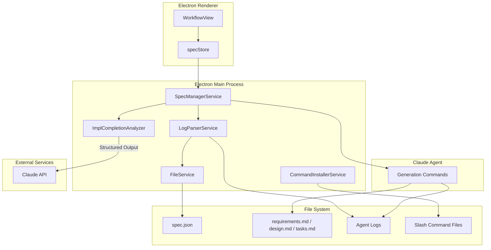
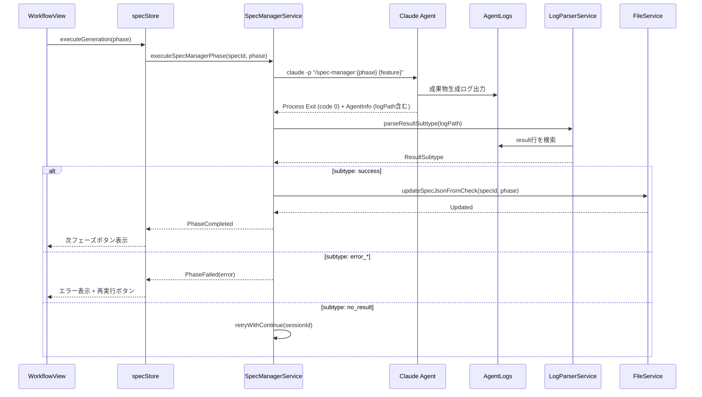
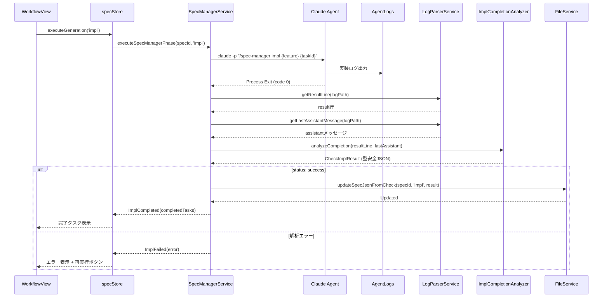
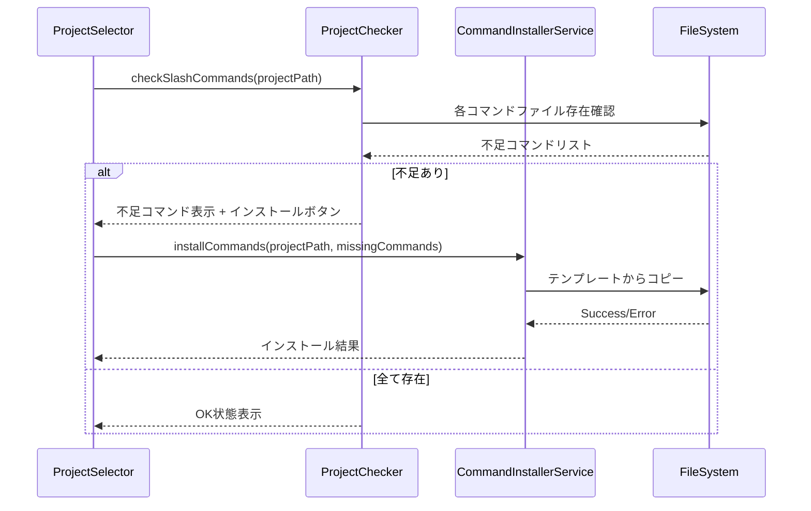
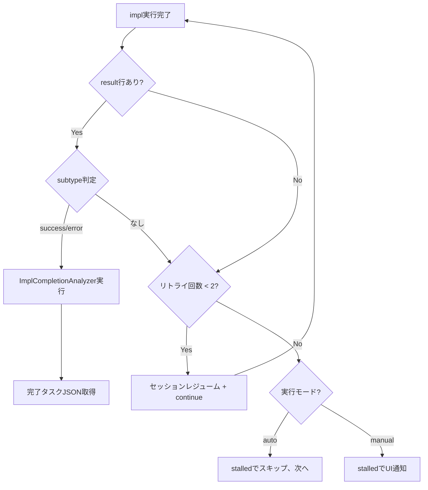
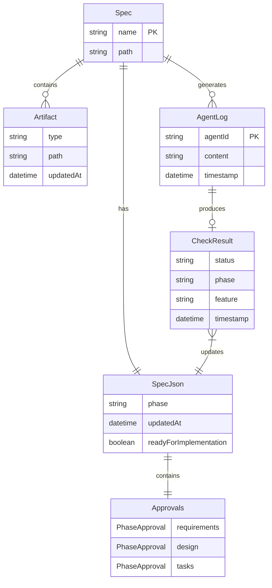

# Design Document

## Overview

**Purpose**: 本機能は、SDDワークフローにおけるAIエージェントとElectronアプリの責務を明確に分離し、AIが成果物生成に集中できる新しいコマンド体系を提供する。

**Users**:
- 開発者：SDDワークフローを効率的に実行
- Electronアプリ：spec.json管理とワークフロー制御

**Impact**: 既存の `/kiro:spec-*` コマンド体系と並行して動作し、段階的な移行を可能にする。

### Goals
- AIエージェントの責務を純粋な成果物生成に限定
- spec.json管理をElectron側（TypeScript）に完全移行
- ログ解析（result行subtype判定 / Claude API Structured Output）による構造化された完了確認
- 生成から完了判定、spec.json更新までの自動フロー

### Non-Goals
- 既存 `/kiro:spec-*` コマンドの廃止（並行運用）
- validation系コマンドの変更
- Tauri版への対応（Electron版のみ）

## Architecture

### Architecture Pattern & Boundary Map



**Architecture Integration**:
- Selected pattern: レイヤードアーキテクチャ + コマンドパターン
- Domain boundaries: AI責務（成果物生成）とElectron責務（状態管理）を明確分離
- Existing patterns preserved: SpecManagerService, FileService, IPCハンドラパターン
- New components rationale: LogParserService（ログ解析）、CommandInstallerService（コマンドインストール）
- Steering compliance: 4層アーキテクチャのSpec Manager層を拡張

### Technology Stack

| Layer | Choice / Version | Role in Feature | Notes |
|-------|------------------|-----------------|-------|
| Backend / Services | TypeScript 5.8+, Node.js 20+ | spec.json管理、ログ解析、コマンドインストール | 既存パターン踏襲 |
| Frontend / CLI | React 19, Zustand | ワークフロー制御UI | 既存UI拡張 |
| Data / Storage | JSON, Markdown | spec.json、成果物、Slash Command | ファイルベース |
| Messaging / Events | IPC (contextBridge) | main-renderer間通信 | 既存チャネル拡張 |

## System Flows

### requirements/design/tasks 完了判定フロー



### impl完了判定フロー



### Slash Commandインストールフロー



## Requirements Traceability

| Requirement | Summary | Components | Interfaces | Flows |
|-------------|---------|------------|------------|-------|
| 1.1 | spec初期化コマンド | Slash Command (init) | - | 初期化フロー |
| 1.2-1.5 | 成果物生成コマンド | Slash Commands (4種) | - | 生成フロー |
| 1.6 | spec.json非操作（生成コマンド） | Slash Commands | - | - |
| 1.7 | spec.json初期化（initコマンド） | Slash Command (init) | - | 初期化フロー |
| 2.1-2.3 | subtype判定（requirements/design/tasks） | LogParserService | ResultSubtype | 生成フロー |
| 2.4 | impl完了解析 | ImplCompletionAnalyzer | CheckImplResult | 生成フロー |
| 2.5 | subtype識別 | LogParserService | ResultSubtype | - |
| 2.6 | no_result判定 | LogParserService | ResultSubtype | - |
| 3.1-3.2 | spec.json自動更新 | FileService, SpecManagerService | - | 生成フロー |
| 3.3-3.5 | spec.jsonフィールド更新 | FileService | SpecJson | - |
| 3.6 | 更新中排他制御 | SpecManagerService | - | - |
| 4.1-4.2 | コマンド存在確認 | ProjectChecker | CommandCheckResult | インストールフロー |
| 4.3-4.4 | インストール機能 | CommandInstallerService | - | インストールフロー |
| 4.5-4.6 | インストール結果 | CommandInstallerService | InstallResult | インストールフロー |
| 5.1 | 完了判定（subtype or ImplCompletionAnalyzer） | SpecManagerService, LogParserService, ImplCompletionAnalyzer | - | 生成フロー |
| 5.2 | 次フェーズ表示 | WorkflowView, specStore | - | 生成フロー |
| 5.3-5.4 | 進行状況・エラー表示 | WorkflowView, specStore | - | 生成フロー |
| 5.5 | リアルタイム反映 | specStore, WorkflowView | - | 生成フロー |
| 5.6 | 自動リトライ | SpecManagerService | - | リトライフロー |
| 5.7 | continuing表示 | WorkflowView, specStore | ImplTaskStatus | リトライフロー |
| 5.8 | stalled処理 | SpecManagerService, WorkflowView | ImplTaskStatus | リトライフロー |
| 6.1-6.6 | impl完了解析JSON仕様 | ImplCompletionAnalyzer | CheckImplResult | - |

## Components and Interfaces

### Component Summary

| Component | Domain/Layer | Intent | Req Coverage | Key Dependencies | Contracts |
|-----------|--------------|--------|--------------|------------------|-----------|
| Slash Command (Init) | AI/Agent | spec初期化専用コマンド | 1.1, 1.7 | Input Files (init.json, requirements-init.md) | - |
| Slash Commands (Generation) | AI/Agent | 成果物生成専用コマンド | 1.2-1.6 | Input Files (spec.json, steering, templates) | - |
| ImplCompletionAnalyzer | Main/Services | impl完了タスク解析（Claude API Structured Output） | 2.4, 6.1-6.6 | @anthropic-ai/sdk (P0) | Service |
| LogParserService | Main/Services | result行subtype判定 | 2.1-2.3, 2.5-2.6 | - | Service |
| CommandInstallerService | Main/Services | コマンドインストール | 4.1-4.6 | FileService (P1) | Service |
| ProjectChecker | Main/Services | コマンド存在確認 | 4.1-4.2 | FileService (P1) | Service |
| SpecManagerService (拡張) | Main/Services | spec-manager用実行、自動リトライ | 3.1-3.6, 5.1-5.8 | FileService (P0), LogParserService (P0) | Service |
| FileService (拡張) | Main/Services | spec.json更新ロジック追加 | 3.3-3.5 | - | Service |
| specStore (拡張) | Renderer/Stores | 新コマンド用状態管理、ImplTaskStatus | 5.2-5.8 | - | State |
| WorkflowView (拡張) | Renderer/Components | 新フロー用UI、リトライ表示 | 5.2-5.8 | specStore (P0) | - |

### AI/Agent Layer

**設計方針**: `/spec-manager:*` コマンドはSubagent（Task tool）を使用せず、AIが直接成果物を生成する。Spec ManagerがSDD Orchestratorとしてサブエージェント管理の責務を持つため、Slash Commandがさらにサブエージェントに委託する構造は冗長。各コマンドは必要なファイルを読み込み、Claude CLIが直接プロンプトを解釈・実行して成果物を出力する。

#### Slash Command: /spec-manager:init

| Field | Detail |
|-------|--------|
| Intent | プロジェクト説明からfeature名を生成し、spec構造を初期化（spec.json + requirements.md） |
| Requirements | 1.1, 1.7 |

**Responsibilities & Constraints**
- プロジェクト説明からfeature名を自動生成
- 既存specとの名前衝突を確認し、必要に応じて数字サフィックスを付与
- spec.jsonとrequirements.md（プロジェクト説明のみ）を作成
- この段階ではrequirements/design/tasksの生成は行わない

**Dependencies**
- Input Files:
  - `.kiro/settings/templates/specs/init.json` - spec.jsonテンプレート
  - `.kiro/settings/templates/specs/requirements-init.md` - requirements.md初期テンプレート
- Output Files:
  - `.kiro/specs/{feature}/spec.json` - 初期化されたspec設定
  - `.kiro/specs/{feature}/requirements.md` - プロジェクト説明を含む初期ファイル

**Implementation Notes**
- 直接プロンプト実行（サブエージェント委託なし）
- プレースホルダー置換: `{{FEATURE_NAME}}`, `{{TIMESTAMP}}`, `{{PROJECT_DESCRIPTION}}`
- 完了判定は`result.subtype === "success"`で行う（Electron側）
- initコマンドのみspec.jsonへの書き込みを許可（初期化のため）

#### Slash Command: /spec-manager:requirements

| Field | Detail |
|-------|--------|
| Intent | requirements.mdの生成のみを実行（spec.json操作なし） |
| Requirements | 1.1, 1.5 |

**Responsibilities & Constraints**
- 純粋な成果物生成のみ
- spec.jsonの読み取り・更新を一切行わない

**Dependencies**
- Input Files:
  - `.kiro/specs/{feature}/spec.json` - プロジェクト説明
  - `.kiro/steering/*.md` - プロジェクトコンテキスト
  - `.kiro/settings/rules/ears-format.md` - EARS形式ルール
  - `.kiro/settings/templates/specs/requirements.md` - テンプレート

**Implementation Notes**
- 直接プロンプト実行（サブエージェント委託なし）
- EARS形式で要件を生成
- 完了判定は`result.subtype === "success"`で行う（Electron側）

#### Slash Command: /spec-manager:design

| Field | Detail |
|-------|--------|
| Intent | design.mdの生成のみを実行（spec.json操作なし） |
| Requirements | 1.2, 1.5 |

**Responsibilities & Constraints**
- 純粋な成果物生成のみ
- spec.jsonの読み取り・更新を一切行わない

**Dependencies**
- Input Files:
  - `.kiro/specs/{feature}/spec.json` - プロジェクト説明
  - `.kiro/specs/{feature}/requirements.md` - 要件
  - `.kiro/steering/*.md` - プロジェクトコンテキスト
  - `.kiro/settings/templates/specs/design.md` - テンプレート

**Implementation Notes**
- 直接プロンプト実行（サブエージェント委託なし）
- 要件を技術設計に変換
- 完了判定は`result.subtype === "success"`で行う（Electron側）

> **Note**: Full Discovery Process（research.md生成、WebSearch/WebFetch による調査）が必要な場合は `/kiro:spec-design` を使用してください。`/spec-manager:design` は軽量・高速な成果物生成を目的としています。

#### Slash Command: /spec-manager:tasks

| Field | Detail |
|-------|--------|
| Intent | tasks.mdの生成のみを実行（spec.json操作なし） |
| Requirements | 1.3, 1.5 |

**Responsibilities & Constraints**
- 純粋な成果物生成のみ
- spec.jsonの読み取り・更新を一切行わない

**Dependencies**
- Input Files:
  - `.kiro/specs/{feature}/spec.json` - プロジェクト説明
  - `.kiro/specs/{feature}/requirements.md` - 要件
  - `.kiro/specs/{feature}/design.md` - 設計
  - `.kiro/steering/*.md` - プロジェクトコンテキスト
  - `.kiro/settings/templates/specs/tasks.md` - テンプレート

**Implementation Notes**
- 直接プロンプト実行（サブエージェント委託なし）
- 設計をタスクに分解
- 完了判定は`result.subtype === "success"`で行う（Electron側）

#### Slash Command: /spec-manager:impl

| Field | Detail |
|-------|--------|
| Intent | 指定タスクの実装のみを実行（spec.json操作なし） |
| Requirements | 1.4, 1.5 |

**Responsibilities & Constraints**
- 純粋な実装作業のみ
- spec.jsonの読み取り・更新を一切行わない

**Dependencies**
- Input Files:
  - `.kiro/specs/{feature}/spec.json` - プロジェクト説明
  - `.kiro/specs/{feature}/requirements.md` - 要件
  - `.kiro/specs/{feature}/design.md` - 設計
  - `.kiro/specs/{feature}/tasks.md` - タスク一覧
  - `.kiro/steering/*.md` - プロジェクトコンテキスト

**Implementation Notes**
- 直接プロンプト実行（サブエージェント委託なし）
- TDD方式で指定タスクを実装
- 完了判定はImplCompletionAnalyzer（Claude API Structured Output）で行う

### Main/Services Layer

#### ImplCompletionAnalyzer

| Field | Detail |
|-------|--------|
| Intent | impl実行ログを解析し、完了タスクを型安全なJSONで取得（Claude API Structured Output使用） |
| Requirements | 2.4, 6.1-6.6 |

**Responsibilities & Constraints**
- result行と最後のassistantメッセージから完了タスクを特定
- Claude API Structured Outputで100% JSON出力を保証
- Zodスキーマで型安全
- パース失敗が原理的に発生しない

**Dependencies**
- External: @anthropic-ai/sdk - Claude API (P0)
- External: Zod - スキーマ定義 (P0)

**Contracts**: Service [x]

##### Service Interface

```typescript
import { z } from 'zod';
import Anthropic from '@anthropic-ai/sdk';
import { betaZodOutputFormat } from '@anthropic-ai/sdk/helpers/beta/zod';

// 出力スキーマ
const CheckImplResultSchema = z.object({
  status: z.literal('success'),
  completedTasks: z.array(z.string().regex(/^\d+(\.\d+)?$/)),
  stats: z.object({
    num_turns: z.number().int().nonnegative(),
    duration_ms: z.number().int().nonnegative(),
    total_cost_usd: z.number().nonnegative(),
  }),
});

type CheckImplResult = z.infer<typeof CheckImplResultSchema>;

// API呼び出しエラー型
type AnalyzeError =
  | { type: 'API_ERROR'; message: string; statusCode?: number }
  | { type: 'RATE_LIMITED'; retryAfter?: number }
  | { type: 'TIMEOUT' }
  | { type: 'INVALID_INPUT'; message: string };

interface ImplCompletionAnalyzer {
  /**
   * impl実行ログを解析して完了タスクを特定
   * @param resultLine - ログのresult行（stats情報含む）
   * @param lastAssistantMessage - 最後のassistantメッセージ
   * @returns 成功時は型安全なCheckImplResult、失敗時はAnalyzeError
   *
   * Note: Structured OutputはJSON形式を保証するが、API呼び出し自体の
   * 失敗（ネットワークエラー、認証エラー、レート制限等）は別途ハンドリングが必要
   */
  analyzeCompletion(
    resultLine: string,
    lastAssistantMessage: string
  ): Promise<Result<CheckImplResult, AnalyzeError>>;
}
```

##### Implementation Example

```typescript
class ImplCompletionAnalyzerImpl implements ImplCompletionAnalyzer {
  private client: Anthropic;

  constructor(apiKey: string) {
    this.client = new Anthropic({ apiKey });
  }

  async analyzeCompletion(
    resultLine: string,
    lastAssistantMessage: string
  ): Promise<Result<CheckImplResult, AnalyzeError>> {
    // 入力バリデーション
    if (!resultLine || !lastAssistantMessage) {
      return {
        ok: false,
        error: { type: 'INVALID_INPUT', message: 'resultLine and lastAssistantMessage are required' }
      };
    }

    try {
      const response = await this.client.beta.messages.parse({
        model: "claude-sonnet-4-5-20250929",
        betas: ["structured-outputs-2025-11-13"],
        max_tokens: 1024,
        output_format: betaZodOutputFormat(CheckImplResultSchema),
        messages: [{
          role: "user",
          content: `以下のimpl実行ログを解析し、完了したタスクを特定してください。

## Result行
${resultLine}

## 最後のAssistantメッセージ
${lastAssistantMessage}

タスクIDは "1.1", "2.3" のような形式です。
statsのnum_turns, duration_ms, total_cost_usdはresult行から抽出してください。`
        }]
      });

      return { ok: true, value: response.parsed }; // 型安全、JSON保証
    } catch (error) {
      // Anthropic SDKのエラーハンドリング
      if (error instanceof Anthropic.RateLimitError) {
        return {
          ok: false,
          error: { type: 'RATE_LIMITED', retryAfter: error.headers?.['retry-after'] }
        };
      }
      if (error instanceof Anthropic.APIConnectionError) {
        return {
          ok: false,
          error: { type: 'TIMEOUT' }
        };
      }
      if (error instanceof Anthropic.APIError) {
        return {
          ok: false,
          error: { type: 'API_ERROR', message: error.message, statusCode: error.status }
        };
      }
      // 予期しないエラー
      return {
        ok: false,
        error: { type: 'API_ERROR', message: String(error) }
      };
    }
  }
}
```

**Implementation Notes**
- `beta.messages.parse`を使用することでJSON出力が100%保証される
- Zodスキーマで型推論が効く
- モデルは`claude-sonnet-4-5-20250929`（コスト効率重視）
- API呼び出しエラーは`Result`型で明示的にハンドリング

##### APIキー管理

**取得元**: 環境変数 `ANTHROPIC_API_KEY` のみ（Phase 1）

```typescript
function getAnthropicApiKey(): Result<string, ApiKeyError> {
  const key = process.env.ANTHROPIC_API_KEY;
  if (!key) {
    return { ok: false, error: { type: 'API_KEY_NOT_SET' } };
  }
  if (!key.startsWith('sk-ant-')) {
    return { ok: false, error: { type: 'API_KEY_INVALID_FORMAT' } };
  }
  return { ok: true, value: key };
}

type ApiKeyError =
  | { type: 'API_KEY_NOT_SET' }
  | { type: 'API_KEY_INVALID_FORMAT' };
```

**起動時チェック**:
- Electronアプリ起動時に`ANTHROPIC_API_KEY`環境変数を確認
- 未設定または無効な場合、起動時に警告ダイアログを表示:
  「ANTHROPIC_API_KEY環境変数が設定されていません。impl完了の自動判定機能が無効になります。」
- 警告は「今後表示しない」オプション付き

**キー未設定時の動作**:
- ImplCompletionAnalyzerをスキップ
- impl完了判定を「手動確認モード」にフォールバック
- UI側で「APIキー未設定のため自動判定不可。手動でタスク完了を確認してください」を表示
- requirements/design/tasksフェーズは影響なし（LogParserServiceのみ使用）
- 手動確認UIの詳細（チェックボックス、確認ダイアログ等）はPhase 2以降で設計

**環境変数変更時の動作**:
- 環境変数は起動時に一度だけ読み込み（`process.env`はプロセス起動時のスナップショット）
- 環境変数を設定・変更した場合、**Electronアプリの再起動が必要**
- 再起動なしでの動的反映は行わない（シンプルさ優先）

**運用ガイダンス**:
```bash
# Claude CLI と同じ環境変数を使用
export ANTHROPIC_API_KEY="sk-ant-api03-..."

# 環境変数を設定後、Electronアプリを起動（または再起動）
# ターミナルから起動する場合は同一シェルセッションで実行
```

**将来の拡張（Phase 2以降、スコープ外）**:
- Electron safeStorageによるセキュアな保存
- 初回起動時のセットアップウィザード
- GUI設定画面でのキー入力（再起動不要）

#### LogParserService

| Field | Detail |
|-------|--------|
| Intent | ログファイルからresult行のsubtype判定、およびImplCompletionAnalyzer用の入力データ抽出 |
| Requirements | 2.1-2.3, 2.5-2.6 |

**Responsibilities & Constraints**
- ログファイルからresult行を検索しsubtypeを判定（requirements/design/tasks用）
- ImplCompletionAnalyzer用の入力データ（result行、最後のassistantメッセージ）を抽出
- パース失敗時は明確なエラー

**Dependencies**
- なし

**Contracts**: Service [x]

##### ログファイル形式（二重JSON構造）

Agent実行ログはNDJSON形式で、各行が**ラッパーJSON**に包まれている：

```json
{"timestamp":"2025-11-28T16:44:50.292Z","stream":"stdout","data":"{\"type\":\"result\",\"subtype\":\"success\",...}"}
```

| フィールド | 型 | 説明 |
|-----------|-----|------|
| `timestamp` | ISO8601 string | ログ出力時刻 |
| `stream` | `"stdout"` \| `"stderr"` | 出力ストリーム |
| `data` | string (escaped JSON) | Claude Agent SDKのメッセージ（JSONエスケープ済み） |

**パース手順**:
1. ファイルを行ごとに読み込み
2. 各行を`JSON.parse()`で外側のラッパーをパース
3. `data`フィールドを再度`JSON.parse()`で内側のメッセージをパース
4. 内側の`type`フィールドで`"result"`行を検索

```typescript
// 実装例
function parseLogLine(line: string): AgentMessage | null {
  const wrapper = JSON.parse(line); // { timestamp, stream, data }
  const message = JSON.parse(wrapper.data); // { type, subtype, ... }
  return message;
}
```

##### Service Interface

```typescript
// result行のsubtype判定結果
type ResultSubtype =
  | "success"
  | "error_max_turns"
  | "error_during_execution"
  | "no_result";

interface LogParserService {
  /**
   * ログファイルからresult行のsubtypeを取得
   * requirements/design/tasks用のアルゴリズム判定
   * @param logPath - ログファイルパス
   * @returns subtype判定結果
   */
  parseResultSubtype(logPath: string): Promise<Result<ResultSubtype, ParseError>>;

  /**
   * ログファイルから最後のassistantメッセージを取得
   * ImplCompletionAnalyzer入力用
   * @param logPath - ログファイルパス
   * @returns 最後のassistantメッセージ
   */
  getLastAssistantMessage(logPath: string): Promise<Result<string, ParseError>>;

  /**
   * ログファイルからresult行を取得
   * ImplCompletionAnalyzer入力用
   * @param logPath - ログファイルパス
   * @returns result行のJSON文字列
   */
  getResultLine(logPath: string): Promise<Result<string, ParseError>>;
}

type ParseError =
  | { type: 'NO_RESULT_FOUND' }
  | { type: 'NO_ASSISTANT_FOUND' }
  | { type: 'FILE_READ_ERROR'; message: string };
```

- Preconditions: logPathが有効なファイルパス
- Postconditions: 成功時は型付き結果、失敗時はParseError

**Implementation Notes**
- requirements/design/tasks: parseResultSubtypeでアルゴリズム判定（LLM不使用）
- impl: getResultLine + getLastAssistantMessage → ImplCompletionAnalyzer.analyzeCompletion()

**⚠️ 推測実装に関する注意**
以下の点はClaude CLI/Agent SDKの実際のログ形式に基づく推測であり、エラーケース発生時に検証・修正が必要：
- `error_max_turns`、`error_during_execution`のsubtype値（実際のエラーログ未確認）
- `is_error`フィールドと`subtype`フィールドの関係（成功ケースのみ確認済み: `{"type":"result","subtype":"success","is_error":false,...}`）
- result行が存在しないケースの発生条件

判定ロジック（暫定）:
```typescript
function parseResultSubtype(resultLine: string | null): ResultSubtype {
  if (!resultLine) return "no_result";
  const parsed = JSON.parse(resultLine);
  // subtypeが明示的にある場合はそれを使用
  if (parsed.subtype) return parsed.subtype;
  // フォールバック: is_errorで判定
  return parsed.is_error ? "error_during_execution" : "success";
}
```

#### CommandInstallerService

| Field | Detail |
|-------|--------|
| Intent | Slash Commandファイルをプロジェクトにインストール |
| Requirements | 4.3-4.6 |

**Responsibilities & Constraints**
- Slash Commandファイル（`.claude/commands/spec-manager/`）のインストール
- SDD設定ファイル（`.kiro/settings/`）のインストール
- 既存ファイルの上書き確認
- ロールバック可能な状態維持

**Dependencies**
- Outbound: FileService - ファイル操作 (P1)

**Contracts**: Service [x]

##### Service Interface

```typescript
interface CommandInstallerService {
  /**
   * 不足しているSlash Commandをインストール
   * @param projectPath - プロジェクトルート
   * @param commands - インストール対象コマンド名
   * @returns インストール結果
   */
  installCommands(
    projectPath: string,
    commands: readonly string[]
  ): Promise<Result<InstallResult, InstallError>>;

  /**
   * 不足しているSDD設定ファイルをインストール
   * @param projectPath - プロジェクトルート
   * @param settings - インストール対象設定ファイル名
   * @returns インストール結果
   */
  installSettings(
    projectPath: string,
    settings: readonly string[]
  ): Promise<Result<InstallResult, InstallError>>;

  /**
   * Slash CommandとSDD設定を一括インストール
   * @param projectPath - プロジェクトルート
   * @returns インストール結果
   */
  installAll(
    projectPath: string
  ): Promise<Result<FullInstallResult, InstallError>>;
}

interface InstallResult {
  readonly installed: readonly string[];
  readonly skipped: readonly string[];
}

interface FullInstallResult {
  readonly commands: InstallResult;
  readonly settings: InstallResult;
}

type InstallError =
  | { type: 'TEMPLATE_NOT_FOUND'; path: string }
  | { type: 'WRITE_ERROR'; path: string; message: string }
  | { type: 'PERMISSION_DENIED'; path: string };

/**
 * /spec-manager:* コマンドに必要な設定ファイル
 *
 * プロジェクト側配置パス:
 *   {projectRoot}/.kiro/settings/rules/ears-format.md
 *   {projectRoot}/.kiro/settings/rules/tasks-generation.md
 *   {projectRoot}/.kiro/settings/rules/tasks-parallel-analysis.md
 *   {projectRoot}/.kiro/settings/templates/specs/init.json
 *   {projectRoot}/.kiro/settings/templates/specs/requirements-init.md
 *   {projectRoot}/.kiro/settings/templates/specs/requirements.md
 *   {projectRoot}/.kiro/settings/templates/specs/design.md
 *   {projectRoot}/.kiro/settings/templates/specs/tasks.md
 */
const REQUIRED_SETTINGS = [
  'rules/ears-format.md',              // requirements生成用
  'rules/tasks-generation.md',         // tasks生成用
  'rules/tasks-parallel-analysis.md',  // tasks生成用（(P)マーク判定）
  'templates/specs/init.json',         // spec.json初期化テンプレート
  'templates/specs/requirements-init.md', // requirements.md初期化テンプレート
  'templates/specs/requirements.md',   // requirementsテンプレート
  'templates/specs/design.md',         // designテンプレート
  'templates/specs/tasks.md',          // tasksテンプレート
] as const;
```

- Preconditions: projectPathが有効なディレクトリ
- Postconditions: 成功時はファイルがコピーされる
- Invariants: 部分的な失敗時は成功分のみ適用

**Implementation Notes**
- Integration: テンプレートは `electron-sdd-manager/resources/templates/` に配置（Electronアプリ配布パッケージに含める）
  - `resources/templates/commands/spec-manager/` - Slash Commandファイル
  - `resources/templates/settings/` - SDD設定ファイル（.kiro/settings相当）
- Risks: ファイル権限エラー

#### cc-sdd変換スクリプト

| Field | Detail |
|-------|--------|
| Intent | cc-sddフレームワークのプロンプトをspec-manager用に変換し、テンプレートを生成 |
| Requirements | 4.3 (テンプレート生成の前提) |

**Responsibilities & Constraints**
- cc-sddインストール済みディレクトリから必要なファイルを読み取り
- spec-manager用に不要な処理をセマンティックに削除
- 変換結果を`electron-sdd-manager/resources/templates/`に出力

**変換対象ファイル**

| ソース (cc-sdd) | 出力先 (templates/) | 変換内容 |
|-----------------|---------------------|----------|
| `.claude/commands/kiro/spec-init.md` | `commands/spec-manager/init.md` | セマンティック変換 |
| `.claude/commands/kiro/spec-requirements.md` | `commands/spec-manager/requirements.md` | セマンティック変換 |
| `.claude/commands/kiro/spec-design.md` | `commands/spec-manager/design.md` | セマンティック変換 |
| `.claude/commands/kiro/spec-tasks.md` | `commands/spec-manager/tasks.md` | セマンティック変換 |
| `.claude/commands/kiro/spec-impl.md` | `commands/spec-manager/impl.md` | セマンティック変換 |
| `.kiro/settings/rules/ears-format.md` | `settings/rules/ears-format.md` | そのままコピー |
| `.kiro/settings/rules/tasks-generation.md` | `settings/rules/tasks-generation.md` | そのままコピー |
| `.kiro/settings/rules/tasks-parallel-analysis.md` | `settings/rules/tasks-parallel-analysis.md` | そのままコピー |
| `.kiro/settings/templates/specs/init.json` | `settings/templates/specs/init.json` | そのままコピー |
| `.kiro/settings/templates/specs/requirements-init.md` | `settings/templates/specs/requirements-init.md` | そのままコピー |
| `.kiro/settings/templates/specs/requirements.md` | `settings/templates/specs/requirements.md` | そのままコピー |
| `.kiro/settings/templates/specs/design.md` | `settings/templates/specs/design.md` | そのままコピー |
| `.kiro/settings/templates/specs/tasks.md` | `settings/templates/specs/tasks.md` | そのままコピー |

**セマンティック変換ルール**

Slash Commandから以下の処理を削除：

| 削除対象 | 理由 |
|----------|------|
| spec.json読み取り・更新 | Electron側で管理 |
| approvals操作 | Electron側で管理 |
| phase遷移ロジック | Electron側で管理 |
| Subagent委託（Task tool呼び出し） | 直接実行に変更 |
| 次フェーズへの誘導メッセージ | UI側で表示 |
| ユーザー承認待ち処理 | UI側で制御 |

**保持する処理**

| 保持対象 | 理由 |
|----------|------|
| 入力ファイル読み取り（steering, templates等） | 成果物生成に必要 |
| 成果物生成ロジック | コア機能 |
| EARS形式、TDD方式等のルール適用 | 品質基準 |
| エラーハンドリング（ファイル不足等） | 堅牢性 |

**スクリプト仕様**

```bash
# 使用方法
scripts/convert-cc-sdd.sh <cc-sdd-root> [output-dir]

# 引数
#   cc-sdd-root: cc-sddがインストールされたプロジェクトルート
#   output-dir:  出力先（デフォルト: electron-sdd-manager/resources/templates/）

# 例
scripts/convert-cc-sdd.sh ~/projects/my-sdd-project
```

**実装アプローチ**

1. **シェルスクリプト + sed/awk**: シンプルなパターン置換
   - 長所: 依存なし、高速
   - 短所: 複雑な構造変換に弱い

2. **Node.js/TypeScript**: AST解析による変換
   - 長所: 精密な変換、型安全
   - 短所: 依存追加

3. **手動変換 + diff検証**: 初回は手動、以降はdiffで差分確認
   - 長所: 確実、cc-sdd理解が深まる
   - 短所: 手間

**推奨**: 初期実装は**手動変換 + diff検証**で確実性を重視。cc-sddのアップデート頻度が高い場合は、後からスクリプト化を検討。

**出力検証**

変換後のSlash Commandは以下を満たすこと：
- [ ] `allowed-tools`にWrite, Editのみ（spec.json操作なし）
- [ ] Task toolの呼び出しがない
- [ ] spec.jsonへの言及がない（読み取りのみ許可）
- [ ] 「次のステップ」「承認待ち」等のガイダンスがない
- [ ] 成果物（.md）の生成ロジックが保持されている

#### ProjectChecker (拡張)

| Field | Detail |
|-------|--------|
| Intent | プロジェクトのSlash CommandおよびSDD設定ファイル存在確認 |
| Requirements | 4.1-4.2, 4.4 |

**Responsibilities & Constraints**
- 4つの新コマンドの存在確認
- 必要なSDD設定ファイルの存在確認
- 不足ファイルリストの生成

**Dependencies**
- Outbound: FileService - ファイル存在確認 (P1)

**Contracts**: Service [x]

##### Service Interface

```typescript
interface FileCheckResult {
  readonly allPresent: boolean;
  readonly missing: readonly string[];
  readonly present: readonly string[];
}

interface FullCheckResult {
  readonly commands: FileCheckResult;
  readonly settings: FileCheckResult;
  readonly allPresent: boolean;  // commands.allPresent && settings.allPresent
}

interface ProjectChecker {
  /**
   * Slash Commandの存在を確認
   * @param projectPath - プロジェクトルート
   * @returns 確認結果
   */
  checkSlashCommands(projectPath: string): Promise<FileCheckResult>;

  /**
   * SDD設定ファイルの存在を確認
   * @param projectPath - プロジェクトルート
   * @returns 確認結果
   */
  checkSettings(projectPath: string): Promise<FileCheckResult>;

  /**
   * Slash CommandとSDD設定を一括確認
   * @param projectPath - プロジェクトルート
   * @returns 確認結果
   */
  checkAll(projectPath: string): Promise<FullCheckResult>;
}

/**
 * 確認対象コマンド
 *
 * プロジェクト側配置パス:
 *   {projectRoot}/.claude/commands/spec-manager/init.md
 *   {projectRoot}/.claude/commands/spec-manager/requirements.md
 *   {projectRoot}/.claude/commands/spec-manager/design.md
 *   {projectRoot}/.claude/commands/spec-manager/tasks.md
 *   {projectRoot}/.claude/commands/spec-manager/impl.md
 *
 * 既存の /kiro:* コマンド（.claude/commands/kiro/）とは別ディレクトリで共存
 */
const REQUIRED_COMMANDS = [
  'spec-manager/init',          // -> .claude/commands/spec-manager/init.md
  'spec-manager/requirements',  // -> .claude/commands/spec-manager/requirements.md
  'spec-manager/design',        // -> .claude/commands/spec-manager/design.md
  'spec-manager/tasks',         // -> .claude/commands/spec-manager/tasks.md
  'spec-manager/impl',          // -> .claude/commands/spec-manager/impl.md
] as const;
```

**Implementation Notes**
- Integration: 既存のvalidateKiroDirectoryを拡張
- Validation: `.claude/commands/spec-manager/` ディレクトリ構造確認
- 既存の `.claude/commands/kiro/` とは別ディレクトリで共存（名前空間分離）

#### SpecManagerService (拡張)

| Field | Detail |
|-------|--------|
| Intent | spec-manager用コマンド実行、完了判定、自動リトライ、spec.json自動更新 |
| Requirements | 3.1-3.6, 5.1-5.8 |

**Responsibilities & Constraints**
- 生成コマンド実行後の完了判定
  - requirements/design/tasks: LogParserService.parseResultSubtypeでアルゴリズム判定
  - impl: ImplCompletionAnalyzer.analyzeCompletion()でLLM解析（Structured Output）
- 完了報告なし終了時の自動リトライ（最大2回）
- check結果に基づくspec.json更新
- 更新中の排他制御

**Dependencies**
- Outbound: FileService - spec.json更新 (P0)
- Outbound: LogParserService - result行解析 (P0)
- Outbound: ImplCompletionAnalyzer - impl完了解析 (P0)
- Inbound: specStore - フロー制御 (P1)

**Contracts**: Service [x]

##### Service Interface

```typescript
type SpecManagerPhase = 'requirements' | 'design' | 'tasks' | 'impl';

// impl用タスクステータス
type ImplTaskStatus =
  | "pending"      // 未実行
  | "running"      // 実行中
  | "continuing"   // continue中（リトライ中）
  | "success"      // 完了
  | "error"        // エラー終了
  | "stalled";     // リトライ上限到達（完了報告なし）

interface ExecuteSpecManagerOptions {
  readonly specId: string;
  readonly phase: SpecManagerPhase;
  readonly featureName: string;
  readonly taskId?: string; // impl時のみ
  readonly executionMode: 'auto' | 'manual'; // 実行モード
}

interface ExecuteImplResult {
  readonly status: ImplTaskStatus;
  readonly completedTasks: readonly string[];
  readonly retryCount: number;
  readonly stats?: {
    readonly num_turns: number;
    readonly duration_ms: number;
    readonly total_cost_usd: number;
  };
}

interface SpecManagerService {
  // 既存メソッドに追加

  /**
   * spec-manager用生成コマンドを実行
   * requirements/design/tasks: 完了後にLogParserでsubtype判定
   * impl: 完了後にImplCompletionAnalyzer.analyzeCompletion()実行
   */
  executeSpecManagerPhase(
    options: ExecuteSpecManagerOptions
  ): Promise<Result<AgentInfo, AgentError>>;

  /**
   * impl専用: ImplCompletionAnalyzerで完了タスクを取得
   * @param logPath - impl実行ログのパス
   */
  analyzeImplCompletion(
    logPath: string
  ): Promise<Result<CheckImplResult, AgentError>>;

  /**
   * 完了報告なし終了時のリトライ処理
   * セッションレジューム + "continue" で再開
   * @param sessionId - 元のセッションID
   * @param retryCount - 現在のリトライ回数
   * @returns 新しいAgentInfo、またはリトライ上限時はstalled
   */
  retryWithContinue(
    sessionId: string,
    retryCount: number
  ): Promise<Result<AgentInfo | { status: 'stalled' }, AgentError>>;
}

const MAX_CONTINUE_RETRIES = 2;
```

##### 自動リトライフロー



- Preconditions: specIdが有効
- Postconditions: 成功時はspec.jsonが更新される
- Invariants: 更新中は他のspec操作をブロック、リトライは最大2回

**Implementation Notes**
- Integration: 既存のexecutePhaseパターンを踏襲
- 排他制御: Mutexパターンでspec.json更新をロック
- リトライ: セッションレジューム機能を使用、"continue"プロンプトで再開

##### セッションレジューム実装詳細

リトライ時のセッションレジュームはClaude CLIの`--resume`オプションを使用する。

**セッションIDの取得**:
- Agent実行時にログファイルパスからセッションIDを抽出（ログファイル名 = セッションID）
- 例: `logs/agent-abc123.ndjson` → セッションID = `abc123`
- または、Claude CLI実行時の標準出力から`session_id`を取得

**リトライコマンド形式**:
```bash
claude --resume {sessionId} -p "continue"
```

**注意**: Claude CLIの`--resume`オプションの正確な動作仕様は実装時に検証が必要。セッション情報の永続化場所（`~/.claude/sessions/`等）やセッションの有効期限も確認すること。

#### FileService (拡張)

| Field | Detail |
|-------|--------|
| Intent | check結果に基づくspec.json更新ロジック追加 |
| Requirements | 3.3-3.5 |

**Responsibilities & Constraints**
- phase遷移ロジック
- approvals.generatedフラグ更新（生成完了時に`true`に設定）
- updated_at更新

**Note**: `approvals.approved`フラグは本機能の範囲外。承認は既存のUIワークフロー（人間による手動操作）で行われる。

**Contracts**: Service [x]

##### Service Interface

```typescript
interface FileService {
  // 既存メソッドに追加

  /**
   * check結果に基づいてspec.jsonを更新
   * @param specPath - specディレクトリパス
   * @param checkResult - checkコマンドの結果
   */
  updateSpecJsonFromCheck(
    specPath: string,
    checkResult: CheckResult
  ): Promise<Result<void, FileError>>;
}
```

- Preconditions: checkResult.status === 'success'
- Postconditions: spec.jsonのphase, approvals, updated_atが更新
- Invariants: アトミックな更新

**Implementation Notes**
- Validation: checkResult.status !== 'success'の場合はエラー
- phase遷移マッピング:
  - requirements: 'init' -> 'requirements-generated'
  - design: 'requirements-generated' -> 'design-generated'
  - tasks: 'design-generated' -> 'tasks-generated'
  - impl: 変更なし

### Renderer Layer

#### specStore (拡張)

| Field | Detail |
|-------|--------|
| Intent | spec-manager用の状態管理とアクション追加（ImplTaskStatus対応） |
| Requirements | 5.2-5.8 |

**Contracts**: State [x]

##### State Management

```typescript
interface SpecManagerState {
  // 既存stateに追加
  specManagerExecution: {
    readonly isRunning: boolean;
    readonly currentPhase: SpecManagerPhase | null;
    readonly currentSpecId: string | null;
    readonly lastCheckResult: CheckImplResult | null;
    readonly error: string | null;
    // impl用拡張
    readonly implTaskStatus: ImplTaskStatus | null;
    readonly retryCount: number;
    readonly executionMode: 'auto' | 'manual' | null;
  };
}

interface SpecManagerActions {
  // 既存actionsに追加
  executeSpecManagerGeneration: (
    specId: string,
    phase: SpecManagerPhase,
    featureName: string,
    taskId?: string,
    executionMode?: 'auto' | 'manual'
  ) => Promise<void>;

  handleCheckImplResult: (result: CheckImplResult) => void;

  updateImplTaskStatus: (status: ImplTaskStatus, retryCount?: number) => void;

  clearSpecManagerError: () => void;
}
```

- Persistence: specManagerExecutionは永続化しない（揮発性）
- Concurrency: 単一spec操作のみ許可
- ImplTaskStatus: `continuing`および`stalled`状態を追跡

#### WorkflowView (拡張)

| Field | Detail |
|-------|--------|
| Intent | spec-manager用のUI表示（リトライ状態表示対応） |
| Requirements | 5.2-5.8 |

**Responsibilities & Constraints**
- 生成完了時の次フェーズボタン表示
- エラー時の再実行ボタン表示
- 進行状況のリアルタイム表示
- リトライ中表示（`continuing`状態）
- 完了確認不可表示（`stalled`状態）

**Dependencies**
- Inbound: specStore - 状態購読 (P0)

**UI表示パターン**
| ImplTaskStatus | 表示 |
|----------------|------|
| `running` | 「実行中...」 |
| `continuing` | 「継続処理中...（リトライ 1/2）」 |
| `success` | 「完了」+ 次フェーズボタン |
| `error` | 「エラー」+ 再実行ボタン + エラー詳細 |
| `stalled` | 「⚠️ 完了確認できず - 手動確認が必要」 |

**Implementation Notes**
- 既存WorkflowViewのボタン群を拡張
- spec-manager用とkiro用の切り替えスイッチ検討
- `stalled`時は手動確認を促すメッセージを表示

## Data Models

### Domain Model



### Data Contracts & Integration

#### ResultSubtype (アルゴリズム判定用)

```typescript
import { z } from 'zod';

// requirements/design/tasks用: ログのresult行から取得
const ResultSubtypeSchema = z.enum([
  'success',
  'error_max_turns',
  'error_during_execution',
  'no_result',
]);

type ResultSubtype = z.infer<typeof ResultSubtypeSchema>;
```

#### CheckImplResult JSON Schema (impl用)

```typescript
import { z } from 'zod';

// check-impl出力のスキーマ
const CheckImplResultSchema = z.object({
  status: z.literal('success'),
  completedTasks: z.array(z.string().regex(/^\d+(\.\d+)?$/)), // "1" or "1.1" 形式
  stats: z.object({
    num_turns: z.number().int().nonnegative(),
    duration_ms: z.number().int().nonnegative(),
    total_cost_usd: z.number().nonnegative(),
  }),
});

type CheckImplResult = z.infer<typeof CheckImplResultSchema>;
```

## Error Handling

### Error Categories and Responses

**User Errors (4xx相当)**:
- コマンドファイル不足 -> インストールガイダンス表示
- 無効なfeature名 -> バリデーションエラー表示

**System Errors (5xx相当)**:
- ログパースエラー -> 再実行ガイダンス + エラー詳細
- ファイル書き込みエラー -> 権限確認ガイダンス
- Agentプロセスエラー -> 再実行ボタン表示

**Business Logic Errors (422相当)**:
- フェーズ順序違反 -> 正しい順序のガイダンス
- 未承認フェーズからの進行 -> 承認要求表示

### Monitoring

- Agent出力はLogFileServiceで永続化（既存機能）
- checkコマンド結果はspec.json履歴で追跡可能
- エラー発生時はnotificationStoreで即時通知

## Testing Strategy

### Unit Tests
- LogParserService: JSON抽出・パース・バリデーション
- CommandInstallerService: ファイルコピー・ロールバック
- ProjectChecker: コマンド存在確認ロジック
- FileService拡張: spec.json更新ロジック

### Integration Tests
- SpecManagerService: 生成 -> check -> spec.json更新フロー
- IPC通信: main-renderer間のイベント伝搬
- 排他制御: 同時操作時のブロック動作

### E2E Tests
- フルワークフロー: requirements -> design -> tasks
- コマンドインストール: 不足検出 -> インストール -> 再確認
- エラーリカバリー: 失敗 -> 再実行 -> 成功

## Optional Sections

### Security Considerations

- Slash Commandファイルのパス検証（ディレクトリトラバーサル防止）
- JSON出力のサニタイズ（インジェクション防止）
- 既存のALLOWED_COMMANDSホワイトリストへの新コマンド追加

### Migration Strategy

1. **Phase 1: 新コマンド追加**
   - 4つの新Slash Commandファイル作成（requirements, design, tasks, impl）
   - LogParserService, CommandInstallerService実装
   - 既存コマンドはそのまま維持

2. **Phase 2: Electron側統合**
   - SpecManagerService拡張
   - FileService拡張
   - UI拡張（オプショナル切り替え）

3. **Phase 3: 段階的移行**
   - ユーザーが新旧コマンドを選択可能
   - フィードバック収集
   - 安定後に旧コマンド非推奨化検討
