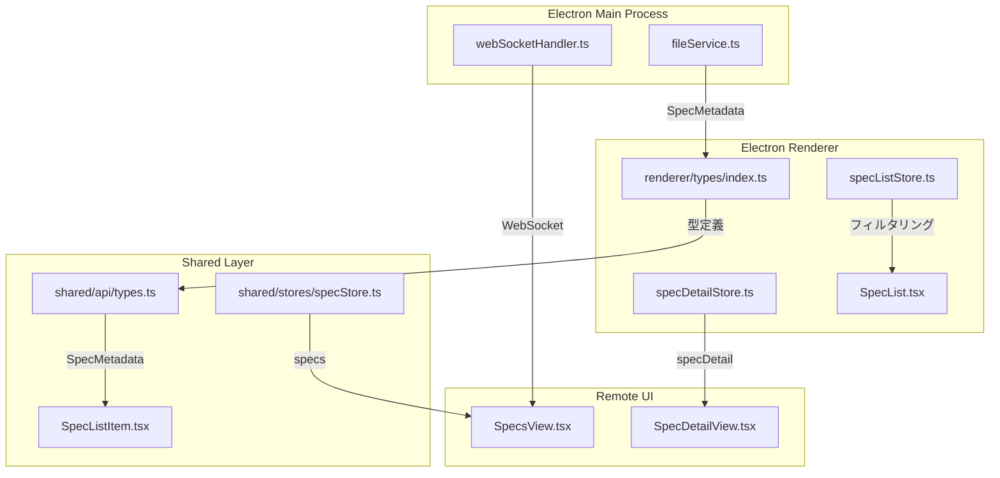
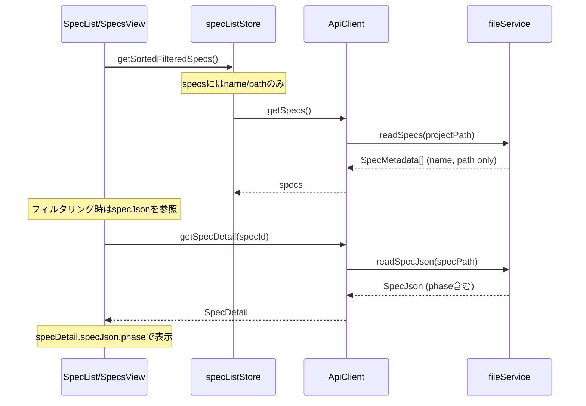
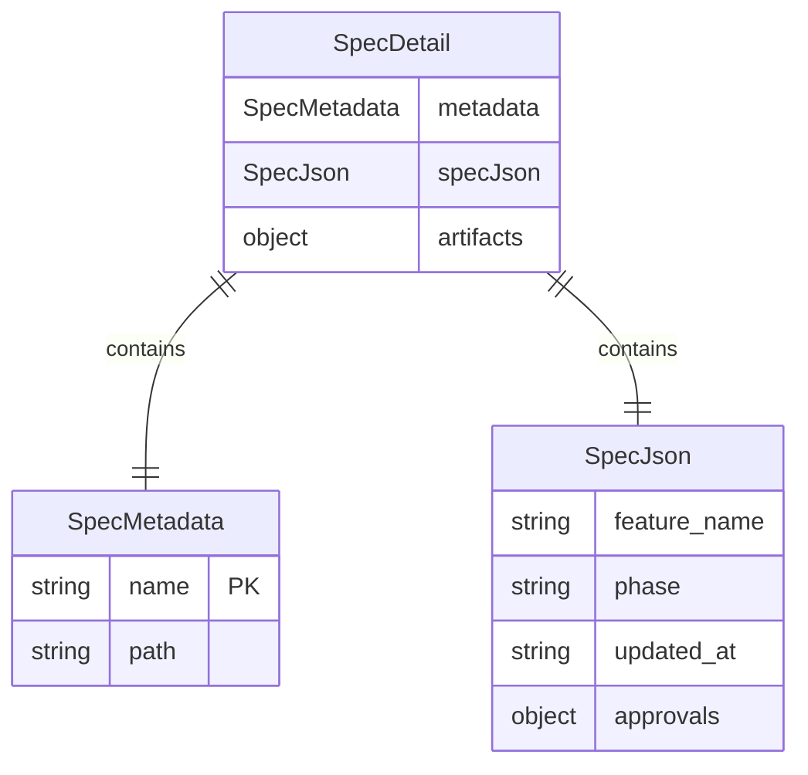

# Design: SpecMetadata SSOT リファクタリング

## Overview

**Purpose**: SpecMetadata型から重複フィールド（`phase`, `updatedAt`, `approvals`）を削除し、specJsonをSingle Source of Truth（SSOT）とすることで、UIにおけるフェーズ表示の同期不整合バグを根本解決する。

**Users**: SDD Orchestrator利用者（開発者）がSpecリストを閲覧・操作する際、常に最新のフェーズ状態が正確に表示される。

**Impact**: SpecMetadata型定義の変更に伴い、関連するStore、Service、Componentの実装を更新する。

### Goals

- SpecMetadataから重複フィールドを削除し、`name`と`path`のみを保持
- specJsonをフェーズ情報の唯一の真実のソースとする
- Electron版・Remote UI版の両方で正しいフェーズ表示を実現

### Non-Goals

- SpecJson自体の構造変更
- BugMetadataの同様のリファクタリング（別Specで対応）
- パフォーマンス最適化（現時点で問題なし）

## Architecture

### Existing Architecture Analysis

現在のアーキテクチャでは、SpecMetadataとSpecJsonの両方が同じフィールドを保持している：

| フィールド | SpecMetadata | SpecJson | 問題 |
|-----------|--------------|----------|------|
| phase | `readonly phase: SpecPhase` | `phase: SpecPhase` | 二重管理 |
| updatedAt | `readonly updatedAt: string` | `updated_at: string` | 二重管理 |
| approvals | `readonly approvals: ApprovalStatus` | `approvals: ApprovalStatus` | 二重管理 |
| name | `readonly name: string` | - | SpecMetadata固有 |
| path | `readonly path: string` | - | SpecMetadata固有 |

**根本原因**: `specDetail.metadata.phase`がselectSpec時点のsnapshotを保持し続け、ファイル変更後も更新されない。

### Architecture Pattern & Boundary Map



**Architecture Integration**:
- Selected pattern: SSOT（Single Source of Truth）- specJsonを唯一の真実のソースとする
- Domain boundaries: 型定義（types）→ サービス（fileService）→ ストア（specListStore/specDetailStore）→ コンポーネント
- Existing patterns preserved: Result型によるエラーハンドリング、Zustand storeパターン
- New components rationale: なし（既存コンポーネントの修正のみ）
- Steering compliance: SSOT原則、DRY原則に従う

### Technology Stack

| Layer | Choice / Version | Role in Feature | Notes |
|-------|------------------|-----------------|-------|
| 型定義 | TypeScript 5.8+ | SpecMetadata型の変更 | strict mode |
| State管理 | Zustand | specListStore、specDetailStoreの更新 | 既存パターン踏襲 |
| UI | React 19 | SpecListItem、SpecList等の更新 | shared/renderer両方 |
| 通信 | WebSocket | Remote UIへのspec情報配信 | 既存パターン踏襲 |

## System Flows

### Specリスト表示フロー（変更後）



**Key Decisions**:
- フィルタリング・ソート時にspecJsonを参照するため、リスト表示時に各specのspecJsonを読み込む
- SpecListItemはphaseをprops経由で受け取る（metadataからではなく）

## Requirements Traceability

| Criterion ID | Summary | Components | Implementation Approach |
|--------------|---------|------------|------------------------|
| 1.1 | SpecMetadata型をname/pathのみに変更 | `renderer/types/index.ts`, `shared/api/types.ts` | 既存型定義を修正 |
| 1.2 | phase, updatedAt, approvalsを削除 | `renderer/types/index.ts` | フィールド削除 |
| 1.3 | TypeScriptコンパイル通過 | 全関連ファイル | 型エラー解消 |
| 2.1 | readSpecsがname/pathのみ返す | `fileService.ts` | specJson読み込み部分を削除 |
| 2.2 | 戻り値型の一致 | `fileService.ts` | 新SpecMetadata型に合わせる |
| 3.1 | フィルタリングがspecJson.phaseを参照 | `specListStore.ts` | getSortedFilteredSpecs修正 |
| 3.2 | specJson取得の仕組み実装 | `specListStore.ts`, `specStoreFacade.ts` | specJsonMapの導入 |
| 3.3 | 既存フィルタリング機能の正常動作 | `specListStore.test.ts` | テスト更新 |
| 4.1 | SpecListItemがphaseをpropsで受け取る | `SpecListItem.tsx` | props追加 |
| 4.2 | フェーズバッジの正しい表示 | `SpecListItem.tsx` | 既存ロジック流用 |
| 4.3 | Electron版とRemote UI版の正常動作 | `SpecList.tsx`, `SpecsView.tsx` | 両方でprops渡し |
| 5.1 | ソート処理がspecJson.updated_atを参照 | `specListStore.ts` | getSortedFilteredSpecs修正 |
| 5.2 | specJson取得の仕組み実装 | `specListStore.ts` | 3.2と共通 |
| 5.3 | 既存ソート機能の正常動作 | `specListStore.test.ts` | テスト更新 |
| 6.1 | specDetail.metadataがname/pathのみ | `specDetailStore.ts` | metadata生成ロジック修正 |
| 6.2 | phase等はspecDetail.specJsonから取得 | `specDetailStore.ts`, UI components | specJson参照に変更 |
| 6.3 | Spec選択時・ファイル変更時の正しい更新 | `specDetailStore.ts`, `specSyncService.ts` | 既存の更新ロジック維持 |
| 7.1 | WebSocket APIでphase送信 | `webSocketHandler.ts` | SpecInfo型にphase含める |
| 7.2 | Remote UI SpecListItemの正しい表示 | `SpecsView.tsx`, `SpecListItem.tsx` | props経由でphase渡し |
| 7.3 | Remote UIフィルタリングの正常動作 | `SpecsView.tsx` | specJson参照に変更 |
| 8.1 | テストが新型定義に対応 | `*.test.ts`, `*.test.tsx` | テストデータ修正 |
| 8.2 | フィルタリング・ソートテスト更新 | `specListStore.test.ts` | specJson参照テスト追加 |
| 8.3 | 全テストPASS | 全テストファイル | CI通過確認 |

### Coverage Validation Checklist

- [x] Every criterion ID from requirements.md appears in the table above
- [x] Each criterion has specific component names (not generic references)
- [x] Implementation approach distinguishes "reuse existing" vs "new implementation"
- [x] User-facing criteria specify concrete UI components

## Components and Interfaces

### Component Summary

| Component | Domain/Layer | Intent | Req Coverage | Key Dependencies | Contracts |
|-----------|--------------|--------|--------------|------------------|-----------|
| SpecMetadata | Types | Spec識別情報の型定義 | 1.1, 1.2 | - | State |
| fileService.readSpecs | Main/Service | Spec一覧読み込み | 2.1, 2.2 | SpecMetadata (P0) | Service |
| specListStore | Renderer/Store | Specリスト状態管理 | 3.1, 3.2, 5.1, 5.2 | fileService (P0), specJsonMap (P0) | State |
| SpecListItem | Shared/UI | Spec項目表示 | 4.1, 4.2 | SpecMetadata (P0), phase prop (P0) | - |
| specDetailStore | Renderer/Store | Spec詳細状態管理 | 6.1, 6.2, 6.3 | fileService (P0) | State |
| webSocketHandler | Main/Service | WebSocket通信 | 7.1 | SpecInfo (P0) | API |
| SpecsView | RemoteUI/View | Remote UIのSpec一覧 | 7.2, 7.3 | ApiClient (P0), SpecListItem (P1) | - |

### Types Layer

#### SpecMetadata (Revised)

| Field | Detail |
|-------|--------|
| Intent | Specの識別情報のみを保持する軽量型 |
| Requirements | 1.1, 1.2, 1.3 |

**Responsibilities & Constraints**
- Specディレクトリの名前とパスのみを保持
- phase、updatedAt、approvalsはspecJsonから取得する設計

**Contracts**: State [x]

##### State Interface

```typescript
// renderer/types/index.ts
export interface SpecMetadata {
  readonly name: string;
  readonly path: string;
}

// 削除されるフィールド:
// - readonly phase: SpecPhase;
// - readonly updatedAt: string;
// - readonly approvals: ApprovalStatus;
```

**Implementation Notes**
- Integration: shared/api/types.tsでも同様の定義に更新
- Validation: TypeScriptコンパイラによる型チェック
- Risks: 既存コードの多くがphaseフィールドを参照しているため、影響範囲が広い

### Service Layer

#### fileService.readSpecs (Revised)

| Field | Detail |
|-------|--------|
| Intent | プロジェクト内の全Specメタデータを読み込む |
| Requirements | 2.1, 2.2 |

**Responsibilities & Constraints**
- .kiro/specs/以下のディレクトリを列挙
- 各ディレクトリのnameとpathのみを返す
- spec.jsonの内容読み込みは不要になる

**Dependencies**
- Outbound: fs/promises — ファイルシステム操作 (P0)

**Contracts**: Service [x]

##### Service Interface

```typescript
// Before (現行)
async readSpecs(projectPath: string): Promise<Result<SpecMetadata[], FileError>>
// Returns: { name, path, phase, updatedAt, approvals }

// After (変更後)
async readSpecs(projectPath: string): Promise<Result<SpecMetadata[], FileError>>
// Returns: { name, path } のみ
```

**Implementation Notes**
- Integration: spec.json読み込みとJSON.parseが不要になり、パフォーマンス向上
- Validation: ディレクトリ存在チェックのみ必要
- Risks: なし（シンプル化）

### Store Layer

#### specListStore (Extended)

| Field | Detail |
|-------|--------|
| Intent | Specリストの状態管理（フィルタリング・ソート含む） |
| Requirements | 3.1, 3.2, 3.3, 5.1, 5.2, 5.3 |

**Responsibilities & Constraints**
- specs配列の管理
- specJsonMapによるspecJson情報の保持
- フィルタリング・ソート時にspecJsonMapを参照

**Dependencies**
- Inbound: SpecList, SpecsView — UI表示 (P0)
- Outbound: fileService.readSpecs — Spec一覧取得 (P0)
- Outbound: fileService.readSpecJson — specJson取得 (P0)

**Contracts**: State [x]

##### State Interface

```typescript
// 追加するstate
export interface SpecListState {
  readonly specs: readonly SpecMetadata[];
  readonly specJsonMap: ReadonlyMap<string, SpecJson>;  // NEW: specId -> SpecJson
  readonly sortBy: 'name' | 'updatedAt' | 'phase';
  readonly sortOrder: 'asc' | 'desc';
  readonly statusFilter: SpecPhase | 'all';
  readonly isLoading: boolean;
  readonly error: string | null;
}

// 追加するaction
export interface SpecListActions {
  loadSpecs(projectPath: string): Promise<void>;
  loadSpecJsons(projectPath: string): Promise<void>;  // NEW
  setSpecs(specs: SpecMetadata[]): void;
  // ... existing actions
  getSortedFilteredSpecs(): SpecMetadataWithPhase[];  // CHANGED: phaseを含む拡張型を返す
}

// 表示用の拡張型
export interface SpecMetadataWithPhase extends SpecMetadata {
  readonly phase: SpecPhase;
  readonly updatedAt: string;
}
```

**Implementation Notes**
- Integration: loadSpecs後にloadSpecJsonsを呼び出し、specJsonMapを構築
- Validation: specJsonMapにないspecIdはフィルタリング対象外
- Risks: 初期ロード時にspec.jsonを全件読み込むためI/O増加（ただし現状も同様の処理をfileServiceで実施）

#### specDetailStore (Modified)

| Field | Detail |
|-------|--------|
| Intent | 選択中Specの詳細情報管理 |
| Requirements | 6.1, 6.2, 6.3 |

**Responsibilities & Constraints**
- 選択されたSpecのspecJsonとartifactsを保持
- metadataはname/pathのみ（phase等はspecJsonから取得）

**Contracts**: State [x]

##### State Interface

```typescript
// specDetail.metadataの変更
export interface SpecDetail {
  metadata: SpecMetadata;  // name, path のみ
  specJson: SpecJson;      // phase, updated_at, approvals はここから取得
  artifacts: { ... };
  taskProgress: TaskProgress | null;
}
```

**Implementation Notes**
- Integration: selectSpec時にmetadataをname/pathのみで構築
- Validation: specJsonは必須（readSpecJsonが失敗した場合はエラー）
- Risks: specDetail.metadata.phaseを参照していた箇所はすべてspecDetail.specJson.phaseに変更が必要

### UI Layer

#### SpecListItem (Modified)

| Field | Detail |
|-------|--------|
| Intent | Spec項目の表示（フェーズバッジ含む） |
| Requirements | 4.1, 4.2, 4.3 |

**Responsibilities & Constraints**
- specメタデータとphaseを受け取り表示
- phaseはprops経由で受け取る（metadataから直接取得しない）

**Contracts**: なし（純粋なUIコンポーネント）

##### Props Interface

```typescript
// Before
export interface SpecListItemProps {
  spec: SpecMetadata;  // phaseを含む
  // ...
}

// After
export interface SpecListItemProps {
  spec: SpecMetadata;  // name, pathのみ
  phase: SpecPhase;    // NEW: 明示的にphaseを受け取る
  updatedAt: string;   // NEW: 明示的にupdatedAtを受け取る
  // ...
}
```

**Implementation Notes**
- Integration: 呼び出し元（SpecList, SpecsView）でphaseを渡す
- Validation: propsの型チェックのみ
- Risks: なし

## Data Models

### Domain Model



**Entities & Aggregates**:
- SpecMetadata: 識別情報のみ（軽量）
- SpecJson: フェーズ・承認状態等の詳細情報（ファイルから取得）
- SpecDetail: メタデータ + specJson + アーティファクトの集約

**Business Rules**:
- phase情報はspecJsonから取得する（SSOT原則）
- SpecMetadataはリスト表示用、SpecDetailは詳細表示用

## Error Handling

### Error Strategy

- ファイル読み込みエラー: 既存のResult型パターンを踏襲
- specJsonMapに該当specがない場合: フィルタリング/ソート時にスキップ

### Error Categories and Responses

**System Errors**:
- spec.json読み込み失敗 → specJsonMapに追加しない（リスト表示は継続）
- ディレクトリアクセス失敗 → 空の配列を返す

**UI表示方針（specJson読み込み失敗時）**:
- specJsonMapにないSpecはリストには表示する
- フェーズバッジは「不明」と表示（グレー表示）
- フィルタリング・ソートの対象外とする（フィルタ適用時は非表示）
- ツールチップで「spec.jsonの読み込みに失敗しました」と表示

## Testing Strategy

### Unit Tests

- `specListStore.test.ts`: specJsonMapを使ったフィルタリング・ソートのテスト
- `specDetailStore.test.ts`: metadata.phaseではなくspecJson.phaseを使用するテスト
- `SpecListItem.test.tsx`: props経由でphaseを受け取るテスト

### Integration Tests

- `specStoreFacade.test.ts`: loadSpecs後にspecJsonsも正しくロードされることを確認
- `IpcApiClient.test.ts`: getSpecs/getSpecDetailが正しいSpecMetadataを返すことを確認

### E2E Tests

- Specリストのフェーズバッジが正しく表示されることを確認
- フェーズフィルターが正しく動作することを確認
- Spec選択後にフェーズが正しく表示されることを確認

## Design Decisions

### DD-001: SpecMetadataからの重複フィールド削除

| Field | Detail |
|-------|--------|
| Status | Accepted |
| Context | SpecMetadataとSpecJsonの両方がphase、updatedAt、approvalsを持ち、同期不整合が発生 |
| Decision | SpecMetadataからこれらのフィールドを削除し、name/pathのみを保持する |
| Rationale | SSOT原則に従い、specJsonを唯一の真実のソースとすることで同期バグを根本解決 |
| Alternatives Considered | (A) metadata更新ロジックの修正 → 対症療法で再発リスクあり |
| Consequences | 影響範囲が広い（31ファイル）が、根本解決となる。型エラーはコンパイル時に検出可能 |

### DD-002: specJsonMapの導入

| Field | Detail |
|-------|--------|
| Status | Accepted |
| Context | リスト表示時にフィルタリング・ソートでphase/updatedAtが必要 |
| Decision | specListStoreにspecJsonMapを追加し、specId -> SpecJsonのマッピングを保持 |
| Rationale | リスト表示時に各specのspecJsonを参照可能にする最小限の変更 |
| Alternatives Considered | (A) 毎回specJsonを読み込む → I/O過多、(B) specs配列にphaseを含める → 型の複雑化 |
| Consequences | 初期ロード時にspecJsonを全件読み込むが、現状のfileService.readSpecsと同等のI/O |

### DD-003: SpecListItemへのphase props追加

| Field | Detail |
|-------|--------|
| Status | Accepted |
| Context | SpecListItemがphaseを表示するが、SpecMetadataにphaseがなくなる |
| Decision | SpecListItemにphaseとupdatedAtをpropsとして明示的に渡す |
| Rationale | コンポーネントの責務を明確化し、データソースを呼び出し元に委譲 |
| Alternatives Considered | (A) SpecListItem内でspecJsonを取得 → 責務過大 |
| Consequences | 呼び出し元（SpecList, SpecsView）でphase/updatedAtを解決する必要がある |

### DD-004: Remote UIでのspecJson配信方式

| Field | Detail |
|-------|--------|
| Status | Accepted |
| Context | Remote UIもSpecリストでphaseを表示する必要がある |
| Decision | WebSocketのspecs_updated イベントでSpecInfo（phase含む）を配信継続 |
| Rationale | 既存のSpecInfo型はphaseを含んでおり、変更不要 |
| Alternatives Considered | なし（既存パターン維持） |
| Consequences | webSocketHandler.tsのStateProvider.getSpecs()はphase情報を含む必要がある |

## Supporting References

### 影響を受けるファイル一覧

**型定義**:
- `electron-sdd-manager/src/renderer/types/index.ts`
- `electron-sdd-manager/src/shared/api/types.ts`
- `electron-sdd-manager/src/renderer/stores/spec/types.ts`

**サービス**:
- `electron-sdd-manager/src/main/services/fileService.ts`
- `electron-sdd-manager/src/main/services/webSocketHandler.ts`
- `electron-sdd-manager/src/shared/api/IpcApiClient.ts`
- `electron-sdd-manager/src/shared/api/WebSocketApiClient.ts`

**ストア**:
- `electron-sdd-manager/src/renderer/stores/spec/specListStore.ts`
- `electron-sdd-manager/src/renderer/stores/spec/specDetailStore.ts`
- `electron-sdd-manager/src/renderer/stores/spec/specStoreFacade.ts`
- `electron-sdd-manager/src/shared/stores/specStore.ts`

**UIコンポーネント**:
- `electron-sdd-manager/src/shared/components/spec/SpecListItem.tsx`
- `electron-sdd-manager/src/renderer/components/SpecList.tsx`
- `electron-sdd-manager/src/remote-ui/views/SpecsView.tsx`
- `electron-sdd-manager/src/remote-ui/views/SpecDetailView.tsx`

**テスト**:
- 上記ファイルに対応する`*.test.ts`/`*.test.tsx`ファイル
