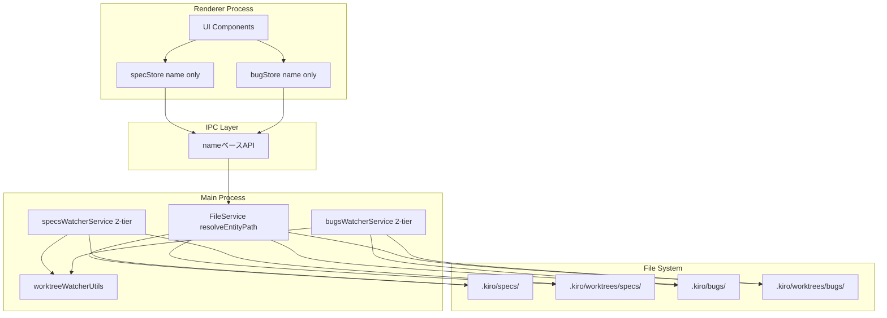
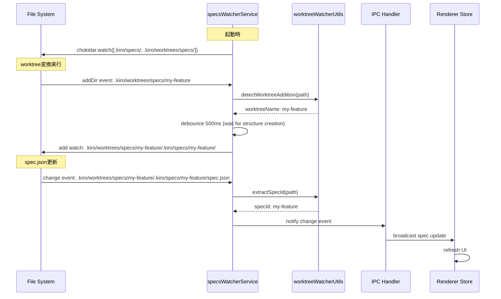
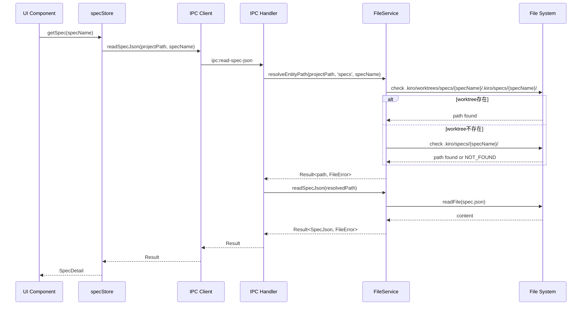
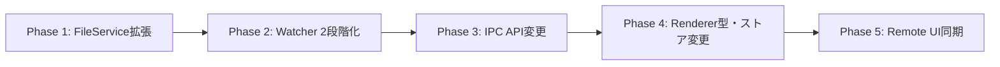

# 設計書: Spec Path SSOT Refactor

## 概要

worktree変換後のElectron UI更新問題を根本的に解決するため、spec/bugのpath管理アーキテクチャを全面的に刷新する。具体的には、(1) FileWatcherに2段階監視方式を導入してworktreeの動的追加/削除に対応し、(2) 全APIをnameベースに統一してRenderer側のpath管理責務を排除し、(3) 共通ロジックをユーティリティとして抽出してspecs/bugsの実装重複を解消する。

**Purpose**: この機能は、worktree変換時のUI不整合を完全に排除し、開発者がpath管理の複雑さから解放されることで、Spec-Driven Developmentワークフローの信頼性と保守性を向上させる。

**Users**: Electronアプリケーション開発者とエンドユーザー（SDD Orchestratorを利用する開発者）が、worktree変換機能を安心して使用できるようになる。

**Impact**: 既存のpath-based API設計からname-based API設計への移行により、Renderer側のステート管理が簡素化され、Main Processが真のSSOT（Single Source of Truth）として機能する。

### ゴール

- worktree変換後もFileWatcherが自動的に新しいパスを監視し、UIが常に最新状態を反映する
- すべてのspec/bug関連APIがnameベースで統一され、path管理の複雑さが開発者から隠蔽される
- specs/bugsの共通ロジックがDRY原則に従って共通化され、保守性が向上する

### 非ゴール

- spec.json/bug.jsonファイル形式の変更
- path解決結果のキャッシュ機構（パフォーマンス問題が顕在化していない）
- 新規entityタイプの追加（共通化により将来対応は容易になる）

## アーキテクチャ

> 詳細な調査メモは `research.md` を参照。設計書はレビュアーが自己完結的に理解できるよう、すべての決定事項と契約をここに記載する。

### 既存アーキテクチャ分析

**現在のpath管理方式**:
- FileService.readSpecs() が `.kiro/specs/` と `.kiro/worktrees/specs/` をスキャン
- 返却されるSpecMetadata/BugMetadataにpathフィールドが含まれる
- Renderer側がmetadata.pathを保持し、IPC呼び出し時に渡す
- worktree変換後も古いpathが保持されたままになる問題

**現在のWatcher実装**:
- specsWatcherService: `.kiro/specs/` を監視、worktree起動時に静的リスト化
- bugsWatcherService: `.kiro/bugs/` を監視
- worktree追加時の動的監視対象追加機能が欠如
- 2つのサービス間で80%のコード重複

**技術的負債**:
- path管理の責務がMain/Renderer間で曖昧
- Renderer側がpathを計算・保持することでSSOT原則違反
- WatcherServiceのコード重複

### アーキテクチャパターン & ドメイン境界

**選択されたパターン**: Layered Architecture + SSOT原則

**ドメイン/機能境界**:
- **Main Process Layer**: path解決、ファイル監視、ファイル操作（真のSSOT）
- **IPC Layer**: nameベースAPIでMain/Renderer間を分離
- **Renderer Process Layer**: UIステート管理、nameのみを保持

**既存パターンの維持**:
- Result<T, E> エラーハンドリングパターン
- IPC channels + handlers構造
- Zustand state管理（ただしpathフィールド削除）

**新規コンポーネントの理由**:
- **resolveEntityPath**: path解決ロジックの一元化（SSOT実現）
- **2段階監視ロジック**: worktree動的追加/削除への対応
- **共通ユーティリティ関数**: DRY原則に従ったコード重複排除

**Steering準拠**:
- `design-principles.md`: SSOT、DRY、根本的解決
- `structure.md`: Main Processステート管理原則



### 技術スタック

| レイヤー | 選択 / バージョン | この機能での役割 | 備考 |
|-------|------------------|-----------------|-------|
| Runtime | Node.js 20+ | ファイルシステム監視・操作 | fs/promises, path モジュール使用 |
| File Watching | chokidar ^3.5 | 2段階監視実装の基盤 | 既存依存関係、追加インストール不要 |
| Type System | TypeScript 5.8+ | 型安全なAPI変更の強制 | コンパイルエラーで影響箇所を網羅的に検出 |
| State Management | Zustand | Renderer側ステート（pathフィールド削除） | 既存パターン維持 |
| IPC | Electron contextBridge | nameベースAPIの公開 | シグネチャ変更のみ、チャネル名は維持 |

> 既存技術スタックの範囲内で実装可能。新規依存関係の追加なし。

## システムフロー

### 2段階監視フロー（Specs）



**フロー上の主要な決定事項**:
- debounce 500ms: ディレクトリ構造の作成完了を待機（300msから延長）
- worktree検知後の監視追加: chokidarのadd()メソッドで動的追加

### nameベースAPI呼び出しフロー



**フロー上の主要な決定事項**:
- path解決はFileService内で完結（Rendererには公開しない）
- 優先順位: worktree > main（既存ロジックと一致）
- エラーは Result<T, FileError> で統一的に処理

## 要件トレーサビリティ

| 要件ID | 要約 | コンポーネント | 実装アプローチ |
|--------|------|--------------|--------------|
| 1.1 | resolveEntityPath メソッド追加 | FileService | 新規実装 |
| 1.2 | path解決優先順位（worktree > main > error） | FileService.resolveEntityPath | 新規実装 |
| 1.3 | 便利メソッド resolveSpecPath/resolveBugPath | FileService | 新規実装（wrappers） |
| 1.4 | 非同期path解決と存在確認 | FileService.resolveEntityPath | 新規実装（fs.access使用） |
| 2.1 | specs監視対象に .kiro/worktrees/specs/ 追加 | SpecsWatcherService.start() | 既存修正（watch paths配列拡張） |
| 2.2 | worktree追加検知と内部spec監視開始 | SpecsWatcherService event handler | 新規実装（addDir event処理） |
| 2.3 | worktree削除時の監視解除 | SpecsWatcherService event handler | 新規実装（unlinkDir event処理） |
| 2.4 | ディレクトリ作成完了の待機 | SpecsWatcherService debounce | 既存修正（500msに延長） |
| 2.5 | 既存spec変更イベント処理維持 | SpecsWatcherService event handler | 既存維持 |
| 3.1 | bugs監視対象に .kiro/worktrees/bugs/ 追加 | BugsWatcherService.start() | 既存修正（watch paths配列拡張） |
| 3.2 | worktree追加検知と内部bug監視開始 | BugsWatcherService event handler | 新規実装（addDir event処理） |
| 3.3 | worktree削除時の監視解除 | BugsWatcherService event handler | 新規実装（unlinkDir event処理） |
| 3.4 | ディレクトリ作成完了の待機 | BugsWatcherService debounce | 既存修正（500msに延長） |
| 3.5 | 既存bug変更イベント処理維持 | BugsWatcherService event handler | 既存維持 |
| 4.1 | 2段階監視共通ロジック抽出 | worktreeWatcherUtils | 新規実装（ユーティリティ関数群） |
| 4.2 | specs/bugsで共通ロジック利用 | SpecsWatcherService, BugsWatcherService | 既存修正（共通関数呼び出し） |
| 4.3 | entityTypeパラメータ化 | worktreeWatcherUtils functions | 新規実装 |
| 4.4 | 個別イベント処理ロジック維持 | SpecsWatcherService, BugsWatcherService | 既存維持 |
| 5.1 | readSpecJson nameベース変更 | IPC handler, FileService.readSpecJson | 既存修正（シグネチャ変更） |
| 5.2 | readArtifact nameベース変更 | IPC handler, FileService.readArtifact | 既存修正（シグネチャ変更） |
| 5.3 | updateSpecJson nameベース変更 | IPC handler, FileService.updateSpecJson | 既存修正（シグネチャ変更） |
| 5.4 | 補助API nameベース変更 | IPC handlers (syncSpecPhase, syncDocumentReview等) | 既存修正（シグネチャ変更） |
| 5.5 | Renderer側path計算・保持ロジック削除 | specStore, specDetailStore, specListStore | 既存修正（path参照削除） |
| 6.1 | readBugJson nameベース変更 | IPC handler, FileService.readBugJson | 既存修正（シグネチャ変更） |
| 6.2 | readBugArtifact nameベース変更 | IPC handler, FileService.readBugArtifact | 既存修正（シグネチャ変更） |
| 6.3 | updateBugJson nameベース変更 | IPC handler, FileService.updateBugJson | 既存修正（シグネチャ変更） |
| 6.4 | Renderer側path計算・保持ロジック削除 | bugStore | 既存修正（path参照削除） |
| 7.1 | SpecMetadata型からpathフィールド削除 | renderer/types/index.ts | 既存修正（型定義変更） |
| 7.2 | SpecMetadata使用箇所のpath参照削除 | specDetailStore, specListStore等 | 既存修正（TypeScriptエラーガイド） |
| 7.3 | SelectProjectResult.specs name-only返却 | handlers.ts (SELECT_PROJECT) | 既存修正 |
| 7.4 | specDetailStore path依存削除 | specDetailStore | 既存修正 |
| 7.5 | UIコンポーネント path依存削除 | SpecListItem, SpecDetailView等 | 既存修正 |
| 8.1 | BugMetadata型からpathフィールド削除 | renderer/types/bug.ts | 既存修正（型定義変更） |
| 8.2 | BugMetadata他フィールド維持 | renderer/types/bug.ts | 既存維持 |
| 8.3 | BugMetadata使用箇所のpath参照削除 | bugStore等 | 既存修正（TypeScriptエラーガイド） |
| 8.4 | bugStore path依存削除 | bugStore | 既存修正 |
| 8.5 | UIコンポーネント path依存削除 | BugListItem, BugDetailView等 | 既存修正 |
| 9.1 | spec.json/bug.json形式無変更 | 該当なし | 既存維持 |
| 9.2 | worktreeフィールド継続動作 | FileService, WatcherServices | 既存維持 |
| 9.3 | IPCチャネル名維持 | channels.ts | 既存維持（シグネチャのみ変更） |
| 9.4 | Remote UI WebSocket API同期 | remoteAccessHandlers.ts, webSocketHandler.ts | 既存修正 |

### カバレッジ検証チェックリスト

**設計完了前に必須確認**:
- [x] requirements.mdのすべての要件IDが上記テーブルに存在
- [x] 各要件に具体的なコンポーネント名が記載（汎用的な参照なし）
- [x] 実装アプローチで「既存修正」「新規実装」「既存維持」を明確に区別
- [x] ユーザー向け要件は具体的なUIコンポーネントを特定

## コンポーネントとインタフェース

### コンポーネント概要

| コンポーネント | ドメイン/レイヤー | 意図 | 要件カバレッジ | 主要依存関係（P0/P1） | 契約 |
|-----------|--------------|--------|--------------|--------------------------|-----------|
| FileService.resolveEntityPath | Main/ファイル操作 | entity name→path解決のSSOT | 1.1-1.4 | fs/promises (P0) | Service |
| worktreeWatcherUtils | Main/ファイル監視 | 2段階監視共通ロジック | 4.1-4.3 | chokidar (P0) | - |
| SpecsWatcherService | Main/ファイル監視 | specs監視（2段階） | 2.1-2.5, 4.2, 4.4 | worktreeWatcherUtils (P0), chokidar (P0) | Event |
| BugsWatcherService | Main/ファイル監視 | bugs監視（2段階） | 3.1-3.5, 4.2, 4.4 | worktreeWatcherUtils (P0), chokidar (P0) | Event |
| IPC Handlers | IPC/通信 | nameベースAPI公開 | 5.1-5.4, 6.1-6.3, 9.3 | FileService (P0) | API |
| SpecMetadata | Renderer/型定義 | spec識別情報（nameのみ） | 7.1-7.3 | - | - |
| BugMetadata | Renderer/型定義 | bug識別情報（pathなし） | 8.1-8.3 | - | - |
| Renderer Stores | Renderer/状態管理 | UIステート（path削除） | 7.4, 8.4 | ApiClient (P0) | State |
| UI Components | Renderer/表示 | UIレンダリング（path削除） | 7.5, 8.5 | Renderer Stores (P0) | - |

### Main Process Layer

#### FileService.resolveEntityPath

| フィールド | 詳細 |
|-------|--------|
| 意図 | entityName（specName/bugName）から実際のファイルパスを一元的に解決する |
| 要件 | 1.1, 1.2, 1.3, 1.4 |

**責務と制約**
- path解決の唯一の真実の情報源（SSOT）
- worktree優先順位の適用（worktree > main > error）
- 非同期ファイル存在確認

**依存関係**
- Outbound: fs/promises (access, stat) — ファイル存在確認 (P0)
- Outbound: path (join, normalize) — パス正規化 (P0)

**契約**: Service [x]

##### Service Interface

```typescript
interface ResolveEntityPathService {
  /**
   * Resolve entity name to actual file system path
   * Priority: worktree path > main path > NOT_FOUND error
   */
  resolveEntityPath(
    projectPath: string,
    entityType: 'specs' | 'bugs',
    entityName: string
  ): Promise<Result<string, FileError>>;

  /**
   * Convenience method for spec path resolution
   */
  resolveSpecPath(
    projectPath: string,
    specName: string
  ): Promise<Result<string, FileError>>;

  /**
   * Convenience method for bug path resolution
   */
  resolveBugPath(
    projectPath: string,
    bugName: string
  ): Promise<Result<string, FileError>>;
}

type FileError = {
  type: 'NOT_FOUND' | 'INVALID_PATH' | 'ACCESS_DENIED';
  path: string;
  reason: string;
};
```

- Preconditions: projectPath must be valid, entityName must be non-empty
- Postconditions: Returns absolute path if exists, error if not found
- Invariants: Prioritizes worktree path over main path consistently

**実装ノート**
- Integration: 既存FileServiceクラスにメソッド追加
- Validation: entityNameのフォーマット検証（既存isValidSpecName利用）
- Risks: worktreeとmain両方が存在する場合、worktree優先が確実に適用されること

#### worktreeWatcherUtils

| フィールド | 詳細 |
|-------|--------|
| 意図 | specs/bugs Watcher間で共通の2段階監視ロジックを提供 |
| 要件 | 4.1, 4.2, 4.3 |

**責務と制約**
- worktreeディレクトリ追加検知
- entity名の抽出（worktree path → entity name）
- 内部entity pathの生成

**依存関係**
- Outbound: path (join, relative, sep) — パス操作 (P0)

**契約**: Service [x]

##### Service Interface

```typescript
/**
 * Detect worktree addition from directory path
 * @param basePath - .kiro/worktrees/{entityType}/
 * @param dirPath - detected directory path
 * @returns entity name if worktree pattern matched, null otherwise
 */
export function detectWorktreeAddition(
  basePath: string,
  dirPath: string
): string | null;

/**
 * Build inner entity path for worktree monitoring
 * @param projectPath - project root
 * @param entityType - 'specs' | 'bugs'
 * @param entityName - entity name
 * @returns path like .kiro/worktrees/{type}/{name}/.kiro/{type}/{name}/
 */
export function buildWorktreeEntityPath(
  projectPath: string,
  entityType: 'specs' | 'bugs',
  entityName: string
): string;

/**
 * Extract entity name from file path (supports both main and worktree paths)
 * @param projectPath - project root
 * @param entityType - 'specs' | 'bugs'
 * @param filePath - detected file path
 * @returns entity name or undefined
 */
export function extractEntityName(
  projectPath: string,
  entityType: 'specs' | 'bugs',
  filePath: string
): string | undefined;
```

- Preconditions: Paths must be normalized and absolute
- Postconditions: Returns valid entity name or null/undefined
- Invariants: Pattern matching is consistent with FileService resolution logic

**実装ノート**
- Integration: 新規ファイル `main/services/worktreeWatcherUtils.ts` として作成
- Validation: パスパターンの厳密な検証（既存extractSpecId/extractBugNameロジックを統合）
- Risks: パスパターンの一貫性が重要（FileService.resolveEntityPathと同一ルール）

#### SpecsWatcherService (2段階監視対応)

| フィールド | 詳細 |
|-------|--------|
| 意図 | specs変更を監視し、worktree動的追加/削除に対応 |
| 要件 | 2.1, 2.2, 2.3, 2.4, 2.5, 4.2, 4.4 |

**責務と制約**
- `.kiro/specs/` と `.kiro/worktrees/specs/` の両方を監視
- worktree追加時に内部spec pathを動的に監視対象追加
- worktree削除時に監視対象から除外
- 既存のspec変更イベント処理を維持

**依存関係**
- Outbound: worktreeWatcherUtils — 共通監視ロジック (P0)
- Outbound: chokidar — ファイル監視 (P0)
- Outbound: FileService — spec.json読み書き (P1)

**契約**: Event [x]

##### Event Contract

- Published events:
  - `SpecsChangeEvent { type: 'add' | 'change' | 'unlink' | 'addDir' | 'unlinkDir', path: string, specId?: string }`
- Subscribed events: chokidar file system events
- Ordering / delivery guarantees: debounced (500ms for worktree add, 300ms for file changes)

**実装ノート**
- Integration: 既存SpecsWatcherServiceを修正、start()メソッドでwatch paths配列に worktree親ディレクトリ追加
- Validation: worktree追加時にディレクトリ構造が完成しているか確認（500ms debounce）
- Risks: 高速なworktree追加/削除に対応できるか（debounceで緩和）

#### BugsWatcherService (2段階監視対応)

| フィールド | 詳細 |
|-------|--------|
| 意図 | bugs変更を監視し、worktree動的追加/削除に対応 |
| 要件 | 3.1, 3.2, 3.3, 3.4, 3.5, 4.2, 4.4 |

**責務と制約**
- `.kiro/bugs/` と `.kiro/worktrees/bugs/` の両方を監視
- worktree追加時に内部bug pathを動的に監視対象追加
- worktree削除時に監視対象から除外
- 既存のbug変更イベント処理を維持

**依存関係**
- Outbound: worktreeWatcherUtils — 共通監視ロジック (P0)
- Outbound: chokidar — ファイル監視 (P0)

**契約**: Event [x]

##### Event Contract

- Published events:
  - `BugsChangeEvent { type: 'add' | 'change' | 'unlink' | 'addDir' | 'unlinkDir', path: string, bugName?: string }`
- Subscribed events: chokidar file system events
- Ordering / delivery guarantees: debounced (500ms for worktree add, 300ms for file changes)

**実装ノート**
- Integration: 既存BugsWatcherServiceを修正、SpecsWatcherServiceと同様のパターン適用
- Validation: worktreeWatcherUtils使用により一貫性を確保
- Risks: SpecsWatcherServiceと同じリスク

### IPC Layer

#### IPC Handlers (nameベースAPI)

| フィールド | 詳細 |
|-------|--------|
| 意図 | Renderer向けにnameベースAPIを公開し、path解決を隠蔽 |
| 要件 | 5.1, 5.2, 5.3, 5.4, 6.1, 6.2, 6.3, 9.3, 9.4 |

**責務と制約**
- nameパラメータを受け取り、FileService.resolveEntityPathで解決
- 解決されたpathでFileServiceメソッド呼び出し
- エラーをResult<T, ApiError>形式で返却

**依存関係**
- Outbound: FileService.resolveEntityPath — path解決 (P0)
- Outbound: FileService (各種メソッド) — ファイル操作 (P0)

**契約**: API [x]

##### API Contract

| Method | Channel | Request | Response | Errors |
|--------|---------|---------|----------|--------|
| readSpecJson | ipc:read-spec-json | { projectPath: string, specName: string } | Result<SpecJson, ApiError> | NOT_FOUND, ACCESS_DENIED |
| readArtifact | ipc:read-artifact | { projectPath: string, specName: string, artifactType: string } | Result<string, ApiError> | NOT_FOUND, ACCESS_DENIED |
| updateSpecJson | ipc:update-spec-json | { projectPath: string, specName: string, updates: object } | Result<void, ApiError> | NOT_FOUND, WRITE_FAILED |
| readBugJson | ipc:read-bug-detail | { projectPath: string, bugName: string } | Result<BugDetail, ApiError> | NOT_FOUND, ACCESS_DENIED |
| readBugArtifact | ipc:read-bug-artifact | { projectPath: string, bugName: string, artifactType: string } | Result<string, ApiError> | NOT_FOUND, ACCESS_DENIED |
| updateBugJson | ipc:update-bug-json | { projectPath: string, bugName: string, updates: object } | Result<void, ApiError> | NOT_FOUND, WRITE_FAILED |

**実装ノート**
- Integration: 既存handlers.tsの関数シグネチャを変更、内部でresolveEntityPath呼び出し
- Validation: nameパラメータの検証（既存isValidSpecName利用）
- Risks: すべてのIPC呼び出し元（Renderer, Remote UI）の同期更新が必要

### Renderer Layer

#### SpecMetadata型（簡素化）

| フィールド | 詳細 |
|-------|--------|
| 意図 | spec識別に必要な最小情報（nameのみ）を提供 |
| 要件 | 7.1, 7.2, 7.3 |

**責務と制約**
- specの一意識別子（name）のみを保持
- pathフィールドは削除（Main側で解決）
- 他のメタデータ（phase, updatedAt）はSpecJsonから取得

**依存関係**
- なし（純粋な型定義）

**実装ノート**
- Integration: `renderer/types/index.ts` の型定義変更
- Validation: TypeScriptコンパイラがpath参照箇所をすべて検出
- Risks: 既存コンポーネントのpath参照が多数存在（コンパイルエラーで網羅的に修正）

##### Type Definition

```typescript
export interface SpecMetadata {
  readonly name: string;
}
```

#### BugMetadata型（pathフィールド削除）

| フィールド | 詳細 |
|-------|--------|
| 意図 | bug識別情報を提供（pathなし、他フィールド維持） |
| 要件 | 8.1, 8.2, 8.3 |

**責務と制約**
- bugの一意識別子（name）と表示用メタデータ（phase, updatedAt等）を保持
- pathフィールドは削除（Main側で解決）
- worktree, worktreeBasePathフィールドは維持

**依存関係**
- なし（純粋な型定義）

**実装ノート**
- Integration: `renderer/types/bug.ts` の型定義変更
- Validation: TypeScriptコンパイラがpath参照箇所をすべて検出
- Risks: SpecMetadataと同様

##### Type Definition

```typescript
export interface BugMetadata {
  readonly name: string;           // バグ名（ディレクトリ名）
  readonly phase: BugPhase;        // 現在のフェーズ
  readonly updatedAt: string;      // 最終更新日時
  readonly reportedAt: string;     // 報告日時
  readonly worktree?: BugWorktreeConfig;
  readonly worktreeBasePath?: string;
}
```

#### Renderer Stores（path依存削除）

| フィールド | 詳細 |
|-------|--------|
| 意図 | UIステートからpath管理責務を排除 |
| 要件 | 7.4, 7.5, 8.4, 8.5 |

**責務と制約**
- nameのみを保持し、API呼び出し時にnameを渡す
- pathの計算・キャッシュロジックを削除
- Main側のpath解決結果を信頼

**依存関係**
- Inbound: UI Components — ステート読み取り (P0)
- Outbound: ApiClient — nameベースAPI呼び出し (P0)

**契約**: State [x]

##### State Management

- State model: Zustand store, nameのみを保持
- Persistence & consistency: Main Processが真実の情報源
- Concurrency strategy: IPC経由のMain Process同期

**実装ノート**
- Integration: specStore, specDetailStore, specListStore, bugStoreからpath参照削除
- Validation: TypeScriptコンパイルエラーで網羅的に検出
- Risks: 多数のコンポーネント変更が必要（型安全性で保証）

**shared/storesへの影響**:
- `shared/stores/specStore.ts`, `shared/stores/bugStore.ts`は`shared/api/types.ts`経由で`@renderer/types`の型定義を使用
- 型チェーン: `renderer/types/index.ts` → `shared/api/types.ts` → `shared/stores/*.ts`
- SpecMetadata/BugMetadata型変更時、TypeScriptコンパイラが全参照箇所を検出
- shared/stores自体にpath参照ロジックはなく、型定義変更のみで対応完了

## データモデル

### ドメインモデル

**エンティティ**:
- **Spec**: 仕様書エンティティ（識別子: name）
- **Bug**: バグエンティティ（識別子: name）

**値オブジェクト**:
- **EntityPath**: 解決されたファイルパス（一時的、永続化しない）
- **EntityType**: 'specs' | 'bugs'

**ドメインルール**:
- 同一projectPath内でentity nameは一意
- worktreeとmainで同名entityが存在する場合、worktreeを優先
- pathはnameから導出可能（SSOT原則）

### 論理データモデル

**構造定義**:
- SpecMetadata: `{ name: string }`
- BugMetadata: `{ name: string, phase: BugPhase, updatedAt: string, reportedAt: string, worktree?, worktreeBasePath? }`
- FileError: `{ type: string, path: string, reason: string }`

**整合性と完全性**:
- トランザクション境界: ファイル単位（spec.json, bug.json）
- 参照整合性: nameは対応するディレクトリ名と一致
- 時相的側面: updatedAt, reportedAtはISO 8601形式

### 物理データモデル

**ファイルシステム**:
- Main specs: `.kiro/specs/{specName}/`
- Worktree specs: `.kiro/worktrees/specs/{specName}/.kiro/specs/{specName}/`
- Main bugs: `.kiro/bugs/{bugName}/`
- Worktree bugs: `.kiro/worktrees/bugs/{bugName}/.kiro/bugs/{bugName}/`

**インデックス/パフォーマンス最適化**:
- chokidarによるファイル監視（OSネイティブイベント利用）
- debouncing（300ms/500ms）による不要なイベント削減
- path解決結果のキャッシュは現時点では不要（同期操作で十分高速）

### データ契約と統合

**API Data Transfer**:
- Request: `{ projectPath: string, entityName: string }`
- Response: `Result<T, FileError>`
- Validation: entityName format validation (lowercase letters, numbers, hyphens)

**Event Schemas**:
- SpecsChangeEvent: `{ type: string, path: string, specId?: string }`
- BugsChangeEvent: `{ type: string, path: string, bugName?: string }`

**分散データ管理**:
- Main Process: path解決とファイル監視のSSOT
- Renderer Process: UIステート（nameのみ保持）
- 同期戦略: IPC経由のイベントブロードキャスト

## エラー処理

### エラー戦略

各エラータイプに対する具体的な処理パターンとリカバリー機構。

### エラーカテゴリと対応

**User Errors (4xx相当)**:
- Invalid entity name → フィールドレベルバリデーション、フォーマット説明表示
- Entity not found → ナビゲーションガイダンス（一覧に戻る、再読み込み）

**System Errors (5xx相当)**:
- File access denied → graceful degradation（読み取り専用モード提示）
- Watcher initialization failure → 手動リフレッシュボタン提供

**Business Logic Errors (422相当)**:
- Path resolution failure → 条件説明（worktree/main両方不存在）、ディレクトリ作成ガイド

### 監視

- エラートラッキング: ProjectLogger経由でプロジェクト別ログファイル記録
- ロギング: `[timestamp] [ERROR] [projectId] message` フォーマット
- ヘルスモニタリング: FileWatcherの起動状態をMain Processで管理

## テスト戦略

### Unit Tests

- FileService.resolveEntityPath: worktree優先順位検証、存在しない場合のエラー
- worktreeWatcherUtils.detectWorktreeAddition: パスパターンマッチング正確性
- worktreeWatcherUtils.extractEntityName: main/worktree両パス対応
- IPC handlers: nameパラメータからpath解決、FileService呼び出し検証
- Metadata型変更: TypeScriptコンパイル成功確認

### Integration Tests

- SpecsWatcherService: worktree追加検知→内部path監視開始フロー
- BugsWatcherService: worktree削除検知→監視解除フロー
- IPC handler + FileService: name受け取り→path解決→ファイル読み取りE2E
- Renderer store: nameのみ保持→IPC呼び出し→結果受け取りフロー

### E2E Tests

- worktree変換実行→UI自動更新確認
- spec.json更新（worktree内）→SpecWorkflowFooter更新確認
- bug.json更新（worktree内）→BugDetailView更新確認

## オプションセクション

### マイグレーション戦略

**フェーズ分解**:



**Phase 1**: FileService拡張
- resolveEntityPath, resolveSpecPath, resolveBugPath実装
- 既存APIには影響なし
- ユニットテストで検証

**Phase 2**: Watcher 2段階化
- worktreeWatcherUtils実装
- SpecsWatcherService, BugsWatcherService修正
- 統合テストで検証

**Phase 3**: IPC API変更
- handlers.tsのシグネチャ変更（path → name）
- channels.ts（チャネル名は維持）
- 既存Renderer呼び出しはコンパイルエラー（次フェーズで修正）

**Phase 4**: Renderer型・ストア変更
- SpecMetadata, BugMetadata型変更
- stores（specStore, bugStore等）のpath参照削除
- UIコンポーネントのpath参照削除
- TypeScriptコンパイルエラーをガイドに網羅的修正

**Phase 5**: Remote UI同期
- remoteAccessHandlers.ts, webSocketHandler.ts修正
- WebSocket API も nameベースに統一
- Remote UI E2Eテストで検証

**Rollback triggers**:
- Phase 1-2: ユニットテスト失敗
- Phase 3-4: TypeScriptコンパイルエラー未解決
- Phase 5: Remote UI E2Eテスト失敗

**Validation checkpoints**:
- 各フェーズ完了時にテスト実行
- Phase 4完了時にE2Eテスト（worktree変換→UI更新）
- Phase 5完了時にRemote UI E2Eテスト

## 設計決定

### DD-001: 2段階監視パターンの採用

| フィールド | 詳細 |
|-------|--------|
| ステータス | Accepted |
| コンテキスト | worktree変換でディレクトリが動的に追加されるが、現在のWatcherは起動時の静的リストのみ監視。worktree追加後もFileWatcherが新しいパスを自動検知する必要がある。 |
| 決定 | 2段階監視方式: (1) `.kiro/worktrees/{type}/` 親ディレクトリを監視、(2) worktree追加検知時に内部entity pathを動的に監視対象追加 |
| 理由 | Watcherリスタートは非効率でイベントロスのリスクあり。手動リフレッシュはUX低下。2段階監視はworktreeライフサイクルに自然に対応し、自動的・リアクティブ。 |
| 検討した代替案 | (A) Watcherリスタート→イベントロス、(B) 手動リフレッシュAPI→UX低下、(C) 2段階監視→採用 |
| 結果 | Benefits: 自動検知、ユーザーアクション不要、スケーラブル。Compromises: Watcher実装がやや複雑化（debouncing必要）。Follow-up: ディレクトリ作成完了待機（500ms debounce） |

### DD-002: nameベースAPI設計への移行

| フィールド | 詳細 |
|-------|--------|
| ステータス | Accepted |
| コンテキスト | Renderer側がpathを計算・保持し、IPC呼び出し時にpathを渡す現在の設計。worktree変換後も古いpathが保持され、Main側へのAPI呼び出しに古いpathが使用されるため、不整合が発生。 |
| 決定 | すべてのspec/bug関連APIをnameベースに変更。`(projectPath, path)` → `(projectPath, name)`。Main側でnameからpathを解決。 |
| 理由 | SSOT原則: pathはファイルシステム詳細でありMain Processが管理すべき。Renderer側でpathを保持すると状態不整合のリスク。nameベースならworktree変換の影響を受けない。 |
| 検討した代替案 | (A) path-based API + refreshメカニズム→対症療法、(B) nameベースAPI→根本解決 |
| 結果 | Benefits: path不整合が根本的に解消、Renderer側のロジック簡素化、SSOT原則遵守。Compromises: 全APIシグネチャ変更が必要（TypeScriptで網羅的検出可能）。Follow-up: IPC handlers, FileService methods, Renderer storesの一括更新 |

### DD-003: Metadata型からpathフィールド削除

| フィールド | 詳細 |
|-------|--------|
| ステータス | Accepted |
| コンテキスト | SpecMetadata/BugMetadataにpathフィールドが含まれ、Renderer側で保持・参照される。worktree変換後も古いpathが残るため不整合の原因。 |
| 決定 | SpecMetadata: `{ name: string }` のみ。BugMetadata: pathフィールド削除、他フィールド（phase, updatedAt等）は維持。 |
| 理由 | pathはnameから導出可能（SSOT原則違反）。型レベルでpath参照を禁止することで、不整合の可能性を排除。他のメタデータ（phase等）はUI表示に有用なため維持。 |
| 検討した代替案 | (A) path含む型を維持→不整合リスク継続、(B) すべてのメタデータ削除→UI利便性低下、(C) pathのみ削除→採用 |
| 結果 | Benefits: 型安全にpath不整合を防止、nameのみで識別可能。Compromises: 既存コンポーネントの修正が必要（TypeScriptコンパイラが検出）。Follow-up: stores, UI componentsのpath参照を network削除 |

### DD-004: 共通Watcherロジックをユーティリティ関数として抽出

| フィールド | 詳細 |
|-------|--------|
| ステータス | Accepted |
| コンテキスト | SpecsWatcherServiceとBugsWatcherServiceで80%のロジックが重複。2段階監視パターンを両方に実装するとさらに重複増加。 |
| 決定 | 共通ロジックをworktreeWatcherUtilsとして抽出。entityTypeパラメータで動作を切り替え。基底クラスではなくユーティリティ関数群として実装。 |
| 理由 | TypeScript/JavaScriptでは継承よりコンポジションが推奨される。各WatcherServiceは固有のイベント処理ロジック（task completion check等）を持つため、基底クラスは硬直的。ユーティリティ関数は柔軟で再利用しやすい。 |
| 検討した代替案 | (A) 基底クラス（template method pattern）→継承の複雑性、(B) ユーティリティ関数→柔軟性、(C) 重複許容→保守性低下 |
| 結果 | Benefits: DRY原則遵守、テストしやすい、拡張性高い。Compromises: ユーティリティ関数を明示的に呼び出す必要（データフロー明確）。Follow-up: detectWorktreeAddition, buildWorktreeEntityPath, extractEntityName関数実装 |

### DD-005: IPCチャネル名の維持

| フィールド | 詳細 |
|-------|--------|
| ステータス | Accepted |
| コンテキスト | APIパラメータをpathからnameに変更する際、IPCチャネル名も変更すべきか（例: `READ_SPEC_JSON` → `READ_SPEC_JSON_BY_NAME`）。 |
| 決定 | チャネル名は変更せず、シグネチャ（パラメータ型）のみ変更。`ipc:read-spec-json` チャネルは維持。 |
| 理由 | チャネル名変更は影響範囲が広く（preload, renderer, remote-ui, tests）、実質的な価値が低い。シグネチャ変更のみでも型安全性により全呼び出し元の修正が強制される。 |
| 検討した代替案 | (A) チャネル名変更→広範囲な修正、(B) シグネチャのみ変更→影響最小化 |
| 結果 | Benefits: 変更範囲の最小化、チャネル定数の安定性。Compromises: チャネル名からパラメータ型が推測しづらい（型定義で解決）。Follow-up: channels.ts維持、handlers.tsのみ修正 |

### DD-006: path解決優先順位（worktree > main）

| フィールド | 詳細 |
|-------|--------|
| ステータス | Accepted |
| コンテキスト | 同じentity nameでworktreeとmainの両方にディレクトリが存在する場合、どちらを優先すべきか。 |
| 決定 | worktree path優先。`.kiro/worktrees/{type}/{name}/.kiro/{type}/{name}/` が存在すればこちらを返す。存在しなければ `.kiro/{type}/{name}/` を確認。 |
| 理由 | worktreeは作業中の開発環境であり、mainは通常の安定版。作業中の変更を反映するにはworktree優先が自然。既存のFileService.readSpecsもworktreeを先にスキャンしており、一貫性を保つ。 |
| 検討した代替案 | (A) main優先→作業中の変更が反映されない、(B) worktree優先→既存動作と一貫 |
| 結果 | Benefits: 既存動作との一貫性、直感的な優先順位。Compromises: worktree削除後もmainが自動的にフォールバック（期待通りの動作）。Follow-up: resolveEntityPath実装で優先順位を明示的にコード化 |

## 参考資料

### 内部ドキュメント
- `.kiro/steering/design-principles.md` - SSOT, DRY原則
- `.kiro/steering/structure.md` - Main vs Renderer ステート管理ルール
- `.kiro/steering/tech.md` - Electron, TypeScript, chokidar技術スタック

### 外部資料
- [Chokidar Documentation](https://github.com/paulmillr/chokidar) - ファイル監視ライブラリ
- [Electron IPC Best Practices](https://www.electronjs.org/docs/latest/tutorial/ipc) - IPC設計パターン
- [TypeScript Result Type Pattern](https://www.meziantou.net/typescript-result-type.htm) - エラー処理パターン
