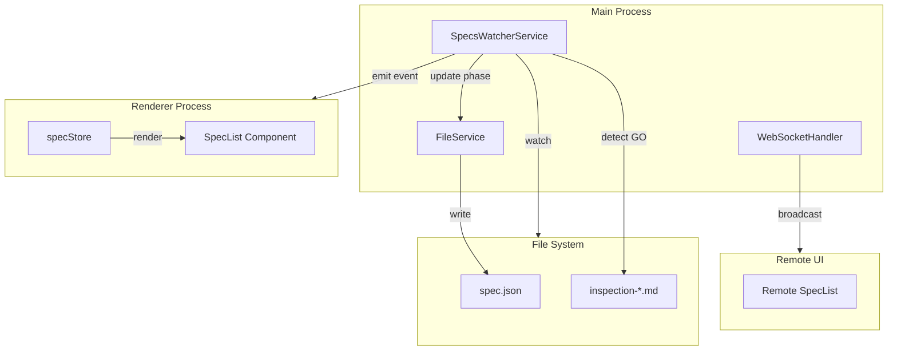
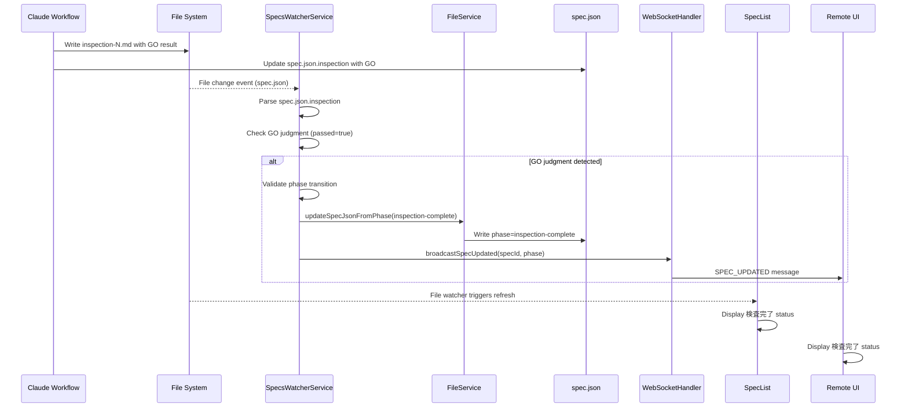
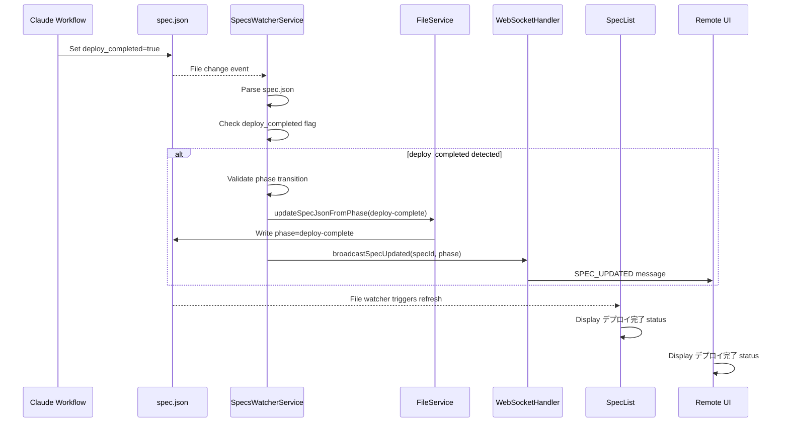
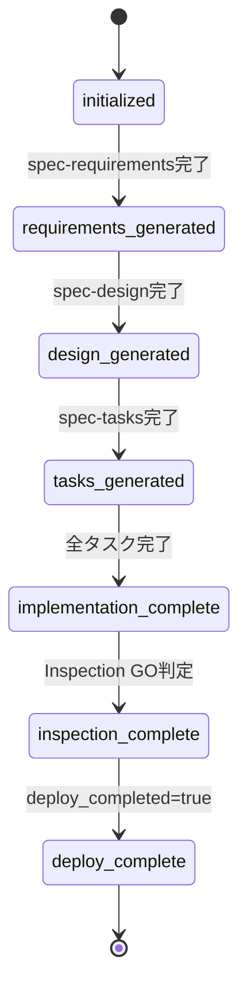

# Design Document

## Overview

**Purpose**: この機能は、InspectionがGO判定で完了した際、およびデプロイ完了時に、spec.json.phaseを自動更新し、SpecListに「検査完了」「デプロイ完了」ステータスを表示する機能を提供する。

**Users**: SDD Orchestratorを使用する開発者が、SDDワークフローの終盤フェーズ（検査・デプロイ）の進捗を視覚的に把握できる。

**Impact**: 既存のSpecPhase型を拡張し、specsWatcherServiceにInspection結果とデプロイ完了の検出ロジックを追加する。Remote UIへのプッシュ通知も実装する。

### Goals

- SpecPhase型に`inspection-complete`と`deploy-complete`を追加し、型安全なphase管理を実現
- InspectionのGO判定検出時にspec.json.phaseを`inspection-complete`に自動更新
- デプロイ完了時にspec.json.phaseを`deploy-complete`に自動更新
- SpecListとRemote UIで新しいステータスを視覚的に表示

### Non-Goals

- Inspectionの実行ロジックの変更（既存のInspectionPanelの動作は変更しない）
- デプロイの実行ロジックの実装（`deploy_completed`マーカーの設定はスコープ外）
- Remote UIからのphase変更操作（表示のみ）
- inspection-*.mdファイルの内容解析ロジックの大幅な変更

## Architecture

### Existing Architecture Analysis

**現在のアーキテクチャパターン**:
- **ファイル監視パターン**: `specsWatcherService`がchokidarを使用して`.kiro/specs`を監視し、ファイル変更イベントをデバウンスしてコールバックを呼び出す
- **phase更新パターン**: `fileService.updateSpecJsonFromPhase`が既存のphase遷移ロジックを持つ
- **WebSocket通知パターン**: `webSocketHandler.broadcastSpecUpdated`でRemote UIへのphase変更通知が可能
- **inspection状態管理**: `MultiRoundInspectionState`構造で複数ラウンドのGO/NOGO結果を管理

**技術的制約**:
- spec.jsonはSpecPhase型に基づくphaseフィールドを持つ
- inspectionの結果は`inspection-*.md`ファイルと`spec.json.inspection`フィールドに保存
- ファイル監視のデバウンスは300msに設定済み

### Architecture Pattern & Boundary Map



**Architecture Integration**:
- 選択パターン: 既存のファイル監視パターンを拡張
- 責務分離: specsWatcherServiceがInspection結果検出を担当、fileServiceがphase更新を担当
- 既存パターン維持: tasks.md完了検出と同様のパターンを踏襲
- ステアリング準拠: 既存のphase遷移ロジックとの整合性を維持

### Technology Stack

| Layer | Choice / Version | Role in Feature | Notes |
|-------|------------------|-----------------|-------|
| Backend / Services | Node.js (Electron 35) | ファイル監視とphase更新 | 既存のspecsWatcherService拡張 |
| Data / Storage | spec.json | phase状態永続化 | SpecPhase型を拡張 |
| Messaging / Events | WebSocket (ws) | Remote UIへの通知 | 既存のbroadcastSpecUpdatedを活用 |
| Frontend | React + TypeScript | SpecListのステータス表示 | PHASE_LABELSの拡張 |

## System Flows

### InspectionGO判定検出フロー



**Key Decisions**:
- Inspection結果はspec.json.inspection.roundDetailsの最新ラウンドの`passed`フラグで判定
- phase更新はspec.jsonの更新検出時にトリガー（inspection-*.mdの直接監視ではなく）
- Remote UIへの通知は既存のbroadcastSpecUpdatedを活用

### デプロイ完了検出フロー



## Requirements Traceability

| Requirement | Summary | Components | Interfaces | Flows |
|-------------|---------|------------|------------|-------|
| 1.1, 1.2, 1.3 | SpecPhase型拡張 | SpecPhaseType | SpecPhase | - |
| 2.1, 2.2, 2.3, 2.4 | Inspection GO判定検出・更新 | SpecsWatcherService, FileService | updateSpecJsonFromPhase | InspectionGO判定検出フロー |
| 3.1, 3.2, 3.3 | デプロイ完了検出・更新 | SpecsWatcherService, FileService | updateSpecJsonFromPhase | デプロイ完了検出フロー |
| 4.1, 4.2, 4.3, 4.4 | SpecListステータス表示 | SpecList, PHASE_LABELS, PHASE_COLORS | - | - |
| 5.1, 5.2, 5.3, 5.4, 5.5 | Remote UIプッシュ通知 | WebSocketHandler | broadcastSpecUpdated | WebSocket通知 |
| 6.1, 6.2, 6.3, 6.4, 6.5 | specsWatcherService拡張 | SpecsWatcherService | checkInspectionCompletion, checkDeployCompletion | ファイル監視 |
| 7.1, 7.2, 7.3, 7.4 | ワークフロー整合性 | SpecsWatcherService, FileService | validatePhaseTransition | 遷移バリデーション |

## Components and Interfaces

| Component | Domain/Layer | Intent | Req Coverage | Key Dependencies | Contracts |
|-----------|--------------|--------|--------------|------------------|-----------|
| SpecPhaseType | Types | phase値の型定義拡張 | 1.1, 1.2, 1.3 | - | - |
| SpecsWatcherService | Main/Services | Inspection/デプロイ検出 | 2.1-2.4, 3.1-3.3, 6.1-6.5 | FileService (P0), WebSocketHandler (P1) | Service |
| FileService | Main/Services | phase更新ロジック拡張 | 2.1, 3.1 | - | Service |
| SpecList | Renderer/Components | ステータス表示 | 4.1-4.4 | specStore (P0) | - |
| WebSocketHandler | Main/Services | Remote UI通知 | 5.1-5.5 | - | Event |

### Main Process / Services

#### SpecsWatcherService

| Field | Detail |
|-------|--------|
| Intent | Inspection GO判定とデプロイ完了を検出し、spec.json.phaseを自動更新する |
| Requirements | 2.1, 2.2, 2.3, 2.4, 3.1, 3.2, 3.3, 6.1, 6.2, 6.3, 6.4, 6.5, 7.1, 7.2, 7.3, 7.4 |

**Responsibilities & Constraints**
- spec.json変更時にInspection結果（GO判定）を解析
- `deploy_completed`フラグの検出
- 有効なphase遷移のバリデーション（implementation-complete → inspection-complete → deploy-complete）
- 検出から2秒以内の更新（既存のデバウンス設定を維持）

**Dependencies**
- Outbound: FileService — spec.json更新 (P0)
- Outbound: WebSocketHandler — Remote UI通知 (P1)
- External: chokidar — ファイル監視 (P0)

**Contracts**: Service [x]

##### Service Interface

```typescript
interface SpecsWatcherService {
  // 既存メソッド（変更なし）
  start(): void;
  stop(): Promise<void>;
  onChange(callback: SpecsChangeCallback): void;
  clearCallbacks(): void;
  isRunning(): boolean;

  // 内部メソッド（新規追加）
  private checkInspectionCompletion(specPath: string, specId: string): Promise<void>;
  private checkDeployCompletion(specPath: string, specId: string): Promise<void>;
  private validatePhaseTransition(currentPhase: SpecPhase, targetPhase: SpecPhase): boolean;
  private notifyPhaseChange(specId: string, newPhase: SpecPhase): void;
}
```

**Preconditions**:
- spec.jsonが有効なJSON形式であること
- inspectionフィールドがMultiRoundInspectionState構造に準拠していること

**Postconditions**:
- GO判定検出時: spec.json.phase === 'inspection-complete'
- デプロイ完了検出時: spec.json.phase === 'deploy-complete'
- WebSocket経由でRemote UIに通知が送信される

**Invariants**:
- phase遷移は常に順序を遵守（inspection-complete は implementation-complete 以降のみ）

**Implementation Notes**
- Integration: 既存のhandleEvent内でspec.json変更を検出し、checkInspectionCompletionとcheckDeployCompletionを呼び出す
- Validation: phase遷移前にvalidatePhaseTransitionを呼び出し、無効な遷移は拒否
- Risks: inspection結果の解析失敗時はエラーログを出力し、phase更新をスキップ

#### FileService

| Field | Detail |
|-------|--------|
| Intent | spec.json.phaseの更新ロジックを拡張し、新しいphase値をサポート |
| Requirements | 2.1, 3.1 |

**Responsibilities & Constraints**
- `updateSpecJsonFromPhase`メソッドに`inspection-complete`と`deploy-complete`のケースを追加
- 既存のphase遷移ロジックとの整合性を維持

**Dependencies**
- External: fs/promises — ファイル読み書き (P0)

**Contracts**: Service [x]

##### Service Interface

```typescript
type CompletedPhase =
  | 'requirements'
  | 'design'
  | 'tasks'
  | 'impl'
  | 'impl-complete'
  | 'inspection-complete'  // 新規追加
  | 'deploy-complete';     // 新規追加

interface FileService {
  updateSpecJsonFromPhase(
    specPath: string,
    completedPhase: CompletedPhase,
    options?: { skipTimestamp?: boolean }
  ): Promise<Result<void, FileError>>;
}
```

**Implementation Notes**
- Integration: switch文に`inspection-complete`と`deploy-complete`のケースを追加
- Validation: phaseフィールドの更新のみ、approvals構造は変更しない

### Renderer / Components

#### SpecList

| Field | Detail |
|-------|--------|
| Intent | inspection-completeとdeploy-completeのステータスをSpecリストに表示 |
| Requirements | 4.1, 4.2, 4.3, 4.4 |

**Responsibilities & Constraints**
- PHASE_LABELSに「検査完了」「デプロイ完了」を追加
- PHASE_COLORSに視覚的に区別できる色を設定
- ファイル監視によるリアクティブな更新

**Dependencies**
- Inbound: specStore — Specリスト取得 (P0)

**Implementation Notes**
- Integration: 定数オブジェクトの拡張のみ、コンポーネントロジックの変更は不要
- Validation: 既存のフォールバック処理（PHASE_LABELS[phase] ?? phase）で未知のphaseにも対応済み

### Types

#### SpecPhaseType

| Field | Detail |
|-------|--------|
| Intent | SpecPhase型にinspection-completeとdeploy-completeを追加 |
| Requirements | 1.1, 1.2, 1.3 |

**Contracts**: State [x]

##### State Management

```typescript
// renderer/types/index.ts
export type SpecPhase =
  | 'initialized'
  | 'requirements-generated'
  | 'design-generated'
  | 'tasks-generated'
  | 'implementation-complete'
  | 'inspection-complete'   // 新規追加
  | 'deploy-complete';      // 新規追加
```

**Implementation Notes**
- Validation: spec.json読み込み時、拡張されたSpecPhase型に対してバリデーションを実行
- Risks: 後方互換性を維持するため、既存のphase値は変更しない

## Data Models

### Domain Model

**SpecPhase遷移モデル**:



**Aggregates**:
- Spec: spec.jsonを持つ単一の集約ルート
- phase: Specの現在のワークフロー状態

**Invariants**:
- phaseは常に定義された遷移順序に従う
- inspection-completeへの遷移はimplementation-complete以降のみ
- deploy-completeへの遷移はinspection-complete以降のみ

### Logical Data Model

**spec.json構造（拡張後）**:

```typescript
interface SpecJson {
  feature_name: string;
  created_at: string;
  updated_at: string;
  language: 'ja' | 'en';
  phase: SpecPhase;  // 'inspection-complete' | 'deploy-complete' を追加
  approvals: ApprovalStatus;
  documentReview?: DocumentReviewState;
  autoExecution?: SpecAutoExecutionState;
  inspection?: MultiRoundInspectionState | LegacyInspectionState;
  deploy_completed?: boolean;  // 既存フィールド
}
```

**Consistency**:
- phaseフィールドはSpec内で一意に管理
- inspection.roundDetails[n].passedがtrueでphase='inspection-complete'
- deploy_completed=trueでphase='deploy-complete'

## Error Handling

### Error Strategy

ファイル監視とphase更新において発生しうるエラーを適切に処理し、ワークフローの整合性を維持する。

### Error Categories and Responses

**System Errors (File I/O)**:
- spec.json読み込み失敗 → エラーログ出力、phase更新スキップ
- spec.json書き込み失敗 → エラーログ出力、Result.errorを返却
- inspection解析失敗 → エラーログ出力、phase更新スキップ

**Business Logic Errors**:
- 無効なphase遷移試行 → 警告ログ出力、遷移を拒否
  - 例: requirements-generated → inspection-complete は不可

**Recovery Strategy**:
- 一時的なファイルロック → 次回の監視イベントで再試行
- 不正なJSON → phase更新をスキップし、手動修正を待つ

### Monitoring

- エラー発生時はlogger.error()で記録
- phase更新成功時はlogger.info()で記録
- 無効な遷移試行はlogger.warn()で記録

## Testing Strategy

### Unit Tests

1. **SpecPhase型の拡張**
   - inspection-completeとdeploy-completeが有効な値として認識される

2. **validatePhaseTransition**
   - implementation-complete → inspection-complete: 許可
   - inspection-complete → deploy-complete: 許可
   - requirements-generated → inspection-complete: 拒否
   - design-generated → deploy-complete: 拒否

3. **checkInspectionCompletion**
   - GO判定（passed=true）検出時にphaseが更新される
   - NO-GO判定（passed=false）時はphaseが更新されない
   - inspection未完了時はphaseが更新されない

4. **checkDeployCompletion**
   - deploy_completed=true検出時にphaseが更新される
   - deploy_completed=false/未定義時はphaseが更新されない

5. **PHASE_LABELS/PHASE_COLORS**
   - inspection-completeに「検査完了」がマッピングされる
   - deploy-completeに「デプロイ完了」がマッピングされる

### Integration Tests

1. **specsWatcherService + fileService**
   - spec.json変更イベント → GO判定解析 → phase更新の一連フロー
   - spec.json変更イベント → deploy_completed検出 → phase更新の一連フロー

2. **WebSocket通知**
   - phase更新時にRemote UIへSPEC_UPDATEDメッセージが送信される
   - メッセージに正しいspecIdとphaseが含まれる

3. **SpecList表示**
   - inspection-completeのSpecが「検査完了」と表示される
   - deploy-completeのSpecが「デプロイ完了」と表示される
   - phase変更時に手動リフレッシュなしで表示が更新される

### E2E Tests

1. **InspectionGO → SpecList更新**
   - InspectionがGO判定で完了 → SpecListに「検査完了」表示

2. **デプロイ完了 → SpecList更新**
   - deploy_completed設定 → SpecListに「デプロイ完了」表示

3. **Remote UI同期**
   - Desktop UIでのphase変更がRemote UIにリアルタイム反映

## Optional Sections

### Performance & Scalability

**Target Metrics**:
- ファイル変更検出から2秒以内にphase更新完了（要件6.4）
- WebSocket通知の遅延は100ms以内

**Optimization**:
- 既存のデバウンス設定（300ms）を維持
- spec.json解析は必要なフィールドのみ読み取り
