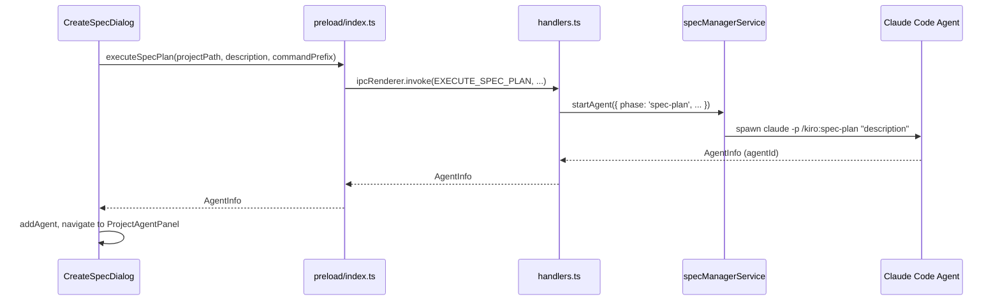
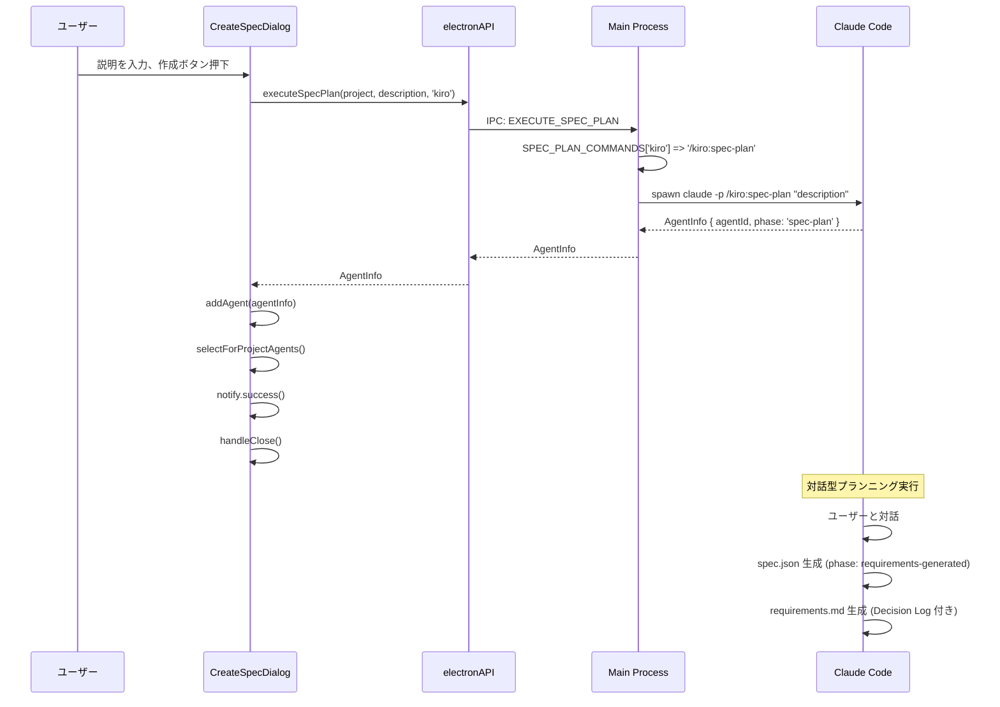
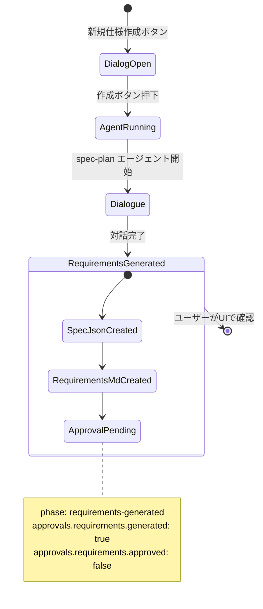

# Design: spec-plan UI Integration

## Overview

**Purpose**: SDD Orchestrator の「新規仕様作成」ダイアログ (CreateSpecDialog) から対話型の `spec-plan` コマンドを起動できるようにし、ユーザーとAIの対話を通じて直接 requirements.md を生成するワークフローを実現する。

**Users**: SDD Orchestrator を使用する開発者。UIから新規仕様を作成する際に、従来の `spec-init` による一方的な記述ではなく、AIとの対話型プランニングを行う。

**Impact**: 既存の `executeSpecInit` IPC API は後方互換性のため維持しつつ、新たに `executeSpecPlan` API を追加。CreateSpecDialog のデフォルト動作を `spec-plan` に変更する。

### Goals

- CreateSpecDialog から `spec-plan` コマンドを起動できるようにする
- 既存の IPC/Preload パターンに従い、`executeSpecPlan` API を追加する
- コマンドセットテンプレートに `spec-plan.md` を追加し、インストール可能にする
- spec-plan 完了後、requirements 承認待ち状態でワークフローに渡す

### Non-Goals

- `spec-manager:plan` コマンドの追加（将来的に検討）
- CreateSpecDialog でのモード切替 UI（spec-init vs spec-plan の選択）
- `executeSpecInit` API の削除
- Remote UI への対応

## Architecture

### Existing Architecture Analysis

現行の `executeSpecInit` 実装パターンを踏襲する。以下が既存パターン:

1. **channels.ts**: `EXECUTE_SPEC_INIT` チャンネル定義
2. **handlers.ts**: `ipcMain.handle` によるハンドラ登録、`specManagerService.startAgent()` 呼び出し
3. **preload/index.ts**: `ipcRenderer.invoke` ラッパー関数
4. **electron.d.ts**: TypeScript 型定義
5. **specManagerService.ts**: `SPEC_INIT_COMMANDS` マッピング、`PHASE_ALLOWED_TOOLS` 定義

この機能は同一パターンで `spec-plan` 用の追加レイヤーを作成する。

### Architecture Pattern & Boundary Map



**Architecture Integration**:
- **Selected pattern**: 既存の IPC ハンドラパターン（EXECUTE_SPEC_INIT と同形式）
- **Domain/feature boundaries**: IPC Layer、Preload Layer、Service Layer の責務分離を維持
- **Existing patterns preserved**: `startAgent` API、`PHASE_ALLOWED_TOOLS` マッピング、コマンドプレフィックス切替
- **New components rationale**: `executeSpecPlan` は `spec-plan` の実行内容を明示するため新規追加。API名と実行内容の一致により混乱を防ぐ
- **Steering compliance**: 既存アーキテクチャパターンの踏襲、最小限の変更による目的達成

### Technology Stack

| Layer | Choice / Version | Role in Feature | Notes |
|-------|------------------|-----------------|-------|
| Frontend | React 19 + TypeScript | CreateSpecDialog 変更 | executeSpecPlan 呼び出し |
| IPC | Electron 35 contextBridge | executeSpecPlan チャンネル追加 | channels.ts, handlers.ts |
| Backend | Node.js 20+ | specManagerService 拡張 | SPEC_PLAN_COMMANDS 追加 |
| Testing | Vitest | テスト更新 | CreateSpecDialog.test.tsx |

## System Flows

### spec-plan 実行フロー



### spec-plan 完了後の状態遷移



## Requirements Traceability

| Requirement | Summary | Components | Interfaces | Flows |
|-------------|---------|------------|------------|-------|
| 1 | Backend コマンドマッピング | specManagerService | SPEC_PLAN_COMMANDS, PHASE_ALLOWED_TOOLS | - |
| 2 | IPC Layer executeSpecPlan | handlers.ts | EXECUTE_SPEC_PLAN handler | spec-plan実行フロー |
| 3 | Preload API | preload/index.ts, electron.d.ts | executeSpecPlan() | - |
| 4 | CreateSpecDialog 変更 | CreateSpecDialog.tsx | handleCreate() | spec-plan実行フロー |
| 5 | コマンドセットテンプレート | resources/templates/commands/ | spec-plan.md | - |
| 6 | テスト更新 | CreateSpecDialog.test.tsx | - | - |
| 7 | 完了後の状態管理 | spec-plan.md (command) | spec.json 構造 | 状態遷移フロー |

## Components and Interfaces

| Component | Domain/Layer | Intent | Req Coverage | Key Dependencies | Contracts |
|-----------|--------------|--------|--------------|------------------|-----------|
| specManagerService | Backend/Service | spec-plan コマンドマッピング追加 | 1 | - | Service |
| handlers.ts | IPC/Handler | EXECUTE_SPEC_PLAN ハンドラ追加 | 2 | specManagerService (P0) | API |
| preload/index.ts | Preload | executeSpecPlan 公開 | 3 | IPC_CHANNELS (P0) | API |
| electron.d.ts | Types | 型定義追加 | 3 | - | - |
| CreateSpecDialog | UI/Component | spec-plan 呼び出し | 4 | executeSpecPlan (P0) | - |
| spec-plan.md templates | Templates | コマンドテンプレート | 5 | - | - |
| CreateSpecDialog.test.tsx | Test | テスト更新 | 6 | - | - |

### Backend / Service Layer

#### specManagerService

| Field | Detail |
|-------|--------|
| Intent | spec-plan コマンドのマッピングと allowed-tools 定義を追加 |
| Requirements | 1 |

**Responsibilities & Constraints**
- `SPEC_PLAN_COMMANDS` マッピングを定義（kiro / spec-manager プレフィックス対応）
- `PHASE_ALLOWED_TOOLS` に `spec-plan` エントリを追加
- 既存の `startAgent` API をそのまま利用

**Dependencies**
- Inbound: handlers.ts - EXECUTE_SPEC_PLAN ハンドラから呼び出し (P0)
- External: Claude Code CLI - エージェントプロセス起動 (P0)

**Contracts**: Service [x]

##### Service Interface

```typescript
/** spec-plan コマンドマッピング */
export const SPEC_PLAN_COMMANDS: Record<CommandPrefix, string> = {
  kiro: '/kiro:spec-plan',
  'spec-manager': '/spec-manager:plan', // 将来的に追加予定
};

/** PHASE_ALLOWED_TOOLS への追加 */
const PHASE_ALLOWED_TOOLS: Record<string, string[]> = {
  // ... 既存エントリ ...
  'spec-plan': ['Read', 'Write', 'Glob', 'Grep', 'WebSearch', 'WebFetch', 'Task'],
};
```

**Implementation Notes**
- `spec-manager:plan` は現時点では未実装。将来の拡張に備えてマッピングのみ定義
- `PHASE_ALLOWED_TOOLS` のツールリストは `spec-plan.md` の frontmatter `allowed-tools` と一致させる

---

### IPC Layer

#### channels.ts

| Field | Detail |
|-------|--------|
| Intent | EXECUTE_SPEC_PLAN チャンネル定数を定義 |
| Requirements | 2.1 |

**Contracts**: API [x]

##### API Contract

```typescript
export const IPC_CHANNELS = {
  // ... 既存チャンネル ...
  EXECUTE_SPEC_PLAN: 'ipc:execute-spec-plan',
} as const;
```

---

#### handlers.ts

| Field | Detail |
|-------|--------|
| Intent | EXECUTE_SPEC_PLAN の IPC ハンドラを実装 |
| Requirements | 2.2, 2.3, 2.4 |

**Responsibilities & Constraints**
- `EXECUTE_SPEC_PLAN` チャンネルのハンドラ登録
- `specManagerService.startAgent()` を呼び出し、spec-plan エージェントを起動
- エラー時は descriptive なメッセージで throw

**Dependencies**
- Inbound: preload/index.ts - ipcRenderer.invoke 経由 (P0)
- Outbound: specManagerService - startAgent 呼び出し (P0)

**Contracts**: API [x]

##### API Contract

| Method | Channel | Request | Response | Errors |
|--------|---------|---------|----------|--------|
| handle | ipc:execute-spec-plan | (projectPath: string, description: string, commandPrefix?: CommandPrefix) | AgentInfo | Error with message |

```typescript
// Handler Implementation Pattern
ipcMain.handle(
  IPC_CHANNELS.EXECUTE_SPEC_PLAN,
  async (event, projectPath: string, description: string, commandPrefix: CommandPrefix = 'kiro') => {
    logger.info('[handlers] EXECUTE_SPEC_PLAN called', { projectPath, description, commandPrefix });
    const service = getSpecManagerService();
    const window = BrowserWindow.fromWebContents(event.sender);

    if (window && !eventCallbacksRegistered) {
      registerEventCallbacks(service, window);
    }

    const slashCommand = SPEC_PLAN_COMMANDS[commandPrefix];

    const result = await service.startAgent({
      specId: '', // Global agent
      phase: 'spec-plan',
      command: 'claude',
      args: [`${slashCommand} "${description}"`],
      group: 'doc',
    });

    if (!result.ok) {
      logger.error('[handlers] executeSpecPlan failed', { error: result.error });
      const errorMessage = getErrorMessage(result.error);
      throw new Error(errorMessage);
    }

    logger.info('[handlers] executeSpecPlan succeeded', { agentId: result.value.agentId });
    return result.value;
  }
);
```

**Implementation Notes**
- `specId: ''` でグローバルエージェントとして起動
- `group: 'doc'` でドキュメント生成グループに分類
- `SPEC_PLAN_COMMANDS` から適切なスラッシュコマンドを取得

---

### Preload Layer

#### preload/index.ts

| Field | Detail |
|-------|--------|
| Intent | executeSpecPlan を contextBridge 経由で公開 |
| Requirements | 3.1 |

**Contracts**: API [x]

##### API Contract

```typescript
// Preload API
executeSpecPlan: (
  projectPath: string,
  description: string,
  commandPrefix?: 'kiro' | 'spec-manager'
): Promise<AgentInfo> =>
  ipcRenderer.invoke(IPC_CHANNELS.EXECUTE_SPEC_PLAN, projectPath, description, commandPrefix),
```

---

#### electron.d.ts

| Field | Detail |
|-------|--------|
| Intent | executeSpecPlan の TypeScript 型定義 |
| Requirements | 3.2 |

**Contracts**: API [x]

##### API Contract

```typescript
interface ElectronAPI {
  // ... 既存定義 ...

  /**
   * Execute spec-plan agent for interactive requirements generation
   * @param projectPath Project root path
   * @param description Initial idea/description for planning dialogue
   * @param commandPrefix Command prefix ('kiro' or 'spec-manager')
   * @returns AgentInfo on success
   */
  executeSpecPlan(
    projectPath: string,
    description: string,
    commandPrefix?: 'kiro' | 'spec-manager'
  ): Promise<AgentInfo>;
}
```

---

### UI Layer

#### CreateSpecDialog

| Field | Detail |
|-------|--------|
| Intent | 作成ボタン押下時に executeSpecPlan を呼び出す |
| Requirements | 4.1, 4.2, 4.3, 4.4 |

**Responsibilities & Constraints**
- `handleCreate` で `executeSpecInit` の代わりに `executeSpecPlan` を呼び出す
- 成功時は `addAgent`, `selectForProjectAgents`, `selectAgent` を呼び出し、ProjectAgentPanel に遷移
- エラー時はエラーメッセージを表示

**Dependencies**
- Outbound: window.electronAPI.executeSpecPlan (P0)
- Outbound: useAgentStore (P1)
- Outbound: useWorkflowStore.commandPrefix (P1)

**Contracts**: State [x]

##### State Management

```typescript
// 変更箇所: handleCreate 内
const handleCreate = async () => {
  if (!currentProject) return;

  const trimmed = description.trim();
  if (!trimmed) {
    setError('説明を入力してください');
    return;
  }

  setIsCreating(true);
  setError(null);

  try {
    // 変更: executeSpecInit -> executeSpecPlan
    const agentInfo = await window.electronAPI.executeSpecPlan(currentProject, trimmed, commandPrefix);

    addAgent('', agentInfo);
    selectForProjectAgents();
    selectAgent(agentInfo.agentId);

    notify.success('対話型プランニングを開始しました（プロジェクトAgentパネルで進捗を確認できます）');
    handleClose();
  } catch (err) {
    setError(err instanceof Error ? err.message : '仕様の作成に失敗しました');
    setIsCreating(false);
  }
};
```

**Implementation Notes**
- 成功メッセージを「仕様作成を開始しました」から「対話型プランニングを開始しました」に変更
- エラーハンドリングは既存パターンを維持

---

### Templates

#### spec-plan.md (cc-sdd)

| Field | Detail |
|-------|--------|
| Intent | cc-sdd プロファイル用の spec-plan コマンドテンプレート |
| Requirements | 5.1 |

**Responsibilities & Constraints**
- 既存の `.claude/commands/kiro/spec-plan.md` をテンプレートとして配置
- インストーラーで `resources/templates/commands/cc-sdd/spec-plan.md` にコピー

**Implementation Notes**
- 既存の `spec-plan.md` コマンド定義をそのまま利用
- `allowed-tools`: `Read, Write, Glob, Grep, WebSearch, WebFetch, Task`
- cc-sdd-agent 用は cc-sdd と同一ファイルを使用（Task ツールで委譲するため別バージョン不要）

---

### Test Layer

#### CreateSpecDialog.test.tsx

| Field | Detail |
|-------|--------|
| Intent | executeSpecPlan への変更をテスト |
| Requirements | 6.1, 6.2 |

**Responsibilities & Constraints**
- `executeSpecInit` のモックを `executeSpecPlan` に変更
- 呼び出し引数の検証を更新

**Implementation Notes**
- テスト内のすべての `executeSpecInit` 参照を `executeSpecPlan` に置換
- テストの構造・ロジックは維持

## Data Models

### spec.json (spec-plan 完了後)

```json
{
  "feature_name": "{feature-name}",
  "created_at": "{ISO-8601}",
  "updated_at": "{ISO-8601}",
  "language": "ja",
  "phase": "requirements-generated",
  "approvals": {
    "requirements": {
      "generated": true,
      "approved": false
    },
    "design": {
      "generated": false,
      "approved": false
    },
    "tasks": {
      "generated": false,
      "approved": false
    }
  }
}
```

**Invariants**:
- `phase` は `"requirements-generated"` に設定
- `approvals.requirements.generated` は `true`
- `approvals.requirements.approved` は `false`（ユーザー承認待ち）

### requirements.md (spec-plan 生成)

Decision Log セクションを含む requirements.md:

```markdown
# Requirements: {Feature Name}

## Decision Log

### {Decision Topic 1}
- **Discussion**: {議論内容}
- **Conclusion**: {結論}
- **Rationale**: {理由}

## Introduction
...

## Requirements
...

## Out of Scope
...

## Open Questions
...
```

## Error Handling

### Error Categories and Responses

**User Errors (4xx)**:
- 説明が空 -> フィールドバリデーションエラー表示
- プロジェクト未選択 -> 作成ボタン無効化（currentProject が null の場合）

**System Errors (5xx)**:
- Claude Code 起動失敗 -> IPC エラーをダイアログに表示
- spec-plan コマンド実行失敗 -> エージェントログで確認可能

### Monitoring

- `logger.info('[handlers] EXECUTE_SPEC_PLAN called', ...)` でリクエストログ
- `logger.error('[handlers] executeSpecPlan failed', ...)` でエラーログ

## Testing Strategy

### Unit Tests

1. **specManagerService**
   - `SPEC_PLAN_COMMANDS` マッピングの存在確認
   - `getAllowedToolsForPhase('spec-plan')` が正しいツールリストを返す

2. **handlers.ts** (統合テスト相当)
   - `EXECUTE_SPEC_PLAN` ハンドラが `startAgent` を正しく呼び出す

3. **preload/index.ts**
   - `executeSpecPlan` が `EXECUTE_SPEC_PLAN` チャンネルを invoke する

### Integration Tests

1. **CreateSpecDialog -> IPC -> Service**
   - CreateSpecDialog から executeSpecPlan 呼び出し、AgentInfo 返却まで

### E2E Tests (if applicable)

1. **新規仕様作成フロー**
   - CreateSpecDialog を開く -> 説明入力 -> 作成ボタン押下 -> ProjectAgentPanel に遷移

## Design Decisions

### DD-001: executeSpecPlan を新規 API として追加

| Field | Detail |
|-------|--------|
| Status | Accepted |
| Context | 既存の `executeSpecInit` を拡張するか、新規 API を追加するか |
| Decision | `executeSpecPlan` を新規 API として追加。`executeSpecInit` は維持 |
| Rationale | API 名と実行内容の一致により、AI や開発者の混乱を防ぐ。後方互換性も維持 |
| Alternatives Considered | (A) executeSpecInit をリネーム -> 後方互換性破壊、(B) executeSpecInit のオプションで切替 -> API の意味が曖昧に |
| Consequences | IPC チャンネル、ハンドラ、Preload API の追加が必要。ただし既存パターンの踏襲で実装コスト低 |

### DD-002: spec-manager:plan は将来対応

| Field | Detail |
|-------|--------|
| Status | Accepted |
| Context | `commandPrefix: 'spec-manager'` の場合の動作 |
| Decision | 現時点では `/kiro:spec-plan` のみ実装。`spec-manager:plan` は Out of Scope |
| Rationale | 要件定義の Decision Log にある通り、最小限の変更で目的を達成する方針。spec-manager プレフィックス用は将来の拡張として検討 |
| Alternatives Considered | (A) 両方同時実装 -> スコープ拡大、(B) spec-manager 時はフォールバックで kiro を使用 -> 混乱の元 |
| Consequences | `commandPrefix: 'spec-manager'` の場合、handlers.ts で明示的なエラー（`Error('spec-manager:plan is not yet implemented')`）を throw する。フォールバックは混乱の元となるため採用しない |
| Error Handling | **明示的エラー方針を採用**: `SPEC_PLAN_COMMANDS['spec-manager']` が undefined の場合、`throw new Error('spec-manager:plan is not yet implemented. Use kiro prefix.')` とする。UI からの呼び出しでは `commandPrefix` はデフォルト `'kiro'` となるため、通常フローでは発生しない |

### DD-003: cc-sdd-agent 用テンプレートは cc-sdd と共有

| Field | Detail |
|-------|--------|
| Status | Accepted |
| Context | cc-sdd-agent プロファイル用に別バージョンの spec-plan.md が必要か |
| Decision | cc-sdd と同一ファイルを共有。cc-sdd-agent 用の別ファイルは作成しない |
| Rationale | spec-plan.md は `Task` ツールを使用してサブエージェントに委譲可能。cc-sdd / cc-sdd-agent の違いは他コマンド（spec-requirements, spec-design 等）での委譲パターンにあり、spec-plan 自体は対話型で Task ツールでの探索を含むため、両プロファイルで同一動作が望ましい |
| Alternatives Considered | (A) cc-sdd-agent 用に別ファイル作成 -> 重複、メンテナンスコスト増 |
| Consequences | `resources/templates/commands/cc-sdd/spec-plan.md` のみ追加。cc-sdd-agent ディレクトリへのコピーは不要 |

### DD-004: CreateSpecDialog のデフォルトを spec-plan に変更

| Field | Detail |
|-------|--------|
| Status | Accepted |
| Context | CreateSpecDialog で spec-init と spec-plan のどちらをデフォルトにするか |
| Decision | デフォルトを spec-plan に変更。モード切替 UI は追加しない |
| Rationale | 要件定義の Decision Log 1 にある通り、対話型プランニングが新しいワークフローの標準。手動で spec-init を使いたい場合は CLI から直接実行可能 |
| Alternatives Considered | (A) モード切替 UI を追加 -> UI 複雑化、ユーザー混乱、(B) spec-init のまま維持 -> 改善効果なし |
| Consequences | 既存ユーザーの操作体験が変化。成功メッセージ等で新しいフローであることを明示 |
