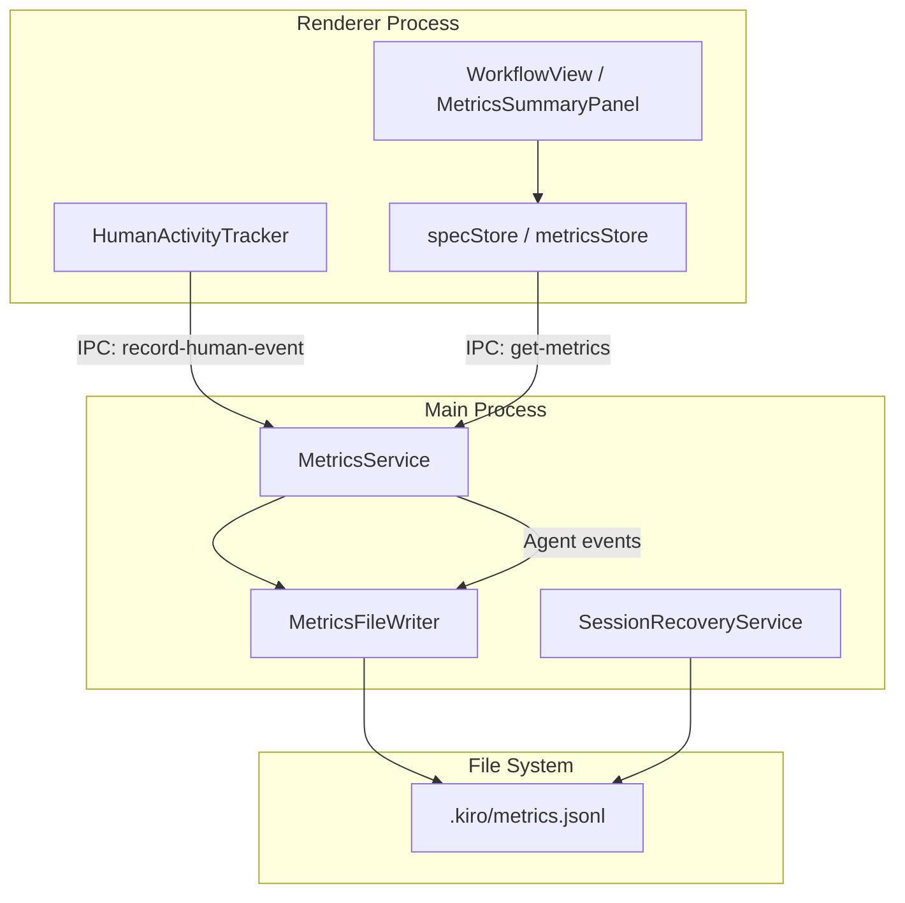
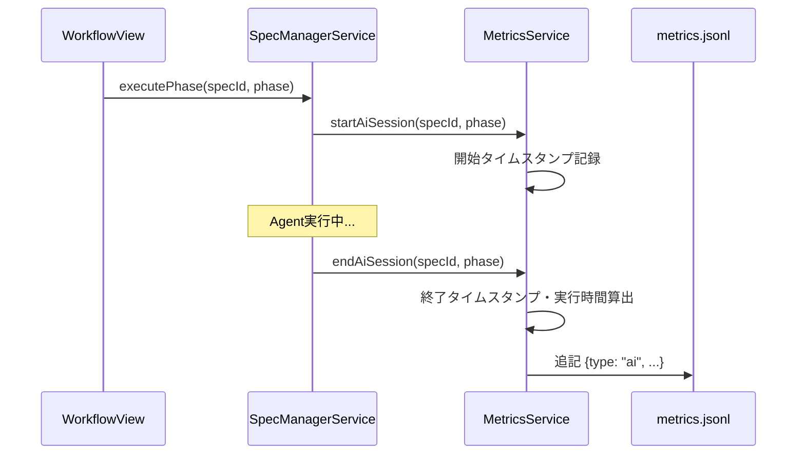
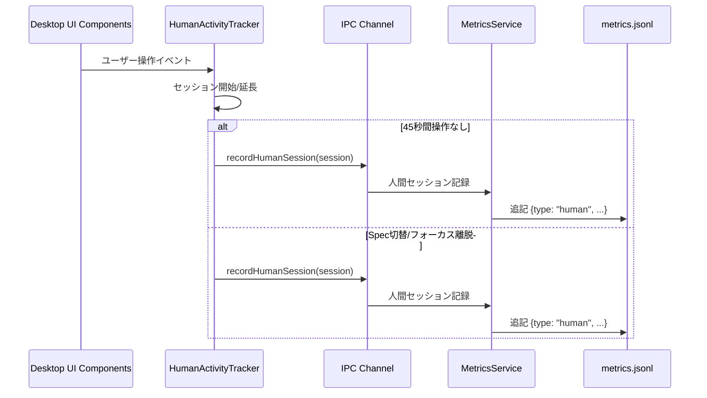
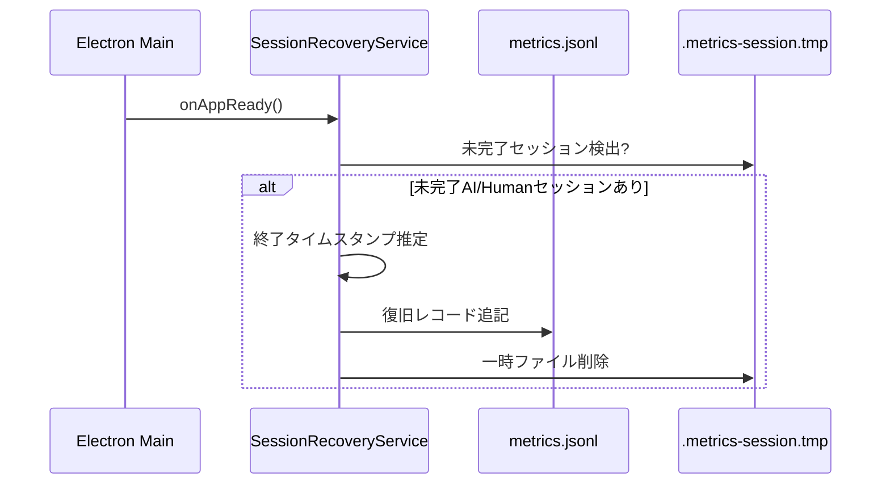

# 技術設計書: Spec生産性メトリクス

## 概要

**目的**: この機能は、SDDワークフローの効率を定量的に把握するための生産性指標を提供する。
**ユーザー**: 開発者がSpec実行時間の内訳（AI実行時間、人間消費時間、総所要時間）を確認し、ワークフローの改善点を特定するために使用する。
**影響**: 既存のSpec管理システムに計測機能を追加し、Desktop UIにメトリクスサマリーパネルを追加する。

### 目標

- AI実行時間（Agent開始/終了、フェーズ別）を自動計測
- 人間消費時間（操作イベント、45秒タイムアウト、セッション管理）を計測
- 総所要時間（spec-init〜implementation-complete）を算出
- Desktop UIでメトリクスを可視化
- メトリクスデータの整合性を保証（未完了セッション復旧）

### 非目標

- Remote UI対応（将来スコープ）
- Deploymentコマンドのメトリクス計測（別Specで対応）
- リアルタイムダッシュボード（初期スコープ外）
- メトリクスデータの外部エクスポート機能

### 将来拡張ポイント（Remote UI対応時）

Remote UI対応時に考慮すべき拡張ポイント：
- **IPC → WebSocket**: `RECORD_HUMAN_SESSION`, `GET_SPEC_METRICS`等のIPCチャンネルをWebSocket経由で呼び出し可能にする
- **HumanActivityTracker**: Remote UI側にも同等のトラッカーを実装し、WebSocket経由でセッションを送信
- **リアルタイム更新**: `METRICS_UPDATED`イベントをRemote UIクライアントにブロードキャスト
- **認証考慮**: Remote UIからのメトリクス取得には認証を要求

## アーキテクチャ

### 既存アーキテクチャ分析

現行システムの関連コンポーネント:
- **AgentProcess**: Agent実行ライフサイクル管理（開始/終了イベント発火可能）
- **SpecManagerService**: フェーズ実行管理（フェーズ開始/終了フック追加可能）
- **specStore（Zustand）**: Spec状態管理（メトリクスruntime状態を追加可能）
- **WorkflowView**: ワークフローUI（メトリクス表示領域を追加可能）
- **IPC Channels**: Main/Renderer間通信（メトリクスIPC追加可能）

### アーキテクチャパターン & 境界マップ



**アーキテクチャ統合**:
- 選択パターン: イベント駆動型（Agent/UIイベントをメトリクスに変換）
- ドメイン境界: メトリクスは独立したドメインとして分離し、既存のSpec管理と疎結合
- 既存パターン準拠: Zustand Store、IPCハンドラ、Service層パターンを踏襲
- Steering準拠: DRY（共通時間計算ロジック）、SSOT（metrics.jsonlを単一ソース）

### 技術スタック

| レイヤー | 選択 / バージョン | 機能での役割 | 備考 |
|---------|------------------|--------------|------|
| Frontend | React 19 + TypeScript | メトリクス表示UI | 既存スタック |
| 状態管理 | Zustand | メトリクスruntime状態 | 既存パターン |
| Backend | Node.js (Electron 35) | メトリクス計測・永続化 | 既存スタック |
| Storage | JSONL (ファイルシステム) | メトリクスデータ永続化 | 追記形式 |

## システムフロー

### AI実行時間計測フロー



### 人間消費時間計測フロー



### 未完了セッション復旧フロー



## 要件トレーサビリティ

| 要件 | 概要 | コンポーネント | インターフェース | フロー |
|------|------|----------------|------------------|--------|
| 1.1 | Agent開始タイムスタンプ記録 | MetricsService | startAiSession | AI実行時間計測 |
| 1.2 | Agent終了タイムスタンプ・実行時間算出 | MetricsService | endAiSession | AI実行時間計測 |
| 1.3 | spec/phase情報を含めて記録 | MetricsService | AiMetricRecord | AI実行時間計測 |
| 1.4 | metrics.jsonlへの追記保存 | MetricsFileWriter | appendRecord | 全フロー |
| 2.1-2.7 | 操作イベント記録 | HumanActivityTracker | recordActivity | 人間消費時間計測 |
| 2.8 | 45秒以内をアクティブ計上 | HumanActivityTracker | IDLE_TIMEOUT | 人間消費時間計測 |
| 2.9 | 45秒タイムアウトでセッション終了 | HumanActivityTracker | handleTimeout | 人間消費時間計測 |
| 2.10 | Spec切替でセッション終了 | HumanActivityTracker | handleSpecChange | 人間消費時間計測 |
| 2.11 | フォーカス離脱でセッション終了 | HumanActivityTracker | handleFocusLoss | 人間消費時間計測 |
| 2.12 | 人間消費時間のmetrics.jsonl保存 | MetricsService | recordHumanSession | 人間消費時間計測 |
| 3.1 | spec-init開始タイムスタンプ | MetricsService | startSpecLifecycle | 総所要時間計測 |
| 3.2 | implementation-complete終了タイムスタンプ | MetricsService | completeSpecLifecycle | 総所要時間計測 |
| 3.3 | 総所要時間のmetrics.jsonl保存 | MetricsFileWriter | appendRecord | 総所要時間計測 |
| 4.1 | metrics.jsonlをSSOT使用 | MetricsFileWriter | FILE_PATH | 全フロー |
| 4.2 | 1行JSON形式で追記 | MetricsFileWriter | appendRecord | 全フロー |
| 4.3-4.4 | AI/人間時間の記録形式 | MetricRecord | type定義 | 全フロー |
| 4.5 | ISO8601タイムスタンプ | MetricRecord | start/end | 全フロー |
| 4.6 | ミリ秒単位経過時間 | MetricRecord | ms | 全フロー |
| 5.1-5.6 | メトリクスサマリー表示 | MetricsSummaryPanel | UI Props | 表示フロー |
| 6.1-6.4 | フェーズ別メトリクス表示 | PhaseMetricsView | UI Props | 表示フロー |
| 7.1 | 未完了セッション検出 | SessionRecoveryService | detectIncompleteSessions | 復旧フロー |
| 7.2 | 未完了AIセッション復旧 | SessionRecoveryService | recoverAiSession | 復旧フロー |
| 7.3 | 未完了人間セッション復旧 | SessionRecoveryService | recoverHumanSession | 復旧フロー |
| 7.4 | 不正JSONL エントリスキップ | MetricsFileReader | parseWithRecovery | 読み込みフロー |
| 8.1-8.3 | プロジェクト横断メトリクス | ProjectMetricsAggregator | aggregateAll | 集計フロー（オプショナル） |

## コンポーネントとインターフェース

### コンポーネントサマリー

| コンポーネント | ドメイン/レイヤー | 意図 | 要件カバレッジ | 主要依存関係 (P0/P1) | コントラクト |
|---------------|------------------|------|----------------|---------------------|--------------|
| MetricsService | Main/Service | メトリクス計測のコアロジック | 1.1-1.4, 2.12, 3.1-3.3 | MetricsFileWriter (P0) | Service |
| MetricsFileWriter | Main/Service | JSONL形式でのファイル書き込み | 4.1-4.6 | fs (P0) | Service |
| MetricsFileReader | Main/Service | JSONL形式でのファイル読み込み | 7.4 | fs (P0) | Service |
| SessionRecoveryService | Main/Service | 未完了セッションの復旧 | 7.1-7.3 | MetricsFileWriter (P0) | Service |
| HumanActivityTracker | Renderer/Service | 人間操作イベントの追跡 | 2.1-2.11 | IPC (P0) | Service |
| metricsStore | Renderer/Store | メトリクスruntime状態 | 5.1-5.6, 6.1-6.4 | specStore (P1) | State |
| MetricsSummaryPanel | Renderer/UI | メトリクスサマリー表示 | 5.1-5.6 | metricsStore (P0) | - |
| PhaseMetricsView | Renderer/UI | フェーズ別メトリクス表示 | 6.1-6.4 | metricsStore (P0) | - |

---

### Main Process

#### MetricsService

| フィールド | 詳細 |
|-----------|------|
| 意図 | AI実行時間、人間消費時間、総所要時間の計測を統括するコアサービス |
| 要件 | 1.1, 1.2, 1.3, 1.4, 2.12, 3.1, 3.2, 3.3 |

**責務 & 制約**
- AI/人間セッションの開始・終了を管理
- 時間計算ロジックの一元化
- MetricsFileWriterへの委譲による永続化

**依存関係**
- Outbound: MetricsFileWriter — メトリクスレコード書き込み (P0)
- Inbound: SpecManagerService — Agent開始/終了イベント (P0)
- Inbound: IPC Handler — 人間セッション記録リクエスト (P0)

**コントラクト**: Service [x]

##### サービスインターフェース

```typescript
interface MetricsService {
  // AI実行時間計測
  startAiSession(specId: string, phase: WorkflowPhase): void;
  endAiSession(specId: string, phase: WorkflowPhase): void;

  // 人間消費時間計測（IPC経由）
  recordHumanSession(session: HumanSessionData): void;

  // 総所要時間計測
  startSpecLifecycle(specId: string): void;
  completeSpecLifecycle(specId: string): void;

  // メトリクス取得
  getMetricsForSpec(specId: string): Promise<SpecMetrics>;
  getProjectMetrics(): Promise<ProjectMetrics>;
}

interface HumanSessionData {
  readonly specId: string;
  readonly start: string;  // ISO8601
  readonly end: string;    // ISO8601
  readonly ms: number;
}
```

- 前提条件: specIdは有効なSpec名であること
- 事後条件: セッション終了時にmetrics.jsonlにレコードが追記される
- 不変条件: 開始されたセッションは必ず終了処理される（復旧サービスによる保証）

**実装ノート**
- 統合: SpecManagerServiceのexecutePhase/stopAgent呼び出しにフックを追加
- バリデーション: specId/phaseの存在確認
- リスク: Agent異常終了時のセッション終了漏れ → SessionRecoveryServiceで対応

---

#### MetricsFileWriter

| フィールド | 詳細 |
|-----------|------|
| 意図 | JSONL形式でメトリクスデータをファイルに追記 |
| 要件 | 4.1, 4.2, 4.3, 4.4, 4.5, 4.6 |

**責務 & 制約**
- `.kiro/metrics.jsonl`への追記専用（読み取りはMetricsFileReaderが担当）
- 1レコード1行のJSONL形式を保証
- ファイルロックによる同時書き込み制御

**依存関係**
- External: fs (Node.js) — ファイル操作 (P0)

**コントラクト**: Service [x]

##### サービスインターフェース

```typescript
interface MetricsFileWriter {
  appendRecord(projectPath: string, record: MetricRecord): Promise<void>;
}

type MetricRecord = AiMetricRecord | HumanMetricRecord | LifecycleMetricRecord;

interface AiMetricRecord {
  readonly type: 'ai';
  readonly spec: string;
  readonly phase: WorkflowPhase;
  readonly start: string;  // ISO8601
  readonly end: string;    // ISO8601
  readonly ms: number;
}

interface HumanMetricRecord {
  readonly type: 'human';
  readonly spec: string;
  readonly start: string;  // ISO8601
  readonly end: string;    // ISO8601
  readonly ms: number;
}

interface LifecycleMetricRecord {
  readonly type: 'lifecycle';
  readonly spec: string;
  readonly event: 'start' | 'complete';
  readonly timestamp: string;  // ISO8601
  readonly totalMs?: number;   // completeの場合のみ
}
```

- 前提条件: projectPathが有効なディレクトリであること
- 事後条件: レコードがmetrics.jsonlに追記される
- 不変条件: ファイル形式はJSONL（1行1JSON）

**実装ノート**
- 統合: 既存のFileServiceパターンに準拠
- バリデーション: Zodによるレコードスキーマ検証
- リスク: ディスク容量不足 → エラーログ記録のみ（機能継続）

---

#### MetricsFileReader

| フィールド | 詳細 |
|-----------|------|
| 意図 | JSONL形式のメトリクスデータを読み込み、集計 |
| 要件 | 7.4 |

**責務 & 制約**
- 不正なJSONLエントリをスキップし、エラーをログ記録
- 有効なレコードのみを返却

**依存関係**
- External: fs (Node.js) — ファイル操作 (P0)

**コントラクト**: Service [x]

##### サービスインターフェース

```typescript
interface MetricsFileReader {
  readAllRecords(projectPath: string): Promise<MetricRecord[]>;
  readRecordsForSpec(projectPath: string, specId: string): Promise<MetricRecord[]>;
}
```

- 前提条件: metrics.jsonlが存在すること（存在しない場合は空配列を返却）
- 事後条件: 有効なレコードのみが返却される
- 不変条件: 不正レコードはスキップされ、処理は継続

**実装ノート**
- バリデーション: 各行をJSON.parseし、失敗時はlogger.warnでログ記録
- リスク: 大容量ファイル → ストリーム読み込み（将来的な最適化）

---

#### SessionRecoveryService

| フィールド | 詳細 |
|-----------|------|
| 意図 | アプリケーション異常終了時の未完了セッション復旧 |
| 要件 | 7.1, 7.2, 7.3 |

**責務 & 制約**
- アプリ起動時に未完了セッションを検出
- AIセッション: アプリ終了時刻を終了タイムスタンプとして使用
- 人間セッション: 最後の操作から45秒後を終了タイムスタンプとして使用

**依存関係**
- Outbound: MetricsFileWriter — 復旧レコード書き込み (P0)
- External: fs — 一時ファイル操作 (P0)

**コントラクト**: Service [x]

##### サービスインターフェース

```typescript
interface SessionRecoveryService {
  recoverIncompleteSessions(projectPath: string): Promise<RecoveryResult>;
}

interface RecoveryResult {
  readonly aiSessionsRecovered: number;
  readonly humanSessionsRecovered: number;
}

// 一時ファイル形式（.kiro/.metrics-session.tmp）
interface SessionTempData {
  readonly activeAiSessions: Array<{
    specId: string;
    phase: WorkflowPhase;
    start: string;
  }>;
  readonly activeHumanSession?: {
    specId: string;
    start: string;
    lastActivity: string;
  };
}
```

- 前提条件: アプリ起動時に呼び出される
- 事後条件: 復旧されたセッションがmetrics.jsonlに記録される
- 不変条件: 一時ファイルは復旧処理後に削除される

**実装ノート**
- 統合: app.on('ready')でrecoverIncompleteSessionsを呼び出し
- バリデーション: 一時ファイルの妥当性検証
- リスク: 一時ファイル破損 → エラーログ記録、ファイル削除

---

### Renderer Process

#### HumanActivityTracker

| フィールド | 詳細 |
|-----------|------|
| 意図 | ユーザーのSpec関連操作を追跡し、人間消費時間を計測 |
| 要件 | 2.1, 2.2, 2.3, 2.4, 2.5, 2.6, 2.7, 2.8, 2.9, 2.10, 2.11 |

**責務 & 制約**
- 操作イベント（クリック、スクロール、選択等）を監視
- 45秒アイドルタイムアウトを管理
- Spec切替・フォーカス離脱時のセッション終了

**依存関係**
- Outbound: IPC (RECORD_HUMAN_SESSION) — セッション記録送信 (P0)
- Inbound: specStore — 現在選択中のSpec (P1)

**コントラクト**: Service [x]

##### サービスインターフェース

```typescript
interface HumanActivityTracker {
  // ライフサイクル
  start(specId: string): void;
  stop(): void;

  // イベントハンドラ（内部使用）
  recordActivity(eventType: ActivityEventType): void;

  // 状態
  readonly isActive: boolean;
  readonly currentSpecId: string | null;
}

type ActivityEventType =
  | 'spec-select'
  | 'artifact-tab-change'
  | 'document-scroll'
  | 'agent-log-scroll'
  | 'agent-log-expand'
  | 'approval-button'
  | 'link-click'
  | 'text-select';

const IDLE_TIMEOUT_MS = 45_000;  // 45秒
```

- 前提条件: Spec選択時に開始される
- 事後条件: セッション終了時にIPCでMain processに送信
- 不変条件: 1つのSpecに対して1つのアクティブセッションのみ

**実装ノート**
- 統合: WorkflowView/DocsTabsなどのコンポーネントにイベントリスナーを追加
- バリデーション: eventTypeの妥当性検証
- リスク: イベント過多 → debounceで最適化（100ms間隔）

---

#### metricsStore (Zustand)

| フィールド | 詳細 |
|-----------|------|
| 意図 | メトリクスのruntime状態とUIへのデータ提供 |
| 要件 | 5.1, 5.2, 5.3, 5.4, 5.5, 5.6, 6.1, 6.2, 6.3, 6.4 |

**責務 & 制約**
- 現在のSpecに対するメトリクスサマリーを保持
- フェーズ別メトリクスを計算
- Main processからのメトリクスデータを受信・更新

**依存関係**
- Inbound: IPC (METRICS_UPDATED) — メトリクス更新通知 (P0)
- Outbound: IPC (GET_METRICS) — メトリクス取得リクエスト (P0)
- Inbound: specStore — 選択中Spec情報 (P1)

**コントラクト**: State [x]

##### 状態管理

```typescript
interface MetricsState {
  // 現在のSpecのメトリクス
  currentMetrics: SpecMetrics | null;

  // 読み込み状態
  isLoading: boolean;
  error: string | null;

  // プロジェクト横断メトリクス（オプショナル）
  projectMetrics: ProjectMetrics | null;
}

interface SpecMetrics {
  readonly specId: string;
  readonly totalAiTimeMs: number;
  readonly totalHumanTimeMs: number;
  readonly totalElapsedMs: number | null;  // lifecycle完了時のみ
  readonly phaseMetrics: PhaseMetricsMap;
  readonly status: SpecMetricsStatus;
}

type PhaseMetricsMap = Record<WorkflowPhase, PhaseMetrics>;

interface PhaseMetrics {
  readonly aiTimeMs: number;
  readonly humanTimeMs: number;
  readonly status: 'pending' | 'in-progress' | 'completed';
}

type SpecMetricsStatus = 'in-progress' | 'completed';

interface MetricsActions {
  loadMetrics(specId: string): Promise<void>;
  loadProjectMetrics(): Promise<void>;
  clearMetrics(): void;
}
```

- 永続化: なし（毎回IPCでMain processから取得）
- 整合性: specStore.selectedSpec変更時に自動リロード

---

#### MetricsSummaryPanel (UI)

| フィールド | 詳細 |
|-----------|------|
| 意図 | Spec詳細画面でメトリクスサマリーを表示 |
| 要件 | 5.1, 5.2, 5.3, 5.4, 5.5, 5.6 |

**責務 & 制約**
- AI実行時間合計、人間消費時間合計、総所要時間を表示
- ユーザーフレンドリーな時間形式（例: "1h 23m", "45m 30s"）
- 完了/進行中のステータス表示

**依存関係**
- Inbound: metricsStore — メトリクスデータ (P0)

**実装ノート**
- 配置: WorkflowView内、フェーズリストの上部
- data-testid: `metrics-summary-panel`, `metrics-ai-time`, `metrics-human-time`, `metrics-total-time`

---

#### PhaseMetricsView (UI)

| フィールド | 詳細 |
|-----------|------|
| 意図 | 各フェーズごとのAI/人間時間を表示 |
| 要件 | 6.1, 6.2, 6.3, 6.4 |

**責務 & 制約**
- requirements, design, tasks, implの各フェーズを個別表示
- 進行状況アイコン（未開始/実行中/完了）
- フェーズ別AI時間・人間時間

**依存関係**
- Inbound: metricsStore — フェーズ別メトリクス (P0)

**実装ノート**
- 配置: PhaseItem内にインライン表示（オプション）、または別タブ
- data-testid: `phase-metrics-{phase}`, `phase-metrics-ai-time`, `phase-metrics-human-time`

---

### IPC Channels

新規IPCチャンネル定義:

```typescript
// channels.ts に追加
export const IPC_CHANNELS = {
  // ... 既存チャンネル ...

  // Metrics (spec-productivity-metrics feature)
  RECORD_HUMAN_SESSION: 'metrics:record-human-session',
  GET_SPEC_METRICS: 'metrics:get-spec-metrics',
  GET_PROJECT_METRICS: 'metrics:get-project-metrics',
  METRICS_UPDATED: 'metrics:updated',
} as const;
```

## データモデル

### ドメインモデル

**集約**: MetricRecord（メトリクスレコード）
- 各計測イベントを表現
- type（ai/human/lifecycle）で種別を区別
- specIdで対象Specを特定

**値オブジェクト**:
- タイムスタンプ（ISO8601形式）
- 経過時間（ミリ秒）

**ドメインイベント**:
- AiSessionStarted
- AiSessionEnded
- HumanSessionRecorded
- SpecLifecycleStarted
- SpecLifecycleCompleted

### 論理データモデル

**メトリクスレコード（JSONL形式）**:

```
{"type":"ai","spec":"my-feature","phase":"requirements","start":"2025-01-15T10:00:00.000Z","end":"2025-01-15T10:05:30.000Z","ms":330000}
{"type":"human","spec":"my-feature","start":"2025-01-15T10:05:30.000Z","end":"2025-01-15T10:08:15.000Z","ms":165000}
{"type":"lifecycle","spec":"my-feature","event":"start","timestamp":"2025-01-15T09:55:00.000Z"}
{"type":"lifecycle","spec":"my-feature","event":"complete","timestamp":"2025-01-15T14:30:00.000Z","totalMs":16500000}
```

**構造定義**:
- ファイルパス: `.kiro/metrics.jsonl`
- 形式: JSON Lines（1行1レコード）
- エンコーディング: UTF-8
- 追記専用（append-only）

### 物理データモデル

**ファイルストレージ**:
- 最大サイズ制限: なし（将来的にローテーション検討）
- バックアップ: なし（.gitignore対象外、バージョン管理可能）

**一時ファイル**:
- パス: `.kiro/.metrics-session.tmp`
- 目的: 未完了セッションの追跡
- ライフサイクル: アプリ起動時に読み込み、復旧後に削除

## エラーハンドリング

### エラー戦略

- **Fail-safe**: メトリクス計測エラーはワークフロー継続を阻害しない
- **Graceful Degradation**: 書き込みエラー時はメモリにバッファリング
- **Observability**: エラーはlogger.warnでログ記録

### エラーカテゴリと対応

**ファイルシステムエラー**:
- 書き込み失敗 → logger.error記録、次の書き込みでリトライ
- 読み込み失敗 → 空のメトリクスを返却、エラーログ

**データ整合性エラー**:
- 不正JSONLエントリ → スキップ、logger.warn記録
- 未完了セッション → SessionRecoveryServiceで復旧

### 監視

- ProjectLogger経由でエラーログを記録
- メトリクス関連ログは`[MetricsService]`プレフィックス

## テスト戦略

### ユニットテスト

- MetricsService: セッション開始/終了、時間計算
- MetricsFileWriter: JSONL形式書き込み
- MetricsFileReader: 不正エントリスキップ
- SessionRecoveryService: 復旧ロジック
- HumanActivityTracker: タイムアウト処理

### 統合テスト

- Main/Renderer間のIPC通信
- ファイル読み書きの整合性
- specStore連携

### E2Eテスト

- メトリクスサマリー表示確認
- フェーズ実行後のメトリクス更新
- Spec切替時のメトリクスリロード

## オプションセクション

### セキュリティ考慮事項

- メトリクスデータにセンシティブ情報は含まない
- ファイルアクセスはElectronのセキュリティモデル（contextIsolation）に準拠

### パフォーマンス & スケーラビリティ

**目標メトリクス**:
- 書き込み遅延: < 10ms
- 読み込み（100レコード）: < 50ms

**初期実装のしきい値**:
- 警告しきい値: 10,000レコード超過時にlogger.warnで警告
- 推奨最大サイズ: 1MB（これを超えた場合は将来的にローテーション検討）
- 単一レコード最大サイズ: 4KB（これを超える場合はエラーログ記録）

**最適化**:
- 追記専用書き込みで高速化
- 将来的な大容量対応: ストリーム読み込み、ファイルローテーション

### マイグレーション戦略

**Phase 1**: メトリクス計測基盤（要件1-4, 7）
- MetricsService, MetricsFileWriter, SessionRecoveryService実装
- IPC Channel追加

**Phase 2**: UI表示（要件5-6）
- metricsStore, MetricsSummaryPanel, PhaseMetricsView実装
- HumanActivityTracker実装

**Phase 3**: プロジェクト横断メトリクス（要件8、オプショナル）
- ProjectMetricsAggregator実装

---

*設計生成日: 2025-12-27*
