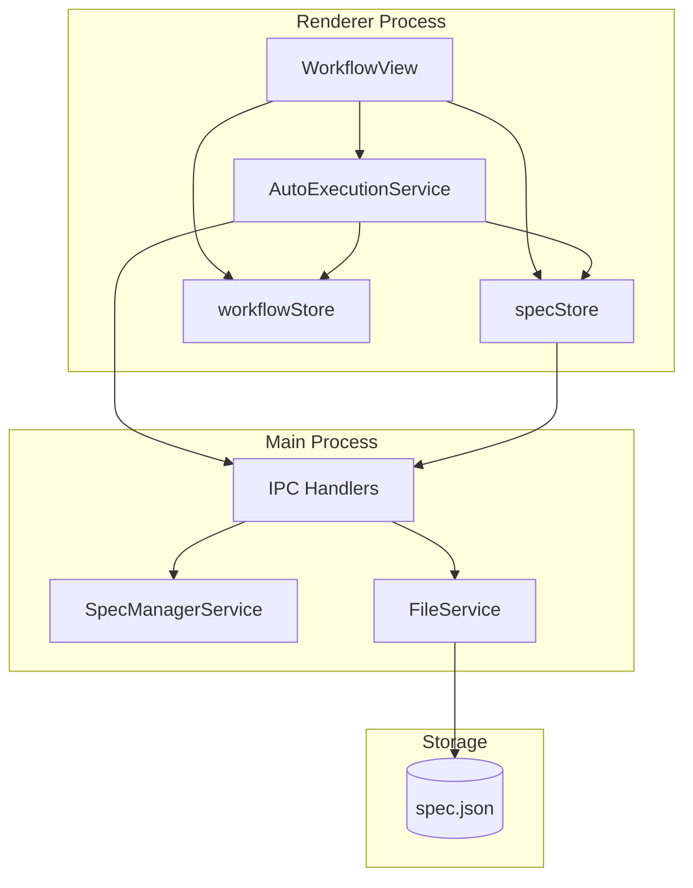
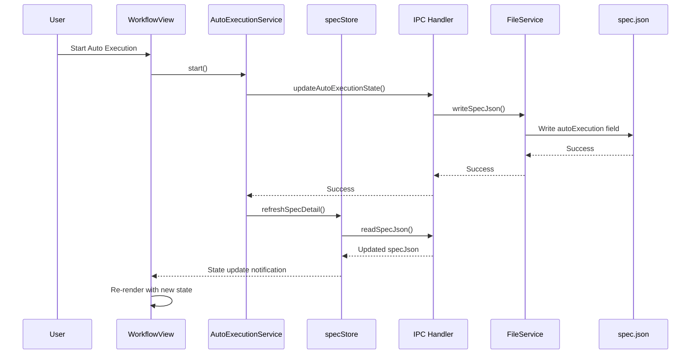
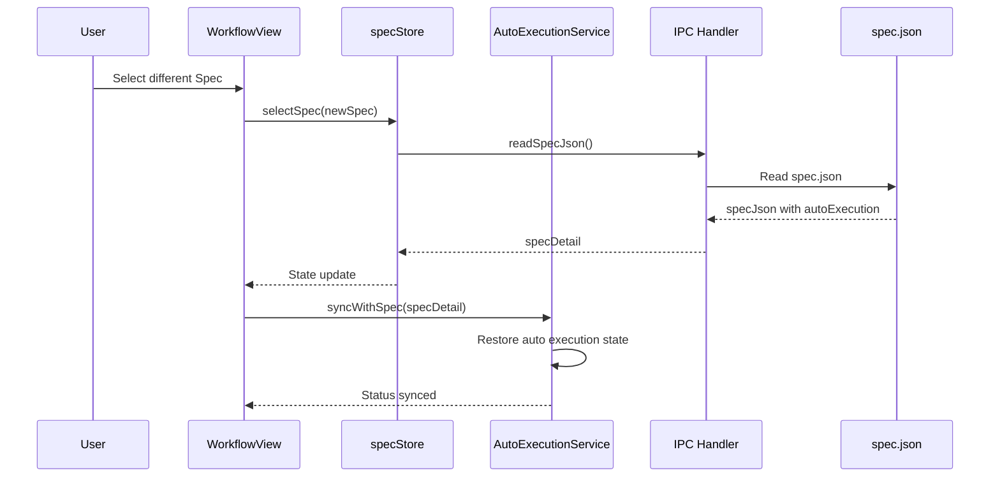
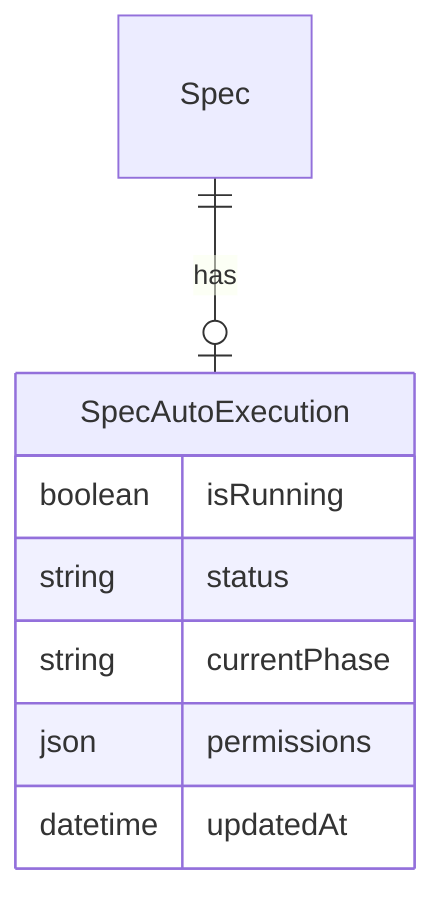

# Design Document

## Overview

**Purpose**: 本機能は、自動実行（Auto Execution）の状態管理をグローバルからSpec単位に変更し、各Specのspec.jsonファイルを単一のデータソースとして使用することで、複数Specの並行操作時の状態混乱を防ぎ、アプリ再起動後も状態が正確に復元される一貫性のある自動実行管理を実現する。

**Users**: SDD OrchestratorでSDDワークフローを使用する開発者。複数のSpecを同時に操作しながら自動実行機能を利用する。

**Impact**: 現在のグローバルなworkflowStoreによる自動実行状態管理を、spec.jsonベースのSpec単位管理に変更する。既存のワークフロー機能との互換性を維持しつつ、状態の永続化と復元を実現する。

### Goals

- Spec単位での自動実行状態の独立管理
- spec.jsonを自動実行状態の唯一のデータソースとして使用
- アプリ再起動後の状態復元
- UIと状態の即時同期
- 既存ワークフロー機能との完全な互換性維持

### Non-Goals

- 複数Specの同時並行自動実行（現状は1つのSpecのみ実行）
- spec.jsonスキーマの大幅な変更
- AutoExecutionServiceのシングルトンパターンの廃止

## Architecture

### Existing Architecture Analysis

現在のアーキテクチャにおける自動実行状態管理:

- **workflowStore**: グローバルな`isAutoExecuting`、`currentAutoPhase`、`autoExecutionStatus`を管理
- **AutoExecutionService**: シングルトンとしてworkflowStoreと連携し自動実行を制御
- **specStore**: `specDetail`で選択中Specのspec.jsonを保持
- **問題点**: Spec切り替え時に自動実行状態が失われる、アプリ再起動で状態がリセットされる

### Architecture Pattern & Boundary Map



**Architecture Integration**:
- Selected pattern: **State Locality Pattern** - 状態をデータソース（spec.json）に近接させる
- Domain boundaries: AutoExecutionServiceがSpec単位の状態を管理、workflowStoreはグローバル設定のみ保持
- Existing patterns preserved: IPC通信、Zustand Store、FileWatcher
- New components rationale: spec.jsonへの`autoExecution`フィールド追加で永続化実現
- Steering compliance: SSOT原則（spec.jsonが唯一のソース）、DRY原則

### Technology Stack

| Layer | Choice / Version | Role in Feature | Notes |
|-------|------------------|-----------------|-------|
| Frontend | React 19 + TypeScript 5.8 | UI状態反映、ユーザー操作 | 既存スタック維持 |
| State Management | Zustand | specStore拡張、workflowStore簡素化 | 既存スタック維持 |
| Backend | Node.js 20 + Electron 35 | spec.json読み書き | 既存スタック維持 |
| Storage | spec.json | 自動実行状態の永続化 | 新規フィールド追加 |
| File Monitoring | chokidar | spec.json変更検出 | 既存スタック維持 |

## System Flows

### Auto Execution State Flow



### Spec Switch State Restoration Flow



## Requirements Traceability

| Requirement | Summary | Components | Interfaces | Flows |
|-------------|---------|------------|------------|-------|
| 1.1 | 自動実行開始時にspec.jsonに状態記録 | AutoExecutionService, IPC Handler | updateAutoExecutionState | Auto Execution State Flow |
| 1.2 | 完了/中断時にspec.json状態更新 | AutoExecutionService, IPC Handler | updateAutoExecutionState | Auto Execution State Flow |
| 1.3 | 進行中の状態読み取り | AutoExecutionService, specStore | readSpecJson | Spec Switch Flow |
| 1.4 | 各Specの状態を独立追跡 | AutoExecutionService | Per-spec state map | - |
| 1.5 | Spec切替時に状態を読み込み表示 | specStore, WorkflowView | selectSpec | Spec Switch Flow |
| 2.1 | spec.jsonに自動実行フィールド管理 | SpecManagerService, FileService | writeSpecJson | - |
| 2.2 | アプリ起動時に状態復元 | AutoExecutionService | restoreFromSpec | - |
| 2.3 | 状態変更時に即座に永続化 | AutoExecutionService, IPC Handler | updateAutoExecutionState | Auto Execution State Flow |
| 2.4 | 自動実行フィールド未存在時のデフォルト値 | SpecManagerService | normalizeAutoExecution | - |
| 2.5 | spec.jsonに実行中フラグ、フェーズ、許可設定を保持 | SpecJson type | autoExecution field | - |
| 3.1 | spec.json変更時にUI即時更新 | specStore, WorkflowView | useSpecStore subscription | - |
| 3.2 | Spec選択時に状態をUIに反映 | specStore, WorkflowView | selectSpec | Spec Switch Flow |
| 3.3 | 実行中フェーズの視覚的表示 | WorkflowView | PhaseExecutionPanel | - |
| 3.4 | 完了時に状態反映、次アクション可能 | WorkflowView, AutoExecutionService | handleAgentCompleted | - |
| 3.5 | 選択中Spec状態のみ表示 | AutoExecutionStatusDisplay | getAutoExecutionStateForSpec | - |
| 4.1 | SpecAの実行がSpecBに影響しない | AutoExecutionService | Spec-scoped state | - |
| 4.2 | Spec切替時に前Specの状態保持 | spec.json persistence | - | - |
| 4.3 | Spec単位の状態管理構造 | AutoExecutionService | specAutoExecutionStates Map | - |
| 4.4 | 同時要求時の独立管理 | AutoExecutionService | Per-spec state isolation | - |
| 5.1 | PhaseExecutionPanel既存機能維持 | PhaseExecutionPanel | - | - |
| 5.2 | ApprovalPanel既存機能維持 | ApprovalPanel | - | - |
| 5.3 | 手動フェーズ実行の自動実行状態反映 | AutoExecutionService | handleManualPhaseExecution | - |
| 5.4 | 既存spec.jsonフィールドとの互換性 | SpecJson type | Backward compatible | - |
| 5.5 | 古い形式のspec.jsonに新フィールド追加 | SpecManagerService | migrateSpecJson | - |
| 6.1 | 外部からのspec.json変更検出 | FileWatcher | onSpecJsonChange | - |
| 6.2 | 変更検出時に状態再読み込み | AutoExecutionService | syncWithSpec | - |
| 6.3 | 再読み込み後にUI最新状態表示 | specStore, WorkflowView | refreshSpecDetail | - |
| 6.4 | 自動実行関連フィールド変更の適切な処理 | FileWatcher, specStore | handleAutoExecutionFieldChange | - |

## Components and Interfaces

| Component | Domain/Layer | Intent | Req Coverage | Key Dependencies | Contracts |
|-----------|--------------|--------|--------------|------------------|-----------|
| AutoExecutionService | Service | Spec単位の自動実行状態管理とライフサイクル制御 | 1.1-1.5, 2.2-2.3, 4.1-4.4 | specStore (P0), IPC (P0), workflowStore (P1) | Service, State |
| specStore | State | Spec詳細とautoExecution状態の保持 | 2.1, 3.1-3.2, 6.3 | IPC Handler (P0) | State |
| workflowStore | State | グローバル設定（permissions）のみ保持 | 5.3 | - | State |
| IPC Handler | IPC | spec.json読み書きのIPC橋渡し | 2.1, 2.3 | FileService (P0), SpecManagerService (P0) | API |
| SpecManagerService | Service | spec.jsonの正規化とマイグレーション | 2.4, 5.4-5.5 | FileService (P0) | Service |
| WorkflowView | UI | 自動実行状態のUI表示 | 3.1-3.5, 5.1-5.2 | specStore (P0), AutoExecutionService (P1) | - |
| FileWatcher | Service | spec.json変更の検出と通知 | 6.1-6.4 | chokidar (P0), IPC (P0) | Event |

### Service Layer

#### AutoExecutionService

| Field | Detail |
|-------|--------|
| Intent | Spec単位の自動実行状態管理とライフサイクル制御 |
| Requirements | 1.1, 1.2, 1.3, 1.4, 1.5, 2.2, 2.3, 4.1, 4.2, 4.3, 4.4 |

**Responsibilities & Constraints**
- Spec単位の自動実行状態を管理
- 状態変更時にspec.jsonへ即時永続化
- Spec切り替え時に状態を復元

**Dependencies**
- Inbound: WorkflowView — 自動実行の開始/停止 (P0)
- Outbound: specStore — 状態読み取り (P0)
- Outbound: IPC Handler — spec.json書き込み (P0)
- Outbound: workflowStore — グローバル設定参照 (P1)

**Contracts**: Service [x] / State [x]

##### Service Interface

```typescript
interface AutoExecutionServiceInterface {
  /**
   * 自動実行を開始（指定Specに対して）
   * @precondition specDetail is loaded and has valid autoExecution state
   * @postcondition spec.json.autoExecution.isRunning = true, currentPhase set
   */
  start(specId: string): Promise<boolean>;

  /**
   * 自動実行を停止
   * @postcondition spec.json.autoExecution.isRunning = false, status = 'idle'
   */
  stop(specId: string): Promise<void>;

  /**
   * Specの自動実行状態を取得
   * @returns Current auto execution state from spec.json
   */
  getAutoExecutionState(specId: string): SpecAutoExecutionState | null;

  /**
   * Spec選択時に状態を同期
   * @precondition specDetail is loaded
   * @postcondition Internal state matches spec.json
   */
  syncWithSpec(specDetail: SpecDetail): void;

  /**
   * 状態変更をspec.jsonに永続化
   * @postcondition spec.json.autoExecution updated
   */
  persistState(specId: string, state: SpecAutoExecutionState): Promise<void>;
}
```

##### State Management

```typescript
/**
 * Spec単位の自動実行状態（spec.jsonに永続化される）
 */
interface SpecAutoExecutionState {
  /** 実行中フラグ */
  readonly isRunning: boolean;
  /** 詳細状態 */
  readonly status: AutoExecutionStatus;
  /** 現在のフェーズ */
  readonly currentPhase: WorkflowPhase | null;
  /** 許可されたフェーズ設定 */
  readonly permissions: AutoExecutionPermissions;
  /** 最終更新日時 */
  readonly updatedAt: string;
}

type AutoExecutionStatus =
  | 'idle'
  | 'running'
  | 'paused'
  | 'completing'
  | 'error'
  | 'completed';
```

**Implementation Notes**
- Integration: workflowStoreから`isAutoExecuting`、`currentAutoPhase`をspec.json管理に移行
- Validation: 状態変更前にspecDetailの存在を確認
- Risks: 複数ウィンドウでの同時編集時の競合（将来対応）

### State Layer

#### specStore (Extension)

| Field | Detail |
|-------|--------|
| Intent | Spec詳細とautoExecution状態の保持、UI通知 |
| Requirements | 2.1, 3.1, 3.2, 6.3 |

**Contracts**: State [x]

##### State Management

```typescript
interface SpecStoreExtension {
  /**
   * 選択中Specの自動実行状態を取得
   * @returns autoExecution from specDetail.specJson or default
   */
  getAutoExecutionState(): SpecAutoExecutionState | null;

  /**
   * spec.jsonの自動実行状態を更新してUIに通知
   * @postcondition specDetail.specJson.autoExecution updated, subscribers notified
   */
  updateAutoExecutionState(state: Partial<SpecAutoExecutionState>): Promise<void>;

  /**
   * Spec詳細を再読み込み（外部変更検出時）
   */
  refreshSpecDetail(): Promise<void>;
}
```

**Implementation Notes**
- Integration: 既存のselectSpecメソッド内でautoExecution状態も読み込み
- Validation: autoExecutionフィールドが未定義の場合はデフォルト値を適用

#### workflowStore (Simplification)

| Field | Detail |
|-------|--------|
| Intent | グローバル設定（デフォルトpermissions）のみ保持 |
| Requirements | 5.3 |

**Responsibilities & Constraints**
- `isAutoExecuting`、`currentAutoPhase`はspec.jsonに移行
- `autoExecutionPermissions`はデフォルト設定として保持（spec.jsonが優先）
- LocalStorage永続化はグローバル設定のみに限定

### Data/IPC Layer

#### IPC Handler Extension

| Field | Detail |
|-------|--------|
| Intent | spec.json自動実行フィールドの読み書き |
| Requirements | 2.1, 2.3 |

**Contracts**: API [x]

##### API Contract

| Method | Channel | Request | Response | Errors |
|--------|---------|---------|----------|--------|
| invoke | UPDATE_AUTO_EXECUTION_STATE | { specPath: string, state: SpecAutoExecutionState } | { success: boolean } | WRITE_ERROR |
| invoke | READ_AUTO_EXECUTION_STATE | { specPath: string } | SpecAutoExecutionState | NOT_FOUND, PARSE_ERROR |

#### SpecManagerService Extension

| Field | Detail |
|-------|--------|
| Intent | spec.jsonの正規化とマイグレーション |
| Requirements | 2.4, 5.4, 5.5 |

**Contracts**: Service [x]

##### Service Interface

```typescript
interface SpecManagerServiceExtension {
  /**
   * spec.jsonにautoExecutionフィールドを正規化
   * @param specJson Existing spec.json content
   * @returns spec.json with normalized autoExecution field
   */
  normalizeAutoExecution(specJson: SpecJson): SpecJsonWithAutoExecution;

  /**
   * 古い形式のspec.jsonをマイグレート
   * @precondition spec.json exists
   * @postcondition autoExecution field added with defaults if missing
   */
  migrateSpecJson(specPath: string): Promise<void>;
}
```

**Implementation Notes**
- Integration: readSpecJson時に自動で正規化を適用
- Validation: autoExecutionフィールドの型検証

### UI Layer

#### WorkflowView (Modification)

| Field | Detail |
|-------|--------|
| Intent | 自動実行状態のUI表示とユーザー操作 |
| Requirements | 3.1, 3.2, 3.3, 3.4, 3.5, 5.1, 5.2 |

**Responsibilities & Constraints**
- workflowStoreではなくspecStoreから自動実行状態を読み取り
- Spec切り替え時に自動的にUIが更新される
- 既存のPhaseExecutionPanel、ApprovalPanelの動作を維持

**Implementation Notes**
- Integration: `useSpecStore`のsubscriptionでautoExecution変更を検知
- 変更箇所: 状態参照元をworkflowStoreからspecStoreに変更

## Data Models

### Domain Model



### spec.json Extension

**Existing Structure (backward compatible)**:
```typescript
interface SpecJson {
  feature_name: string;
  created_at: string;
  updated_at: string;
  language: 'ja' | 'en';
  phase: SpecPhase;
  approvals: ApprovalStatus;
  documentReview?: DocumentReviewState;
  // NEW: Auto execution state
  autoExecution?: SpecAutoExecutionState;
}
```

**New Field Definition**:
```typescript
interface SpecAutoExecutionState {
  /** 実行中フラグ */
  isRunning: boolean;
  /** 詳細状態: idle | running | paused | completing | error | completed */
  status: string;
  /** 現在のフェーズ: requirements | design | tasks | impl | inspection | deploy | null */
  currentPhase: string | null;
  /** フェーズ別許可設定 */
  permissions: {
    requirements: boolean;
    design: boolean;
    tasks: boolean;
    impl: boolean;
    inspection: boolean;
    deploy: boolean;
  };
  /** 最終更新日時（ISO 8601） */
  updatedAt: string;
}
```

**Default Values** (when field is missing):
```typescript
const DEFAULT_AUTO_EXECUTION_STATE: SpecAutoExecutionState = {
  isRunning: false,
  status: 'idle',
  currentPhase: null,
  permissions: {
    requirements: true,
    design: false,
    tasks: false,
    impl: false,
    inspection: false,
    deploy: false,
  },
  updatedAt: new Date().toISOString(),
};
```

**Consistency & Integrity**:
- autoExecutionフィールドはオプショナル（後方互換性）
- 読み込み時に未定義ならデフォルト値を適用
- 書き込み時は常に完全な構造を保存

## Error Handling

### Error Strategy

- **状態不整合**: spec.json読み込み失敗時はデフォルト状態を適用
- **書き込み失敗**: 3回リトライ後にUIにエラー通知、メモリ上の状態は維持
- **ファイル監視エラー**: ログ出力して監視を継続

### Error Categories and Responses

**User Errors (4xx equivalent)**:
- Spec未選択での自動実行開始 → 警告通知「Specを選択してください」

**System Errors (5xx equivalent)**:
- spec.json書き込み失敗 → リトライ、最終的にエラー通知
- ファイル監視切断 → 自動再接続試行

**Business Logic Errors**:
- 無効なフェーズ遷移 → 無視してログ出力

## Testing Strategy

### Unit Tests
- AutoExecutionService: start/stop/syncWithSpec/persistState
- SpecManagerService: normalizeAutoExecution/migrateSpecJson
- specStore: getAutoExecutionState/updateAutoExecutionState

### Integration Tests
- IPC経由のspec.json読み書き
- FileWatcher変更検出からUI更新までの流れ
- Spec切り替え時の状態復元

### E2E Tests
- 自動実行開始→Spec切り替え→戻り→状態維持の確認
- アプリ再起動後の状態復元
- 外部からのspec.json編集→UI反映

## Migration Strategy

### Phase 1: Data Model Extension
1. spec.jsonにautoExecutionフィールドのスキーマ追加
2. SpecManagerServiceにnormalizeAutoExecution実装
3. 既存spec.jsonの読み込み時にデフォルト値適用

### Phase 2: Service Layer Migration
1. AutoExecutionServiceにSpec単位の状態管理ロジック追加
2. IPC Handlerに新チャンネル追加
3. specStoreにautoExecution関連メソッド追加

### Phase 3: UI Layer Migration
1. WorkflowViewの状態参照元をworkflowStoreからspecStoreに変更
2. AutoExecutionStatusDisplayの更新
3. PhaseExecutionPanelの互換性維持確認

### Phase 4: Cleanup
1. workflowStoreから移行済みフィールドを削除
2. LocalStorage永続化設定の更新

### Rollback Triggers
- spec.json破損検出時
- 状態不整合が継続する場合

### Validation Checkpoints
- 各フェーズ完了後にE2Eテスト実行
- 既存機能の回帰テスト
