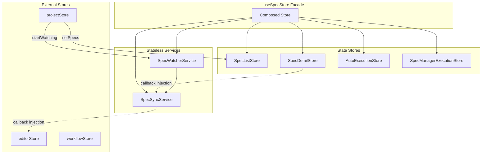
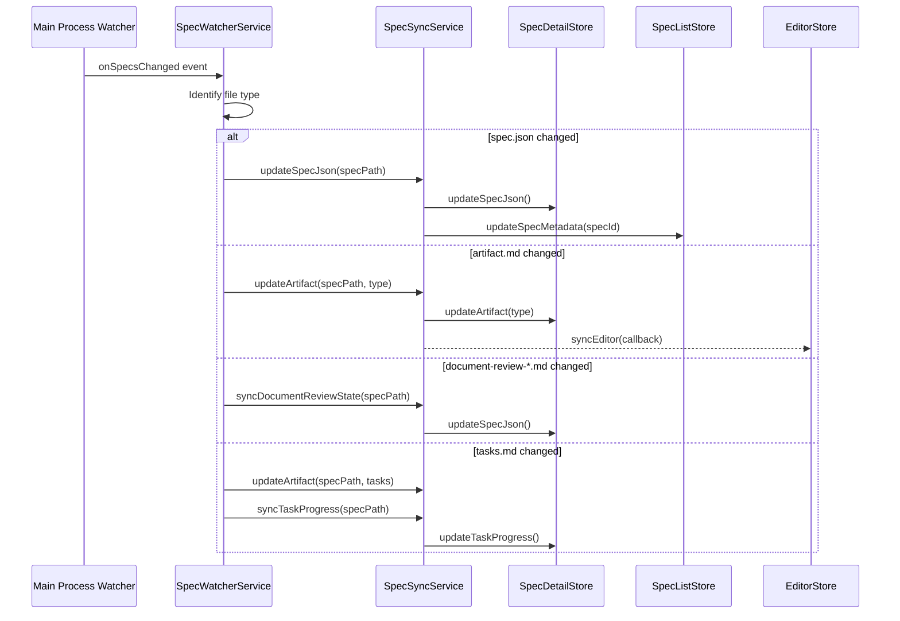

# Design Document

## Overview

**Purpose**: 本設計は、`specStore.ts`（1020行超）をSRP（単一責任原則）に基づいて分割し、保守性・テスト容易性を向上させる。God Objectアンチパターンを解消し、各モジュールに明確な責務を割り当てる。

**Users**: アプリケーション開発者がSpec関連の状態管理を理解・拡張しやすくなる。

**Impact**: 既存の`useSpecStore`インターフェースを維持しつつ、内部構造を6つの独立モジュールに再編成する。

### Goals

- specStore.tsを責務別に分割し、各モジュールを単一責任に
- 既存のuseSpecStoreインターフェースの完全互換性維持
- projectStore/workflowStore/editorStoreとの循環依存解消
- テスト容易性の向上（各モジュールが独立してテスト可能）

### Non-Goals

- Remote UIの変更（Desktop UI内部のリファクタリングのみ）
- 外部IPC APIの変更
- 新機能の追加

## Architecture

### Existing Architecture Analysis

現在の`specStore.ts`は以下の責務が混在したGod Objectである：

| 責務 | 行数概算 | 依存関係 |
|------|---------|---------|
| Spec一覧管理 (specs配列、ソート、フィルタ) | ~100行 | - |
| Spec詳細管理 (selectedSpec, specDetail) | ~180行 | projectStore (動的import) |
| ファイル同期ロジック (sync*, update*) | ~200行 | editorStore (動的import) |
| ファイル監視 (watcher) | ~80行 | - |
| 自動実行ランタイム状態 | ~80行 | - |
| spec-manager実行 | ~100行 | - |
| 型定義・初期値 | ~80行 | - |

**循環依存の現状**:
- `specStore` -> `projectStore`: `refreshSpecs()`で動的import
- `specStore` -> `editorStore`: `updateArtifact()`で動的import
- `projectStore` -> `specStore`: `selectProject()`で直接import
- `workflowStore` -> `specStore`: `persistSettingsToSpec()`で動的import

### Architecture Pattern & Boundary Map



**Architecture Integration**:
- Selected pattern: **Facade + Module Decomposition** - 既存インターフェース互換性を維持しながら内部を分割
- Domain boundaries: Stores（状態管理）とServices（ロジック）を明確に分離
- Existing patterns preserved: Zustand store pattern, 動的importによる循環依存回避
- New components rationale: 各モジュールが単一責任を持ち、独立テスト可能に
- Steering compliance: SSOT（projectStoreがprojectPath権威）、DRY（共通ロジック抽出）

### Technology Stack

| Layer | Choice / Version | Role in Feature | Notes |
|-------|------------------|-----------------|-------|
| State Management | Zustand 5.x | 各Store実装 | 既存パターン維持 |
| Types | TypeScript 5.8+ | 型定義 | strict mode |
| Runtime | React 19 | コンポーネント連携 | hooks経由 |

## System Flows

### File Change Detection Flow



## Requirements Traceability

| Requirement | Summary | Components | Interfaces | Flows |
|-------------|---------|------------|------------|-------|
| 1.1-1.8 | Spec一覧状態管理 | SpecListStore | SpecListState, SpecListActions | loadSpecs, setSpecs |
| 2.1-2.8 | Spec詳細状態管理 | SpecDetailStore | SpecDetailState, SpecDetailActions | selectSpec, clearSpec |
| 3.1-3.8 | ファイル同期ロジック | SpecSyncService | SpecSyncService interface | sync*, update* |
| 4.1-4.10 | ファイル監視 | SpecWatcherService | SpecWatcherService interface | File Change Flow |
| 5.1-5.8 | 自動実行ランタイム状態 | AutoExecutionStore | AutoExecutionState, Actions | get/set AutoExecution |
| 6.1-6.8 | spec-manager実行状態 | SpecManagerExecutionStore | SpecManagerState, Actions | execute, handle |
| 7.1-7.6 | 既存インターフェース互換 | useSpecStore (Facade) | SpecStore (composed) | 全既存アクション |
| 8.1-8.5 | 循環依存解消 | 全モジュール | callback injection | - |
| 9.1-9.5 | ディレクトリ構成 | 全ファイル | - | - |

## Components and Interfaces

| Component | Domain/Layer | Intent | Req Coverage | Key Dependencies | Contracts |
|-----------|--------------|--------|--------------|------------------|-----------|
| SpecListStore | stores | Spec一覧状態管理 | 1.1-1.8 | electronAPI (P0) | State |
| SpecDetailStore | stores | 選択Spec詳細管理 | 2.1-2.8 | electronAPI (P0), SpecSyncService (P1) | State |
| SpecSyncService | services | ファイル同期ロジック | 3.1-3.8 | electronAPI (P0) | Service |
| SpecWatcherService | services | ファイル監視 | 4.1-4.10 | electronAPI (P0), SpecSyncService (P1) | Service |
| AutoExecutionStore | stores | 自動実行ランタイム | 5.1-5.8 | - | State |
| SpecManagerExecutionStore | stores | spec-manager実行 | 6.1-6.8 | electronAPI (P0) | State |
| useSpecStore | stores | Facadeコンポーネント | 7.1-7.6 | 全子モジュール (P0) | State |

### Stores Layer

#### SpecListStore

| Field | Detail |
|-------|--------|
| Intent | Spec一覧の状態管理（specs配列、ソート、フィルタ） |
| Requirements | 1.1, 1.2, 1.3, 1.4, 1.5, 1.6, 1.7, 1.8 |

**Responsibilities & Constraints**
- specs配列の管理（SpecMetadata[]）
- ソート状態（sortBy, sortOrder）とフィルタ状態（statusFilter）の管理
- isLoading/error状態の管理
- projectPathは外部から受け取る（SSOTとしてprojectStoreを参照しない）

**Dependencies**
- Outbound: electronAPI.readSpecs — Spec一覧取得 (P0)

**Contracts**: State [x]

##### State Management

```typescript
interface SpecListState {
  readonly specs: SpecMetadata[];
  readonly sortBy: 'name' | 'updatedAt' | 'phase';
  readonly sortOrder: 'asc' | 'desc';
  readonly statusFilter: SpecPhase | 'all';
  readonly isLoading: boolean;
  readonly error: string | null;
}

interface SpecListActions {
  loadSpecs(projectPath: string): Promise<void>;
  setSpecs(specs: SpecMetadata[]): void;
  setSortBy(sortBy: SpecListState['sortBy']): void;
  setSortOrder(order: SpecListState['sortOrder']): void;
  setStatusFilter(filter: SpecListState['statusFilter']): void;
  getSortedFilteredSpecs(): SpecMetadata[];
  updateSpecMetadata(specId: string, projectPath: string): Promise<void>;
}
```

- Preconditions: projectPath must be valid directory path
- Postconditions: specs array updated, isLoading set to false
- Invariants: sortBy/sortOrder/statusFilter always have valid values

---

#### SpecDetailStore

| Field | Detail |
|-------|--------|
| Intent | 選択中Specの詳細状態管理 |
| Requirements | 2.1, 2.2, 2.3, 2.4, 2.5, 2.6, 2.7, 2.8 |

**Responsibilities & Constraints**
- selectedSpec（選択中Spec）とspecDetail（詳細データ）の管理
- taskProgressの計算
- silentモードでのリロード（loading表示なし）

**Dependencies**
- Outbound: electronAPI.readSpecJson, readArtifact — Spec詳細取得 (P0)
- Outbound: electronAPI.syncDocumentReview, syncSpecPhase — 同期 (P1)

**Contracts**: State [x]

##### State Management

```typescript
interface SpecDetailState {
  readonly selectedSpec: SpecMetadata | null;
  readonly specDetail: SpecDetail | null;
  readonly isLoading: boolean;
  readonly error: string | null;
}

interface SpecDetailActions {
  selectSpec(spec: SpecMetadata, options?: { silent?: boolean }): Promise<void>;
  clearSelectedSpec(): void;
  refreshSpecDetail(): Promise<void>;
  // Internal setters for SpecSyncService
  setSpecDetail(detail: SpecDetail): void;
  setSpecJson(specJson: SpecJson): void;
  setArtifact(type: ArtifactType, info: ArtifactInfo | null): void;
  setTaskProgress(progress: TaskProgress | null): void;
}
```

- Preconditions: spec.path must exist
- Postconditions: specDetail populated with all artifacts
- Invariants: selectedSpec and specDetail are consistent (both null or both set)

---

#### AutoExecutionStore

| Field | Detail |
|-------|--------|
| Intent | Spec毎の自動実行ランタイム状態管理 |
| Requirements | 5.1, 5.2, 5.3, 5.4, 5.5, 5.6, 5.7, 5.8 |

**Responsibilities & Constraints**
- autoExecutionRuntimeMap（Map<specId, AutoExecutionRuntimeState>）の管理
- 未知のspecIdにはデフォルト状態を返却
- 他のStoreへの依存なし（純粋な状態管理）

**Dependencies**
- None (pure state store)

**Contracts**: State [x]

##### State Management

```typescript
interface AutoExecutionRuntimeState {
  readonly isAutoExecuting: boolean;
  readonly currentAutoPhase: WorkflowPhase | null;
  readonly autoExecutionStatus: AutoExecutionStatus;
}

interface AutoExecutionState {
  readonly autoExecutionRuntimeMap: Map<string, AutoExecutionRuntimeState>;
}

interface AutoExecutionActions {
  getAutoExecutionRuntime(specId: string): AutoExecutionRuntimeState;
  setAutoExecutionRunning(specId: string, isRunning: boolean): void;
  setAutoExecutionPhase(specId: string, phase: WorkflowPhase | null): void;
  setAutoExecutionStatus(specId: string, status: AutoExecutionStatus): void;
  startAutoExecution(specId: string): void;
  stopAutoExecution(specId: string): void;
}
```

- Preconditions: None
- Postconditions: Map updated for specified specId
- Invariants: Unknown specId returns DEFAULT_AUTO_EXECUTION_RUNTIME

---

#### SpecManagerExecutionStore

| Field | Detail |
|-------|--------|
| Intent | spec-manager実行状態の管理 |
| Requirements | 6.1, 6.2, 6.3, 6.4, 6.5, 6.6, 6.7, 6.8 |

**Responsibilities & Constraints**
- specManagerExecution状態の管理
- 実行中の重複防止（isRunning check）
- エラー状態の管理

**Dependencies**
- Outbound: electronAPI.executePhase, executeTaskImpl — フェーズ実行 (P0)

**Contracts**: State [x]

##### State Management

```typescript
interface SpecManagerExecutionState {
  readonly isRunning: boolean;
  readonly currentPhase: SpecManagerPhase | null;
  readonly currentSpecId: string | null;
  readonly lastCheckResult: CheckImplResult | null;
  readonly error: string | null;
  readonly implTaskStatus: ImplTaskStatus | null;
  readonly retryCount: number;
  readonly executionMode: 'auto' | 'manual' | null;
}

interface SpecManagerExecutionActions {
  executeSpecManagerGeneration(
    specId: string,
    phase: SpecManagerPhase,
    featureName: string,
    taskId: string | undefined,
    executionMode: 'auto' | 'manual'
  ): Promise<void>;
  handleCheckImplResult(result: CheckImplResult): void;
  updateImplTaskStatus(status: ImplTaskStatus, retryCount?: number): void;
  clearSpecManagerError(): void;
}
```

- Preconditions: Not already running (concurrent execution prevented)
- Postconditions: isRunning updated based on execution result
- Invariants: currentPhase/currentSpecId are null when not running

### Services Layer

#### SpecSyncService

| Field | Detail |
|-------|--------|
| Intent | ファイルシステムとStore状態の同期ロジック |
| Requirements | 3.1, 3.2, 3.3, 3.4, 3.5, 3.6, 3.7, 3.8 |

**Responsibilities & Constraints**
- spec.json/artifactの個別更新
- documentReview/inspection状態の同期
- taskProgress計算とフェーズ自動修正
- editorStoreとの連携（callback injection）

**Dependencies**
- Outbound: electronAPI — ファイル読み書き (P0)
- Outbound: editorStore — エディタ同期 (P1, callback injection)
- Inbound: SpecDetailStore — 状態更新対象 (P0)
- Inbound: SpecListStore — メタデータ更新対象 (P1)

**Contracts**: Service [x]

##### Service Interface

```typescript
interface SpecSyncServiceDeps {
  // SpecDetailStore から注入される setter
  setSpecDetail: (detail: SpecDetail) => void;
  setSpecJson: (specJson: SpecJson) => void;
  setArtifact: (type: ArtifactType, info: ArtifactInfo | null) => void;
  setTaskProgress: (progress: TaskProgress | null) => void;
  getSpecDetail: () => SpecDetail | null;
  getSelectedSpec: () => SpecMetadata | null;
  // SpecListStore から注入される setter
  updateSpecMetadata: (specId: string, projectPath: string) => Promise<void>;
  // editorStore callback (optional)
  syncEditor?: (artifact: ArtifactType, specPath: string) => Promise<void>;
}

interface SpecSyncService {
  init(deps: SpecSyncServiceDeps): void;
  updateSpecJson(): Promise<void>;
  updateArtifact(artifact: ArtifactType): Promise<void>;
  syncDocumentReviewState(): Promise<void>;
  syncInspectionState(): Promise<void>;
  syncTaskProgress(): Promise<void>;
}

function createSpecSyncService(): SpecSyncService;
```

- Preconditions: init() called with valid deps before other methods
- Postconditions: Store state updated to reflect file system state
- Invariants: editorStore synced when active tab matches updated artifact

**Implementation Notes**
- Integration: Callback injection pattern to avoid circular dependencies
- Validation: Check selectedSpec/specDetail before operations
- Risks: File system race conditions (mitigated by granular updates)

---

#### SpecWatcherService

| Field | Detail |
|-------|--------|
| Intent | ファイル変更の監視と適切なSyncService呼び出し |
| Requirements | 4.1, 4.2, 4.3, 4.4, 4.5, 4.6, 4.7, 4.8, 4.9, 4.10 |

**Responsibilities & Constraints**
- electronAPI.onSpecsChangedリスナーの登録・解除
- 変更ファイルタイプの判定とSyncService呼び出し
- isWatching状態の管理

**Dependencies**
- Outbound: electronAPI.onSpecsChanged, stopSpecsWatcher — イベント登録 (P0)
- Outbound: SpecSyncService — 同期処理呼び出し (P0)
- Inbound: useSpecStore (Facade) — 初期化時の接続 (P0)

**Contracts**: Service [x]

##### Service Interface

```typescript
interface SpecWatcherServiceDeps {
  syncService: SpecSyncService;
  getSelectedSpec: () => SpecMetadata | null;
  updateSpecMetadata: (specId: string, projectPath: string) => Promise<void>;
  setIsWatching: (isWatching: boolean) => void;
}

interface SpecWatcherService {
  init(deps: SpecWatcherServiceDeps): void;
  startWatching(): Promise<void>;
  stopWatching(): Promise<void>;
  isWatching(): boolean;
}

function createSpecWatcherService(): SpecWatcherService;
```

- Preconditions: init() called with valid deps
- Postconditions: Event listener registered/unregistered
- Invariants: Only one listener active at a time (cleanup before re-register)

**Implementation Notes**
- Integration: Uses electronAPI.onSpecsChanged for file change events
- Validation: Checks if changed spec matches selectedSpec before granular update
- Risks: Memory leak if cleanup not called (mitigated by explicit stopWatching)

### Facade Layer

#### useSpecStore (Composed Facade)

| Field | Detail |
|-------|--------|
| Intent | 既存インターフェース維持のためのFacade |
| Requirements | 7.1, 7.2, 7.3, 7.4, 7.5, 7.6 |

**Responsibilities & Constraints**
- 全子モジュールの状態を結合してエクスポート
- 既存の全アクションメソッドを同一シグネチャで提供
- 内部で適切な子モジュールに委譲

**Dependencies**
- Inbound: 既存コンポーネント群 (P0)
- Outbound: SpecListStore, SpecDetailStore, AutoExecutionStore, SpecManagerExecutionStore (P0)
- Outbound: SpecSyncService, SpecWatcherService (P0)

**Contracts**: State [x]

##### State Management

```typescript
// 既存のSpecStore型を維持
type SpecStore = SpecState & SpecActions;

// 内部実装: 各子ストアから状態を結合
const useSpecStore = create<SpecStore>((set, get) => {
  // Services initialization
  const syncService = createSpecSyncService();
  const watcherService = createSpecWatcherService();

  // Compose state from child stores
  return {
    // SpecListStore state delegation
    specs: useSpecListStore.getState().specs,
    sortBy: useSpecListStore.getState().sortBy,
    // ... (subscribe to child stores for reactive updates)

    // SpecDetailStore state delegation
    selectedSpec: useSpecDetailStore.getState().selectedSpec,
    specDetail: useSpecDetailStore.getState().specDetail,
    // ...

    // Actions delegation
    loadSpecs: (projectPath) => useSpecListStore.getState().loadSpecs(projectPath),
    selectSpec: (spec, options) => useSpecDetailStore.getState().selectSpec(spec, options),
    // ...
  };
});
```

- Preconditions: Child stores and services initialized
- Postconditions: Existing component behavior unchanged
- Invariants: All existing action signatures preserved

## Data Models

### Domain Model

本リファクタリングでは新規データモデルは導入しない。既存の型定義を維持：

- `SpecMetadata`: Spec一覧の各項目
- `SpecDetail`: 選択中Specの詳細
- `SpecJson`: spec.jsonの内容
- `ArtifactInfo`: 各アーティファクトの情報
- `TaskProgress`: タスク進捗
- `AutoExecutionRuntimeState`: 自動実行ランタイム状態
- `SpecManagerExecutionState`: spec-manager実行状態

### Data Contracts & Integration

**State Composition Pattern**:
Facade storeは子storeの状態をsubscribeして結合。Zustandの`subscribeWithSelector`を使用して必要な部分のみ再レンダリング。

**subscribeWithSelector Setup (Zustand 5.x)**:
Zustand 5.xでは`subscribeWithSelector`はデフォルトで利用可能。store作成時にmiddlewareを明示的に適用する必要はない。

```typescript
import { subscribeWithSelector } from 'zustand/middleware';

// 子storeの作成時（必要に応じてmiddleware適用）
const useSpecListStore = create<SpecListStore>()(
  subscribeWithSelector((set, get) => ({
    // ... state and actions
  }))
);
```

**Subscription Setup & Cleanup**:
Facadeストアの初期化時にsubscriptionを設定し、React StrictModeでの二重実行に対応。

```typescript
// Facade store内でsubscription設定
let subscriptions: (() => void)[] = [];

const setupSubscriptions = () => {
  // 既存subscriptionをcleanup
  subscriptions.forEach(unsub => unsub());
  subscriptions = [];

  // 子storeの状態変更を監視
  subscriptions.push(
    useSpecListStore.subscribe(
      (state) => state.specs,
      (specs) => useSpecStore.setState({ specs })
    )
  );
  // 他の子storeも同様に設定...
};

// React StrictMode対応: アプリ初期化時に一度だけ呼び出し
// または useEffect cleanup で unsub を呼び出し
```

**React StrictMode Considerations**:
- `subscribe`の戻り値（unsubscribe関数）を保持し、再設定前にcleanup
- コンポーネントレベルでsubscriptionを管理する場合は`useEffect`のcleanup関数で解除
- Facadeレベルのsubscriptionはアプリライフサイクルで一度だけ設定（モジュールスコープ）

## Error Handling

### Error Strategy

既存のエラーハンドリングパターンを維持：
- 各非同期操作で`try-catch`
- エラー時は`error`状態をセット
- ユーザーには日本語エラーメッセージを表示

### Error Categories and Responses

| カテゴリ | 例 | 対応 |
|---------|-----|------|
| ファイル読み込みエラー | spec.json not found | error状態設定、ログ出力 |
| 同期エラー | syncDocumentReview失敗 | console.error、状態維持（graceful degradation） |
| 実行エラー | spec-manager実行失敗 | error状態設定、isRunning=false |

## Testing Strategy

### Unit Tests

各分割モジュールに対応するテストファイルを作成：

| テストファイル | 対象 | 主なテストケース |
|---------------|------|-----------------|
| `specListStore.test.ts` | SpecListStore | loadSpecs, setSpecs, getSortedFilteredSpecs |
| `specDetailStore.test.ts` | SpecDetailStore | selectSpec (normal/silent), clearSelectedSpec |
| `specSyncService.test.ts` | SpecSyncService | updateSpecJson, updateArtifact, syncTaskProgress |
| `specWatcherService.test.ts` | SpecWatcherService | startWatching, stopWatching, event dispatch |
| `autoExecutionStore.test.ts` | AutoExecutionStore | get/set runtime state, default state |
| `specManagerExecutionStore.test.ts` | SpecManagerExecutionStore | execute, concurrent prevention |

### Integration Tests

既存の`specStore.test.ts`を維持し、Facadeの互換性を検証：

- 全既存テストがFacade経由で引き続きパス
- 子store間の連携が正しく動作
- ファイル変更イベントが正しく伝播

## Migration Strategy

### Phase 1: 型定義とサービスの抽出

1. `SpecSyncService`を`services/specSyncService.ts`に抽出
2. `SpecWatcherService`を`services/specWatcherService.ts`に抽出
3. 既存specStoreは変更せず、サービスを並行して実装

### Phase 2: 子Storeの作成

1. `SpecListStore`を`stores/spec/specListStore.ts`に作成
2. `SpecDetailStore`を`stores/spec/specDetailStore.ts`に作成
3. `AutoExecutionStore`を`stores/spec/autoExecutionStore.ts`に作成
4. `SpecManagerExecutionStore`を`stores/spec/specManagerExecutionStore.ts`に作成
5. 各storeの単体テストを作成

### Phase 3: Facadeの実装

1. `specStore.ts`を子storeを結合するFacadeに書き換え
2. 既存インターフェースの完全互換性を検証
3. 既存テストがすべてパスすることを確認

### Phase 4: クリーンアップ

1. 不要になった動的importを削除
2. barrel exports（`stores/spec/index.ts`）を整備
3. ドキュメント更新

### Rollback Triggers

- 既存テストの失敗
- パフォーマンス劣化（再レンダリング増加）
- 予期しない循環依存の発生

## Supporting References

### Directory Structure

```
electron-sdd-manager/src/renderer/
├── stores/
│   ├── spec/                          # Spec関連store群
│   │   ├── index.ts                   # barrel exports
│   │   ├── specListStore.ts           # Req 1
│   │   ├── specListStore.test.ts
│   │   ├── specDetailStore.ts         # Req 2
│   │   ├── specDetailStore.test.ts
│   │   ├── autoExecutionStore.ts      # Req 5
│   │   ├── autoExecutionStore.test.ts
│   │   ├── specManagerExecutionStore.ts  # Req 6
│   │   └── specManagerExecutionStore.test.ts
│   ├── specStore.ts                   # Facade (Req 7) - 既存パス維持
│   ├── specStore.test.ts              # 既存テスト維持
│   └── index.ts                       # 既存exports維持
├── services/
│   ├── index.ts                       # barrel exports
│   ├── specSyncService.ts             # Req 3
│   ├── specSyncService.test.ts
│   ├── specWatcherService.ts          # Req 4
│   └── specWatcherService.test.ts
└── types/
    └── index.ts                       # 既存型定義維持
```

### Circular Dependency Resolution Pattern

```typescript
// Before: specStore.ts
const { useProjectStore } = await import('./projectStore'); // 動的import

// After: specListStore.ts
// projectPathを引数として受け取り、projectStoreを参照しない
loadSpecs: async (projectPath: string) => {
  const specs = await window.electronAPI.readSpecs(projectPath);
  // ...
};

// projectStore.ts側
selectProject: async (path: string) => {
  // ...
  useSpecListStore.getState().setSpecs(result.specs);
  // ...
};
```

### Type Definitions (Preserved)

既存の型定義はすべて維持。新規型は以下のサービスインターフェースのみ：

```typescript
// services/specSyncService.ts
export interface SpecSyncServiceDeps { /* ... */ }
export interface SpecSyncService { /* ... */ }

// services/specWatcherService.ts
export interface SpecWatcherServiceDeps { /* ... */ }
export interface SpecWatcherService { /* ... */ }
```
