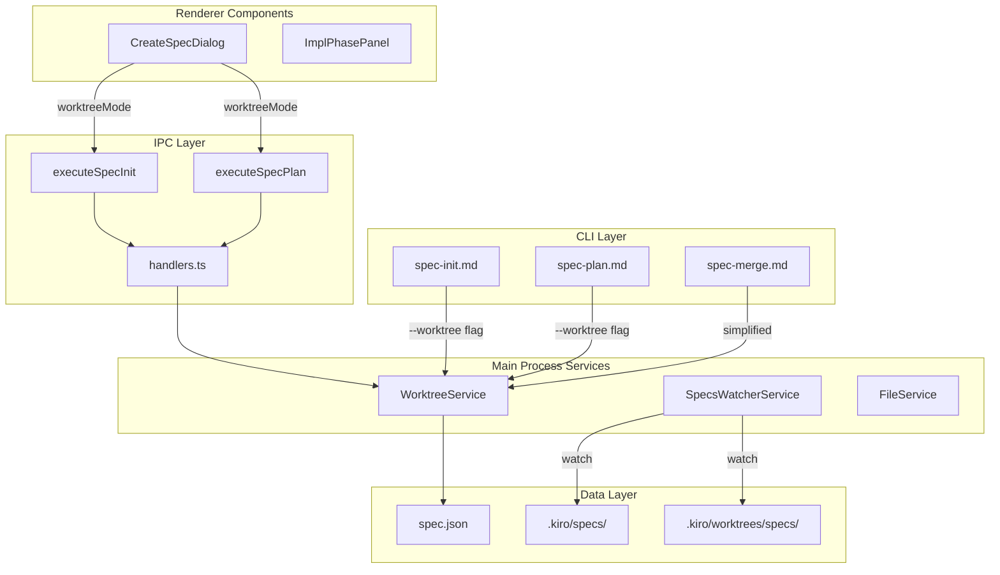
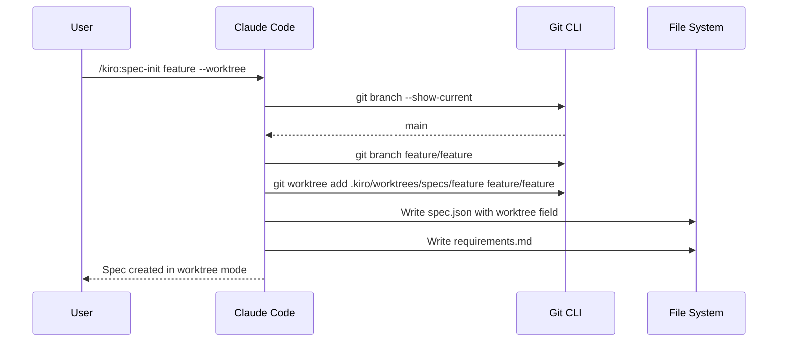
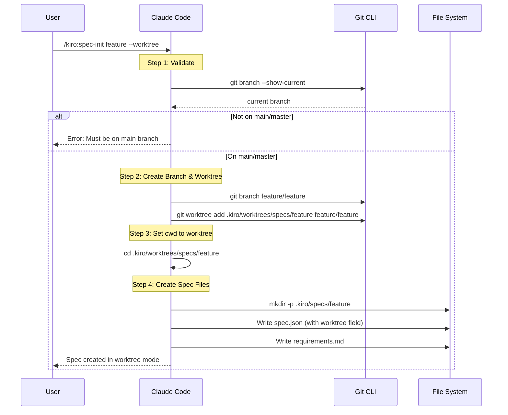
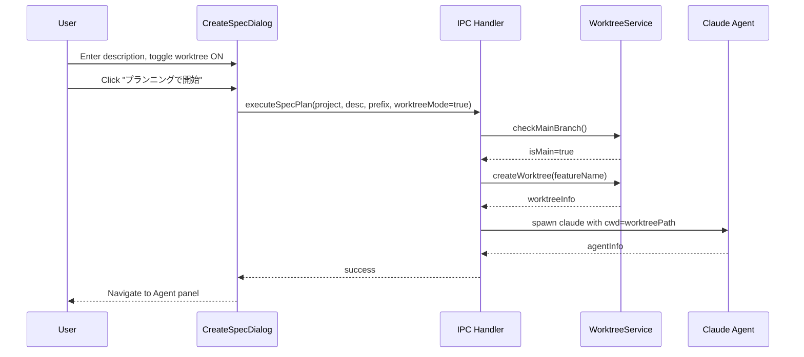
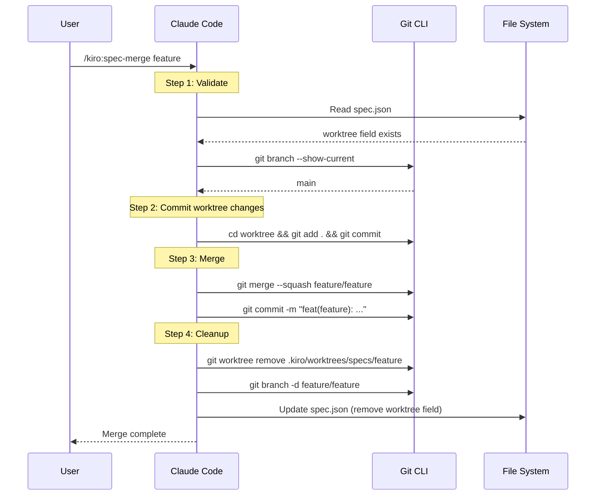

# Design: Spec Worktree Early Creation

## Overview

**Purpose**: この機能は、spec-init/spec-plan時点でworktreeを作成する「早期worktree作成」方式を実装し、worktreeモードでのspec-merge時にspecファイルがworktree側にコミットされない問題を根本的に解決する。

**Users**: SDD Orchestratorを使用する開発者は、spec作成時に`--worktree`フラグまたはUIスイッチを使用してworktreeモードを選択し、spec作成から実装・マージまで一貫してworktree上で作業できるようになる。

**Impact**: 現行のimpl開始時worktree作成方式およびsymlink方式を廃止し、シンプルで一貫性のあるworktreeワークフローに移行する。

### Goals

- spec-init/spec-planコマンドに`--worktree`フラグを追加し、spec作成時にworktreeモードを決定
- spec.jsonにworktreeフィールドを記録し、ワークフロー全体でモード状態を追跡
- Electron UIのSpec作成ダイアログにworktreeモードスイッチを追加
- SpecsWatcherServiceで`.kiro/worktrees/specs/`を常時監視
- symlink関連コードを完全削除し、コードベースを簡素化
- impl時のworktreeモード選択UIを削除
- spec-mergeからsymlink cleanup処理を削除

### Non-Goals

- Bug worktreeワークフローへの変更（既存のbug-fix --worktreeは影響なし）
- 既存specの移行ツール（既存specは現状のまま）
- Remote UI対応（デスクトップ専用機能）
- worktreeモードと通常モードの切り替え機能

## Architecture

### Existing Architecture Analysis

現行アーキテクチャの課題:

1. **symlink問題**: worktree側のspecをmain側へのsymlinkにする方式は、ClaudeのGlobがsymlinkを正しく処理できないバグがある
2. **タイミング問題**: impl開始時にworktreeを作成するため、spec-merge時にspecファイルがworktree側にコミットされない
3. **複雑性**: symlink作成/削除、git reset/checkout等の複雑な処理が必要

変更対象コンポーネント:
- `spec-init.md`, `spec-plan.md` (Claude Commands)
- `WorktreeService`, `SpecsWatcherService` (Main Process Services)
- `CreateSpecDialog`, `ImplPhasePanel`, `WorktreeModeCheckbox` (UI Components)
- `spec-merge.md` (Claude Command)

### Architecture Pattern & Boundary Map



**Architecture Integration**:
- Selected pattern: 早期worktree作成パターン（spec作成時にworktree決定）
- Domain boundaries: CLI Commands / IPC Handlers / Main Services / UI Components
- Existing patterns preserved: IPC通信、FileService、WorktreeService
- New components rationale: なし（既存コンポーネントの拡張）
- Steering compliance: DRY（symlink削除）、KISS（シンプルな実ファイル方式）、YAGNI（途中からのworktree化非サポート）

### Technology Stack

| Layer | Choice / Version | Role in Feature | Notes |
|-------|------------------|-----------------|-------|
| CLI | Claude Commands (Markdown) | spec-init/spec-plan worktreeフラグ処理 | 既存フォーマット拡張 |
| Backend | Node.js (Electron Main) | worktree作成、ファイル監視 | WorktreeService拡張 |
| Frontend | React 19 | Spec作成ダイアログUI | CreateSpecDialog拡張 |
| Data | JSON (spec.json) | worktree状態記録 | 既存スキーマ拡張 |

### Command Prompt Architecture (Claude Code features only)

**Execution Model**:
- [x] CLI invocation: External process with file-based data exchange

**Rationale**: spec-init/spec-planはClaude Codeのスラッシュコマンドとして実行され、gitコマンドとファイル操作を直接行う。MCP toolは使用しない。

**Data Flow**:


## System Flows

### Early Worktree Creation Flow (CLI)



### Early Worktree Creation Flow (UI)



### Simplified Spec-Merge Flow



## Requirements Traceability

| Criterion ID | Summary | Components | Implementation Approach |
|--------------|---------|------------|------------------------|
| 1.1 | spec-init --worktree でworktree作成 | spec-init.md, WorktreeService | 既存WorktreeService.createWorktree()を使用 |
| 1.2 | spec-plan --worktree でworktree作成 | spec-plan.md, WorktreeService | 既存WorktreeService.createWorktree()を使用 |
| 1.3 | main/master以外でエラー表示 | spec-init.md, spec-plan.md | WorktreeService.isOnMainBranch()を使用 |
| 1.4 | worktree/branch既存時エラー表示 | spec-init.md, spec-plan.md | WorktreeService.createWorktree()のエラーハンドリング |
| 2.1 | spec.jsonにworktreeフィールド記録 | spec-init.md, spec-plan.md | 新規フィールド追加 |
| 2.2 | --worktreeなし時はフィールドなし | spec-init.md, spec-plan.md | 条件分岐 |
| 2.3 | WorktreeConfig型互換性 | renderer/types/worktree.ts | 既存型を使用 |
| 3.1 | ダイアログにスライドスイッチ追加 | CreateSpecDialog | 新規UI追加 |
| 3.2 | スイッチONでworktreeモード | CreateSpecDialog, handlers.ts | executeSpecInit/Plan拡張 |
| 3.3 | スイッチOFFで通常モード（デフォルト） | CreateSpecDialog | デフォルト値設定 |
| 3.4 | 明確なラベル表示 | CreateSpecDialog | 日本語ラベル追加 |
| 4.1 | .kiro/worktrees/specs/監視追加 | SpecsWatcherService | chokidar watch対象追加 |
| 4.2 | プロジェクトロード時に監視開始 | SpecsWatcherService | start()メソッド拡張 |
| 4.3 | ディレクトリ不在時のエラー回避 | SpecsWatcherService | 存在チェック追加 |
| 4.4 | worktree spec変更で同等イベント発火 | SpecsWatcherService | イベントハンドリング |
| 5.1 | createSymlinksForWorktree()からspec symlink削除 | WorktreeService | コード削除 |
| 5.2 | prepareWorktreeForMerge()からsymlink/reset/checkout削除 | WorktreeService | コード削除 |
| 5.3 | spec symlink関連テスト削除 | WorktreeService.test.ts | テスト削除 |
| 5.4 | worktree-spec-symlink実装完全削除 | WorktreeService | コード削除 |
| 6.1 | ImplPhasePanelからworktreeチェックボックス削除 | ImplPhasePanel | UI要素削除 |
| 6.2 | WorktreeModeCheckboxコンポーネント削除/非推奨化 | WorktreeModeCheckbox | コンポーネント削除 |
| 6.3 | impl開始ハンドラからworktreeパラメータ削除 | startImplPhase.ts | パラメータ削除 |
| 6.4 | spec.json.worktree.enabledから実行モード判定 | startImplPhase.ts | 既存ロジック活用 |
| 7.1 | symlink削除処理を実行しない | spec-merge.md | コード削除 |
| 7.2 | git reset/checkout処理を実行しない | spec-merge.md | コード削除 |
| 7.3 | 既存マージロジックを使用 | spec-merge.md | 既存コード維持 |
| 7.4 | worktree削除とbranch削除 | spec-merge.md | 既存コード維持 |
| 7.5 | spec.jsonからworktreeフィールド削除 | spec-merge.md | 既存コード維持 |
| 8.1 | spec-init/plan後のcwdをworktreeに設定 | spec-init.md, spec-plan.md | cdコマンド追加 |
| 8.2 | spec-requirements/design/tasks実行時のcwd設定 | handlers.ts | spec.json.worktree.path参照 |
| 8.3 | spec-impl実行時のcwd設定 | startImplPhase.ts | 既存ロジック活用 |
| 8.4 | spec.json.worktree.pathからcwd判定 | handlers.ts, startImplPhase.ts | 既存ロジック活用 |

### Coverage Validation Checklist

- [x] Every criterion ID from requirements.md appears in the table above
- [x] Each criterion has specific component names (not generic references)
- [x] Implementation approach distinguishes "reuse existing" vs "new implementation"
- [x] User-facing criteria specify concrete UI components (not just "shared components")

## Components and Interfaces

| Component | Domain/Layer | Intent | Req Coverage | Key Dependencies | Contracts |
|-----------|--------------|--------|--------------|------------------|-----------|
| spec-init.md | CLI | --worktreeフラグ処理とworktree作成 | 1.1, 1.3, 1.4, 2.1, 2.2, 8.1 | Git CLI, File System | - |
| spec-plan.md | CLI | --worktreeフラグ処理とworktree作成 | 1.2, 1.3, 1.4, 2.1, 2.2, 8.1 | Git CLI, File System | - |
| spec-merge.md | CLI | 簡素化されたマージ処理 | 7.1, 7.2, 7.3, 7.4, 7.5 | Git CLI, File System | - |
| WorktreeService | Main Service | symlink関連コード削除 | 5.1, 5.2, 5.4 | fs, child_process | Service |
| SpecsWatcherService | Main Service | worktrees/specs/監視追加 | 4.1, 4.2, 4.3, 4.4 | chokidar | Service |
| handlers.ts | IPC | executeSpecInit/Plan拡張、cwd設定 | 3.2, 8.2, 8.4 | WorktreeService | API |
| startImplPhase.ts | IPC | worktreeパラメータ削除、既存ロジック活用 | 6.3, 6.4, 8.3 | WorktreeService | Service |
| CreateSpecDialog | UI | worktreeモードスイッチ追加 | 3.1, 3.3, 3.4 | useProjectStore | State |
| WorktreeModeCheckbox | UI | 削除対象 | 6.2 | - | - |
| ImplPhasePanel | UI | worktreeチェックボックス削除 | 6.1 | - | - |

### CLI Layer

#### spec-init.md

| Field | Detail |
|-------|--------|
| Intent | --worktreeフラグを追加し、spec作成時にworktreeを早期作成 |
| Requirements | 1.1, 1.3, 1.4, 2.1, 2.2, 8.1 |

**Responsibilities & Constraints**
- spec-init実行時に--worktreeフラグを検出
- main/masterブランチチェックを実行
- worktree作成後にcwdをworktreeに変更
- spec.jsonにworktreeフィールドを記録

**Dependencies**
- Outbound: Git CLI - branch/worktree操作 (P0)
- Outbound: File System - spec.json, requirements.md書き込み (P0)

**Contracts**: Service [ ]

**Implementation Notes**
- Integration: 既存のspec-init構造を拡張、Phase 0にworktree作成ステップを追加
- Validation: main/masterブランチチェック必須
- Risks: worktree作成失敗時のロールバック処理

#### spec-plan.md

| Field | Detail |
|-------|--------|
| Intent | --worktreeフラグを追加し、spec作成時にworktreeを早期作成 |
| Requirements | 1.2, 1.3, 1.4, 2.1, 2.2, 8.1 |

**Responsibilities & Constraints**
- spec-plan実行時に--worktreeフラグを検出
- feature名確定後にworktree作成
- main/masterブランチチェックを実行
- spec.jsonにworktreeフィールドを記録

**Dependencies**
- Outbound: Git CLI - branch/worktree操作 (P0)
- Outbound: File System - spec.json, requirements.md書き込み (P0)

**Contracts**: Service [ ]

**Implementation Notes**
- Integration: Phase 4（Spec Directory Creation）でworktree作成。worktree作成はspec.json書き込み直前の最終ステップとして実行し、対話中断時に孤立リソースが残らない設計とする
- Validation: feature名確定後にmain/masterチェック
- Risks: 対話中断時のクリーンアップ → worktree作成タイミングの最適化（Phase 4最終ステップ）により軽減
- Rollback: worktree作成失敗時は作成済みブランチを削除してクリーンな状態に戻す

#### spec-merge.md

| Field | Detail |
|-------|--------|
| Intent | symlink cleanup処理を削除し、マージ処理を簡素化 |
| Requirements | 7.1, 7.2, 7.3, 7.4, 7.5 |

**Responsibilities & Constraints**
- Step 1.5（prepareWorktreeForMerge相当）を削除
- symlink削除、git reset、git checkout処理を実行しない
- 既存のマージ/クリーンアップロジックは維持

**Dependencies**
- Outbound: Git CLI - merge/worktree remove/branch delete (P0)
- Outbound: File System - spec.json更新 (P0)

**Contracts**: Service [ ]

**Implementation Notes**
- Integration: Step 1.5全体を削除
- Validation: worktreeフィールド存在チェックは維持
- Risks: なし（コード削除のみ）

### Main Process Services

#### WorktreeService

| Field | Detail |
|-------|--------|
| Intent | symlink関連コードを完全削除し、シンプルなworktree操作のみを提供 |
| Requirements | 5.1, 5.2, 5.4 |

**Responsibilities & Constraints**
- createSymlinksForWorktree()からspec symlinkロジック削除（logs/runtimeは維持）
- prepareWorktreeForMerge()を削除または空実装化
- spec symlink関連テストを削除

**Dependencies**
- Outbound: child_process - git操作 (P0)
- Outbound: fs/promises - ファイル操作 (P0)

**Contracts**: Service [x]

##### Service Interface
```typescript
interface WorktreeService {
  // 既存メソッド（維持）
  createWorktree(featureName: string): Promise<WorktreeServiceResult<WorktreeInfo>>;
  removeWorktree(featureName: string): Promise<WorktreeServiceResult<void>>;
  getWorktreePath(featureName: string): { relative: string; absolute: string };
  isOnMainBranch(): Promise<WorktreeServiceResult<boolean>>;
  getCurrentBranch(): Promise<WorktreeServiceResult<string>>;

  // 変更メソッド
  createSymlinksForWorktree(
    worktreeAbsolutePath: string,
    featureName: string
  ): Promise<WorktreeServiceResult<void>>;
  // 変更: spec symlinkロジックを削除、logs/runtimeのみ

  // 削除メソッド
  // prepareWorktreeForMerge(): 完全削除
}
```

**Implementation Notes**
- Integration: createSymlinksForWorktreeのspec symlink部分（L646-L688）を削除
- Integration: prepareWorktreeForMerge()メソッド（L740-L778）を削除
- Risks: 後方互換性（呼び出し元の修正必要）

#### SpecsWatcherService

| Field | Detail |
|-------|--------|
| Intent | .kiro/worktrees/specs/ディレクトリを監視対象に追加 |
| Requirements | 4.1, 4.2, 4.3, 4.4 |

**Responsibilities & Constraints**
- プロジェクトロード時に`.kiro/worktrees/specs/`を監視開始
- ディレクトリ不在時は静かにスキップ（エラーを発生させない）
- worktree内のspec変更で通常specと同等のイベントを発火

**Dependencies**
- Outbound: chokidar - ファイル監視 (P0)
- Outbound: FileService - spec.json更新 (P1)

**Contracts**: Service [x]

##### Service Interface
```typescript
interface SpecsWatcherService {
  // 既存メソッド（変更）
  start(): void;
  // 変更: .kiro/specs/と.kiro/worktrees/specs/の両方を監視

  // 内部変更
  // extractSpecId(): worktrees/specsパスからもspecIdを抽出
}
```

**Implementation Notes**
- Integration: start()でchokidar.watchに2つのパスを渡す
- Validation: fs.existsSync()でworktrees/specs存在チェック
- Risks: パフォーマンス影響（監視対象増加）

### IPC Layer

#### handlers.ts (executeSpecInit/executeSpecPlan)

| Field | Detail |
|-------|--------|
| Intent | worktreeModeパラメータを受け取り、worktree作成とcwd設定を行う |
| Requirements | 3.2, 8.2, 8.4 |

**Responsibilities & Constraints**
- executeSpecInit/executeSpecPlanにworktreeModeパラメータを追加
- worktreeMode=trueの場合、WorktreeServiceでworktree作成
- Claudeプロセス起動時にcwdをworktreePathに設定
- spec-requirements/design/tasks実行時もworktree.pathからcwd設定

**Dependencies**
- Inbound: CreateSpecDialog - worktreeModeパラメータ (P0)
- Outbound: WorktreeService - worktree作成 (P0)
- Outbound: SpecManagerService - Agent起動 (P0)

**Contracts**: API [x]

##### API Contract
```typescript
// executeSpecInit拡張
interface ExecuteSpecInitParams {
  projectPath: string;
  description: string;
  commandPrefix: CommandPrefix;
  worktreeMode?: boolean; // 新規追加
}

// executeSpecPlan拡張
interface ExecuteSpecPlanParams {
  projectPath: string;
  description: string;
  commandPrefix: CommandPrefix;
  worktreeMode?: boolean; // 新規追加
}
```

**Implementation Notes**
- Integration: 既存executeSpecInit/Plan関数を拡張
- Validation: worktreeMode時はmainブランチチェック
- Risks: IPC型定義の更新が必要

#### startImplPhase.ts

| Field | Detail |
|-------|--------|
| Intent | worktreeパラメータを削除し、spec.json.worktreeから判定 |
| Requirements | 6.3, 6.4, 8.3 |

**Responsibilities & Constraints**
- StartImplParamsからworktree関連パラメータを削除
- spec.json.worktree.enabledからモード判定（既存ロジック）
- spec.json.worktree.pathからcwd設定（既存ロジック）

**Dependencies**
- Inbound: ImplPhasePanel - 実行リクエスト (P0)
- Outbound: WorktreeService - パス解決 (P1)
- Outbound: SpecManagerService - Agent起動 (P0)

**Contracts**: Service [x]

##### Service Interface
```typescript
// 変更前
interface StartImplParams {
  specPath: string;
  featureName: string;
  commandPrefix: CommandPrefix;
  specManagerService: SpecManagerService;
}

// 変更後（同じ - 既にworktree関連パラメータなし）
// startImplPhaseは既にspec.jsonからworktree状態を読み取っている
// isWorktreeModeEnabledAndNeedsCreation()は削除対象
// hasExistingWorktree()でworktree存在判定
```

**Implementation Notes**
- Integration: isWorktreeModeEnabledAndNeedsCreation()の呼び出しを削除
- Integration: worktree作成ロジック（L154-L249）を削除
- Risks: 後方互換性（impl開始フローの変更）

### UI Components

#### CreateSpecDialog

| Field | Detail |
|-------|--------|
| Intent | worktreeモードスライドスイッチを追加 |
| Requirements | 3.1, 3.3, 3.4 |

**Responsibilities & Constraints**
- スライドスイッチUIを追加（デフォルトOFF）
- ONの場合、executeSpecInit/PlanにworktreeMode=trueを渡す
- 明確な日本語ラベル「Worktreeモードで作成」を表示

**Dependencies**
- Outbound: handlers.ts - executeSpecInit/Plan (P0)
- Outbound: useProjectStore - currentProject (P1)

**Contracts**: State [x]

##### State Management
```typescript
// ローカルstate追加
const [worktreeMode, setWorktreeMode] = useState(false);

// IPC呼び出し時に渡す
await window.electronAPI.executeSpecInit(
  currentProject,
  trimmed,
  commandPrefix,
  worktreeMode // 新規追加
);
```

**Implementation Notes**
- Integration: 既存フォーム構造にスライドスイッチを追加
- Validation: mainブランチチェックエラーのUI表示
- Risks: UIレイアウト調整

#### WorktreeModeCheckbox (削除対象)

| Field | Detail |
|-------|--------|
| Intent | コンポーネント削除 |
| Requirements | 6.2 |

**Implementation Notes**
- ファイル削除: `shared/components/workflow/WorktreeModeCheckbox.tsx`
- テスト削除: `shared/components/workflow/WorktreeModeCheckbox.test.tsx`
- index.ts更新: exportを削除

#### ImplPhasePanel

| Field | Detail |
|-------|--------|
| Intent | worktreeModeSelectedプロパティとそれに関連するUIを削除 |
| Requirements | 6.1 |

**Responsibilities & Constraints**
- worktreeModeSelectedプロパティを削除
- getButtonLabel()からworktreeモード分岐を削除
- ボタンスタイリングからworktreeモード分岐を削除

**Contracts**: State [x]

##### State Management
```typescript
// 変更前
interface ImplPhasePanelProps {
  worktreeModeSelected: boolean; // 削除
  isImplStarted: boolean;
  hasExistingWorktree: boolean; // 削除可能
  // ...
}

// 変更後
interface ImplPhasePanelProps {
  isImplStarted: boolean;
  // hasExistingWorktreeは維持（表示用に必要な可能性）
  // ...
}
```

**Implementation Notes**
- Integration: WorktreeModeCheckboxのimportを削除
- Integration: worktreeモード関連のスタイリング分岐を削除
- Risks: 呼び出し元（WorkflowView等）の修正必要

## Data Models

### Domain Model

#### spec.json worktreeフィールド

```typescript
// 既存のWorktreeConfig型を使用
interface WorktreeConfig {
  /** worktree配置パス（相対パス） */
  path?: string;
  /** ブランチ名 */
  branch?: string;
  /** 作成タイムスタンプ */
  created_at?: string;
  /** worktreeモード有効フラグ */
  enabled?: boolean;
}

// spec.jsonスキーマ
interface SpecJson {
  feature_name: string;
  created_at: string;
  updated_at: string;
  language: string;
  phase: SpecPhase;
  approvals: ApprovalsState;
  worktree?: WorktreeConfig; // 早期worktree作成時に設定
  // ...
}
```

**worktreeフィールドの状態遷移**:

| 状態 | worktreeフィールド | 説明 |
|------|-------------------|------|
| 通常モードspec作成 | なし | --worktreeなしで作成 |
| worktreeモードspec作成 | `{ enabled: true, path, branch, created_at }` | --worktreeありで作成 |
| impl実行後（通常） | `{ branch, created_at }` | 現行ブランチを記録 |
| impl実行後（worktree） | `{ enabled: true, path, branch, created_at }` | 変更なし |
| merge後 | なし | worktreeフィールド削除 |

### Logical Data Model

#### ディレクトリ構造

```
{project}/
├── .kiro/
│   ├── specs/
│   │   └── {feature}/        # 通常モードspec
│   │       ├── spec.json
│   │       ├── requirements.md
│   │       ├── design.md
│   │       └── tasks.md
│   ├── worktrees/
│   │   └── specs/
│   │       └── {feature}/    # worktreeモードspec作業ディレクトリ
│   │           └── (git worktree)
│   └── steering/
└── ...
```

#### ファイル監視対象

| パス | 監視目的 |
|------|---------|
| `.kiro/specs/` | 通常モードspec変更検知 |
| `.kiro/worktrees/specs/` | worktreeモードspec変更検知（新規追加） |

## Error Handling

### Error Strategy

早期worktree作成に関するエラーは、ユーザーに明確なフィードバックを提供し、適切なリカバリパスを示す。

### Error Categories and Responses

**User Errors (4xx)**:
- NOT_ON_MAIN_BRANCH: 「Worktreeモードはmainブランチでのみ使用できます。現在: {branch}」
- BRANCH_EXISTS: 「ブランチ feature/{name} は既に存在します」
- WORKTREE_EXISTS: 「Worktree {path} は既に存在します」

**System Errors (5xx)**:
- GIT_ERROR: 「Git操作エラー: {message}」
- SPEC_JSON_ERROR: 「spec.jsonの読み書きエラー: {message}」

### Monitoring

- Main Process Logger: worktree作成/削除操作をログ記録
- SpecsWatcherService: 監視開始/停止をログ記録
- Error toast: ユーザー向けエラー表示

## Testing Strategy

### Unit Tests

| テスト対象 | テスト内容 | 優先度 |
|-----------|-----------|--------|
| WorktreeService.createSymlinksForWorktree | spec symlink削除後もlogs/runtimeは作成 | P0 |
| SpecsWatcherService.start | worktrees/specs監視追加 | P0 |
| SpecsWatcherService.extractSpecId | worktrees/specsパスからspecId抽出 | P0 |
| startImplPhase | worktree作成ロジック削除後の動作 | P0 |
| CreateSpecDialog | worktreeModeスイッチ状態管理 | P1 |

### Integration Tests

| テスト対象 | テスト内容 | 優先度 |
|-----------|-----------|--------|
| spec-init --worktree | CLIからworktree作成、spec.json記録 | P0 |
| spec-plan --worktree | 対話後worktree作成、spec.json記録 | P0 |
| executeSpecInit with worktreeMode | IPC経由worktree作成 | P0 |
| spec-merge simplified | symlink処理なしでマージ完了 | P0 |
| SpecsWatcher multi-path | 両パス監視でイベント発火 | P1 |

### E2E Tests

| テスト対象 | テスト内容 | 優先度 |
|-----------|-----------|--------|
| Worktree mode spec creation | UIからworktreeモードspec作成 | P0 |
| Worktree mode full workflow | spec作成→impl→merge | P1 |
| Normal mode compatibility | 通常モードが影響を受けない | P1 |

## Design Decisions

### DD-001: 早期worktree作成タイミング

| Field | Detail |
|-------|--------|
| Status | Accepted |
| Context | 現行のimpl開始時worktree作成では、spec-merge時にspecファイルがworktree側にコミットされない問題が発生 |
| Decision | spec-init/spec-plan時点で--worktreeフラグによりworktreeを作成する |
| Rationale | spec作成時からworktreeで作業することで、全ファイルが自然にgit管理下に入り、merge時の問題が解消される |
| Alternatives Considered | 1. symlink方式の改善（ClaudeのGlobバグがあり却下）、2. merge前にspecファイルをコピー（複雑すぎる） |
| Consequences | impl時のworktreeモード選択UIが不要になる。途中からのworktree化はサポートしない |

### DD-002: symlink方式の完全廃止

| Field | Detail |
|-------|--------|
| Status | Accepted |
| Context | worktree側のspecをmain側へのsymlinkにする方式は、ClaudeのGlobがsymlinkを正しく処理できないバグがある |
| Decision | symlink方式を完全廃止し、worktree側に実ファイルを配置 |
| Rationale | symlinkはトラブルの原因。実ファイル方式がシンプルで確実 |
| Alternatives Considered | 1. Claudeのバグ修正を待つ（制御不能）、2. 別のリンク方式（複雑性増加） |
| Consequences | コードの大幅な簡素化。symlink関連の全コードを削除可能 |

### DD-003: SpecsWatcherServiceの監視対象拡張

| Field | Detail |
|-------|--------|
| Status | Accepted |
| Context | worktree側のspec変更をどう監視するか |
| Decision | `.kiro/worktrees/specs/`を常時監視対象に追加 |
| Rationale | 個別のworktree追加/削除を追跡する必要がなく、シンプル |
| Alternatives Considered | 1. worktree作成時に動的に監視追加（複雑）、2. 監視しない（UI更新されない） |
| Consequences | 監視対象が増えるが、パフォーマンス影響は軽微（chokidarは効率的） |

### DD-004: 途中からのworktree化非サポート

| Field | Detail |
|-------|--------|
| Status | Accepted |
| Context | --worktreeなしで作成したspecを後からworktreeモードに変更できるか |
| Decision | 一切サポートしない |
| Rationale | 運用の複雑さを避け、spec作成時に決定する方式を徹底 |
| Alternatives Considered | 1. 変換コマンドを提供（複雑性増加）、2. UIから変換可能に（状態管理複雑） |
| Consequences | ユーザーはspec作成時にworktreeモードを決定する必要がある。誤って通常モードで作成した場合は削除して再作成 |

### DD-005: impl時worktreeモード選択UIの削除

| Field | Detail |
|-------|--------|
| Status | Accepted |
| Context | 現行のimpl開始時のworktreeモード選択チェックボックスをどうするか |
| Decision | 完全削除。代わりにspec作成ダイアログにworktreeモード用スライドスイッチを追加 |
| Rationale | worktreeモードはspec作成時に決定済みであり、impl時の選択は不要 |
| Alternatives Considered | 1. 維持して両方で選択可能に（混乱の元）、2. impl時のみ維持（早期作成の意味がない） |
| Consequences | WorktreeModeCheckboxコンポーネントを削除。ImplPhasePanelをシンプル化 |
