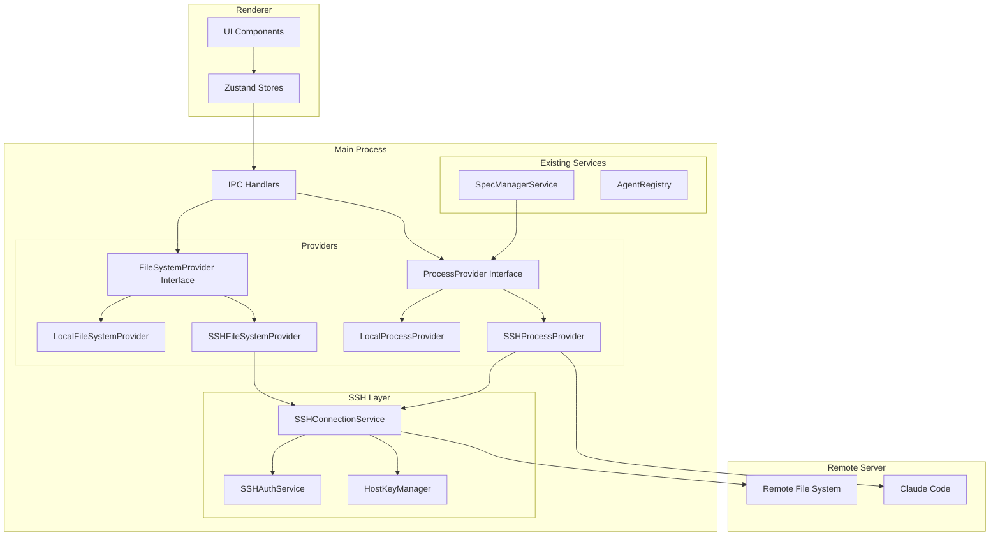
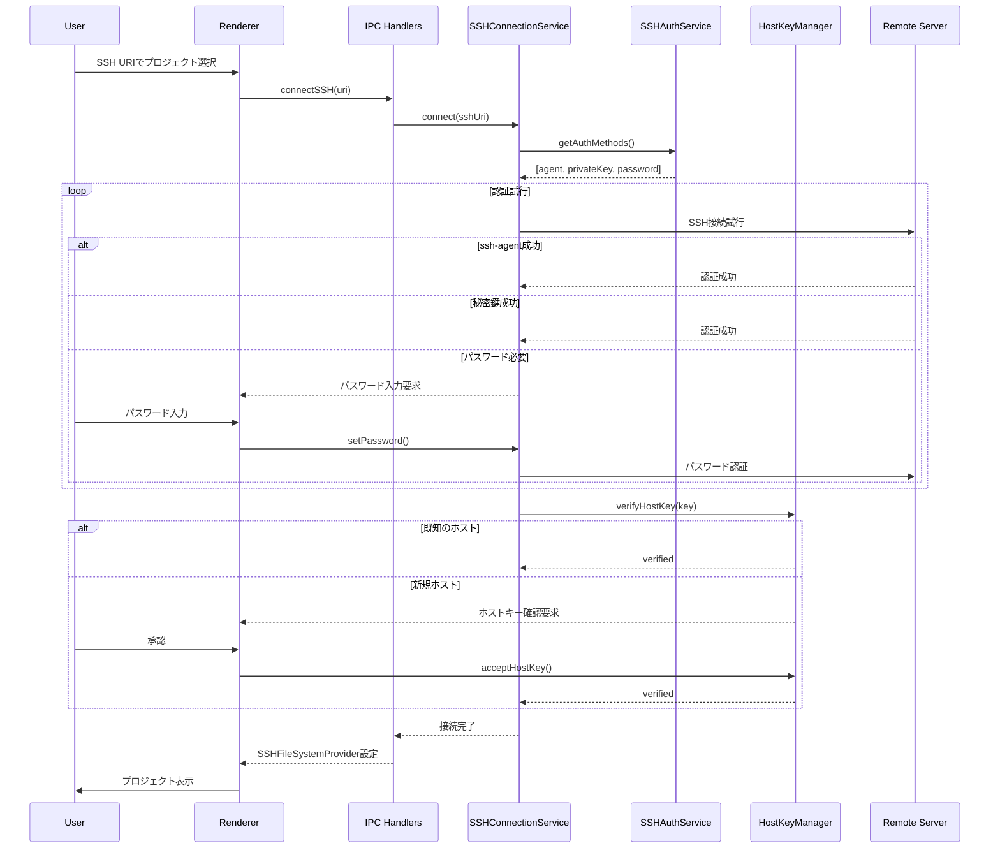
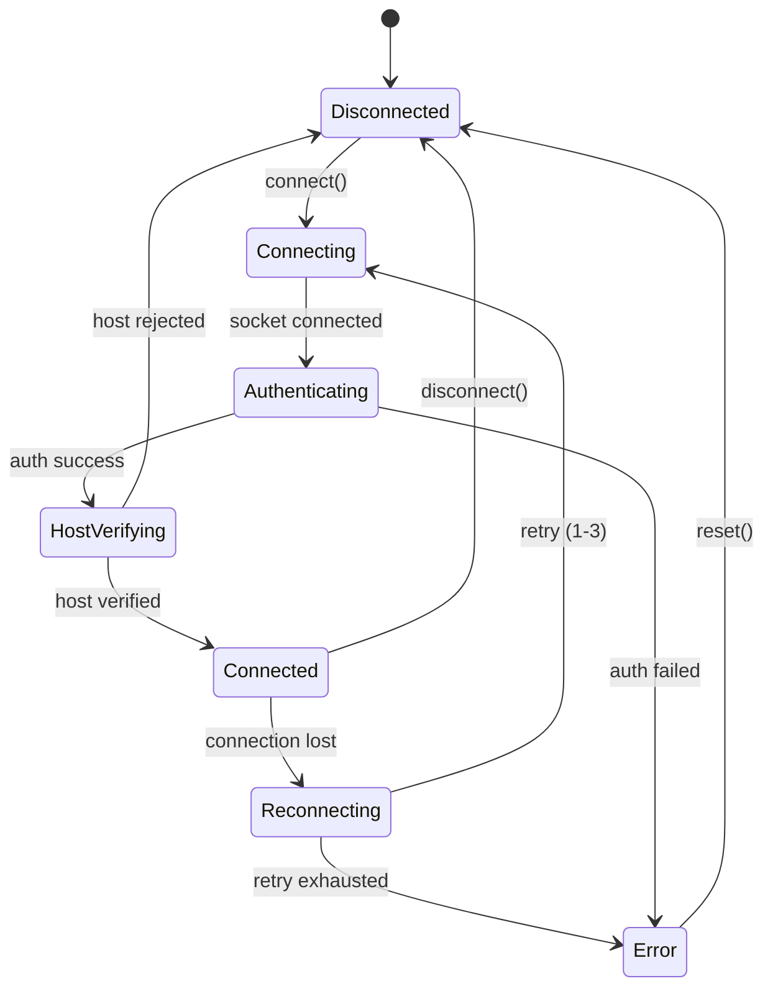
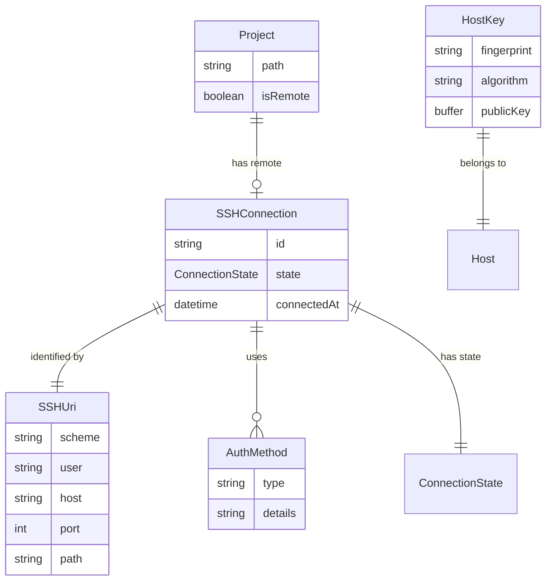

# Technical Design Document

## Overview

**Purpose**: SSHリモートプロジェクト機能は、SDD ManagerがSSH経由でリモートサーバー上のプロジェクトに接続し、ローカルプロジェクトと同様にSpec-Driven Developmentワークフローを実行できるようにする。

**Users**: ローカル環境とリモートサーバーの両方でプロジェクトを管理する開発者が、シームレスなプロジェクト切り替えとClaude Codeエージェントのリモート実行を利用する。

**Impact**: 既存のFileServiceとAgentProcessを抽象化レイヤー（Provider Pattern）で置き換え、ローカル/リモート両環境で透過的に動作する設計に変更する。

### Goals

- SSH URI形式でのリモートプロジェクト指定とシームレスな接続
- 複数の認証方式（ssh-agent、秘密鍵、パスワード）のサポート
- FileSystemProviderとProcessProviderによるローカル/リモート透過的操作
- リモートサーバー上でのClaude Codeエージェント実行
- 安定した接続状態管理と自動再接続

### Non-Goals

- SSHトンネリングやポートフォワーディング機能
- リモートサーバーへのClaude Codeの自動インストール
- 複数のリモートプロジェクトへの同時接続
- ローカル-リモート間のファイル同期機能
- GUIベースのSSH鍵生成・管理機能

## Architecture

### Existing Architecture Analysis

現在のSDD Manager (Electron版) は以下のパターンで構成されている：

- **サービス層** (`main/services/`): FileService、AgentProcess、CommandService等
- **IPC層** (`main/ipc/`): handlers.ts、channels.ts でrendererと通信
- **Zustand Store** (`renderer/stores/`): projectStore、specStore等で状態管理
- **既存の制約**:
  - FileServiceはNode.js fsモジュールに直接依存
  - AgentProcessはchild_processのspawnに直接依存
  - プロジェクトパスはすべてローカルファイルシステムを前提

### Architecture Pattern & Boundary Map



**Architecture Integration**:
- **Selected pattern**: Provider Pattern (Strategy Pattern) - ローカル/リモートの透過的切り替えを実現
- **Domain boundaries**: SSH接続管理（SSHConnectionService）とファイル/プロセス操作（Providers）を分離
- **Existing patterns preserved**: 既存のIPC通信パターン、Zustandによる状態管理、サービス層のシングルトンパターン
- **New components rationale**: Providerインターフェースにより既存コードへの影響を最小化しつつ拡張性を確保
- **Steering compliance**: structure.md のService Patternに従い、main/services/に新規サービスを配置

### Technology Stack

| Layer | Choice / Version | Role in Feature | Notes |
|-------|------------------|-----------------|-------|
| Backend / Services | ssh2 ^1.16.x | SSH接続とSFTPプロトコル実装 | 純粋JavaScript、Node.js 20+対応 |
| Backend / Services | @types/ssh2 ^1.15.x | TypeScript型定義 | ssh2の型安全性確保 |
| Data / Storage | electron-store ^8.x | 最近使用したプロジェクト保存 | 既存のconfigStoreを拡張 |
| Infrastructure / Runtime | Electron 28+ / Node.js 20+ | SSH接続のランタイム | mainプロセスでのみ実行 |

## System Flows

### SSH接続フロー



### 接続状態管理フロー



**Key Decisions**:
- 接続状態は6状態で管理、UIステータスバーに反映
- 自動再接続は最大3回、30秒間隔のkeep-aliveで接続維持

## Requirements Traceability

| Requirement | Summary | Components | Interfaces | Flows |
|-------------|---------|------------|------------|-------|
| 1.1-1.5 | SSH URI形式でのプロジェクト指定 | SSHUriParser, ProjectStore | parseSSHUri() | 接続フロー |
| 2.1-2.6 | SSH認証（agent, key, password） | SSHAuthService | getAuthMethods(), authenticate() | 接続フロー |
| 3.1-3.7 | FileSystemProvider抽象化 | FileSystemProvider, LocalFSProvider, SSHFSProvider | readFile(), writeFile(), watch() | - |
| 4.1-4.7 | ProcessProvider抽象化 | ProcessProvider, LocalProcProvider, SSHProcProvider | spawn(), exec(), kill() | - |
| 5.1-5.7 | Claude Codeリモート実行 | SSHProcessProvider, SpecManagerService | executeRemoteAgent() | リモート実行フロー |
| 6.1-6.7 | 接続状態管理 | SSHConnectionService, ConnectionStore | getStatus(), reconnect() | 状態管理フロー |
| 7.1-7.5 | プロジェクト切り替え | ProjectStore, ProviderFactory | switchProvider() | - |
| 8.1-8.6 | 最近使用したプロジェクト | ConfigStore, ProjectStore | saveRecentRemote() | - |
| 9.1-9.5 | セキュリティ（ホストキー） | HostKeyManager | verifyHostKey(), saveKnownHost() | 接続フロー |
| 10.1-10.5 | エラーハンドリング・ログ | Logger, SSHConnectionService | logSSHEvent() | - |

## Components and Interfaces

| Component | Domain/Layer | Intent | Req Coverage | Key Dependencies (P0/P1) | Contracts |
|-----------|--------------|--------|--------------|--------------------------|-----------|
| SSHConnectionService | SSH Layer | SSH接続のライフサイクル管理 | 2, 6, 9, 10 | ssh2 (P0), SSHAuthService (P0), HostKeyManager (P1) | Service, Event |
| SSHAuthService | SSH Layer | 認証方式の管理と実行 | 2.1-2.6 | - | Service |
| HostKeyManager | SSH Layer | ホストキーの検証と保存 | 9.1-9.5 | - | Service |
| FileSystemProvider | Providers | ファイル操作の抽象インターフェース | 3.1-3.7 | - | Service |
| LocalFileSystemProvider | Providers | ローカルファイル操作の実装 | 3.2 | fs (P0) | Service |
| SSHFileSystemProvider | Providers | SFTPによるリモートファイル操作 | 3.3-3.7 | SSHConnectionService (P0) | Service |
| ProcessProvider | Providers | プロセス実行の抽象インターフェース | 4.1-4.7 | - | Service |
| LocalProcessProvider | Providers | ローカルプロセス実行の実装 | 4.2 | child_process (P0) | Service |
| SSHProcessProvider | Providers | SSHによるリモートプロセス実行 | 4.3-4.7, 5 | SSHConnectionService (P0) | Service |
| SSHUriParser | Utilities | SSH URI形式の解析とバリデーション | 1.1-1.5 | - | Service |
| RemoteFileWatcher | Providers | ポーリングベースのリモートファイル監視 | 3.7 | SSHFileSystemProvider (P1) | Event |

### SSH Layer

#### SSHConnectionService

| Field | Detail |
|-------|--------|
| Intent | SSH接続の確立、維持、切断を管理し、接続状態を監視する |
| Requirements | 2.1, 6.1-6.7, 9.1-9.5, 10.1, 10.2 |

**Responsibilities & Constraints**
- SSH接続のライフサイクル全体を管理
- 接続状態（Disconnected, Connecting, Connected等）の遷移管理
- Keep-alive送信による接続維持（30秒間隔）
- 自動再接続ロジック（最大3回）

**Dependencies**
- Outbound: ssh2.Client - SSH接続の実装 (P0)
- Outbound: SSHAuthService - 認証処理の委譲 (P0)
- Outbound: HostKeyManager - ホストキー検証 (P1)

**Contracts**: Service [x] / API [ ] / Event [x] / Batch [ ] / State [ ]

##### Service Interface
```typescript
interface SSHConnectionService {
  connect(uri: SSHUri): Promise<Result<SSHConnection, SSHConnectionError>>;
  disconnect(): Promise<void>;
  getStatus(): ConnectionStatus;
  getSFTPClient(): Result<SFTPWrapper, SSHConnectionError>;
  executeCommand(command: string, options?: ExecOptions): Promise<Result<ExecResult, SSHConnectionError>>;
  onStatusChange(callback: (status: ConnectionStatus) => void): () => void;
}

type ConnectionStatus =
  | 'disconnected'
  | 'connecting'
  | 'authenticating'
  | 'host-verifying'
  | 'connected'
  | 'reconnecting'
  | 'error';

interface SSHConnectionError {
  type: 'AUTH_FAILED' | 'HOST_REJECTED' | 'NETWORK_ERROR' | 'TIMEOUT' | 'UNKNOWN';
  message: string;
  details?: Record<string, unknown>;
}
```
- Preconditions: SSHUriが有効であること
- Postconditions: 接続成功時はSFTPクライアントが利用可能
- Invariants: 同時に1つの接続のみ維持

##### Event Contract
- Published events: `status-change`, `connection-lost`, `reconnecting`
- Subscribed events: なし
- Delivery guarantees: 状態遷移時に必ず発火、順序保証

**Implementation Notes**
- Integration: 既存のhandlers.tsに接続管理用のIPCハンドラを追加
- Validation: SSHUriの事前検証、接続パラメータのバリデーション
- Risks: ネットワーク不安定時の接続断、keep-aliveのタイミング調整が必要

#### SSHAuthService

| Field | Detail |
|-------|--------|
| Intent | 複数の認証方式を管理し、フォールバックチェーンを実行する |
| Requirements | 2.1-2.6 |

**Responsibilities & Constraints**
- 認証方式の優先順位管理（agent → privateKey → password）
- デフォルト秘密鍵パス（~/.ssh/id_rsa, ~/.ssh/id_ed25519等）の自動検索
- パスフレーズ/パスワード入力のコールバック管理

**Dependencies**
- External: ssh-agent (system) - エージェント認証 (P1)

**Contracts**: Service [x] / API [ ] / Event [ ] / Batch [ ] / State [ ]

##### Service Interface
```typescript
interface SSHAuthService {
  getAuthMethods(host: string, username: string): Promise<AuthMethod[]>;
  createAuthHandler(
    onPasswordRequired: () => Promise<string>,
    onPassphraseRequired: (keyPath: string) => Promise<string>
  ): AuthHandler;
}

type AuthMethod =
  | { type: 'agent'; socketPath: string }
  | { type: 'privateKey'; keyPath: string; hasPassphrase: boolean }
  | { type: 'password' };

type AuthHandler = (
  methodsLeft: string[],
  partialSuccess: boolean | null,
  callback: (nextAuth: NextAuthConfig) => void
) => void;
```
- Preconditions: ホスト名とユーザー名が指定されていること
- Postconditions: 利用可能な認証方式のリストを返す
- Invariants: パスワード/パスフレーズはメモリに保持しない

#### HostKeyManager

| Field | Detail |
|-------|--------|
| Intent | リモートホストの公開鍵を検証し、known_hostsを管理する |
| Requirements | 9.1-9.5 |

**Responsibilities & Constraints**
- ~/.ssh/known_hostsの読み書き
- ホストキーフィンガープリントの計算と比較
- 新規ホスト/キー変更時のユーザー確認フロー

**Dependencies**
- Inbound: SSHConnectionService - ホストキー検証要求 (P0)

**Contracts**: Service [x] / API [ ] / Event [ ] / Batch [ ] / State [ ]

##### Service Interface
```typescript
interface HostKeyManager {
  verifyHostKey(
    host: string,
    port: number,
    key: Buffer
  ): Promise<HostKeyVerificationResult>;

  acceptHostKey(host: string, port: number, key: Buffer): Promise<void>;

  getFingerprint(key: Buffer, algorithm?: 'sha256' | 'md5'): string;
}

type HostKeyVerificationResult =
  | { status: 'known'; fingerprint: string }
  | { status: 'unknown'; fingerprint: string }
  | { status: 'changed'; oldFingerprint: string; newFingerprint: string };
```

### Providers

#### FileSystemProvider

| Field | Detail |
|-------|--------|
| Intent | ファイルシステム操作の抽象インターフェースを定義する |
| Requirements | 3.1, 3.4 |

**Responsibilities & Constraints**
- ローカル/リモート両環境で共通のインターフェース提供
- すべての操作はPromiseを返す
- パス解決は各実装に委譲

**Contracts**: Service [x] / API [ ] / Event [ ] / Batch [ ] / State [ ]

##### Service Interface
```typescript
interface FileSystemProvider {
  readonly type: 'local' | 'ssh';

  readFile(path: string): Promise<Result<string, FSError>>;
  writeFile(path: string, content: string): Promise<Result<void, FSError>>;
  readDir(path: string): Promise<Result<DirEntry[], FSError>>;
  stat(path: string): Promise<Result<FileStat, FSError>>;
  mkdir(path: string, options?: { recursive?: boolean }): Promise<Result<void, FSError>>;
  rm(path: string, options?: { recursive?: boolean }): Promise<Result<void, FSError>>;
  exists(path: string): Promise<boolean>;
  watch(path: string, callback: (event: WatchEvent) => void): WatchHandle;
}

interface DirEntry {
  name: string;
  isDirectory: boolean;
  isFile: boolean;
}

interface FileStat {
  size: number;
  mtime: Date;
  isDirectory: boolean;
  isFile: boolean;
}

interface WatchEvent {
  type: 'add' | 'change' | 'unlink';
  path: string;
}

type FSError =
  | { type: 'NOT_FOUND'; path: string }
  | { type: 'PERMISSION_DENIED'; path: string }
  | { type: 'TIMEOUT'; path: string }
  | { type: 'CONNECTION_LOST' }
  | { type: 'UNKNOWN'; message: string };
```

#### SSHFileSystemProvider

| Field | Detail |
|-------|--------|
| Intent | SFTPプロトコルを使用したリモートファイル操作を実装する |
| Requirements | 3.3-3.7 |

**Responsibilities & Constraints**
- SFTPクライアントを介したファイル操作
- 接続断時の自動再接続とリトライ
- タイムアウト管理（操作ごとに30秒）

**Dependencies**
- Outbound: SSHConnectionService - SFTP接続の取得 (P0)

**Contracts**: Service [x] / API [ ] / Event [ ] / Batch [ ] / State [ ]

**Implementation Notes**
- Integration: SSHConnectionServiceから取得したSFTPクライアントを使用
- Validation: パス形式の検証（絶対パスのみ許可）
- Risks: 大きなファイルの転送時のメモリ使用量、タイムアウト設定の調整

#### ProcessProvider

| Field | Detail |
|-------|--------|
| Intent | プロセス実行の抽象インターフェースを定義する |
| Requirements | 4.1, 4.4-4.7 |

**Contracts**: Service [x] / API [ ] / Event [ ] / Batch [ ] / State [ ]

##### Service Interface
```typescript
interface ProcessProvider {
  readonly type: 'local' | 'ssh';

  spawn(
    command: string,
    args: string[],
    options: SpawnOptions
  ): Promise<Result<ProcessHandle, ProcessError>>;

  exec(
    command: string,
    options?: ExecOptions
  ): Promise<Result<ExecResult, ProcessError>>;
}

interface SpawnOptions {
  cwd: string;
  env?: Record<string, string>;
}

interface ProcessHandle {
  readonly pid: number;
  readonly isRunning: boolean;

  onOutput(callback: (stream: 'stdout' | 'stderr', data: string) => void): void;
  onExit(callback: (code: number) => void): void;
  kill(signal?: NodeJS.Signals): void;
  writeStdin(data: string): void;
}

interface ExecResult {
  stdout: string;
  stderr: string;
  exitCode: number;
}

type ProcessError =
  | { type: 'SPAWN_ERROR'; message: string }
  | { type: 'CONNECTION_LOST' }
  | { type: 'COMMAND_NOT_FOUND'; command: string }
  | { type: 'PERMISSION_DENIED' }
  | { type: 'TIMEOUT' };
```

#### SSHProcessProvider

| Field | Detail |
|-------|--------|
| Intent | SSHコマンド実行チャネルを使用したリモートプロセス実行を実装する |
| Requirements | 4.3-4.7, 5.1-5.7 |

**Responsibilities & Constraints**
- SSH exec/shellチャネルを介したコマンド実行
- リモートプロセスのPID追跡
- シグナル送信によるプロセス制御

**Dependencies**
- Outbound: SSHConnectionService - SSHチャネルの取得 (P0)

**Contracts**: Service [x] / API [ ] / Event [x] / Batch [ ] / State [ ]

##### Event Contract
- Published events: `output`, `exit`, `error`
- Subscribed events: なし
- Delivery guarantees: 出力は到着順に発火、終了コードは必ず通知

**Implementation Notes**
- Integration: 既存のAgentProcessインターフェースと互換性を保つ
- Validation: コマンドのホワイトリスト検証を継承
- Risks: リモートプロセスのPID取得が環境依存、接続断時のプロセス孤立

### Utilities

#### SSHUriParser

| Field | Detail |
|-------|--------|
| Intent | SSH URI形式の文字列を解析し、接続パラメータを抽出する |
| Requirements | 1.1-1.5 |

**Contracts**: Service [x] / API [ ] / Event [ ] / Batch [ ] / State [ ]

##### Service Interface
```typescript
interface SSHUriParser {
  parse(uri: string): Result<SSHUri, SSHUriError>;
  stringify(uri: SSHUri): string;
  isValid(uri: string): boolean;
}

interface SSHUri {
  readonly scheme: 'ssh';
  readonly user: string;
  readonly host: string;
  readonly port: number;
  readonly path: string;
}

type SSHUriError =
  | { type: 'INVALID_SCHEME'; found: string }
  | { type: 'MISSING_USER' }
  | { type: 'MISSING_HOST' }
  | { type: 'INVALID_PORT'; found: string }
  | { type: 'INVALID_PATH'; found: string };
```

## Data Models

### Domain Model



**Aggregates and Boundaries**:
- `Project` は集約ルート、リモート接続情報を持つ
- `SSHConnection` はプロジェクトに属する接続状態を管理
- `HostKey` は独立したエンティティ、known_hostsで永続化

**Business Rules**:
- 1つのプロジェクトに対して1つのSSH接続のみ
- 認証情報（パスワード/パスフレーズ）はメモリ上でのみ保持
- ホストキーは初回接続時にユーザー承認が必要

### Logical Data Model

**RecentRemoteProject (ConfigStore拡張)**:
```typescript
interface RecentRemoteProject {
  readonly uri: string;           // ssh://user@host:port/path
  readonly displayName: string;   // ホスト名またはエイリアス
  readonly lastConnectedAt: string;
  readonly connectionSuccessful: boolean;
}
```

**Storage Location**: `electron-store` の既存設定に追加
**Constraints**: 最大10件、パスワード/パスフレーズは保存しない

## Error Handling

### Error Strategy

SSH関連のエラーは以下のカテゴリで処理：

### Error Categories and Responses

**Network Errors** (CONNECTION_LOST, TIMEOUT):
- 自動再接続を3回まで試行
- 再接続中はUIにローディング状態を表示
- 失敗時は手動再接続ボタンを表示

**Authentication Errors** (AUTH_FAILED):
- 認証方式を順次試行（agent → key → password）
- 全て失敗時はエラーダイアログと認証情報の再入力を促す
- 詳細なエラー理由をログに記録

**Host Verification Errors** (HOST_REJECTED, HOST_CHANGED):
- 新規ホスト: フィンガープリント確認ダイアログを表示
- キー変更: 警告ダイアログ（セキュリティリスク説明）を表示
- ユーザー選択: 承認/拒否/セッション限定承認

**Remote Process Errors** (SPAWN_ERROR, COMMAND_NOT_FOUND):
- Claude Codeがインストールされていない場合のガイダンス表示
- コマンド実行失敗時のエラーログ詳細表示

### Monitoring

- SSH接続イベント（接続、切断、再接続）をlogger経由で記録
- デバッグモード時はSSHプロトコルレベルのログを出力
- 接続時間とデータ転送量をUIステータスバーに表示

## Testing Strategy

### Unit Tests
- SSHUriParser: 各種URI形式のパース、バリデーション
- HostKeyManager: フィンガープリント計算、known_hosts読み書き
- SSHAuthService: 認証方式の優先順位、設定読み込み

### Integration Tests
- SSHConnectionService: モックサーバーへの接続、認証フロー
- SSHFileSystemProvider: SFTPファイル操作（read/write/stat）
- SSHProcessProvider: リモートコマンド実行、出力ストリーミング

### E2E Tests
- SSH URI入力からプロジェクト表示までの完全フロー
- リモートでのClaude Codeエージェント実行
- 接続断→再接続のリカバリーフロー

## Security Considerations

### Threat Modeling
- **MITM攻撃**: ホストキー検証を必須化し、変更時は警告を表示
- **認証情報漏洩**: パスワード/パスフレーズはメモリ上のみ、使用後即座にクリア
- **不正なコマンド実行**: 既存のコマンドホワイトリストを継続適用

### Security Controls
- ホストキー検証: デフォルトで有効、検証なしの接続は不可
- 暗号化アルゴリズム: AES-256-GCM、ChaCha20-Poly1305を優先
- known_hostsファイル: 標準の~/.ssh/known_hostsを使用
- ssh-agent連携: システムのssh-agentを利用、独自の鍵保存はしない

## Performance & Scalability

### Target Metrics
- SSH接続確立: 5秒以内（ネットワーク遅延を除く）
- ファイル読み込み（10KB以下）: 1秒以内
- ディレクトリリスト取得: 2秒以内

### Optimization Techniques
- SFTPセッションの再利用（接続ごとに1セッション）
- ディレクトリリストのキャッシュ（5秒間有効）
- 大きなファイルのストリーミング読み込み
