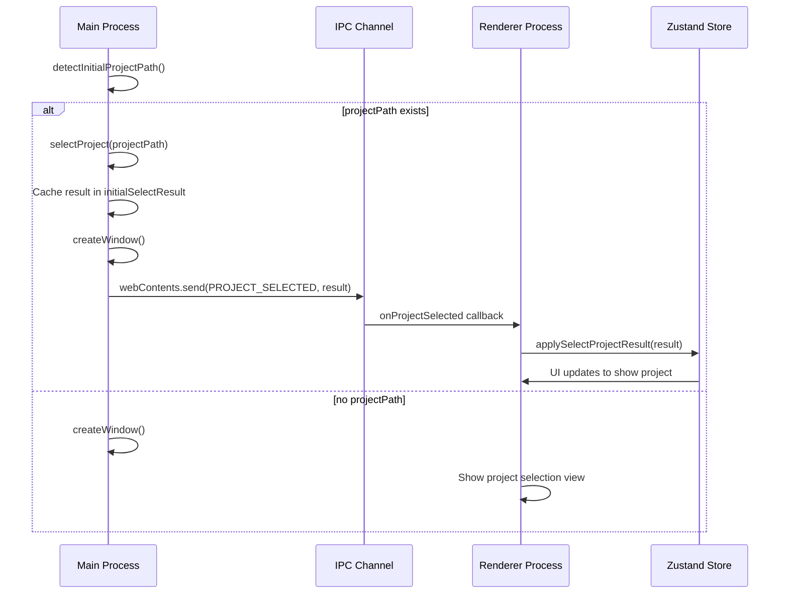
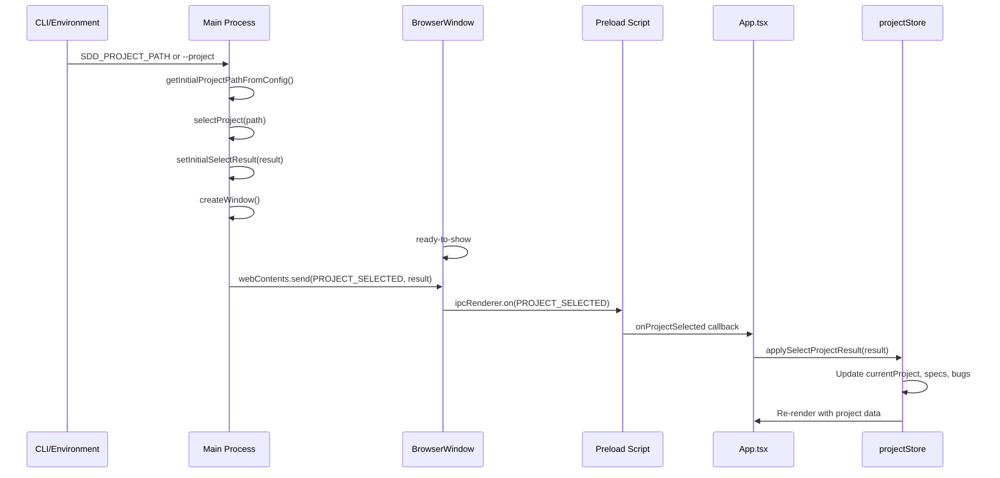

# Design: 起動時プロジェクト選択シーケンス修正

## Overview

**Purpose**: 環境変数（`SDD_PROJECT_PATH`）やCLI引数でプロジェクトパスが指定された場合、Main processで完了した`selectProject`の結果をRendererのZustandストアに正しく反映させ、プロジェクト選択済みの状態でUIを表示する。

**Users**: SDD Orchestratorを環境変数やCLI引数経由で起動するユーザー、E2Eテスト。

**Impact**: Main processからRendererへのブロードキャスト機構を追加し、起動時シーケンスを修正。既存のUIからのプロジェクト選択フローには影響しない。

### Goals

- 起動時にMain processで実行された`selectProject`の結果をRendererに反映する
- 統一されたストア更新処理で起動時ブロードキャストとUI選択の両方を処理する
- 既存のE2Eテスト互換性を維持する

### Non-Goals

- Main process側の`selectProject`ロジックの変更
- UIからのプロジェクト選択フローの変更
- Remote UIへの起動時ブロードキャスト（Remote UIは接続時に取得する既存フロー）

## Architecture

### Existing Architecture Analysis

現在のアーキテクチャでは以下の問題がある：

```
[Current Flow]
1. Main process: SDD_PROJECT_PATH検出 → selectProject()実行 → 結果をログ出力
2. Main process: createWindow() → Renderer起動
3. Renderer: 初期化 → currentProject === null → 「プロジェクトを開く」画面表示
4. Renderer: getInitialProjectPath() → パス取得 → selectProject() 再呼出 → ロック競合
```

問題点：
- Main processで完了した`selectProject`結果がRendererに伝達されない
- Rendererが`selectProject`を再呼び出しするとロック競合が発生

### Architecture Pattern & Boundary Map



**Key Decisions**:
- Main processが起動時の`selectProject`結果をキャッシュし、ウィンドウ作成後にブロードキャスト
- Rendererは`PROJECT_SELECTED`イベントを受信し、統一処理でストア更新
- Rendererは`getInitialProjectPath`で起動時パスを確認するが、Main processが既にブロードキャストした場合は再呼び出ししない

**Architecture Integration**:
- Selected pattern: Event-driven broadcast（既存のAGENT_STATUS_CHANGE等と同様）
- Domain/feature boundaries: Main processがセッション状態のSSOT、Rendererはキャッシュとして保持
- Existing patterns preserved: `webContents.send`によるブロードキャスト、preload経由のイベント登録
- New components rationale: `applySelectProjectResult`は既存の`selectProject`アクションから抽出
- Steering compliance: structure.md「セッション状態はMain processが保持」「Main → Rendererへのブロードキャスト」に準拠

### Technology Stack

| Layer | Choice / Version | Role in Feature | Notes |
|-------|------------------|-----------------|-------|
| IPC | Electron IPC | Main→Renderer broadcast | 既存パターンを踏襲 |
| State | Zustand | Renderer state management | projectStore拡張 |

## System Flows

### 起動時プロジェクト選択フロー



**Key Decisions**:
- `ready-to-show`イベント後にブロードキャストすることで、Rendererがイベントリスナーを登録済みであることを保証
- `setInitialSelectResult`でMain processが結果をキャッシュし、ウィンドウ作成後のブロードキャストに使用
- `applySelectProjectResult`を抽出して、起動時とUI選択の両方で同じ処理を使用

## Requirements Traceability

| Criterion ID | Summary | Components | Implementation Approach |
|--------------|---------|------------|------------------------|
| 1.1 | 環境変数指定時にMain processがselectProjectを実行しキャッシュ | handlers.ts, index.ts | 既存selectProject結果をinitialSelectResultに保存 |
| 1.2 | ウィンドウ作成後にブロードキャスト | index.ts | ready-to-show後にwebContents.send |
| 1.3 | Rendererがブロードキャスト受信時にストア更新 | projectStore.ts, App.tsx | onProjectSelectedリスナー登録、applySelectProjectResult呼び出し |
| 1.4 | ストア更新完了時にUI表示 | projectStore.ts | 既存のReact再描画で対応 |
| 2.1 | SelectProjectResultを受け取る単一処理 | projectStore.ts | applySelectProjectResult関数を抽出 |
| 2.2 | 起動時ブロードキャスト受信時に統一処理使用 | App.tsx, projectStore.ts | applySelectProjectResult呼び出し |
| 2.3 | UIからのプロジェクト選択時に統一処理使用 | projectStore.ts | 既存selectProjectアクションをapplySelectProjectResult使用に変更 |
| 2.4 | 統一処理がspecs/bugsストア更新等を行う | projectStore.ts | 既存ロジックを移行 |
| 3.1 | E2EテストがSDD_PROJECT_PATH指定起動 | - | 変更なし（既存フローで動作） |
| 3.2 | E2EテストがselectProjectViaStore使用 | - | 変更なし（IPCハンドラー経由は維持） |
| 3.3 | 起動時とUI選択で同じ最終状態を保証 | projectStore.ts | applySelectProjectResultで統一 |
| 4.1 | 起動時ブロードキャストはElectron Rendererのみ対象 | index.ts | webContents.sendはElectron BrowserWindowのみ |
| 4.2 | Remote UIは従来通りWebSocket経由 | - | 変更なし |
| 4.3 | 起動時ブロードキャストとRemote UI通信を独立処理 | index.ts | 別チャネル、別タイミング |

### Coverage Validation Checklist

- [x] Every criterion ID from requirements.md appears in the table above
- [x] Each criterion has specific component names (not generic references)
- [x] Implementation approach distinguishes "reuse existing" vs "new implementation"
- [x] User-facing criteria specify concrete UI components

## Components and Interfaces

| Component | Domain/Layer | Intent | Req Coverage | Key Dependencies | Contracts |
|-----------|--------------|--------|--------------|------------------|-----------|
| index.ts (Main) | Main/Bootstrap | 起動時ブロードキャストの実行 | 1.1, 1.2, 4.1 | handlers.ts (P0) | Event |
| handlers.ts | Main/IPC | selectProject結果のキャッシュ管理 | 1.1 | - | Service |
| channels.ts | Main/IPC | PROJECT_SELECTEDチャネル定義 | 1.2 | - | - |
| preload/index.ts | Preload | onProjectSelectedリスナー公開 | 1.3 | - | API |
| projectStore.ts | Renderer/Store | applySelectProjectResult統一処理 | 2.1-2.4, 3.3 | specStore (P0), bugStore (P0) | State |
| App.tsx | Renderer/UI | 起動時リスナー登録 | 1.3, 1.4 | projectStore (P0) | - |

### Main Process / Bootstrap

#### index.ts (Main Process Entry)

| Field | Detail |
|-------|--------|
| Intent | 起動時selectProject結果をRendererにブロードキャスト |
| Requirements | 1.1, 1.2, 4.1 |

**Responsibilities & Constraints**
- 起動時の`selectProject`結果をキャッシュ変数に保存
- ウィンドウの`ready-to-show`イベント後に`PROJECT_SELECTED`チャネルでブロードキャスト
- Remote UIには影響しない（webContents.sendはElectron BrowserWindowのみ）

**Dependencies**
- Inbound: handlers.ts/selectProject - 結果取得 (P0)
- Outbound: BrowserWindow.webContents - ブロードキャスト送信 (P0)

**Contracts**: Event [ x ]

##### Event Contract
- Published events: `PROJECT_SELECTED` - SelectProjectResult payload
- Ordering / delivery guarantees: ウィンドウready-to-show後に1回のみ送信

### Main Process / IPC

#### handlers.ts (IPC Handlers)

| Field | Detail |
|-------|--------|
| Intent | selectProject結果のキャッシュ変数管理 |
| Requirements | 1.1 |

**Responsibilities & Constraints**
- `initialSelectResult`変数で起動時の`selectProject`結果をキャッシュ
- `getInitialSelectResult()`でindex.tsからキャッシュを取得可能に
- 既存の`selectProject`関数は変更なし

**Dependencies**
- Outbound: index.ts - 結果提供 (P0)

**Contracts**: Service [ x ]

##### Service Interface
```typescript
// handlers.ts exports
let initialSelectResult: SelectProjectResult | null = null;

function setInitialSelectResult(result: SelectProjectResult): void;
function getInitialSelectResult(): SelectProjectResult | null;
function clearInitialSelectResult(): void;
```

- Preconditions: None
- Postconditions: 結果がキャッシュに保存/取得/クリアされる
- Invariants: キャッシュはselectProject完了後のみ設定される

### Renderer / Store

#### projectStore.ts

| Field | Detail |
|-------|--------|
| Intent | SelectProjectResult適用の統一処理を提供 |
| Requirements | 2.1, 2.2, 2.3, 2.4, 3.3 |

**Responsibilities & Constraints**
- `applySelectProjectResult(result: SelectProjectResult)`: 共通のストア更新ロジック
- 既存の`selectProject`アクションから更新ロジックを抽出
- specs/bugsストア同期、ファイルウォッチャー開始、各種チェックを実行

**Dependencies**
- Outbound: specStore - Spec一覧同期 (P0)
- Outbound: bugStore - Bug一覧同期 (P0)
- Outbound: agentStore - Agent選択クリア (P1)

**Contracts**: State [ x ]

##### State Management
- State model: `SelectProjectResult`を受け取り、currentProject, kiroValidation等を更新
- Persistence & consistency: Zustandストアはメモリのみ（Main processがSSOT）
- Concurrency strategy: 同時呼び出しはない想定（起動時は1回、UI選択時は排他制御済み）

##### Service Interface
```typescript
interface ProjectActions {
  // 既存
  selectProject: (path: string) => Promise<void>;

  // 新規: 統一結果適用処理
  applySelectProjectResult: (result: SelectProjectResult) => Promise<void>;
}
```

- Preconditions: `result.success === true`の場合のみストア更新
- Postconditions: currentProject, specs, bugs等がresultの内容で更新される
- Invariants: 成功時は必ずcurrentProjectが設定される

**Implementation Notes**
- Integration: 既存の`selectProject`アクションの更新部分を`applySelectProjectResult`に抽出し、`selectProject`からも呼び出す
- Validation: `result.success`チェックは`applySelectProjectResult`内で行う
- Risks: なし（既存ロジックの抽出のみ）

### Preload

#### preload/index.ts

| Field | Detail |
|-------|--------|
| Intent | PROJECT_SELECTEDイベントリスナーをRendererに公開 |
| Requirements | 1.3 |

**Responsibilities & Constraints**
- `onProjectSelected(callback)`でリスナー登録APIを公開
- 既存の`onAgentStatusChange`等と同様のパターン

**Contracts**: API [ x ]

##### Service Interface
```typescript
// electronAPI extension
onProjectSelected: (
  callback: (result: SelectProjectResult) => void
) => () => void;  // Returns cleanup function
```

- Preconditions: None
- Postconditions: コールバックがPROJECT_SELECTEDイベントで呼び出される
- Invariants: クリーンアップ関数呼び出しでリスナー解除

### Renderer / UI

#### App.tsx

Summary Row: 起動時に`onProjectSelected`リスナーを登録し、受信時に`applySelectProjectResult`を呼び出す。

**Implementation Note**: 既存の`setupEventListeners` useEffectパターンを踏襲。

## Data Models

### Domain Model

変更なし。既存の`SelectProjectResult`型をそのまま使用。

## Error Handling

### Error Strategy

| Error Scenario | Handling |
|----------------|----------|
| ブロードキャスト時にウィンドウが破棄済み | `window.isDestroyed()`チェックでスキップ |
| applySelectProjectResult時のエラー | 既存のselectProjectと同様にerrorステートを設定 |

### Monitoring

既存のprojectLoggerでのログ出力を使用。

## Testing Strategy

### Unit Tests

- `projectStore.applySelectProjectResult`: 成功/失敗ケースのストア更新検証
- `handlers.setInitialSelectResult/getInitialSelectResult`: キャッシュ動作検証

### Integration Tests

- Main→Renderer broadcast: IPC経由でのイベント受信と処理
- 起動時フロー統合: SDD_PROJECT_PATH設定時の全体フロー

### E2E Tests

- 既存E2Eテストの継続動作確認（regression test）

## Verification Contract

### User Journey Definition

| Journey ID | Operation Flow | Expected Result | E2E Required |
|------------|----------------|-----------------|--------------|
| UJ-001 | 環境変数SDD_PROJECT_PATHを設定してアプリ起動 | 指定プロジェクトが選択された状態でUI表示 | Yes |
| UJ-002 | CLI引数--projectでプロジェクト指定して起動 | 指定プロジェクトが選択された状態でUI表示 | Yes |
| UJ-003 | 起動後にUIからプロジェクト選択 | 選択したプロジェクトが正しく表示される | Yes |

### Impact Analysis Contract

| Target File | Action | Reason |
|-------------|--------|--------|
| electron-sdd-manager/src/main/index.ts | UPDATE | 起動時ブロードキャスト追加 |
| electron-sdd-manager/src/main/ipc/handlers.ts | UPDATE | initialSelectResultキャッシュ追加 |
| electron-sdd-manager/src/main/ipc/channels.ts | UPDATE | PROJECT_SELECTEDチャネル追加 |
| electron-sdd-manager/src/preload/index.ts | UPDATE | onProjectSelected API追加 |
| electron-sdd-manager/src/renderer/stores/projectStore.ts | UPDATE | applySelectProjectResult抽出 |
| electron-sdd-manager/src/renderer/App.tsx | UPDATE | 起動時リスナー登録追加 |
| electron-sdd-manager/src/renderer/types/electron.d.ts | UPDATE | onProjectSelected型定義追加 |

## Integration Test Strategy

### Components
- Main Process (index.ts, handlers.ts)
- IPC Channel (PROJECT_SELECTED)
- Renderer (App.tsx, projectStore)

### Data Flow
Main process selectProject完了 → initialSelectResultキャッシュ → createWindow → ready-to-show → webContents.send → preload listener → App.tsx callback → projectStore.applySelectProjectResult → ストア更新

### Mock Boundaries
- Mock: ファイルシステム操作（readSpecs, readBugs）
- Real: IPC transport（実際のipcRenderer/ipcMain）
- Real: Zustand store

### Verification Points
- `projectStore.currentProject`が期待するパスに設定される
- `projectStore.specs`が期待するSpec一覧を含む
- `projectStore.bugs`が期待するBug一覧を含む

### Robustness Strategy
- `waitFor`パターンでストア状態遷移を待機
- ready-to-showイベント発火を待ってからブロードキャスト検証
- Fixed sleepは使用しない

### Prerequisites
- 既存のE2Eテストインフラを使用（WebdriverIO）
- 新規ヘルパーは不要

## Interface Changes & Impact Analysis

### New IPC Channel: PROJECT_SELECTED

- **Type**: Main → Renderer broadcast
- **Payload**: `SelectProjectResult`
- **Existing Callers**: None (new channel)

### New API: electronAPI.onProjectSelected

- **Parameters**: `callback: (result: SelectProjectResult) => void`
- **Return**: `() => void` (cleanup function)
- **Existing Callers**: None (new API)

### Modified Function: projectStore.selectProject

- **Change**: 内部でapplySelectProjectResultを呼び出すようにリファクタリング
- **Parameter Change**: None
- **Existing Callers**:
  - `App.tsx`: menu event handler (変更不要)
  - `ProjectSelectionView.tsx`: 手動選択 (変更不要)
  - `RecentProjectList.tsx`: 履歴選択 (変更不要)
- **Impact**: 内部実装変更のみ、外部インターフェースは維持

## Design Decisions

### DD-001: Main ProcessからのPush型ブロードキャスト

| Field | Detail |
|-------|--------|
| Status | Accepted |
| Context | Main processで完了したselectProject結果をRendererに伝達する方法が必要 |
| Decision | `webContents.send`によるPush型ブロードキャストを使用 |
| Rationale | structure.mdの「Main → Rendererへのブロードキャスト」パターンに準拠。既存のAGENT_STATUS_CHANGE等と同様のパターンで一貫性を保つ |
| Alternatives Considered | 1) RendererからのPull（getInitialSelectResult IPC）: タイミング問題が残る 2) Main processで遅延実行: 起動シーケンスが複雑化 |
| Consequences | Rendererでリスナー登録が必要。ready-to-show後にブロードキャストすることでリスナー登録完了を保証 |

### DD-002: applySelectProjectResult抽出による統一処理

| Field | Detail |
|-------|--------|
| Status | Accepted |
| Context | 起動時ブロードキャストとUIからの選択で同じストア更新処理が必要（Requirement 2.1-2.4） |
| Decision | 既存のselectProjectアクションから更新ロジックを`applySelectProjectResult`として抽出 |
| Rationale | DRY原則。動作の一貫性保証。既存の動作を変更せずにリファクタリング可能 |
| Alternatives Considered | 1) selectProjectアクションを直接呼び出す: IPC呼び出しが重複する 2) 個別実装: コード重複、動作不一致リスク |
| Consequences | selectProjectアクションの内部実装変更。外部インターフェースは維持 |

### DD-003: ready-to-show後のブロードキャストタイミング

| Field | Detail |
|-------|--------|
| Status | Accepted |
| Context | Rendererがリスナーを登録する前にブロードキャストすると受信できない |
| Decision | BrowserWindowのready-to-showイベント後にブロードキャスト |
| Rationale | ready-to-showはDOMContentLoaded後に発火するため、Reactアプリの初期化とリスナー登録が完了している |
| Alternatives Considered | 1) 固定delay: 不安定、環境依存 2) Renderer準備完了通知: 往復通信が必要 |
| Consequences | ready-to-showイベントハンドラー内でブロードキャスト処理を実行 |
