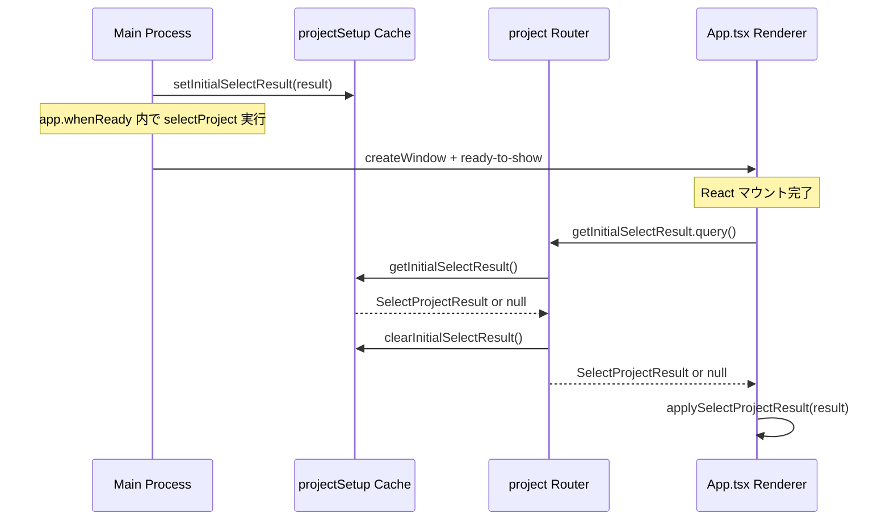
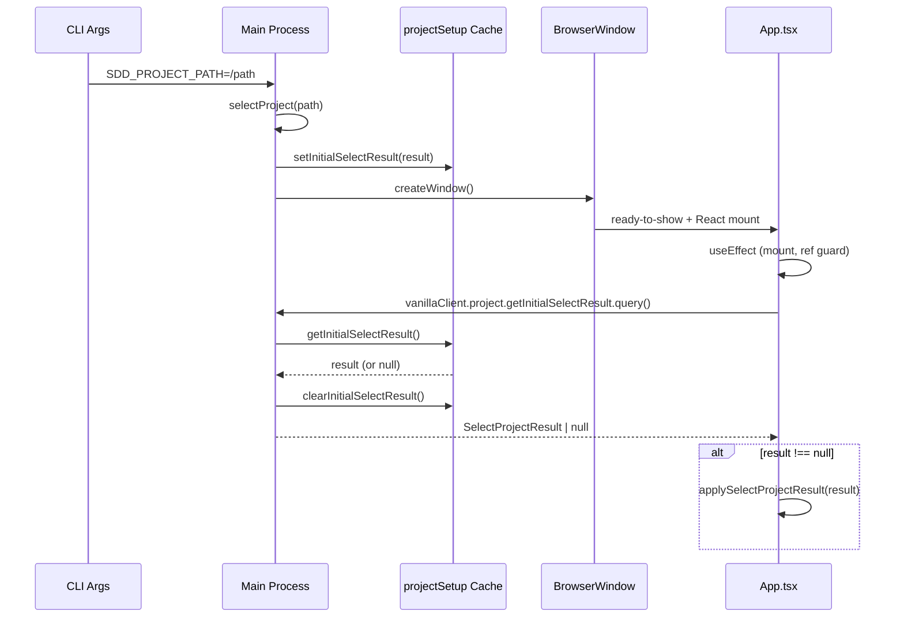

# Design: 起動時プロジェクト選択のレースコンディション修正

## Overview

**Purpose**: 起動時の `SDD_PROJECT_PATH` 環境変数によるプロジェクト自動選択において、Main process が `ready-to-show` イベントで EventBus 経由で `PROJECT_SELECTED` を emit するタイミングと、Renderer の tRPC Subscription 確立タイミングのレースコンディションを根本解消する。

**Users**: SDD Orchestrator を CLI 引数付きで起動する開発者（特に E2E テスト環境）。

**Impact**: Push モデル（EventBus emit）を Pull モデル（tRPC query）に置換し、関連する不要なコード（`broadcastInitialProjectSelection`、`onProjectSelected` Subscription、`EVENT_NAMES.PROJECT_SELECTED`）を除去する。

### Goals

- Renderer がマウント完了後に自発的に起動時プロジェクト選択結果を取得する Pull モデルへの移行
- レースコンディションの構造的な解消（タイミング依存の除去）
- Push モデルの不要コードの完全除去によるコードベースの簡潔化

### Non-Goals

- マルチウィンドウ対応
- Remote UI への初期プロジェクト選択通知
- tRPC Subscription の汎用的な初期化順序保証

## Architecture

### Existing Architecture Analysis

現在の起動時プロジェクト選択は以下のフローで動作する:

1. Main process が `app.whenReady()` 内で `selectProject()` を実行しキャッシュ
2. `createWindow()` で BrowserWindow を生成
3. `ready-to-show` イベントで `broadcastInitialProjectSelection()` が `eventBus.emit(PROJECT_SELECTED)` を実行
4. Renderer の `App.tsx` が `trpc.events.onProjectSelected.useSubscription()` でイベントを受信

**問題点**: ステップ 3 の emit タイミングでステップ 4 の Subscription がまだ確立されていない場合、イベントが消失する。

### Architecture Pattern & Boundary Map



**Key Decisions**:
- Pull モデルにより Renderer のマウント完了が前提条件として保証される
- キャッシュは1回限りの read-and-clear セマンティクスで、重複適用を防止
- 既存の `projectSetup.ts` キャッシュ基盤を再利用し、アクセス方法のみ変更

**Architecture Integration**:
- Selected pattern: Pull (tRPC query) -- Renderer が自発的にデータを取得
- Existing patterns preserved: tRPC Context DI パターン、vanillaClient パターン
- New components rationale: `getInitialSelectResult` query のみ追加（既存 project router の拡張）
- Steering compliance: DRY（キャッシュ基盤再利用）、KISS（Subscription 不要化）

### Technology Stack

| Layer | Choice / Version | Role in Feature | Notes |
|-------|------------------|-----------------|-------|
| Backend / Services | tRPC query (project router) | Pull API エンドポイント | 既存 router パターンに準拠 |
| Data / Storage | projectSetup.ts in-memory cache | 起動時選択結果の一時保持 | 既存実装を再利用 |
| Frontend | React useEffect + vanillaClient | マウント後の1回限り Pull | useRef で重複防止 |

## System Flows

### Pull モデルによる起動時プロジェクト選択



**Key Decisions**:
- `useRef` ガードにより StrictMode での二重実行を防止
- query 内で get + clear をアトミックに実行し、2回目以降の呼び出しでは null を返却
- エラー時は `console.error` のみで、アプリケーションのクラッシュを防止

## Requirements Traceability

| Criterion ID | Summary | Components | Implementation Approach |
|--------------|---------|------------|------------------------|
| 1.1 | `getInitialSelectResult` query 追加 | `project.ts` router | 新規 query プロシージャ追加 |
| 1.2 | キャッシュ取得 + クリア | `project.ts` router | `ctx.services` 経由で get -> clear |
| 1.3 | キャッシュ null 時は null 返却 | `project.ts` router | 条件分岐 |
| 1.4 | `ContextServices` に getter/clearer 追加 | `context.ts` | インターフェース拡張 |
| 1.5 | `createDefaultServices` にデフォルト実装追加 | `context.ts` | `() => null` / `() => {}` |
| 2.1 | `useEffect` で query 呼び出し | `App.tsx` | vanillaClient 使用 |
| 2.2 | 結果を `applySelectProjectResult` に適用 | `App.tsx` | 既存 projectStore メソッド再利用 |
| 2.3 | `useRef` で1回限り実行 | `App.tsx` | ref ガードパターン |
| 2.4 | エラー時の `console.error` | `App.tsx` | try-catch |
| 3.1 | `broadcastInitialProjectSelection` 削除 | `main/index.ts` | 関数削除 |
| 3.2 | `ready-to-show` から呼び出し削除 | `main/index.ts` | ハンドラー修正 |
| 3.3 | import から `getInitialSelectResult`/`clearInitialSelectResult` 削除 | `main/index.ts` | import 修正 |
| 3.4 | `onProjectSelected` Subscription 削除 | `events.ts` router | プロシージャ削除 |
| 3.5 | `EVENT_NAMES.PROJECT_SELECTED` 削除 | `eventBus.ts` | 定数削除 |
| 3.6 | `onProjectSelected.useSubscription` 削除 | `App.tsx` | フック削除 |
| 4.1 | `ContextServices` に getter/clearer 追加 | `context.ts` | 1.4 と同一 |
| 4.2 | `createDefaultServices` デフォルト実装 | `context.ts` | 1.5 と同一 |
| 4.3 | `handler.ts` で DI 注入 | `handler.ts` | `setupTRPCHandler` の serviceOverrides 拡張 |
| 5.1 | query テスト（キャッシュ有り/無し） | `project-router.test.ts` | createTestCaller パターン |
| 5.2 | キャッシュクリア検証 | `project-router.test.ts` | mock 呼び出し検証 |
| 5.3 | `broadcastInitialProjectSelection` テスト削除 | `main/index.test.ts` | テストブロック削除 |
| 5.4 | `onProjectSelected` テスト削除 | `events-router.test.ts` | テストブロック削除 |

### Coverage Validation Checklist

- [x] Every criterion ID from requirements.md appears in the table above
- [x] Each criterion has specific component names (not generic references)
- [x] Implementation approach distinguishes "reuse existing" vs "new implementation"
- [x] User-facing criteria specify concrete UI components

## Components and Interfaces

| Component | Domain/Layer | Intent | Req Coverage | Key Dependencies | Contracts |
|-----------|--------------|--------|--------------|------------------|-----------|
| `project` router (拡張) | Main/tRPC | `getInitialSelectResult` query 追加 | 1.1, 1.2, 1.3 | `ContextServices` (P0) | Service |
| `ContextServices` (拡張) | Main/tRPC | DI インターフェースに getter/clearer 追加 | 1.4, 1.5, 4.1, 4.2 | -- | Service |
| `handler.ts` (修正) | Main/tRPC | DI 注入に `projectSetup` 関数を追加 | 4.3 | `projectSetup.ts` (P0) | -- |
| `App.tsx` (修正) | Renderer | Pull 実行 + Push 削除 | 2.1-2.4, 3.6 | `vanillaClient` (P0), `projectStore` (P0) | -- |
| `main/index.ts` (修正) | Main | `broadcastInitialProjectSelection` 削除 | 3.1, 3.2, 3.3 | -- | -- |
| `events.ts` router (修正) | Main/tRPC | `onProjectSelected` Subscription 削除 | 3.4 | -- | -- |
| `eventBus.ts` (修正) | Main/tRPC | `PROJECT_SELECTED` 定数削除 | 3.5 | -- | -- |

### Main / tRPC Layer

#### project router -- `getInitialSelectResult` query

| Field | Detail |
|-------|--------|
| Intent | 起動時プロジェクト選択結果を1回限りで返却する Pull API |
| Requirements | 1.1, 1.2, 1.3 |

**Responsibilities & Constraints**
- キャッシュが存在する場合、結果を返却しキャッシュをクリア（read-and-clear）
- キャッシュが null の場合、null を返却
- 副作用はキャッシュクリアのみ

**Dependencies**
- Inbound: `App.tsx` -- マウント時の Pull 呼び出し (P0)
- Outbound: `ctx.services.getInitialSelectResult` / `ctx.services.clearInitialSelectResult` -- キャッシュ操作 (P0)

**Contracts**: Service [x]

##### Service Interface

```typescript
// project router に追加する query
interface ProjectRouterExtension {
  getInitialSelectResult: () => SelectProjectResultLike | null;
}
```

- Preconditions: なし（いつでも呼び出し可能）
- Postconditions: キャッシュが存在した場合、返却後にキャッシュがクリアされている
- Invariants: 2回連続呼び出しで、2回目は必ず null を返す

#### ContextServices 拡張

| Field | Detail |
|-------|--------|
| Intent | `getInitialSelectResult` / `clearInitialSelectResult` を DI 可能にする |
| Requirements | 1.4, 1.5, 4.1, 4.2, 4.3 |

**Contracts**: Service [x]

##### Service Interface

```typescript
// ContextServices に追加するプロパティ
interface ContextServicesExtension {
  getInitialSelectResult: () => SelectProjectResultLike | null;
  clearInitialSelectResult: () => void;
}
```

- Preconditions: なし
- Postconditions: デフォルト実装は `() => null` / `() => {}`
- Invariants: テスト時にモック注入可能

**Implementation Notes**
- `handler.ts` の `setupTRPCHandler` で `projectSetup.ts` の実関数を注入
- `test-helpers.ts` の `createMockServices` にモック追加
- **型互換性**: `projectSetup.ts` の `getInitialSelectResult()` は `SelectProjectResult`（`renderer/types`）を返すが、`ContextServices` は `SelectProjectResultLike`（`context.ts`）で定義。TypeScript の構造的型付けにより `SelectProjectResult` は `SelectProjectResultLike` のサブタイプであるため、DI 注入時に型アサーション（`as`）は不要

## Error Handling

### Error Strategy

| Error Type | 発生箇所 | 対処 |
|------------|----------|------|
| tRPC query 通信エラー | `App.tsx` useEffect | `console.error` でログ出力、アプリクラッシュ防止 |
| キャッシュ null | `project` router | 正常系として null 返却（SDD_PROJECT_PATH 未設定時） |

## Testing Strategy

### Unit Tests

| Test | Target | Verification |
|------|--------|-------------|
| `getInitialSelectResult` query: キャッシュ有り | `project-router.test.ts` | 結果返却 + `clearInitialSelectResult` 呼び出し |
| `getInitialSelectResult` query: キャッシュ無し | `project-router.test.ts` | null 返却 |
| `broadcastInitialProjectSelection` テスト削除 | `main/index.test.ts` | テストブロック除去 |
| `onProjectSelected` テスト削除 | `events-router.test.ts` | テストブロック除去 |

### Integration Test Strategy

| Components | Data Flow | Mock Boundaries | Verification Points |
|------------|-----------|-----------------|---------------------|
| `project` router + `ContextServices` | query -> ctx.services.getInitialSelectResult -> ctx.services.clearInitialSelectResult | Mock: ContextServices (DI) | 戻り値の正確性、clear 呼び出し |

**Robustness Strategy**: 同期的な query 呼び出しのため、非同期タイミング問題は発生しない。`createTestCaller` パターンで deterministic にテスト可能。

## Verification Contract

### User Journey Definition

| Journey ID | Operation Flow | Expected Result | E2E Required |
|------------|---------------|-----------------|--------------|
| UJ-001 | `SDD_PROJECT_PATH` 付きでアプリ起動、Renderer がマウント完了後に Pull 実行 | プロジェクトが正しく選択され、UI に反映される | No (既存 E2E でカバー) |
| UJ-002 | `SDD_PROJECT_PATH` 未設定でアプリ起動 | プロジェクト未選択状態で正常に起動 | No (既存 E2E でカバー) |

### Impact Analysis Contract

| Target File | Action | Reason |
|-------------|--------|--------|
| `src/main/trpc/routers/project.ts` | UPDATE | `getInitialSelectResult` query 追加 |
| `src/main/trpc/context.ts` | UPDATE | `ContextServices` に `getInitialSelectResult` / `clearInitialSelectResult` 追加、`createDefaultServices` にデフォルト実装追加 |
| `src/main/trpc/handler.ts` | UPDATE | `setupTRPCHandler` で `projectSetup` 関数を DI 注入 |
| `src/main/trpc/helpers/test-helpers.ts` | UPDATE | `createMockServices` にモック追加 |
| `src/main/index.ts` | UPDATE | `broadcastInitialProjectSelection` 関数削除、`ready-to-show` ハンドラー修正、import 修正 |
| `src/main/trpc/routers/events.ts` | UPDATE | `onProjectSelected` Subscription 削除 |
| `src/main/trpc/services/eventBus.ts` | UPDATE | `EVENT_NAMES.PROJECT_SELECTED` 定数削除 |
| `src/renderer/App.tsx` | UPDATE | `onProjectSelected.useSubscription` 削除、`useEffect` で Pull 実装追加 |
| `src/main/index.test.ts` | UPDATE | `broadcastInitialProjectSelection` テストブロック削除 |
| `src/main/trpc/__tests__/events-router.test.ts` | UPDATE | `onProjectSelected` テスト削除 |
| `src/main/trpc/__tests__/project-router.test.ts` | UPDATE | `getInitialSelectResult` query テスト追加 |

## Design Decisions

### DD-001: Push から Pull モデルへの移行

| Field | Detail |
|-------|--------|
| Status | Accepted |
| Context | Main process が `ready-to-show` で EventBus 経由で emit するが、Renderer の Subscription がまだ確立されておらずイベントが消失する |
| Decision | Renderer がマウント完了後に tRPC query で自発的にキャッシュ済み結果を取得する Pull モデルに変更 |
| Rationale | Pull モデルでは Renderer の準備完了が前提条件として構造的に保証されるため、タイミング依存が根本的に排除される |
| Alternatives Considered | (B) Subscription + Query 併用 -- 不要な複雑性。(C) Subscription の emit にdelay追加 -- 脆弱な回避策 |
| Consequences | `onProjectSelected` Subscription と関連コードを削除可能。起動フローが簡潔化。query は冪等（2回目以降は null 返却） |

### DD-002: キャッシュ基盤の再利用

| Field | Detail |
|-------|--------|
| Status | Accepted |
| Context | `projectSetup.ts` に既存の `setInitialSelectResult` / `getInitialSelectResult` / `clearInitialSelectResult` がある |
| Decision | 既存キャッシュ基盤をそのまま再利用し、アクセス方法（EventBus emit -> tRPC query）のみ変更 |
| Rationale | DRY 原則。Main process 側のキャッシュ管理ロジックは変更不要 |
| Alternatives Considered | 新しいキャッシュ機構の導入 -- 既存で十分なため YAGNI |
| Consequences | `projectSetup.ts` の変更は不要。DI 注入のみで対応 |

### DD-003: read-and-clear セマンティクス

| Field | Detail |
|-------|--------|
| Status | Accepted |
| Context | キャッシュを取得した後に残しておくと、意図しない再適用のリスクがある |
| Decision | query ハンドラー内で get と clear をアトミックに実行する |
| Rationale | 1回限りの初期化操作として、取得後即クリアが最も安全。2回目の呼び出しは null を返す |
| Alternatives Considered | Renderer 側でクリアを呼ぶ -- Main 側で完結させる方が安全 |
| Consequences | 2回連続呼び出しで2回目は null。React StrictMode の二重実行時にも `useRef` ガードで安全 |

### DD-004: onProjectSelected Subscription の完全削除

| Field | Detail |
|-------|--------|
| Status | Accepted |
| Context | `onProjectSelected` Subscription は起動時ブロードキャスト専用。menu 経由のプロジェクト選択は `onMenuOpenProject` で別途処理 |
| Decision | `onProjectSelected` Subscription、`EVENT_NAMES.PROJECT_SELECTED`、関連テストを全て削除 |
| Rationale | Pull モデルへの完全移行により、起動時の EventBus emit 自体が不要。Subscription を残すと死コードになる |
| Alternatives Considered | Subscription を残して将来の拡張に備える -- YAGNI 原則に反する |
| Consequences | EventBus のイベント数が37から36に減少。events router のプロシージャ数が1減少 |

## Interface Changes & Impact Analysis

### ContextServices インターフェース変更

**変更内容**: 2つのプロパティを追加（いずれもオプショナルではなく必須）

```typescript
getInitialSelectResult: () => SelectProjectResultLike | null;
clearInitialSelectResult: () => void;
```

**Callers (影響を受ける呼び出し側)**:

| Caller | File | 対応 |
|--------|------|------|
| `createDefaultServices()` | `context.ts` | デフォルト値追加 |
| `createMockServices()` | `test-helpers.ts` | モック追加 |
| `setupTRPCHandler()` | `handler.ts` | 実関数を DI 注入 |

### events router / eventBus 変更

**変更内容**: `onProjectSelected` Subscription と `EVENT_NAMES.PROJECT_SELECTED` の削除

**Callers (影響を受ける呼び出し側)**:

| Caller | File | 対応 |
|--------|------|------|
| `App.tsx` | `renderer/App.tsx` | `useSubscription` フック削除 |
| `broadcastInitialProjectSelection()` | `main/index.ts` | 関数自体を削除 |
| events-router.test.ts | `__tests__/events-router.test.ts` | テスト削除 |
| index.test.ts | `main/index.test.ts` | テストブロック削除 |

## Integration & Deprecation Strategy

### 既存ファイルの修正 (Wiring Points)

| File | Modification |
|------|-------------|
| `src/main/trpc/routers/project.ts` | `getInitialSelectResult` query プロシージャ追加 |
| `src/main/trpc/context.ts` | `ContextServices` インターフェース拡張、`createDefaultServices` 修正 |
| `src/main/trpc/handler.ts` | `mergedOverrides` に `getInitialSelectResult`/`clearInitialSelectResult` 追加 |
| `src/main/trpc/helpers/test-helpers.ts` | `createMockServices` に2プロパティ追加 |
| `src/main/index.ts` | `broadcastInitialProjectSelection` 削除、`ready-to-show` 修正、import 修正 |
| `src/main/trpc/routers/events.ts` | `onProjectSelected` Subscription 削除 |
| `src/main/trpc/services/eventBus.ts` | `PROJECT_SELECTED` 定数削除 |
| `src/renderer/App.tsx` | Subscription 削除 + Pull useEffect 追加 |

### 既存ファイルの削除 (Cleanup)

削除対象のファイルはなし（既存ファイル内のコード削除のみ）。

### テストファイルの修正

| File | Modification |
|------|-------------|
| `src/main/index.test.ts` | `broadcastInitialProjectSelection` テストブロック削除 |
| `src/main/trpc/__tests__/events-router.test.ts` | `onProjectSelected` テスト削除、Subscription 一覧テストの期待値修正 |
| `src/main/trpc/__tests__/project-router.test.ts` | `getInitialSelectResult` query テスト追加 |
