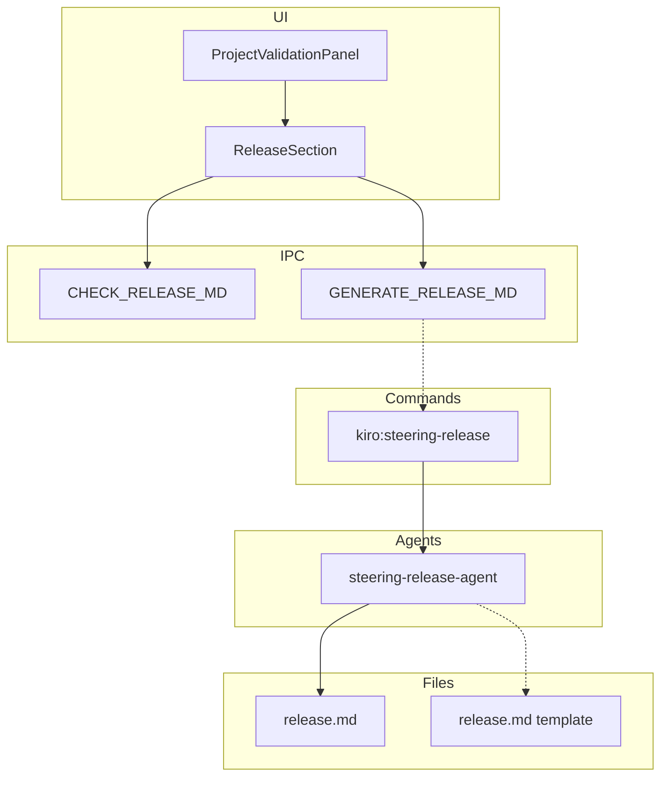
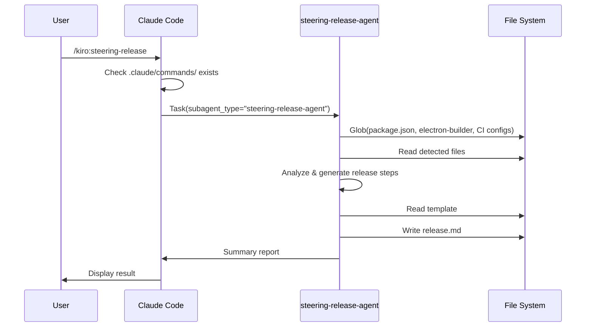
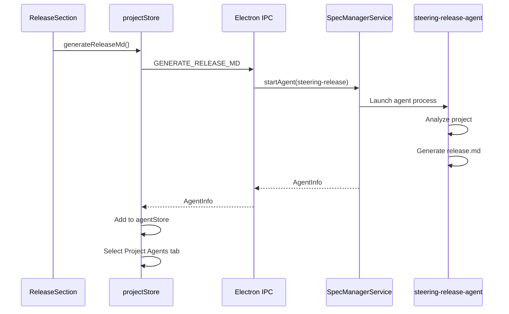

# Design: Steering Release Integration

## Overview

**Purpose**: プロジェクト固有のリリース手順を `.claude/commands/release.md` として自動生成し、`/release` Slash Commandとして実行可能にする。

**Users**: SDDワークフローを使用する開発者が、プロジェクトのビルド設定やCI構成を分析して適切なリリースワークフローを持つSlash Commandを生成できるようになる。

**Impact**: 既存の steering-agent パターンを再利用し、ProjectValidationPanel に Release セクションを追加する。steering-verification-integration と同一のアーキテクチャパターンを採用。

### Goals

- AIエージェントがプロジェクトを分析して適切なリリース手順を含む release.md を生成する
- `/release` Slash Commandとして実行可能な形式でリリース手順を定義する
- UI で release.md の不足を検知し、生成を促す
- skill-reference.md に steering-release コマンドを追加する

### Non-Goals

- release.md の必須化（オプショナルな拡張として扱う）
- 実際のリリース実行の自動化（release.md 生成のみ）
- CI/CDパイプラインとの直接統合
- 複数プラットフォーム向けリリースの同時実行

## Architecture

### Existing Architecture Analysis

本機能は既存システムの拡張として実装する（steering-verification-integration と同一パターン）：

- **steering-agent パターンの再利用**: 既存の steering-verification-agent と同様のサブエージェント委譲パターンを採用
- **ProjectValidationPanel の拡張**: 既存のセクション構造（kiro, spec-manager, permissions, steering）に新しい Release セクションを追加
- **shared/components パターン**: SteeringSection と同様に ReleaseSection を shared/components として実装

### Architecture Pattern & Boundary Map



**Architecture Integration**:

- **Selected pattern**: サブエージェント委譲パターン（既存の steering-verification-agent と同一）
- **Domain boundaries**: Release 管理（steering-release-agent）は Steering ドメインに属する
- **Existing patterns preserved**: コマンド/エージェント分離、テンプレート駆動生成、UI セクション分離、shared/components パターン
- **New components rationale**: release.md はリリース手順を構造化するために必要
- **Steering compliance**: DRY（既存パターン再利用）、KISS（シンプルな Markdown 形式）

### Technology Stack

| Layer | Choice / Version | Role in Feature | Notes |
|-------|------------------|-----------------|-------|
| Commands | Slash Command (.md) | ユーザーインターフェース | 既存パターンに準拠 |
| Agents | Subagent (.md) | リリース手順生成 | Task ツールで委譲 |
| UI | React + TypeScript | Release セクション表示 | shared/components として実装 |
| Data | Markdown | release.md フォーマット | 各セクションを含む |

### Command Prompt Architecture (Claude Code features only)

**Execution Model**:

- [x] CLI invocation: External process with file-based data exchange
- [ ] MCP tool direct call
- [ ] Hybrid

**Rationale**: 既存の steering コマンドと同様、Slash Command から Task ツール経由でサブエージェントに委譲する。これにより、エージェントが Glob, Grep, Read, Write ツールを使用してプロジェクトを分析し、release.md を生成できる。

**Data Flow**:



## System Flows

### UI からの Release.md 生成



## Requirements Traceability

| Criterion ID | Summary | Components | Implementation Approach |
|--------------|---------|------------|------------------------|
| 1.1 | steering-release コマンド実行で agent 起動 | `kiro:steering-release` command, Task tool | 新規コマンドファイル作成 |
| 1.2 | package.json, electron-builder, CI config 分析 | steering-release-agent | エージェント内で Glob/Grep/Read 使用 |
| 1.3 | release.md 生成 | steering-release-agent, Write tool | テンプレート駆動生成 |
| 1.4 | テンプレート参照 | `.kiro/settings/templates/commands/release.md` | 新規テンプレート作成 |
| 1.5 | コマンドプリセット同梱 | cc-sdd, cc-sdd-agent templates | テンプレートディレクトリに追加 |
| 2.1 | release.md セクション構成 | release.md template | 前提条件、バージョン決定等 |
| 2.2 | 実行可能なコマンド例 | steering-release-agent | 各ステップに具体的コマンド |
| 2.3 | プロジェクト固有情報反映 | steering-release-agent | 分析結果を反映 |
| 3.1 | ProjectValidationPanel に Release セクション追加 | ReleaseSection component | 新規コンポーネント作成 |
| 3.2 | release.md 存在チェック | projectStore, IPC handler | 既存パターンに準拠 |
| 3.3 | 生成ボタン表示 | ReleaseSection component | 不足時のみ表示 |
| 3.4 | ボタンクリックでエージェント起動 | ReleaseSection, IPC handler | executeProjectAgent 使用 |
| 3.5 | Remote UI 対応 | ReleaseSection (shared/components) | shared/ パターンに準拠 |
| 4.1 | skill-reference.md に steering-release 追加 | skill-reference.md | 既存テーブルに追記 |
| 4.2 | cc-sdd, cc-sdd-agent 両プロファイルに追記 | skill-reference.md | 「その他のコマンド」テーブル |

### Coverage Validation Checklist

- [x] Every criterion ID from requirements.md appears in the table above
- [x] Each criterion has specific component names (not generic references)
- [x] Implementation approach distinguishes "reuse existing" vs "new implementation"
- [x] User-facing criteria specify concrete UI components

## Components and Interfaces

### Component Summary

| Component | Domain/Layer | Intent | Req Coverage | Key Dependencies | Contracts |
|-----------|--------------|--------|--------------|------------------|-----------|
| steering-release command | Commands | steering-release-agent へ委譲 | 1.1 | Task tool (P0) | - |
| steering-release-agent | Agents | release.md 生成 | 1.1-1.5, 2.1-2.3 | Read, Write, Glob, Grep (P0) | Service |
| release.md template | Templates | 生成テンプレート | 1.4, 2.1-2.3 | - | - |
| ReleaseSection | UI | Release 状態表示・操作 | 3.1-3.5 | projectStore (P0) | State |
| ReleaseSectionIPC | Main/IPC | release.md 存在チェック | 3.2 | fileService (P0) | API |

### Commands Layer

#### steering-release command

| Field | Detail |
|-------|--------|
| Intent | steering-release-agent にタスクを委譲する |
| Requirements | 1.1 |

**Responsibilities & Constraints**

- `.claude/commands/` ディレクトリの存在確認（なければ作成指示）
- Task ツールで steering-release-agent を呼び出し
- 結果サマリーをユーザーに表示

**Dependencies**

- Outbound: Task tool - steering-release-agent 呼び出し (P0)
- Outbound: Glob tool - ディレクトリ確認 (P1)

**Contracts**: Service [x]

##### Service Interface

```typescript
// Slash Command として定義（.md ファイル）
// 入力: なし
// 出力: サマリーメッセージ（release.md 生成結果）
```

**Implementation Notes**

- 既存の steering-verification.md コマンドパターンを踏襲
- cc-sdd, cc-sdd-agent 両プロファイルに同梱

### Agents Layer

#### steering-release-agent

| Field | Detail |
|-------|--------|
| Intent | プロジェクトを分析して release.md を生成する |
| Requirements | 1.1-1.5, 2.1-2.3 |

**Responsibilities & Constraints**

- プロジェクトのビルド設定を分析（package.json, electron-builder, CI config 等）
- 適切なリリース手順を推測
- テンプレートに基づいて release.md を生成
- 生成結果のサマリーを返却

**Dependencies**

- Inbound: steering-release command - Task 経由呼び出し (P0)
- Outbound: File System - Glob, Grep, Read, Write (P0)
- Outbound: release.md template - テンプレート参照 (P1)

**Contracts**: Service [x]

##### Service Interface

```typescript
// Agent として定義（.md ファイル）
interface SteeringReleaseAgentInput {
  // Task prompt で渡される
  filePatterns: string[]; // 読み込むファイルパターン
}

interface SteeringReleaseAgentOutput {
  // Chat summary として返却
  generated: boolean;
  projectType: 'npm' | 'electron' | 'cargo' | 'make' | 'unknown';
  sections: string[];  // 生成されたセクション一覧
  warnings?: string[];
}
```

**Implementation Notes**

- 既存の steering-verification-agent パターンを踏襲
- JIT 戦略: 必要なファイルのみ読み込み
- 分析ソース優先順: package.json > electron-builder > CI config

**既存 release.md の挙動**:

- 既存ファイルがある場合: **上書き確認をユーザーに求める**
- ユーザーが上書きを選択した場合のみ新規生成
- 上書きを拒否した場合はスキップしてサマリーを表示

**プロジェクトタイプ別生成戦略**:

| プロジェクトタイプ | 検出条件 | 生成内容 |
|------------------|---------|---------|
| Electron | `electron-builder.yml` 存在 | アプリビルド、署名、公開 |
| npm | `package.json` 存在 | npm publish フロー |
| Cargo | `Cargo.toml` 存在 | cargo publish フロー |
| Make | `Makefile` 存在 | make release タスク |
| Unknown | 上記いずれにも該当しない | 汎用テンプレート |

### Templates Layer

#### release.md Template

| Field | Detail |
|-------|--------|
| Intent | release.md 生成のテンプレートを提供する |
| Requirements | 1.4, 2.1-2.3 |

**Implementation Notes**

- 配置: `.kiro/settings/templates/commands/release.md`
- フォーマット: Markdown（セクション構成）

### UI Layer

#### ReleaseSection

| Field | Detail |
|-------|--------|
| Intent | Release ファイルの状態表示と操作を提供する |
| Requirements | 3.1-3.5 |

**Responsibilities & Constraints**

- release.md の存在状態を表示
- 不足時に生成ボタンを表示
- 生成ボタンクリックでエージェント起動

**Dependencies**

- Inbound: ProjectValidationPanel - 親コンポーネント (P0)
- Outbound: projectStore - releaseCheck 状態参照 (P0)
- Outbound: IPC - エージェント起動 (P0)

**Contracts**: State [x]

##### State Management

```typescript
// projectStore 拡張
interface ReleaseCheckResult {
  readonly releaseMdExists: boolean;
}

interface ProjectState {
  // 既存フィールド...
  releaseCheck: ReleaseCheckResult | null;
  releaseGenerateLoading: boolean;
}

interface ProjectActions {
  // 既存アクション...
  checkReleaseFiles: (projectPath: string) => Promise<void>;
  generateReleaseMd: () => Promise<void>;
}
```

**Implementation Notes**

- 既存の SteeringSection パターンを踏襲
- セクションヘッダー: "Release"
- チェック項目: `.claude/commands/release.md` のみ
- shared/components に配置（3.5 Remote UI 対応）

##### Props Interface

```typescript
/** Release check result containing release.md status */
export interface ReleaseCheckResult {
  readonly releaseMdExists: boolean;
}

export interface ReleaseSectionProps {
  /** Release files check result */
  readonly releaseCheck: ReleaseCheckResult | null;
  /** Loading state for generation */
  readonly releaseGenerateLoading: boolean;
  /** Callback to generate release.md */
  readonly onGenerateReleaseMd: () => void;
}
```

### IPC Layer

#### ReleaseSectionIPC

| Field | Detail |
|-------|--------|
| Intent | release ファイルの存在チェックを提供する |
| Requirements | 3.2 |

**Dependencies**

- Inbound: projectStore - checkReleaseFiles 呼び出し (P0)
- Outbound: fileService - ファイル存在確認 (P0)

**Contracts**: API [x]

##### API Contract

| Method | Channel | Request | Response | Errors |
|--------|---------|---------|----------|--------|
| invoke | CHECK_RELEASE_MD | `{ projectPath: string }` | `ReleaseCheckResult` | - |
| invoke | GENERATE_RELEASE_MD | `{ projectPath: string }` | `AgentInfo` | AGENT_ERROR |

**Implementation Notes**

- 既存の CHECK_STEERING_FILES, GENERATE_VERIFICATION_MD パターンを踏襲
- channels.ts に新規チャンネル定義を追加

## Data Models

### Domain Model

#### release.md Format

```markdown
---
description: Project release workflow - semantic versioning and release automation
allowed-tools: Bash, Read, Write, Glob, Grep
---

# Release Workflow

## Prerequisites

- Ensure working directory is clean (`git status`)
- Confirm you are on the main branch
- All tests pass

## Version Decision

Determine the next version using semantic versioning:
- **major**: Breaking changes
- **minor**: New features (backward compatible)
- **patch**: Bug fixes

## CHANGELOG Update

Update `CHANGELOG.md` with release notes.

## Build & Package

```bash
npm run build
```

## Commit & Tag

```bash
git add -A
git commit -m "chore: release vX.Y.Z"
git tag vX.Y.Z
git push origin main --tags
```

## Publish

```bash
# For npm packages
npm publish

# For GitHub Release
gh release create vX.Y.Z --generate-notes
```

## Notes

- Customize commands based on your project setup
- For Electron apps, additional signing steps may be required
```

**Business Rules**:

- セクション構成は固定（Prerequisites, Version Decision, CHANGELOG, Build, Commit, Publish）
- 各セクションには実行可能なコマンド例を含む
- プロジェクト固有の情報（パッケージ名、ビルドコマンド等）を反映

### Data Contracts & Integration

#### release.md 検出パターン

```typescript
interface ReleaseCheckResult {
  releaseMdExists: boolean;
}

// チェック処理（IPC handler 内）
async function checkReleaseFiles(projectPath: string): Promise<ReleaseCheckResult> {
  const releaseMdPath = path.join(projectPath, '.claude', 'commands', 'release.md');
  const releaseMdExists = await fs.access(releaseMdPath)
    .then(() => true)
    .catch(() => false);

  return { releaseMdExists };
}
```

## Error Handling

### Error Strategy

| Error Type | Handling | User Message |
|------------|----------|--------------|
| release.md 既存 | 上書き確認 | "release.md already exists. Do you want to overwrite it?" |
| .claude/commands/ 不存在 | 自動作成 | ディレクトリを自動作成して続行 |
| 分析ソース不存在 | 汎用テンプレート | "No build configuration detected. Using generic template." |
| 書き込みエラー | エラー表示 | "Failed to write release.md: {error}" |

### Error Categories and Responses

**User Errors (4xx)**: 上書き拒否 -> スキップして既存内容を表示

**System Errors (5xx)**: 書き込みエラー -> エラーメッセージ表示、ユーザーにリトライ促す

## Testing Strategy

### Unit Tests

- `ReleaseSection`: 状態に応じた表示切替
- `projectStore.checkReleaseFiles`: IPC 呼び出しと状態更新
- `projectStore.generateReleaseMd`: エージェント起動と状態更新

### Integration Tests

- steering-release-agent: package.json からのコマンド推測
- ProjectValidationPanel: Release セクション表示
- IPC handlers: CHECK_RELEASE_MD, GENERATE_RELEASE_MD

### E2E Tests

- release.md 生成フロー: ボタンクリック -> エージェント起動 -> ファイル生成
- Remote UI 対応: ReleaseSection が Remote UI で正しく表示される

## Design Decisions

### DD-001: release.md の配置先を `.claude/commands/` に決定

| Field | Detail |
|-------|--------|
| Status | Accepted |
| Context | release.md を `.kiro/steering/` に配置するか `.claude/commands/` に配置するか |
| Decision | `.claude/commands/release.md` に配置 |
| Rationale | `/release` Slash Command として直接実行可能にするため。Slash Command は `.claude/commands/` に配置する必要がある |
| Alternatives Considered | `.kiro/steering/release.md` - 却下: Slash Command として実行できない |
| Consequences | steering ディレクトリとは別管理となるが、実用性を優先 |

### DD-002: steering-verification-integration と同一パターンの採用

| Field | Detail |
|-------|--------|
| Status | Accepted |
| Context | 新規機能の実装パターン選定 |
| Decision | steering-verification-integration と完全に同一のアーキテクチャパターンを採用 |
| Rationale | 1. 既存パターンとの一貫性、2. 実装コストの削減、3. メンテナンス性向上 |
| Alternatives Considered | 独自パターン設計 - 却下: 不必要な複雑性、既存パターンで十分 |
| Consequences | SteeringSection との類似コードが発生するが、責務が異なるため分離を維持 |

### DD-003: shared/components としての ReleaseSection 実装

| Field | Detail |
|-------|--------|
| Status | Accepted |
| Context | ReleaseSection コンポーネントの配置場所 |
| Decision | `src/shared/components/project/ReleaseSection.tsx` として実装 |
| Rationale | 3.5 要件（Remote UI 対応）を満たすため。SteeringSection と同一パターン |
| Alternatives Considered | `src/renderer/components/` に配置 - 却下: Remote UI で使用不可 |
| Consequences | Electron 版と Remote UI 版で同一コンポーネントを共有 |

### DD-004: プロジェクト分析による動的生成

| Field | Detail |
|-------|--------|
| Status | Accepted |
| Context | release.md の生成方法（テンプレートコピー vs 動的生成） |
| Decision | プロジェクトのビルド設定を分析して動的に生成 |
| Rationale | 要件 1.2 に基づき、プロジェクト固有のリリース手順を推測して生成することで手動編集の手間を削減 |
| Alternatives Considered | 固定テンプレートのコピー - 却下: プロジェクト固有情報が反映されない |
| Consequences | エージェントの分析ロジックが複雑になるが、生成品質は向上 |

### DD-005: Slash Command の allowed-tools 設計

| Field | Detail |
|-------|--------|
| Status | Accepted |
| Context | 生成される release.md Slash Command に付与する allowed-tools |
| Decision | `Bash, Read, Write, Glob, Grep` を標準として付与 |
| Rationale | リリースワークフロー実行に必要な最小限のツールセット。Bash でコマンド実行、Read/Write でファイル操作、Glob/Grep で状態確認 |
| Alternatives Considered | 1. ツールなし - 却下: コマンド実行不可、2. 全ツール許可 - 却下: セキュリティリスク |
| Consequences | リリース実行時に必要十分なツールが利用可能 |
