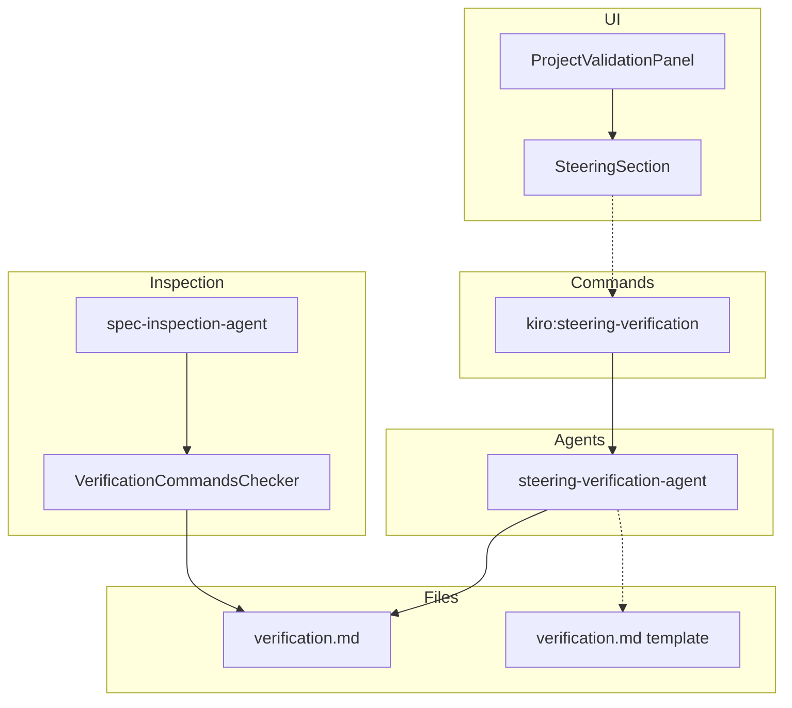
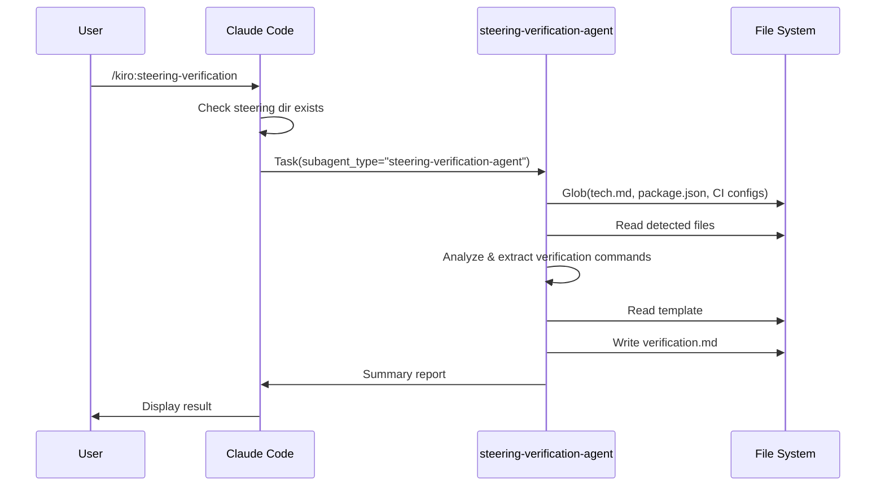
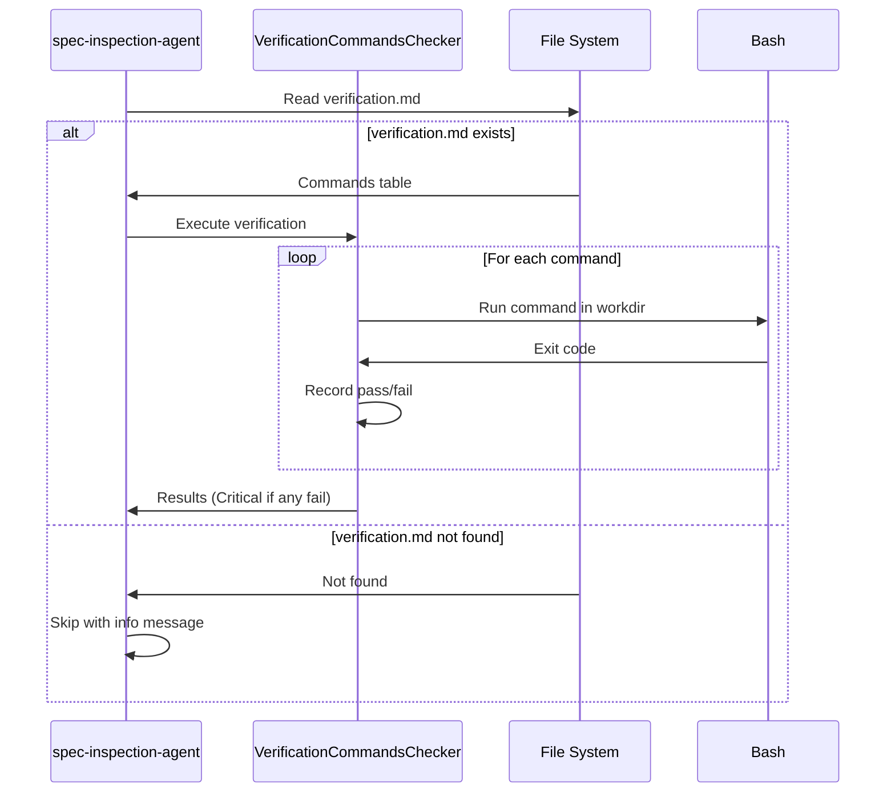

# Design: Steering Verification Integration

## Overview

**Purpose**: プロジェクト固有の検証コマンド（ビルド、テスト、型チェック等）を `steering/verification.md` で定義し、spec-inspection が自動実行できる仕組みを提供する。

**Users**: SDDワークフローを使用する開発者が、spec-inspection 実行時にプロジェクト固有の検証を自動化できるようになる。

**Impact**: 既存の spec-inspection エージェントに新しい検証カテゴリを追加し、ProjectValidationPanel に Steering セクションを追加する。

### Goals

- AIエージェントがプロジェクトを分析して適切な検証コマンドを含む verification.md を生成する
- spec-inspection が verification.md のコマンドを自動実行し、失敗時は NOGO 判定する
- UI で verification.md の不足を検知し、生成を促す

### Non-Goals

- 他の steering ファイル（product.md, tech.md, structure.md）の存在チェック・インストール
- verification.md の必須化（オプショナルな拡張として扱う）
- CI/CD パイプラインとの直接統合
- コマンド実行のタイムアウト設定（将来の拡張）

## Architecture

### Existing Architecture Analysis

本機能は既存システムの拡張として実装する：

- **steering-agent パターンの再利用**: 既存の steering-agent と同様のサブエージェント委譲パターンを採用
- **ProjectValidationPanel の拡張**: 既存のセクション構造（kiro, spec-manager, permissions）に新しい steering セクションを追加
- **spec-inspection-agent への統合**: 既存の検証カテゴリ（RequirementsChecker, DesignChecker 等）に VerificationCommandsChecker を追加

### Architecture Pattern & Boundary Map



**Architecture Integration**:

- **Selected pattern**: サブエージェント委譲パターン（既存の steering-agent と同一）
- **Domain boundaries**: Steering 管理（steering-verification-agent）と Inspection（spec-inspection-agent）は分離
- **Existing patterns preserved**: コマンド/エージェント分離、テンプレート駆動生成、UI セクション分離
- **New components rationale**: verification.md は検証コマンドを構造化するために必要
- **Steering compliance**: DRY（既存パターン再利用）、KISS（シンプルな Markdown テーブル形式）

### Technology Stack

| Layer | Choice / Version | Role in Feature | Notes |
|-------|------------------|-----------------|-------|
| Commands | Slash Command (.md) | ユーザーインターフェース | 既存パターンに準拠 |
| Agents | Subagent (.md) | 検証コマンド生成 | Task ツールで委譲 |
| UI | React + TypeScript | Steering セクション表示 | ProjectValidationPanel 拡張 |
| Data | Markdown Table | verification.md フォーマット | 正規表現で解析可能 |

### Command Prompt Architecture (Claude Code features only)

**Execution Model**:

- [x] CLI invocation: External process with file-based data exchange
- [ ] MCP tool direct call
- [ ] Hybrid

**Rationale**: 既存の steering コマンドと同様、Slash Command から Task ツール経由でサブエージェントに委譲する。これにより、エージェントが Glob, Grep, Read, Write ツールを使用してプロジェクトを分析し、verification.md を生成できる。

**Data Flow**:



## System Flows

### spec-inspection with Verification Commands



## Requirements Traceability

| Criterion ID | Summary | Components | Implementation Approach |
|--------------|---------|------------|------------------------|
| 1.1 | steering-verification コマンド実行で agent 起動 | `kiro:steering-verification` command, Task tool | 新規コマンドファイル作成 |
| 1.2 | tech.md, package.json, CI config 分析 | steering-verification-agent | エージェント内で Glob/Grep/Read 使用 |
| 1.3 | verification.md 生成 | steering-verification-agent, Write tool | テンプレート駆動生成 |
| 1.4 | テンプレート参照 | `.kiro/settings/templates/steering/verification.md` | 新規テンプレート作成 |
| 1.5 | コマンドプリセット同梱 | cc-sdd, cc-sdd-agent templates | テンプレートディレクトリに追加 |
| 2.1 | verification.md フォーマット（type, command, workdir, description） | verification.md template | Markdown テーブル形式 |
| 2.2 | パーサーで抽出可能なフォーマット | spec-inspection-agent | 正規表現によるテーブル解析 |
| 2.3 | 複数コマンド定義 | verification.md | テーブル行として複数定義 |
| 3.1 | ProjectValidationPanel に Steering セクション追加 | SteeringSection component | 新規コンポーネント作成 |
| 3.2 | verification.md 存在チェック | projectStore, IPC handler | 既存パターンに準拠 |
| 3.3 | 生成ボタン表示 | SteeringSection component | 不足時のみ表示 |
| 3.4 | ボタンクリックでエージェント起動 | SteeringSection, IPC handler | executeProjectAgent 使用 |
| 3.5 | 他 steering ファイルはチェック対象外 | SteeringSection component | verification.md のみチェック |
| 3.6 | Remote UI 対応 | SteeringSection (shared/components) | shared/ パターンに準拠 |
| 4.1 | spec-inspection が verification.md 読み込み | spec-inspection-agent | Read tool 使用 |
| 4.2 | 不存在時はスキップ | spec-inspection-agent | Info として記録 |
| 4.3 | コマンド実行 | spec-inspection-agent | Bash tool 使用 |
| 4.4 | workdir 移動 | spec-inspection-agent | cd コマンド使用 |
| 4.5 | 失敗時 Critical/NOGO | spec-inspection-agent | 非ゼロ終了コードで Critical |
| 4.6 | Inspection Report に記載 | spec-inspection-agent | Verification Commands セクション追加 |

### Coverage Validation Checklist

- [x] Every criterion ID from requirements.md appears in the table above
- [x] Each criterion has specific component names (not generic references)
- [x] Implementation approach distinguishes "reuse existing" vs "new implementation"
- [x] User-facing criteria specify concrete UI components

## Components and Interfaces

### Component Summary

| Component | Domain/Layer | Intent | Req Coverage | Key Dependencies | Contracts |
|-----------|--------------|--------|--------------|------------------|-----------|
| steering-verification command | Commands | steering-verification-agent へ委譲 | 1.1 | Task tool (P0) | - |
| steering-verification-agent | Agents | verification.md 生成 | 1.1-1.5, 2.1-2.3 | Read, Write, Glob, Grep (P0) | Service |
| verification.md template | Templates | 生成テンプレート | 1.4, 2.1-2.3 | - | - |
| SteeringSection | UI | Steering 状態表示・操作 | 3.1-3.5 | projectStore (P0) | State |
| SteeringSectionIPC | Main/IPC | verification.md 存在チェック | 3.2 | fileService (P0) | API |
| VerificationCommandsChecker | Agents | 検証コマンド実行 | 4.1-4.6 | Bash tool (P0) | Service |

### Commands Layer

#### steering-verification command

| Field | Detail |
|-------|--------|
| Intent | steering-verification-agent にタスクを委譲する |
| Requirements | 1.1 |

**Responsibilities & Constraints**

- `.kiro/steering/` ディレクトリの存在確認
- Task ツールで steering-verification-agent を呼び出し
- 結果サマリーをユーザーに表示

**Dependencies**

- Outbound: Task tool - steering-verification-agent 呼び出し (P0)
- Outbound: Glob tool - steering ディレクトリ確認 (P1)

**Contracts**: Service [x]

##### Service Interface

```typescript
// Slash Command として定義（.md ファイル）
// 入力: なし
// 出力: サマリーメッセージ（verification.md 生成結果）
```

**Implementation Notes**

- 既存の steering.md コマンドパターンを踏襲
- cc-sdd, cc-sdd-agent 両プロファイルに同梱

### Agents Layer

#### steering-verification-agent

| Field | Detail |
|-------|--------|
| Intent | プロジェクトを分析して verification.md を生成する |
| Requirements | 1.1-1.5, 2.1-2.3 |

**Responsibilities & Constraints**

- プロジェクトの技術スタックを分析（tech.md, package.json, CI config 等）
- 適切な検証コマンドを推測
- テンプレートに基づいて verification.md を生成
- 生成結果のサマリーを返却

**Dependencies**

- Inbound: steering-verification command - Task 経由呼び出し (P0)
- Outbound: File System - Glob, Grep, Read, Write (P0)
- Outbound: verification.md template - テンプレート参照 (P1)

**Contracts**: Service [x]

##### Service Interface

```typescript
// Agent として定義（.md ファイル）
interface SteeringVerificationAgentInput {
  // Task prompt で渡される
  filePatterns: string[]; // 読み込むファイルパターン
}

interface SteeringVerificationAgentOutput {
  // Chat summary として返却
  generated: boolean;
  commands: {
    type: string;
    command: string;
    workdir: string;
  }[];
  warnings?: string[];
}
```

**Implementation Notes**

- 既存の steering-agent パターンを踏襲
- JIT 戦略: 必要なファイルのみ読み込み
- 分析ソース: tech.md > package.json > CI config の優先順

**既存 verification.md の挙動**:

- 既存ファイルがある場合: **上書き確認をユーザーに求める**
- ユーザーが上書きを選択した場合のみ新規生成
- 上書きを拒否した場合はスキップしてサマリーを表示

**複数ソースからのコマンド統合戦略**:

1. **和集合（Union）方式**: 各ソースから検出されたコマンドを統合
2. **優先順位による重複排除**: 同一Typeのコマンドが複数ソースから検出された場合、優先順位の高いソースを採用
   - 例: tech.md で `build: npm run build` と package.json で `build: npm run build:prod` が検出された場合、tech.md の定義を採用
3. **Type が異なる場合は共存**: `build` と `typecheck` など異なるTypeは両方採用

#### VerificationCommandsChecker (spec-inspection-agent 拡張)

| Field | Detail |
|-------|--------|
| Intent | verification.md のコマンドを実行して結果を検証する |
| Requirements | 4.1-4.6 |

**Responsibilities & Constraints**

- verification.md の読み込みと解析
- 各コマンドの実行（workdir 移動含む）
- 結果の記録と判定

**Dependencies**

- Inbound: spec-inspection-agent - 検証カテゴリとして呼び出し (P0)
- Outbound: Bash tool - コマンド実行 (P0)
- Outbound: verification.md - コマンド定義読み込み (P0)

**Contracts**: Service [x]

##### Service Interface

```typescript
// spec-inspection-agent 内の検証ロジック
interface VerificationResult {
  type: string;           // build, typecheck, test, lint
  command: string;        // 実行コマンド
  workdir: string;        // 作業ディレクトリ
  exitCode: number;       // 終了コード
  status: 'PASS' | 'FAIL';
  output?: string;        // エラー時の出力（抜粋）
}

interface VerificationCheckResult {
  skipped: boolean;       // verification.md 不存在時 true
  results: VerificationResult[];
  severity: 'Critical' | 'Info';  // 失敗時 Critical, スキップ時 Info
}
```

**Implementation Notes**

- spec-inspection-agent の既存カテゴリ（RequirementsChecker 等）と同様の構造
- Markdown テーブルの正規表現解析: `/^\| *([^|]+) *\| *([^|]+) *\| *([^|]+) *\| *([^|]+) *\|/gm`
- 失敗時は NOGO 判定に影響（Critical）

### Templates Layer

#### verification.md Template

| Field | Detail |
|-------|--------|
| Intent | verification.md 生成のテンプレートを提供する |
| Requirements | 1.4, 2.1-2.3 |

**Implementation Notes**

- 配置: `.kiro/settings/templates/steering/verification.md`
- フォーマット: Markdown テーブル（Type, Command, Workdir, Description）

### UI Layer

#### SteeringSection

| Field | Detail |
|-------|--------|
| Intent | Steering ファイルの状態表示と操作を提供する |
| Requirements | 3.1-3.5 |

**Responsibilities & Constraints**

- verification.md の存在状態を表示
- 不足時に生成ボタンを表示
- 生成ボタンクリックでエージェント起動

**Dependencies**

- Inbound: ProjectValidationPanel - 親コンポーネント (P0)
- Outbound: projectStore - steeringCheck 状態参照 (P0)
- Outbound: IPC - エージェント起動 (P0)

**Contracts**: State [x]

##### State Management

```typescript
// projectStore 拡張
interface SteeringCheckResult {
  readonly verificationMdExists: boolean;
}

interface ProjectState {
  // 既存フィールド...
  steeringCheck: SteeringCheckResult | null;
  steeringGenerateLoading: boolean;
}

interface ProjectActions {
  // 既存アクション...
  checkSteeringFiles: (projectPath: string) => Promise<void>;
  generateVerificationMd: () => Promise<void>;
}
```

**Implementation Notes**

- 既存の SpecManagerFilesSection, PermissionsCheckSection パターンを踏襲
- セクションヘッダー: "Steering"
- チェック項目: verification.md のみ（3.5 に準拠）

### IPC Layer

#### SteeringSectionIPC

| Field | Detail |
|-------|--------|
| Intent | steering ファイルの存在チェックを提供する |
| Requirements | 3.2 |

**Dependencies**

- Inbound: projectStore - checkSteeringFiles 呼び出し (P0)
- Outbound: fileService - ファイル存在確認 (P0)

**Contracts**: API [x]

##### API Contract

| Method | Channel | Request | Response | Errors |
|--------|---------|---------|----------|--------|
| invoke | CHECK_STEERING_FILES | `{ projectPath: string }` | `SteeringCheckResult` | - |
| invoke | GENERATE_VERIFICATION_MD | `{ projectPath: string }` | `void` | AGENT_ERROR |

## Data Models

### Domain Model

#### verification.md Format

```markdown
# Verification Commands

spec-inspection 実行時に自動実行される検証コマンドを定義します。

| Type | Command | Workdir | Description |
|------|---------|---------|-------------|
| build | npm run build | . | プロダクションビルド |
| typecheck | npm run typecheck | . | TypeScript 型チェック |
| test | npm run test:run | . | ユニットテスト |
| lint | npm run lint | . | ESLint 検証 |
```

**Business Rules**:

- Type: `build`, `typecheck`, `test`, `lint` 等（自由形式）
- Command: シェルで実行可能なコマンド
- Workdir: プロジェクトルートからの相対パス（`.` はルート）
- Description: コマンドの説明（人間向け）

**エスケープ規則**:

Markdown テーブル内で特殊文字を使用する場合の規則:

| 文字 | エスケープ方法 | 例 |
|------|---------------|-----|
| `\|` (パイプ) | `\|` または `&#124;` | `npm run test \| head -n 100` |
| `` ` `` (バッククォート) | `` \` `` | コマンド内で使用可能 |

**パイプを含むコマンドの例**:

```markdown
| test | npm run test \| tee test.log | . | テスト実行（ログ出力付き） |
```

**注意**: 複雑なコマンド（複数パイプ、ネストしたクォート等）は、シェルスクリプトとして分離し、そのスクリプトを呼び出すことを推奨

### Data Contracts & Integration

#### verification.md Parser

```typescript
interface VerificationCommand {
  type: string;
  command: string;
  workdir: string;
  description: string;
}

// パース処理（spec-inspection-agent 内）
function parseVerificationMd(content: string): VerificationCommand[] {
  const tableRegex = /^\| *([^|]+) *\| *([^|]+) *\| *([^|]+) *\| *([^|]+) *\|/gm;
  const commands: VerificationCommand[] = [];
  let match;

  while ((match = tableRegex.exec(content)) !== null) {
    const [, type, command, workdir, description] = match.map(s => s.trim());
    // ヘッダー行とセパレーター行をスキップ
    if (type === 'Type' || type.startsWith('-')) continue;
    commands.push({ type, command, workdir, description });
  }

  return commands;
}
```

## Error Handling

### Error Strategy

| Error Type | Handling | User Message |
|------------|----------|--------------|
| verification.md 不存在 | スキップ | "Verification Commands: skipped (verification.md not found)" |
| コマンド実行失敗 | Critical 判定 | "Verification failed: {type} ({command}) - exit code {n}" |
| パース失敗 | Warning | "verification.md format invalid - skipping verification" |
| workdir 不存在 | Critical 判定 | "Workdir not found: {workdir}" |

### Error Categories and Responses

**User Errors (4xx)**: verification.md フォーマット不正 -> パース失敗として Warning

**System Errors (5xx)**: コマンド実行エラー -> Critical として NOGO 判定

**Business Logic Errors (422)**: N/A

## Testing Strategy

### Unit Tests

- `parseVerificationMd`: テーブル解析の正確性
- `SteeringSection`: 状態に応じた表示切替
- `projectStore.checkSteeringFiles`: IPC 呼び出しと状態更新

### Integration Tests

- steering-verification-agent: tech.md からのコマンド推測
- spec-inspection-agent: verification.md 読み込みと実行
- ProjectValidationPanel: Steering セクション表示

### E2E Tests

- verification.md 生成フロー: ボタンクリック -> エージェント起動 -> ファイル生成
- spec-inspection 統合: verification.md 存在時の検証実行

## Design Decisions

### DD-001: verification.md の分離（tech.md に追加しない）

| Field | Detail |
|-------|--------|
| Status | Accepted |
| Context | 検証コマンドを既存の tech.md に追加するか、新規ファイルとして分離するか |
| Decision | 新規ファイル `verification.md` として分離 |
| Rationale | tech.md は「何を使うか」（技術スタック）、verification.md は「どう検証するか」（検証手順）で責務が異なる。分離することで関心の分離を維持 |
| Alternatives Considered | tech.md に "## Verification Commands" セクションを追加 - 却下: tech.md の肥大化、パース複雑化 |
| Consequences | ファイル数増加（1ファイル）、ただしオプショナルなので影響軽微 |

### DD-002: verification.md 不存在時はスキップ（NOGO としない）

| Field | Detail |
|-------|--------|
| Status | Accepted |
| Context | verification.md が存在しない場合の spec-inspection の動作 |
| Decision | スキップ（パス）として処理し、Info レベルでレポートに記載 |
| Rationale | オプショナルな拡張として扱い、既存プロジェクトへの影響を最小化。UI で存在チェック + インストールボタンがあれば気づきの導線は確保できる |
| Alternatives Considered | 1. NOGO 判定 - 却下: 既存プロジェクトが全て NOGO になる、2. Warning - 検討可: 中間的だが、導入障壁が上がる |
| Consequences | verification.md なしでも inspection は通過する。導入は任意 |

### DD-003: Markdown テーブル形式の採用

| Field | Detail |
|-------|--------|
| Status | Accepted |
| Context | verification.md のフォーマット選定 |
| Decision | Markdown テーブル形式（| Type | Command | Workdir | Description |） |
| Rationale | 1. 人間可読性が高い、2. 正規表現で簡単にパース可能、3. 既存の steering ファイルとの一貫性 |
| Alternatives Considered | 1. YAML front matter - 却下: steering ファイルとの一貫性欠如、2. JSON コードブロック - 却下: 人間が編集しにくい |
| Consequences | 複雑なコマンド（パイプ、クォート含む）の記述に注意が必要 |

### DD-004: サブエージェント委譲パターンの採用

| Field | Detail |
|-------|--------|
| Status | Accepted |
| Context | steering-verification コマンドの実行方式 |
| Decision | 既存の steering コマンドと同様、Task ツールでサブエージェントに委譲 |
| Rationale | 1. 既存パターンとの一貫性、2. エージェントが複数ツール（Glob, Grep, Read, Write）を使用可能、3. テスト容易性 |
| Alternatives Considered | コマンド内で直接実装 - 却下: 複雑なロジックをコマンドに含めるのは保守性が低い |
| Consequences | エージェントファイル（.md）の追加が必要 |

### DD-005: UI バリデーションを Steering セクションとして独立

| Field | Detail |
|-------|--------|
| Status | Accepted |
| Context | ProjectValidationPanel での verification.md チェックの配置 |
| Decision | specManagerCheck とは独立した "Steering" セクションを新設 |
| Rationale | steering ファイルは設定ファイル（commands, settings）とは異なるカテゴリ。将来的に他の steering ファイルチェックを追加する可能性も考慮 |
| Alternatives Considered | specManagerCheck に統合 - 却下: 概念的に異なるカテゴリを混在させるのは混乱の元 |
| Consequences | UI セクション数が増加（1セクション）、ただし条件付き表示で通常は非表示 |
