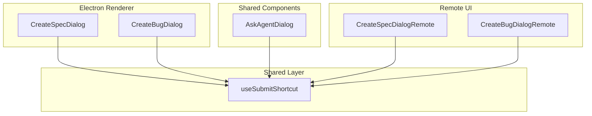
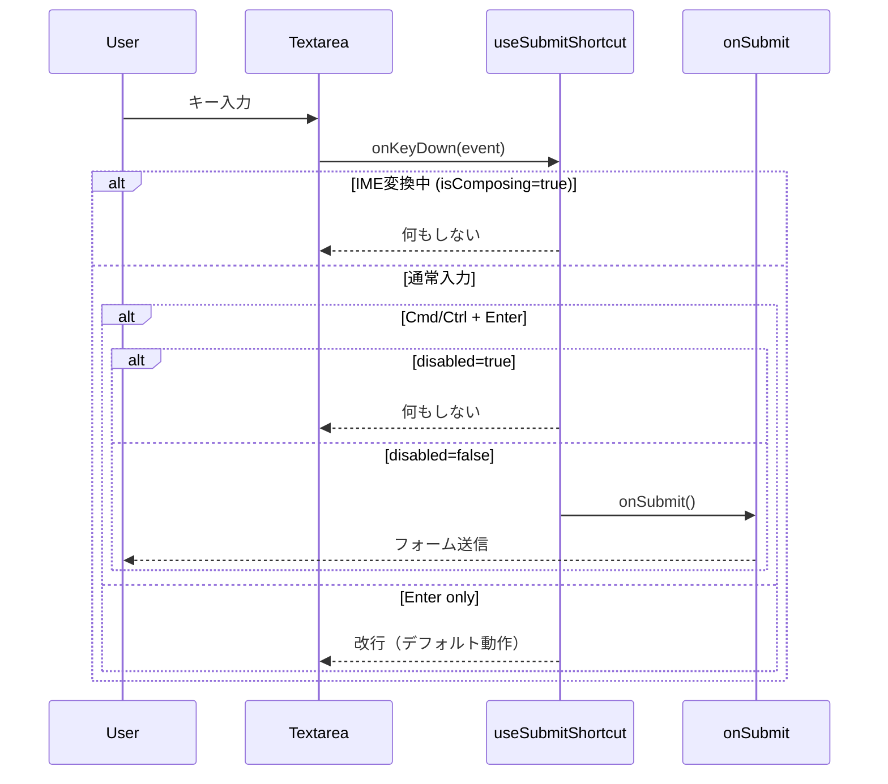

# Design: Submit Shortcut Key

## Overview

**Purpose**: ダイアログ形式の入力画面において、キーボードショートカット（Cmd+Enter / Ctrl+Enter）でフォーム送信を可能にする機能を提供する。

**Users**: SDD Orchestratorを使用する開発者が、マウス操作なしでダイアログからのフォーム送信を行う。

**Impact**: 既存の5つのダイアログコンポーネント（AskAgentDialog、CreateSpecDialog、CreateBugDialog、CreateSpecDialogRemote、CreateBugDialogRemote）に統一されたショートカットキー機能を追加する。

### Goals

- キーボードショートカット（Cmd+Enter / Ctrl+Enter）によるフォーム送信
- プラットフォームごとの標準ショートカット（macOS: Cmd、Windows/Linux: Ctrl）対応
- IME入力中の誤送信防止
- 再利用可能な共通フックによる実装

### Non-Goals

- 既存のAgentInputPanelのキーボード操作変更（Enter送信、Alt+Enter改行は維持）
- ダイアログ以外の画面への適用
- ショートカットキーのカスタマイズ機能
- ショートカットキーのヒント表示

## Architecture

### Existing Architecture Analysis

**既存パターン**:
- `AgentInputPanel`で`isComposing`チェックによるIME対応パターンが実装済み
- ダイアログコンポーネントはテキストエリアを持ち、各自でonChangeを処理
- 現在はショートカットキーによる送信機能なし

**統合ポイント**:
- 5つのダイアログコンポーネントのテキストエリアにonKeyDownハンドラを追加
- `shared/hooks/`に新規フックを配置（既存のuseDeviceType等と同様）

### Architecture Pattern & Boundary Map



**Architecture Integration**:
- **Selected pattern**: カスタムフックによる共通化（既存パターンに準拠）
- **Domain/feature boundaries**: UIロジックはshared/hooksに集約、各コンポーネントはフックを消費
- **Existing patterns preserved**: AgentInputPanelのisComposingパターンを踏襲
- **New components rationale**: 共通フック1つのみ追加（DRY原則）
- **Steering compliance**: KISS、DRY、関心の分離を遵守

### Technology Stack

| Layer | Choice / Version | Role in Feature | Notes |
|-------|------------------|-----------------|-------|
| Frontend | React 19 | フック実装とコンポーネント統合 | 既存スタック |
| Language | TypeScript 5.8+ | 型安全なインタフェース定義 | strict mode |

## System Flows

### ショートカットキー処理フロー



## Requirements Traceability

| Criterion ID | Summary | Components | Implementation Approach |
|--------------|---------|------------|------------------------|
| 1.1 | macOSでCmd+Enterでフォーム送信 | useSubmitShortcut | 新規実装（metaKey検出） |
| 1.2 | Windows/LinuxでCtrl+Enterで送信 | useSubmitShortcut | 新規実装（ctrlKey検出） |
| 1.3 | Enterのみで改行挿入 | useSubmitShortcut | デフォルト動作を維持 |
| 1.4 | disabled時はショートカット無視 | useSubmitShortcut | 新規実装（disabled引数） |
| 2.1 | AskAgentDialogでショートカット有効 | AskAgentDialog | フック統合 |
| 2.2 | CreateSpecDialogでショートカット有効 | CreateSpecDialog | フック統合 |
| 2.3 | CreateBugDialogでショートカット有効 | CreateBugDialog | フック統合 |
| 2.4 | CreateSpecDialogRemoteでショートカット有効 | CreateSpecDialogRemote | フック統合 |
| 2.5 | CreateBugDialogRemoteでショートカット有効 | CreateBugDialogRemote | フック統合 |
| 3.1 | IME変換中はショートカット無視 | useSubmitShortcut | 新規実装（isComposing検出） |
| 3.2 | IME確定後はショートカット有効 | useSubmitShortcut | 新規実装 |
| 4.1 | shared/hooksにフック配置 | useSubmitShortcut | 新規ファイル作成 |
| 4.2 | フックが送信関数と無効状態を受け取る | useSubmitShortcut | 新規実装 |
| 4.3 | フックがonKeyDownハンドラを返す | useSubmitShortcut | 新規実装 |

### Coverage Validation Checklist

- [x] Every criterion ID from requirements.md appears in the table above
- [x] Each criterion has specific component names (not generic references)
- [x] Implementation approach distinguishes "reuse existing" vs "new implementation"
- [x] User-facing criteria specify concrete UI components (not just "shared components")

## Components and Interfaces

### Component Summary

| Component | Domain/Layer | Intent | Req Coverage | Key Dependencies | Contracts |
|-----------|--------------|--------|--------------|------------------|-----------|
| useSubmitShortcut | Shared/Hooks | ショートカットキー検出と送信トリガー | 1.1-1.4, 3.1-3.2, 4.1-4.3 | None | State |
| AskAgentDialog | Shared/Components | Project/Spec Ask ダイアログ | 2.1 | useSubmitShortcut (P0) | - |
| CreateSpecDialog | Renderer/Components | Electron版Spec作成ダイアログ | 2.2 | useSubmitShortcut (P0) | - |
| CreateBugDialog | Renderer/Components | Electron版Bug作成ダイアログ | 2.3 | useSubmitShortcut (P0) | - |
| CreateSpecDialogRemote | RemoteUI/Components | Web版Spec作成ダイアログ | 2.4 | useSubmitShortcut (P0) | - |
| CreateBugDialogRemote | RemoteUI/Components | Web版Bug作成ダイアログ | 2.5 | useSubmitShortcut (P0) | - |

### Shared Hooks

#### useSubmitShortcut

| Field | Detail |
|-------|--------|
| Intent | テキストエリア向けショートカットキー送信ハンドラを提供 |
| Requirements | 1.1, 1.2, 1.3, 1.4, 3.1, 3.2, 4.1, 4.2, 4.3 |

**Responsibilities & Constraints**
- Cmd+Enter（macOS）/ Ctrl+Enter（Windows/Linux）の検出
- IME変換中（isComposing）の送信抑制
- disabled状態での送信抑制
- 単純なEnterは改行として通過させる

**Dependencies**
- Inbound: None
- Outbound: None
- External: None

**Contracts**: State [x]

##### State Management

```typescript
/**
 * useSubmitShortcut - ダイアログ向けショートカット送信フック
 *
 * @param options - フックオプション
 * @returns onKeyDownハンドラ
 */
export interface UseSubmitShortcutOptions {
  /** 送信時に呼び出されるコールバック */
  readonly onSubmit: () => void;
  /** 送信ボタンが無効かどうか */
  readonly disabled?: boolean;
}

export interface UseSubmitShortcutReturn {
  /** テキストエリアに設定するonKeyDownハンドラ */
  readonly handleKeyDown: (event: React.KeyboardEvent<HTMLTextAreaElement>) => void;
}

export function useSubmitShortcut(options: UseSubmitShortcutOptions): UseSubmitShortcutReturn;
```

- State model: ステートレス（純粋なイベントハンドラ生成）
- Persistence: なし
- Concurrency: N/A

**Implementation Notes**
- Integration: 各ダイアログのtextareaにonKeyDown={handleKeyDown}を追加
- Validation: event.nativeEvent.isComposingでIME状態をチェック
- Risks: なし（既存AgentInputPanelで同パターン実証済み）

### Dialog Components (統合変更のみ)

5つのダイアログコンポーネントは既存実装を維持し、以下の変更のみ適用:

1. `useSubmitShortcut`フックをインポート
2. フックにonSubmitコールバックとdisabled状態を渡す
3. テキストエリアにonKeyDownハンドラを設定

## Error Handling

### Error Strategy

本機能はUIイベントハンドリングのみで、エラー発生箇所は限定的。

### Error Categories and Responses

**User Errors**:
- disabled状態でのショートカット入力 -> 無視（フィードバックなし、既存ボタン動作と同様）

**Business Logic Errors**:
- なし（ショートカット自体にビジネスロジックはない）

## Testing Strategy

### Unit Tests

| Test Target | Test Cases |
|-------------|------------|
| useSubmitShortcut | Cmd+Enterで送信コールバック呼び出し |
| useSubmitShortcut | Ctrl+Enterで送信コールバック呼び出し |
| useSubmitShortcut | IME変換中は送信しない |
| useSubmitShortcut | disabled=trueで送信しない |
| useSubmitShortcut | 単独Enterは送信しない |

### Integration Tests

| Test Target | Test Cases |
|-------------|------------|
| AskAgentDialog | ショートカットキーで実行ボタンと同じ動作 |
| CreateSpecDialog | ショートカットキーでspec-plan開始 |
| CreateBugDialog | ショートカットキーでバグ作成開始 |
| CreateSpecDialogRemote | ショートカットキーでspec-plan開始 |
| CreateBugDialogRemote | ショートカットキーでバグ作成開始 |

## Design Decisions

### DD-001: 共通フックによる実装

| Field | Detail |
|-------|--------|
| Status | Accepted |
| Context | 5つのダイアログで同一のショートカットキー機能を実装する必要がある |
| Decision | `shared/hooks/useSubmitShortcut`として共通フックを作成する |
| Rationale | DRY原則に従い、ロジックの重複を避ける。既存の`shared/hooks/`パターンに準拠 |
| Alternatives Considered | 1) 各コンポーネントに直接実装 -> コード重複、保守性低下 2) HOCパターン -> 過剰な抽象化 |
| Consequences | フック修正時に全ダイアログに反映される。テスト範囲を限定できる |

### DD-002: Cmd+Enter/Ctrl+Enter の選択

| Field | Detail |
|-------|--------|
| Status | Accepted |
| Context | 送信ショートカットとして複数の選択肢がある（Enter、Cmd+Enter、Shift+Enter等） |
| Decision | macOSはCmd+Enter、Windows/LinuxはCtrl+Enterを使用 |
| Rationale | 1) 各プラットフォームの標準的なIDEパターン 2) 単独Enterを改行に保持し複数行入力を自然に 3) AgentInputPanelは異なるパターン（Enter送信）だが、ダイアログは長文入力向けのため区別 |
| Alternatives Considered | Enter送信/Shift+Enter改行 -> チャットアプリ向けで長文入力には不向き |
| Consequences | ユーザーは画面によって異なるショートカットを使い分ける必要がある |

### DD-003: isComposingによるIME対応

| Field | Detail |
|-------|--------|
| Status | Accepted |
| Context | 日本語入力時、Enterキーで変換確定するため誤送信のリスクがある |
| Decision | `event.nativeEvent.isComposing`をチェックしてIME変換中は送信を抑制 |
| Rationale | 既存のAgentInputPanelで同パターンが実証済み。標準的なWeb APIを使用 |
| Alternatives Considered | compositionstart/compositionendイベント追跡 -> 複雑、状態管理が必要 |
| Consequences | 日本語以外のIME（中国語、韓国語等）でも同様に動作する |

### DD-004: フックのステートレス設計

| Field | Detail |
|-------|--------|
| Status | Accepted |
| Context | フックが内部状態を持つか、純粋なハンドラ生成器とするか |
| Decision | ステートレスな設計とし、onSubmitとdisabledを外部から受け取る |
| Rationale | 1) KISS原則 2) 各ダイアログは既にフォーム状態を管理している 3) テストが容易 |
| Alternatives Considered | フック内でdisabled状態を計算 -> 各ダイアログのバリデーションロジックが異なるため不適切 |
| Consequences | 呼び出し側でdisabled状態を計算して渡す必要がある |

## Integration & Deprecation Strategy

### 変更が必要な既存ファイル

| File | Change Type | Description |
|------|-------------|-------------|
| `src/shared/hooks/index.ts` | Modification | useSubmitShortcutのexport追加 |
| `src/shared/components/project/AskAgentDialog.tsx` | Modification | フック統合、onKeyDown追加 |
| `src/renderer/components/CreateSpecDialog.tsx` | Modification | フック統合、onKeyDown追加 |
| `src/renderer/components/CreateBugDialog.tsx` | Modification | フック統合、onKeyDown追加 |
| `src/remote-ui/components/CreateSpecDialogRemote.tsx` | Modification | フック統合、onKeyDown追加 |
| `src/remote-ui/components/CreateBugDialogRemote.tsx` | Modification | フック統合、onKeyDown追加 |

### 新規作成ファイル

| File | Description |
|------|-------------|
| `src/shared/hooks/useSubmitShortcut.ts` | 共通フック実装 |
| `src/shared/hooks/useSubmitShortcut.test.ts` | フックのユニットテスト |

### 削除対象ファイル

なし

### 統合手順

1. `useSubmitShortcut`フックとテストを作成
2. `shared/hooks/index.ts`にexport追加
3. 各ダイアログコンポーネントにフックを統合
4. 各コンポーネントの既存テストにショートカットキーテストを追加
