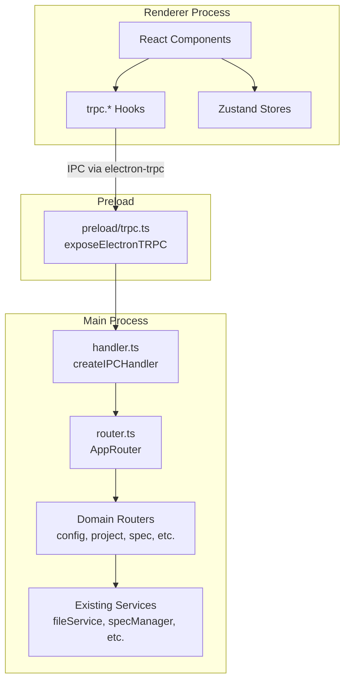
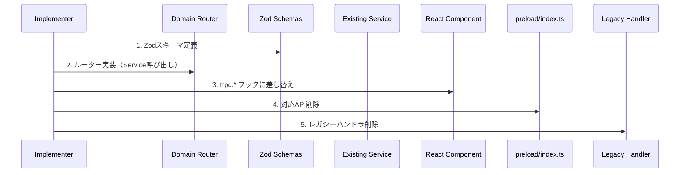
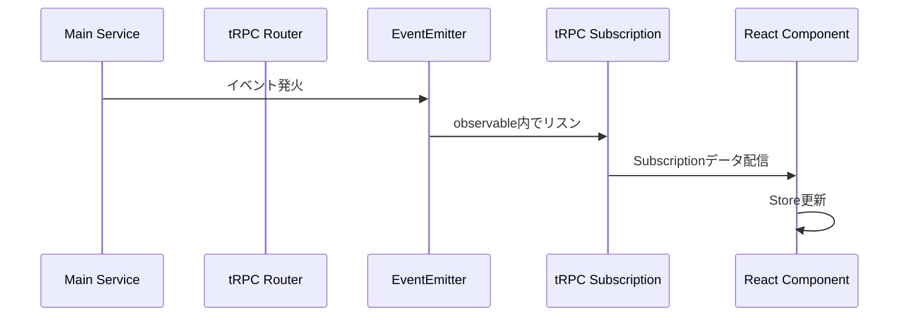
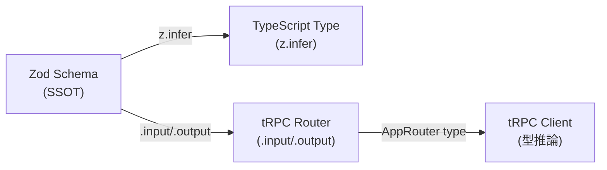
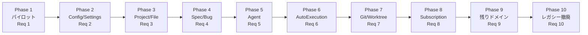

# Design: tRPC Full Migration（完全移行）

## Overview

**Purpose**: electron-sdd-managerにおける全219個のIPCチャンネルをtRPCルーターに移行し、レガシーIPC基盤（`preload/index.ts`、`ipc/channels.ts`、`ipc/handlers.ts`、`electron.d.ts`）を完全撤廃する。

**Users**: SDD Orchestrator開発者（AI Agent含む）が、型安全で保守性の高いIPC通信を利用する。

**Impact**: 既存の`window.electronAPI`ベースのIPC通信を`trpc.*`フックに全面置換し、Main-Renderer間通信のSSoTをtRPCルーター定義に統一する。

### Goals

- 全219チャンネルをドメイン別tRPCルーターに移行完了
- Main→Rendererイベント通知をtRPC Subscriptionに移行
- レガシーIPC基盤コード（preload API、channels.ts、ドメイン別handlers）を完全削除
- 移行後のアーキテクチャをドキュメントに反映

### Non-Goals

- Remote UI用tRPC over WebSocket（将来の別Specで検討、既存WebSocket通信を維持）
- パフォーマンス最適化（移行完了後に必要に応じて検討）
- 新機能追加（移行完了まで他の開発は停止）

## Architecture

### Existing Architecture Analysis

現在のIPC通信は以下の3層構造で成り立つ。

1. **channels.ts**: チャンネル名を文字列リテラル型で定義（219チャンネル）
2. **handlers.ts + ドメイン別handlers**: `ipcMain.handle`でハンドラを登録（22ファイル）
3. **preload/index.ts**: `contextBridge.exposeInMainWorld`で`window.electronAPI`としてRendererに公開（2,771行）

Renderer側は`window.electronAPI.*`を直接呼び出すか、`IpcApiClient`経由で呼び出す。Remote UIは`WebSocketApiClient`で同等の操作を実現する。

`trpc-infrastructure` Specにより、以下の基盤は構築済み。

- `src/main/trpc/trpc.ts`: tRPCインスタンス初期化
- `src/main/trpc/router.ts`: ルートルーター（現在`system`のみ）
- `src/main/trpc/context.ts`: コンテキスト定義
- `src/main/trpc/handler.ts`: `createIPCHandler`セットアップ
- `src/main/trpc/routers/system.ts`: healthCheckプロシージャ
- `src/shared/trpc/client.ts`: `createTRPCReact<AppRouter>()`
- `src/shared/trpc/provider.tsx`: TRPCProvider（Electron/Remote UI対応）
- `src/preload/trpc.ts`: `exposeElectronTRPC()`

### Architecture Pattern & Boundary Map



**Key Decisions**:
- 既存Serviceレイヤーは変更しない。ルーターがServiceを直接呼び出す薄いアダプター層として機能する
- ドメイン別ルーターは既存ハンドラファイルと1:1対応させ、移行単位を明確化する
- `IpcApiClient`は段階的に廃止し、最終的にtRPCフックが直接の通信手段となる
- Remote UI（WebSocketApiClient）は本Spec範囲外で維持する

### Technology Stack

| Layer | Choice / Version | Role in Feature | Notes |
|-------|------------------|-----------------|-------|
| IPC Transport | electron-trpc 0.7.1 | IPC over tRPC | Queries, Mutations, Subscriptions対応 |
| Server | @trpc/server 10.45.4 | ルーター定義 | 既存インストール済み |
| Client | @trpc/react-query 10.45.4 | Reactフック | 既存インストール済み |
| Validation | Zod | スキーマ定義 | 既存利用中 |
| State | Zustand | クライアント状態管理 | tRPCフック結果をStoreに反映 |

## System Flows

### ドメイン移行フロー（1ドメインあたりの移行パターン）



**Key Decisions**:
- 各ドメインで「ルーター実装 → UI差し替え → レガシー削除」の順序を厳守し、中間状態での動作保証を維持
- Serviceレイヤーのインターフェースは変更しない（ルーターが既存Serviceメソッドを直接呼び出す）
- 1PRにつき1ドメインに留め、問題発生時の切り分けを容易にする

### Subscription移行フロー（Main→Renderer イベント通知）



**Key Decisions**:
- `observable()`ヘルパーでEventEmitter/コールバックをtRPC Subscriptionに変換する
- 既存の`BrowserWindow.webContents.send()`によるpushパターンをSubscriptionに置き換える
- Subscriptionはelectron-trpc 0.7.1がIPC経由で完全サポート済み（WebSocket不要）

## Requirements Traceability

| Criterion ID | Summary | Components | Implementation Approach |
|--------------|---------|------------|------------------------|
| 1.1 | GET_APP_VERSION等4チャンネルtRPC移行 | `systemRouter` | systemルーター拡張 |
| 1.2 | Zodスキーマ定義 | `routers/system.ts`内インライン定義 | ルーター内スキーマ |
| 1.3 | Rendererフック置換 | 呼び出し元コンポーネント | `trpc.system.*`使用 |
| 1.4 | 統合テスト | `system-router.test.ts` | 既存テスト拡張 |
| 1.5 | レガシーハンドラ削除 | `projectHandlers.ts`（行247-260） | Phase 1ではpreload削除のみ、ハンドラはTask 4.4で一括削除 |
| 1.6 | preload API削除 | `preload/index.ts` | 対応エントリ削除 |
| 2.1 | config router作成 | `routers/config.ts` | 新規ルーター |
| 2.2 | Config全18チャンネル移行 | `routers/config.ts` | RecentProjects, Settings, Permissions等 |
| 2.3 | Zodスキーマ | `routers/config.ts`内インライン定義 | ルーター内スキーマ |
| 2.4 | configHandlers.ts削除 | `configHandlers.ts` | 削除 |
| 2.5 | 統合テスト | `config-router.test.ts` | 新規 |
| 3.1 | project/file router作成 | `routers/project.ts`, `routers/file.ts` | 新規ルーター |
| 3.2 | Project/File全21チャンネル移行 | 上記ルーター | プロジェクト選択、ファイル読み書き等 |
| 3.3 | Zodスキーマ | `routers/project.ts`, `routers/file.ts`内インライン定義 | ルーター内スキーマ |
| 3.4 | projectHandlers/fileHandlers削除 | 各ハンドラファイル | 削除 |
| 3.5 | projectFileHandlers削除 | `projectFileHandlers.ts` | 削除 |
| 3.6 | 統合テスト | `project-router.test.ts`, `file-router.test.ts` | 新規 |
| 4.1 | spec/bug router作成 | `routers/spec.ts`, `routers/bug.ts` | 新規ルーター |
| 4.2 | Spec/Bug全32チャンネル移行 | 上記ルーター | CRUD、実行、承認等 |
| 4.3 | Zodスキーマ | `routers/spec.ts`, `routers/bug.ts`内インライン定義 | ルーター内スキーマ |
| 4.4 | specHandlers/bugHandlers/worktreeHandlers削除 | 各ハンドラファイル | 削除 |
| 4.5 | convertWorktreeHandlers削除 | `convertWorktreeHandlers.ts` | 削除 |
| 4.6 | 統合テスト | `spec-router.test.ts`, `bug-router.test.ts` | 新規 |
| 5.1 | agent router作成 | `routers/agent.ts` | 新規ルーター |
| 5.2 | Agent全10チャンネル移行 | 上記ルーター | 起動、停止、ログ取得等 |
| 5.3 | Zodスキーマ | `routers/agent.ts`内インライン定義 | ルーター内スキーマ |
| 5.4 | agentHandlers.ts削除 | `agentHandlers.ts` | 削除 |
| 5.5 | 統合テスト | `agent-router.test.ts` | 新規 |
| 6.1 | autoExecution router作成 | `routers/autoExecution.ts` | 新規ルーター |
| 6.2 | AutoExecution全25チャンネル移行 | 上記ルーター | Spec/Bug両方の自動実行 |
| 6.3 | Zodスキーマ | `routers/autoExecution.ts`内インライン定義 | ルーター内スキーマ |
| 6.4 | autoExecution/bugAutoExecutionHandlers削除 | 各ハンドラファイル | 削除 |
| 6.5 | 統合テスト | `autoExecution-router.test.ts` | 新規 |
| 7.1 | git router作成 | `routers/git.ts` | 新規ルーター |
| 7.2 | Git/Worktree全チャンネル移行 | 上記ルーター | 差分、ファイル内容、Worktree操作 |
| 7.3 | Zodスキーマ | `routers/git.ts`内インライン定義 | ルーター内スキーマ |
| 7.4 | gitHandlers/worktreeHandlers削除 | 各ハンドラファイル | 削除 |
| 7.5 | 統合テスト | `git-router.test.ts` | 新規 |
| 8.1 | tRPC Subscription設定 | `routers/events.ts` | 新規ルーター |
| 8.2 | 全イベント通知移行 | 上記ルーター | Agent出力、Spec/Bug変更等 |
| 8.3 | ipcRenderer.onリスナー削除 | Renderer側各ファイル | 削除 |
| 8.4 | Subscriptionフック使用 | Renderer側各コンポーネント | `trpc.events.*.useSubscription` |
| 8.5 | 統合テスト | `events-router.test.ts` | 新規 |
| 9.1 | 残りドメイン全移行 | `routers/cloudflare.ts`, `routers/install.ts`, `routers/mcp.ts`, `routers/schedule.ts`, `routers/misc.ts` | 新規ルーター群 |
| 9.2 | Zodスキーマ | 各`routers/*.ts`内インライン定義 | ルーター内スキーマ |
| 9.3 | 対応ハンドラ削除 | 各ハンドラファイル | 削除 |
| 9.4 | 統合テスト | 各ルーターテスト | 新規 |
| 10.1 | preload/index.ts削除/最小化 | `preload/index.ts` | electronAPI削除 |
| 10.2 | channels.ts削除 | `channels.ts` | 削除 |
| 10.3 | handlers.ts・全ドメインハンドラ削除 | `handlers.ts`他 | 削除 |
| 10.4 | electron.d.ts型定義削除 | `electron.d.ts` | 削除 |
| 10.5 | contextBridge削除 | `preload/index.ts` | 削除 |
| 10.6 | window.electronAPI参照全削除 | Renderer/Remote UI全体 | tRPCフックに置換 |
| 10.7 | TypeScript/テストpass | プロジェクト全体 | `npm run build && npm run typecheck` |
| 10.8 | 全統合テストpass | テスト全体 | `vitest run` |
| 11.1 | E2E/人間テストチェックリスト | ドキュメント | 作成 |
| 11.2 | 自動化可能項目のE2Eテスト | `e2e/` | 作成/更新 |
| 12.1 | tech.md更新 | `.kiro/steering/tech.md` | IPC設計パターン更新 |
| 12.2 | structure.md更新 | `.kiro/steering/structure.md` | ディレクトリ構造更新 |
| 12.3 | 計画書ステータス更新 | `docs/future-concepts/trpc-migration-plan.md` | 完了ステータス追記 |
| 12.4 | tRPC API追加手順文書化 | ドキュメント | 新規作成 |

### Coverage Validation Checklist

- [x] 全criterion IDがトレーサビリティテーブルに含まれている
- [x] 各criterionに具体的なコンポーネント名が記載されている
- [x] 実装アプローチが「既存再利用」vs「新規実装」を区別している
- [x] UI関連criterionは具体的なコンポーネント名を指定している

## Components and Interfaces

| Component | Domain/Layer | Intent | Req Coverage | Key Dependencies | Contracts |
|-----------|--------------|--------|--------------|------------------|-----------|
| systemRouter (拡張) | Main/Router | システム情報API | 1 | app (P0) | Service |
| configRouter | Main/Router | 設定管理API | 2 | configStore, layoutConfigService (P0) | Service |
| projectRouter | Main/Router | プロジェクト管理API | 3 | fileService, specManagerService (P0) | Service |
| fileRouter | Main/Router | ファイル操作API | 3 | fileService (P0) | Service |
| specRouter | Main/Router | Spec管理API | 4 | specManagerService (P0) | Service |
| bugRouter | Main/Router | Bug管理API | 4 | bugService (P0) | Service |
| agentRouter | Main/Router | Agent管理API | 5 | agentProcess, agentRegistry (P0) | Service |
| autoExecutionRouter | Main/Router | 自動実行API | 6 | autoExecutionCoordinator (P0) | Service |
| gitRouter | Main/Router | Git/Worktree API | 7 | worktreeService, gitService (P0) | Service |
| eventsRouter | Main/Router | Subscription通知 | 8 | EventEmitter各種 (P0) | Event |
| cloudflareRouter | Main/Router | Cloudflare Tunnel API | 9 | cloudflareService (P0) | Service |
| installRouter | Main/Router | インストール管理API | 9 | installerServices (P0) | Service |
| mcpRouter | Main/Router | MCP Server API | 9 | mcpServerService (P0) | Service |
| scheduleRouter | Main/Router | スケジュールタスクAPI | 9 | scheduleTaskService (P0) | Service |
| miscRouter | Main/Router | その他API（SSH等） | 9 | 各種Service (P0) | Service |
| Zodスキーマ群 | Main/Schema | 入出力バリデーション | 全要件 | Zod (P0) | - |
| vanillaClient | Shared/Client | Zustand Store用命令的tRPCクライアント | 全要件 | ipcLink (P0) | Service |
| useSystemInfo | Shared/Hooks | システム情報取得フック | 1 | trpc.system.* (P0) | Hook |
| useConfigTrpc | Shared/Hooks | Config操作フック群（useRecentProjects, useLayoutConfig, useRemoteUiAutoStart） | 2 | trpc.config.* (P0) | Hook |

### Main / Router Layer

#### configRouter

| Field | Detail |
|-------|--------|
| Intent | 設定管理関連の全IPCチャンネルをtRPCプロシージャとして提供 |
| Requirements | 2.1, 2.2, 2.3, 2.4, 2.5 |

**Responsibilities & Constraints**
- configStore（electron-store）経由の永続化設定CRUD
- プロジェクト単位設定（layoutConfig、skipPermissions、projectDefaults）のCRUD
- エンジン設定、ツールパス設定の管理
- profileロード

**Dependencies**
- Inbound: Renderer via tRPC hooks -- 設定読み書き (P0)
- Outbound: configStore -- hang threshold, layout等 (P0)
- Outbound: layoutConfigService -- project-specific config (P0)
- Outbound: toolPathResolverService -- ツールパス解決 (P1)

**Contracts**: Service [x]

##### Service Interface

```typescript
// config router procedures
interface ConfigRouterProcedures {
  // Recent Projects
  getRecentProjects: Query<void, RecentProject[]>;
  addRecentProject: Mutation<{ path: string }, void>;

  // Hang Threshold
  getHangThreshold: Query<void, number>;
  setHangThreshold: Mutation<{ threshold: number }, void>;

  // Layout Config
  loadLayoutConfig: Query<void, LayoutValues>;
  saveLayoutConfig: Mutation<{ config: LayoutValues }, void>;
  resetLayoutConfig: Mutation<void, void>;

  // Skip Permissions
  loadSkipPermissions: Query<{ projectPath: string }, boolean>;
  saveSkipPermissions: Mutation<{ projectPath: string; skipPermissions: boolean }, void>;

  // Project Defaults
  loadProjectDefaults: Query<{ projectPath: string }, ProjectDefaults | null>;
  saveProjectDefaults: Mutation<{ projectPath: string; defaults: ProjectDefaults }, void>;

  // Profile
  loadProfile: Query<{ projectPath: string }, ProfileConfig | null>;

  // Engine Config
  loadEngineConfig: Query<{ projectPath: string }, EngineConfig>;
  saveEngineConfig: Mutation<{ projectPath: string; config: EngineConfig }, void>;
  getAvailableLlmEngines: Query<void, LLMEngineInfo[]>;

  // Tool Path
  getToolStatuses: Query<void, ToolStatus[]>;
  setToolPath: Mutation<{ tool: string; path: string }, void>;
  resolveTool: Query<{ tool: string }, { resolved: boolean; source: string }>;

  // VCS Scheme
  getVcsScheme: Query<{ projectPath: string }, string>;
  setVcsScheme: Mutation<{ projectPath: string; scheme: string }, { success: boolean; error?: string }>;

  // Remote UI Auto Start
  loadRemoteUiAutoStart: Query<{ projectPath: string }, boolean>;
  saveRemoteUiAutoStart: Mutation<{ projectPath: string; enabled: boolean }, void>;
}
```

- Preconditions: currentProjectPathが設定済みであること（プロジェクト単位設定の場合）
- Postconditions: 設定値が永続化されること
- Invariants: configStoreのスキーマバリデーションに準拠

#### projectRouter

| Field | Detail |
|-------|--------|
| Intent | プロジェクト選択・パス管理の全IPCチャンネルをtRPCプロシージャとして提供 |
| Requirements | 3.1, 3.2, 3.3, 3.4, 3.6 |

**Responsibilities & Constraints**
- プロジェクト選択（unified selectProject）
- ファイルダイアログ表示
- kiroディレクトリ検証
- 初期プロジェクトパス取得

**Dependencies**
- Inbound: Renderer via tRPC hooks -- プロジェクト操作 (P0)
- Outbound: fileService, specManagerService -- プロジェクト管理 (P0)
- Outbound: Electron dialog API -- ファイル選択 (P0)

**Contracts**: Service [x]

##### Service Interface

```typescript
interface ProjectRouterProcedures {
  selectProject: Mutation<{ projectPath: string }, SelectProjectResult>;
  showOpenDialog: Mutation<void, string | null>;
  validateKiroDirectory: Query<{ path: string }, KiroValidationResult>;
  getInitialProjectPath: Query<void, string | null>;
  setProjectPath: Mutation<{ projectPath: string }, void>;
  getWindowProject: Query<void, string | null>;
  setWindowProject: Mutation<{ projectPath: string }, void>;
  createNewWindow: Mutation<void, void>;
  getIsE2ETest: Query<void, boolean>;
}
```

- Preconditions: なし（プロジェクト未選択状態でも呼び出し可能）
- Postconditions: selectProject成功時、Main ProcessのcurrentProjectPathが更新される
- Invariants: プロジェクト選択は排他制御される（ロック機構）

#### eventsRouter

| Field | Detail |
|-------|--------|
| Intent | Main→Rendererのイベント通知をtRPC Subscriptionとして提供 |
| Requirements | 8.1, 8.2, 8.3, 8.4, 8.5 |

**Responsibilities & Constraints**
- Agent出力・ステータス変更のリアルタイム配信
- Spec/Bug変更通知
- Auto Execution状態変更通知
- ファイル変更検知通知
- Remote Server/Cloudflare Tunnel状態変更通知
- Git変更検知通知
- メトリクス更新通知

**Dependencies**
- Inbound: Renderer via tRPC subscription hooks -- イベント購読 (P0)
- Outbound: 各Service EventEmitter -- イベント発火元 (P0)

**Contracts**: Event [x]

##### Service Interface

```typescript
interface EventsRouterSubscriptions {
  // Agent Events
  onAgentOutput: Subscription<{ agentId?: string }, AgentOutputEvent>;
  onAgentStatusChange: Subscription<void, AgentStatusChangeEvent>;
  onAgentLog: Subscription<void, ParsedLogEntry>;
  onAgentStartError: Subscription<void, AgentStartError>;
  onAgentExitError: Subscription<void, AgentExitErrorEvent>;
  onAgentRecordChanged: Subscription<void, AgentRecordChangeEvent>;

  // Spec/Bug Events
  onSpecsChanged: Subscription<void, SpecsChangeEvent>;
  onBugsChanged: Subscription<void, BugsChangeEvent>;
  onProjectSelected: Subscription<void, SelectProjectResult>;

  // Auto Execution Events
  onAutoExecutionStatusChanged: Subscription<void, AutoExecutionStatusEvent>;
  onAutoExecutionPhaseStarted: Subscription<void, AutoExecutionPhaseEvent>;
  onAutoExecutionPhaseCompleted: Subscription<void, AutoExecutionPhaseEvent>;
  onAutoExecutionError: Subscription<void, AutoExecutionErrorEvent>;
  onAutoExecutionCompleted: Subscription<void, AutoExecutionCompletedEvent>;

  // Bug Auto Execution Events
  onBugAutoExecutionStatusChanged: Subscription<void, BugAutoExecutionStatusEvent>;
  onBugAutoExecutionPhaseStarted: Subscription<void, BugAutoExecutionPhaseEvent>;
  onBugAutoExecutionPhaseCompleted: Subscription<void, BugAutoExecutionPhaseEvent>;
  onBugAutoExecutionError: Subscription<void, BugAutoExecutionErrorEvent>;
  onBugAutoExecutionCompleted: Subscription<void, BugAutoExecutionCompletedEvent>;
  onBugAutoExecutionExecutePhase: Subscription<void, BugAutoExecutionPhaseEvent>;

  // Server/Tunnel Events
  onRemoteServerStatusChanged: Subscription<void, ServerStatusEvent>;
  onRemoteClientCountChanged: Subscription<void, number>;
  onCloudflareTunnelStatusChanged: Subscription<void, TunnelStatusEvent>;

  // File Events
  onGitChangesDetected: Subscription<void, GitChangeEvent>;
  onProjectFileChanged: Subscription<void, ProjectFileChangeEvent>;

  // Schedule Task Events
  onScheduleTaskStatusChanged: Subscription<void, ScheduleTaskStatusEvent>;

  // MCP Events
  onMcpStatusChanged: Subscription<void, McpStatusEvent>;

  // Metrics Events
  onMetricsUpdated: Subscription<void, MetricsUpdateEvent>;

  // SSH Events
  onSshStatusChanged: Subscription<void, SshStatusEvent>;

  // Menu Events
  onMenuOpenProject: Subscription<void, { projectPath: string }>;
  onMenuResetLayout: Subscription<void, void>;
  onMenuInstallCli: Subscription<void, void>;
  onMenuInstallCommandset: Subscription<void, void>;
  onMenuInstallExperimentalDebug: Subscription<void, void>;
  onMenuInstallExperimentalGemini: Subscription<void, void>;
  onMenuSetCommandPrefix: Subscription<void, string>;
  onMenuToggleRemoteServer: Subscription<void, void>;
}
```

- Preconditions: Subscriptionはelectron-trpcのIPC経由で動作し、WebSocket不要
- Postconditions: イベント発生時にSubscribedクライアントにデータが配信される
- Invariants: Subscription接続はBrowserWindowライフサイクルに紐づく

**Implementation Notes**
- Integration: `observable()`を使い、既存の`BrowserWindow.webContents.send()`をSubscriptionに変換
- Validation: イベントペイロードもZodスキーマで型安全性を確保
- Risks: Menu EventsのSubscription化はElectron Menuの`click`ハンドラとの統合が必要

残りのルーター（specRouter, bugRouter, agentRouter, autoExecutionRouter, gitRouter, cloudflareRouter, installRouter, mcpRouter, scheduleRouter, miscRouter）は、configRouter/projectRouterと同じパターンに従う。各ルーターは対応する既存Serviceメソッドを直接呼び出す薄いアダプターであり、新たなアーキテクチャ境界を導入しない。詳細なプロシージャ一覧は`research.md`の「ドメイン別チャンネルマッピング」セクションを参照。

**Implementation Notes（specRouter）**: specRouterにはhandlers.ts内の`registerSteeringHandlers()`が担当する4チャンネル（CHECK_STEERING_FILES → `spec.checkSteeringFiles`, GENERATE_VERIFICATION_MD → `spec.generateVerificationMd`, CHECK_RELEASE_MD → `spec.checkReleaseMd`, GENERATE_RELEASE_MD → `spec.generateReleaseMd`）も含まれる。これらはresearch.mdのspec routerマッピングテーブルに記載済みであり、Task 5.1のスコープ内で実装する。

### Main / Schema Layer

#### Zodスキーマ群

| Field | Detail |
|-------|--------|
| Intent | 全tRPCプロシージャの入出力をZodスキーマで定義し、ランタイム型安全性を確保 |
| Requirements | 全要件（1.2, 2.3, 3.3, 4.3, 5.3, 6.3, 7.3, 9.2） |

**Responsibilities & Constraints**
- 各ドメインルーターの入力（`.input()`）と出力（`.output()`）スキーマを定義
- 既存の型定義（`renderer/types/`、`shared/types/`）と整合性を維持
- `z.infer<>`による型推論でコード内の型定義を一元化

**Dependencies**
- Inbound: 各ドメインルーター -- スキーマ参照 (P0)
- External: Zod -- バリデーションライブラリ (P0)

**Contracts**: Service [x]

スキーマ配置方針:

各ルーターファイル内（`routers/*.ts`）にZodスキーマをインライン定義する。スキーマの共有が必要な場合やスキーマが肥大化した場合は、ルーター単位で`schemas/`への分離を検討する。

### Renderer / Migration Layer

#### vanillaClient（Zustand Store用命令的tRPCクライアント）

| Field | Detail |
|-------|--------|
| Intent | Reactコンポーネント外（Zustand Store等）からtRPCプロシージャを呼び出すための命令的クライアント |
| Requirements | 全要件（Store内の`window.electronAPI`置換に使用） |

**コンポーネント定義**: `src/shared/trpc/vanillaClient.ts`

- `createTRPCProxyClient<AppRouter>`を使用したシングルトンクライアント
- `getVanillaClient()`: シングルトンインスタンスの取得（遅延初期化）
- `resetVanillaClient()`: テスト用のインスタンスリセット

**使い分けルール**:

| 呼び出し元 | 使用するクライアント | 例 |
|-----------|-------------------|-----|
| Reactコンポーネント内 | `trpc.*.useQuery` / `trpc.*.useMutation` | コンポーネントのデータ取得・操作 |
| Zustand Store内 | `getVanillaClient()` | Store actionからのIPC呼び出し |
| Reactフック内 | `trpc.*.useQuery` / `trpc.*.useMutation` | カスタムフック（`useConfigTrpc`等） |

**シングルトン設計の理由**:
- `ipcLink()`の再利用による接続効率化
- Store間で一貫したクライアントインスタンスを共有

**ライフサイクル管理**:
- `ipcLink()`は`require('electron-trpc/renderer')`をdynamic requireで取得（Remote UIバンドルへの混入回避）
- **Electron専用**: Remote UIからは利用不可（Remote UIは既存WebSocketApiClientを使用）
- BrowserWindowクローズ時のcleanupはelectron-trpc内部のIPC管理に委譲（明示的なcleanup不要）

**フック層**:

Renderer/Shared層には以下のReactフックが`shared/hooks/`に配置される。命名規則は`use{Domain}Trpc`または`use{Domain}`。

- `useSystemInfo`: `trpc.system.*`を使用したシステム情報取得フック
- `useConfigTrpc`: `trpc.config.*`を使用したConfig操作フック群（`useRecentProjects`, `useLayoutConfig`, `useRemoteUiAutoStart`）

#### IpcApiClient段階的廃止

| Field | Detail |
|-------|--------|
| Intent | window.electronAPIの呼び出しをtRPCフックに段階的に置換 |
| Requirements | 10.6 |

Renderer側の移行は以下の手順で進める。

1. **Store内の`window.electronAPI.*`呼び出し** → `getVanillaClient()`経由のtRPC mutation/queryで置換
2. **コンポーネント内の直接呼び出し** → tRPCフック（`trpc.*.useQuery` / `trpc.*.useMutation`）使用
3. **IpcApiClient.tsのメソッド** → 呼び出し元をtRPCフック or vanillaClientに変更後、メソッド削除
4. **最終段階**: IpcApiClient.ts自体を削除（Remote UIのWebSocketApiClient.tsはScope外で維持）

## Data Models

### Domain Model

本移行はデータモデルに変更を加えない。既存の型定義をZodスキーマとして再定義する。



**Key Decisions**:
- Zodスキーマが型定義のSSoTとなり、`renderer/types/`の型定義は段階的にZodスキーマのinfer型に移行
- 既存の型（`SpecMetadata`, `BugDetail`等）との互換性を維持するため、Zodスキーマの出力型が既存型と一致することをテストで検証

## Error Handling

### Error Strategy

tRPCの組み込みエラー処理を活用する。

- **TRPCError**: tRPC標準のエラー型でクライアントにエラーを返す
- **Error Code Mapping**: 既存のIPC例外をtRPCエラーコードにマッピング

### Error Categories and Responses

| Category | tRPC Error Code | 例 |
|----------|----------------|-----|
| 入力バリデーション | `BAD_REQUEST` | Zodスキーマ違反 |
| リソース未検出 | `NOT_FOUND` | Spec/Bug/Agentが存在しない |
| 内部エラー | `INTERNAL_SERVER_ERROR` | Service層での例外 |
| 認証/権限 | `FORBIDDEN` | 操作権限なし |

### Monitoring

- 既存のprojectLoggerによるログ出力を維持
- ルーター内でtry/catchし、エラーをログ記録後にTRPCErrorとしてスロー

## Testing Strategy

### Unit Tests / Router Tests

各ドメインルーターに対するテスト。

- Zodスキーマバリデーション（有効入力、無効入力）
- プロシージャ呼び出しとService層モックの検証
- エラーケースの検証

### Integration Tests

tRPC統合テスト（既存`main-integration.test.ts`パターンを踏襲）。

- ルーター登録とプロシージャ呼び出しの結合テスト
- Subscriptionのイベント配信テスト
- コンテキスト伝搬テスト

### E2E Tests

- アプリケーション起動・Smoke Test
- プロジェクト選択 → エージェント実行（Critical Path）
- Remote UI接続確認

## Integration Test Strategy

### Cross-Boundary Communication Tests

tRPC移行により、IPC通信の境界が変わるため、以下の統合テストが必要。

**Components**: tRPC Router, Zod Schema, Existing Service Layer

**Data Flow**: `React Component → trpc.* hook → IPC (electron-trpc) → tRPC Router → Service → Result → IPC → React Component`

**Mock Boundaries**:
- Mock: Electron `BrowserWindow`、`ipcMain` / `ipcRenderer`（electron-trpcが内部で使用）
- Real: tRPC Router、Zod Schema validation、Service Layer（Serviceの外部依存はモック）

**Verification Points**:
- ルータープロシージャが正しいService メソッドを呼び出すこと
- Zodスキーマバリデーションが不正入力を拒否すること
- Subscriptionがイベント発火時にデータを配信すること
- エラーが適切なTRPCErrorコードに変換されること

**Robustness Strategy**:
- Subscriptionテストでは`waitFor`パターンを使用し、固定sleepを回避
- EventEmitterのイベント発火をテスト制御下で行い、タイミング依存を排除

**Prerequisites**:
- 各ルーターテストファイルは`src/main/trpc/__tests__/`に配置
- テスト用のService モックファクトリを共通化（`test/mocks/services.ts`）

## Verification Contract

### User Journey Definition

| Journey ID | Operation Flow | Expected Result | E2E Required |
|------------|---------------|-----------------|--------------|
| UJ-001 | アプリ起動 → メイン画面表示 | 画面が正常に表示され、tRPCのhealthCheckが成功 | Yes |
| UJ-002 | プロジェクト選択 → Spec一覧表示 | tRPC経由でSpec一覧が取得・表示される | Yes |
| UJ-003 | Spec選択 → ワークフロー操作 → Agent起動 | Agent起動がtRPC mutation経由で成功 | Yes |
| UJ-004 | Agent実行中ログ表示 | tRPC Subscription経由でログがリアルタイム表示 | Yes |
| UJ-005 | 設定画面 → 各種設定変更 | tRPC mutation経由で設定が保存・反映 | No |
| UJ-006 | Remote UI接続 → 操作 | WebSocket通信が維持され正常動作 | Yes |
| UJ-007 | ファイル選択ダイアログ操作 | Electronネイティブダイアログが表示 | No |
| UJ-008 | Auto Execution開始 → 完了 | tRPC経由で自動実行が制御される | Yes |

### Impact Analysis Contract

| Target File | Action | Reason |
|-------------|--------|--------|
| `src/main/trpc/router.ts` | UPDATE | 全ドメインルーターをappRouterに追加 |
| `src/main/trpc/context.ts` | UPDATE | 必要に応じてcontext拡張（currentProjectPath等） |
| `src/main/trpc/routers/system.ts` | UPDATE | Req 1のシステム情報プロシージャ追加 |
| `src/main/trpc/routers/config.ts` | CREATE | Configドメインルーター |
| `src/main/trpc/routers/project.ts` | CREATE | Projectドメインルーター |
| `src/main/trpc/routers/file.ts` | CREATE | Fileドメインルーター |
| `src/main/trpc/routers/spec.ts` | CREATE | Specドメインルーター |
| `src/main/trpc/routers/bug.ts` | CREATE | Bugドメインルーター |
| `src/main/trpc/routers/agent.ts` | CREATE | Agentドメインルーター |
| `src/main/trpc/routers/autoExecution.ts` | CREATE | AutoExecutionドメインルーター |
| `src/main/trpc/routers/git.ts` | CREATE | Gitドメインルーター |
| `src/main/trpc/routers/events.ts` | CREATE | Subscriptionイベントルーター |
| `src/main/trpc/routers/cloudflare.ts` | CREATE | Cloudflareドメインルーター |
| `src/main/trpc/routers/install.ts` | CREATE | Installドメインルーター |
| `src/main/trpc/routers/mcp.ts` | CREATE | MCPドメインルーター |
| `src/main/trpc/routers/schedule.ts` | CREATE | Scheduleドメインルーター |
| `src/main/trpc/routers/misc.ts` | CREATE | その他ドメインルーター |
| `src/main/trpc/routers/*.ts`内 | INLINE | 各ドメインのZodスキーマ（ルーター内インライン定義） |
| `src/main/ipc/channels.ts` | DELETE | レガシーチャンネル定義 |
| `src/main/ipc/handlers.ts` | DELETE | レガシーハンドラオーケストレーター |
| `src/main/ipc/configHandlers.ts` | DELETE | レガシーConfigハンドラ |
| `src/main/ipc/projectHandlers.ts` | DELETE | レガシーProjectハンドラ |
| `src/main/ipc/fileHandlers.ts` | DELETE | レガシーFileハンドラ |
| `src/main/ipc/projectFileHandlers.ts` | DELETE | レガシーProjectFileハンドラ |
| `src/main/ipc/specHandlers.ts` | DELETE | レガシーSpecハンドラ |
| `src/main/ipc/bugHandlers.ts` | DELETE | レガシーBugハンドラ |
| `src/main/ipc/bugWorktreeHandlers.ts` | DELETE | レガシーBugWorktreeハンドラ |
| `src/main/ipc/agentHandlers.ts` | DELETE | レガシーAgentハンドラ |
| `src/main/ipc/autoExecutionHandlers.ts` | DELETE | レガシーAutoExecutionハンドラ |
| `src/main/ipc/bugAutoExecutionHandlers.ts` | DELETE | レガシーBugAutoExecutionハンドラ |
| `src/main/ipc/gitHandlers.ts` | DELETE | レガシーGitハンドラ |
| `src/main/ipc/worktreeHandlers.ts` | DELETE | レガシーWorktreeハンドラ |
| `src/main/ipc/worktreeImplHandlers.ts` | DELETE | レガシーWorktreeImplハンドラ |
| `src/main/ipc/convertWorktreeHandlers.ts` | DELETE | レガシーConvertWorktreeハンドラ |
| `src/main/ipc/cloudflareHandlers.ts` | DELETE | レガシーCloudflareハンドラ |
| `src/main/ipc/installHandlers.ts` | DELETE | レガシーInstallハンドラ |
| `src/main/ipc/mcpHandlers.ts` | DELETE | レガシーMCPハンドラ |
| `src/main/ipc/scheduleTaskHandlers.ts` | DELETE | レガシーScheduleTaskハンドラ |
| `src/main/ipc/metricsHandlers.ts` | DELETE | レガシーMetricsハンドラ |
| `src/main/ipc/remoteAccessHandlers.ts` | DELETE | レガシーRemoteAccessハンドラ |
| `src/main/ipc/sshHandlers.ts` | DELETE | レガシーSSHハンドラ |
| `src/main/ipc/clipboardHandlers.ts` | DELETE | レガシーClipboardハンドラ |
| `src/main/ipc/startImplPhase.ts` | DELETE | レガシーImplPhaseハンドラ |
| `src/main/ipc/ipcUtils.ts` | DELETE | レガシーIPCユーティリティ |
| `src/main/ipc/sshChannels.ts` | DELETE | レガシーSSHチャンネル定義 |
| `src/preload/index.ts` | UPDATE | electronAPI削除、trpc importのみ残す |
| `src/renderer/types/electron.d.ts` | DELETE | レガシーAPI型定義 |
| `src/shared/api/IpcApiClient.ts` | DELETE | tRPCフックに置換 |
| `src/shared/api/types.ts` | UPDATE | IpcApiClient依存の型を整理 |
| `src/renderer/stores/projectStore.ts` | UPDATE | window.electronAPIをtRPCに置換 |
| `src/renderer/stores/agentStore.ts` | UPDATE | window.electronAPIをtRPCに置換 |
| `src/renderer/stores/spec/*.ts` | UPDATE | window.electronAPIをtRPCに置換 |
| `src/renderer/stores/editorStore.ts` | UPDATE | window.electronAPIをtRPCに置換 |
| `src/renderer/stores/remoteAccessStore.ts` | UPDATE | window.electronAPIをtRPCに置換 |
| `src/renderer/stores/connectionStore.ts` | UPDATE | window.electronAPIをtRPCに置換 |
| `src/renderer/stores/versionStatusStore.ts` | UPDATE | window.electronAPIをtRPCに置換 |
| `src/renderer/hooks/*.ts` | UPDATE | window.electronAPIをtRPCに置換 |
| `src/renderer/components/*.tsx` | UPDATE | window.electronAPIをtRPCに置換 |
| `src/renderer/App.tsx` | UPDATE | イベントリスナーをtRPC Subscriptionに置換 |
| `src/shared/stores/*.ts` | UPDATE | window.electronAPIをtRPCに置換 |
| `src/shared/components/git/GitView.tsx` | UPDATE | window.electronAPIをtRPCに置換 |

## Interface Changes & Impact Analysis

### 主要インターフェース変更

#### 1. window.electronAPI の廃止

**変更内容**: `window.electronAPI`オブジェクト全体を削除し、tRPCフックに置換。

**影響を受けるCaller一覧**:

| Caller Location | 呼び出し数 | 対応 |
|----------------|-----------|------|
| `src/shared/api/IpcApiClient.ts` | 44メソッド | IpcApiClient自体を削除、呼び出し元をtRPCに変更 |
| `src/renderer/stores/` (全Store) | ~120呼び出し | Store内のIPC呼び出しをtRPC mutation/queryに置換 |
| `src/renderer/components/` (全コンポーネント) | ~60呼び出し | コンポーネント内でtRPCフック使用 |
| `src/renderer/hooks/` | ~20呼び出し | フック内でtRPCフック使用 |
| `src/shared/stores/` | ~10呼び出し | Store内のIPC呼び出しをtRPCに置換 |
| `src/shared/components/` | ~5呼び出し | コンポーネント内でtRPCフック使用 |
| `src/renderer/App.tsx` | ~34リスナー | ipcRenderer.onをtRPC Subscriptionに置換 |

合計: Renderer/Shared全体で約693箇所の`window.electronAPI`参照を更新（約88ファイルに分散）。

#### 2. ipcRenderer.on リスナーの廃止

**変更内容**: Main→Renderer方向のイベント通知（`ipcRenderer.on`）をtRPC Subscriptionに置換。

**影響を受けるリスナー一覧**（主要なもの）:

| イベント | 現在のリスナー場所 | 移行先 |
|---------|------------------|--------|
| AGENT_OUTPUT, AGENT_STATUS_CHANGE | App.tsx, agentStore | `trpc.events.onAgentOutput.useSubscription` |
| AGENT_LOG | App.tsx | `trpc.events.onAgentLog.useSubscription` |
| SPECS_CHANGED | App.tsx | `trpc.events.onSpecsChanged.useSubscription` |
| BUGS_CHANGED | App.tsx | `trpc.events.onBugsChanged.useSubscription` |
| AUTO_EXECUTION_STATUS_CHANGED | App.tsx | `trpc.events.onAutoExecutionStatusChanged.useSubscription` |
| REMOTE_SERVER_STATUS_CHANGED | App.tsx | `trpc.events.onRemoteServerStatusChanged.useSubscription` |
| MENU_* | App.tsx | `trpc.events.onMenu*.useSubscription` |

## Migration Strategy

### Phase Breakdown



**Key Decisions**:
- 依存関係が少ない参照系（Phase 1）から開始し、パターンを確立
- Subscription移行（Phase 8）はQuery/Mutation移行後に実施し、イベント通知の信頼性を確保
- レガシー撤廃（Phase 10）は全移行完了後の最終フェーズ
- 各Phaseは独立してTypeScript/テストがpassする状態を維持

### Rollback Triggers

- TypeScriptコンパイルエラーが解消できない場合
- E2Eテストの重要パスが失敗する場合
- Subscription移行でイベント欠損が発生する場合

## Design Decisions

### DD-001: ドメイン別段階的移行戦略

| Field | Detail |
|-------|--------|
| Status | Accepted |
| Context | 219チャンネルの移行方法として、Big Bang vs 段階的の選択が必要 |
| Decision | ドメイン単位の段階的移行を採用。1PRにつき1ドメイン |
| Rationale | 問題発生時の切り分けが容易。各ステップでTypeScript/テストがpassする中間状態を保証 |
| Alternatives Considered | Big Bang移行（一括移行）: リスクが高く、問題の切り分けが困難 |
| Consequences | 移行期間中はレガシーIPC/tRPCが共存する期間が発生。ただしScope内で完結するため影響は限定的 |

### DD-002: ルーターは既存Serviceの薄いアダプター

| Field | Detail |
|-------|--------|
| Status | Accepted |
| Context | ルーターにビジネスロジックを含めるか、Serviceを直接呼ぶか |
| Decision | ルーターはZodバリデーション + Service呼び出しのみの薄いレイヤーとする |
| Rationale | 既存ServiceのテストとロジックをそのままtRPC経由で利用。Service変更の影響範囲を限定 |
| Alternatives Considered | ルーター内にロジック統合: Serviceの二重管理が発生し保守性低下 |
| Consequences | Serviceインターフェースの変更は不要。ルーターテストはServiceモックで検証 |

### DD-003: tRPC SubscriptionによるMain→Rendererイベント通知

| Field | Detail |
|-------|--------|
| Status | Accepted |
| Context | 既存の`BrowserWindow.webContents.send()` + `ipcRenderer.on()`パターンの移行先 |
| Decision | tRPC Subscriptionと`observable()`ヘルパーを使用 |
| Rationale | electron-trpc 0.7.1がSubscriptionを完全サポート。型安全でtRPCの統一的なインターフェースに収まる |
| Alternatives Considered | EventEmitter direct exposure: 型安全性に欠ける。SSE: Electron IPCでは不要 |
| Consequences | 全イベントリスナー（34種類）をSubscriptionフックに書き換える必要がある。Req 8で対応 |

### DD-004: Zodスキーマを型定義のSSoTとする

| Field | Detail |
|-------|--------|
| Status | Accepted |
| Context | 既存の手書き型定義（`renderer/types/`）とZodスキーマの関係 |
| Decision | Zodスキーマを定義し、`z.infer<>`で型を導出する方式をSSoTとする |
| Rationale | ランタイムバリデーションとコンパイルタイム型チェックを同時に達成。型の二重管理を排除 |
| Alternatives Considered | 既存型定義を維持しZodスキーマを別途定義: 同期ミスのリスク |
| Consequences | 段階的に`renderer/types/`の型定義をZodスキーマのinfer型に置き換える。移行中は両方が存在 |

### DD-005: IpcApiClientの段階的廃止

| Field | Detail |
|-------|--------|
| Status | Accepted |
| Context | 現在`IpcApiClient`はApiClient抽象化層の一部として機能している |
| Decision | ドメイン単位でIpcApiClientメソッドを削除し、最終的にIpcApiClient自体を削除 |
| Rationale | tRPCフックが直接型安全な通信を提供するため、中間抽象層が不要に。ただしWebSocketApiClientはRemote UI用に維持（Scope外） |
| Alternatives Considered | IpcApiClient内部をtRPC呼び出しに置換: 抽象層の存在意義がなくなるため、直接フック使用が望ましい |
| Consequences | `ApiClient`インターフェース自体はWebSocketApiClient用に残るが、IPC実装は削除。Remote UIへの影響なし |

### DD-006: tRPC Contextへのサービス注入

| Field | Detail |
|-------|--------|
| Status | Accepted |
| Context | 現在のContextは空（`{}`）。ルーターからServiceにアクセスする方法 |
| Decision | Contextにサービスインスタンスを注入し、ルーター内で`ctx.services.*`としてアクセス |
| Rationale | テスト時にモックサービスを注入可能。handlers.tsの「DI」パターンをContext経由に移行 |
| Alternatives Considered | 直接import: テスト困難。グローバルシングルトン: テスト分離不可 |
| Consequences | `createContext()`にサービスファクトリを追加。テスト時はカスタムContextを渡せる |
| Implementation Notes | handlers.tsの既存DIパターンを踏襲する。`currentProjectPath`は`getCurrentProjectPath()`ゲッター関数としてContextに注入し、`ctx.services.getCurrentProjectPath()`で参照可能にする。`setProjectPath()`も同様にContext経由で提供する。handlers.tsの19個の`registerXxxHandlers()`呼び出しで使用されている依存注入パターン（ゲッター関数/サービスインスタンスの引数渡し）をContext構造に統合する。なお、`registerSteeringHandlers()`（handlers.ts行864、4チャンネル: CHECK_STEERING_FILES, GENERATE_VERIFICATION_MD, CHECK_RELEASE_MD, GENERATE_RELEASE_MD）はresearch.mdのドメイン別マッピングに従いspec routerに移行する（Task 5.1スコープ内） |

## Integration & Deprecation Strategy

### 修正が必要な既存ファイル（Wiring Points）

| File | Modification | Reason |
|------|-------------|--------|
| `src/main/trpc/router.ts` | 全ドメインルーターをimport・登録 | AppRouterの拡張 |
| `src/main/trpc/context.ts` | サービスインスタンス注入 | DD-006 |
| `src/main/trpc/handler.ts` | context生成の更新 | DD-006 |
| `src/main/index.ts`（or main entry） | tRPCハンドラ初期化のService渡し | 起動時のDI |
| `src/preload/index.ts` | electronAPI関連コード削除 | Req 10 |
| `src/renderer/App.tsx` | ipcRenderer.onリスナーをSubscriptionに置換 | Req 8 |
| `src/shared/api/types.ts` | ApiClient interface更新 | IpcApiClient削除に伴う整理 |

### 削除対象ファイル（Cleanup）

全22個のレガシーIPCハンドラファイル + channels.ts + ipcUtils.ts + sshChannels.ts + startImplPhase.ts + electron.d.ts + IpcApiClient.ts（Impact Analysis Contract参照）。

### 並行存在の方針

移行中は「レガシーIPC」と「tRPC」が共存する。各ドメイン移行完了時にそのドメインのレガシーコードを削除し、全ドメイン完了後にchannels.ts等の共通基盤を削除する。

**中間パターン: handlers.ts内の未移行ハンドラ集約**

ドメイン別ハンドラファイル（例: projectHandlers.ts, fileHandlers.ts）を物理削除する際、そのドメイン内でまだtRPC移行が完了していないチャンネルが存在する場合がある。これらは handlers.ts 内に `registerUnmigratedXxxHandlers()` として一時的に集約する。この中間パターンにより、ドメイン別ファイルの削除を先行しつつ、未移行チャンネルの動作を維持する。集約された未移行ハンドラは、対応するtRPCルーター実装完了後に handlers.ts から削除され、最終的に Task 11.2 で handlers.ts 自体が物理削除される。
