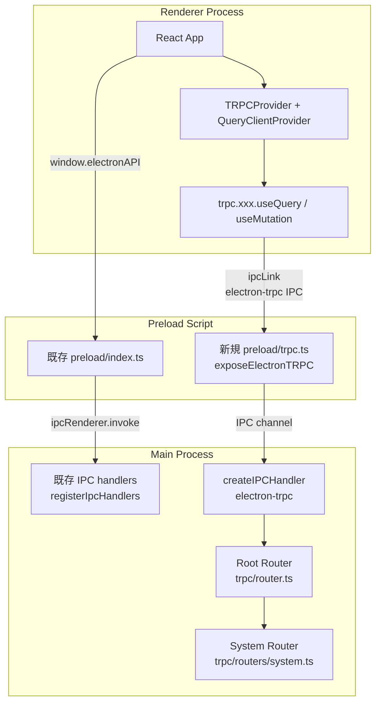
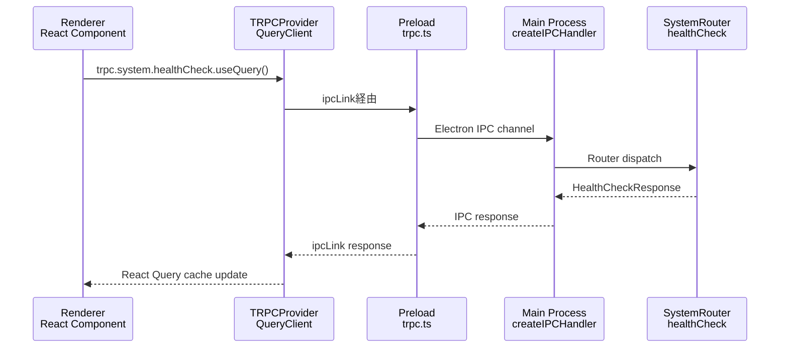
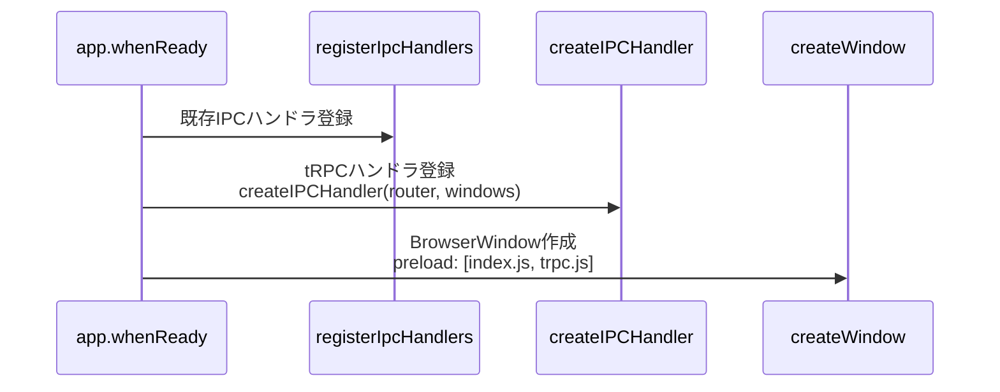

# Design: tRPC Infrastructure（基盤構築）

## Overview

**Purpose**: 本機能は、electron-sdd-managerにおけるtRPC基盤を構築し、型安全なIPC通信インフラストラクチャを提供する。現在のpreload.ts（2,771行、219チャンネル）の肥大化・複雑化を根本的に解決するための移行基盤である。

**Users**: 開発者がtRPC RouterとProcedureを使用して型安全なIPC通信を実装する。Rendererプロセスからは`trpc.system.healthCheck.useQuery()`のようなReact Hooks経由でAPIを呼び出す。

**Impact**: Main Process、Preload、Renderer、Remote UIの各レイヤーに新しいtRPC通信チャネルを追加する。既存のIPCハンドラ（`registerIpcHandlers()`）とは独立して共存する。

### Goals

- electron-trpcを使用してElectron IPC上にtRPC通信基盤を構築する
- Main Process（Router/Procedure）からRenderer（React Hooks）まで完全な型安全性を実現する
- healthCheck APIによる動作検証可能な最小構成を提供する
- 既存IPC通信に影響を与えず共存させる

### Non-Goals

- 既存IPCチャンネルのtRPC移行（`trpc-full-migration` Specで対応）
- Remote UI用WebSocket経由のtRPC通信（将来検討）
- 認証・認可、レート制限（デスクトップアプリのため不要）
- エラーハンドリングの統一設計（`trpc-full-migration`で検討）

## Architecture

### Existing Architecture Analysis

現在のIPC通信は以下の構造で実装されている。

- **channels.ts**: 219チャンネルの文字列定数定義
- **handlers.ts**: 中央オーケストレーターとして全ハンドラを統合（`safeHandle`ユーティリティ使用）
- **preload/index.ts**: 2,771行。`contextBridge.exposeInMainWorld`で`window.electronAPI`を公開
- **ApiClient抽象化層**: `IpcApiClient`（Electron版）と`WebSocketApiClient`（Remote UI版）で通信を透過化

この構造の問題は、チャンネル追加のたびにchannels.ts、handlers.ts、preload/index.tsの3箇所を手動で同期する必要がある点である。tRPCはRouter定義から型情報を自動伝播することでこの問題を解消する。

### Architecture Pattern & Boundary Map



**Key Decisions**:
- tRPC通信と既存IPC通信は完全に独立したチャネルで動作し、相互干渉しない
- Preloadスクリプトを分離（`preload/trpc.ts`）し、既存の`preload/index.ts`を変更しない
- Vite設定でpreloadを追加エントリーとしてビルドする

**Architecture Integration**:
- Selected pattern: tRPC Router/Procedure（electron-trpc経由）。型情報がRouter定義からクライアントまで自動伝播される
- Domain/feature boundaries: tRPC関連コードは`src/main/trpc/`に集約。既存の`src/main/ipc/`とは独立
- Existing patterns preserved: contextIsolation、preloadパターン、サービス層の分離
- New components rationale: 型安全なIPC基盤として、手動同期が不要な通信レイヤーを追加
- Steering compliance: DRY（3箇所同期の排除）、型安全性（any禁止）、関心の分離

### Technology Stack

| Layer | Choice / Version | Role in Feature | Notes |
|-------|------------------|-----------------|-------|
| IPC Transport | electron-trpc ^0.7.1 | Electron IPC上のtRPCトランスポート | tRPC v10互換。devDependencies配置 |
| RPC Framework | @trpc/server ^10.x | Router/Procedure定義 | dependencies配置 |
| RPC Client | @trpc/client ^10.x | ipcLink経由のクライアント | dependencies配置 |
| React Integration | @trpc/react-query ^10.x | React Hooks（useQuery等） | dependencies配置 |
| Data Fetching | @tanstack/react-query ^4.x | QueryClient、キャッシュ管理 | dependencies配置。tRPC v10は@tanstack/react-query v4のみサポート |
| Validation | zod ^3.24 (既存) | 入出力スキーマ定義 | インストール済み |

> electron-trpc v0.7.1はtRPC v10系と互換。tRPC v11対応が必要な場合は`trpc-electron`（mat-szフォーク）を検討するが、現時点ではv10系で十分。詳細は`research.md`参照。

## System Flows

### tRPC通信フロー（healthCheck例）



**Key Decisions**:
- `ipcLink`はelectron-trpcが提供するtRPC Link。HTTPリンクの代わりにElectron IPCを使用
- React QueryのキャッシュによりhealthCheck結果は自動的にキャッシュされ、再レンダリング時の再リクエストを抑制
- エラーはtRPCの`TRPCError`としてRenderer側に伝播し、React Queryの`error`状態で処理

### Main Process起動時のtRPC初期化フロー



**Key Decisions**:
- tRPCハンドラ登録は既存の`registerIpcHandlers()`呼び出し直後に配置
- `createIPCHandler`にはRouter定義とBrowserWindowの参照を渡す。ウィンドウ作成後に登録する

## Requirements Traceability

| Criterion ID | Summary | Components | Implementation Approach |
|--------------|---------|------------|------------------------|
| 1.1 | electron-trpc devDependencies | package.json | npm install（新規追加） |
| 1.2 | @trpc/server dependencies | package.json | npm install（新規追加） |
| 1.3 | @trpc/client dependencies | package.json | npm install（新規追加） |
| 1.4 | @trpc/react-query dependencies | package.json | npm install（新規追加） |
| 1.5 | @tanstack/react-query dependencies | package.json | npm install（新規追加） |
| 1.6 | zod 既存確認 | package.json | 確認のみ（zod ^3.24 インストール済み） |
| 1.7 | npm install 正常完了 | package.json | npm install実行で検証 |
| 1.8 | TypeScriptコンパイル成功 | tsconfig.json | tsc --noEmitで検証 |
| 2.1 | tRPCインスタンス定義 | TRPCInit (trpc.ts) | 新規作成 |
| 2.2 | Root Router定義 | RootRouter (router.ts) | 新規作成 |
| 2.3 | 空ネームスペース構造 | RootRouter (router.ts) | mergeRoutersで拡張可能な構造 |
| 2.4 | Context型定義 | TRPCContext (context.ts) | 新規作成 |
| 2.5 | Router型のexport | RootRouter (router.ts) | AppRouter型をexport |
| 3.1 | tRPC Preload設定 | TRPCPreload (preload/trpc.ts) | 新規作成 |
| 3.2 | exposeElectronTRPC設定 | TRPCPreload (preload/trpc.ts) | electron-trpc API使用 |
| 3.3 | 既存preloadへの非影響 | preload/index.ts | 変更なし |
| 3.4 | Vite Preloadビルド | vite.config.ts | electron plugin entry追加 |
| 4.1 | tRPCクライアント設定 | TRPCClient (shared/trpc/client.ts) | 新規作成 |
| 4.2 | createTRPCReact設定 | TRPCClient (shared/trpc/client.ts) | @trpc/react-query使用 |
| 4.3 | TRPCProvider | TRPCProvider (shared/trpc/provider.tsx) | 新規作成 |
| 4.4 | QueryClientProvider統合 | TRPCProvider (shared/trpc/provider.tsx) | @tanstack/react-query使用 |
| 4.5 | Electron版Provider統合 | renderer/App.tsx | TRPCProviderでラップ |
| 4.6 | Remote UI版Provider統合 | remote-ui/App.tsx | TRPCProviderでラップ |
| 5.1 | Electron Renderer Vite設定 | vite.config.ts | tRPCモジュール解決設定 |
| 5.2 | Remote UI Vite設定 | vite.config.remote.ts | tRPCモジュール解決設定 |
| 5.3 | Preload Vite設定 | vite.config.ts | preloadエントリー追加 |
| 5.4 | HMR動作確認 | vite.config.ts | 開発モード検証 |
| 5.5 | 本番ビルド成功 | vite.config.ts, vite.config.remote.ts | npm run build検証 |
| 6.1 | system router作成 | SystemRouter (routers/system.ts) | 新規作成 |
| 6.2 | healthCheck procedure | SystemRouter (routers/system.ts) | query procedure実装 |
| 6.3 | healthCheck応答内容 | SystemRouter (routers/system.ts) | status, timestamp, version |
| 6.4 | Zod入出力スキーマ | SystemRouter (routers/system.ts) | Zodスキーマ定義 |
| 6.5 | Renderer useQuery呼び出し | TRPCClient, TRPCProvider | trpc.system.healthCheck.useQuery() |
| 6.6 | Remote UI呼び出し | TRPCProvider (remote-ui) | 同上 |
| 7.1 | 統合テスト存在 | RouterTest (router.test.ts) | 新規作成 |
| 7.2 | Electronプロセス不要 | RouterTest (router.test.ts) | Vitest + callerパターン |
| 7.3 | healthCheck動作検証 | RouterTest (router.test.ts) | callerでprocedure直接呼び出し |
| 7.4 | 型安全性検証 | RouterTest (router.test.ts) | TypeScriptコンパイル検証 |
| 7.5 | テスト全pass | RouterTest (router.test.ts) | npm run test検証 |
| 8.1 | tRPCハンドラ登録 | MainIntegration (index.ts) | createIPCHandler呼び出し |
| 8.2 | createIPCHandler設定 | MainIntegration (index.ts) | electron-trpc API使用 |
| 8.3 | アプリ起動時自動有効化 | MainIntegration (index.ts) | app.whenReady内で初期化 |
| 8.4 | 既存IPCとの共存 | MainIntegration (index.ts) | 独立チャネルで並行動作 |
| 8.5 | エラーログ出力 | MainIntegration (index.ts) | projectLogger使用 |

### Coverage Validation Checklist

- [x] Every criterion ID from requirements.md appears in the table above
- [x] Each criterion has specific component names (not generic references)
- [x] Implementation approach distinguishes "reuse existing" vs "new implementation"
- [x] User-facing criteria specify concrete UI components (not just "shared components")

## Components and Interfaces

| Component | Domain/Layer | Intent | Req Coverage | Key Dependencies | Contracts |
|-----------|-------------|--------|--------------|-----------------|-----------|
| TRPCInit | Main/Infrastructure | tRPCインスタンス・base procedure定義 | 2.1 | @trpc/server (P0) | Service |
| TRPCContext | Main/Infrastructure | Context型定義 | 2.4 | @trpc/server (P0) | Service |
| RootRouter | Main/Infrastructure | ルートルーター定義、AppRouter型export | 2.2, 2.3, 2.5 | TRPCInit (P0), SystemRouter (P1) | Service |
| SystemRouter | Main/Domain | system.healthCheck procedure | 6.1-6.4 | TRPCInit (P0), zod (P0) | Service |
| TRPCPreload | Preload/Infrastructure | electron-trpc IPC公開 | 3.1-3.4 | electron-trpc (P0) | Service |
| TRPCClient | Shared/Infrastructure | tRPCクライアント・React Hooks定義 | 4.1, 4.2 | @trpc/react-query (P0), electron-trpc (P0) | Service |
| TRPCProvider | Shared/Infrastructure | Provider統合コンポーネント | 4.3, 4.4 | TRPCClient (P0), @tanstack/react-query (P0) | Service |
| MainIntegration | Main/Bootstrap | createIPCHandler統合 | 8.1-8.5 | RootRouter (P0), electron-trpc (P0) | Service |
| RouterTest | Test/Integration | tRPC Router統合テスト | 7.1-7.5 | RootRouter (P0), vitest (P0) | -- |

### Main / Infrastructure

#### TRPCInit

| Field | Detail |
|-------|--------|
| Intent | tRPCインスタンスの初期化とbase router/procedureの定義 |
| Requirements | 2.1 |

**Responsibilities & Constraints**
- `initTRPC.create()`によるtRPCインスタンス生成
- `publicProcedure`（認証不要のbase procedure）のexport
- 本ファイルは他のRouterファイルからimportされるため、循環参照に注意

**Dependencies**
- External: @trpc/server -- tRPCコアライブラリ (P0)
- Inbound: TRPCContext -- Context型をcreate()に渡す (P0)

**Contracts**: Service [x]

##### Service Interface

```typescript
// src/main/trpc/trpc.ts
import { initTRPC } from '@trpc/server';
import type { Context } from './context';

declare const t: ReturnType<typeof initTRPC.context<Context>.create>;

export declare const router: typeof t.router;
export declare const publicProcedure: typeof t.procedure;
```

- Preconditions: なし
- Postconditions: `router`と`publicProcedure`がexportされ、他Routerファイルから使用可能
- Invariants: tRPCインスタンスはアプリケーション全体で1つのみ

#### TRPCContext

| Field | Detail |
|-------|--------|
| Intent | tRPC Contextの型定義（初期は空） |
| Requirements | 2.4 |

**Responsibilities & Constraints**
- Context型の定義。初期段階では空オブジェクト
- 将来の拡張（認証情報、DBコネクション等）に対応可能な構造

**Contracts**: Service [x]

##### Service Interface

```typescript
// src/main/trpc/context.ts
export interface Context {}

export declare function createContext(): Context;
```

- Preconditions: なし
- Postconditions: Context型がexportされtRPCインスタンス生成に使用可能
- Invariants: Context型は全procedureで共通

#### RootRouter

| Field | Detail |
|-------|--------|
| Intent | アプリケーション全体のルートRouter定義とAppRouter型のexport |
| Requirements | 2.2, 2.3, 2.5 |

**Responsibilities & Constraints**
- ドメイン別サブRouterを`mergeRouters`パターンで統合
- `AppRouter`型をexportし、クライアント側の型推論に使用
- 初期段階ではSystemRouterのみ統合

**Dependencies**
- Inbound: TRPCInit -- router関数 (P0)
- Inbound: SystemRouter -- systemネームスペース (P1)

**Contracts**: Service [x]

##### Service Interface

```typescript
// src/main/trpc/router.ts
import type { inferRouterInputs, inferRouterOutputs } from '@trpc/server';

export declare const appRouter: ReturnType<typeof router>;
export type AppRouter = typeof appRouter;
export type RouterInputs = inferRouterInputs<AppRouter>;
export type RouterOutputs = inferRouterOutputs<AppRouter>;
```

- Preconditions: サブRouterが正しく定義されていること
- Postconditions: AppRouter型がexportされ、クライアント側で型推論が機能する
- Invariants: ルートRouterは単一。全サブRouterはここに統合される

### Main / Domain

#### SystemRouter

| Field | Detail |
|-------|--------|
| Intent | システム関連のtRPC Procedure定義（healthCheck等） |
| Requirements | 6.1, 6.2, 6.3, 6.4 |

**Responsibilities & Constraints**
- `system.healthCheck` query procedureの実装
- Zodスキーマによる出力型定義
- package.jsonからアプリバージョンを取得

**Dependencies**
- Inbound: TRPCInit -- publicProcedure (P0)
- External: zod -- スキーマ定義 (P0)

**Contracts**: Service [x]

##### Service Interface

```typescript
// src/main/trpc/routers/system.ts
import { z } from 'zod';

declare const healthCheckOutputSchema: z.ZodObject<{
  status: z.ZodLiteral<'ok'>;
  timestamp: z.ZodString;
  version: z.ZodString;
}>;

export type HealthCheckOutput = z.infer<typeof healthCheckOutputSchema>;

export declare const systemRouter: ReturnType<typeof router>;
```

- Preconditions: なし（healthCheckは無条件で成功する）
- Postconditions: `{ status: 'ok', timestamp: string, version: string }`を返す
- Invariants: healthCheckは常に`status: 'ok'`を返す（liveness check）

### Preload / Infrastructure

#### TRPCPreload

| Field | Detail |
|-------|--------|
| Intent | electron-trpcのIPC公開設定 |
| Requirements | 3.1, 3.2, 3.3, 3.4 |

**Responsibilities & Constraints**
- `exposeElectronTRPC()`を`process.once('loaded')`内で呼び出す
- 既存の`preload/index.ts`とは完全に分離
- BrowserWindowのwebPreferencesで追加preloadとして指定

**Dependencies**
- External: electron-trpc/main -- exposeElectronTRPC (P0)

**Contracts**: Service [x]

##### Service Interface

```typescript
// src/preload/trpc.ts
// electron-trpcのexposeElectronTRPCを呼び出す
// contextBridge経由でRendererにtRPC IPCチャネルを公開
```

- Preconditions: contextIsolationが有効（Electron 35ではデフォルト）
- Postconditions: Rendererプロセスからelectron-trpcのipcLinkが使用可能
- Invariants: 既存のwindow.electronAPI APIには影響しない

**Implementation Notes**
- DD-002で決定済み: `preload/trpc.ts`を分離モジュールとして作成し、`preload/index.ts`から`import './trpc'`で読み込む方式。BrowserWindow作成時に`webPreferences.preload`は単一ファイルのみ指定可能であるため、分離モジュール+importパターンで単一preload制約と関心の分離を両立する。詳細は`research.md`参照

### Shared / Infrastructure

#### TRPCClient

| Field | Detail |
|-------|--------|
| Intent | Renderer側のtRPCクライアント設定（React Hooks統合） |
| Requirements | 4.1, 4.2 |

**Responsibilities & Constraints**
- `createTRPCReact<AppRouter>()`でReact Hooks用のtRPCインスタンスを生成
- `ipcLink()`をtransportとして設定
- AppRouter型のimport（型のみ）

**Dependencies**
- External: @trpc/react-query -- createTRPCReact (P0)
- External: electron-trpc/renderer -- ipcLink (P0)
- Inbound: RootRouter -- AppRouter型（型のみ、import type） (P0)

**Contracts**: Service [x]

##### Service Interface

```typescript
// src/shared/trpc/client.ts
import type { AppRouter } from '../../main/trpc/router';
import { createTRPCReact } from '@trpc/react-query';

export declare const trpc: ReturnType<typeof createTRPCReact<AppRouter>>;
```

- Preconditions: Rendererプロセス内で実行されること
- Postconditions: `trpc.xxx.useQuery()`等のReact Hooksが使用可能
- Invariants: AppRouter型がMain Process側と一致すること

#### TRPCProvider

| Field | Detail |
|-------|--------|
| Intent | tRPCクライアントとQueryClientの統合Providerコンポーネント |
| Requirements | 4.3, 4.4, 4.5, 4.6 |

**Responsibilities & Constraints**
- `trpc.Provider` + `QueryClientProvider`をネストしたラッパーコンポーネント
- QueryClientのインスタンス管理（useStateでの遅延初期化）
- tRPCクライアントのインスタンス管理

**Dependencies**
- Inbound: TRPCClient -- trpcインスタンス (P0)
- External: @tanstack/react-query -- QueryClient, QueryClientProvider (P0)

**Contracts**: Service [x]

##### Service Interface

```typescript
// src/shared/trpc/provider.tsx
import type { ReactNode } from 'react';

interface TRPCProviderProps {
  children: ReactNode;
}

export declare function TRPCProvider(props: TRPCProviderProps): JSX.Element;
```

- Preconditions: Reactコンポーネントツリー内で使用されること
- Postconditions: 子コンポーネントから`trpc.xxx.useQuery()`等が使用可能
- Invariants: QueryClientとtRPCクライアントのインスタンスはProvider単位で1つ

### Main / Bootstrap

#### MainIntegration

| Field | Detail |
|-------|--------|
| Intent | Main Process起動時のtRPCハンドラ登録 |
| Requirements | 8.1, 8.2, 8.3, 8.4, 8.5 |

**Responsibilities & Constraints**
- `createIPCHandler({ router: appRouter, windows: [mainWindow] })`の呼び出し
- 既存の`registerIpcHandlers()`の後に配置
- エラー発生時のprojectLogger出力

**Dependencies**
- Inbound: RootRouter -- appRouter (P0)
- External: electron-trpc/main -- createIPCHandler (P0)
- Inbound: projectLogger -- ログ出力 (P1)

**Contracts**: Service [x]

##### Service Interface

```typescript
// src/main/index.ts への追加
import { createIPCHandler } from 'electron-trpc/main';
import { appRouter } from './trpc/router';

// createWindow内またはapp.whenReady内で呼び出し
declare function setupTRPCHandler(window: BrowserWindow): void;
```

- Preconditions: BrowserWindowが作成済みであること
- Postconditions: tRPC IPCハンドラが登録され、Rendererからのリクエストを受け付ける
- Invariants: 既存IPCハンドラの動作に影響しない

**Implementation Notes**
- Integration: `createIPCHandler`はBrowserWindow参照を必要とするため、`createWindow()`内でウィンドウ作成後に呼び出す
- Risks: `createIPCHandler`の呼び出しタイミングがウィンドウ作成前だとエラーになる可能性

### Summary-Only Components

| Component | File | Intent | Notes |
|-----------|------|--------|-------|
| Renderer App.tsx Provider統合 | renderer/App.tsx | TRPCProviderでコンポーネントツリーをラップ | 既存Providerチェーンに追加 |
| Remote UI App.tsx Provider統合 | remote-ui/App.tsx | TRPCProviderでコンポーネントツリーをラップ | 既存Providerチェーンに追加 |
| Vite Config更新 | vite.config.ts | preloadエントリー追加、エイリアス設定 | 既存設定の拡張 |
| Vite Remote Config更新 | vite.config.remote.ts | tRPCモジュール解決設定 | 既存設定の拡張 |

## Data Models

### Domain Model

tRPC基盤で扱うデータモデルはhealthCheck APIの応答のみ。

```typescript
// HealthCheckResponse: healthCheck procedureの出力
interface HealthCheckResponse {
  status: 'ok';           // リテラル型。常に'ok'
  timestamp: string;      // ISO 8601形式（例: "2026-02-06T12:00:00Z"）
  version: string;        // package.jsonのversionフィールド
}
```

### Data Contracts & Integration

**API Data Transfer**: tRPCの`superjson`シリアライザは使用しない（electron-trpcデフォルトのJSONシリアライゼーション）。Dateオブジェクトはstring（ISO 8601）で受け渡す。

## Error Handling

### Error Strategy

tRPCの標準エラーハンドリングを使用する。

| Error Type | tRPC対応 | 例 |
|-----------|---------|-----|
| Validation Error | `BAD_REQUEST` | Zodスキーマバリデーション失敗 |
| Internal Error | `INTERNAL_SERVER_ERROR` | procedure内の予期しない例外 |
| Not Found | `NOT_FOUND` | リソースが存在しない |

### Monitoring

- Main Process側：procedureでキャッチされなかった例外はtRPCの`onError`ハンドラで`projectLogger.error()`に出力
- Renderer側：React Queryの`error`状態で表示。本Specでは最小限のエラー表示のみ

## Testing Strategy

### Integration Tests

| テスト項目 | 検証内容 | 手法 |
|-----------|---------|------|
| healthCheck応答 | status, timestamp, versionの正確性 | tRPC callerパターン（サーバー直接呼び出し） |
| 型安全性 | TypeScript型推論の正確性 | コンパイルエラーの不在で検証 |
| Zodバリデーション | 出力スキーマの整合性 | callerの返り値をZodスキーマでparse |
| Router構造 | ネームスペース構造の正確性 | caller.system.healthCheck()の呼び出し成功 |

### Integration Test Strategy

**Components**: RootRouter, SystemRouter, tRPC caller

**Data Flow**: `caller.system.healthCheck()` -> SystemRouter procedure -> HealthCheckResponse

**Mock Boundaries**:
- Mockなし: tRPC callerパターンはElectronプロセスを介さず直接procedure関数を呼び出すため、IPCトランスポート層のMockは不要
- package.jsonのversion読み取りはモジュールモックで対応可能（必要に応じて）

**Verification Points**:
- `result.status === 'ok'`
- `result.timestamp`がISO 8601形式
- `result.version`がstring型
- TypeScript型推論が正しく機能すること（`result.status`がリテラル型`'ok'`として推論される）

**Robustness Strategy**: tRPC callerは同期的にprocedureを呼び出すため、非同期タイミング問題は発生しない。`await`で結果を取得する標準パターン。

**Prerequisites**: 特別なテストインフラストラクチャは不要。Vitest + tRPC callerパターンのみ。

## Verification Contract

### User Journey Definition

| Journey ID | Operation Flow | Expected Result | E2E Required |
|------------|---------------|-----------------|--------------|
| UJ-001 | アプリ起動 -> Rendererが`trpc.system.healthCheck.useQuery()`を呼び出す | status: 'ok', timestamp, versionが取得される | No |
| UJ-002 | npm run build -> Electron版・Remote UI版の本番ビルド成功 | dist/配下にビルドアーティファクトが生成される | No |
| UJ-003 | npm run test -> tRPC統合テストがpass | 全テストが成功する | No |

E2Eテスト不要の理由: 統合テスト（callerパターン）とビルド検証で十分な品質担保が可能。E2Eはelectron起動が必要でコストが高く、healthCheck単体の検証に不適。

### Impact Analysis Contract

| Target File | Action | Reason |
|-------------|--------|--------|
| src/main/trpc/trpc.ts | CREATE | tRPCインスタンス定義 |
| src/main/trpc/context.ts | CREATE | Context型定義 |
| src/main/trpc/router.ts | CREATE | Root Router定義 |
| src/main/trpc/routers/system.ts | CREATE | system router（healthCheck） |
| src/main/trpc/__tests__/router.test.ts | CREATE | 統合テスト |
| src/preload/trpc.ts | CREATE | tRPC Preload設定 |
| src/shared/trpc/client.ts | CREATE | tRPCクライアント設定 |
| src/shared/trpc/provider.tsx | CREATE | TRPCProviderコンポーネント |
| src/main/index.ts | UPDATE | createIPCHandler呼び出し追加 |
| src/renderer/App.tsx | UPDATE | TRPCProviderでラップ |
| src/remote-ui/App.tsx | UPDATE | TRPCProviderでラップ |
| vite.config.ts | UPDATE | preloadエントリー追加 |
| vite.config.remote.ts | UPDATE | tRPCモジュール解決設定追加（必要に応じて） |
| package.json | UPDATE | tRPC関連パッケージ追加 |

## Design Decisions

### DD-001: electron-trpc (v0.7.1 / tRPC v10系) の採用

| Field | Detail |
|-------|--------|
| Status | Accepted |
| Context | tRPCをElectron IPCトランスポート上で使用するためのライブラリ選択。electron-trpc（jsonnull版、tRPC v10対応）とtrpc-electron（mat-szフォーク、tRPC v11対応）の2つの選択肢がある |
| Decision | electron-trpc v0.7.1（tRPC v10系）を採用する |
| Rationale | v0.7.1は安定版でProduction実績がある。tRPC v11は2024年末にStableになったが、electron-trpc本体のv11対応リライトは進行中で未リリース。mat-szフォーク（trpc-electron）は利用可能だがメンテナンス体制が不透明。v10系で基盤を構築し、v11対応が安定した時点で移行する方が低リスク |
| Alternatives Considered | 1) trpc-electron（mat-szフォーク）: tRPC v11対応だがフォークの長期メンテナンスが不確実。2) 独自IPC Link実装: 自前でtRPC Linkを実装する案。開発コスト大かつelectron-trpcのテスト済みロジックを再発明する必要がある |
| Consequences | tRPC v10系APIに制約される。v10→v11移行時に追加作業が発生するが、Router/Procedure定義の大部分は流用可能 |

### DD-002: Preloadスクリプトの統合方式

| Field | Detail |
|-------|--------|
| Status | Accepted |
| Context | Electronの`webPreferences.preload`は単一ファイルのみ指定可能。electron-trpcの`exposeElectronTRPC()`を既存preloadにどう統合するか。Requirements 3.1-3.3 |
| Decision | `preload/trpc.ts`を分離モジュールとして作成し、既存の`preload/index.ts`から`import './trpc'`で読み込む。`exposeElectronTRPC()`は分離モジュール内で呼び出す |
| Rationale | Electronは単一preloadファイルのみサポート。Viteのelectron pluginでpreloadエントリーを追加すると別ファイルとしてビルドされるが、BrowserWindowに指定できるpreloadは1つのみ。分離モジュールとして定義し`preload/index.ts`からimportすることで、コードの分離とElectronの制約を両立する |
| Alternatives Considered | 1) 完全分離ファイル: `preload/trpc.ts`を独立preloadとして指定 -> Electronの単一preload制約に抵触。2) 既存preload/index.tsに直接記述: 関心の分離が失われる |
| Consequences | preload/index.tsに1行のimportを追加する必要がある（完全非影響とはならないが、最小限の変更） |

### DD-003: tRPCクライアントの配置場所（shared/trpc/）

| Field | Detail |
|-------|--------|
| Status | Accepted |
| Context | tRPCクライアント設定をrenderer専用にするかsharedにするか。Requirements 4.1-4.6 |
| Decision | `src/shared/trpc/`に配置する |
| Rationale | Electron版（renderer/App.tsx）とRemote UI版（remote-ui/App.tsx）の両方で同じtRPCクライアントを使用する設計。Steering（structure.md）のSSOT原則に従い、共有コードは`shared/`に配置する。Remote UIでのtRPC通信は本Specのスコープ外だが、Provider構造を共有することで将来の対応を容易にする |
| Alternatives Considered | 1) renderer/trpc/: Electron専用配置。Remote UI対応時にコード移動が必要 |
| Consequences | Remote UIではtRPCのipcLinkは動作しない（WebSocketトランスポートが必要）。本Specでは構造のみ共有し、Remote UIでのtRPC有効化は将来Specで対応。ipcLink初期化がRemote UI環境で副作用（エラー）を発生させないか実装時に確認が必要 |

### DD-004: 統合テストのcallerパターン採用

| Field | Detail |
|-------|--------|
| Status | Accepted |
| Context | tRPC Router/Procedureのテスト方法の選択。Requirements 7.1-7.5 |
| Decision | tRPCの`createCallerFactory`（callerパターン）で直接procedure関数を呼び出すテストを実装する |
| Rationale | callerパターンはElectronプロセスの起動が不要で、Vitestで高速に実行可能。IPCトランスポート層のテストは不要（electron-trpcの責務）。Router/Procedureのビジネスロジックに集中したテストが可能 |
| Alternatives Considered | 1) E2Eテスト: Electron起動が必要、実行時間が長い、デバッグ困難。2) IPCモック: electron-trpcのIPC層をモックする方式。テストの複雑さが増す割にメリットが少ない |
| Consequences | IPCトランスポート層のバグは検出できないが、Decision Logの「統合テスト主軸」方針に合致 |

### DD-005: createIPCHandlerの呼び出しタイミング

| Field | Detail |
|-------|--------|
| Status | Accepted |
| Context | `createIPCHandler`はBrowserWindowの参照を必要とする。`app.whenReady()`内での呼び出し順序を決定する必要がある。Requirements 8.1-8.4 |
| Decision | `createWindow()`内でBrowserWindow作成直後に`createIPCHandler`を呼び出す |
| Rationale | `createIPCHandler`は`windows`配列にBrowserWindowインスタンスを受け取るため、ウィンドウ作成後でなければならない。`registerIpcHandlers()`は`app.whenReady()`直後に呼ばれるが、tRPCハンドラはウィンドウ依存のため`createWindow()`内に配置する |
| Alternatives Considered | 1) `app.whenReady()`内で`createWindow()`の後に呼び出す: mainWindow変数の公開範囲の問題。2) グローバル関数として定義し`createWindow()`後に呼び出す: 順序依存が不明確 |
| Consequences | `createWindow()`関数が2つの責務（ウィンドウ作成 + tRPCハンドラ登録）を持つが、論理的に密結合のため許容可能 |

## 結合・廃止戦略

### 既存ファイルの修正（Wiring Points）

| File | Modification | Reason |
|------|-------------|--------|
| `src/main/index.ts` | createIPCHandler呼び出し追加 | tRPCハンドラをMain Processに統合 |
| `src/preload/index.ts` | `import './trpc'`追加 | tRPC Preloadモジュールのロード |
| `src/renderer/App.tsx` | TRPCProviderでラップ | Renderer側でtRPC Hooksを使用可能にする |
| `src/remote-ui/App.tsx` | TRPCProviderでラップ | Remote UI側でtRPC Hooksを使用可能にする |
| `vite.config.ts` | electronプラグインのpreload設定調整 | tRPC Preloadのビルド対応 |
| `vite.config.remote.ts` | 必要に応じてalias追加 | shared/trpcモジュールの解決 |
| `package.json` | 5パッケージ追加 | tRPC関連依存関係 |

### 既存ファイルの削除

削除対象なし。本Specは新規追加のみ。

### インターフェース変更と影響分析

| 変更対象 | 変更内容 | 影響範囲 |
|---------|---------|---------|
| `src/renderer/App.tsx` | コンポーネントツリーにTRPCProviderを追加 | 変更なし（ラッパー追加のみ） |
| `src/remote-ui/App.tsx` | コンポーネントツリーにTRPCProviderを追加 | 変更なし（ラッパー追加のみ） |
| `src/preload/index.ts` | import文1行追加 | 既存APIに影響なし |
| `src/main/index.ts` | createIPCHandler呼び出し追加 | 既存IPC registrationに影響なし |

既存のメソッドシグネチャ変更は発生しない。全変更は追加的（additive）であり、既存のCaller更新は不要。
