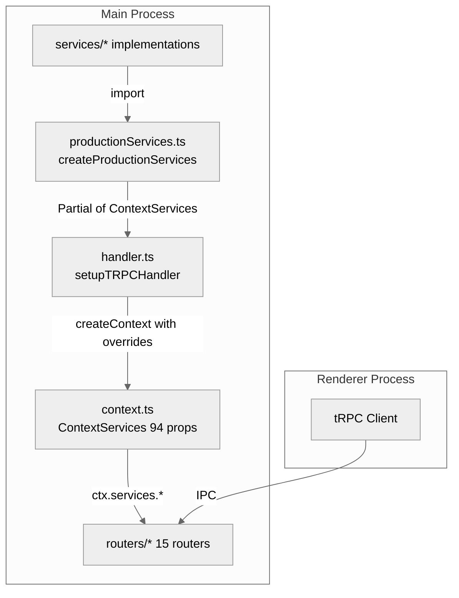
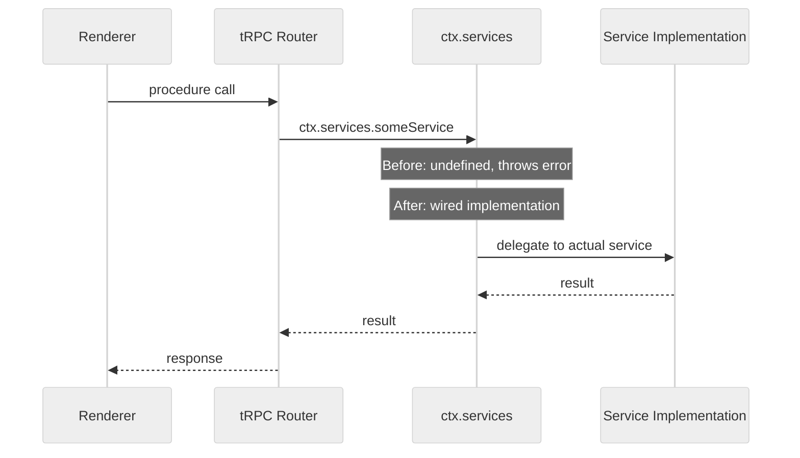

# Design: tRPC Service Wiring Completion

## Overview

**Purpose**: `trpc-full-migration` マージ（b2d39af8）で発生したDI配線漏れ（Phase 3）を完全に解消し、`ContextServices` の全94プロパティのうち72サービスを新規作成する `productionServices.ts` で配線する。併せて配線完全性の自動検証テストを追加し、将来のサービス追加時の配線漏れを構造的に防止する。

**Users**: アプリ利用者（全tRPCルーター経由の操作が正常動作する）および開発者（配線漏れを自動検出できる）。

**Impact**: 現在未配線の72サービスを配線することで、Agent操作、Install操作、Git/Worktree操作、SSH接続、リモートアクセス、メトリクス、自動実行、Cloudflare、MCP、スケジュールタスク等の全機能が本番環境で正常動作するようになる。

### Goals

- `productionServices.ts` が `ContextServices` の配線対象72プロパティを配線する（`handler.ts` 注入分と合わせて配線率100%）
- 配線完全性を自動検証するテストにより、将来の配線漏れを構造的に防止する
- 既存847テスト・TypeScriptコンパイル・ビルドの回帰互換性を維持する

### Non-Goals

- `webSocketHandler.ts` のDI化（独自import経路で正常動作中、スコープ外）
- `ContextServices` インターフェースの型リファクタリング（`Record<string, unknown>` を具体型に変更等）
- ルーター側の防御パターン（`if (!ctx.services.X) throw`）の変更
- 新規サービスの追加

## Architecture

### Existing Architecture Analysis



**Key Decisions**:
- Phase 2で確立した `createProductionServices()` パターンをそのまま踏襲する（新規アーキテクチャ不要）
- 72サービスの実装は全て既存サービスクラス/モジュールに存在する（新規ロジック不要）
- 各サービスの配線は、既存シングルトン/ファクトリの呼び出しまたは関数ラッパーで完結する

### Technology Stack

| Layer | Choice / Version | Role in Feature | Notes |
|-------|------------------|-----------------|-------|
| Backend / Services | TypeScript 5.8+, Node.js 20+ | 66サービスの配線コード | 既存パターン踏襲 |
| Infrastructure / Runtime | Vitest | 配線完全性テスト | 既存テストフレームワーク |

## System Flows

本機能は配線のみであり、新しいデータフローは導入しない。既存の以下のフローが正常動作するようになる。



**Key Decisions**:
- 配線パターンは既存Phase 2の3パターン（シングルトン参照、インスタンス生成、関数ラッパー）を使い分ける
- 一部サービス（`showOpenDialog`, `createNewWindow`）はElectron APIへの直接ラッパーとして配線する
- プロジェクトパス依存サービスは `getCurrentProjectPath()` を配線時にキャプチャせず、呼び出し時に解決するクロージャパターンを使用する

## Requirements Traceability

| Criterion ID | Summary | Components | Implementation Approach |
|--------------|---------|------------|------------------------|
| 1.1 | listProjectFiles配線 | productionServices.ts | projectFileUtils.listProjectFilesCore をラップ |
| 1.2 | readProjectFile配線 | productionServices.ts | projectFileUtils.readProjectFileCore をラップ |
| 1.3 | writeProjectFile配線 | productionServices.ts | projectFileUtils.writeProjectFileCore をラップ |
| 2.1 | showOpenDialog配線 | productionServices.ts | electron.dialog.showOpenDialog ラッパー |
| 2.2 | createNewWindow配線 | productionServices.ts | createWindow 関数参照 |
| 3.1 | bugsWatcherStart配線 | productionServices.ts | bugsWatcherService シングルトン参照 |
| 3.2 | bugsWatcherStop配線 | productionServices.ts | bugsWatcherService シングルトン参照 |
| 3.3 | bugWorktreeCreate配線 | productionServices.ts | bugWorkflowService 参照 |
| 3.4 | bugWorktreeRemove配線 | productionServices.ts | bugWorkflowService 参照 |
| 3.5 | bugWorktreeAutoExecution配線 | productionServices.ts | bugWorkflowService 参照 |
| 3.6 | bugConvertToWorktree配線 | productionServices.ts | convertBugWorktreeService 参照 |
| 3.7 | validateWorktreeMainBranch配線 | productionServices.ts | worktreeService 参照 |
| 4.1 | confirmCommonCommands配線 | productionServices.ts | commandInstallerService 参照 |
| 5.1 | agentStop配線 | productionServices.ts | agentLifecycleSetup 参照 |
| 5.2 | agentGetLogs配線 | productionServices.ts | logParserService 参照 |
| 5.3 | agentGetRunningCounts配線 | productionServices.ts | agentRecordService 参照 |
| 5.4 | agentCheckFolderExists配線 | productionServices.ts | fs.access ラッパー |
| 5.5 | agentDeleteFolder配線 | productionServices.ts | fs.rm ラッパー |
| 6.1 | gitGetStatus配線 | productionServices.ts | GitService 参照 |
| 6.2 | gitGetDiff配線 | productionServices.ts | GitService 参照 |
| 6.3 | gitWatchChanges配線 | productionServices.ts | GitService 参照 |
| 6.4 | gitUnwatchChanges配線 | productionServices.ts | GitService 参照 |
| 6.5 | worktreeCheckMain配線 | productionServices.ts | worktreeService 参照 |
| 6.6 | worktreeCreate配線 | productionServices.ts | worktreeService 参照 |
| 6.7 | worktreeRemove配線 | productionServices.ts | worktreeService 参照 |
| 6.8 | worktreeResolvePath配線 | productionServices.ts | worktreeService 参照 |
| 6.9 | worktreeImplStart配線 | productionServices.ts | worktreeService 参照 |
| 6.10 | normalModeImplStart配線 | productionServices.ts | worktreeService 参照 |
| 6.11 | worktreeRebaseFromMain配線 | productionServices.ts | worktreeService 参照 |
| 6.12 | convertCheck配線 | productionServices.ts | convertWorktreeService 参照 |
| 6.13 | convertToWorktree配線 | productionServices.ts | convertWorktreeService 参照 |
| 7.1 | installProjectChecker配線 | productionServices.ts | ProjectChecker 参照 |
| 7.2 | installCommandInstallerService配線 | productionServices.ts | CommandInstallerService 参照 |
| 7.3 | installUnifiedCommandsetInstaller配線 | productionServices.ts | UnifiedCommandsetInstaller 参照 |
| 7.4 | installExperimentalToolsInstaller配線 | productionServices.ts | ExperimentalToolsInstallerService 参照 |
| 7.5 | installCommandsetVersionService配線 | productionServices.ts | CommandsetVersionService 参照 |
| 7.6 | installGetCliInstallStatus配線 | productionServices.ts | cliInstallerService 参照 |
| 7.7 | installInstallCliCommand配線 | productionServices.ts | cliInstallerService 参照 |
| 7.8 | installGetManualInstallInstructions配線 | productionServices.ts | cliInstallerService 参照 |
| 7.9 | installMigrationService配線 | productionServices.ts | MigrationService 参照 |
| 7.10 | installCheckJjAvailability配線 | productionServices.ts | toolPathResolverService 参照 |
| 7.11 | installInstallJj配線 | productionServices.ts | jjInstaller 参照 |
| 7.12 | installIgnoreJjInstall配線 | productionServices.ts | layoutConfigService 参照 |
| 8.1 | reportIdleTime配線 | productionServices.ts | idleTimeTracker 参照 |
| 9.1-9.22 | misc 22サービス配線 | productionServices.ts | 各種サービスシングルトン参照 |
| 9.23 | autoExecutionCoordinator配線 | productionServices.ts | AutoExecutionCoordinator シングルトン参照 |
| 9.24 | bugAutoExecutionCoordinator配線 | productionServices.ts | BugAutoExecutionCoordinator シングルトン参照 |
| 9.25 | cloudflareService配線 | productionServices.ts | CloudflareService シングルトン参照 |
| 9.26 | mcpServerService配線 | productionServices.ts | McpServerService シングルトン参照 |
| 9.27 | scheduleTaskService配線 | productionServices.ts | ScheduleTaskService シングルトン参照 |
| 9.28 | scheduleTaskCoordinator配線 | productionServices.ts | ScheduleTaskCoordinator シングルトン参照 |
| 10.1 | 配線キーセット一致テスト | productionServices.test.ts | ContextServices keys vs productionServices keys |
| 10.2 | 新プロパティ追加時の検出 | productionServices.test.ts | キーセット差分検出 |
| 10.3 | mockServicesキーセット一致テスト | productionServices.test.ts | mockServices keys vs productionServices keys |
| 10.4 | エラーメッセージの明示性 | productionServices.test.ts | 差分サービス名の列挙 |
| 11.1 | 既存テスト回帰 | 全テスト | 847テストがパスすること |
| 11.2 | TypeScriptコンパイル | typecheck | npm run typecheck 成功 |
| 11.3 | ビルド成功 | build | npm run build 成功 |

### Coverage Validation Checklist

- [x] Every criterion ID from requirements.md appears in the table above
- [x] Each criterion has specific component names (not generic references)
- [x] Implementation approach distinguishes "reuse existing" vs "new implementation"
- [x] User-facing criteria specify concrete components

## Components and Interfaces

| Component | Domain/Layer | Intent | Req Coverage | Key Dependencies | Contracts |
|-----------|--------------|--------|--------------|-----------------|-----------|
| productionServices.ts | DI Assembly | 72サービスの配線追加 | 1-9 全て | 全ドメインサービスシングルトン (P0) | Service |
| productionServices.test.ts | Testing | 配線完全性検証テスト | 10.1-10.4 | ContextServices (P0), createMockServices (P0) | - |

### DI Assembly Layer

#### productionServices.ts (新規作成)

| Field | Detail |
|-------|--------|
| Intent | `productionServices.ts` を新規作成し、72サービスの配線を実装して `ContextServices` 全プロパティの配線率を100%にする。`productionServices.ts` は72プロパティを返し、`handler.ts` で `eventBus`, `getInitialSelectResult`, `clearInitialSelectResult` が追加マージされる。**重要**: `createProductionServices()` は `eventBus`, `getInitialSelectResult`, `clearInitialSelectResult` を返さない。これら3プロパティは `handler.ts` が直接注入・管理する（`handler.ts` のマージ順序上、`serviceOverrides` が後からスプレッドされるため、含めると上書きリスクがある）。配線完全性テストは最終的にcontextに注入される全キーセット（= `createMockServices()` のキーセット）を検証対象とする |
| Requirements | 1.1-1.3, 2.1-2.2, 3.1-3.7, 4.1, 5.1-5.5, 6.1-6.13, 7.1-7.12, 8.1, 9.1-9.22 |

**Responsibilities & Constraints**
- `createProductionServices()` が返す `Partial<ContextServices>` に72プロパティを追加
- 各配線は既存サービスのシングルトン参照、インスタンス生成、または関数ラッパーで実装
- Electron API（`dialog`, `clipboard`, `shell`, `BrowserWindow`）への依存はモジュールトップレベルimportで解決

**Dependencies**
- Outbound: projectFileUtils -- File操作 (P0)
- Outbound: bugWorkflowService, convertBugWorktreeService -- Bug Worktree操作 (P0)
- Outbound: agentLifecycleSetup, logParserService, agentRecordService -- Agent操作 (P0)
- Outbound: GitService, worktreeService, convertWorktreeService -- Git/Worktree操作 (P0)
- Outbound: projectChecker, commandInstallerService, unifiedCommandsetInstaller -- Install操作 (P0)
- Outbound: experimentalToolsInstallerService, commandsetVersionService -- Install操作 (P1)
- Outbound: cliInstallerService -- CLI操作 (P1)
- Outbound: MigrationService -- マイグレーション (P1)
- Outbound: remoteAccessSetup -- リモートサーバー (P0)
- Outbound: sshConnectionService -- SSH操作 (P0)
- Outbound: metricsService -- メトリクス (P1)
- Outbound: permissionsService -- パーミッション (P1)
- Outbound: idleTimeTracker -- アイドル監視 (P1)
- Outbound: projectLogger -- ログ転送 (P2)
- External: electron (dialog, clipboard, shell, BrowserWindow) (P0)

**Contracts**: Service [x]

##### Service Interface

```typescript
// productionServices.ts の返却型に追加される66プロパティ
// (ContextServices のオプショナルプロパティ群)

// 既存の createProductionServices() シグネチャは変更なし
function createProductionServices(): Partial<ContextServices>;
```

- Preconditions: Electron app が ready 状態であること（`app.whenReady()` 後に呼ばれる）
- Postconditions: 返却されるオブジェクトの全キーが `ContextServices` のプロパティ名に含まれること
- Invariants: 返却オブジェクトのキーセットが `ContextServices` の非メソッドプロパティの完全集合であること

**Implementation Notes**
- Integration: ドメインセクションコメント区切りで追加（File, Project, Bug, Spec, Agent, Git, Install, Schedule, Misc）
- Validation: `showOpenDialog`, `createNewWindow` はウィンドウ参照の取得方法を実装時に確認（`handler.ts` の `window` パラメータとの連携）
- Risks: 一部サービスの初期化タイミング（`getSpecManagerService` 未初期化時の遅延呼び出し）

### Testing Layer

#### 配線完全性テスト (productionServices.test.ts 拡張)

| Field | Detail |
|-------|--------|
| Intent | `productionServices.ts` のキーセットと `ContextServices` / `createMockServices()` のキーセットの一致を検証する |
| Requirements | 10.1-10.4 |

**Responsibilities & Constraints**
- `createProductionServices()` が返すキーと `ContextServices` 型の全プロパティキーの一致を検証
- `createMockServices()` が返すキーとの差分を検出
- 将来のサービス追加時に配線漏れをCI段階で検出
- エラーメッセージに未配線サービス名を明示

**Dependencies**
- Inbound: productionServices.ts -- テスト対象 (P0)
- Inbound: context.ts -- ContextServices 型定義 (P0)
- Inbound: test-helpers.ts -- createMockServices (P0)

**Contracts**: Service [x]

##### Service Interface

```typescript
// テストケース定義（概念的インターフェース）

interface WiringCompletenessTest {
  /** productionServicesのキーがContextServicesの全プロパティを含むことを検証 */
  verifyProductionKeysMatchContextServices(): void;

  /** ContextServicesに新プロパティ追加時にテスト失敗で検出 */
  detectUnwiredNewProperties(): void;

  /** mockServicesとproductionServicesのキーセット差分検出 */
  verifyMockAndProductionKeyConsistency(): void;

  /** 未配線サービス名をエラーメッセージに含める */
  reportMissingServicesInErrorMessage(): void;
}
```

- Preconditions: `createProductionServices()` および `createMockServices()` がインポート可能であること
- Postconditions: テスト通過時、配線率100%が保証される
- Invariants: テストは `ContextServices` 型変更に追従して自動的に配線漏れを検出する

## Error Handling

### Error Strategy

本機能は配線のみであり、新しいエラーパターンは導入しない。配線完了後、既存ルーターの防御パターン（`if (!ctx.services.X) throw TRPCError`）が本番環境で到達不能コードとなる。

### Error Categories and Responses

| カテゴリ | 配線前（現状） | 配線後 |
|---------|--------------|--------|
| サービス未初期化 | `INTERNAL_SERVER_ERROR: "X not available"` | 到達しない（配線済み） |
| プロジェクト未選択 | `PRECONDITION_FAILED: "Project not selected"` | 変更なし（ルーター側の責務） |

## Testing Strategy

### Unit Tests

1. **配線完全性テスト**: `createProductionServices()` は72プロパティを返す（handler.ts注入分の `eventBus`, `getInitialSelectResult`, `clearInitialSelectResult` は含まない）。テスト検証式: `Object.keys(createProductionServices())` ⊇ `Object.keys(createMockServices()) \ {eventBus, getInitialSelectResult, clearInitialSelectResult}`。**前提条件**: `createMockServices()` に `confirmCommonCommands` のモック定義を追加すること（現在93キー → 追加後94キー）。`createMockServices()` のキーセットをベースラインとして使用する
2. **Mock一致性テスト**: `createMockServices()` のキーセットからhandler.ts注入分3件（`eventBus`, `getInitialSelectResult`, `clearInitialSelectResult`）を除いた集合と、`createProductionServices()` のキーセットが一致することを検証
3. **個別サービス配線テスト**: 新規追加された72サービスの代表的なもの（各ドメイン1-2個）が非null/undefinedであることを検証

### Regression Tests

4. **既存847テスト**: 全テストがパスすることを `npm run test:run` で確認
5. **TypeScriptコンパイル**: `npm run typecheck` が成功すること
6. **ビルド**: `npm run build` が成功すること

## Design Decisions

### DD-001: 既存 createProductionServices() パターンの踏襲

| Field | Detail |
|-------|--------|
| Status | Accepted |
| Context | 72サービスの配線をどのアーキテクチャパターンで実装するか |
| Decision | Phase 2で確立した `createProductionServices()` 関数に直接追加する |
| Rationale | 既に26サービスが同パターンで配線済み。新規ファイル・新規アーキテクチャは不要。一箇所に集約することでDI配線の全体像が把握しやすい |
| Alternatives Considered | (A) ドメイン別ファクトリ分割（fileServicesFactory.ts, bugServicesFactory.ts 等）-- 過剰な抽象化、YAGNIに反する (B) 自動登録パターン（decorator/reflection ベース）-- TypeScriptのreflectionサポートが限定的、複雑性増大 |
| Consequences | `productionServices.ts` のファイルサイズが増加するが、ドメインセクションコメントで可読性を維持する |

### DD-002: キーセット比較による配線完全性テスト

| Field | Detail |
|-------|--------|
| Status | Accepted |
| Context | 将来のサービス追加時に配線漏れを自動検出する手段が必要 |
| Decision | `Object.keys(createProductionServices())` と `ContextServices` 型のキーリストを比較するランタイムテストを作成する |
| Rationale | TypeScriptの型情報はランタイムに消えるため、`ContextServices` のキーリストはテスト内でハードコードまたは `createMockServices()` のキーセットを正解とする。`createMockServices()` は全プロパティを網羅しているため、これとの差分検出が最も信頼性が高い |
| Alternatives Considered | (A) TypeScript compiler APIでの型キー抽出 -- テスト実行が重く、CIパイプラインに不向き (B) コード生成ツール -- メンテナンスコストが高い |
| Consequences | `createMockServices()` にプロパティが追加された場合、`productionServices.ts` にも配線が必要であることがテストで強制される。関係: 10.1-10.4 |

### DD-003: showOpenDialog / createNewWindow のウィンドウ参照解決

| Field | Detail |
|-------|--------|
| Status | Accepted |
| Context | `showOpenDialog` は `BrowserWindow.getFocusedWindow()` を、`createNewWindow` は `createWindow()` 関数を必要とする。`productionServices.ts` はウィンドウ参照を直接持たない |
| Decision | `showOpenDialog` は `BrowserWindow.getFocusedWindow()` または `BrowserWindow.getAllWindows()[0]` をフォールバックとして使用。`createNewWindow` は `index.ts` の `createWindow` 関数への参照を渡す |
| Rationale | `productionServices.ts` はアプリ起動時に一度だけ呼ばれるため、ウィンドウ参照は遅延解決（呼び出し時取得）が必要。`BrowserWindow.getFocusedWindow()` はElectron APIとして標準的なパターン |
| Alternatives Considered | `handler.ts` の `window` パラメータを `productionServices` に渡す -- `createProductionServices()` のシグネチャ変更が必要になり影響範囲が広い |
| Consequences | `showOpenDialog` はフォーカスウィンドウがない場合（極めて稀）に `null` を返す |

### DD-004: プロジェクトパス依存サービスのクロージャパターン

| Field | Detail |
|-------|--------|
| Status | Accepted |
| Context | `bugWorktreeCreate` 等のサービスはプロジェクトパスを必要とするが、`createProductionServices()` 呼び出し時点ではプロジェクト未選択の場合がある |
| Decision | `getCurrentProjectPath()` を配線時にキャプチャせず、各サービスの呼び出し時に `getCurrentProjectPath()` を評価するクロージャとして配線する |
| Rationale | プロジェクトパスは動的に変化する（ユーザーがプロジェクトを切り替える）。配線時にキャプチャすると古いパスが使われるリスクがある |
| Alternatives Considered | 配線時にキャプチャ -- プロジェクト切り替え時に再配線が必要になり複雑化 |
| Consequences | 各クロージャ内で `getCurrentProjectPath()` のnullチェックが必要。ルーター側でも同様のチェックが既に存在するため、二重チェックとなるが安全性を優先する |

## Integration & Deprecation Strategy (結合・廃止戦略)

### 変更が必要な既存ファイル (Wiring Points)

| ファイル | 変更内容 |
|---------|---------|
| `src/main/trpc/productionServices.ts` | **新規作成**: `createProductionServices()` 関数を実装し、72サービスを配線 |
| `src/main/trpc/__tests__/productionServices.test.ts` | **新規作成**: 72サービスの配線テスト + 配線完全性テスト |
| `src/main/index.ts` (または `createWindow` 呼び出し元) | `createProductionServices()` を呼び出し、`setupTRPCHandler(window, productionServices)` に渡す |

### 削除が必要なファイル (Cleanup)

なし。既存ファイルの削除は不要。

### 新規作成ファイル

| ファイル | 内容 |
|---------|---------|
| `src/main/trpc/productionServices.ts` | `createProductionServices()` 関数。72サービスの配線を実装 |
| `src/main/trpc/__tests__/productionServices.test.ts` | 配線完全性テスト |

### 注入パス（productionServices → handler.ts）

`createProductionServices()` の返却値を `handler.ts` の `setupTRPCHandler` に渡すフロー:

```
index.ts createWindow()
  → import { createProductionServices } from './trpc/productionServices'
  → const services = createProductionServices()
  → setupTRPCHandler(window, services)
    → handler.ts merges with eventBus, getInitialSelectResult, clearInitialSelectResult
    → createContext(mergedOverrides)
```

`createProductionServices()` は `index.ts` の `createWindow()` 内で呼び出され、結果を `setupTRPCHandler` の `serviceOverrides` パラメータとして渡す。`handler.ts` は既存の `eventBus` 等と `...serviceOverrides` をマージする。

**注意**: `handler.ts` のマージ順序は `{eventBus, getInitialSelectResult, clearInitialSelectResult, ...serviceOverrides}` であるため、`serviceOverrides`（= `createProductionServices()` の返却値）がこれら3プロパティを含むとhandler.ts側の値が上書きされる。`createProductionServices()` はこれら3プロパティを返さないこと。

## Interface Changes & Impact Analysis (インターフェース変更と影響分析)

### 変更されるインターフェース

`createProductionServices()` の返却値が `Partial<ContextServices>` のまま変更なし。ただし、返却されるオブジェクトのプロパティ数が0から72に増加する（新規作成ファイル）。

### 呼び出し側への影響

| Callee | 変更内容 | Caller | 影響 |
|--------|---------|--------|------|
| `createProductionServices()` | 返却プロパティ数増加（0→72、新規作成） | `handler.ts setupTRPCHandler` | **影響なし** -- `Partial<ContextServices>` 型のまま、スプレッドで受け取るため後方互換 |

既存のメソッドシグネチャの変更はないため、Caller側の更新タスクは不要。

## Integration Test Strategy

### 配線完全性統合テスト

| 項目 | 内容 |
|------|------|
| **Components** | `productionServices.ts`, `context.ts` (`ContextServices`), `test-helpers.ts` (`createMockServices`) |
| **Data Flow** | `createProductionServices()` → keys extraction → comparison with `ContextServices` keys |
| **Mock Boundaries** | 各サービスシングルトンは既存テストと同様にモック化。`ContextServices` のキーリストは `createMockServices()` の返却キーを正解とする |
| **Verification Points** | (1) productionServices keys === mockServices keys (2) productionServices keys が ContextServices の全プロパティを含む (3) 差分がある場合に未配線サービス名がエラーメッセージに含まれる |
| **Robustness Strategy** | キーセット比較は同期的な操作のため、非同期タイミングの問題は発生しない。テストは `Object.keys()` の返却値比較で決定論的に動作する |
| **Prerequisites** | 既存の `productionServices.test.ts` のモック基盤をそのまま活用。新規テストインフラは不要 |
